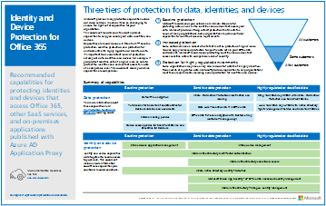

# Ressources relatives à l’architecture informatique du cloud MicrosoftMicrosoft cloud IT architecture resources

 **Résumé** : apprenez les concepts de base de l’architecture cloud pour l’identité, la sécurité, la mise en réseau et l’hybridation Microsoft. Passez en revue les recommandations normatives pour la protection des fichiers, des identités et des appareils lors de l'utilisation du cloud de Microsoft. Apprenez à déployer un poste de travail moderne et sécurisé avec Windows 10 et Office ProPlus.**Summary:** Learn core cloud architecture concepts for Microsoft identity, security, networking, and hybrid. Review prescriptive recommendations for protecting files, identities, and devices when using Microsoft's cloud. Learn how to deploy a modern and secure desktop with Windows 10 and Office ProPlus.
  
Ces affiches et outils relatifs à l’architecture fournissent des informations sur les services de cloud computing Microsoft (notamment Office 365, Windows 10, Azure Active Directory, Microsoft Intune, Microsoft Dynamics 365), mais aussi sur les solutions hybrides locales et cloud. Ces ressources permettent aux architectes et décisionnaires informatiques d’identifier la solution adaptée à leurs charges de travail et de prendre les décisions adéquates pour leurs composants d'infrastructure de base tels que l’identité et la sécurité.These architecture tools and posters give you information about Microsoft cloud services, including Office 365, Windows 10, Azure Active Directory, Microsoft Intune, Microsoft Dynamics 365, and hybrid on-premises and cloud solutions. IT decision makers and architects can use these resources to determine the ideal solutions for their workloads and to make decisions about core infrastructure components such as identity and security. 
  
<!--**[Microsoft's Enterprise Cloud Roadmap](microsoft-cloud-it-architecture-resources.md#roadmap)** (Sway) -->
    
- **[Série de documents sur le cloud Microsoft pour les architectes d’entreprise](microsoft-cloud-it-architecture-resources.md#cloudarch)** 
    **[Microsoft cloud for enterprise architects series](microsoft-cloud-it-architecture-resources.md#cloudarch)**<!-- [Microsoft Cloud Services and Platform Options](microsoft-cloud-it-architecture-resources.md#platformoptions) -->
    - [L’identité dans le cloud Microsoft pour les architectes d’entrepriseMicrosoft cloud identity for enterprise architects](microsoft-cloud-it-architecture-resources.md#identity)
    - [La sécurité dans le cloud Microsoft pour les architectes d’entrepriseMicrosoft cloud security for enterprise architects](microsoft-cloud-it-architecture-resources.md#security)
    - [La mise en réseau dans le cloud Microsoft pour les architectes d’entrepriseMicrosoft cloud networking for enterprise architects](microsoft-cloud-it-architecture-resources.md#networking)
    - [L’hybridation dans le cloud Microsoft pour les architectes d’entrepriseMicrosoft hybrid cloud for enterprise architects](microsoft-cloud-it-architecture-resources.md#hybrid)
    - [Les attaques courantes et les fonctionnalités Microsoft pour protéger votre organisationCommon attacks and Microsoft capabilities that protect your organization](#common-attacks-and-microsoft-capabilities-that-protect-your-organization)
    
- **[Série de solutions Microsoft 365 Entreprise](microsoft-cloud-it-architecture-resources.md#BKMK_o365solutions)**:**[Microsoft 365 enterprise solution series](microsoft-cloud-it-architecture-resources.md#BKMK_o365solutions)**:
    - [Microsoft Teams et services de productivité connexes dans Microsoft 365 pour les architectes informatiqueMicrosoft Teams and related productivity services in Microsoft 365 for IT architects](#microsoft-teams-and-related-productivity-services-in-microsoft-365-for-it-architects)
    - [Groupes dans Microsoft 365 pour les architectes informatiqueGroups in Microsoft 365 for IT architects](#groups-in-microsoft-365-for-it-architects)
    - [La protection des appareils et de l’identité pour Office 365Identity and device protection for Office 365](microsoft-cloud-it-architecture-resources.md#BKMK_O365IDP)
    - [Les solutions de protection des fichiers dans Office 365File protection solutions in Office 365](microsoft-cloud-it-architecture-resources.md#BKMK_O365fileprotect)
    - [Protection des informations Office 365 pour le RGPDOffice 365 Information Protection for GDPR](#office-365-information-protection-for-gdpr)
    - [Conseils de sécurité Microsoft pour les campagnes électorales, les organisations à but non lucratif et d’autres organisations flexiblesMicrosoft Security Guidance for Political Campaigns, Nonprofits, and Other Agile Organizations](#microsoft-security-guidance-for-political-campaigns-nonprofits-and-other-agile-organizations)
    - [Détails sur les solutions téléphoniques Microsoft TelephonyMicrosoft Telephony Solutions](#microsoft-telephony-solutions) 
    - [Le déploiement d’un poste de travail moderne et sécurisé avec MicrosoftDeploy a modern and secure desktop with Microsoft](microsoft-cloud-it-architecture-resources.md#msd)
    

  
Faites-nous savoir ce que vous en pensez ! Écrivez-nous à l’adresse [cloudadopt@microsoft.com](mailto:cloudadopt@microsoft.com).Let us know what you think! Send us email at [cloudadopt@microsoft.com](mailto:cloudadopt@microsoft.com). 

<!--

## Microsoft's Enterprise Cloud Roadmap

See the posters, icon sets, community venues, and other resources that describe the industry's most complete cloud solution.
  
|**Item**|**Description**|
|:-----|:-----|
|[          ](https://aka.ms/cloudarchitecture)   [Microsoft's Enterprise Cloud Roadmap](https://aka.ms/cloudarchitecture) (https://aka.ms/cloudarchitecture)   |Swipe through this Sway experience for the resources that describe the industry's most complete cloud solution.    |
-->
  

##Série de documents sur le cloud Microsoft pour les architectes d’entreprise## Microsoft cloud for enterprise architects series

Ces affiches relatives à l’architecture cloud fournissent des informations sur les services de cloud computing Microsoft (notamment Office 365, Azure Active Directory, Microsoft Intune, Microsoft Dynamics CRM Online), mais aussi sur les solutions hybrides locales et cloud. Ces ressources permettent aux architectes et décisionnaires informatiques d’identifier la solution adaptée à leurs charges de travail et de prendre les décisions adéquates pour leurs composants d'infrastructure de base tels que l’identité et la sécurité.These cloud architecture posters give you information about Microsoft cloud services, including Office 365, Azure Active Directory, Microsoft Intune, Microsoft Dynamics CRM Online, and hybrid on-premises and cloud solutions. IT decision makers and architects can use these resources to determine the ideal solutions for their workloads and to make decisions about core infrastructure components such as identity and security.

<!--  

### Microsoft Cloud Services and Platform Options

Learn key differences between Microsoft cloud services and platform offerings. Find the best fit for your solution.
  
|**Item**|**Description**|
|:-----|:-----|
|[          ](https://www.microsoft.com/download/details.aspx?id=54432)   [PDF](https://go.microsoft.com/fwlink/p/?LinkId=524731)  \| [Visio](https://go.microsoft.com/fwlink/p/?LinkId=524732)  \| [More languages](https://www.microsoft.com/download/details.aspx?id=54432)   | This model describes: <ul><li>  Software as a Service (SaaS) offerings, including Office 365 </li><li>  Platform as a Service (PaaS) features in Microsoft Azure </li><li>  Infrastructure as a Service (IaaS) features in Microsoft Azure </li><li>  Private cloud datacenter capabilities using Windows Server and System Center </li><li>  Learn how Microsoft's own IT department is migrating to these cloud services and building its hybrid cloud. </li></ul> |
-->

   

### L’identité dans le cloud Microsoft pour les architectes d’entreprise### Microsoft cloud identity for enterprise architects

Découvrez tout ce que les architectes informatiques doivent savoir sur la conception d’identité pour les organisations utilisant des plateformes et des services de cloud computing Microsoft.What IT architects need to know about designing identity for organizations using Microsoft cloud services and platforms.
  
|**Élément****Item**|**Description****Description**|
|:-----|:-----|
|[          ](https://www.microsoft.com/download/details.aspx?id=54431)[          ](https://www.microsoft.com/download/details.aspx?id=54431)   [PDF](https://go.microsoft.com/fwlink/p/?LinkId=524586)  \| [Visio](https://download.microsoft.com/download/2/3/8/238228E6-9017-4F6C-BD3C-5559E6708F82/MSFT_cloud_architecture_identity.vsd)           \| [Autres langues](https://www.microsoft.com/download/details.aspx?id=54431)[PDF](https://go.microsoft.com/fwlink/p/?LinkId=524586)  \| [Visio](https://download.microsoft.com/download/2/3/8/238228E6-9017-4F6C-BD3C-5559E6708F82/MSFT_cloud_architecture_identity.vsd)           \| [More languages](https://www.microsoft.com/download/details.aspx?id=54431)   | Ce modèle contient :This model contains: <ul><li>Introduction aux identités avec le cloud de MicrosoftIntroduction to identity with Microsoft’s cloud </li><li>Fonctions IDaaS d’Azure ADAzure AD IDaaS capabilities </li><li>Intégration de comptes Active Directory Domain Services locaux avec Microsoft Azure Active DirectoryIntegrating on-premises Active Directory Domain Services accounts with Microsoft Azure Active Directory </li><li>Placement de composants d’annuaire dans AzurePutting directory components in Azure </li><li>Options des services de domaine pour les charges de travail dans Azure IaaSDomain services options for workloads in Azure IaaS </li></ul> |
   

### La sécurité dans le cloud Microsoft pour les architectes d’entrepriseMicrosoft cloud security for enterprise architects

Découvrez tout ce que les architectes informatiques doivent savoir sur la sécurité dans les plateformes et les services de cloud computing Microsoft.What IT architects need to know about security in Microsoft cloud services and platforms.
  
|**Élément****Item**|**Description****Description**|
|:-----|:-----|
|[          ](https://www.microsoft.com/download/details.aspx?id=48121)[          ](https://www.microsoft.com/download/details.aspx?id=48121)   [PDF](https://go.microsoft.com/fwlink/p/?linkid=842070)  \| [Visio](https://go.microsoft.com/fwlink/p/?LinkId=842071)  \| [Autres langues](https://www.microsoft.com/download/details.aspx?id=48121)[PDF](https://go.microsoft.com/fwlink/p/?linkid=842070)  \| [Visio](https://go.microsoft.com/fwlink/p/?LinkId=842071)  \| [More languages](https://www.microsoft.com/download/details.aspx?id=48121)   | Ce modèle contient :This model contains: <ul><li>Rôle de Microsoft en tant que fournisseur de services et de plateformes sécurisésMicrosoft's role in providing secure services and platforms</li><li>Responsabilités du client pour limiter les risques de sécuritéCustomer responsibilities to mitigate security risks</li><li>Certifications de sécurité de premier planTop security certifications </li><li>Offres de sécurité fournies par les services de conseil de MicrosoftSecurity offerings provided by Microsoft consulting services </ul> |
   

### La mise en réseau dans le cloud Microsoft pour les architectes d’entrepriseMicrosoft cloud networking for enterprise architects

Découvrez tout ce que les architectes informatiques doivent savoir sur la mise en réseau pour les plateformes et les services de cloud computing Microsoft.What IT architects need to know about networking for Microsoft cloud services and platforms.
  
|**Élément****Item**|**Description****Description**|
|:-----|:-----|
|[          ](https://www.microsoft.com/download/details.aspx?id=54425)[          ](https://www.microsoft.com/download/details.aspx?id=54425)   [PDF](https://go.microsoft.com/fwlink/p/?linkid=842073)  \| [Visio](https://go.microsoft.com/fwlink/p/?linkid=842074)           \| [Article](https://technet.microsoft.com/library/mt733214.aspx)[PDF](https://go.microsoft.com/fwlink/p/?linkid=842073)  \| [Visio](https://go.microsoft.com/fwlink/p/?linkid=842074)           \| [Article](https://technet.microsoft.com/library/mt733214.aspx)  [Autres languesMore languages](https://www.microsoft.com/download/details.aspx?id=54425)   | Ce modèle contient les pages suivantes :This model contains the following pages: <ul><li> **Évolution de votre réseau pour la connectivité au cloud** La migration vers le cloud modifie le volume et la nature des flux de trafic internes et externes à un réseau d'entreprise. Elle a également une incidence sur les approches permettant de réduire les risques de sécurité.**Evolving your network for cloud connectivity** Cloud migration changes the volume and nature of traffic flows within and outside a corporate network. It also affects approaches to mitigating security risk. </li><li> **Éléments communs de la connectivité au cloud Microsoft** L'intégration de votre réseau au cloud Microsoft offre un accès optimal à une large gamme de services.**Common elements of Microsoft cloud connectivity** Integrating your networking with the Microsoft cloud provides optimal access to a broad range of services. </li><li> **ExpressRoute pour la connectivité cloud Microsoft** ExpressRoute fournit une connexion réseau haut débit privée et dédiée au cloud Microsoft.**ExpressRoute for Microsoft cloud connectivity** ExpressRoute provides a private, dedicated, high-throughput network connection to Microsoft's cloud. </li><li> **Conception de réseaux pour Microsoft SaaS (Office 365, Microsoft Intune et Dynamics CRM Online)** L'optimisation de votre réseau pour les services Microsoft SaaS nécessite une analyse approfondie d'Internet Edge, de vos périphériques client et des opérations informatiques courantes.**Designing networking for Microsoft SaaS (Office 365, Microsoft Intune, and Dynamics CRM Online)** Optimizing your network for Microsoft SaaS services requires careful analysis of your Internet edge, your client devices, and typical IT operations. </li><li> **Conception de réseaux pour Azure PaaS** L'optimisation du réseau pour les applications Azure PaaS requiert une bande passante Internet appropriée et peut nécessiter la distribution du trafic réseau sur plusieurs sites ou applications.**Designing networking for Azure PaaS** Optimizing networking for Azure PaaS apps requires adequate Internet bandwidth and can require the distribution of network traffic across multiple sites or apps. </li><li> **Conception de réseaux pour Azure IaaS** Suivez le processus de conception pour créer un réseau virtuel Azure optimal pour l'hébergement des charges de travail informatiques basées sur serveur IT, y compris les sous-réseaux, les espaces d'adressage, le routage, le DNS, l'équilibrage de charge et la connectivité avec votre réseau local, d'autres réseaux virtuels et Internet.**Designing networking for Azure IaaS** Step through the design process to create an optimal Azure virtual network (VNet) for hosting server-based IT workloads, including subnets, address spaces, routing, DNS, load balancing, and connectivity to your on-premises network, other VNets, and the Internet. </li></ul>    |
   
   

### L’hybridation dans le cloud Microsoft pour les architectes d’entrepriseMicrosoft hybrid cloud for enterprise architects

Tout ce que les architectes informatiques doivent savoir sur l’hybridation du cloud pour les plateformes et services Microsoft.What IT architects need to know about hybrid cloud for Microsoft services and platforms.
  
|**Élément****Item**|**Description****Description**|
|:-----|:-----|
|[          ](https://www.microsoft.com/download/details.aspx?id=54424)[          ](https://www.microsoft.com/download/details.aspx?id=54424)   [PDF](https://go.microsoft.com/fwlink/p/?linkid=842082)  \| [Visio](https://go.microsoft.com/fwlink/p/?linkid=842083)           \| [Article](https://technet.microsoft.com/library/mt750500.aspx)[PDF](https://go.microsoft.com/fwlink/p/?linkid=842082)  \| [Visio](https://go.microsoft.com/fwlink/p/?linkid=842083)           \| [Article](https://technet.microsoft.com/library/mt750500.aspx)  [Autres languesMore languages](https://www.microsoft.com/download/details.aspx?id=54424)   | Ce modèle contient les pages suivantes :This model contains the following pages: <ul><li> **Vue d'ensemble du cloud hybride** Offres du cloud Microsoft (SaaS, Azure PaaS et Azure IaaS) et leurs éléments communs.**Hybrid cloud overview** Microsoft's cloud offerings (SaaS, Azure PaaS, and Azure IaaS) and their common elements. </li><li> **Architecture des scénarios du cloud hybride de Microsoft** Diagramme d'architecture du cloud hybride pour les offres du cloud Microsoft, affichant les couches communes de l'infrastructure locale, le réseau et l'identité.**Architecture of Microsoft hybrid cloud scenarios** An architectural diagram of hybrid cloud for Microsoft's cloud offerings, showing the common layers of on-premises infrastructure, networking, and identity. </li><li> **Scénarios de cloud hybride pour Microsoft SaaS (Office 365)** Architecture de scénario SaaS hybride et descriptions des configurations hybrides clés pour Skype Entreprise, SharePoint Server et Exchange Server.**Hybrid cloud scenarios for Microsoft SaaS (Office 365)** The SaaS hybrid scenario architecture and descriptions of key hybrid configurations for Skype for Business, SharePoint Server, and Exchange Server. </li><li> **Scénarios de cloud hybride pour Azure PaaS** Architecture de scénario hybride pour Azure PaaS, description de l'application hybride Azure PaaS accompagnée d'un exemple et description de SQL Server 2016 Stretch Database.**Hybrid cloud scenarios for Azure PaaS** The Azure PaaS hybrid scenario architecture, the description of an Azure PaaS hybrid application with an example, and the description of SQL Server 2016 Stretch Database. </li><li> **Scénarios de cloud hybride pour Azure IaaS** Architecture de scénario hybride pour Azure IaaS et description d'une application métier hébergée dans Azure IaaS.**Hybrid cloud scenarios for Azure IaaS** The Azure IaaS hybrid scenario architecture and the description of a line of business (LOB) application hosted in Azure IaaS. </li></ul> |
   

### Attaques courantes et fonctionnalités Microsoft pour protéger votre organisationCommon attacks and Microsoft capabilities that protect your organization
Découvrez les cyberattaques les plus courantes et comment Microsoft peut aider votre organisation à chaque étape d’une attaque.Learn about the most common cyber attacks and how Microsoft can help your organization at every stage of an attack. 

|**Élément****Item**|**Description****Description**|
|:-----|:-----|
|   [PDF](http://download.microsoft.com/download/F/A/C/FACFC1E9-FA35-4DF1-943C-8D4237B4275B/MSFT_Cloud_architecture_security_commonattacks.pdf) \| [Visio](http://download.microsoft.com/download/F/A/C/FACFC1E9-FA35-4DF1-943C-8D4237B4275B/MSFT_Cloud_architecture_security_commonattacks.vsdx)[PDF](http://download.microsoft.com/download/F/A/C/FACFC1E9-FA35-4DF1-943C-8D4237B4275B/MSFT_Cloud_architecture_security_commonattacks.pdf) \| [Visio](http://download.microsoft.com/download/F/A/C/FACFC1E9-FA35-4DF1-943C-8D4237B4275B/MSFT_Cloud_architecture_security_commonattacks.vsdx)   | Cette affiche illustre le chemin des attaques courantes et décrit les fonctionnalités qui aident à arrêter les pirates à chaque étape d’une attaque.This poster illustrates the path of common attacks and describes which capabilities help stop attackers at each stage of an attack.  |

<!--
### The Santa cloud

How Santa and his elves use Microsoft's cloud offerings to make their annual deliveries.
  
|**Item**|**Description**|
|:-----|:-----|
|   [View online](https://onedrive.live.com/?authkey=%21ANT1PMgxEdniCyY&cid=8A8EC4F6612625E0&id=8A8EC4F6612625E0%21440&parId=8A8EC4F6612625E0%21218&o=OneUp) \| [PDF](https://go.microsoft.com/fwlink/p/?linkid=842088)   |To determine who is naughty or nice and the presents to deliver on December 24, Santa Claus and his elfish IT department use Office 365, Azure, Dynamics 365, and Intune.   | -->
   

##Série de solutions Microsoft 365 Entreprise## Microsoft 365 enterprise solution series

Ces documents sur la solution Office 365 Entreprise fournissent des conseils pour la mise en œuvre des fonctionnalités de Microsoft 365, en particulier lors de la mise en commun de nos fonctionnalités avec votre technologie.The Microsoft 365 enterprise solution series provides guidance for implementing Microsoft 365 capabilities, especially where capabilities cross technologies.

### Microsoft Teams et services de productivité connexes dans Microsoft 365 pour les architectes informatiqueMicrosoft Teams and related productivity services in Microsoft 365 for IT architects
L’architecture logique de services de productivité dans Microsoft 365, fonctionnant avec Microsoft Teams.The logical architecture of productivity services in Microsoft 365, leading with Microsoft Teams.

|**Item****Item**|**Description****Description**|
|:-----|:-----|
|   [PDF](downloads/msft-m365-teams-logical-architecture.pdf) \| [Visio](https://github.com/MicrosoftDocs/OfficeDocs-Enterprise/raw/live/Enterprise/downloads/msft-m365-teams-logical-architecture.vsdx)[PDF](downloads/msft-m365-teams-logical-architecture.pdf) \| [Visio](https://github.com/MicrosoftDocs/OfficeDocs-Enterprise/raw/live/Enterprise/downloads/msft-m365-teams-logical-architecture.vsdx)     |Microsoft fournit une suite de services de productivité qui fonctionnent ensemble pour fournir une expérience de collaboration avec la gouvernance des données, la sécurité et la conformité.Microsoft provides a suite of productivity services that work together to provide collaboration experiences with data governance, security, and compliance capabilities.    Cette série d’illustrations fournit une visibilité de l’architecture logique de services de productivité pour les architectes d’entreprise, fonctionnant avec Microsoft Teams.This series of illustrations provides a view into the logical architecture of productivity services for enterprise architects, leading with Microsoft Teams.|

### Groupes dans Microsoft 365 pour les architectes informatiqueGroups in Microsoft 365 for IT Architects
Quels sont les besoins des architectes informatique concernant les groupes dans Microsoft 365What IT architects need to know about security in Microsoft cloud services and platforms.

|**Item****Item**|**Description****Description**|
|:-----|:-----|
|   [PDF](downloads/msft-m365-groups.pdf) \| [Visio](https://github.com/MicrosoftDocs/OfficeDocs-Enterprise/raw/live/Enterprise/downloads/msft-m365-groups.vsdx)[PDF](downloads/msft-m365-groups.pdf) \| [Visio](https://github.com/MicrosoftDocs/OfficeDocs-Enterprise/raw/live/Enterprise/downloads/msft-m365-groups.vsdx) |Ces illustrations décrivent les différents types de groupes, la manière dont ceux-ci sont créés et gérés et quelques recommandations en matière de gouvernance.These illustrations detail the different types of groups, how these are created and managed, and a few governance recommendations.|

   

### Protection des appareils et de l’identité pour Office 365Identity and device protection for Office 365

Découvrez les fonctionnalités recommandées relatives à la protection des identités et des appareils qui accèdent à Office 365, aux autres services SaaS et applications locales publiées avec le proxy d’application Azure AD.Recommended capabilities for protecting identities and devices that access Office 365, other SaaS services, and on-premises applications published with Azure AD Application Proxy.
  
|**Élément****Item**|**Description****Description**|
|:-----|:-----|
|[          ](https://www.microsoft.com/download/details.aspx?id=55032)[          ](https://www.microsoft.com/download/details.aspx?id=55032)   [PDF](https://go.microsoft.com/fwlink/p/?linkid=841656)  \| [Visio](https://go.microsoft.com/fwlink/p/?linkid=841657)  \| [Autres langues](https://www.microsoft.com/download/details.aspx?id=55032)[PDF](https://go.microsoft.com/fwlink/p/?linkid=841656)  \| [Visio](https://go.microsoft.com/fwlink/p/?linkid=841657)  \| [More languages](https://www.microsoft.com/download/details.aspx?id=55032)   |Il est important d’utiliser des niveaux de protection cohérents pour l’ensemble de vos données, de vos identités et de vos appareils. Ce document présente les fonctionnalités comparables en vous fournissant davantage d’informations sur les fonctionnalités de protection des identités et des appareils.It's important to use consistent levels of protection across your data, identities, and devices. This document shows you which capabilities are comparable with more information on capabilities to protect identities and devices.    |
   

### Les solutions de protection de fichiers dans Office 365File protection solutions in Office 365

Découvrez nos recommandations en matière de fonctionnalités pour la protection des fichiers dans Office 365 en fonction de trois niveaux de confidentialité différents.Recommended capabilities for protecting files in Office 365 based on three different sensitivity levels.
  
|**Élément****Item**|**Description****Description**|
|:-----|:-----|
|[          ](https://www.microsoft.com/download/details.aspx?id=55523)[          ](https://www.microsoft.com/download/details.aspx?id=55523)   [PDF](https://go.microsoft.com/fwlink/?linkid=2004320)  \| [Visio](http://download.microsoft.com/download/7/8/9/789645A5-BD10-4541-BC33-F8D1EFF5E911/MSFT_cloud_architecture_O365%20file%20protection.vsdx)[PDF](https://go.microsoft.com/fwlink/?linkid=2004320)  \| [Visio](http://download.microsoft.com/download/7/8/9/789645A5-BD10-4541-BC33-F8D1EFF5E911/MSFT_cloud_architecture_O365%20file%20protection.vsdx)   |Il est important d’utiliser des niveaux de protection cohérents pour l’ensemble de vos données, de vos identités et de vos appareils. Ce document présente les fonctionnalités comparables en vous fournissant davantage d’informations sur les fonctionnalités de protection des fichiers dans Office 365.It's important to use consistent levels of protection across your data, identities, and devices. This document shows you which capabilities are comparable with more information on capabilities to protect files in Office 365.    |
   

### Protection des informations Office 365 pour le RGPDOffice 365 Information Protection for GDPR

Cette solution inclut des recommandations pour la découverte, la classification, la protection et la surveillance des données personnelles. Cette solution utilise le Règlement général sur la protection des données (RGPD) en tant qu’exemple, mais vous pouvez appliquer la même procédure pour vous conformer à de nombreuses autres réglementations.Prescriptive recommendations for discovering, classifying, protecting, and monitoring personal data. This solution uses General Data Protection Regulation (GDPR) as an example, but you can apply the same process to achieve compliance with many other regulations.

|**Élément****Item**|**Description****Description**|
|:-----|:-----|
|    [PDF](http://download.microsoft.com/download/E/C/D/ECD5A339-EF10-4420-B3A9-99098884D716/MSFT_Cloud_architecture_information%20protection%20for%20GDPR.pdf) \| [Visio](http://download.microsoft.com/download/E/C/D/ECD5A339-EF10-4420-B3A9-99098884D716/MSFT_Cloud_architecture_information%20protection%20for%20GDPR.vsdx)[PDF](http://download.microsoft.com/download/E/C/D/ECD5A339-EF10-4420-B3A9-99098884D716/MSFT_Cloud_architecture_information%20protection%20for%20GDPR.pdf) \| [Visio](http://download.microsoft.com/download/E/C/D/ECD5A339-EF10-4420-B3A9-99098884D716/MSFT_Cloud_architecture_information%20protection%20for%20GDPR.vsdx)    |Pour afficher ce contenu au format article, voir [Protection des informations Office 365 pour RGPD](https://docs.microsoft.com/fr-FR/Office365/SecurityCompliance/office-365-information-protection-for-gdpr).To see this content in article format, see [Office 365 Information Protection for GDPR](https://docs.microsoft.com/fr-FR/Office365/SecurityCompliance/office-365-information-protection-for-gdpr).      |

### Conseils de Sécurité Microsoft pour les campagnes électorales, les organisations à but non lucratif et d’autres organisations flexiblesMicrosoft Security Guidance for Political Campaigns, Nonprofits, and Other Agile Organizations 

Ce guide décrit comment implémenter un environnement cloud sécurisé. Ce guide des solutions peut être utilisé par n’importe quelle organisation. Il inclut une aide supplémentaire pour les organisations agiles avec des accès et des comptes d’invité BYOD. Vous pouvez utiliser ce guide comme point de départ pour concevoir votre propre environnement.This guidance describes how to implement a secure cloud environment. The solution guidance can be used by any organization. It includes extra help for agile organizations with BYOD access and guest accounts. You can use this guidance as a starting-point for designing your own environment.

|**Élément****Item**|**Description****Description**|
|:-----|:-----|
|**Conseils de sécurité Microsoft pour les campagnes politiques****Microsoft Security Guidance for Political Campaigns**   [          ](http://download.microsoft.com/download/B/4/D/B4D520C3-4D0C-4B4D-BFB9-09F0651C2775/MSFT_Cloud_architecture_security%20for%20political%20campaigns.pdf)[          ](http://download.microsoft.com/download/B/4/D/B4D520C3-4D0C-4B4D-BFB9-09F0651C2775/MSFT_Cloud_architecture_security%20for%20political%20campaigns.pdf)   [PDF](http://download.microsoft.com/download/B/4/D/B4D520C3-4D0C-4B4D-BFB9-09F0651C2775/MSFT_Cloud_architecture_security%20for%20political%20campaigns.pdf)  \| [Visio](http://download.microsoft.com/download/B/4/D/B4D520C3-4D0C-4B4D-BFB9-09F0651C2775/MSFT_Cloud_architecture_security%20for%20political%20campaigns.vsdx)[PDF](http://download.microsoft.com/download/B/4/D/B4D520C3-4D0C-4B4D-BFB9-09F0651C2775/MSFT_Cloud_architecture_security%20for%20political%20campaigns.pdf)  \| [Visio](http://download.microsoft.com/download/B/4/D/B4D520C3-4D0C-4B4D-BFB9-09F0651C2775/MSFT_Cloud_architecture_security%20for%20political%20campaigns.vsdx)   |Ce guide utilise un exemple d’organisation de campagne politique. Utilisez-le comme point de départ pour n’importe quel environnement.This guidance uses a political campaign organization as an example. Use this guidance as a starting point for any environment.    |
|**Conseils de sécurité Microsoft pour les organisations à but non lucratif****Microsoft Security Guidance for Nonprofits**   [          ](http://download.microsoft.com/download/9/4/3/94389612-C679-4061-8DF2-D9A15D72B65F/Microsoft_Cloud%20Architecture_Security%20for%20Nonprofits.pdf)[          ](http://download.microsoft.com/download/9/4/3/94389612-C679-4061-8DF2-D9A15D72B65F/Microsoft_Cloud%20Architecture_Security%20for%20Nonprofits.pdf)   [PDF](http://download.microsoft.com/download/9/4/3/94389612-C679-4061-8DF2-D9A15D72B65F/Microsoft_Cloud%20Architecture_Security%20for%20Nonprofits.pdf)  \| [Visio](http://download.microsoft.com/download/9/4/3/94389612-C679-4061-8DF2-D9A15D72B65F/Microsoft_Cloud%20Architecture_Security%20for%20Nonprofits.vsdx)[PDF](http://download.microsoft.com/download/9/4/3/94389612-C679-4061-8DF2-D9A15D72B65F/Microsoft_Cloud%20Architecture_Security%20for%20Nonprofits.pdf)  \| [Visio](http://download.microsoft.com/download/9/4/3/94389612-C679-4061-8DF2-D9A15D72B65F/Microsoft_Cloud%20Architecture_Security%20for%20Nonprofits.vsdx)   |Ce guide a été légèrement révisé pour les organisations à but non lucratif. Par exemple, il répertorie les plans Office 365 pour les associations. Les consignes technique fournies sont les mêmes que dans le guide de solution de campagne politique.This guide is slightly revised for nonprofit organizations. For example, it references Office 365 Nonprofit plans. The technical guidance is the same as the political campaign solution guide.    |

Pour obtenir des recommandations pour commencer et des instructions de configuration, reportez-vous à [Conseils de sécurité Microsoft pour les campagnes électorales, les organisations à but non lucratif et d’autres organisations flexibles](https://docs.microsoft.com/fr-FR/Office365/SecurityCompliance/microsoft-security-guidance-for-political-campaigns-nonprofits-and-other-agile-o).This guidance includes Test Lab Guides. For more information, see [Microsoft Security Guidance for Political Campaigns, Nonprofits, and Other Agile Organizations](https://docs.microsoft.com/fr-FR/Office365/SecurityCompliance/microsoft-security-guidance-for-political-campaigns-nonprofits-and-other-agile-o).

### Détails sur les solutions téléphoniques Microsoft TelephonyMicrosoft Telephony Solutions

Microsoft prend en charge plusieurs options lorsque vous commencez vos premiers pas équipes dans le cloud Microsoft. Ce poster vous aide à décider si la solution de téléphonie Microsoft (Microsoft telephony: système téléphonique dans le cloud ou voix entreprise en local) est appropriée pour les utilisateurs dans votre organisation et comment votre organisation peut se connecter à la Public changé téléphone réseau (PSTN).Microsoft supports several options as you begin your journey to Teams in the Microsoft cloud. This poster helps you decide which Microsoft telephony solution (Phone System in the cloud or Enterprise Voice on-premises) is right for users in your organization, and how your organization can connect to the Public Switched Telephone Network (PSTN).

  
[PDF](https://github.com/MicrosoftDocs/OfficeDocs-SkypeForBusiness/blob/live/Teams/downloads/telephony-solutions/microsoft-telephony-solutions-12-18.pdf) | [Visio](https://github.com/MicrosoftDocs/OfficeDocs-SkypeForBusiness/blob/live/Teams/downloads/telephony-solutions/microsoft-telephony-solutions-12-18.vsdx)[PDF](https://github.com/MicrosoftDocs/OfficeDocs-SkypeForBusiness/blob/live/Teams/downloads/telephony-solutions/microsoft-telephony-solutions-12-18.pdf) | [Visio](https://github.com/MicrosoftDocs/OfficeDocs-SkypeForBusiness/blob/live/Teams/downloads/telephony-solutions/microsoft-telephony-solutions-12-18.vsdx) 

Pour plus d’informations, voir l’article pour ce poster : [Solutions de téléphonie Microsoft (Microsoft Telephony Solutions)](https://docs.microsoft.com/fr-FR/SkypeForBusiness/hybrid/msft-telephony-solutions).For more information, see the article for this poster: [Microsoft Telephony Solutions](https://docs.microsoft.com/fr-FR/SkypeForBusiness/hybrid/msft-telephony-solutions).
  

### Déploiement d’un environnement de bureau moderne et sécurisé avec MicrosoftDeploy a modern and secure desktop with Microsoft

Que doivent savoir les architectes informatiques sur le déploiement et la gestion des mises à jour pour Office 365 ProPlus sur Windows 10.What IT architects need to know about deploying and managing updates for Office 365 ProPlus on Windows 10.
  
|**Élément****Item**|**Description****Description**|
|:-----|:-----|
|[          ](https://www.microsoft.com/download/details.aspx?id=55987)[          ](https://www.microsoft.com/download/details.aspx?id=55987)   [PDF](http://download.microsoft.com/download/4/E/9/4E90E227-770A-41D1-99FE-925A64D81A55/MSFT_modern_secure_desktop.pdf)  \| [Visio](http://download.microsoft.com/download/4/E/9/4E90E227-770A-41D1-99FE-925A64D81A55/MSFT_modern_secure_desktop.vsdx)[PDF](http://download.microsoft.com/download/4/E/9/4E90E227-770A-41D1-99FE-925A64D81A55/MSFT_modern_secure_desktop.pdf)  \| [Visio](http://download.microsoft.com/download/4/E/9/4E90E227-770A-41D1-99FE-925A64D81A55/MSFT_modern_secure_desktop.vsdx)   | Ce modèle contient :This model contains: <ul><li>  Le déploiement de Windows 10 et Office ProPlus à partir du cloud MicrosoftDeploying Windows 10 and Office ProPlus from the Microsoft cloud </li><li>  Le déploiement de Windows 10 et Office ProPlus avec System Center Configuration ManagerDeploying Windows 10 and Office ProPlus with System Center Configuration Manager </li><li>  La gestion des mises à jour pour Windows 10 et Office ProPlus à partir du cloud MicrosoftManaging updates for Windows 10 and Office ProPlus from the Microsoft cloud </li><li>  La gestion des mises à jour pour Windows 10 et Office ProPlus avec System Center Configuration ManagerManaging updates for Windows 10 and Office ProPlus with System Center Configuration Manager </li><li>  Les fonctionnalités de protection supplémentaires et prêtes à l’emploi de Windows 10Out-of-the-box and additional protection capabilities of Windows 10 </li></ul>  |
   
## Voir aussiSee Also

[Modèles architecturaux pour SharePoint, Exchange, Skype Entreprise et LyncArchitectural models for SharePoint, Exchange, Skype for Business, and Lync](architectural-models-for-sharepoint-exchange-skype-for-business-and-lync.md)
  
[Guides de laboratoire de test d’adoption cloudCloud adoption Test Lab Guides (TLGs)](cloud-adoption-test-lab-guides-tlgs.md)
  
[Solutions de sécuritéSecurity solutions](security-solutions.md)
  
[Solutions hybridesHybrid solutions](hybrid-solutions.md)

