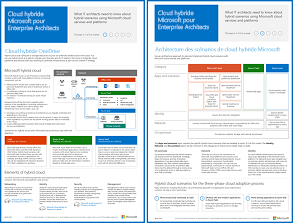

# Cloud hybride Microsoft pour les architectes d'entreprise

 **Résumé :** Tout ce que les architectes informatiques doivent savoir sur les scénarios hybrides utilisant les plateformes et services cloud de Microsoft.
  
Cet article vous dirige vers un ensemble d'articles décrivant ce que les architectes informatiques doivent savoir sur les configurations et l'architecture hybride avec des plateformes et des services cloud de Microsoft. Vous pouvez également voir le contenu de cet article sous forme d'affiche à 7 pages et l'imprimer au format tabloïd (également appelé format comptable, 11 x 17 ou A3).
  

  
[PDF](https://go.microsoft.com/fwlink/p/?linkid=842082) |[Visio](https://go.microsoft.com/fwlink/p/?linkid=842083) |[Plus de langues](https://www.microsoft.com/download/details.aspx?id=54424)
  
Vous pouvez également afficher tous les modèles dans les [Ressources relatives à l'architecture informatique du cloud Microsoft](microsoft-cloud-it-architecture-resources.md) et consulter la[feuille de route Enterprise Cloud de Microsoft (ressources pour les décideurs informatiques)](https://aka.ms/cloudarchitectu).
  
Consultez les sections suivantes :
  
- [Présentation du cloud hybride](hybrid-cloud-overview.md)
    
    Offres du cloud Microsoft (SaaS, Azure PaaS et Azure IaaS) et leurs éléments communs.
    
- [Architecture des scénarios de cloud hybride Microsoft](architecture-of-microsoft-hybrid-cloud-scenarios.md)
    
    Diagramme d'architecture du cloud hybride pour les offres du cloud Microsoft, affichant les couches communes de l'infrastructure locale, le réseau et l'identité.
    
- [Scénarios de cloud hybride pour les services SaaS Microsoft (Office 365)](hybrid-cloud-scenarios-for-microsoft-saas-office-365.md)
    
    Architecture de scénario SaaS hybride et descriptions des configurations hybrides clés pour Skype Entreprise, SharePoint Server et Exchange Server.
    
- [Scénarios de cloud hybride pour les services PaaS Azure](hybrid-cloud-scenarios-for-azure-paas.md)
    
    Architecture de scénario hybride pour Azure PaaS, description de l'application hybride Azure PaaS accompagnée d'un exemple et description de SQL Server 2016 Stretch Database.
    
- [Scénarios de cloud hybride pour les services IaaS Azure](hybrid-cloud-scenarios-for-azure-iaas.md)
    
    Architecture de scénario hybride pour Azure IaaS et description d'une application métier hébergée dans Azure IaaS.
    
> [!NOTE]
> Ces articles correspondent à la version de **juin 2017** de l'affiche Cloud hybride Microsoft pour les architectes d'entreprise.
  
## See Also

#### 

[Ressources relatives à l'architecture informatique du cloud Microsoft](microsoft-cloud-it-architecture-resources.md)
#### 

[Feuille de route Enterprise Cloud de Microsoft : ressources pour les décideurs](https://sway.com/FJ2xsyWtkJc2taRD)

