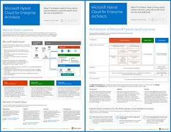

# Cloud hybride Microsoft pour les architectes d’entrepriseMicrosoft Hybrid Cloud for Enterprise Architects

 **Résumé :** Tout ce que les architectes informatiques doivent savoir sur les scénarios hybrides utilisant les plateformes et services cloud de Microsoft.**Summary:** What IT architects need to know about hybrid scenarios using Microsoft cloud services and platforms.
  
Cet article vous dirige vers un ensemble d’articles décrivant ce que les architectes informatiques doivent savoir sur les configurations et l’architecture hybride avec des plateformes et des services cloud de Microsoft. Vous pouvez également voir le contenu de cet article sous forme d’affiche à 7 pages et l’imprimer au format tabloïd (également appelé format comptable, 11 x 17 ou A3).This article links you to a set of articles that describe what IT architects need to know about hybrid architecture and configurations with Microsoft cloud services and platforms. You can also view this article as a 7-page poster and print it in tabloid format (also known as ledger, 11 x 17, or A3).
  

  
[PDF](https://go.microsoft.com/fwlink/p/?linkid=842082) | [Visio](https://go.microsoft.com/fwlink/p/?linkid=842083)[PDF](https://go.microsoft.com/fwlink/p/?linkid=842082) | [Visio](https://go.microsoft.com/fwlink/p/?linkid=842083)
  
Vous pouvez également voir tous les modèles dans les [ressources relatives à l’architecture informatique de Microsoft Cloud](microsoft-cloud-it-architecture-resources.md).You can also see all of the models in the [Microsoft Cloud IT architecture resources](microsoft-cloud-it-architecture-resources.md).
  
Consultez les sections suivantes :See the following sections:
  
- [Présentation du cloud hybrideHybrid cloud overview](hybrid-cloud-overview.md)
    
    Offres du cloud Microsoft (SaaS, Azure PaaS et Azure IaaS) et leurs éléments communs.Microsoft's cloud offerings (SaaS, Azure PaaS, and Azure IaaS) and their common elements.
    
- [Architecture des scénarios de cloud hybride MicrosoftArchitecture of Microsoft hybrid cloud scenarios](architecture-of-microsoft-hybrid-cloud-scenarios.md)
    
    Diagramme d’architecture du cloud hybride pour les offres du cloud Microsoft, affichant les couches communes de l’infrastructure locale, le réseau et l’identité.An architectural diagram of hybrid cloud for Microsoft's cloud offerings, showing the common layers of on-premises infrastructure, networking, and identity.
    
- [Scénarios de cloud hybride pour les services SaaS Microsoft (Office 365)Hybrid cloud scenarios for Microsoft SaaS (Office 365)](hybrid-cloud-scenarios-for-microsoft-saas-office-365.md)
    
    Architecture de scénario SaaS hybride et descriptions des configurations hybrides clés pour Skype Entreprise, SharePoint Server et Exchange Server.The SaaS hybrid scenario architecture and descriptions of key hybrid configurations for Skype for Business, SharePoint Server, and Exchange Server.
    
- [Scénarios de cloud hybride pour les services PaaS AzureHybrid cloud scenarios for Azure PaaS](hybrid-cloud-scenarios-for-azure-paas.md)
    
    Architecture de scénario hybride pour Azure PaaS, description de l’application hybride Azure PaaS accompagnée d’un exemple et description de SQL Server 2016 Stretch Database.The Azure PaaS hybrid scenario architecture, the description of an Azure PaaS hybrid application with an example, and the description of SQL Server 2016 Stretch Database.
    
- [Scénarios de cloud hybride pour les services IaaS AzureHybrid cloud scenarios for Azure IaaS](hybrid-cloud-scenarios-for-azure-iaas.md)
    
    Architecture de scénario hybride pour Azure IaaS et description d’une application métier hébergée dans Azure IaaS.The Azure IaaS hybrid scenario architecture and the description of a line of business (LOB) application hosted in Azure IaaS.
    
> [!NOTE]
> Ces articles ont trait à la publication de **décembre 2018** de l’affiche Cloud hybride Microsoft pour les architectes d’entreprise.These articles reflect the **December 2018** release of the Microsoft Cloud Networking for Enterprise Architects poster.
  
## Voir aussiSee Also

[Ressources relatives à l'architecture informatique du cloud MicrosoftMicrosoft Cloud IT architecture resources](microsoft-cloud-it-architecture-resources.md)

