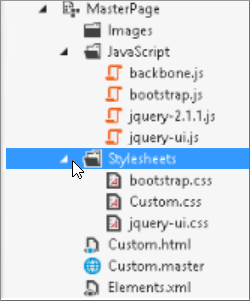

# Minimisation et regroupement dans SharePoint OnlineMinification and bundling in SharePoint Online

Cet article décrit comment utiliser la réduction et les techniques de Web Essentials pour réduire le nombre de demandes HTTP et de réduire le temps que nécessaire pour charger des pages dans SharePoint Online.This article describes how to use minification and bundling techniques with Web Essentials to reduce the number of HTTP requests and to reduce the time it takes to load pages in SharePoint Online.
  
Lorsque vous personnalisez votre site web, vous pouvez finir par devoir ajouter un grand nombre de fichiers supplémentaires sur le serveur pour prendre en charge la personnalisation. Le fait d’ajouter des fichiers JavaScript, des fichiers CSS et des images supplémentaires entraîne l’augmentation du nombre de requêtes HTTP envoyées au serveur, ce qui augmente par conséquent le temps nécessaire pour afficher une page web. Si vous disposez de plusieurs fichiers du même type, vous pouvez regrouper ces fichiers pour accélérer leur téléchargement.When you customize your website you can end up adding a large number of extra files to the server to support the customization. Adding extra JavaScript, CSS, and images increases the number of HTTP requests to the server which in turn increases the time it takes to display a web page. If you have multiple files of the same type, you can bundle these files to make downloading these files faster.
  
Pour les fichiers CSS et JavaScript, vous pouvez également utiliser une approche appelée réduction, où vous réduisez la taille totale des fichiers en supprimant les espaces blancs et autres caractères qui ne sont pas nécessaires.For JavaScript and CSS files, you can also use an approach called minification, where you reduce the total size of files by removing whitespace and other characters that aren't necessary.
  
## Minimisation et regroupement de fichiers JavaScript et CSS avec Web EssentialsMinification and bundling JavaScript and CSS files with Web Essentials

Vous pouvez utiliser un logiciel tiers, tel que Web Essentials pour regrouper les fichiers CSS et JavaScript.You can use third-party software such as Web Essentials to bundle CSS and JavaScript files.
  
> [!IMPORTANT]
> Web Essentials est un projet de fournisseur tiers, open source, en fonction de la Communauté. Le logiciel est une extension de Visual Studio 2012 et Visual Studio 2013 et n’est pas pris en charge par Microsoft. Pour télécharger Web Essentials, visitez le site Web à [http://vswebessentials.com/download](https://go.microsoft.com/fwlink/p/?LinkId=525629).Web Essentials is a third-party, open-source, community-based project. The software is an extension to Visual Studio 2012 and Visual Studio 2013 and is not supported by Microsoft. To download Web Essentials, visit the website at [http://vswebessentials.com/download](https://go.microsoft.com/fwlink/p/?LinkId=525629). 
  
Web Essentials offre deux types de regroupement :Web Essentials offers two forms of bundling:
  
- .bundle : pour les fichiers CSS et JavaScript.bundle: for CSS and JavaScript files
    
- .sprite : pour les images (uniquement disponible dans Visual Studio 2013).sprite: for images (only available in Visual Studio 2013)
    
Vous pouvez utiliser Web Essentials si vous disposez d’une fonctionnalité existante avec quelques éléments de personnalisation référencés dans une page maître personnalisée, par exemple :You can use Web Essentials if you have an existing feature with some branding elements that are referenced inside a custom master page, such as:
  

  
 **Pour créer un groupement TE000127218 et CSS dans Web Essentials****To create a TE000127218 and CSS bundle in Web Essentials**
  
1. Dans Visual Studio, dans l’explorateur de solutions, sélectionnez les fichiers que vous souhaitez inclure dans le regroupement.In Visual Studio, in Solution Explorer, select the files that you want to include in the bundle.
    
2. Avec le bouton droit de la sélection de fichiers, puis sélectionnez **Web Essentials** \> **fichier JavaScript créer** dans le menu contextuel. Par exemple :Right-click the selected files and then select **Web Essentials** \> **Create JavaScript bundle file** from the context menu. For example: 
    
    
  
## Affichage des résultats de regroupement des fichiers JavaScript et CSSViewing the results of bundling JavaScript and CSS files

Lorsque vous créez un regroupement CSS et JavaScript, Web Essentials crée un fichier XML appelé fichier de recette qui identifie les fichiers JavaScript et CSS, ainsi que d’autres informations de configuration :When you create a JavaScript and CSS bundle, Web Essentials creates an XML file called a recipe file that identifies the JavaScript and CSS files as well as some other configuration information: 
  

  
En outre, si l’indicateur minify est défini sur true dans le fichier de recette de regroupement, la taille des fichiers est réduite et les fichiers sont regroupés. Les nouvelles versions minimisées des fichiers JavaScript sont alors créées et vous pouvez les référencer dans votre page maître.In addition, if the minify flag is set to true in the bundling recipe the files are reduced in size as well as bundled together. This means that new, minified versions of the JavaScript files were created that you can reference in your master page.
  

  
Lorsque vous chargez une page à partir de votre site web, vous pouvez utiliser les outils de développement de votre navigateur web, comme Internet Explorer 11, pour voir le nombre de demandes envoyées au serveur et la durée de chargement de chaque fichier.When you load a page from your web site, you can use the developer tools from your web browser, such as Internet Explorer 11, to see the number of requests sent to the server and how long each file took to load.
  
L’illustration suivante présente le résultat du chargement des fichiers JavaScript et CSS avant minimisation.The following figure is the result of loading the JavaScript and CSS files before minification.
  

  
Après avoir regroupé les fichiers CSS et JavaScript, le nombre de demandes a chuté à 74 et le téléchargement de chaque fichier n’a pris qu’un tout petit peu plus de temps que pour les fichiers d’origine, individuellement :After bundling the CSS and JavaScript files together, the number of requests dropped to 74 and each file took only slightly longer than the original files to download individually:
  

  
Une fois le regroupement effectué, la taille du fichier de regroupement JavaScript a été sensiblement réduite, passant de 815 ko à 365 ko :After bundling, the JavaScript bundle file is reduced significantly from 815KB to 365KB:
  

  
## Regroupement d’images par la création d’une image-objetBundling images by creating an image sprite

Semblable à la façon dont vous regroupez les fichiers CSS et JavaScript, vous pouvez combiner des nombreuses petites icônes et autres images courantes dans une feuille sprite plus grande, puis utiliser CSS pour afficher les images individuelles. Au lieu de télécharger chaque image, navigateur web de l’utilisateur télécharge la feuille sprite qu’une seule fois et il met en cache sur l’ordinateur local. Cela améliore les performances de chargement de page en réduisant le nombre de téléchargements et des allers-retours vers le serveur web.Similar to how you bundle JavaScript and CSS files, you can combine many small icons and other common images into a larger sprite sheet and then use CSS to reveal the individual images. Instead of downloading each individual image, the user's web browser downloads the sprite sheet once and then caches it on the local computer. This improves page load performance by cutting down on the number of downloads and round trips to the web server.
  
 **Création d’une image-objet d’images dans Web Essentials****To create an image sprite in Web Essentials**
  
1. Dans Visual Studio, dans l’explorateur de solutions, sélectionnez les fichiers que vous souhaitez inclure dans le regroupement.In Visual Studio, in Solution Explorer, select the files that you want to include in the bundle.
    
2. Avec le bouton droit de la sélection de fichiers, puis sélectionnez **Web Essentials** \> **sprite d’image créer** dans le menu contextuel. Par exemple :Right-click the selected files and then select **Web Essentials** \> **Create image sprite** from the context menu. For example: 
    
    
  
3. Choisissez un emplacement pour enregistrer le fichier d’image-objet. Le fichier .sprite est un fichier XML qui décrit les paramètres et les fichiers de l’image-objet. Les illustrations suivantes présentent l’exemple d’un fichier d’image-objet PNG et son fichier XML .sprite correspondant.Choose a location to save the sprite file. The .sprite file is an XML file that describes the settings and files in the sprite. The following figures show an example of a sprite PNG file and its corresponding .sprite XML file.
    
    
  
    
  

