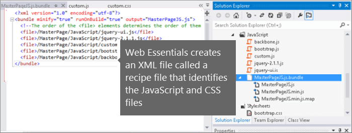
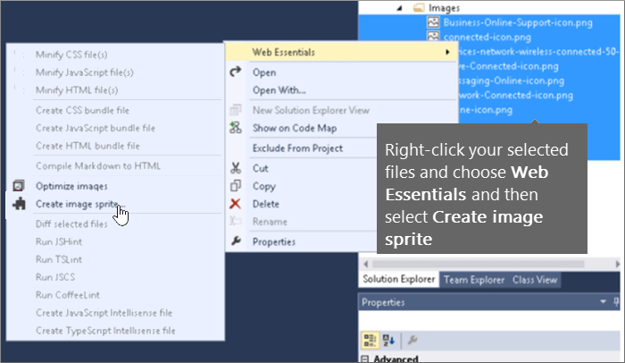

# Minimisation et regroupement dans SharePoint Online

Cet article décrit comment utiliser la réduction et les techniques de Web Essentials pour réduire le nombre de demandes HTTP et de réduire le temps que nécessaire pour charger des pages dans SharePoint Online.
  
Lorsque vous personnalisez votre site web, vous pouvez finir par devoir ajouter un grand nombre de fichiers supplémentaires sur le serveur pour prendre en charge la personnalisation. Le fait d’ajouter des fichiers JavaScript, des fichiers CSS et des images supplémentaires entraîne l’augmentation du nombre de requêtes HTTP envoyées au serveur, ce qui augmente par conséquent le temps nécessaire pour afficher une page web. Si vous disposez de plusieurs fichiers du même type, vous pouvez regrouper ces fichiers pour accélérer leur téléchargement.
  
Pour les fichiers CSS et JavaScript, vous pouvez également utiliser une approche appelée réduction, où vous réduisez la taille totale des fichiers en supprimant les espaces blancs et autres caractères qui ne sont pas nécessaires.
  
## Minimisation et regroupement de fichiers JavaScript et CSS avec Web Essentials

Vous pouvez utiliser un logiciel tiers, tel que Web Essentials pour regrouper les fichiers CSS et JavaScript.
  
> [!IMPORTANT]
> Web Essentials est un projet de fournisseur tiers, open source, en fonction de la Communauté. Le logiciel est une extension de Visual Studio 2012 et Visual Studio 2013 et n’est pas pris en charge par Microsoft. Pour télécharger Web Essentials, visitez le site Web à [http://vswebessentials.com/download](https://go.microsoft.com/fwlink/p/?LinkId=525629). 
  
Web Essentials offre deux types de regroupement :
  
- .bundle : pour les fichiers CSS et JavaScript
    
- .sprite : pour les images (uniquement disponible dans Visual Studio 2013)
    
Vous pouvez utiliser Web Essentials si vous disposez d’une fonctionnalité existante avec quelques éléments de personnalisation référencés dans une page maître personnalisée, par exemple :
  

  
 **Pour créer un groupement TE000127218 et CSS dans Web Essentials**
  
1. Dans Visual Studio, dans l’explorateur de solutions, sélectionnez les fichiers que vous souhaitez inclure dans le regroupement.
    
2. Avec le bouton droit de la sélection de fichiers, puis sélectionnez **Web Essentials** \> **fichier JavaScript créer** dans le menu contextuel. Par exemple : 
    
    
  
## Affichage des résultats de regroupement des fichiers JavaScript et CSS

Lorsque vous créez un regroupement CSS et JavaScript, Web Essentials crée un fichier XML appelé fichier de recette qui identifie les fichiers JavaScript et CSS, ainsi que d’autres informations de configuration : 
  

  
En outre, si l’indicateur minify est défini sur true dans le fichier de recette de regroupement, la taille des fichiers est réduite et les fichiers sont regroupés. Les nouvelles versions minimisées des fichiers JavaScript sont alors créées et vous pouvez les référencer dans votre page maître.
  

  
Lorsque vous chargez une page à partir de votre site web, vous pouvez utiliser les outils de développement de votre navigateur web, comme Internet Explorer 11, pour voir le nombre de demandes envoyées au serveur et la durée de chargement de chaque fichier.
  
L’illustration suivante présente le résultat du chargement des fichiers JavaScript et CSS avant minimisation.
  

  
Après avoir regroupé les fichiers CSS et JavaScript, le nombre de demandes a chuté à 74 et le téléchargement de chaque fichier n’a pris qu’un tout petit peu plus de temps que pour les fichiers d’origine, individuellement :
  

  
Une fois le regroupement effectué, la taille du fichier de regroupement JavaScript a été sensiblement réduite, passant de 815 ko à 365 ko :
  

  
## Regroupement d’images par la création d’une image-objet

Semblable à la façon dont vous regroupez les fichiers CSS et JavaScript, vous pouvez combiner des nombreuses petites icônes et autres images courantes dans une feuille sprite plus grande, puis utiliser CSS pour afficher les images individuelles. Au lieu de télécharger chaque image, navigateur web de l’utilisateur télécharge la feuille sprite qu’une seule fois et il met en cache sur l’ordinateur local. Cela améliore les performances de chargement de page en réduisant le nombre de téléchargements et des allers-retours vers le serveur web.
  
 **Création d’une image-objet d’images dans Web Essentials**
  
1. Dans Visual Studio, dans l’explorateur de solutions, sélectionnez les fichiers que vous souhaitez inclure dans le regroupement.
    
2. Avec le bouton droit de la sélection de fichiers, puis sélectionnez **Web Essentials** \> **sprite d’image créer** dans le menu contextuel. Par exemple : 
    
    
  
3. Choisissez un emplacement pour enregistrer le fichier d’image-objet. Le fichier .sprite est un fichier XML qui décrit les paramètres et les fichiers de l’image-objet. Les illustrations suivantes présentent l’exemple d’un fichier d’image-objet PNG et son fichier XML .sprite correspondant.
    
    
  
    
  

