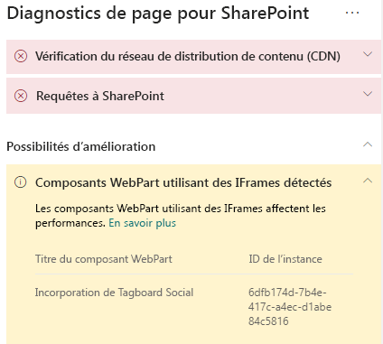
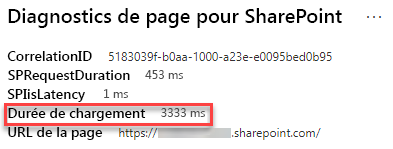

# Optimiser les IFrames dans les pages de sites de publication modernes et classiques SharePoint OnlineOptimize iFrames in SharePoint Online modern and classic publishing site pages

Les IFrames peuvent s’avérer utiles pour afficher un aperçu d’un contenu riche, par exemple, des vidéos ou d’autres éléments multimédias.iFrames can be useful for previewing rich content such as videos or other media. Toutefois, étant donné que les IFrames chargent une page distincte dans la page du site SharePoint, le contenu chargé dans l’IFrame peut contenir des images, des vidéos ou d’autres éléments volumineux pouvant contribuer au temps de chargement général de la page et que vous ne pouvez pas contrôler sur la page.However, because iFrames load a separate page within the SharePoint site page, content loaded in the iFrame could contain large images, videos or other elements that can contribute to overall page load times and that you cannot control on the page. Cet article vous permet de comprendre comment déterminer la façon dont les IFrames présentes dans vos pages affectent la latence perçue par l’utilisateur et comment résoudre les problèmes courants.This article will help you understand how to determine how iFrames in your pages affect user perceived latency, and how to remediate common issues.

>[!NOTE]
>Pour plus d’informations sur les performances dans les sites modernes SharePoint Online, consultez [Performances offertes par l’expérience moderne de SharePoint](https://docs.microsoft.com/sharepoint/modern-experience-performance).For more information about performance in SharePoint Online modern sites, see [Performance in the modern SharePoint experience](https://docs.microsoft.com/sharepoint/modern-experience-performance).

## Utiliser l’outil Diagnostic de page pour SharePoint pour analyser les composants WebPart utilisant les IFramesUse the Page Diagnostics for SharePoint tool to analyze web parts using iFrames

L’outil **Diagnostic de page pour SharePoint** est une extension de navigateur pour Chrome et [Microsoft Edge version 77 ou ultérieure](https://www.microsoftedgeinsider.com/download?form=MI13E8&OCID=MI13E8) que vous pouvez utiliser pour analyser les pages de sites de publication modernes et classiques SharePoint.The **Page Diagnostics for SharePoint tool** is a browser extension for Chrome and [Microsoft Edge version 77 or later](https://www.microsoftedgeinsider.com/download?form=MI13E8&OCID=MI13E8) you can use to analyze SharePoint both modern and classic publishing site pages. L’outil fournit un rapport pour chaque page analysée montrant comment la page se comporte par rapport à un ensemble défini de critères de performance.The tool provides a report for each analyzed page showing how the page performs against a defined set of performance criteria. Pour installer et découvrir l’outil Diagnostic de page pour SharePoint, consultez [Utiliser l’outil Diagnostic de page pour SharePoint Online](page-diagnostics-for-spo.md).To install and learn about the Page Diagnostics for SharePoint tool, visit [Use the Page Diagnostics tool for SharePoint Online](page-diagnostics-for-spo.md).

Lorsque vous analysez une page de site SharePoint avec l’outil Diagnostic de page pour SharePoint, vous pouvez voir des informations sur les composants WebPart contenant des IFrames dans le volet _Tests de diagnostic_.When you analyze a SharePoint site page with the Page Diagnostics for SharePoint tool, you can see information about web parts containing iFrames in the _Diagnostic tests_ pane. La métrique de référence est identique pour les pages classiques et modernes.The baseline metric is the same for modern and classic pages.

Les résultats possibles sont les suivants :Possible results include:

- **Attention requise** (rouge) : la page contient **trois composants WebPart ou plus** utilisant des IFrames**Attention required** (red): The page contains **three or more** web parts using iFrames
- **Possibilités d’amélioration** (jaune) : la page contient **un ou deux** composants WebPart utilisant des IFrames**Improvement opportunities** (yellow): The page contains **one or two** web parts using iFrames
- **Aucune action requise** (vert) : la page ne contient pas de composants WebPart utilisant des IFrames**No action required** (green): The page contains no web parts using iFrames

Si le résultat **Composants WebPart détectés utilisant des IFrames** apparaît dans la section des résultats **Possibilités d’amélioration** ou **Attention requise**, vous pouvez cliquer sur le résultat pour afficher les composants WebPart qui contiennent des IFrames.If the **Web parts using iFrames detected** result appears in either the **Improvement opportunities** or **Attention required)** section of the results, you can click the result to see the web parts that contain iFrames.

## Résoudre les problèmes de performance liées aux IFramesRemediate iFrame performance issues

Utilisez le résultat **Composants WebPart détectés utilisant des IFrames** dans l’outil Diagnostic de page pour identifier les composants WebPart qui contiennent des IFrames et qui peuvent contribuer au chargement lent des pages.Use the **Web parts using iFrames detected** result in the Page Diagnostic tool to determine which web parts contain iFrames and may be contributing to slow page load times.

les IFrames sont lents par nature, car ils chargent une page externe distincte incluant tout le contenu associé (par exemple, JavaScript, CSS et les éléments d’infrastructure), augmentant ainsi la surcharge de la page du site par un facteur de deux ou plus.iFrames are inherently slow because they load a separate external page including all associated content such as javascript, CSS and framework elements, potentially increasing the overhead of the site page by a factor of two or more.

Suivez les instructions ci-dessous pour optimiser l’utilisation des IFrames.Follow the guidance below to ensure optimal use of iFrames.

- Dans la mesure du possible, utilisez des images au lieu d’IFrames si l’aperçu est initialement petit ou non interactif.When possible, use images instead of iFrames if the preview is small to begin with or non-interactive.
- Si vous devez utiliser des IFrames, réduisez-en le nombre et/ou éloignez-les de la fenêtre d’affichage.If iFrames must be used, minimize the number and/or move them out of the viewport.
- Les fichiers Office incorporés tels que Word, Excel et PowerPoint sont interactifs, mais leur chargement est lent.Embedded Office files like Word, Excel and PowerPoint are interactive, but are slow to load. Les miniatures d’images contenant un lien vers le document complet fonctionnent souvent mieux.Image thumbnails with a link to the full document will often perform better.
- Les vidéos YouTube incorporées et les flux Twitter sont généralement plus performants dans des IFrames, mais utilisez judicieusement ce type d’éléments incorporés.Embedded YouTube videos and Twitter feeds tend to perform better in iFrames, but use these kinds of embeds judiciously.
- Les composants WebPart isolés sont une exception raisonnable, mais réduisez leur nombre et leur insertion dans la fenêtre d’affichage.Isolated web parts are a reasonable exception, but minimize their number and placement in the viewport.
- Si un IFrame est placé hors de la fenêtre d’affichage, songez à utiliser une fonction _IntersectionObserver_ pour retarder le rendu de l’IFrame jusqu’à ce qu’il s’affiche.If an iFrame is located out of the viewport, consider using an _IntersectionObserver_ to delay rendering the iFrame until it comes into view.

Avant d’apporter des révisions de page pour résoudre les problèmes de performances, notez le temps de chargement des pages dans les résultats de l’analyse.Before you make page revisions to remediate performance issues, make a note of the page load time in the analysis results. Exécutez à nouveau l’outil après votre révision pour déterminer si le nouveau résultat est inclus dans la norme de référence et vérifier le nouveau temps de chargement des pages pour voir s’il y a eu une amélioration.Run the tool again after your revision to see if the new result is within the baseline standard, and check the new page load time to see if there was an improvement.

>[!NOTE]
>Le temps de chargement des pages peut varier en fonction de nombreux facteurs tels que la charge réseau, l’heure de la journée et d’autres conditions transitoires.Page load time can vary based on a variety of factors such as network load, time of day, and other transient conditions. Vous devez tester le temps de chargement des pages plusieurs fois avant et après avoir apporté des modifications pour vous aider à faire la moyenne des résultats.You should test page load time a few times before and after making changes to help you average the results.

## Voir aussiRelated topics

[Optimisation des performances SharePoint OnlineTune SharePoint Online performance](tune-sharepoint-online-performance.md)

[Optimisation des performances Office 365Tune Office 365 performance](tune-office-365-performance.md)

[Performances offertes par l’expérience moderne de SharePointPerformance in the modern SharePoint experience](https://docs.microsoft.com/sharepoint/modern-experience-performance.md)
