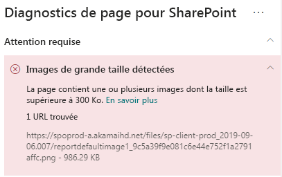

# Optimiser les images dans les pages de sites modernes SharePoint OnlineOptimize images in SharePoint Online modern site pages

Cet article vous aidera à comprendre comment optimiser les images dans les pages de sites modernes SharePoint Online.This article will help you understand how to optimize images in SharePoint Online modern site pages.

Pour plus d’informations sur l’optimisation des images dans les sites de publication classiques, consultez [Optimisation des images pour SharePoint Online](image-optimization-for-sharepoint-online.md).For information about optimizing images in classic publishing sites, see [Image optimization for SharePoint Online](image-optimization-for-sharepoint-online.md)..

>[!NOTE]
>Pour plus d’informations sur les performances dans les portails modernes SharePoint Online, consultez [Performances offertes par l’expérience moderne de SharePoint](https://docs.microsoft.com/sharepoint/modern-experience-performance).For more information about performance in SharePoint Online modern portals, see [Performance in the modern SharePoint experience](https://docs.microsoft.com/sharepoint/modern-experience-performance).

## Utiliser l’outil Diagnostic de page pour SharePoint pour analyser l’optimisation des imagesUse the Page Diagnostics for SharePoint tool to analyze image optimization

L’outil **Diagnostic de page pour SharePoint** est une extension de navigateur pour Chrome et [Microsoft Edge version 77 ou ultérieure](https://www.microsoftedgeinsider.com/download?form=MI13E8&OCID=MI13E8) que vous pouvez utiliser pour analyser les pages de sites de publication modernes et classiques SharePoint.The **Page Diagnostics for SharePoint tool** is a browser extension for Chrome and [Microsoft Edge version 77 or later](https://www.microsoftedgeinsider.com/download?form=MI13E8&OCID=MI13E8) you can use to analyze SharePoint both modern and classic publishing site pages. L’outil fournit un rapport pour chaque page analysée montrant comment la page se comporte par rapport à un ensemble défini de critères de performance.The tool provides a report for each analyzed page showing how the page performs against a defined set of performance criteria. Pour installer et découvrir l’outil Diagnostic de page pour SharePoint, consultez [Utiliser l’outil Diagnostic de page pour SharePoint Online](page-diagnostics-for-spo.md).To install and learn about the Page Diagnostics for SharePoint tool, visit [Use the Page Diagnostics tool for SharePoint Online](page-diagnostics-for-spo.md).

Lorsque vous analysez une page de site moderne SharePoint avec l’outil Diagnostic de page pour SharePoint, vous pouvez voir des informations sur les images de grande taille dans le volet Tests de diagnostic.When you analyze a SharePoint modern site with the Page Diagnostics for SharePoint tool, you can see information about large images in the _Diagnostic tests_ pane.

Les résultats possibles sont les suivants :Possible results include:

- **Attention requise** (rouge) : la page contient **une ou plusieurs** images dont la taille est supérieure à 300 Ko**Attention required** (red): The page contains **one or more** images over 300KB in size
- **Aucune action requise** (vert) : la page ne contient pas d’images dont la taille est supérieure à 300 Ko**No action required** (green): The page contains no images over 300KB in size

Si le résultat **Images de grande taille détectées** apparaît dans la section des résultats **Attention requise**, vous pouvez cliquer sur le résultat pour afficher les détails supplémentaires.If the **Large images detected** result appears in the **Attention required** section of the results, you can click the result to see additional details.

## Résoudre les problèmes liés aux images de grande tailleRemediate large image issues

Si une page contient des images dont la taille est supérieure à 300 Ko, sélectionnez le résultat **Images de grande taille détectées** pour voir les images trop volumineuses.If a page contains images over 300KB in size, select the **Large images detected** result to see which images are too large. Dans les pages modernes SharePoint Online, les rendus d’images sont automatiquement fournis et dimensionnés en fonction de la taille de la fenêtre du navigateur et de la résolution du moniteur client.In modern SharePoint Online pages, renditions of images are automatically provided and sized depending on the size of the browser window and the resolution of the client monitor. Vous devez toujours optimiser les images pour une utilisation sur le Web avant de les télécharger sur SharePoint Online.You should always optimize images for web use prior to upload to SharePoint Online. Les images de très grand taille sont automatiquement réduites en taille et en résolution, ce qui peut entraîner des caractéristiques de rendu inattendues.Very large images will be automatically reduced in size and resolution which can result in unexpected rendering characteristics.

Avant d’apporter des révisions de page pour résoudre les problèmes de performances, notez le temps de chargement des pages dans les résultats de l’analyse.Before you make page revisions to remediate performance issues, make a note of the page load time in the analysis results. Exécutez à nouveau l’outil après votre révision pour déterminer si le nouveau résultat est inclus dans la norme de référence et vérifier le nouveau temps de chargement des pages pour voir s’il y a eu une amélioration.Run the tool again after your revision to see if the new result is within the baseline standard, and check the new page load time to see if there was an improvement.

>[!NOTE]
>Le temps de chargement des pages peut varier en fonction de nombreux facteurs tels que la charge réseau, l’heure de la journée et d’autres conditions transitoires.Page load time can vary based on a variety of factors such as network load, time of day, and other transient conditions. Vous devez tester le temps de chargement des pages plusieurs fois avant et après avoir apporté des modifications pour vous aider à faire la moyenne des résultats.You should test page load time a few times before and after making changes to help you average the results.

## Voir aussiRelated topics

[Optimisation des performances SharePoint OnlineTune SharePoint Online performance](tune-sharepoint-online-performance.md)

[Optimisation des performances Office 365Tune Office 365 performance](tune-office-365-performance.md)

[Performances offertes par l’expérience moderne de SharePointPerformance in the modern SharePoint experience](https://docs.microsoft.com/sharepoint/modern-experience-performance)

[Réseaux de distribution de contenuContent delivery networks](content-delivery-networks.md)

[Utilisation du réseau de distribution de contenu Office 365 avec SharePoint OnlineUse the Office 365 Content Delivery Network (CDN) with SharePoint Online](use-office-365-cdn-with-spo.md)
