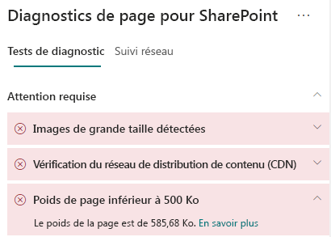
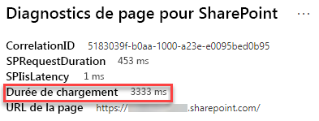

# Optimiser le poids des pages de sites modernes SharePoint Online

Les pages de sites modernes SharePoint Online contiennent du code sérialisé nécessaire pour restituer le contenu de la page, y compris les images, le texte, les objets dans la zone de contenu sous les barres de navigation/commandes et d’autres codes HTML qui constituent la structure de la page. Le poids de pages est une mesure de ce code HTML et doit être limitée afin de garantir des temps de chargement optimaux pour les pages.

Cet article vous permet de comprendre comment réduire le poids des pages de vos sites modernes.

>[!NOTE]
>Pour plus d’informations sur les performances dans les portails modernes SharePoint Online, consultez [Performances offertes par l’expérience moderne de SharePoint](https://docs.microsoft.com/sharepoint/modern-experience-performance).

## Utiliser l’outil Diagnostic de page pour SharePoint pour analyser le poids des pages

L’outil **Diagnostic de page pour SharePoint** est une extension de navigateur pour Chrome et [Microsoft Edge version 77 ou ultérieure](https://www.microsoftedgeinsider.com/download?form=MI13E8&OCID=MI13E8) que vous pouvez utiliser pour analyser les pages de sites de publication modernes et classiques SharePoint. L’outil fournit un rapport pour chaque page analysée montrant comment la page se comporte par rapport à un ensemble défini de critères de performance. Pour installer et découvrir l’outil Diagnostic de page pour SharePoint, consultez [Utiliser l’outil Diagnostic de page pour SharePoint Online](page-diagnostics-for-spo.md).

Lorsque vous analysez une page de site SharePoint avec l’outil Diagnostic de page pour SharePoint, vous pouvez voir des informations sur la page dans les résultats **Poids de pages inférieur à 500 Ko** du volet _Tests de diagnostic_. Le résultat s’affiche en vert si le poids de la page est inférieur à la valeur de référence et rouge si le poids de la page dépasse la valeur de référence.

Les résultats possibles sont les suivants :

- **Attention requise** (rouge) : le poids de la page dépasse 500 Ko
- **Aucune action requise** (vert) : le poids de la page est inférieur à 500 Ko

Si le résultat **Poids de page inférieur à 500 Ko** apparaît dans la section **Attention requise**, vous pouvez cliquer sur le résultat pour afficher les détails.

## Résoudre les problèmes de poids de pages

Si le poids des pages dépasse 500 Ko, vous pouvez améliorer le temps de chargement général des pages en réduisant le nombre de composants WebPart et en réduisant le contenu de la page dans la mesure appropriée.

Les recommandations générales pour réduire le poids des pages incluent les éléments suivants :

- Limitez le contenu de la page à un volume raisonnable et utilisez plusieurs pages pour le contenu connexe.
- Réduisez l’utilisation des composants WebPart comportant de grands conteneurs de propriétés.
- Utilisez les vues cumulatives non interactives lorsque c’est possible.
- Optimisez la taille des images en redimensionnant les images de façon appropriée en utilisant des formats d’images compressés et en vous assurant qu’elles sont téléchargées à partir d’un réseau de distribution de contenu.

Vous trouverez des conseils supplémentaires pour limiter le poids des pages dans l’article suivant :

- [Optimiser les performances des pages dans SharePoint](https://docs.microsoft.com/sharepoint/dev/general-development/optimize-page-performance-in-sharepoint)

Avant d’apporter des révisions de page pour résoudre les problèmes de performances, notez le temps de chargement des pages dans les résultats de l’analyse. Exécutez à nouveau l’outil après votre révision pour déterminer si le nouveau résultat est inclus dans la norme de référence et vérifier le nouveau temps de chargement des pages pour voir s’il y a eu une amélioration.

>[!NOTE]
>Le temps de chargement des pages peut varier en fonction de nombreux facteurs tels que la charge réseau, l’heure de la journée et d’autres conditions transitoires. Vous devez tester le temps de chargement des pages plusieurs fois avant et après avoir apporté des modifications pour vous aider à faire la moyenne des résultats.

## Voir aussi

[Optimisation des performances SharePoint Online](tune-sharepoint-online-performance.md)

[Optimisation des performances Office 365](tune-office-365-performance.md)

[Performances offertes par l’expérience moderne de SharePoint](https://docs.microsoft.com/sharepoint/modern-experience-performance.md)

[Réseaux de distribution de contenu](content-delivery-networks.md)

[Utilisation du réseau de distribution de contenu Office 365 avec SharePoint Online](use-office-365-cdn-with-spo.md)
