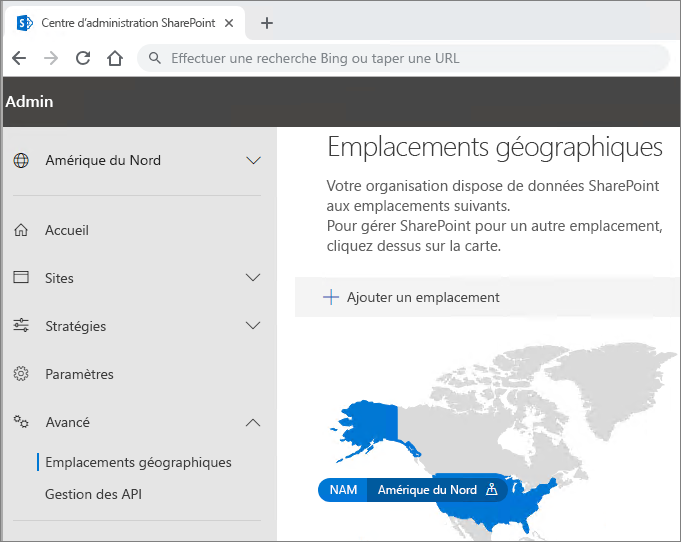

# Configuration du client Office 365 multigéographiqueOffice 365 Multi-Geo tenant configuration

Avant de configurer votre client pour Office 365 multigéographique, veillez à consulter l’[Offre pour Office 365 multigéographique](plan-for-multi-geo.md).Before you configure your tenant for Office 365 Multi-Geo, be sure you have read [Plan for Office 365 Multi-Geo](plan-for-multi-geo.md). Pour suivre la procédure décrite dans cet article, vous devez posséder la liste des emplacements géographiques que vous voulez activer en tant qu’emplacements satellites, ainsi que la liste des utilisateurs de test que vous désirez approvisionner à ces emplacements.To follow the steps in this article, you'll need a list of the geo locations that you want to enable as satellite locations, and the test users that you want to provision for those locations.

## Ajouter les fonctionnalités multigéographiques de l’offre Office 365 à votre clientAdd the Multi-Geo Capabilities in Office 365 plan to your tenant

Pour utiliser Office 365 multigéographique, vous devez posséder l’offre _Fonctionnalités multigéographiques dans Office 365_.To use Office 365 Multi-Geo, you need the _Multi-Geo Capabilities in Office 365_ plan. Travaillez avec votre équipe des comptes pour ajouter cette offre à votre client.Work with your account team to add this plan to your tenant. Votre équipe des comptes vous mettra en contact avec le spécialiste en gestion des licences approprié et votre client sera configuré.Your account team will connect you with the appropriate licensing specialist and get your tenant configured.

Notez que le plan des _fonctionnalités multigéographiques dans Office 365_ est un plan de service au niveau utilisateur. Vous avez besoin d’une licence pour chaque utilisateur que vous souhaitez héberger dans un emplacement satellite. Vous pouvez ajouter des licences supplémentaires au fur et à mesure que vous ajoutez des utilisateurs dans des emplacements satellites.Note that the _Multi-Geo Capabilities in Office 365_ plan is a user-level service plan. You need a license for each user that you want to host in a satellite location. You can add more licenses over time as you add users in satellite locations.

Une fois que votre client a été approvisionné avec l’offre _Fonctionnalités multigéographiques dans Office 365_, l’onglet **Emplacements géographiques** est disponible dans les centres d’administration OneDrive et SharePoint.Once your tenant has been provisioned with the  _Multi-Geo Capabilities in Office 365_ plan, the **Geo locations** tab will become available in the OneDrive and SharePoint admin centers.

## Ajouter des emplacements satellites à votre clientAdd satellite locations to your tenant

Vous devez ajouter un emplacement satellite à chaque emplacement géographique où vous souhaitez stocker des données.You must add a satellite location for each geo location where you want to store data. Le tableau suivant présente les emplacements géographiques disponibles :Available geo locations are shown in the following table:

[!INCLUDE [Office 365 Multi-Geo locations](includes/office-365-multi-geo-locations.md)]

Pour ajouter un emplacement satelliteTo add a satellite location

1. Ouvrez le Centre d’administration SharePoint.Open the SharePoint admin center.

2. Accédez à l’onglet **Emplacements géographiques**.Navigate to the **Geo locations** tab.

3. Cliquez sur **Ajouter un emplacement**.Click **Add location**.

4. Sélectionnez l’emplacement à ajouter, puis cliquez sur **Suivant**.Select the location that you want to add, and then click **Next**.

5. Saisissez le domaine que vous souhaitez utiliser avec l’emplacement géographique, puis cliquez sur **Ajouter**.Type the domain that you want to use with the geo location, and then click **Add**.

6. Cliquez sur **Fermer**.Click **Close**.

La configuration peut prendre jusqu’à 72 heures selon la taille de votre client. Une fois que la configuration d’un emplacement satellite est terminée, vous recevez un e-mail de confirmation. Lorsque le nouvel emplacement géographique s’affiche en bleu sur la carte sur l’onglet **Emplacements géographiques** dans le centre d’administration OneDrive, vous pouvez définir l’emplacement des données par défaut des utilisateurs sur cet emplacement géographique.Provisioning may take from a few hours up to 72 hours, depending on the size of your tenant. Once provisioning of a satellite location has completed, you will receive an email confirmation. When the new geo location appears in blue on the map on the **Geo locations** tab in the OneDrive admin center, you can proceed to set users' preferred data location to that geo location. 

> [!IMPORTANT]
> Votre nouvel emplacement satellite est configuré avec des paramètres par défaut. Cela vous permettra de configurer cet emplacement satellite en fonction de vos besoins de conformité locale.Your new satellite location will be set up with default settings. This will allow you to configure that satellite location as appropriate for your local compliance needs.

## Configuration de l’emplacement des données par défaut des utilisateursSetting users' preferred data location
 

Lorsque vous activez les emplacements satellites nécessaires, vous pouvez mettre à jour vos comptes d’utilisateur pour utiliser l’emplacement de données par défaut approprié. Nous vous recommandons de définir un emplacement de données par défaut pour chaque utilisateur, même si cet utilisateur reste dans l’emplacement central.Once you enable the needed satellite locations, you can update your user accounts to use the appropriate preferred data location. We recommend that you set a preferred data location for every user, even if that user is staying in the central location.

> [!IMPORTANT]
> Si l’emplacement des données par défaut d’un utilisateur est défini sur un emplacement qui n’a pas été configuré en tant qu’emplacement satellite ou emplacement central, le système envoie les données par défaut vers l’emplacement central lorsqu’il approvisionne les sites OneDrive et SharePoint, ainsi que les boîtes aux lettres de groupe.If a user's preferred data location is set to a location that has not been configured as a satellite location or the central location, the system will default to the central location when provisioning OneDrive and SharePoint sites and Group mailboxes.

> [!TIP]
> Nous vous recommandons de commencer les validations avec un utilisateur de test ou un petit groupe d’utilisateurs avant de déployer à plus grande échelle les fonctionnalités multigéographiques dans votre organisation.We recommend that you begin validations with a test user or small group of users before rolling out multi-geo to your broader organization.

Deux types d’objets utilisateur sont disponibles dans Azure Active Directory : les utilisateurs cloud uniquement et les utilisateurs synchronisés.In Azure Active Directory there are two types of user objects: cloud only users and synchronized users. Suivez les instructions appropriées pour votre type d’utilisateur.Please follow the appropriate instructions for your type of user.

### Synchroniser l’emplacement des données par défaut de l’utilisateur à l’aide d’Azure Active Directory ConnectSynchronize user's Preferred Data Location using Azure Active Directory Connect 

Si les utilisateurs de votre entreprise sont synchronisés à partir d’un système Active Directory local avec Azure Active Directory, leur PreferredDataLocation doit être renseigné dans AD et synchronisé avec AAD. Suivez le processus décrit dans l’article [Synchronisation Azure Active Directory Connect : configurer un emplacement de données par défaut pour les ressources Office 365](/azure/active-directory/hybrid/how-to-connect-sync-feature-preferreddatalocation) pour configurer la synchronisation de l’emplacement des données par défaut à partir d’Active Directory local avec Azure Active Directory.If your company’s users are synchronized from an on-premises Active Directory system to Azure Active Directory, their PreferredDataLocation must be populated in AD and synchronized to AAD. Follow the process in [Azure Active Directory Connect sync: Configure preferred data location for Office 365 resources](/azure/active-directory/hybrid/how-to-connect-sync-feature-preferreddatalocation) to configure Preferred Data Location sync from on-premises Active Directory to Azure Active Directory.

Nous vous recommandons d’inclure la configuration de l’emplacement des données par défaut de l’utilisateur dans le cadre de votre flux de travail de création utilisateur standard.We recommend that you include setting the user's Preferred Data Location as a part of your standard user creation workflow.

> [!IMPORTANT]
> Pour les nouveaux utilisateurs sans approvisionnement OneDrive, attendez au moins 24 heures après la synchronisation d’un emplacement des données par défaut de l’utilisateur avec Azure Active Directory pour que les changements soient appliqués avant que l’utilisateur ne se connecte à OneDrive Entreprise.For new users with no OneDrive provisioned, wait at least 24 hours after a user's PDL is synchronized to Azure Active Directory for the changes to propagate before the user logs in to OneDrive for Business. (Configurer l’emplacement des données par défaut avant que l’utilisateur ne se connecte pour approvisionner son OneDrive Entreprise permet de s’assurer que le nouveau OneDrive de l’utilisateur est approvisionné à l’emplacement approprié.)(Setting the preferred data location before the user logs in to provision their OneDrive for Business ensures that the user's new OneDrive will be provisioned in the correct location.)

### Configurer l’emplacement des données par défaut pour les utilisateurs cloud uniquementSetting Preferred Data Location for cloud only users 

Si les utilisateurs de votre entreprise ne sont pas synchronisés à partir d’un système Active Directory local avec Azure Active Directory, ce qui signifie qu’ils sont créés dans Office 365 ou Azure Active Directory, l’emplacement des données par défaut doit être défini à l’aide d’Azure Active Directory PowerShell.If your company's users are not synchronized from an on-premises Active Directory system to Azure Active Directory, meaning they are created in Office 365 or Azure Active Directory, then the PDL must be set using Azure Active Directory PowerShell.

Les procédures décrites dans cette section nécessitent le [module Microsoft Azure Active Directory Module pour Windows PowerShell](https://www.powershellgallery.com/packages/MSOnline/1.1.166.0). Si vous avez déjà installé Azure Active Directory pour PowerShell, vérifiez que vous effectuez la mise à jour vers la dernière version.The procedures in this section require the [Microsoft Azure Active Directory Module for Windows PowerShell Module](https://www.powershellgallery.com/packages/MSOnline/1.1.166.0). If you already have Azure Active Directory PowerShell installed, please ensure you update to the latest version.

1.  Ouvrez le Module Microsoft Azure Active Directory pour Windows PowerShell.Open the Microsoft Azure Active Directory Module for Windows PowerShell.

2.  Exécutez `Connect-MsolService` et entrez les informations d’identification d’administrateur général pour votre client.Run `Connect-MsolService` and enter the global administrator credentials for your tenant.

3.  Utilisez la cmdlet [Set-MsolUser](https://docs.microsoft.com/powershell/msonline/v1/set-msoluser) pour définir l’emplacement des données par défaut pour chacun de vos utilisateurs. Par exemple :Use the [Set-MsolUser](https://docs.microsoft.com/powershell/msonline/v1/set-msoluser) cmdlet to set the preferred data location for each of your users. For example:

    `Set-MsolUser -userprincipalName Robyn.Buckley@Contoso.com -PreferredDatalocation EUR`

    Vous pouvez vérifier pour confirmer que l’emplacement des données par défaut a été correctement mis à jour à l’aide de la cmdlet Get-MsolUser. Par exemple :You can check to confirm that the preferred data location was updated properly by using the Get-MsolUser cmdlet. For example:

    `(Get-MsolUser -userprincipalName Robyn.Buckley@Contoso.com).PreferredDatalocation`

Nous vous recommandons d’inclure la configuration de l’emplacement des données par défaut de l’utilisateur dans le cadre de votre flux de travail de création utilisateur standard.We recommend that you include setting the user's Preferred Data Location as a part of your standard user creation workflow.

> [!IMPORTANT]
> Pour les nouveaux utilisateurs sans approvisionnement OneDrive, attendez au moins 24 heures après la configuration d’un emplacement des données par défaut de l’utilisateur pour que les changements soient appliqués avant que l’utilisateur ne se connecte à OneDrive.For new users with no OneDrive provisioned, wait at least 24 hours after a user's PDL is set for the changes to propagate before the user logs in to OneDrive. (Configurer l’emplacement des données par défaut avant que l’utilisateur ne se connecte pour approvisionner son OneDrive Entreprise permet de s’assurer que le nouveau OneDrive de l’utilisateur est approvisionné à l’emplacement approprié.)(Setting the preferred data location before the user logs in to provision their OneDrive for Business ensures that the user's new OneDrive will be provisioned in the correct location.)

## Configuration de OneDrive et l’effet de PDLOneDrive Provisioning and the effect of PDL

Si l’utilisateur possède déjà un site OneDrive créé dans le client, configurer son emplacement des données par défaut ne déplace pas automatiquement son OneDrive existant.If the user already has a OneDrive site created in the tenant, setting their PDL will not automatically move their existing OneDrive. Pour déplacer le OneDrive d’un utilisateur, consultez [Déplacement de OneDrive Entreprise multigéographique](move-onedrive-between-geo-locations.md) et suivez les instructions permettant de déplacer OneDrive entre deux emplacements géographiques.To move a user's OneDrive, see [OneDrive for Business Geo Move](move-onedrive-between-geo-locations.md) please follow the instructions in Moving OneDrive between geo locations. (Notez que la boîte aux lettres Exchange de l’utilisateur ne se déplace automatiquement que lorsque vous configurez l’emplacement des données par défaut de l’utilisateur.)(Note that the user's Exchange mailbox does move automatically when you set the user's PDL.)

Si l’utilisateur ne dispose pas d’un site OneDrive dans le client, OneDrive est approvisionné pour lui conformément à la valeur de son emplacement des données par défaut en supposant que ce dernier correspond à l’un des emplacements satellites de l’entreprise.If the user does not have a OneDrive site within the tenant, OneDrive will be provisioned for them in accordance to their PDL value, assuming the PDL for the user matches one of the company's satellite locations.

## Configuration de la recherche Multi-GéoConfiguring Multi-Geo search

Votre client Multi-Géo aura des fonctionnalités de recherche regroupées permettant à une requête de recherche de renvoyer des résultats de n’importe quel endroit dans le client.Your multi-geo tenant will have aggregate search capabilities allowing a search query to return results from anywhere within the tenant.

Par défaut, les recherches effectuées à partir de ces points d’entrée renvoient des résultats regroupés, bien que chaque index de recherche se trouve dans son emplacement géographique approprié :By default, searches from these entry points will return aggregate results, even though each search index is located within its relevant geo location:

- OneDrive EntrepriseOneDrive for business

- DelveDelve

- Page d’accueil SharePointSharePoint Home

- Centre de rechercheSearch Center

Par ailleurs, les fonctionnalités de recherche Multi-Géo peuvent être configurées pour vos applications de recherche personnalisées qui utilisent l’API de recherche SharePoint.Additionally, multi-geo search capabilities can be configured for your custom search applications that use the SharePoint search API.

Consultez [Configurer la recherche pour OneDrive Entreprise Multi-Géo](configure-search-for-multi-geo.md) pour obtenir des instructions, y compris des informations sur les limitations et les différences.Please review [Configure Search for OneDrive for Business Multi-Geo](configure-search-for-multi-geo.md) for instructions including any limitations and differences.

## Validation de la configuration d’Office 365 multigéographiqueValidating the Office 365 Multi-Geo configuration

Voici certains cas d’utilisation de base que vous pourriez vouloir inclure dans votre plan de validation avant de déployer à grande échelle Office 365 multigéographique dans votre entreprise.Below are some basic use cases you may wish to include in your validation plan before broadly rolling out Office 365 Multi-Geo to your company. Une fois que vous avez terminé ces tests et les cas d’utilisation supplémentaires éventuels et pertinents pour votre entreprise, vous pouvez choisir de commencer à ajouter des utilisateurs à votre groupe pilote initial.Once you have completed these tests and any additional use cases that are relevant to your company, you may choose to move on to adding the users in your initial pilot group.

**OneDrive Entreprise****OneDrive for Business**

Sélectionnez OneDrive à partir du lanceur d’applications d’Office 365 et vérifiez que vous êtes automatiquement redirigé vers l’emplacement géographique approprié de l’utilisateur, conformément à l’emplacement des données par défaut de l’utilisateur.Select OneDrive from the Office 365 app launcher and confirm that you are automatically directed to the appropriate geo location for the user, based on the user's PDL. OneDrive Entreprise doit maintenant commencer à être approvisionné à cet emplacement.OneDrive for Business should now begin provisioning at that location. Après l’approvisionnement, essayez de charger et de télécharger quelques documents.Once provisioned, try uploading and downloading some documents.

**Application mobile OneDrive****OneDrive Mobile App**

Connectez-vous à votre application mobile OneDrive avec vos informations d’identification de compte test. Confirmez que vous pouvez voir vos fichiers OneDrive Entreprise et que vous pouvez interagir avec eux à partir de votre appareil mobile.Log into your OneDrive mobile App with your test account credentials. Confirm that you can see your OneDrive for business files and can interact with them from your mobile device.

**Client de synchronisation OneDrive****OneDrive sync client**

Vérifiez que le client de synchronisation OneDrive détecte automatiquement l’emplacement géographique de OneDrive Entreprise dès la connexion. Si vous devez télécharger le client de synchronisation, vous pouvez cliquer sur **Synchroniser** dans la bibliothèque OneDrive.Confirm that the OneDrive sync client automatically detects your OneDrive for Business geo location upon login. If you need to download the sync client, you can click **Sync** in the OneDrive library.

**Applications Office****Office applications**

Confirmez que vous pouvez utiliser OneDrive Entreprise en vous connectant à partir d’une application Office, telle que Word. Ouvrez l’application Office, puis sélectionnez « OneDrive- <TenantName> ». Office détecte votre emplacement OneDrive et affiche les fichiers que vous pouvez ouvrir.Confirm that you can access OneDrive for Business by logging in from an Office application, such as Word. Open the Office application and select "OneDrive – <TenantName>". Office will detect your OneDrive location and show you the files that you can open.

**Partage****Sharing**

Essayez de partager des fichiers OneDrive. Vérifiez que le sélecteur de personnes affiche tous vos utilisateurs SharePoint en ligne indépendamment de leur emplacement géographique.Try sharing OneDrive files. Confirm that the people picker shows you all your SharePoint online users regardless of their geo location.
