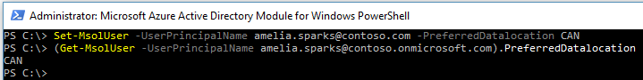

# Configuration du client Office 365 multigéographique

Avant de configurer votre client pour Office 365 multigéographique, veillez à consulter l’[Offre pour Office 365 multigéographique](plan-for-multi-geo.md). Pour suivre la procédure décrite dans cet article, vous devez posséder la liste des emplacements géographiques que vous voulez activer en tant qu’emplacements satellites, ainsi que la liste des utilisateurs de test que vous désirez approvisionner à ces emplacements.

## Ajouter les fonctionnalités multigéographiques de l’offre Office 365 à votre client

Pour utiliser Office 365 multigéographique, vous devez posséder l’offre _Fonctionnalités multigéographiques dans Office 365_. Travaillez avec votre équipe des comptes pour ajouter cette offre à votre client. Votre équipe des comptes vous mettra en contact avec le spécialiste en gestion des licences approprié et votre client sera configuré.

Notez que le plan des _fonctionnalités multigéographiques dans Office 365_ est un plan de service au niveau utilisateur. Vous avez besoin d’une licence pour chaque utilisateur que vous souhaitez héberger dans un emplacement satellite. Vous pouvez ajouter des licences supplémentaires au fur et à mesure que vous ajoutez des utilisateurs dans des emplacements satellites.

Une fois que votre client a été approvisionné avec l’offre _Fonctionnalités multigéographiques dans Office 365_, l’onglet **Emplacements géographiques** est disponible dans les centres d’administration OneDrive et SharePoint.

## Ajouter des emplacements satellites à votre client

Vous devez ajouter un emplacement satellite à chaque emplacement géographique où vous souhaitez stocker des données. Le tableau suivant présente les emplacements géographiques disponibles :

[!INCLUDE [Office 365 Multi-Geo locations](includes/office-365-multi-geo-locations.md)]

Pour ajouter un emplacement satellite

1. Ouvrez le Centre d’administration SharePoint.

2. Accédez à l’onglet **Emplacements géographiques**.

3. Cliquez sur **Ajouter un emplacement**.

4. Sélectionnez l’emplacement à ajouter, puis cliquez sur **Suivant**.

5. Saisissez le domaine que vous souhaitez utiliser avec l’emplacement géographique, puis cliquez sur **Ajouter**.

6. Cliquez sur **Fermer**.

La configuration peut prendre jusqu’à 72 heures selon la taille de votre client. Une fois que la configuration d’un emplacement satellite est terminée, vous recevez un e-mail de confirmation. Lorsque le nouvel emplacement géographique s’affiche en bleu sur la carte sur l’onglet **Emplacements géographiques** dans le centre d’administration OneDrive, vous pouvez définir l’emplacement des données par défaut des utilisateurs sur cet emplacement géographique. 

> [!IMPORTANT]
> Votre nouvel emplacement satellite est configuré avec des paramètres par défaut. Cela vous permettra de configurer cet emplacement satellite en fonction de vos besoins de conformité locale.

## Configuration de l’emplacement des données par défaut des utilisateurs
 

Lorsque vous activez les emplacements satellites nécessaires, vous pouvez mettre à jour vos comptes d’utilisateur pour utiliser l’emplacement de données par défaut approprié. Nous vous recommandons de définir un emplacement de données par défaut pour chaque utilisateur, même si cet utilisateur reste dans l’emplacement central.

> [!IMPORTANT]
> Si l’emplacement des données par défaut d’un utilisateur est défini sur un emplacement qui n’a pas été configuré en tant qu’emplacement satellite ou emplacement central, le système envoie les données par défaut vers l’emplacement central lorsqu’il approvisionne les sites OneDrive et SharePoint, ainsi que les boîtes aux lettres de groupe.

> [!TIP]
> Nous vous recommandons de commencer les validations avec un utilisateur de test ou un petit groupe d’utilisateurs avant de déployer à plus grande échelle les fonctionnalités multigéographiques dans votre organisation.

Deux types d’objets utilisateur sont disponibles dans Azure Active Directory : les utilisateurs cloud uniquement et les utilisateurs synchronisés. Suivez les instructions appropriées pour votre type d’utilisateur.

### Synchroniser l’emplacement des données par défaut de l’utilisateur à l’aide d’Azure Active Directory Connect 

Si les utilisateurs de votre entreprise sont synchronisés à partir d’un système Active Directory local avec Azure Active Directory, leur PreferredDataLocation doit être renseigné dans AD et synchronisé avec AAD. Suivez le processus décrit dans l’article [Synchronisation Azure Active Directory Connect : configurer un emplacement de données par défaut pour les ressources Office 365](/azure/active-directory/hybrid/how-to-connect-sync-feature-preferreddatalocation) pour configurer la synchronisation de l’emplacement des données par défaut à partir d’Active Directory local avec Azure Active Directory.

Nous vous recommandons d’inclure la configuration de l’emplacement des données par défaut de l’utilisateur dans le cadre de votre flux de travail de création utilisateur standard.

> [!IMPORTANT]
> Pour les nouveaux utilisateurs sans approvisionnement OneDrive, attendez au moins 24 heures après la synchronisation d’un emplacement des données par défaut de l’utilisateur avec Azure Active Directory pour que les changements soient appliqués avant que l’utilisateur ne se connecte à OneDrive Entreprise. (Configurer l’emplacement des données par défaut avant que l’utilisateur ne se connecte pour approvisionner son OneDrive Entreprise permet de s’assurer que le nouveau OneDrive de l’utilisateur est approvisionné à l’emplacement approprié.)

### Configurer l’emplacement des données par défaut pour les utilisateurs cloud uniquement 

Si les utilisateurs de votre entreprise ne sont pas synchronisés à partir d’un système Active Directory local avec Azure Active Directory, ce qui signifie qu’ils sont créés dans Office 365 ou Azure Active Directory, l’emplacement des données par défaut doit être défini à l’aide d’Azure Active Directory PowerShell.

Les procédures décrites dans cette section nécessitent le [module Microsoft Azure Active Directory Module pour Windows PowerShell](https://www.powershellgallery.com/packages/MSOnline/1.1.166.0). Si vous avez déjà installé Azure Active Directory pour PowerShell, vérifiez que vous effectuez la mise à jour vers la dernière version.

1.  Ouvrez le Module Microsoft Azure Active Directory pour Windows PowerShell.

2.  Exécutez `Connect-MsolService` et entrez les informations d’identification d’administrateur général pour votre client.

3.  Utilisez la cmdlet [Set-MsolUser](https://docs.microsoft.com/powershell/msonline/v1/set-msoluser) pour définir l’emplacement des données par défaut pour chacun de vos utilisateurs. Par exemple :

    `Set-MsolUser -userprincipalName Robyn.Buckley@Contoso.com -PreferredDatalocation EUR`

    Vous pouvez vérifier pour confirmer que l’emplacement des données par défaut a été correctement mis à jour à l’aide de la cmdlet Get-MsolUser. Par exemple :

    `(Get-MsolUser -userprincipalName Robyn.Buckley@Contoso.com).PreferredDatalocation`

Nous vous recommandons d’inclure la configuration de l’emplacement des données par défaut de l’utilisateur dans le cadre de votre flux de travail de création utilisateur standard.

> [!IMPORTANT]
> Pour les nouveaux utilisateurs sans approvisionnement OneDrive, attendez au moins 24 heures après la configuration d’un emplacement des données par défaut de l’utilisateur pour que les changements soient appliqués avant que l’utilisateur ne se connecte à OneDrive. (Configurer l’emplacement des données par défaut avant que l’utilisateur ne se connecte pour approvisionner son OneDrive Entreprise permet de s’assurer que le nouveau OneDrive de l’utilisateur est approvisionné à l’emplacement approprié.)

## Configuration de OneDrive et l’effet de PDL

Si l’utilisateur possède déjà un site OneDrive créé dans le client, configurer son emplacement des données par défaut ne déplace pas automatiquement son OneDrive existant. Pour déplacer le OneDrive d’un utilisateur, consultez [Déplacement de OneDrive Entreprise multigéographique](move-onedrive-between-geo-locations.md) et suivez les instructions permettant de déplacer OneDrive entre deux emplacements géographiques. (Notez que la boîte aux lettres Exchange de l’utilisateur ne se déplace automatiquement que lorsque vous configurez l’emplacement des données par défaut de l’utilisateur.)

Si l’utilisateur ne dispose pas d’un site OneDrive dans le client, OneDrive est approvisionné pour lui conformément à la valeur de son emplacement des données par défaut en supposant que ce dernier correspond à l’un des emplacements satellites de l’entreprise.

## Configuration de la recherche Multi-Géo

Votre client Multi-Géo aura des fonctionnalités de recherche regroupées permettant à une requête de recherche de renvoyer des résultats de n’importe quel endroit dans le client.

Par défaut, les recherches effectuées à partir de ces points d’entrée renvoient des résultats regroupés, bien que chaque index de recherche se trouve dans son emplacement géographique approprié :

- OneDrive Entreprise

- Delve

- Page d’accueil SharePoint

- Centre de recherche

Par ailleurs, les fonctionnalités de recherche Multi-Géo peuvent être configurées pour vos applications de recherche personnalisées qui utilisent l’API de recherche SharePoint.

Consultez [Configurer la recherche pour OneDrive Entreprise Multi-Géo](configure-search-for-multi-geo.md) pour obtenir des instructions, y compris des informations sur les limitations et les différences.

## Validation de la configuration d’Office 365 multigéographique

Voici certains cas d’utilisation de base que vous pourriez vouloir inclure dans votre plan de validation avant de déployer à grande échelle Office 365 multigéographique dans votre entreprise. Une fois que vous avez terminé ces tests et les cas d’utilisation supplémentaires éventuels et pertinents pour votre entreprise, vous pouvez choisir de commencer à ajouter des utilisateurs à votre groupe pilote initial.

**OneDrive Entreprise**

Sélectionnez OneDrive à partir du lanceur d’applications d’Office 365 et vérifiez que vous êtes automatiquement redirigé vers l’emplacement géographique approprié de l’utilisateur, conformément à l’emplacement des données par défaut de l’utilisateur. OneDrive Entreprise doit maintenant commencer à être approvisionné à cet emplacement. Après l’approvisionnement, essayez de charger et de télécharger quelques documents.

**Application mobile OneDrive**

Connectez-vous à votre application mobile OneDrive avec vos informations d’identification de compte test. Confirmez que vous pouvez voir vos fichiers OneDrive Entreprise et que vous pouvez interagir avec eux à partir de votre appareil mobile.

**Client de synchronisation OneDrive**

Vérifiez que le client de synchronisation OneDrive détecte automatiquement l’emplacement géographique de OneDrive Entreprise dès la connexion. Si vous devez télécharger le client de synchronisation, vous pouvez cliquer sur **Synchroniser** dans la bibliothèque OneDrive.

**Applications Office**

Confirmez que vous pouvez utiliser OneDrive Entreprise en vous connectant à partir d’une application Office, telle que Word. Ouvrez l’application Office, puis sélectionnez « OneDrive- <TenantName> ». Office détecte votre emplacement OneDrive et affiche les fichiers que vous pouvez ouvrir.

**Partage**

Essayez de partager des fichiers OneDrive. Vérifiez que le sélecteur de personnes affiche tous vos utilisateurs SharePoint en ligne indépendamment de leur emplacement géographique.
