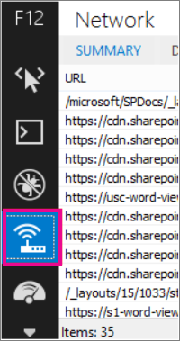
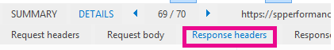
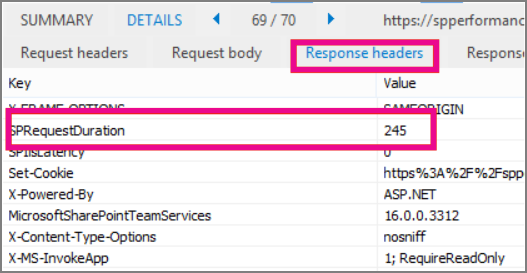
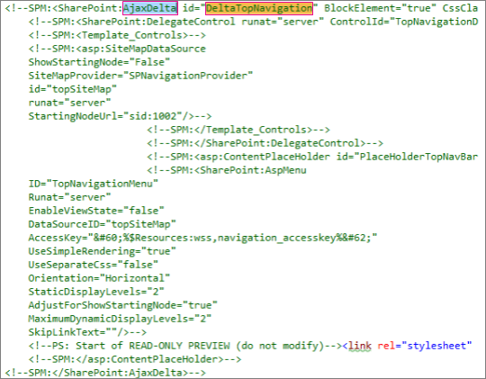

# <a name="navigation-options-for-sharepoint-online"></a>Options de navigation pour SharePoint Online

Cet article décrit les options de navigation sites avec la publication SharePoint activée dans SharePoint Online. Le choix et la configuration de la navigation ont un impact significatif sur les performances et l’extensibilité des sites dans SharePoint Online.

## <a name="overview"></a>Vue d’ensemble

La configuration du fournisseur de navigation peut avoir un impact significatif sur les performances de l’ensemble du site, et vous devez tenir compte de la sélection d’un fournisseur de navigation et d’une configuration qui évoluent efficacement pour les besoins d’un site SharePoint. Il existe deux fournisseurs de navigation prédéfinis, ainsi que des implémentations de navigation personnalisées.

La première option, la [**navigation gérée (métadonnées)**](#using-managed-navigation-and-metadata-in-sharepoint-online), est recommandée et est l’une des options par défaut dans SharePoint Online ; Toutefois, nous vous recommandons de désactiver le filtrage de sécurité, sauf en cas de nécessité. Le filtrage de sécurité est activé comme paramètre sécurisé par défaut pour ce fournisseur de navigation ; Toutefois, de nombreux sites n’ont pas besoin de la charge de filtrage de sécurité, car les éléments de navigation sont souvent cohérents pour tous les utilisateurs du site. Avec la configuration recommandée pour désactiver le filtrage de sécurité, ce fournisseur de navigation ne requiert pas l’énumération de la structure du site et est hautement évolutif avec un impact acceptable sur les performances.

La deuxième option, [**navigation structurelle**](#using-structural-navigation-in-sharepoint-online), **n’est pas une option de navigation recommandée dans SharePoint Online**. Ce fournisseur de navigation a été conçu pour une topologie locale a une prise en charge limitée dans SharePoint Online. Bien qu’il fournisse des fonctionnalités supplémentaires par rapport aux autres options de navigation, ces fonctionnalités, y compris le filtrage de sécurité et l’énumération de la structure de site, ont un coût d’appels serveur excessifs et ont un impact sur l’évolutivité et les performances lorsqu’elles sont utilisées. Les sites qui utilisent la navigation structurée qui consomment des ressources excessives peuvent être soumis à la limitation.

En plus des fournisseurs de navigation prédéfinis, de nombreux clients ont implémenté les autres implémentations de navigation personnalisées. Une classe commune de mises en œuvre de navigation personnalisée comporte des modèles de conception affichés par le client qui stockent un cache local de nœuds de navigation. (Voir **[script côté client](#using-search-driven-client-side-scripting)** basé sur la recherche dans cet article.)

Ces fournisseurs de navigation présentent quelques avantages clés :

- Elles fonctionnent généralement bien avec des conceptions de pages réactives.
- Elles sont extrêmement évolutives et performantes, car elles peuvent être rendues sans coût de ressource (et actualiser en arrière-plan après un délai d’expiration).
- Ces fournisseurs de navigation peuvent extraire des données de navigation à l’aide de différentes stratégies, allant de simples configurations statiques à différents fournisseurs de données dynamiques.

Un exemple de fournisseur de données consiste à utiliser une **navigation**basée sur la recherche, ce qui vous permet d’énumérer les nœuds de navigation et de gérer efficacement le filtrage de sécurité.

Il existe d’autres options populaires pour créer des **fournisseurs de navigation personnalisés**. Pour plus d’informations sur la création d’un fournisseur de navigation personnalisé, consultez [les solutions de navigation pour les portails SharePoint Online](https://docs.microsoft.com/sharepoint/dev/solution-guidance/portal-navigation) .
  
## <a name="pros-and-cons-of-sharepoint-online-navigation-options"></a>Avantages et inconvénients des options de navigation SharePoint Online

Le tableau suivant récapitule les avantages et les inconvénients de chaque option.

|Navigation gérée  |Navigation structurelle  |Navigation basée sur la recherche  |Fournisseur de navigation personnalisée  |
|---------|---------|---------|---------|
|Avantages<br/><br/>Facilité de maintenance<br/>Option recommandée<br/>     |Avantages<br/><br/>Facile à configurer<br/>Sécurité découpée<br/>Mises à jour automatiques au fur et à mesure de l’ajout de contenu<br/>|Avantages<br/><br/>Sécurité découpée<br/>Mises à jour automatiques lors de l’ajout de sites<br/>Temps de chargement rapide et structure de navigation mise en cache locale<br/>|Avantages<br/><br/>Choix plus large d’options disponibles<br/>Chargement rapide lorsque la mise en cache est utilisée correctement<br/>De nombreuses options fonctionnent bien avec la conception de pages réactives<br/>|
|Inconvénients<br/><br/>Mise à jour non automatique pour refléter la structure du site<br/>Impact sur les performances si le filtrage de sécurité est activé<br/>|Inconvénients<br/><br/>**Non recommandé**<br/>**Impact sur les performances et l’extensibilité**<br/>**Soumis à la limitation**<br/>|Inconvénients<br/><br/>Aucune possibilité de classer facilement les sites<br/>Nécessite une personnalisation de la page maître (compétences techniques requises)<br/>|Inconvénients<br/><br/>Un développement personnalisé est requis<br/>La source de données externe/le cache stocké est nécessaire par exemple, Azure<br/>|

L’option la plus appropriée pour votre site dépend de vos besoins en matière de site et de vos capacités techniques. Si vous souhaitez un fournisseur de navigation out-of-out évolutif, la navigation gérée avec filtrage de sécurité désactivé est une très bonne option.

L’option de navigation gérée peut être gérée par le biais de la configuration, n’implique pas de fichiers de personnalisation de code, et elle est beaucoup plus rapide que la navigation structurelle. Si vous avez besoin d’un filtrage de sécurité et que vous êtes familiarisé à l’utilisation d’une page maître personnalisée et que vous disposez d’une fonctionnalité dans l’Organisation pour conserver les modifications susceptibles de se produire dans la page maître par défaut pour SharePoint Online, l’option de recherche peut produire une meilleure expérience utilisateur. Si vous avez des exigences plus complexes, un fournisseur de navigation personnalisé peut être le bon choix. La navigation structurelle n’est pas recommandée.

Enfin, il est important de noter que SharePoint ajoute des fournisseurs de navigation et des fonctionnalités supplémentaires pour les architectures de sites SharePoint modernes exploitant une hiérarchie de sites plus aplatie et un modèle Hub-and-spoke avec des sites hub SharePoint. Cela permet de réaliser de nombreux scénarios qui ne nécessitent pas l’utilisation de la fonctionnalité de publication SharePoint, et ces configurations de navigation sont optimisées pour l’extensibilité et la latence dans SharePoint Online. Notez que l’application du même principe de simplification de la structure globale de votre site de publication SharePoint à une structure plus plat est souvent utile avec les performances globales et l’étendue. Cela signifie qu’au lieu d’avoir une seule collection de sites avec des centaines de sites (sous-sites Web), une meilleure approche consiste à avoir de nombreuses collections de sites avec très peu de sous-sites (sous-sites Web).

## <a name="using-managed-navigation-and-metadata-in-sharepoint-online"></a>Utilisation de la navigation gérée et des métadonnées dans SharePoint Online

La navigation gérée est une autre option prédéfinie que vous pouvez utiliser pour recréer la plupart des fonctionnalités de navigation structurelle. Les métadonnées gérées peuvent être configurées de façon à activer ou désactiver le filtrage de sécurité. Lorsqu’elle est configurée avec filtrage de sécurité désactivé, la navigation gérée est assez efficace car elle charge tous les liens de navigation avec un nombre constant d’appels serveur. Toutefois, l’activation du filtrage de sécurité annule certains des avantages de la navigation gérée, et les clients peuvent choisir d’explorer l’une des solutions de navigation personnalisées pour des performances et une évolutivité optimales.

De nombreux sites n’ont pas besoin d’un filtrage de sécurité, car la structure de navigation est souvent cohérente pour tous les utilisateurs du site. Si le filtrage de sécurité est désactivé et qu’un lien est ajouté à la navigation et que tous les utilisateurs n’ont pas accès à, le lien continuera de s’afficher mais entraînera un message de refus d’accès. Il n’y a aucun risque d’accès involontaire au contenu.

### <a name="how-to-implement-managed-navigation-and-the-results"></a>Comment implémenter la navigation gérée et les résultats

Il existe plusieurs articles sur Docs.Microsoft.com sur les détails de la navigation gérée, par exemple, voir [Overview of Managed navigation in SharePoint Server](https://docs.microsoft.com/sharepoint/administration/overview-of-managed-navigation).

Pour implémenter la navigation gérée, vous configurez des termes avec des URL correspondant à la structure de navigation du site. La navigation gérée peut même être organisée manuellement pour remplacer la navigation structurelle dans de nombreux cas. Par exemple :


L’exemple suivant montre les performances de la navigation complexe à l’aide de la navigation gérée.


L’utilisation de la navigation gérée améliore de façon cohérente les performances par rapport à l’approche de navigation structurelle.
  
## <a name="using-structural-navigation-in-sharepoint-online"></a>Utilisation de la navigation structurelle dans SharePoint Online

Il s’agit de la navigation prédéfinie utilisée par défaut et est la solution la plus simple, mais elle présente un compromis entre performances onéreux. Il ne nécessite aucune personnalisation et un utilisateur non-technique peut également facilement ajouter des éléments, masquer des éléments et gérer la navigation dans la page Paramètres. Ceci est toutefois également vrai pour la navigation gérée, c’est pourquoi il est recommandé d’utiliser la navigation gérée comme cela peut également être géré et contrôlé facilement et avec de meilleures performances.


  
### <a name="turning-on-structural-navigation-in-sharepoint-online"></a>Activation de la navigation structurelle dans SharePoint Online

Montrer comment les performances d’une solution SharePoint Online standard avec navigation structurelle et l’option Afficher les sous-sites sont activées. Vous trouverez ci-dessous une capture d’écran des paramètres de **navigation**des **paramètres** \> de site de la page.
  

  
### <a name="analyzing-structural-navigation-performance-in-sharepoint-online"></a>Analyse des performances de navigation structurelle dans SharePoint Online

Pour analyser les performances d’une page SharePoint, utilisez l’onglet **réseau** des outils de développement F12 dans Internet Explorer.
  

  
1. Dans l’onglet **réseau** , cliquez sur la page. aspx en cours de chargement, puis cliquez sur l’onglet **Détails** .<br/> <br/>
2. Cliquez sur **en-têtes de réponse**. <br/><br/>SharePoint renvoie des informations de diagnostic utiles dans ses en-têtes de réponse. 
3. L’un des éléments d’information les plus utiles est **SPRequestDuration** , qui est la valeur, en millisecondes, de la durée de traitement d’une demande sur le serveur. Dans la capture d’écran suivante, les **sous-sites** ne sont pas vérifiés pour la navigation structurelle. Cela signifie qu’il n’existe qu’un lien de collection de sites dans la navigation globale :<br/><br/>
4. La valeur de la clé **SPRequestDuration** est de 245 millisecondes. Cela représente le temps nécessaire pour retourner la demande. Étant donné qu’il n’existe qu’un seul élément de navigation sur le site, il s’agit d’un point de référence adapté à la façon dont SharePoint Online effectue la navigation. La capture d’écran suivante montre comment l’ajout dans les sous-sites affecte cette clé.<br/><br/>
  
L’ajout des sous-sites a considérablement augmenté le temps nécessaire pour renvoyer la demande de page pour cet exemple de site relativement simple. Les hiérarchies de sites complexes, y compris les pages de navigation, ainsi que d’autres options de configuration et de topologie, peuvent considérablement augmenter cet impact.

## <a name="using-search-driven-client-side-scripting"></a>Utilisation de scripts côté client basés sur la recherche

À l’aide de la recherche, vous pouvez tirer parti des index créés en arrière-plan à l’aide de l’analyse continue. Les résultats de la recherche sont extraits de l’index de recherche et les résultats sont découpés en sécurité. Cette règle est généralement plus rapide que les fournisseurs de navigation out-of-Box lorsque le filtrage de sécurité est requis. L’utilisation de la recherche pour la navigation structurelle, en particulier si vous avez une structure de site complexe, accélère considérablement le temps de chargement de la page. Le principal avantage de cette barre de navigation gérée est que vous bénéficiez du filtrage de sécurité.

Cette approche implique la création d’une page maître personnalisée et le remplacement du code de navigation par des éléments HTML personnalisés. Suivez cette procédure décrite dans l’exemple suivant pour remplacer le code de navigation dans le `seattle.html`fichier. Dans cet exemple, vous ouvrez le `seattle.html` fichier et remplacez l’intégralité de l' `id=”DeltaTopNavigation”` élément par du code HTML personnalisé.

### <a name="example-replace-the-out-of-the-box-navigation-code-in-a-master-page"></a>Exemple : remplacer le code de navigation prédéfinie dans une page maître

1. Accédez à la page Paramètres du site.
2. Ouvrez la Galerie de pages maîtres en cliquant sur **pages maîtres**.
3. À partir de là, vous pouvez naviguer dans la bibliothèque et `seattle.master`Télécharger le fichier.
4. Modifiez le code à l’aide d’un éditeur de texte et supprimez le bloc de code dans la capture d’écran suivante.<br/><br/>
5. Supprimez le code entre `<SharePoint:AjaxDelta id=”DeltaTopNavigation”>` les `<\SharePoint:AjaxDelta>` balises et remplacez-le par l’extrait de code suivant :<br/>

```javascript
<div id="loading">
  <!--Replace with path to loading image.-->
  <div style="background-image: url(''); height: 22px; width: 22px; ">
  </div>
</div>
<!-- Main Content-->
<div id="navContainer" style="display:none">
    <div data-bind="foreach: hierarchy" class="noindex ms-core-listMenu-horizontalBox">
        <a class="dynamic menu-item ms-core-listMenu-item ms-displayInline ms-navedit-linkNode" data-bind="attr: { href: item.Url, title: item.Title }">
            <span class="menu-item-text" data-bind="text: item.Title">
            </span>
        </a>
        <ul id="menu" data-bind="foreach: $data.children" style="padding-left:20px">
            <li class="static dynamic-children level1">
                <a class="static dynamic-children menu-item ms-core-listMenu-item ms-displayInline ms-navedit-linkNode" data-bind="attr: { href: item.Url, title: item.Title }">
               
                 <!-- ko if: children.length > 0-->
                    <span aria-haspopup="true" class="additional-background ms-navedit-flyoutArrow dynamic-children">
                        <span class="menu-item-text" data-bind="text: item.Title">
                        </span>
                    </span>
                <!-- /ko -->
                <!-- ko if: children.length == 0-->
                    <span aria-haspopup="true" class="ms-navedit-flyoutArrow dynamic-children">
                        <span class="menu-item-text" data-bind="text: item.Title">
                        </span>
                    </span>
                <!-- /ko -->
                </a>
               
                <!-- ko if: children.length > 0-->
                <ul id="menu"  data-bind="foreach: children;" class="dynamic  level2" >
                    <li class="dynamic level2">
                        <a class="dynamic menu-item ms-core-listMenu-item ms-displayInline  ms-navedit-linkNode" data-bind="attr: { href: item.Url, title: item.Title }">
         
          <!-- ko if: children.length > 0-->
          <span aria-haspopup="true" class="additional-background ms-navedit-flyoutArrow dynamic-children">
           <span class="menu-item-text" data-bind="text: item.Title">
           </span>
          </span>
           <!-- /ko -->
          <!-- ko if: children.length == 0-->
          <span aria-haspopup="true" class="ms-navedit-flyoutArrow dynamic-children">
           <span class="menu-item-text" data-bind="text: item.Title">
           </span>
          </span>
          <!-- /ko -->
                        </a>
          <!-- ko if: children.length > 0-->
         <ul id="menu" data-bind="foreach: children;" class="dynamic level3" >
          <li class="dynamic level3">
           <a class="dynamic menu-item ms-core-listMenu-item ms-displayInline ms-navedit-linkNode" data-bind="attr: { href: item.Url, title: item.Title }">
            <span class="menu-item-text" data-bind="text: item.Title">
            </span>
           </a>
          </li>
         </ul>
           <!-- /ko -->
                    </li>
                </ul>
                <!-- /ko -->
            </li>
        </ul>
    </div>
</div>
```
<br/>
6. Remplacez l’URL de la balise d’ancrage de l’image de chargement au début, par un lien vers une image de chargement dans votre collection de sites. Une fois les modifications apportées, renommez le fichier, puis téléchargez-le dans la Galerie de pages maîtres. Cela génère un nouveau fichier. Master.<br/>
7. Ce code HTML est le balisage de base qui sera rempli par les résultats de recherche renvoyés par le code JavaScript. Vous devrez modifier le code pour modifier la valeur de var root = "URL de la collection de sites", comme illustré dans l’extrait de code suivant :<br/>

```javascript
var root = “https://spperformance.sharepoint.com/sites/NavigationBySearch”;
```
<br/>
8. Les résultats sont attribués au tableau self. Nodes et une hiérarchie est créée à partir des objets à l’aide de Linq. js assignant la sortie à un tableau self. Hierarchy. Ce tableau est l’objet lié au code HTML. Cette opération est exécutée dans la fonction toggleView () en transmettant l’objet Self à la fonction Ko. applyBinding ().<br/>Ainsi, le tableau de hiérarchie est lié au code HTML suivant :<br/>

```javascript
<div data-bind=”foreach: hierarchy” class=”noindex ms-core-listMenu-horizontalBox”>
```

Les gestionnaires d’événements pour `mouseenter` et `mouseexit` sont ajoutés à la navigation de niveau supérieur pour gérer les menus déroulants de sous-site qui sont exécutés dans la `addEventsToElements()` fonction.

Dans notre exemple de navigation complexe, un chargement de page récent sans mise en cache locale indique que le temps passé sur le serveur a été réduit à partir de la navigation structurelle de référence pour obtenir un résultat similaire à l’approche de navigation gérée.

### <a name="about-the-javascript-file"></a>À propos du fichier JavaScript...

L’intégralité du fichier JavaScript se présente comme suit :

```javascript
//Models and Namespaces
var SPOCustom = SPOCustom || {};
SPOCustom.Models = SPOCustom.Models || {}
SPOCustom.Models.NavigationNode = function () {

    this.Url = ko.observable("");
    this.Title = ko.observable("");
    this.Parent = ko.observable("");

};

var root = "https://spperformance.sharepoint.com/sites/NavigationBySearch";
var baseUrl = root + "/_api/search/query?querytext=";
var query = baseUrl + "'contentClass=\"STS_Web\"+path:" + root + "'&trimduplicates=false&rowlimit=300";

var baseRequest = {
    url: "",
    type: ""
};


//Parses a local object from JSON search result.
function getNavigationFromDto(dto) {
    var item = new SPOCustom.Models.NavigationNode();
    if (dto != undefined) {

        var webTemplate = getSearchResultsValue(dto.Cells.results, 'WebTemplate');

        if (webTemplate != "APP") {
            item.Title(getSearchResultsValue(dto.Cells.results, 'Title')); //Key = Title
            item.Url(getSearchResultsValue(dto.Cells.results, 'Path')); //Key = Path
            item.Parent(getSearchResultsValue(dto.Cells.results, 'ParentLink')); //Key = ParentLink
        }

    }
    return item;
}

function getSearchResultsValue(results, key) {

    for (i = 0; i < results.length; i++) {
        if (results[i].Key == key) {
            return results[i].Value;
        }
    }
    return null;
}

//Parse a local object from the serialized cache.
function getNavigationFromCache(dto) {
    var item = new SPOCustom.Models.NavigationNode();

    if (dto != undefined) {

        item.Title(dto.Title);
        item.Url(dto.Url);
        item.Parent(dto.Parent);
    }

    return item;
}

/* create a new OData request for JSON response */
function getRequest(endpoint) {
    var request = baseRequest;
    request.type = "GET";
    request.url = endpoint;
    request.headers = { ACCEPT: "application/json;odata=verbose" };
    return request;
};

/* Navigation Module*/
function NavigationViewModel() {
    "use strict";
    var self = this;
    self.nodes = ko.observableArray([]);
    self.hierarchy = ko.observableArray([]);;
    self.loadNavigatioNodes = function () {
        //Check local storage for cached navigation datasource.
        var fromStorage = localStorage["nodesCache"];
        if (false) {
            var cachedNodes = JSON.parse(localStorage["nodesCache"]);

            if (cachedNodes && timeStamp) {
                //Check for cache expiration. Currently set to 3 hrs.
                var now = new Date();
                var diff = now.getTime() - timeStamp;
                if (Math.round(diff / (1000 * 60 * 60)) < 3) {

                    //return from cache.
                    var cacheResults = [];
                    $.each(cachedNodes, function (i, item) {
                        var nodeitem = getNavigationFromCache(item, true);
                        cacheResults.push(nodeitem);
                    });

                    self.buildHierarchy(cacheResults);
                    self.toggleView();
                    addEventsToElements();
                    return;
                }
            }
        }
        //No cache hit, REST call required.
        self.queryRemoteInterface();
    };

    //Executes a REST call and builds the navigation hierarchy.
    self.queryRemoteInterface = function () {
        var oDataRequest = getRequest(query);
        $.ajax(oDataRequest).done(function (data) {
            var results = [];
            $.each(data.d.query.PrimaryQueryResult.RelevantResults.Table.Rows.results, function (i, item) {

                if (i == 0) {
                    //Add root element.
                    var rootItem = new SPOCustom.Models.NavigationNode();
                    rootItem.Title("Root");
                    rootItem.Url(root);
                    rootItem.Parent(null);
                    results.push(rootItem);
                }
                var navItem = getNavigationFromDto(item);
                results.push(navItem);
            });
            //Add to local cache
            localStorage["nodesCache"] = ko.toJSON(results);

            localStorage["nodesCachedAt"] = new Date().getTime();
            self.nodes(results);
            if (self.nodes().length > 0) {
                var unsortedArray = self.nodes();
                var sortedArray = unsortedArray.sort(self.sortObjectsInArray);

                self.buildHierarchy(sortedArray);
                self.toggleView();
                addEventsToElements();
            }
        }).fail(function () {
            //Handle error here!!
            $("#loading").hide();
            $("#error").show();
        });
    };
    self.toggleView = function () {
        var navContainer = document.getElementById("navContainer");
        ko.applyBindings(self, navContainer);
        $("#loading").hide();
        $("#navContainer").show();

    };
    //Uses linq.js to build the navigation tree.
    self.buildHierarchy = function (enumerable) {
        self.hierarchy(Enumerable.From(enumerable).ByHierarchy(function (d) {
            return d.Parent() == null;
        }, function (parent, child) {
            if (parent.Url() == null || child.Parent() == null)
                return false;
            return parent.Url().toUpperCase() == child.Parent().toUpperCase();
        }).ToArray());

        self.sortChildren(self.hierarchy()[0]);
    };


    self.sortChildren = function (parent) {

        // sjip processing if no children
        if (!parent || !parent.children || parent.children.length === 0) {
            return;
        }

        parent.children = parent.children.sort(self.sortObjectsInArray2);

        for (var i = 0; i < parent.children.length; i++) {
            var elem = parent.children[i];

            if (elem.children && elem.children.length > 0) {
                self.sortChildren(elem);
            }
        }
    };

    // ByHierarchy method breaks the sorting in chrome and firefox
    // we need to resort  as ascending
    self.sortObjectsInArray2 = function (a, b) {
        if (a.item.Title() > b.item.Title())
            return 1;
        if (a.item.Title() < b.item.Title())
            return -1;
        return 0;
    };


    self.sortObjectsInArray = function (a, b) {
        if (a.Title() > b.Title())
            return -1;
        if (a.Title() < b.Title())
            return 1;
        return 0;
    }
}

//Loads the navigation on load and binds the event handlers for mouse interaction.
function InitCustomNav() {
    var viewModel = new NavigationViewModel();
    viewModel.loadNavigatioNodes();
}

function addEventsToElements() {
    //events.
      $("li.level1").mouseover(function () {
          var position = $(this).position();
          $(this).find("ul.level2").css({ width: 100, left: position.left + 10, top: 50 });
      })
   .mouseout(function () {
     $(this).find("ul.level2").css({  left: -99999, top: 0 });
   
    });
   
     $("li.level2").mouseover(function () {
          var position = $(this).position();
          console.log(JSON.stringify(position));
          $(this).find("ul.level3").css({ width: 100, left: position.left + 95, top:  position.top});
      })
   .mouseout(function () {
     $(this).find("ul.level3").css({  left: -99999, top: 0 });
    });
} _spBodyOnLoadFunctionNames.push("InitCustomNav");

```

Pour résumer le code indiqué ci-dessus `jQuery $(document).ready` dans la fonction, `viewModel object` une fonction est créée `loadNavigationNodes()` , puis la fonction sur cet objet est appelée. Cette fonction charge la hiérarchie de navigation précédemment créée stockée dans le stockage local HTML5 du navigateur client ou appelle la fonction `queryRemoteInterface()`.

`QueryRemoteInterface()`génère une demande à l' `getRequest()` aide de la fonction avec le paramètre de requête défini précédemment dans le script, puis retourne des données à partir du serveur. Ces données sont essentiellement un tableau de tous les sites de la collection de sites, représentés par des objets de transfert de données, avec différentes propriétés. 

Ces données sont ensuite analysées dans les objets définis `SPO.Models.NavigationNode` précédemment qui utilisent `Knockout.js` pour créer des propriétés observables utilisées par la liaison de données des valeurs dans le code HTML que nous avons défini précédemment. 

Les objets sont ensuite placés dans un tableau de résultats. Ce tableau est analysé dans JSON à l’aide du masquage et stocké dans le stockage du navigateur local pour de meilleures performances lors des prochains chargement de la page.

### <a name="benefits-of-this-approach"></a>Avantages de cette approche

L’un des principaux avantages de [cette approche](#example-replace-the-out-of-the-box-navigation-code-in-a-master-page) est qu’en utilisant le stockage local HTML5, la navigation est stockée localement pour l’utilisateur lors du prochain chargement de la page. Nous obtenons des améliorations majeures en matière de performances à l’aide de l’API de recherche pour la navigation structurelle ; Toutefois, il prend certaines capacités techniques pour exécuter et personnaliser cette fonctionnalité. 

Dans l' [exemple d’implémentation](#example-replace-the-out-of-the-box-navigation-code-in-a-master-page), les sites sont triés de la même manière que la navigation structurelle prédéfinie ; ordre alphabétique. Si vous souhaitez vous en écarter, il serait plus compliqué de développer et de gérer. Cette approche nécessite également de s’écarter des pages maîtres prises en charge. Si la page maître personnalisée n’est pas conservée, votre site se déplacera sur les mises à jour et les améliorations que Microsoft apporte aux pages maîtres.

Le [code ci-dessus](#about-the-javascript-file) présente les dépendances suivantes :

- jQueryhttps://jquery.com/
- KnockoutJS -https://knockoutjs.com/
- Linq. js- https://linqjs.codeplex.com/ou github.com/neuecc/Linq.js

La version actuelle de LinqJS ne contient pas la méthode ByHierarchy utilisée dans le code ci-dessus et rompt le code de navigation. Pour résoudre ce problème, ajoutez la méthode suivante au fichier Linq. js avant la ligne `Flatten: function ()`.

```javascript
ByHierarchy: function(firstLevel, connectBy, orderBy, ascending, parent) {
     ascending = ascending == undefined ? true : ascending;
     var orderMethod = ascending == true ? 'OrderBy' : 'OrderByDescending';
     var source = this;
     firstLevel = Utils.CreateLambda(firstLevel);
     connectBy = Utils.CreateLambda(connectBy);
     orderBy = Utils.CreateLambda(orderBy);
    
     //Initiate or increase level
     var level = parent === undefined ? 1 : parent.level + 1;

    return new Enumerable(function() {
         var enumerator;
         var index = 0;

        var createLevel = function() {
                 var obj = {
                     item: enumerator.Current(),
                     level : level
                 };
                 obj.children = Enumerable.From(source).ByHierarchy(firstLevel, connectBy, orderBy, ascending, obj);
                 if (orderBy !== undefined) {
                     obj.children = obj.children[orderMethod](function(d) {
                         return orderBy(d.item); //unwrap the actual item for sort to work
                     });
                 }
                 obj.children = obj.children.ToArray();
                 Enumerable.From(obj.children).ForEach(function(child) {
                     child.getParent = function() {
                         return obj;
                     };
                 });
                 return obj;
             };

        return new IEnumerator(

        function() {
             enumerator = source.GetEnumerator();
         }, function() {
             while (enumerator.MoveNext()) {
                 var returnArr;
                 if (!parent) {
                     if (firstLevel(enumerator.Current(), index++)) {
                         return this.Yield(createLevel());
                     }

                } else {
                     if (connectBy(parent.item, enumerator.Current(), index++)) {
                         return this.Yield(createLevel());
                     }
                 }
             }
             return false;
         }, function() {
             Utils.Dispose(enumerator);
         })
     });
 },

```
  
## <a name="related-topics"></a>Voir aussi

[Vue d'ensemble de la navigation gérée dans SharePoint Server](https://docs.microsoft.com/sharepoint/administration/overview-of-managed-navigation)
