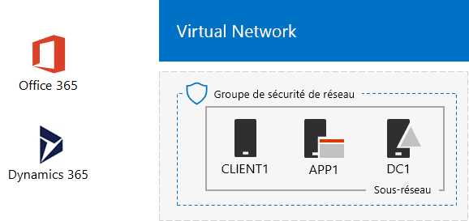

# Environnement de développement/test Office 365 et Dynamics 365Office 365 and Dynamics 365 dev/test environment

 **Résumé :** Utilisez ce Guide de laboratoire de Test pour ajouter Dynamics 365 à votre environnement de développement/test Office 365.**Summary:** Use this Test Lab Guide to add Dynamics 365 to your Office 365 dev/test environment.
  
Suivez les instructions fournies dans cet article pour ajouter un abonnement à la version d’évaluation de Dynamics 365 à la même organisation que votre environnement de développement/test Office 365, créant ainsi un environnement de développement/test Office 365 et Dynamics 365.With the instructions in this article, you add a Dynamics 365 trial subscription to the same organization as your Office 365 dev/test environment, creating an Office 365 and Dynamics 365 dev/test environment.

  
  
Vous pouvez utiliser un abonnement à la version d’évaluation de Dynamics 365 afin de présenter les fonctionnalités de Dynamics 365. Les solutions suivantes sont comprises dans la version d’évaluation Enterprise Edition de Dynamics 365 Plan 1 :You can use a Dynamics 365 trial subscription to demonstrate features and capabilities of Dynamics 365. The following solutions are included with a Dynamics 365 Plan 1, Enterprise Edition trial:
  
- [Microsoft Dynamics 365 pour les ventes](https://www.microsoft.com/dynamics365/sales). Augmenter vos ventes avec automation et aide à la décision numérique aidant à vos commerciaux se concentrer et travailler plus efficacement.[Microsoft Dynamics 365 for Sales](https://www.microsoft.com/dynamics365/sales). Increase your sales with automation and digital intelligence helping your salespeople stay focused and work smarter.
    
- [Microsoft Dynamics 365 pour le Service clientèle](https://www.microsoft.com/dynamics365/customer-service). Gagnez fidélité en donnant à vos agents les informations complètes et numérique aide à la décision que dont ils ont besoin pour fournir le service transparent.[Microsoft Dynamics 365 for Customer Service](https://www.microsoft.com/dynamics365/customer-service). Earn loyalty by giving your agents the complete information and digital intelligence they need to provide seamless service.
    
- [Microsoft Dynamics 365 pour le Service clientèle](https://www.microsoft.com/dynamics365/field-service). Contrôleur de l’appel de service en optimisant vos planifications, équipant votre personnel et à l’aide des outils prédictives pour augmenter la marge.[Microsoft Dynamics 365 for Field Service](https://www.microsoft.com/dynamics365/field-service). Master the service call by optimizing your schedules, equipping your workforce, and using predictive tools to increase profit.
    
- [Microsoft Dynamics 365 pour l’automatisation de Service Project](https://www.microsoft.com/en-us/dynamics365/project-service-automation). Se termine correctement vos projets et créer des relations rentables avec les employés productifs et outils intelligents.[Microsoft Dynamics 365 for Project Service Automation](https://www.microsoft.com/en-us/dynamics365/project-service-automation). Complete your projects successfully and create profitable relationships with productive employees and intelligent tools.
    
Vous pouvez explorer l’un des éléments ci-dessus pour votre abonnement à la version d’évaluation de Dynamics 365.You can explore one or more of the above for your Dynamics 365 trial subscription.
  

  
> [!TIP]
> Cliquez [ici](http://aka.ms/catlgstack) pour afficher le plan de tous les articles de l’ensemble de guides de laboratoire de test de Microsoft Cloud.Click [here](http://aka.ms/catlgstack) for a visual map to all the articles in the One Microsoft Cloud Test Lab Guide stack.
  
## Phase 1 : Créer votre environnement de développement/test Office 365 en mode léger ou pour entreprise simuléePhase 1: Build out your lightweight or simulated enterprise Office 365 dev/test environment

Si vous souhaitez uniquement tester Office 365 et Dynamics 365 dans une solution légère avec la configuration minimale requise, suivez les instructions en phases 2 et 3 de [l’environnement de développement/test Office 365](office-365-dev-test-environment.md).If you just want to test Office 365 and Dynamics 365 in a lightweight way with the minimum requirements, follow the instructions in phases 2 and 3 of [Office 365 dev/test environment](office-365-dev-test-environment.md).
  
Si vous souhaitez tester une entreprise simulée Dynamics 365 et Office 365, suivez les instructions de [synchronisation d’annuaire pour votre environnement de développement/test Office 365](dirsync-for-your-office-365-dev-test-environment.md).If you want to test Office 365 and Dynamics 365 for a simulated enterprise, follow the instructions in [DirSync for your Office 365 dev/test environment](dirsync-for-your-office-365-dev-test-environment.md).

  
> [!NOTE]
> La configuration décrite dans cet article ne requiert pas l’environnement de développement/test en entreprise simulée, qui utilise un intranet simulé connecté à Internet et la synchronisation d’annuaire pour une forêt Windows Server Active Directory. Il est proposé comme option dans cet article afin que vous puissiez tester Office 365 et Dynamics 365 dans un environnement qui représente une organisation classique.The configuration in this article does not require the simulated enterprise dev/test environment, which includes a simulated intranet connected to the Internet and directory synchronization for a Windows Server AD forest. It is provided here as an option so that you can experiment with Office 365 and Dynamics 365 in an environment that represents a typical organization. 
  
## Phase 2 : Ajouter un abonnement à la version d’évaluation de Dynamics 365Phase 2: Add a Dynamics 365 trial subscription

Dans cette phase, vous vous inscrivez pour l’abonnement d’évaluation Dynamics 365 et l’ajoutez à la même organisation que votre abonnement d’évaluation Office 365.In this phase, you sign up for the Dynamics 365 trial subscription and add it to the same organization as your Office 365 trial subscription.
  
### Inscription à un abonnement à la version d’évaluation de Dynamics 365Sign up for a Dynamics 365 trial subscription

1. Via un navigateur soit sur votre ordinateur de bureau (lightweight) ou à partir de CLIENT1 (entreprise en simulation), connectez-vous au portail Office 365 à [https://portal.office.com](https://portal.office.com) avec les informations d’identification de votre compte d’administrateur global.Using a browser on either your desktop computer (lightweight) or from CLIENT1 (simulated enterprise), sign in to the Office 365 portal at [https://portal.office.com](https://portal.office.com) with the credentials of your global administrator account.
    
2. Cliquez sur la vignette **Administration**.Click the **Admin** tile.
    
3. Dans l’onglet **Centre d’administration Office** , dans la navigation de gauche, cliquez sur **facturation > achat de services**.On the **Office admin center** tab, in the left navigation, click **Billing > Purchase services**.
    
4. Dans la page **services d’achat** , recherchez l’élément **Dynamics 365 Plan 1 Enterprise Edition** . Placez le pointeur de la souris au-dessus de celle-ci, cliquez sur **Démarrer la version d’évaluation gratuite**.On the **Purchase services** page, find the **Dynamics 365 Plan 1 Enterprise Edition** item. Hover your mouse pointer over it and click **Start free trial**.
    
5. Dans la page **Confirmer votre commande**, cliquez sur **Essayer maintenant**.On the **Confirm your order** page, click **Try now**.
    
6. Dans la page **Réception de la commande**, cliquez sur **Continuer**.On the **Order receipt** page, click **Continue**.

    
> [!NOTE]
> L’abonnement d’évaluation Dynamics 365 Plan 1 Enterprise Edition est valide pendant 30 jours. Vous pouvez facilement étendre l’abonnement d’évaluation pour une période supplémentaire de 30 jours. Pour un environnement de développement/test permanent, créez un nouvel abonnement payant avec un nombre réduit de licences.The Dynamics 365 Plan 1 Enterprise Edition trial subscription is 30 days. You can easily extend the trail subscription for another 30 days. For a permanent dev/test environment, create a new paid subscription with a small number of licenses. 
  
## Phase 3 : Attribuer des administrateurs système et des licences Dynamics 365Phase 3: Assign Dynamics 365 licenses and system administrators

Lors de cette phrase, vous allez affecter des licences Dynamics 365 aux comptes de l’administrateur général, ainsi qu’aux comptes Utilisateur 2 et Utilisateur 3 afin de leur attribuer le rôle d’administrateur système.In this phase, you assign Dynamics 365 licenses to the global administrator, User 2, and User 3 accounts and make them system administrators.
  
Suivez ces étapes pour affecter des licences Dynamics 365.Use these steps to assign Dynamics 365 licenses.
  
1. Dans l’onglet **Centre d’administration Office** , cliquez sur **utilisateurs > utilisateurs actifs**.On the **Office admin center** tab, click **Users > Active users**.
    
2. Dans la liste d’utilisateurs actifs, cliquez sur votre compte d’administrateur global, puis cliquez sur **Modifier** pour les **licences de produit**.In the list of active users, click your global administrator account, and then click **Edit** for **Product licenses**.
    
3. Dans le volet de **licences** , activer la licence de produit pour **Dynamics 365 Plan 1 Enterprise Edition** **activé**et cliquez sur **Enregistrer,** puis cliquez deux fois sur **Fermer** .On the **Product licenses** pane, turn the product license for **Dynamics 365 Plan 1 Enterprise Edition** to **On**, click **Save,** and then click **Close** twice.
    
4. Suivez les étapes 2 et 3 pour les comptes Utilisateur 2 et Utilisateur 3.Perform steps 2 and 3 for the User 2 and User 3 accounts.
    
5. Fermez l’onglet **Centre d’administration Office** .Close the **Office admin center** tab.
    
Lors de cette phase, vous allez configurer les comptes Utilisateur 2 et Utilisateur 3 en tant qu’administrateurs système de Dynamics 365.Use these steps to configure the User 2 and User 3 accounts as Dynamics 365 system administrators.
  
1. Sous l’onglet **Accueil de Microsoft Office** , cliquez sur **Admin**.From the **Microsoft Office Home** tab, click **Admin**.
    
2. Sous l’onglet **Centre d’administration d’Office** , dans la navigation de gauche, cliquez sur **Centre d’administration**, puis cliquez sur **Dynamics 365**.On the **Office Admin center** tab, in the left navigation, click **Admin centers**, and then click **Dynamics 365**.
    
    Vous devrez peut-être attendre la fin de l’approvisionnement de Dynamics 365 avant de le voir apparaître dans le menu.You may need to wait for Dynamics 365 to finish provisioning before Dynamics 365 appears in the menu.
    
3. Sous l’onglet Dynamics 365, cliquez sur **tous ces éléments**, puis cliquez sur **le programme d’installation complète.**On the Dynamics 365 tab, click **All of these**, and then click **Complete Setup.**
    
    Attendez la fin de l’installation.Wait for setup to complete.
    
    Lorsque le programme d’installation est terminée, il affiche un tableau de bord ventes activité basés sur des données qui fait partie de l’abonnement de piste. Prendre un certain temps pour afficher la **Bienvenue dans la version d’évaluation de votre** vidéo. Fermez la fenêtre vidéo lorsque vous avez terminé.When setup completes, it displays a Sales Activity Dashboard based on sample data that is part of the trail subscription. Take a few moments to view the **Welcome to your trial** video. Close the video window when complete.
    
4. Dans la barre d’outils dans la partie supérieure, cliquez sur la flèche vers le bas en regard de **ventes**, cliquez sur **paramètres**, puis cliquez sur **sécurité**.On the toolbar at the top, click the down arrow next to **Sales**, click **Settings**, and then click **Security**.
    
5. Dans la page **sécurité** , cliquez sur **utilisateurs**.On the **Security** page, click **Users**.
    
6. Dans la liste des utilisateurs, cliquez sur **utilisateur 2**.In the list of users, click **User 2**.
    
7. Dans la barre d’outils, cliquez sur **Gérer les rôles**.In the tool bar, click **Manage Roles**.
    
8. **Gérer les rôles**, cliquez sur **Administrateur système**, puis cliquez sur **OK**.In **Manage Roles**, click **System Administrator**, and then click **OK**.
    
9. Dans la barre d’outils dans la partie supérieure, cliquez sur **sécurité**.In the tool bar at the top click **Security**.
    
10. Répétez les étapes 5 à 8 pour le compte Utilisateur 3.Repeat steps 5-8 for the User 3 account.
    
11. Fermer la **utilisateur : User3** onglet.Close the **User: User3** tab.
    
> [!NOTE]
> Le rôle d’administrateur système Dynamics 365 a été automatiquement attribué à votre compte d’administrateur général Office 365.Your Office 365 global administrator account was automatically assigned the Dynamics 365 system administrator role. 
  
Votre environnement de développement/test Office 365 et Dynamics 365 a maintenant :Your Office 365 and Dynamics 365 dev/test environment now has:
  
- Des abonnements à la version d’évaluation d’Office 365 E5 Enterprise et de Dynamics 365 qui partagent la même organisation et le même client Azure AD avec votre liste des comptes d’utilisateur.Office 365 E5 Enterprise and Dynamics 365 trial subscriptions sharing the same organization and the same Azure AD tenant with your list of user accounts.
    
- Vos comptes d’administrateur général d’entreprise, Utilisateur 2 et Utilisateur 3 peuvent utiliser à la fois Office 365 Entreprise E5 et Dynamics 365, et sont également administrateurs système de Dynamics 365.Your global enterprise administrator, User 2, and User 3 accounts are enabled to use both Office 365 E5 Enterprise and Dynamics 365 and are Dynamics 365 system administrators.
    
## Étape suivanteNext step

Configurer et illustrer puis Office 365 et Dynamics 365 fonctionnement conjoint des boîtes aux lettres dans Exchange Online avec [l’intégration Exchange Online pour votre environnement de développement/test Dynamics 365 et Office 365](exchange-online-integration-for-your-office-365-and-dynamics-365-dev-test-enviro.md).Configure and then demonstrate how Office 365 and Dynamics 365 work together in Exchange Online mailboxes with [Exchange Online integration for your Office 365 and Dynamics 365 dev/test environment](exchange-online-integration-for-your-office-365-and-dynamics-365-dev-test-enviro.md).
  
## Voir aussiSee Also

[Guides de laboratoire de test d'adoption cloudCloud adoption Test Lab Guides (TLGs)](cloud-adoption-test-lab-guides-tlgs.md)
  
[Environnement de développement/test de configuration de baseBase Configuration dev/test environment](base-configuration-dev-test-environment.md)
  
[Environnement de développement/test Office 365Office 365 dev/test environment](office-365-dev-test-environment.md)
  
[DirSync pour votre environnement de développement/test Office 365DirSync for your Office 365 dev/test environment](dirsync-for-your-office-365-dev-test-environment.md)

[Gestion des abonnements pour Dynamics 365 (en ligne)Subscription Management for Dynamics 365 (online)](https://technet.microsoft.com/library/jj679903.aspx)
  
[Administration de Dynamics 365Administering Dynamics 365](https://technet.microsoft.com/library/dn531101.aspx)

