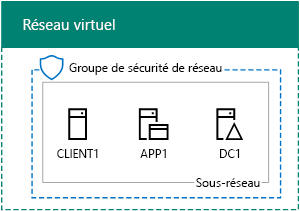

# <a name="office-365-devtest-environment"></a>Environnement de développement/test Office 365

 **Résumé :** Utilisez ce Guide de laboratoire de Test pour créer un abonnement d’évaluation de Office 365 pour l’évaluation ou de développement/test.
  
Vous pouvez utiliser un abonnement d’évaluation Office 365 et créer un environnement de développement/test Office 365 pour les applications ou faire une démonstration des fonctionnalités d’Office 365. Deux versions sont disponibles :
  
- L’environnement de développement/test Office 365 léger se compose d’un abonnement d’évaluation Office 365 auquel vous accédez depuis votre ordinateur principal.
    
    Utilisez cet environnement lorsque vous voulez montrer rapidement une fonctionnalité. Pour l’environnement de développement/test Office 365 léger, suivez les instructions des phases 2 et 3 de cet article.
    
- L’environnement de développement/test Office 365 d’entreprise simulé comprend un abonnement d’évaluation Office 365 et un intranet d’organisation simplifié connecté à Internet, qui est hébergé dans les services d’infrastructure de Microsoft Azure. Vous pouvez créer cette configuration entièrement dans le cloud de Microsoft.
    
    Utilisez cet environnement lorsque vous voulez montrer une fonctionnalité ou une application dans un environnement semblable à un réseau d’entreprise classique connecté à Internet, ou pour les fonctionnalités pour lesquelles ce type d’environnement est nécessaire. Pour l’environnement de développement/test Office 365 d’entreprise simulé, suivez les instructions des phases 1, 2 et 3 de cet article.
    
> [!NOTE]
> Nous vous recommandons d’imprimer cet article afin de consigner les valeurs spécifiques dont vous aurez besoin dans cet environnement au cours des 30 jours de votre abonnement à la version d’évaluation Office 365. Vous pouvez facilement étendre l’abonnement à la version d’évaluation pour 30 jours de plus. Pour un environnement de développement/test permanent, créez un nouvel abonnement payant avec un petit nombre de licences. 
  

  
> [!TIP]
> Cliquez [ici](http://aka.ms/catlgstack) pour une carte visuelle de tous les articles dans la pile d’un Guide de laboratoire de Test Microsoft Cloud.
  
## <a name="phase-1-create-the-base-configuration-in-azure"></a>Phase 1 : création de la configuration de base dans Azure

Suivez les instructions dans [l’environnement de développement/test de Configuration de Base](base-configuration-dev-test-environment.md).
  
Vous aurez besoin d’un abonnement Azure. Vous pouvez utiliser [Version d’évaluation gratuite de Azure](https://azure.microsoft.com/pricing/free-trial/) pour cette configuration. Si vous avez un abonnement MSDN ou Visual Studio, reportez-vous à la section [crédit mensuel Azure pour les abonnés de Visual Studio](https://azure.microsoft.com/pricing/member-offers/msdn-benefits-details/).
  
Voici la configuration obtenue.
  

  
Cette configuration se compose des machines virtuelles DC1, APP1 et CLIENT1 sur un sous-réseau d’un réseau virtuel Azure.
  
## <a name="phase-2-create-an-office-365-trial-subscription"></a>Phase 2 : création d’un abonnement d’évaluation Office 365

Pour démarrer votre abonnement d’évaluation Office 365 E5, vous avez besoin d’un nom d’entreprise fictif et d’un nouveau compte Microsoft.
  
1. Nous vous recommandons d’utiliser une variante du nom de la société Contoso pour le nom de votre société, est une société fictive utilisée dans l’exemple de contenu de Microsoft, mais il n’est pas obligatoire. Enregistrer votre nom de la société fictive : ___
    
2. Pour vous inscrire à un nouveau compte Microsoft, accédez à [https://outlook.com](https://outlook.com) et créer un compte avec un nouveau compte de messagerie et une adresse. Vous utiliserez ce compte pour vous inscrire à Office 365.
    
  - Indiquer le prénom et le nom de famille utilisés pour votre nouveau compte ici : _______________________________
    
  - Indiquer l’adresse du nouveau compte de messagerie ici : _____________________________@outlook.com
    
### <a name="sign-up-for-an-office-365-e5-trial-subscription"></a>Inscription à un abonnement d’évaluation Office 365 E5

1. Pour l’environnement de développement/test léger Office 365, ouvrez le navigateur Internet sur votre ordinateur et accédez à [https://aka.ms/e5trial](https://aka.ms/e5trial). 
    
    Pour l’environnement de développement/test simulées entreprise Office 365 :
    
  - À partir du [portail Azure](https://portal.azure.com), se connecter à CLIENT1 avec le CORP\\compte utilisateur1.
    
  - Exécutez ces commandes à l’invite de commande Windows PowerShell de niveau administrateur.
    
  ```
  Set-ItemProperty -Path "HKLM:\\SOFTWARE\\Microsoft\\Active Setup\\Installed Components\\{A509B1A7-37EF-4b3f-8CFC-4F3A74704073}" -Name "IsInstalled" -Value 0
Set-ItemProperty -Path "HKLM:\\SOFTWARE\\Microsoft\\Active Setup\\Installed Components\\{A509B1A8-37EF-4b3f-8CFC-4F3A74704073}" -Name "IsInstalled" -Value 0
Stop-Process -Name Explorer -Force
  ```

    > [!TIP]
    > Cliquez [ici](https://gallery.technet.microsoft.com/PowerShell-commands-for-fe3d7a34) pour obtenir un fichier texte qui contient toutes les commandes de PowerShell dans cet article.
  
  - À partir de l’écran de démarrage, cliquez sur **Internet Explorer** et accédez à [https://aka.ms/e5trial](https://aka.ms/e5trial).
    
2. Sur la page **d’accueil, nous allons apprendre à vous connaître** , spécifiez :
    
  - votre emplacement physique ;
    
  - le prénom et le nom utilisés pour votre nouveau compte Microsoft ;
    
  - votre nouvelle adresse de compte de messagerie ;
    
  - un numéro de téléphone professionnel ;
    
  - le nom de votre entreprise fictive ;
    
  - la taille de votre entreprise (250 à 999 personnes).
    
3. Cliquez sur **un seul plus l’étape**.
    
4. Sur la page **créer votre nom d’utilisateur** , tapez un nom d’utilisateur en fonction de votre nouvelle adresse e-mail, votre société fictive après le signe @ (supprimer tous les espaces dans le nom), puis un mot de passe (deux fois) pour ce nouveau Office 365 compte.
    
    Enregistrez le mot de passe saisi dans un emplacement sécurisé.
    
    Enregistrer le nom de la société fictive d’être désignée sous le **nom de l’organisation**, ici : ___
    
5. Cliquez sur **créer mon compte**.
    
6. Sur le **prouver. Vous êtes. Pas. A robot de.** la page, tapez le numéro de téléphone de votre téléphone prenant en charge de texte, puis cliquez sur **texte me**.
    
7. Tapez le code de vérification dans le message reçu, puis cliquez sur **suivant**.
    
8. Enregistrez l’URL de la page de connexion ici (sélectionnez-la et copiez-la) : ___________________________________________
    
9. Enregistrez l’identifiant utilisateur ici (sélectionnez-le et copiez-le) : __________________________________.onmicrosoft.com
    
    Cette valeur sera dénommée le **nom de l’administrateur global Office 365**.
    
10. Lorsque **vous êtes prêt**, cliquez sur elle.
    
11. Sur la page suivante, attendez Office 365 se termine le paramètre des toutes les tuiles sont disponibles.
    
Vous devriez voir la page principale du portail Office 365 à partir de laquelle vous pouvez accéder aux services Office Online et au Centre d’administration Office 365.
  
Pour l’environnement de développement/test Office 365 d’entreprise simulé, voici la configuration que vous obtenez.
  

  
Cette configuration se compose des éléments suivants :  
  
- les machines virtuelles DC1, APP1 et CLIENT1 sur un sous-réseau d’un réseau virtuel Azure ;
    
- un abonnement d’évaluation Office 365 E5.
    
## <a name="phase-3-configure-your-office-365-trial-subscription"></a>Phase 3 : configuration de votre abonnement d’évaluation Office 365

Au cours de cette phase, vous allez configurer votre abonnement Office 365 en y ajoutant des sites d’équipes SharePoint Online et des utilisateurs supplémentaires.
  
Toute d’abord, ajoutez quatre nouveaux utilisateurs et attribuez-leur des licences E5.
  
Suivez les instructions de [se connecter à Office 365 PowerShell](https://technet.microsoft.com/library/dn975125.aspx) pour installer les modules PowerShell et vous connecter à votre nouvel abonnement Office 365 à partir de :
  
- Votre ordinateur (pour l’environnement de développement/test Office 365 léger).
    
- La machine virtuelle CLIENT1 (pour l’environnement de développement/test Office 365 d’entreprise simulé).
    
 Dans la boîte de dialogue demande d’informations d’identification Windows PowerShell, tapez le nom d’administrateur global de Office 365 (exemple : jdoe@contosotoycompany.onmicrosoft.com) et le mot de passe.
  
Entrez le nom de votre organisation (exemple : contosotoycompany) et le code de pays à deux caractères pour indiquer votre emplacement, puis exécutez les commandes suivantes à partir de l’invite Module Windows Azure Active Directory pour Windows PowerShell :
  
```
$orgName="<organization name>"
$loc="<two-character country code, such as US>"
$licAssignment= $orgName + ":ENTERPRISEPREMIUM"
$userName= "user2@" + $orgName + ".onmicrosoft.com"
New-MsolUser -DisplayName "User 2" -FirstName User -LastName 2 -UserPrincipalName $userName -UsageLocation $loc -LicenseAssignment $licAssignment
```

À partir de l’affichage de la commande **New-MsolUser** , notez le mot de passe généré pour le compte de l’utilisateur 2 et l’enregistrer dans un emplacement sûr.
  
Exécutez les commandes suivantes à partir de l’invite Module Windows Azure Active Directory pour Windows PowerShell :
  
```
$userName= "user3@" + $orgName + ".onmicrosoft.com"
New-MsolUser -DisplayName "User 3" -FirstName User -LastName 3 -UserPrincipalName $userName -UsageLocation $loc -LicenseAssignment $licAssignment
```

À partir de l’affichage de la commande **New-MsolUser** , notez le mot de passe généré pour le compte d’utilisateur 3 et l’enregistrer dans un emplacement sûr.
  
Exécutez les commandes suivantes à partir de l’invite Module Windows Azure Active Directory pour Windows PowerShell :
  
```
$userName= "user4@" + $orgName + ".onmicrosoft.com"
New-MsolUser -DisplayName "User 4" -FirstName User -LastName 4 -UserPrincipalName $userName -UsageLocation $loc -LicenseAssignment $licAssignment
```

À partir de l’affichage de la commande **New-MsolUser** , notez le mot de passe généré pour le compte d’utilisateur 4 et l’enregistrer dans un emplacement sûr.
  
Exécutez les commandes suivantes à partir de l’invite Module Windows Azure Active Directory pour Windows PowerShell :
  
```
$userName= "user5@" + $orgName + ".onmicrosoft.com"
New-MsolUser -DisplayName "User 5" -FirstName User -LastName 5 -UserPrincipalName $userName -UsageLocation $loc -LicenseAssignment $licAssignment
```

À partir de l’affichage de la commande **New-MsolUser** , notez le mot de passe généré pour le compte d’utilisateur 5 et l’enregistrer dans un emplacement sûr.
  
Ensuite, créez trois nouveaux sites d’équipes SharePoint Online pour les services Ventes, Production et Support.
  
### <a name="create-three-new-sharepoint-online-team-sites"></a>Création de trois nouveaux sites d’équipes SharePoint Online

1. Installer le [Shell de gestion en ligne de SharePoint](https://go.microsoft.com/fwlink/p/?LinkId=255251) (la x64 version).
    
2. Cliquez sur **Démarrer**, tapez **sharepoint**, puis cliquez sur **SharePoint Online Management Shell**.
    
3. Indiquez le nom de votre organisation (exemple : contosotoycompany), puis exécutez les commandes suivantes à partir de l’invite SharePoint Online Management Shell pour vous connecter au service SharePoint Online.
```
$orgName="<organization name>"
$spURL="https://" + $orgName + "-admin.sharepoint.com"
Connect-SPOService -Url $spURL
```

4. Dans la boîte de dialogue **Microsoft SharePoint Online Management Shell** , tapez le nom d’administrateur global de Office 365 (exemple : jdoe@contosotoycompany.onmicrosoft.com) et le mot de passe, puis cliquez sur **se connecter**.
    
5. Pour créer trois nouveaux sites d’équipe (ventes, Production et prise en charge), indiquez le nom d’administrateur global de Office 365 et puis exécutent les commandes suivantes à partir de l’invite du Shell de gestion en ligne de SharePoint :
    
  ```
  $owner = "<global administrator account name>"
$siteURL = "https://" + $orgName + ".sharepoint.com/sites/sales"
New-SPOSite -Url $siteURL -Owner $owner -StorageQuota 1000 -Title "Sales site collection" -Template "STS#0"
$siteURL = "https://" + $orgName + ".sharepoint.com/sites/production"
New-SPOSite -Url $siteURL -Owner $owner -StorageQuota 1000 -Title "Production site collection" -Template "STS#0"
$siteURL = "https://" + $orgName + ".sharepoint.com/sites/support"
New-SPOSite -Url $siteURL -Owner $owner -StorageQuota 1000 -Title "Support site collection" -Template "STS#0"
  ```

6. Exécutez cette commande pour répertorier les URL de ces nouveaux sites :
    
  ```
  Get-SPOSite | Where URL -like "*/sites/*" | Sort URL | Select URL
  ```

7. Dans Internet Explorer, entrez l’URL du site Production pour afficher le site d’équipe SharePoint Online par défaut pour le service Production.
    
## <a name="record-values-for-future-reference"></a>Enregistrez les valeurs, vous en aurez besoin plus tard.

Enregistrez ces valeurs pour utiliser ou déployer les guides de laboratoire de test dans cet environnement de test :
  
- Nom de l’administrateur général Office 365 : ____________________________________.onmicrosoft.com (indiqué à l’étape 9 de la phase 2)
    
    Enregistrez également le mot de passe de ce compte dans un emplacement sécurisé.
    
- Nom de l’organisation de l’abonnement d’évaluation : _______________________________________________ (indiqué à l’étape 4 de la phase 2)
    
- Pour répertorier les comptes pour Utilisateur 2, Utilisateur 3, Utilisateur 4 et Utilisateur 5, exécutez la commande suivante à partir de l’invite Module Windows Azure Active Directory pour Windows PowerShell :
    
  ```
  Get-MSolUser | Sort UserPrincipalName | Select UserPrincipalName
  ```

    Enregistrez les noms de compte ici :
    
  - Nom du compte Utilisateur 2 : user2@_______________________________________________.onmicrosoft.com
    
  - Nom du compte Utilisateur 3 : user3@_______________________________________________.onmicrosoft.com
    
  - Nom du compte Utilisateur 4 : user4@_______________________________________________.onmicrosoft.com
    
  - Nom du compte Utilisateur 5 : user5@_______________________________________________.onmicrosoft.com
    
    Enregistrez également les mots de passe de ces comptes dans un emplacement sécurisé.
    
- Pour répertorier les URL des sites d’équipes Ventes, Production et Support, exécutez la commande suivante à partir de l’invite SharePoint Online Management Shell :
    
  ```
  Get-SPOSite | Where URL -like "*/sites/*" | Sort URL | Select URL
  ```

  - URL de site de production : https://___.sharepoint.com/sites/production
    
  - URL du site Ventes : https://______________________________________________.sharepoint.com/sites/sales
    
  - URL du site Support : https://______________________________________________.sharepoint.com/sites/support
    
## <a name="next-steps"></a>Étapes suivantes

Utilisez ces articles supplémentaires dans votre environnement de développement/test Office 365 :
  
- [DirSync pour votre environnement de développement/test Office 365](dirsync-for-your-office-365-dev-test-environment.md)
    
- [Plusieurs facteurs d’authentification pour votre environnement de développement/test d’Office 365](multi-factor-authentication-for-your-office-365-dev-test-environment.md)
    
- [Identité fédérée pour votre environnement de développement/test Office 365](federated-identity-for-your-office-365-dev-test-environment.md)
    
- [Application du nuage sécurité pour votre environnement de développement/test d’Office 365](cloud-app-security-for-your-office-365-dev-test-environment.md)
    
- [Avancées de protection contre les menaces pour votre environnement de développement/test d’Office 365](advanced-threat-protection-for-your-office-365-dev-test-environment.md)
    
- [E-Discovery avancée pour votre environnement de développement/test d’Office 365](advanced-ediscovery-for-your-office-365-dev-test-environment.md)
    
- [Protection des fichiers sensibles dans l’environnement de développement/test d’Office 365](sensitive-file-protection-in-the-office-365-dev-test-environment.md)
    
- [Environnement de développement/test isolé de SharePoint Online équipe site](isolated-sharepoint-online-team-site-dev-test-environment.md)
    
- [La classification des données et le marquage de l’environnement de développement/test d’Office 365](data-classification-and-labeling-in-the-office-365-dev-test-environment.md)
    
Étendez votre environnement de développement/test Office 365 afin d’y inclure des offres cloud supplémentaires de Microsoft :
  
- [L’environnement de développement/test Microsoft 365 Enterprise](the-microsoft-365-enterprise-dev-test-environment.md)
    
- [Environnement de développement/test Office 365 et Dynamics 365](office-365-and-dynamics-365-dev-test-environment.md)
    
## <a name="see-also"></a>See Also

[Guides de laboratoire de test d'adoption cloud](cloud-adoption-test-lab-guides-tlgs.md)
  
[Environnement de développement/test Office 365 et Dynamics 365](office-365-and-dynamics-365-dev-test-environment.md)
  
[Adoption du cloud et solutions hybrides](cloud-adoption-and-hybrid-solutions.md)


