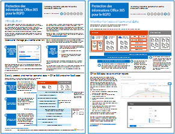

# Protection des informations Office 365 pour le RGPDOffice 365 Information Protection for GDPR

 **Résumé :** Cette solution montre comment protéger les données sensibles stockées dans les services Office 365.**Summary:** This solution demonstrates how to protect sensitive data that is stored in Office 365 services.
  
Cette solution inclut des recommandations pour la découverte, la classification, la protection et la surveillance des données personnelles. Cette solution utilise le Règlement général sur la protection des données (RGPD) en tant qu’exemple, mais vous pouvez appliquer la même procédure pour vous conformer à de nombreuses autres réglementations.This solution includes prescriptive recommendations for discovering, classifying, protecting, and monitoring personal data. This solution uses General Data Protection Regulation (GDPR) as an example, but you can apply the same process to achieve compliance with many other regulations.

[PDF](http://download.microsoft.com/download/E/C/D/ECD5A339-EF10-4420-B3A9-99098884D716/MSFT_Cloud_architecture_information%20protection%20for%20GDPR.pdf)  |  [Visio](http://download.microsoft.com/download/E/C/D/ECD5A339-EF10-4420-B3A9-99098884D716/MSFT_Cloud_architecture_information%20protection%20for%20GDPR.vsdx)[PDF](http://download.microsoft.com/download/E/C/D/ECD5A339-EF10-4420-B3A9-99098884D716/MSFT_Cloud_architecture_information%20protection%20for%20GDPR.pdf)  |  [Visio](http://download.microsoft.com/download/E/C/D/ECD5A339-EF10-4420-B3A9-99098884D716/MSFT_Cloud_architecture_information%20protection%20for%20GDPR.vsdx)
  
Pour obtenir plus d’informations relatives au traitement des demandes des personnes associées aux données concernant le RGPD, consultez l’article [Demandes des personnes associées aux données pour Office 365 concernant le RGPD](https://docs.microsoft.com/en-us/microsoft-365/compliance/gdpr-dsr-office365?toc=/microsoft-365/enterprise/toc.json).For information about performing data subject requests for the GDPR, see [Office 365 Data Subject Requests for the GDPR](https://docs.microsoft.com/en-us/microsoft-365/compliance/gdpr-dsr-office365?toc=/microsoft-365/enterprise/toc.json). 

## Voir aussiSee Also

[Solutions de sécuritéSecurity solutions](security-solutions.md)
  
[Conseils de sécurité Microsoft pour les campagnes électorales, les organisations à but non lucratif et d’autres organisations flexiblesMicrosoft Security Guidance for Political Campaigns, Nonprofits, and Other Agile Organizations](microsoft-security-guidance-for-political-campaigns-nonprofits-and-other-agile-o.md)

