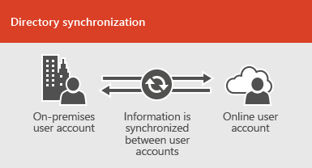

# Intégration d'Office 365 aux environnements locauxOffice 365 integration with on-premises environments

Vous pouvez intégrer Office 365 à vos services d'annuaire existants et à une installation locale d'Exchange Server, Skype entreprise Server 2015 ou SharePoint Server 2013.You can integrate Office 365 with your existing directory services and with an on-premises installation of Exchange Server, Skype for Business Server 2015, or SharePoint Server 2013.
  
 - Lorsque vous intégrez des services d'annuaire, vous pouvez synchroniser et gérer les comptes d'utilisateur pour les deux environnements.When you integrate with directory services, you can synchronize and manage user accounts for both environments. Vous pouvez également ajouter la synchronisation de hachage de mot de passe ou l'authentification unique (SSO) de sorte que les utilisateurs puissent se connecter aux deux environnements à l'aide de leurs informations d'identification locales.You can also add password hash synchronization or single sign-on (SSO) so users can log on to both environments with their on-premises credentials.
 - Lorsque vous intégrez des produits serveur sur site, vous créez un environnement hybride.When you integrate with on-premises server products, you create a hybrid environment. Un environnement hybride peut vous aider lors de la migration d'utilisateurs ou d'informations vers Office 365, ou vous pouvez continuer à avoir des utilisateurs ou des informations sur site et d'autres dans le Cloud.A hybrid environment can help as you migrate users or information to Office 365, or you can continue to have some users or some information on-premises and some in the cloud. Pour plus d'informations sur les environnements hybrides, voir [Office 365 hybride Cloud solutions Overview](https://support.office.com/article/59616fab-acdb-40e9-b414-cf0c965c80b7).For more information about hybrid environments, see [Office 365 hybrid cloud solutions overview](https://support.office.com/article/59616fab-acdb-40e9-b414-cf0c965c80b7).

Vous pouvez également utiliser les conseillers Azure AD pour obtenir des conseils de configuration personnalisés:You can also use the Azure AD advisors for customized setup guidance:
- [Conseiller Azure AD ConnectAzure AD Connect advisor](https://aka.ms/aadconnectpwsync)
- [Conseiller de déploiement AD FSAD FS deployment advisor](https://aka.ms/adfsguidance)
- [Assistant Déploiement d'Azure RMSAzure RMS Deployment Wizard](https://aka.ms/azuremsguidance)
- [Guide de configuration d'Azure AD PremiumAzure AD Premium setup guidance](https://aka.ms/aadpguidance)
   
## Avant de commencerBefore you begin
Avant d'intégrer Office 365 et un environnement local, vous devez également participer à la planification du [réseau et au réglage des performances pour Office 365](network-planning-and-performance.md).Before you integrate Office 365 and an on-premises environment, you also need to attend to [network planning and performance tuning for Office 365](network-planning-and-performance.md). Vous pouvez également comprendre les [modèles d'identité](about-office-365-identity.md) disponibles dans Office 365.You will also want to understand the available [identity models](about-office-365-identity.md) in Office 365. 

Pour obtenir la liste des outils que vous pouvez utiliser pour gérer les utilisateurs et les comptes Office 365, voir [Where to Manage office 365 User Accounts](manage-office-365-accounts.md) .See [where to manage Office 365 user accounts](manage-office-365-accounts.md) for a list of tools you can use to manage Office 365 users and accounts. 
  
## Intégrer Office 365 avec les services d'annuaireIntegrate Office 365 with directory services
Si vous avez des comptes d'utilisateur existants dans un annuaire local, vous ne souhaitez pas recréer tous ces comptes dans Office 365 et risquez d'introduire des différences ou des erreurs entre les environnements.If you have existing user accounts in an on-premises directory, you don't want to re-create all of those accounts in Office 365 and risk introducing differences or errors between the environments. La synchronisation d'annuaires vous permet de mettre en miroir ces comptes entre vos environnements en ligne et locaux.Directory synchronization helps you mirror those accounts between your online and on-premises environments. Avec la synchronisation d'annuaires, vos utilisateurs n'ont pas à se souvenir des nouvelles informations pour chaque environnement, et vous n'avez pas à créer ou mettre à jour les comptes deux fois.With directory synchronization, your users don't have to remember new information for each environment, and you don't have to create or update accounts twice. Vous devrez [préparer votre annuaire local pour la](prepare-for-directory-synchronization.md) synchronisation d'annuaires, vous pouvez le faire manuellement ou utiliser l' [outil IdFix](install-and-run-idfix.md) (l'outil IdFix fonctionne uniquement avec Active Directory).You will need to [prepare your on-premises directory](prepare-for-directory-synchronization.md) for directory synchronization, you can do this manually or use the [IdFix tool](install-and-run-idfix.md) (IdFix tool only works with Active Directory). 
  

  
Si vous souhaitez que les utilisateurs puissent se connecter à Office 365 avec leurs informations d'identification locales, vous pouvez également configurer l'authentification unique.If you want users to be able to log on to Office 365 with their on-premises credentials, you can also configure SSO. Avec l'authentification unique, Office 365 est configuré pour approuver l'environnement local pour l'authentification des utilisateurs.With SSO, Office 365 is configured to trust the on-premises environment for user authentication.
  

  
Différentes techniques de gestion de compte d'utilisateur fournissent différentes expériences pour vos utilisateurs, comme illustré dans le tableau suivant.Different user account management techniques provide different experiences for your users, as shown in the following table.
 
### **Synchronisation d'annuaires avec ou sans synchronisation de hachage de mot de passe ou authentification directe****Directory synchronization with or without password hash synchronization or pass-through authentication**
Un utilisateur se connecte à son environnement local à l'aide de son compte d'utilisateur (DOMAINE\nom d'utilisateur).A user logs on to their on-premises environment with their user account (domain\username). Quand ils accèdent à Office 365, ils doivent se reconnecter avec leur compte professionnel ou scolaire (user@domain.com).When they go to Office 365, they must log on again with their work or school account (user@domain.com). Le nom d'utilisateur est le même dans les deux environnements.The user name is the same in both environments. Lorsque vous ajoutez une synchronisation de hachage de mot de passe ou une authentification directe, l'utilisateur a le même mot de passe pour les deux environnements, mais il devra de nouveau fournir ces informations d'identification lors de la connexion à Office 365.When you add password hash sync or pass-through authentication, the user has the same password for both environments, but will have to provide those credentials again when logging on to Office 365. La synchronisation d'annuaires avec la synchronisation de hachage de mot de passe est le scénario de synchronisation d'annuaire le plus couramment utilisé.Directory synchronization with password hash sync is the most commonly used directory sync scenario.

Pour configurer la synchronisation d'annuaires, utilisez Azure Active Directory Connect.To set up directory synchronization, use Azure Active Directory Connect. Pour obtenir des instructions, consultez la section [configurer la synchronisation d'annuaires pour Office 365](set-up-directory-synchronization.md)et [utiliser Azure ad Connect with Express Settings](https://go.microsoft.com/fwlink/p/?LinkId=698537).For instructions, read [Set up directory synchronization for Office 365](set-up-directory-synchronization.md), and [Use Azure AD Connect with express settings](https://go.microsoft.com/fwlink/p/?LinkId=698537).

En savoir plus sur la [préparation de la mise en service des utilisateurs via la synchronisation d'annuaires vers Office 365](prepare-for-directory-synchronization.md) et [l'intégration de vos identifications locales à Azure Active Directory](https://go.microsoft.com/fwlink/?LinkId=518101).Learn more about [preparing to provision users through directory synchronization to Office 365](prepare-for-directory-synchronization.md) and [integrating your on-premises identifies with Azure Active Directory](https://go.microsoft.com/fwlink/?LinkId=518101).

### **Synchronisation d'annuaires avec SSO****Directory synchronization with SSO**
Un utilisateur se connecte à son environnement local à l'aide de son compte d'utilisateur.A user logs on to their on-premises environment with their user account. Lorsque les utilisateurs accèdent à Office 365, ils se connectent automatiquement ou se connectent à l'aide des mêmes informations d'identification qu'ils utilisent pour leur environnement local (DOMAINE\nom d'utilisateur).When they go to Office 365, they are either logged on automatically, or they log on using the same credentials they use for their on-premises environment (domain\username).

Pour configurer l'authentification unique, vous devez également utiliser Azure AD Connect.To set up SSO you also use Azure AD Connect. Pour obtenir des instructions, consultez la [section utiliser Azure ad Connect avec des paramètres personnalisés](https://go.microsoft.com/fwlink/p/?LinkID=698430).For instructions, read [Use Azure AD Connect with custom settings](https://go.microsoft.com/fwlink/p/?LinkID=698430).

En savoir plus sur [l'accès aux applications et l'authentification unique avec Azure Active Directory](https://go.microsoft.com/fwlink/p/?LinkId=698604).Learn more about [application access and single sign-on with Azure Active Directory](https://go.microsoft.com/fwlink/p/?LinkId=698604).

## Azure AD ConnectAzure AD Connect
Azure AD Connect remplace les anciennes versions des outils d'intégration des identités telles que dirSync et Azure AD Sync. Pour plus d'informations, consultez [la rubrique intégration de vos identités locales à Azure Active Directory](https://go.microsoft.com/fwlink/p/?LinkId=527969).Azure AD Connect replaces older versions of identity integration tools such as DirSync and Azure AD Sync. For more information, see [Integrating your on-premises identities with Azure Active Directory](https://go.microsoft.com/fwlink/p/?LinkId=527969). Si vous souhaitez effectuer une mise à jour à partir d'Azure Active Directory Sync vers Azure AD Connect, consultez [les instructions de mise à niveau](https://go.microsoft.com/fwlink/p/?LinkId=733240).If you want to update from Azure Active Directory Sync to Azure AD Connect, see [the upgrade instructions](https://go.microsoft.com/fwlink/p/?LinkId=733240). Voir une architecture de solution conçue pour la [synchronisation d'annuaires Office 365 (DirSync) dans Microsoft Azure](https://go.microsoft.com/fwlink/?LinkId=517887).See a solution architecture built for [Office 365 Directory Synchronization (DirSync) in Microsoft Azure](https://go.microsoft.com/fwlink/?LinkId=517887).