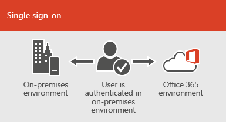

# Intégration d’Office 365 avec les environnements sur site

Vous pouvez intégrer Office 365 avec les services d’annuaire existants et avec une installation locale d’Exchange Server, Skype pour Business Server 2015 ou SharePoint Server 2013.
  
 - Lorsque vous intégrez aux services d’annuaire, vous pouvez synchroniser et gérer les comptes d’utilisateur pour les deux environnements. Vous pouvez également ajouter la synchronisation de hachage de mot de passe ou authentification unique (SSO) afin que les utilisateurs peuvent se connecter à ces deux environnements avec leurs informations d’identification locales.
 - Lorsque vous intégrez avec les produits de serveur local, vous créez un environnement hybride. Un environnement hybride peut aider comme vous migrez des utilisateurs ou des informations vers Office 365, ou vous pouvez continuer à certains utilisateurs ou certaines informations sur site et autres dans le nuage. Pour plus d’informations sur les environnements hybrides, voir [Présentation des solutions Office 365 hybride dans le nuage](https://support.office.com/article/59616fab-acdb-40e9-b414-cf0c965c80b7).

Vous pouvez également utiliser les conseillers Azure AD pour obtenir des instructions d’installation personnalisé :
- [Gestionnaire de connexion AD Azure](https://aka.ms/aadconnectpwsync)
- [Gestionnaire de déploiement d’AD FS](https://aka.ms/adfsguidance)
- [Assistant de déploiement RMS Azure](https://aka.ms/azuremsguidance)
- [Conseils de configuration Azure AD Premium](https://aka.ms/aadpguidance)
   
## Avant de commencer
Avant d’intégrer Office 365 et un environnement local, vous devez également participer à la [planification de réseau et de réglage des performances pour Office 365](network-planning-and-performance.md). Vous devez également comprendre les [modèles d’identité](about-office-365-identity.md) de disponibles dans Office 365. 

Voir [où pour gérer Office 365 utilisateur des comptes](manage-office-365-accounts.md) pour obtenir la liste des outils que vous pouvez utiliser pour gérer les comptes et les utilisateurs d’Office 365. 
  
## Intégrer Office 365 avec les services d’annuaire
Si vous avez des comptes d’utilisateurs existants dans un répertoire local, vous ne voulez pas que recréer tous les comptes dans Office 365 et présentation des différences ou erreurs entre les environnements de risque. La synchronisation d’annuaires permet de mettre en miroir les comptes entre votre en ligne et les environnements sur site. Avec la synchronisation d’annuaires, vos utilisateurs n’ont pas à l’esprit les nouvelles informations de chaque environnement, et vous n’êtes pas obligé de créer ou mettre à jour les comptes à deux reprises. Vous devez [préparer votre annuaire local](prepare-for-directory-synchronization.md) pour la synchronisation d’annuaires, vous pouvez le faire manuellement ou utiliser l' [outil IdFix](install-and-run-idfix.md) (IdFix outil fonctionne uniquement avec Active Directory). 
  

  
Si vous souhaitez que les utilisateurs puissent se connecter à Office 365 avec leurs informations d’identification locales, vous pouvez également configurer l’authentification unique. Avec l’authentification unique, Office 365 est configuré pour l’approbation de l’environnement sur site pour l’authentification utilisateur.
  

  
Techniques de gestion de compte utilisateur différent fournissent une expérience de différente pour vos utilisateurs, comme indiqué dans le tableau suivant.
 
### **Synchronisation d’annuaires avec ou sans authentification de synchronisation ou directes de hachage de mot de passe**
Un utilisateur ouvre une session sur leur environnement local avec leur compte d’utilisateur (DOMAINE\nom d’utilisateur). Lorsqu’ils accèdent à Office 365, ils doivent connecter à nouveau avec leur compte professionnel ou de l’école (user@domain.com). Le nom d’utilisateur est le même dans les deux environnements. Lorsque vous ajoutez la synchronisation de hachage de mot de passe ou l’authentification directe, l’utilisateur a le même mot de passe pour les deux environnements, mais devez fournir ces informations d’identification à nouveau lors de la connexion à Office 365. La synchronisation d’annuaires avec la synchronisation de hachage de mot de passe est le scénario de synchronisation d’annuaire couramment utilisées.

Pour configurer la synchronisation d’annuaires, utilisez Azure Active Directory se connecter. Pour obtenir des instructions, lisez [configurer la synchronisation d’annuaires pour Office 365](set-up-directory-synchronization.md)et [se connecter avec les paramètres express AD l’utilisation Azure](https://go.microsoft.com/fwlink/p/?LinkId=698537).

En savoir plus sur la [Préparation de la mise en service des utilisateurs par le biais de la synchronisation d’annuaires vers Office 365](prepare-for-directory-synchronization.md) et [intégration de votre site identifie avec Azure Active Directory](https://go.microsoft.com/fwlink/?LinkId=518101).

### **Synchronisation d’annuaires avec authentification unique**
Un utilisateur ouvre une session sur leur environnement local avec leur compte d’utilisateur. Lorsqu’ils accèdent à Office 365, ils sont connectés soit automatiquement, ou ils se connectent en utilisant les mêmes informations d’identification qu'ils utilisent pour leur environnement local (DOMAINE\nom d’utilisateur).

Pour configurer l’authentification unique vous permet également d’utiliser Azure AD se connecter. Pour plus d’informations, consultez [utilisation Azure AD Connect avec des paramètres personnalisés](https://go.microsoft.com/fwlink/p/?LinkID=698430).

Pour plus d’informations sur [l’accès aux applications et authentification unique avec Azure Active Directory](https://go.microsoft.com/fwlink/p/?LinkId=698604).

## Azure AD Connect
Azure AD Connect remplace les anciennes versions des outils de l’intégration des identités telles que la synchronisation d’annuaire et Azure AD Sync. Pour plus d’informations, voir [intégration des identités avec Azure Active Directory local](https://go.microsoft.com/fwlink/p/?LinkId=527969). Si vous souhaitez mettre à jour à partir de synchronisation Azure Active Directory pour établir la connexion Azure AD, voir [les instructions de mise à niveau](https://go.microsoft.com/fwlink/p/?LinkId=733240). Voir une architecture de solution conçue pour [Office 365 la synchronisation d’annuaires (DirSync) dans Microsoft Azure](https://go.microsoft.com/fwlink/?LinkId=517887).