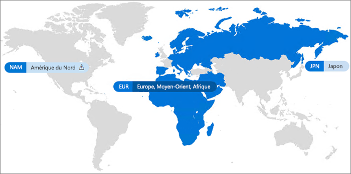

# Office 365 multigéographique

Avec Office 365 multigéographique, votre organisation peut étendre sa présence Office 365 à plusieurs régions ou pays au sein de votre client existant. Pour inscrire votre entreprise internationale à Office 365 multigéographique, contactez votre Équipe des comptes Microsoft.
  
Office 365 multigéographique vous permet d’approvisionner et de stocker des données au repos dans les emplacements géographiques de votre choix afin de répondre à des besoins spécifiques en matière de résidence des données, tout en déverrouillant le déploiement global d’expériences de productivité moderne à vos employés.

#### Vidéo : Présentation d’Office 365 multigéographique

> [!VIDEO https://www.microsoft.com/en-us/videoplayer/embed/RE1Yk6B?autoplay=false]

Dans un environnement multigéographique, votre client Office 365 se compose d’un emplacement central (où votre abonnement Office 365 d’origine a été approvisionné) et d’un ou plusieurs emplacements satellites. Dans un client multigéographique, les informations concernant les emplacements géographiques, les groupes et les informations utilisateur sont gérées dans Azure Active Directory (AAD). Étant donné que les informations de votre client sont gérées de façon centralisée et synchronisées à chaque emplacement géographique, le partage et les expériences concernant tout membre de votre société impliquent une sensibilisation à l’échelle mondiale.

Notez qu’Office 365 multigéographique n’est pas conçu pour optimiser les performances, mais pour répondre aux exigences de résidence des données. Pour plus d’informations sur l’optimisation des performances pour Office 365, voir [Planification réseau et optimisation des performances pour Office 365](https://support.office.com/article/e5f1228c-da3c-4654-bf16-d163daee8848) ou contacter votre groupe de support.

## Terminologie

Voici les termes clés utilisés dans la description d’Office 365 multigéographique :

- **Emplacement central** : emplacement géographique où votre client a été approvisionné à l’origine.
- **Administrateur de zone géographique** : un administrateur pouvant administrer un ou plusieurs emplacements satellites spécifiés.
- **Géocode** : code de trois lettres correspondant à un emplacement géographique donné.
- **Emplacement géographique** : emplacement géographique utilisable dans un client multigéographique pour héberger des données, notamment dans des boîtes aux lettres Exchange et des sites OneDrive ou SharePoint.
- **Emplacement par défaut des données** : propriété d’utilisateur définie par l’administrateur, indiquant l’emplacement géographique où la boîte aux lettres Exchange et le OneDrive des utilisateurs doivent être déployés. L’emplacement par défaut des données détermine où sont déployés les sites SharePoint créés par l’utilisateur.
- **Emplacement satellite** : emplacement géographique où les charges de travail Office 365 sensibles à la zone géographique (SharePoint, OneDrive et Exchange) sont activées dans un client multigéographique.
- **Locataire** : représentation d’une organisation dans Office 365 à laquelle sont généralement associés un ou plusieurs domaines (par exemple, contoso.com).

## Disponibilité d’Office 365 multigéographique

Office 365 multigéographique est actuellement disponible dans les régions et pays suivants :

[!INCLUDE [Office 365 Multi-Geo locations](includes/office-365-multi-geo-locations.md)]

## Prise en main

Pour commencer à utiliser la fonctionnalité multigéographique, procédez comme suit :

1. Travailler avec votre équipe de compte pour ajouter le plan de services des _fonctionnalités multigéographiques dans Office 365_. Ils vous guident pour ajouter le nombre de licences nécessaires. La fonctionnalité Zones géographiques multiples est actuellement disponible pour les clients avec au moins 2 500 abonnements aux services Office 365.

   Avant que vous puissiez commencer à utiliser Office 365 multigéographique, Microsoft doit configurer votre client Exchange Online afin qu’il bénéficie d’une prise en charge multigéographique. Ce processus de configuration est déclenché lorsque vous commandez le plan de services des *fonctionnalités multigéographiques d’Office 365* et que les licences apparaissent dans votre client. Une fois vos licences multigéographiques appliquées, vous recevez des notifications dans le [Centre de messages Office 365](https://support.office.com/article/38FB3333-BFCC-4340-A37B-DEDA509C2093) et pouvez commencer à configurer et à utiliser les fonctionnalités d’Office 365 multigéographique.

2. Lisez [Planifier votre environnement multigéographique](plan-for-multi-geo.md).

3. Découvrez [comment administrer un environnement multigéographique](administering-a-multi-geo-environment.md) et [comment vos utilisateurs feront l’expérience de cet environnement](multi-geo-user-experience.md).

4. Lorsque vous êtes prêt à configurer Office 365 multigéographique, [configurez votre client pour une utilisation multigéographique](multi-geo-tenant-configuration.md).

5. [Configurez la recherche](configure-search-for-multi-geo.md).

## Voir aussi

[Géo multiple dans Exchange Online et OneDrive](https://Aka.ms/GoMultiGeo)

[Fonctionnalités multigéographiques dans OneDrive et SharePoint Online](https://docs.microsoft.com/office365/enterprise/multi-geo-capabilities-in-onedrive-and-sharepoint-online-in-office-365)

[Fonctionnalités multi-localisés dans Exchange Online](https://docs.microsoft.com/office365/enterprise/multi-geo-capabilities-in-exchange-online)
