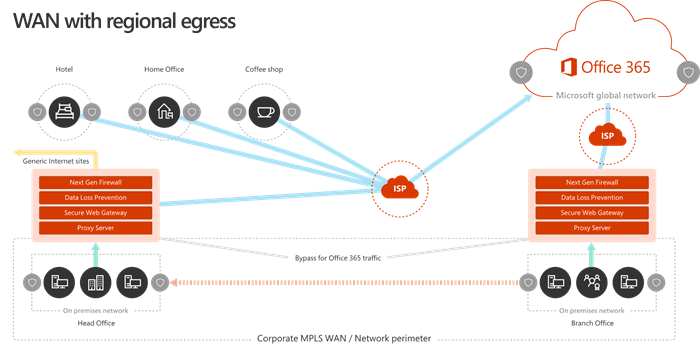
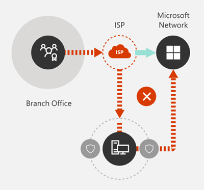

# Principes de connectivité réseau Office 365

Avant de commencer à planifier votre réseau pour la connectivité réseau Office 365, il est important de comprendre les principes de connectivité pour gérer le trafic Office 365 en toute sécurité et obtenir les meilleures performances possibles. Cet article vous aidera à comprendre les instructions les plus récentes pour optimiser en toute sécurité la connectivité réseau Office 365.
  
Les réseaux d’entreprise traditionnels sont conçus principalement pour permettre aux utilisateurs d’accéder aux applications et aux données hébergées dans des centres de données gérés par des entreprises avec une sécurité de périmètre élevée. Le modèle traditionnel part du principe que les utilisateurs peuvent accéder aux applications et aux données à partir du périmètre réseau d’entreprise, via des liaisons WAN de succursales, ou à distance via des connexions VPN.
  
L’adoption d’applications SaaS telles que Office 365 déplace une combinaison de services et de données en dehors du périmètre réseau. Sans optimisation, le trafic entre les utilisateurs et les applications SaaS est soumis à la latence introduite par l’inspection des paquets, le les épingles réseau, les connexions involontaires à des points de terminaison géographiquement éloignés et d’autres facteurs. Vous pouvez garantir les meilleures performances et fiabilité d’Office 365 en maîtrisant et en implémentant des directives d’optimisation de clés.
  
Dans cet article, vous allez découvrir les éléments suivants :
  
- [Architecture Office 365](office-365-network-connectivity-principles.md#BKMK_Architecture) telle qu’elle s’applique à la connectivité client au Cloud
- Mise à jour des principes et stratégies de [connectivité Office 365](office-365-network-connectivity-principles.md#BKMK_Principles) pour l’optimisation du trafic réseau et de l’expérience de l’utilisateur final
- Le [service Web de points de terminaison Office 365](office-365-network-connectivity-principles.md#BKMK_WebSvc), qui permet aux administrateurs réseau de consommer une liste structurée de points de terminaison pour une utilisation dans l’optimisation du réseau
- [Nouvelles catégories de points de terminaison Office 365](office-365-network-connectivity-principles.md#BKMK_Categories) et conseils d’optimisation
- [Comparaison de la sécurité du périmètre réseau avec la sécurité de point de terminaison](office-365-network-connectivity-principles.md#BKMK_SecurityComparison)
- Options d' [optimisation incrémentielle](office-365-network-connectivity-principles.md#BKMK_IncOpt) pour le trafic Office 365
- L' [outil d’intégration réseau office 365](https://aka.ms/netonboard), un nouvel outil de test de la connectivité de base vers Office 365

## Architecture Office 365

Office 365 est un Cloud SaaS (Software-as-a-service) distribué qui fournit des scénarios de productivité et de collaboration via un ensemble varié de micro-services et d’applications, comme Exchange Online, SharePoint Online, Skype entreprise Online, Microsoft Teams, Exchange Online Protection, Office dans un navigateur et bien d’autres. Bien que les applications Office 365 spécifiques puissent avoir leurs fonctionnalités uniques lorsqu’elles s’appliquent au réseau du client et à la connectivité au nuage, elles partagent des principaux, des objectifs et des modèles d’architecture. Ces principaux et modèles d’architecture pour la connectivité sont typiques pour de nombreux autres nuages de SaaS et sont en même temps différents des modèles de déploiement classiques des nuages de plateformes As-a-service et de l’infrastructure-as-a-service, tels que Microsoft Bleu.
  
L’une des fonctionnalités architecturales les plus significatives d’Office 365 (généralement manquées ou mal interprétées par les planificateurs réseau) est qu’il s’agit d’un service distribué véritablement global, dans le contexte de la connexion des utilisateurs à ce service. L’emplacement du client Office 365 cible est important pour comprendre la localité de l’emplacement où les données client sont stockées dans le Cloud, mais l’expérience utilisateur avec Office 365 n’implique pas la connexion directe aux disques contenant les données. L’expérience utilisateur d’Office 365 (y compris les performances, la fiabilité et d’autres caractéristiques importantes en matière de qualité) implique la connectivité via des portes frontales de service hautement distribuées qui sont mises à l’échelle sur des centaines d’emplacements Microsoft à travers le monde. Dans la plupart des cas, la meilleure expérience utilisateur est obtenue en permettant au réseau du client d’acheminer les demandes des utilisateurs vers le point d’entrée du service Office 365 le plus proche, plutôt que de se connecter à Office 365 par le biais d’un point de sortie à un emplacement central ou une région.
  
Pour la plupart des clients, les utilisateurs d’Office 365 sont répartis sur de nombreux emplacements. Pour obtenir les meilleurs résultats, les principes décrits dans ce document doivent être étudiés à partir du point de vue de la mise à l’échelle (pas à l’échelle), en se concentrant sur l’optimisation de la connectivité au point de présence le plus proche dans le réseau global de Microsoft, et non dans le secteur géographique. emplacement du client Office 365. Par essence, cela signifie que même si les données client d’Office 365 peuvent être stockées dans un emplacement géographique spécifique, l’expérience Office 365 pour ce client reste distribuée et peut être présente en très proche (réseau) à chaque emplacement de l’utilisateur final que le client a .
  
## Principes de connectivité d’Office 365

Microsoft recommande les principes suivants pour obtenir une connectivité et des performances Office 365 optimales. Utilisez ces principes de connectivité Office 365 pour gérer votre trafic et obtenir les meilleures performances lors de la connexion à Office 365.
  
L’objectif principal de la conception du réseau est de réduire la latence en réduisant le temps d’aller-retour (RTT) de votre réseau au réseau global Microsoft, le réseau principal du réseau public de Microsoft qui interconnecte tous les centres de contenu de Microsoft avec une latence faible. et les points d’entrée des applications Cloud répartis dans le monde entier. Pour en savoir plus sur le réseau mondial Microsoft, consultez la rubrique relative à la [façon dont Microsoft crée un réseau mondial rapide et fiable](https://azure.microsoft.com/blog/how-microsoft-builds-its-fast-and-reliable-global-network/).
  

### Identifier et différencier le trafic Office 365

  
L’identification du trafic réseau Office 365 est la première étape dans la possibilité de différencier le trafic du trafic réseau générique lié à Internet. La connectivité d’Office 365 peut être optimisée en implémentant une combinaison d’approches comme l’optimisation de l’itinéraire réseau, les règles de pare-feu, les paramètres de proxy du navigateur et le contournement des périphériques d’inspection réseau pour certains points de terminaison.
  
Instructions Office 365 Optimization précédentes divisées en deux catégories : les points de terminaison Office 365 **obligatoires** et **facultatifs**. Comme les points de terminaison ont été ajoutés pour prendre en charge les nouveaux services et fonctionnalités Office 365, nous avons réorganisé les points de terminaison d’Office 365 en trois catégories : **optimize**, **allow** et **default**. Les instructions pour chaque catégorie s’appliquent à tous les points de terminaison de la catégorie, ce qui facilite la compréhension et l’implémentation des optimisations.
  
Pour plus d’informations sur les catégories de points de terminaison d’Office 365 et les méthodes d’optimisation, consultez la section [nouvelles catégories de points de terminaison office 365](office-365-network-connectivity-principles.md#BKMK_Categories) .
  
Microsoft publie désormais tous les points de terminaison Office 365 en tant que service Web et fournit des instructions sur l’utilisation optimale de ces données. Pour plus d’informations sur la façon d’extraire et d’utiliser les points de terminaison Office 365, voir l’article [URL et plages d’adresses IP pour office 365](https://support.office.com/article/office-365-urls-and-ip-address-ranges-8548a211-3fe7-47cb-abb1-355ea5aa88a2?ui=en-US&amp;rs=en-US&amp;ad=US).
  

### Sortir les connexions réseau localement

  
La sortie DNS locale et Internet est d’une importance capitale pour réduire la latence des connexions et garantir que les connexions des utilisateurs sont effectuées sur le point d’entrée le plus proche vers les services Office 365. Dans une topologie réseau complexe, il est important d’implémenter une sortie à la fois de DNS local et de la sortie Internet locale. Pour plus d’informations sur la façon dont Office 365 achemine les connexions client vers le point d’entrée le plus proche, consultez l’article [connectivité client](https://support.office.com/article/client-connectivity-4232abcf-4ae5-43aa-bfa1-9a078a99c78b).
  
Avant l’arrivée des services Cloud tels qu’Office 365, l’utilisateur final se connecte à Internet en tant que facteur de conception dans l’architecture réseau était relativement simple. Lorsque des services Internet et des sites Web sont répartis dans le monde entier, la latence entre les points de sortie de l’entreprise et tout point de terminaison de destination donné est largement fonction de la distance géographique.
  
Dans une architecture réseau traditionnelle, toutes les connexions Internet sortantes traversent le réseau d’entreprise et sortie à partir d’un emplacement central. À mesure que les offres de Cloud de Microsoft ont évolué, une architecture réseau distribuée accessible sur Internet est devenue essentielle pour prendre en charge les services Cloud sensibles à la latence. Le réseau global Microsoft a été conçu pour répondre aux besoins de latence avec l’infrastructure de façade de service distribuée, un fabric dynamique de points d’entrée globaux qui achemine les connexions entrantes du service Cloud vers le point d’entrée le plus proche. Cela permet de réduire la durée du « dernier kilomètre » pour les clients de Cloud Microsoft en raccourcissant efficacement l’itinéraire entre le client et le Cloud.
  
Les réseaux étendus d’entreprise sont souvent conçus pour faire transiter le trafic réseau vers un bureau central de l’entreprise pour inspection avant sortie sur Internet, généralement via un ou plusieurs serveurs proxy. Le diagramme ci-dessous illustre une topologie de réseau de ce type.
  

  
Étant donné qu’Office 365 s’exécute sur le réseau global de Microsoft, qui comprend des serveurs frontaux dans le monde entier, il y aura souvent un serveur frontal à proximité de l’emplacement de l’utilisateur. En fournissant une sortie Internet locale et en configurant des serveurs DNS internes pour fournir la résolution de noms locale pour les points de terminaison Office 365, le trafic réseau destiné à Office 365 peut se connecter aux serveurs frontaux Office 365 aussi près que possible de l’utilisateur. Le diagramme ci-dessous présente un exemple de topologie de réseau qui permet aux utilisateurs de se connecter à partir du siège social, des succursales et des emplacements distants pour suivre l’itinéraire le plus court vers le point d’entrée Office 365 le plus proche.
  

  
Le fait de raccourcir le chemin d’accès réseau vers les points d’entrée Office 365 peut améliorer les performances de connectivité et l’expérience de l’utilisateur final dans Office 365, et peut également contribuer à réduire l’impact des modifications futures apportées à l’architecture réseau sur les performances d’Office 365 et Liability.
  
En outre, les demandes DNS peuvent introduire une latence si le serveur DNS de réponse est distant ou occupé. Vous pouvez réduire la latence de résolution de noms en mettant en service des serveurs DNS locaux dans des emplacements de succursale et en vous assurant qu’ils sont configurés pour mettre en cache les enregistrements DNS de manière appropriée.
  
Bien que la sortie régionale puisse fonctionner correctement pour Office 365, le modèle de connectivité optimale consiste à toujours fournir un accès réseau à l’emplacement de l’utilisateur, qu’il s’agisse d’un réseau d’entreprise ou de sites distants tels que domicile, Hôtels, cafés-café et Aéroport. Ce modèle de sortie directe locale est représenté dans le diagramme ci-dessous.
  

  
Les entreprises qui ont adopté Office 365 peuvent tirer parti de l’architecture frontale du service distribué de Microsoft Global Network en s’assurant que les connexions des utilisateurs à Office 365 prennent l’itinéraire le plus court possible vers l’entrée réseau globale Microsoft la plus proche. virgule. L’architecture réseau de sortie locale effectue cette opération en autorisant le routage du trafic Office 365 au plus près, quel que soit l’emplacement de l’utilisateur.
  
L’architecture de sortie locale présente les avantages suivants par rapport au modèle traditionnel :
  
- Fournit des performances Office 365 optimales en optimisant la longueur de l’itinéraire. Les connexions des utilisateurs finaux sont routées de manière dynamique vers le point d’entrée Office 365 le plus proche par l’infrastructure frontale du service distribué.
- Réduit la charge sur l’infrastructure réseau d’entreprise en autorisant la sortie locale.
- Sécurise les connexions aux deux extrémités en tirant parti des fonctionnalités de sécurité du point de terminaison client et de sécurité du Cloud.

### Éviter les épingles de réseau

  
En règle générale, le point de terminaison le plus court, le plus direct entre l’utilisateur et le point de terminaison Office 365 le plus proche offre des performances optimales. Un réseau épinglage se produit lorsque le trafic WAN ou VPN lié à une destination particulière est d’abord dirigé vers un autre emplacement intermédiaire (par exemple, une pile de sécurité, un courtier d’accès Cloud, une passerelle Web basée sur le Cloud), en introduisant la latence et la redirection potentielle vers un point de terminaison géographiquement éloigné. Le réseau les épingles peut également être provoqué par des recherches de routage/d’homologation ou des recherches DNS sous-optimales (distantes).
  
Pour vous assurer que la connectivité d’Office 365 n’est pas sujette aux les épingles réseau, même dans le cas d’une sortie locale, vérifiez si le fournisseur de services Internet utilisé pour fournir une sortie Internet pour l’emplacement de l’utilisateur a une relation d’homologation directe avec le réseau global Microsoft en fermeture proximité de cet emplacement. Vous pouvez également configurer le routage de sortie de sorte qu’il envoie le trafic Office 365 approuvé directement, par opposition au proxy ou au tunneling via un fournisseur de sécurité de réseau Cloud ou Cloud tiers qui traite votre trafic lié à Internet. La résolution de noms DNS locaux des points de terminaison Office 365 permet de s’assurer qu’en plus du routage direct, les points d’entrée Office 365 les plus proches sont utilisés pour les connexions utilisateur.
  
Si vous utilisez un réseau basé sur le Cloud ou des services de sécurité pour votre trafic Office 365, assurez-vous que l’effet Hairpinning est évalué et que son impact sur les performances d’Office 365 est bien compris. Cette opération peut être effectuée en examinant le nombre et les emplacements des fournisseurs de services par lesquels le trafic est transféré en relation avec le nombre de vos succursales et les points d’homologation de Microsoft Global Network, la qualité de la relation d’homologation réseau de le fournisseur de services avec votre fournisseur de services Internet et Microsoft, ainsi que l’impact sur les performances de la remontée dans l’infrastructure du fournisseur de services.
  
En raison du grand nombre d’emplacements distribués avec des points d’entrée Office 365 et de leur proximité aux utilisateurs finaux, le trafic de routage Office 365 vers un réseau ou un fournisseur de sécurité tiers peut avoir un impact négatif sur les connexions Office 365 si le réseau du fournisseur n’est pas configuré pour l’homologation Office 365 optimale.
  

### Évaluation des proxys de contournement, des appareils d’inspection du trafic et des technologies de sécurité en double

  
Les clients d’entreprise doivent passer en revue leurs méthodes de sécurité et de réduction des risques réseau pour le trafic lié à Office 365 et utiliser les fonctionnalités de sécurité d’Office 365 pour réduire leur dépendance au niveau de l’impact sur les performances et la sécurité réseau onéreuses. technologies pour le trafic réseau Office 365.
  
La plupart des réseaux d’entreprise appliquent la sécurité réseau pour le trafic Internet à l’aide de technologies comme les proxys, l’inspection SSL, l’inspection de paquets et les systèmes de protection contre la perte de données. Ces technologies fournissent une atténuation importante des risques pour les demandes Internet génériques, mais elles peuvent réduire considérablement les performances, l’extensibilité et la qualité de l’expérience de l’utilisateur final lorsqu’elles sont appliquées aux points de terminaison Office 365.
  

#### Service Web de points de terminaison Office 365

Les administrateurs d’Office 365 peuvent utiliser un script ou un appel REST pour consommer une liste structurée de points de terminaison à partir du service Web de points de terminaison Office 365 et mettre à jour les configurations des pare-feu de périmètre et des autres périphériques réseau. Cela garantit que le trafic lié pour Office 365 est identifié, traité de manière appropriée et géré différemment du trafic réseau lié aux sites Web génériques et souvent inconnus. Pour plus d’informations sur l’utilisation du service Web de points de terminaison Office 365, consultez l’article [URL et plages d’adresses IP office 365](https://support.office.com/article/office-365-urls-and-ip-address-ranges-8548a211-3fe7-47cb-abb1-355ea5aa88a2?ui=en-US&amp;rs=en-US&amp;ad=US).
  
#### Scripts PAC (proxy Automatic Configuration)

Les administrateurs d’Office 365 peuvent créer des scripts PAC (proxy Automatic Configuration) pouvant être remis aux ordinateurs des utilisateurs via WPAD ou GPO. Les scripts PAC peuvent être utilisés pour contourner les proxys pour les demandes Office 365 provenant de réseaux ÉTENDUs ou VPN, ce qui permet au trafic Office 365 d’utiliser des connexions Internet directes au lieu de traverser le réseau d’entreprise.
  
#### Fonctionnalités de sécurité d’Office 365

Microsoft est transparent en matière de sécurité de datacenter, de sécurité opérationnelle et de réduction des risques concernant les serveurs Office 365 et les points de terminaison réseau qu’ils représentent. Les fonctionnalités de sécurité intégrées Office 365 sont disponibles pour réduire les risques de sécurité réseau, tels que la protection contre la perte de données, la protection antivirus, l’authentification multifacteur, la zone de verrouillage client, la protection avancée contre les menaces, Office 365 Threat Intelligence, Office 365 Secure Score, Exchange Online Protection et sécurité DDOS du réseau.
  
Pour plus d’informations sur le centre de données Microsoft et la sécurité de réseau global, consultez le centre de gestion de la [confidentialité Microsoft](https://www.microsoft.com/trustcenter/security).
  
## Nouvelles catégories de points de terminaison Office 365

Les points de terminaison Office 365 représentent un ensemble varié d’adresses réseau et de sous-réseaux. Les points de terminaison peuvent être des URL, des adresses IP ou des plages d’adresses IP, et certains points de terminaison sont répertoriés avec des ports TCP/UDP spécifiques. Les URL peuvent être un nom de domaine complet comme *Account.Office.net* ou une URL générique comme * \*. office365.com*.
  
> [!NOTE]
> Les emplacements des points de terminaison Office 365 dans le réseau ne sont pas directement liés à l’emplacement des données client Office 365. Pour cette raison, les clients doivent consulter Office 365 en tant que service distribué et global et ne doivent pas tenter de bloquer les connexions réseau aux points de terminaison Office 365 en fonction de critères géographiques.
  
Dans notre guide précédent pour la gestion du trafic Office 365, les points de terminaison étaient organisés en deux catégories, **Required** et **Optional**. Les points de terminaison de chaque catégorie nécessitaient des optimisations différentes en fonction de la criticité du service, et de nombreux clients confrontés à des défis pour justifier l’application des mêmes optimisations de réseau à la liste complète des URL et adresses IP d’Office 365.
  
Dans le nouveau modèle, les points de terminaison sont répartis en trois catégories, **optimize**, **allow** et **default**, qui fournissent un tableau croisé dynamique basé sur la priorité sur l’endroit où concentrer les efforts d’optimisation du réseau afin de bénéficier des meilleures performances et du retour sur investissement. Les points de terminaison sont consolidés dans les catégories ci-dessus en fonction de la sensibilité de l’expérience utilisateur effective de la qualité du réseau, de l’enveloppe de volume et des performances et de la facilité d’implémentation. Les optimisations recommandées peuvent être appliquées de la même manière à tous les points de terminaison d’une catégorie donnée.
  
- Les points de terminaison **optimize** sont requis pour la connectivité à chaque service Office 365 et représentent plus de 75% de la bande passante, des connexions et du volume de données d’Office 365. Ces points de terminaison représentent les scénarios Office 365 les plus sensibles aux performances, à la latence et à la disponibilité du réseau. Tous les points de terminaison sont hébergés dans des centres de Microsoft. Le taux de modification des points de terminaison de cette catégorie est supposé inférieur à celui des points de terminaison dans les deux autres catégories. Cette catégorie comprend un ensemble très petit (sur l’ordre de ~ 10) des URL clés et un ensemble défini de sous-réseaux IP dédiés aux charges de travail Office 365 principales, telles qu’Exchange Online, SharePoint Online, Skype entreprise Online et Microsoft Teams.

    Une liste condensée de points de terminaison critiques bien définis doit vous aider à planifier et à implémenter des optimisations de réseau à valeur élevée pour ces destinations plus rapidement et plus facilement.

    Exemples de ** points de terminaison Optimize *https://outlook.office365.com* : *https://\<client\>. SharePoint.com* et *https://\<client\>-My.SharePoint.com* .

    Les méthodes d’optimisation sont les suivantes :

  - Contournement ou liste d’autorisation *optimiser* les points de terminaison sur les périphériques réseau et les services qui effectuent l’interception du trafic, le déchiffrement SSL, l’inspection approfondie des paquets et le filtrage du contenu.
  - Contournez les périphériques de proxy sur site et les services proxy en nuage couramment utilisés pour la navigation sur Internet générique.
  - Définir la priorité de l’évaluation de ces points de terminaison comme étant entièrement approuvée par votre infrastructure réseau et vos systèmes de périmètre.
  - Hiérarchisation de la réduction ou de la suppression du réseau WAN et facilitation de la sortie de ces points de terminaison à proximité des utilisateurs/sites de succursale.
  - Facilitez la connectivité directe à ces points de terminaison Cloud pour les utilisateurs VPN en implémentant le tunneling scindé.
  - Assurez-vous que les adresses IP retournées par la résolution de noms DNS correspondent au chemin de sortie de routage de ces points de terminaison.
  - Hiérarchisez ces points de terminaison pour l’intégration SD-WAN pour un routage direct et à latence minimale dans le point d’homologation Internet le plus proche du réseau global Microsoft.

- **Autoriser** les points de terminaison sont nécessaires pour la connectivité à des services et fonctionnalités Office 365 spécifiques, mais ne sont pas sensibles aux performances et à la latence du réseau comme ceux de la catégorie *optimize* . L’encombrement réseau global de ces points de terminaison du point de vue de la bande passante et du nombre de connexions est également beaucoup plus faible. Ces points de terminaison sont dédiés à Office 365 et sont hébergés dans des centres de Microsoft. Ils représentent un large éventail de micro-services Office 365 et leurs dépendances (dans l’ordre de ~ 100 URL) et sont censés changer à un taux plus élevé que ceux de la catégorie *optimize* . Tous les points de terminaison de cette catégorie ne sont pas associés à des sous-réseaux IP dédiés définis.

    Les optimisations réseau pour les points de terminaison d' *autorisation* peuvent améliorer l’expérience utilisateur Office 365, mais certains clients peuvent choisir d’étendre ces optimisations de façon plus étroite afin de minimiser les modifications apportées à leur réseau.

    Exemples de ** points de terminaison Allow *:\*https://. protection.Outlook.com* et. *https://accounts.accesscontrol.windows.net*

    Les méthodes d’optimisation sont les suivantes :

  - Bypass ou whitelist *autoriser* les points de terminaison sur les périphériques réseau et les services qui effectuent l’interception du trafic, le déchiffrement SSL, l’inspection approfondie des paquets et le filtrage du contenu.
  - Définir la priorité de l’évaluation de ces points de terminaison comme étant entièrement approuvée par votre infrastructure réseau et vos systèmes de périmètre.
  - Hiérarchisation de la réduction ou de la suppression du réseau WAN et facilitation de la sortie de ces points de terminaison à proximité des utilisateurs/sites de succursale.
  - Assurez-vous que les adresses IP retournées par la résolution de noms DNS correspondent au chemin de sortie de routage de ces points de terminaison.
  - Hiérarchisez ces points de terminaison pour l’intégration SD-WAN pour un routage direct et à latence minimale dans le point d’homologation Internet le plus proche du réseau global Microsoft.

- Les points de terminaison **par défaut** représentent les services et dépendances Office 365 qui ne nécessitent aucune optimisation et peuvent être traités par les réseaux des clients comme un trafic Internet limité normal. Notez que certains points de terminaison de cette catégorie peuvent ne pas être hébergés dans des centres de contenu Microsoft. Les exemples *https://odc.officeapps.live.com* incluent *https://appexsin.stb.s-msn.com*et.

Pour plus d’informations sur les techniques d’optimisation du réseau Office 365, consultez l’article [Managing Office 365 Endpoints](https://support.office.com/article/managing-office-365-endpoints-99cab9d4-ef59-4207-9f2b-3728eb46bf9a#ID0EAEAAA=0._Overview).
  
## Comparaison de la sécurité du périmètre réseau avec la sécurité de point de terminaison

L’objectif de la sécurité réseau traditionnelle est de renforcer le périmètre du réseau d’entreprise contre les intrusions et les attaques malveillantes. Au fur et à mesure que les organisations adoptent Office 365, certains services et données réseau sont partiellement ou totalement migrés vers le Cloud. Comme toute modification fondamentale de l’architecture réseau, ce processus nécessite une réévaluation de la sécurité réseau qui prend en compte les facteurs émergents :
  
- Lors de l’adoption des services Cloud, les services et les données réseau sont distribués entre les centres de données locaux et le Cloud, et la sécurité du périmètre n’est plus adéquate.
- Les utilisateurs distants se connectent aux ressources d’entreprise à la fois dans les centres de informations sur site et dans le Cloud à partir d’emplacements non contrôlés, tels que les maisons, les hôtels et les cafés.
- Les fonctionnalités de sécurité conçues spécialement sont de plus en plus intégrées dans les services Cloud et peuvent potentiellement compléter ou remplacer les systèmes de sécurité existants.

Microsoft offre une large gamme de fonctionnalités de sécurité Office 365 et fournit des conseils pour l’utilisation des meilleures pratiques de sécurité qui peuvent vous aider à garantir la sécurité des données et du réseau pour Office 365. Les meilleures pratiques recommandées sont les suivantes :
  
- **Utiliser l’authentification multifacteur (MFA)** MFA ajoute une couche de protection supplémentaire à une stratégie de mot de passe fort en demandant aux utilisateurs d’accuser réception d’un appel téléphonique, d’un message texte ou d’une notification d’application sur leur téléphone intelligent après avoir entré correctement leur mot de passe.

- **Utiliser la sécurité des applications Cloud Microsoft** Configurez les stratégies pour suivre les activités anormales et agir sur celle-ci. Configurez les alertes à l’aide de la sécurité de l’application Cloud Microsoft afin que les administrateurs puissent consulter les activités des utilisateurs à l’origine ou à risque, telles que le téléchargement de grandes quantités de données, l’échec des tentatives de connexion multiples ou les connexions à partir d’adresses IP inconnues ou dangereuses.

- **Configurer la protection contre la perte de données (DLP)** DLP vous permet d’identifier les données sensibles et de créer des stratégies qui permettent d’empêcher les utilisateurs de partager accidentellement ou intentionnellement les données. DLP fonctionne dans Office 365, y compris Exchange Online, SharePoint Online et OneDrive, afin que vos utilisateurs puissent rester conformes sans interrompre leur flux de travail.

- **Utiliser le référentiel sécurisé du client** En tant qu’administrateur Office 365, vous pouvez utiliser le référentiel sécurisé du client pour contrôler la manière dont un ingénieur du support technique Microsoft accède à vos données au cours d’une session d’aide. Dans le cas où l'ingénieur requiert l'accès à vos données pour résoudre un problème, le référentiel sécurisé vous permet d'approuver ou de rejeter la demande d'accès.

- **Utiliser le score de sécurité Office 365** Secure score est un outil d’analyse de la sécurité qui vous recommande ce que vous pouvez faire pour réduire davantage les risques. Le score de sécurité examine vos paramètres et activités Office 365 et les compare à une base établie par Microsoft. Vous obtiendrez un score en fonction de l’alignement des meilleures pratiques en matière de sécurité.

Une approche holistique de la sécurité améliorée doit inclure les éléments suivants :
  
- Mise en relief de la sécurité de périmètre vers la sécurité de point de terminaison en appliquant des fonctionnalités de sécurité Cloud et de client Office.
  - Réduire le périmètre de sécurité au centre de sécurité
  - Activer l’approbation équivalente pour les appareils utilisateur au sein de l’Office ou à des emplacements distants
  - Mise en évidence de la sécurisation de l’emplacement des données et de l’emplacement de l’utilisateur
  - Les ordinateurs des utilisateurs gérés bénéficient d’un niveau de confiance supérieur avec la sécurité du point de terminaison
- Gérer toute la sécurité des informations de façon holistique, sans se concentrer uniquement sur le périmètre
  - Redéfinissez WAN et construisez la sécurité du réseau de périmètre en autorisant le trafic approuvé à contourner les périphériques de sécurité et en séparant les appareils non gérés en réseaux Wi-Fi invités.
  - Réduction des exigences de sécurité réseau du périmètre WAN de l’entreprise
  - Certains périphériques de sécurité du périmètre réseau, tels que les pare-feu, sont toujours requis, mais la charge est réduite
  - Garantit la sortie locale pour le trafic Office 365
- Les améliorations peuvent être résolues de manière incrémentielle, comme décrit dans la section [optimisation incrémentielle](office-365-network-connectivity-principles.md#BKMK_IncOpt) . Certaines techniques d’optimisation peuvent offrir de meilleurs rapports coût/bénéfice en fonction de votre architecture réseau, et vous devez choisir des optimisations qui sont les plus pertinentes pour votre organisation.

Pour plus d’informations sur la sécurité et la conformité d’Office 365, voir l’article [Overview of Security and Compliance in office 365](https://support.office.com/article/overview-of-security-and-compliance-in-office-365-dcb83b2c-ac66-4ced-925d-50eb9698a0b2?ui=en-US&amp;rs=en-US&amp;ad=US).
  
## Optimisation incrémentielle

Nous avons représenté le modèle de connectivité réseau idéal pour SaaS plus haut dans cet article, mais pour de nombreuses grandes organisations ayant des architectures réseau complexes de façon historique, il n’est pas pratique d’effectuer toutes ces modifications directement. Dans cette section, nous aborderons un certain nombre de modifications incrémentielles qui peuvent vous aider à améliorer les performances et la fiabilité d’Office 365.
  
Les méthodes que vous utiliserez pour optimiser le trafic Office 365 varient en fonction de la topologie de votre réseau et des périphériques réseau que vous avez mis en œuvre. Les grandes entreprises avec de nombreux emplacements et les pratiques complexes de sécurité réseau devront développer une stratégie qui inclut la plupart ou la totalité des principes décrits dans la section [principes de connectivité d’Office 365](office-365-network-connectivity-principles.md#BKMK_Principles) , tandis que les organisations plus petites peuvent uniquement en prendre en compte.
  
Vous pouvez aborder l’optimisation comme un processus incrémentiel, en appliquant chaque méthode successivement. Le tableau suivant répertorie les principales méthodes d’optimisation en fonction de leur impact sur la latence et la fiabilité pour le plus grand nombre d’utilisateurs.
  
|**Optimization, méthode**|**Description**|**Impact**|
|:-----|:-----|:-----|
|Résolution DNS locale et sortie Internet    |Mettez en service les serveurs DNS locaux à chaque emplacement et assurez-vous que la sortie des connexions Office 365 vers Internet est aussi proche que possible de l’emplacement de l’utilisateur.    | Réduire la latence     Améliorer la connectivité fiable au point d’entrée Office 365 le plus proche    |
|Ajouter des points de sortie régionaux    |Si votre réseau d’entreprise possède plusieurs emplacements, mais un seul point de sortie, ajoutez des points de sortie régionaux pour permettre aux utilisateurs de se connecter au point d’entrée Office 365 le plus proche.    | Réduire la latence     Améliorer la connectivité fiable au point d’entrée Office 365 le plus proche    |
|Contournement des proxys et des périphériques d’inspection    |Configurez des navigateurs avec des fichiers PAC qui envoient des demandes Office 365 directement aux points de sortie.    Configurez les routeurs et pare-feu Edge pour autoriser le trafic Office 365 sans inspection.    | Réduire la latence     Réduire la charge sur les périphériques réseau    |
|Activer la connexion directe pour les utilisateurs VPN    |Pour les utilisateurs VPN, activez les connexions Office 365 pour vous connecter directement à partir du réseau de l’utilisateur plutôt que via le tunnel VPN en implémentant le tunneling scindé.    | Réduire la latence     Améliorer la connectivité fiable au point d’entrée Office 365 le plus proche    |
|Migrer d’un réseau étendu traditionnel vers SD-WAN    |La technologie SD-WAN (Software Defined Area Networks) simplifie la gestion du WAN et améliore les performances en remplaçant les routeurs WAN traditionnels par des appliances virtuelles, similaires à la virtualisation des ressources de calcul utilisant des machines virtuelles.    | Améliorer les performances et la facilité de gestion du trafic WAN     Réduire la charge sur les périphériques réseau    |

## Rubriques connexes

[Vue d’ensemble de la connectivité réseau Office 365](office-365-networking-overview.md)

[Gestion des points de terminaison Office 365](managing-office-365-endpoints.md)

[URL et plages d’adresses IP Office 365](urls-and-ip-address-ranges.md)

[Service web d’URL et d’adresses IP Office 365](office-365-ip-web-service.md)

[Évaluation de la connectivité réseau Office 365](assessing-network-connectivity.md)

[Paramétrage des performances et du réseau Office 365](network-planning-and-performance.md)

[Évaluation de la connectivité réseau Office 365](assessing-network-connectivity.md)

[Réglage des performances Office 365 à l’aide du planning de référence et de l’historique des performances](performance-tuning-using-baselines-and-history.md)

[Plan de résolution des problèmes de performances pour Office 365](performance-troubleshooting-plan.md)

[Réseaux de distribution de contenu](content-delivery-networks.md)

[Outil d’intégration réseau Office 365](https://aka.ms/netonboard)

[Comment Microsoft crée un réseau mondial rapide et fiable](https://azure.microsoft.com/blog/how-microsoft-builds-its-fast-and-reliable-global-network/)

[Blog sur le réseau Office 365](https://techcommunity.microsoft.com/t5/Office-365-Networking/bd-p/Office365Networking)
