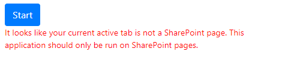
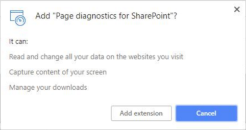
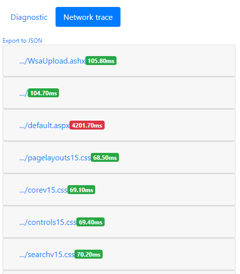

# Utiliser l’outil de diagnostics de page pour SharePoint OnlineUse the Page Diagnostics tool for SharePoint Online

Cet article explique comment utiliser l’outil de diagnostic de page pour analyser vos pages et pages de publication classiques sur des sites d’équipe classiques, par rapport à un sous-ensemble de pratiques recommandées dans **SharePoint Online**.This article describes how you can use the Page Diagnostic tool to analyze your classic publishing pages and pages on classic team sites, against a subset of recommended practices in **SharePoint Online**. 
  
Les sites d’équipe pour lesquels la publication n’est pas activée ne peuvent pas utiliser CDN, mais toutes les règles restantes sont applicables.Team sites that don't have Publishing enabled cannot make use of CDNs but all of the remaining rules are applicable. La publication ajoute une charge supplémentaire: n’activez pas la publication uniquement pour obtenir la fonctionnalité CDN car elle aura un impact négatif sur les temps de chargement des pages.Publishing adds additional overhead so do not turn on Publishing just to get the CDN functionality as it will negatively impact page load times.

**Veuillez noter que v 1.05 a été publié afin de mettre à jour votre extension si elle est déjà installée**.**Please note that V1.05 has been released so please update your extension if you have it installed already**. Si vous ne savez pas quelle version vous avez, cliquez sur le lien «à propos de» pour la vérifier.If you are unsure which version you have then please click the "About" link to verify it.
  
> [!IMPORTANT]
> L’outil Diagnostics de page ne s’exécute pas sur les bibliothèques de documents ou les pages système, car l’outil est conçu pour examiner les pages de site SharePoint.The Page Diagnostics tool will not run against document libraries or system pages, as the tool is designed to review SharePoint site pages. Une page *AllItems. aspx* est une page système.An  *allitems.aspx*  page is a system page. Si vous tentez d’exécuter l’outil sur une page système, vous obtiendrez un message indiquant «cette application doit être exécutée que sur des pages SharePoint.»If you attempt to run the tool on a system page, you will get a message that reads, "This application should only be run on SharePoint pages."    Il ne s’agit pas d’une erreur dans l’outil, car il n’y a pas de valeur dans les bibliothèques ou les pages système.This is not an error in the tool as there is no value in assessing libraries or system pages. Pour utiliser l’outil, accédez à une page SharePoint non-système.Please navigate to a non-system SharePoint page to use the tool. Si cela se produit sur une page SharePoint, vérifiez le MasterPage car nous avons vu que les clients ont consulté les balises meta SharePoint, puis la page n’est plus une page SharePoint.If this occurs on a SharePoint page then please check the MasterPage as we have seen Customers remove the SharePoint MetaTags and then the page is no longer a SharePoint page. Si vous souhaitez envoyer des commentaires à propos de l’outil, cliquez sur l’onglet à propos de et suivez le [lien donner des commentaires](https://go.microsoft.com/fwlink/?linkid=874109).Should you wish to give feedback about the tool please click the About tab and follow the [give feedback link](https://go.microsoft.com/fwlink/?linkid=874109). 
  
## Installer l’outil de diagnostic de la pageInstall the Page Diagnostic tool

> [!IMPORTANT]
> Microsoft ne lit pas les données ou sites Web que vous visitez, et nous ne recueillons aucune information personnelle, ni de site Web, ni de téléchargement d’informations avec cet outil.Microsoft does not read the data or websites you visit, and we do not capture any personal information, website or download information with this tool. Les seules informations consignées par l’outil sont le nom du client, le nombre de règles et l’option indiquant si l’option de journalisation de la prise en charge a été utilisée lors de l’exécution de l’outil.The only information logged by the tool is the Tenant name, Rule count and whether the support logging option has been utilized when the tool is run. Ces informations sont destinées à Microsoft pour analyser les défis rencontrés par nos clients et pour s’assurer que la fonctionnalité de journalisation du support n’est pas utilisée à des fins d’utilisation.This information is for Microsoft to analyze what challenges are being experienced by our Customers and to ensure the Support logging capability is not being misused.

1. À l’aide d’un navigateur Chrome, ouvrez le [lien vers l’outil](https://chrome.google.com/webstore/detail/inahogkhlkbkjkkaleonemeijihmfagi) directement ou ouvrez la recherche dans le [navigateur Chrome Webstore](https://chrome.google.com/webstore/search/page%20diagnostics%20for%20sharepoint) et installez l’extension du navigateur.Using a Chrome browser, open the [link to the tool](https://chrome.google.com/webstore/detail/inahogkhlkbkjkkaleonemeijihmfagi) directly or open the Search in the [Chrome Browser WebStore](https://chrome.google.com/webstore/search/page%20diagnostics%20for%20sharepoint) and install the browser extension. Consultez la stratégie de confidentialité de l’utilisateur indiquée sur la page Description du Store.Please review the User Privacy Policy provided on the description page in the store. Lorsque vous ajoutez l’outil à votre navigateur, vous verrez l’avis d’autorisations suivant.When adding the tool to your browser, you will see the following permissions notice.     Cette notification est en place car une page peut contenir du contenu provenant d’emplacements extérieurs à SharePoint, en fonction des composants WebPart et des personnalisations de la page.This notice is in place because a page may contain content from locations outside of SharePoint depending on the webparts and customizations on the page. Cela signifie que l’outil lira les demandes et les réponses lorsque le bouton Démarrer est activé et uniquement pour l’onglet SharePoint actif dans lequel l’outil est exécuté.This means that the tool will read the requests and responses when the start button is clicked and only for the active SharePoint tab where the tool is running. Ces informations sont capturées localement par le navigateur Web et sont disponibles via le lien exporter vers JSON de l’outil.That information is captured locally by the web browser and is available to you via the Export to JSON link in the tool. **Les informations ne sont ni envoyées ni capturées par Microsoft.****The information is not sent to or captured by Microsoft.** (L’outil respecte la politique de confidentialité de Microsoft accessible [ici](https://go.microsoft.com/fwlink/p/?linkid=857875).)(The tool respects the Microsoft Privacy policy accessible [here](https://go.microsoft.com/fwlink/p/?linkid=857875).)  La fonctionnalité «exporter vers JSON» de l’outil explique également pourquoi l’autorisation «gérer vos téléchargements» est nécessaire.The "Export to JSON" functionality in the tool is also why the "Manage your downloads" permission is needed. Suivez les instructions de confidentialité de votre entreprise avant de partager le fichier JSON en dehors de votre organisation, car les résultats contiennent des URL et peuvent être classés en tant que données personnelles (informations d’identification personnelle).Please follow your Company's own Privacy guidelines before sharing the JSON file outside of your organization, as the results contain URLs and that can be classified as PII (Personally Identifiable Information).
    
2. (Cette option est facultative) Si vous souhaitez utiliser l’outil en mode Incognito chrome, accédez à l’extension et cliquez sur **autoriser dans incognito**.(This is optional) If you want to use the tool in Chrome incognito mode, navigate to the extension and click **allow in incognito**.
    
3. Accédez à la page de publication SharePoint classique sur SharePoint Online que vous souhaitez consulter.Navigate to the SharePoint classic publishing page on SharePoint Online that you would like to review. Nous avons autorisé le chargement différé des éléments sur les pages; par conséquent, l' **outil ne s’arrêtera pas automatiquement**.We have allowed for "delay loading" of items on pages; therefore, the **tool will not stop automatically**. Si vous souhaitez arrêter la collection, vous pouvez cliquer sur **arrêter**.Should you wish to stop collection, you can click **Stop**. (Cette méthode est conçue pour répondre à tous les scénarios de chargement de pages.) Avant de cliquer sur **arrêter**, assurez-vous que les données de suivi réseau sont complètes.(This is by design to cater for all page load scenarios.) Before you click **Stop**, make sure that the network trace data is complete. Dans le cas contraire, vous aurez un suivi partiel.Otherwise, you will have a partial trace. En outre, l’outil est une extension de navigateur et l’ouverture de plusieurs onglets ou fenêtres n’autorise qu’une seule instance active de l’outil à être exécutée à la fois.Additionally, the tool is a Browser Extension, and opening multiple tabs or windows will only allow one active instance of the tool to be run at one time. Il s’agit d’une limitation des extensions dans le navigateur.This is a limitation of extensions in the browser. 
  
4. Cliquez sur le logo de l’extension.Click on the Extension logo  pour charger l’outil, le menu contextuel d’extension suivant s’affiche:to load the tool and you will be presented with the following extension popup window:   Les opérations de démarrage et d’arrêt suivent le concept de base de lorsque vous cliquez sur Démarrer la page se recharge et la collecte commence.Start and stop operations follow the basic concept of when you click start the page will reload and collection will begin.

Pour en savoir plus sur les informations fournies dans l’outil, consultez les sections suivantes.Read the following sections to learn more about the information provided in the tool.

## Ce que vous verrez dans l’outil de diagnostics de pageWhat you'll see in the Page Diagnostics tool
    
1. Le lien **à propos** fournit des instructions générales et des détails relatifs à l’outil, y compris un lien vers cet article.The **About** link will provide general guidance and details regarding the tool including a link back to this article. Il inclut également un lien direct vers les recommandations de performances de SharePoint, une notification tierce et une option pour fournir des commentaires sur l’outil.It also includes a direct link to SharePoint Performance recommendations, a Third Party notice and an option to provide feedback about the tool. 
    
2. L' **ID de corrélation, SPRequestDuration, SPIISLatency**, le **temps de chargement**de la page et les détails de l' **URL** sont des informations d’information et peuvent être utilisés à quelques fins.The **Correlation ID, SPRequestDuration, SPIISLatency**, **Page load time**, and **URL** details are informational and can be used for a few purposes. 
    
  - **CorrelationId** est un élément important lorsque vous travaillez avec les équipes de support technique Microsoft, car cela leur permet d’extraire des données de diagnostic supplémentaires.**CorrelationID** is an important element when working with the Microsoft Support Teams as it allows them to pull additional diagnostic data. 
    
  - **SPRequestDuration** est le temps du serveur utilisé pour traiter la page.**SPRequestDuration** is the server time taken to process the page. Si ce délai est long, cela ne signifie pas nécessairement que le serveur était exécuté de façon incorrecte, mais qu’il peut également refléter le nombre d’appels et de charge envoyés par la page au serveur (par exemple, la navigation structurelle, les grandes images, un grand nombre d’appels d’API, tout en contribuant à des temps de serveur plus longs). .If this time is long, it does not necessarily mean that the server was performing badly but can also reflect the number of calls and load pushed by the page to the server e.g. Structural Navigation, large images, lots of API calls could all contribute to longer server time. 
    
  - **SPIISLatency** est le temps en millisecondes qui s’est écoulé sur le serveur Web frontal lorsqu’il reçoit la demande de chargement de la page.**SPIISLatency** is the time in milliseconds taken on the Web Front End Server when it receives the request to load the page. Il s’agit d’un indicateur de latence pour démarrer le traitement de la page et n’inclut pas le temps nécessaire à l’application Web pour répondre.This is an indicator of latency to start processing the page and does not include the time taken for the web application to respond. 
    
  - Le temps de chargement de la **page** est le temps enregistré par la page entre le moment de la demande et le moment où la réponse a été reçue et lue par le navigateur.**Page load time** is the time recorded by the page from the time of the request to the time the response was received and read by the browser. Tout temps supplémentaire est affecté par les performances de l’ordinateur et le temps nécessaire au chargement du navigateur.Any additional time is affected by the performance of the computer and the time it takes for the browser to load. 
    
  - L' **URL** (Uniform Resource Locator) est l’adresse Web de la page active.The **URL** (Uniform Resource Locator) is the web address of the current page. 
    
3. L' [onglet **diagnostic** ](#how-to-use-the-diagnostic-tab) répertorie les règles et, si elles sont marquées par une croix rouge, si des problèmes sont identifiés sur la page.The [**Diagnostic** tab](#how-to-use-the-diagnostic-tab) will list the rules and if any of them are marked with a red , then there are issues identified on the page. Chaque règle dispose de son propre lien «plus d’informations» sur lequel vous cliquez si un élément est rouge.Each rule has its own "more information" link that you click if an item is red. Cela vous permettra de suivre les détails de cette règle et de résoudre le problème.That will take you to the details behind that rule and how to remediate the issue. 

4. Un [onglet **suivi du réseau** ](#how-to-use-the-network-trace-tab) fournit des détails sur les demandes et les réponses de création de page.A [**Network trace** tab](#how-to-use-the-network-trace-tab) provides details about page build requests and responses.

## Utilisation de l’onglet DiagnosticsHow to use the Diagnostic tab

1. **Vérifier l’exécution en tant qu’utilisateur standard**  La vérification des performances de page ne doit pas être effectuée lorsque vous êtes connecté en tant que compte de service, administrateur ou administrateur de collection de sites, ou tout compte avec des privilèges élevés.**Check Running as Standard User**  Checking page performance should not be performed when logged in as a Service Account, Administrator or Site Collection Administrator, or any account with elevated privileges. Des scripts et fonctionnalités supplémentaires sont chargés spécifiquement pour ces types de comptes, de sorte que les résultats ne seront pas une représentation véritable des performances des pages.Additional scripts and functionality are loaded specifically for those types of accounts, so the results will not be a true representation of page performance.
    
2. **Vérifier les demandes vers SharePoint**  La quantité de données et de demandes adressées au serveur doit être limitée car une page surchargée présente des performances médiocres.**Check Requests to SharePoint**  The amount of data and requests made to the server should be limited as an overloaded page will experience poor performance. Cette vérification vérifie le nombre de demandes adressées à SharePoint et indique quand les demandes dépassent 6 demandes.This check verifies the number of requests being made to SharePoint and will advise when the requests exceed 6 requests. La plupart des demandes doivent être mises en cache et par conséquent pas appelées pour chaque chargement de page.Most requests should be cached and therefore not called for every page load. Le cache doit être configuré et utilisé pendant au moins 15 minutes pour réduire le nombre d’appels vers une page par chaque utilisateur.Cache should be setup and utilized for at least 15 minutes to reduce the amount of calls to a page by each and every User. Il s’agit d’un problème courant et, dans la plupart des cas, les données ne changent que tous les jours, mais la page vérifie et extrait les données chaque fois pour chaque page, ce qui est souvent inutile.This is a common problem and in most cases data only changes daily but the page checks and fetches data each time for each page for each user which is often unnecessary.
    
3. **Vérifier à l’aide de CDN**  Les réseaux de distribution de contenu (CDN) ont été fournis par Microsoft et ceux qui sont mentionnés ici sont les réseaux de distribution de contenu SharePoint Online.**Check using CDNs**  Content Delivery networks (CDNs) have been provided by Microsoft and the ones referred to here are the SharePoint Online Content Delivery Networks. Plusieurs types sont disponibles, ainsi que différents services de CDN tels que SharePoint CDN, puis CDN dans Azure.There are multiple types available as well as different CDN services like SharePoint CDNs and then CDNs in Azure. [Utilisez les instructions suivantes](https://go.microsoft.com/fwlink/?linkid=873250).[Use the following guidance](https://go.microsoft.com/fwlink/?linkid=873250).
    
4. **Vérifier les tailles d’image volumineuses**  Les images doivent être optimisées pour le Web en utilisant des types de Web plus efficaces comme PNG.**Check for Large Image Sizes**  Images should be optimized for web by utilizing better web types like PNG. Les rendus d’image doivent également être utilisés et disponibles directement dans SharePoint.Image renditions should also be utilized and is available in SharePoint directly. Les images/rendus d’image dont la taille est supérieure à 100Ko sont mis en surbrillance comme non optimisés pour le Web.Images / image renditions larger than 100kb will be highlighted as not optimized for web. [Utilisez les conseils suivants pour optimiser les images](https://go.microsoft.com/fwlink/?linkid=873251).[Use the following guidance for optimizing images](https://go.microsoft.com/fwlink/?linkid=873251).
    
5. **Vérifier la navigation structurelle**  La navigation structurelle a été conçue à l’origine pour une utilisation dans SharePoint sur site où le cache d’objets pouvait être utilisé.**Check for Structural Navigation**  Structural Navigation was originally designed for use in SharePoint on-Premises where object cache could be utilized. La navigation structurelle n’est pas recommandée pour une utilisation dans SharePoint Online et doit être remplacée par la navigation gérée ou un fournisseur personnalisé.Structural Navigation is not recommended for use in SharePoint Online and should be changed to Managed Navigation or a Custom Provider. [Utilisez les conseils suivants pour optimiser la navigation.Use the following guidance for optimizing navigation.](https://go.microsoft.com/fwlink/?linkid=873247)
    
6. **Vérifier le composant WebPart CBQ** (CBQ-contenu par composant WebPart de requête)  Le composant WebPart contenu par requête génère une charge SQL élevée lorsqu’il parcourt tous les éléments de la requête pour chaque charge de page, pour chaque utilisateur.**Check for CBQ WebPart** (CBQ - Content by Query WebPart)  The Content by Query WebPart generates a high SQL load as it traverses all items in the query for each and every page load, for each User. Contrairement à une installation locale, il n’existe pas de cache disponible pour limiter le nombre de requêtes nécessaires au remplissage de ce composant WebPart.Unlike an on-Premises installation, there is no cache available to limit the number of queries needed to populate this WebPart. Comme ce CBQ s’exécute lentement et influe sur les performances globales de la page, c’est pourquoi il ne doit pas être utilisé.As such CBQ performs slowly and impacts overall page performance which is why it should not be utilized. Utilisez le composant WebPart recherche de contenu (composant WebPart recherche) pour remplacer le composant WebPart de requête de contenu.Please use the Content Search WebPart (CSWP) as the replacement for the Content Query WebPart. [Utilisez les instructions suivantes relatives au composant WebPart recherche de contenu](https://go.microsoft.com/fwlink/?linkid=873245).[Use the following guidance related to the Content Search WebPart](https://go.microsoft.com/fwlink/?linkid=873245).

## Utilisation de l’onglet suivi du réseauHow to use the Network Trace tab
    
L’onglet **suivi du réseau** fournit des informations détaillées sur les demandes de création de la page, ainsi que sur les réponses reçues.The **Network Trace** tab provides detailed information about the requests to build the page as well as the responses received. 

1. **Recherchez les temps de chargement des éléments marqués en rouge**.**Look for item load times flagged as red**. Les performances de chaque demande et réponse sont codées par couleur, en fonction de leur impact sur les performances globales de la page, comme suit:The performance of each request and response are color coded, based on their impact on the overall page performance  as follows:
- Vert: \< 500 mGreen: \< 500ms
- Jaune: 500-1000MDYellow: 500-1000ms
- Rouge: \> 1000MDRed: \> 1000ms
   Dans l’image illustrée ci-dessus, l’élément rouge est lié à la page par défaut.In the image shown above, the red item pertains to the default page. Elle s’affiche toujours en rouge, sauf si la \< page se charge dans les 1000MD (moins de 1 seconde).It will always show red unless the page loads in \< 1000ms (less than 1 second).

2. **Temps de chargement des éléments de test**.**Test item load times**. Dans certains cas, il n’y aura pas d’indicateur d’heure ou de couleur, car les éléments ont déjà été mis en cache par le navigateur.In some cases there will be no time or color indicator because the items have already been cached by the browser. Pour tester ce problème correctement, ouvrez la page, effacez le cache du navigateur, puis cliquez sur **Démarrer** , car cela entraînera un chargement de page «froid» et sera une véritable réflexion du chargement de page initial.To test this correctly, open the page, clear browser cache, and then click **Start** as that will force a "cold" page load and be a true reflection of the initial page load. Cela doit ensuite être comparé à la charge de page «chaude» car cela permettra également de déterminer les éléments mis en cache sur la page.This should then be compared to the "warm" page load as that will also help determine what items are being cached on the page. 
    
3. **Partagez des informations pertinentes avec d’autres personnes qui peuvent vous aider à identifier les problèmes**.**Share relevant details with others who can help investigate issues**. Pour partager les détails ou les informations fournis dans l’outil avec vos développeurs ou une personne du support technique, cliquez sur **Exporter vers JSON** (comme illustré dans l’image ci-dessus).To share the details or information provided in the tool with your developers or a technical support person, click **Export to JSON** (as shown in the image above). Cela vous permettra de télécharger les résultats, affichables avec une visionneuse de fichiers JSON.That will enable you to download the results, viewable with a JSON file viewer.

> [!IMPORTANT]
> Ces résultats contiennent des URL qui peuvent être classées en tant que données personnelles (informations d’identification personnelle).These results contain URLs and that can be classified as PII (Personally Identifiable Information). Veillez à suivre les instructions de votre organisation avant de distribuer ces informations.Make sure to follow your organization's guidelines before distributing that information. 

## Engagement avec le support MicrosoftEngaging with Microsoft Support
   
Nous avons inclus une **fonctionnalité de niveau de support Microsoft** qui doit être utilisée uniquement lorsque vous travaillez directement sur un cas de support technique.We have included a **Microsoft Support level feature** that should only be utilized when working directly on a Support Case for performance. L’utilisation de cette fonctionnalité ne vous permettra pas si elle est utilisée sans notre équipe de support technique.Utilizing this feature will provide no benefit to you when used without our Support team. Cela fera en sorte que la page s’exécute beaucoup plus lentement et que l’utilisation continue de la fonctionnalité peut être considérée comme une «mauvaise utilisation» du service.It will in fact make the page perform significantly slower and continued use of the feature may be considered "misuse" of the service. Il n’existe pas d’informations supplémentaires lors de l’utilisation de cette fonctionnalité dans l’outil, car les informations supplémentaires sont ajoutées à la journalisation dans le service.There is no additional information when using this feature in the tool as the additional information is added to the logging in the service. 

Aucune modification n’est visible sauf si vous êtes informé que vous l’avez activé et que les performances de votre page seront considérablement dégradées de 2-3 fois la vitesse de fonctionnement, tandis que l’option est activée.No change is visible except that you will be notified that you have enabled it and your page performance will be significantly degraded by 2-3 times slower performance whilst that is enabled. Il ne s’applique qu’à la page particulière et à la session active.It will only be relevant for the particular page and that active session. Pour cette raison, vous devez l’utiliser avec parcimonie et uniquement lorsque vous participez activement à notre équipe de support technique.For this reason, this should be used sparingly and only when actively engaged with our Support Team.

### Pour activer la fonctionnalité niveau de support MicrosoftTo enable the Microsoft Support level feature

1. Ouvrez l’outil Diagnostics de la page.Open the Page Diagnostics tool.
2. Sur votre clavier, appuyez sur ALT-MAJ-b.On your keyboard, press ALT-Shift-L. Cette opération permet d’afficher la journalisation du **niveau de prise en charge**.This will display **Enable support level logging**. 
3. Activez la case à cocher, puis cliquez sur **Démarrer** pour recharger la page et générer une journalisation détaillée pour la prise en charge de l’analyse.Select the checkbox, and then click **start** to reload the page and generate verbose logging for Support to analyze. 
  
Un élément important pour cette opération est l’CorrelationID, car l’équipe de support technique utilisera ce numéro pour extraire les informations nécessaires.An important element for this is the CorrelationID as the Support team will then utilize that number to extract the information needed. Veuillez copier le CorrelationID (en haut de l’outil de diagnostics de page) et fournissez-lui la prise en charge car ils ne peuvent pas effectuer le travail requis sans l’ID complet.Please copy the CorrelationID (at the top of the Page Diagnostics tool) and provide that to Support as they cannot perform the required work without the complete ID.
    
## Sujets associésRelated topics

[Optimisation des performances SharePoint OnlineTune SharePoint Online performance](tune-sharepoint-online-performance.md)

[Optimisation des performances Office 365Tune Office 365 performance](tune-office-365-performance.md)

[Réseaux de distribution de contenuContent delivery networks](content-delivery-networks.md)
