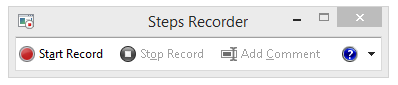

# Plan de résolution des problèmes de performances pour Office 365Performance troubleshooting plan for Office 365

Vous devez connaître les étapes à suivre pour identifier et corriger les retards, blocages et performances lentes entre SharePoint Online, OneDrive entreprise, Exchange Online ou Skype pour Business Online et votre ordinateur client ? Avant d’appeler prise en charge, cet article peut vous aider à résoudre les problèmes de performances d’Office 365 et même résoudre certains des problèmes plus courants.Do you need to know the steps to take to identify and fix lags, hangs, and slow performance between SharePoint Online, OneDrive for Business, Exchange Online, or Skype for Business Online, and your client computer? Before you call support, this article can help you troubleshoot Office 365 performance issues and even fix some of the most common issues.
  
Cet article est en fait un plan d’action exemple que vous pouvez utiliser pour capturer des données précieuses concernant votre problème de performances comme c’est le lieu. Certains principaux problèmes sont également inclus dans cet article.This article is actually a sample action plan that you can use to capture valuable data about your performance issue as it's happening. Some top issues are also included in this article.
    
Si vous connaissez les performances réseau et que vous souhaitez faire un plan à long terme pour surveiller les performances entre vos ordinateurs clients et d’Office 365, jetez un œil à [Office 365 performances réglage et résolution des problèmes - Admin et professionnels de l’informatique](performance-tuning-using-baselines-and-history.md).If you're new to network performance and want to make a long term plan to monitor performance between your client machines and Office 365, take a look at [Office 365 performance tuning and troubleshooting - Admin and IT Pro](performance-tuning-using-baselines-and-history.md).
  
## Plan d’action exemple performances Résolution des problèmesSample performance troubleshooting action plan

Ce plan d’action contient deux parties ; une phase de préparation et une phase de journalisation. Si vous avez un problème de performances maintenant, et vous devez faire de collecte de données, vous pouvez démarrer immédiatement à l’aide de ce plan.This action plan contains two parts; a preparation phase, and a logging phase. If you have a performance problem right now, and you need to do data collection, you can start using this plan right away.
  
 **Préparer l’ordinateur client****Prepare the client computer**
  
- Recherchez un ordinateur client qui peut reproduire le problème de performances. Cet ordinateur sera utilisé au cours de la résolution des problèmes.Find a client computer that can reproduce the performance problem. This computer will be used during the course of troubleshooting.
    
- Notez les étapes qui provoquent se produire afin que vous êtes prêt, lorsqu’il est nécessaire pour tester le problème de performances.Write down the steps that cause the performance problem to happen so you're ready when it comes time to test.
    
- Installer les outils de collecte et d’enregistrement des informations :Install tools for gathering and recording information:
    
  - Installez [Netmon 3.4](https://www.microsoft.com/en-us/download/details.aspx?id=4865) (ou utilisez un outil de suivi réseau équivalente).Install [Netmon 3.4](https://www.microsoft.com/en-us/download/details.aspx?id=4865) (or use an equivalent network tracing tool). 
    
  - Installez l’édition de base libre de [HTTPWatch](https://www.httpwatch.com/download/) (ou utilisez un outil de suivi réseau équivalente).Install the free Basic Edition of [HTTPWatch](https://www.httpwatch.com/download/) (or use an equivalent network Tracing tool). 
    
  - Utiliser un enregistrement de l’écran ou l’enregistreur étapes (PSR.exe) qui est fourni avec Windows Vista et versions ultérieures, afin de conserver un enregistrement des étapes à que suivre lors du test.Use a screen recorder or run the Steps Recorder (PSR.exe) that comes with Windows Vista and later, in order to keep a record of the steps you take during testing.
    
 **Ouvrez une session le problème de performances****Log the performance issue**
  
- Fermez tous les navigateurs Internet superflus.Close all extraneous Internet browsers.
    
- Démarrez l’enregistreur d’étapes, ou un autre enregistreur de l’écran.Start the Steps Recorder, or another screen recorder.
    
- Démarrez votre capture Netmon (ou l’outil de suivi réseau).Start your Netmon capture (or network tracing tool).
    
- Désactivez le cache DNS sur l’ordinateur client à partir de la ligne de commande en tapant ipconfig /flushdns.Clear your DNS cache on the client computer from the command line by typing ipconfig /flushdns.
    
- Démarrer une nouvelle session de navigateur et activer HTTPWatch.Start a new browser session and turn on HTTPWatch.
    
- Facultatif : Si vous testez Exchange Online, exécutez l’outil Analyseur de performances de Client Exchange à partir de la console d’administration Office 365.Optional: If you are testing Exchange Online, run the Exchange Client Performance Analyzer tool from the Office 365 admin console.
    
- Reproduisez les étapes exactes qui provoquent le problème de performances.Reproduce the exact steps that cause the performance issue.
    
- Arrêtez votre Netmon ou suivi de l’autre outil.Stop your Netmon or other tool's trace.
    
- Sur la ligne de commande, exécutez un itinéraire de suivi à votre abonnement Office 365 en tapant la commande suivante et appuyez sur ENTRÉE :At the command line, run a trace route to your Office 365 subscription by typing the following command and then pressing ENTER:
    
    `tracert \< *subscriptionname*  \>.onmicrosoft.com` 
    
- Arrêtez l’enregistreur étapes et enregistrer la vidéo. Veillez à inclure la date et l’heure de la capture et si elle montre les performances bon ou mauvais.Stop the Steps Recorder and save the video. Be sure to include the date and time of the capture and whether it demonstrates good or bad performance.
    
- Enregistrer les fichiers de suivi. Là encore, veillez à inclure la date et l’heure de la capture et si elle montre les performances bon ou mauvais.Save the trace files. Again, be sure to include the date and time of the capture and whether it demonstrates good or bad performance.
    
Si vous n’êtes pas familiarisé avec les outils mentionnés dans cet article en cours d’exécution, ne vous inquiétez pas, car nous fournissons ces étapes suivant. Si vous êtes habitué à l’exécution de ce type de capture du réseau, vous pouvez ignorer [la collecte des planifications](performance-tuning-using-baselines-and-history.md#how-to-collect-baselines), qui décrit le filtrage et la lecture des fichiers journaux.If you're not familiar with running the tools mentioned in this article, don't worry because we provide those steps next. If you're accustomed to doing this kind of network capturing, you can skip to [How to collect baselines](performance-tuning-using-baselines-and-history.md#how-to-collect-baselines), which describes filtering and reading the logs. 
  
## Vider le Cache DNS tout d’abordFlush the DNS Cache first

Pourquoi ? À vider le cache DNS au départ, vos tests vierge. En désactivant le cache, vous réinitialisez le contenu de la résolution DNS pour les entrées des plus récentes. N’oubliez pas qu’un vidage ne supprime pas les entrées du fichier HOSTs. Si vous utilisez des entrées du fichier hôte largement, vous devez copier ces entrées dans un fichier dans un autre répertoire et puis vider le fichier hôte.Why? By flushing out the DNS cache you're starting your tests with a clean slate. By clearing the cache, you're resetting the DNS resolver contents to the most up-to-date entries. Remember that a flush does not remove HOSTs file entries. If you use HOST file entries extensively, you should copy those entries out to a file in another directory and then empty the HOST file.
  
 **Vider le cache de résolution DNS****Flush your DNS resolver cache**
  
1. Ouvrez l’invite de commandes (soit **Démarrer** \> **exécuter** \> **cmd** ou la **touche Windows** \> **cmd**).Open the command prompt, (either **Start** \> **Run** \> **cmd** or **Windows key** \> **cmd**).
    
2. Tapez la commande suivante et appuyez sur ENTRÉE :`ipconfig /flushdns`Type the following command and press ENTER: `ipconfig /flushdns`
    
## NetmonNetmon

Outil d’analyse réseau de Microsoft ([Netmon](https://www.microsoft.com/download/details.aspx?id=4865)) analyse les paquets, qui est le trafic, qui transmet entre les ordinateurs sur les réseaux. À l’aide de Netmon le trafic avec Office 365 vous pouvez capturer, afficher, de suivi et lire les en-têtes de paquet, identifier les périphériques intermédiaires, vérifiez les paramètres importants de matériel réseau, recherchez la perte de paquets et suivez le flux du trafic entre les ordinateurs de votre entreprise réseau et Office 365. Étant donné que le corps du trafic est chiffré, autrement dit, elle (est transmis sur le port 443 via le protocole SSL/TLS, vous ne pouvez pas lire les fichiers envoyés. Au lieu de cela, vous obtenez un suivi non filtré le chemin d’accès qui l’utilise des paquets qui peut vous aider à localiser le problème.Microsoft's Network Monitoring tool ([Netmon](https://www.microsoft.com/download/details.aspx?id=4865)) analyzes packets, that is traffic, that passes between computers on networks. By using Netmon to trace traffic with Office 365 you can capture, view, and read packet headers, identify intervening devices, check important settings on network hardware, look for dropped packets, and follow the flow of traffic between computers on your corporate network and Office 365. Because the actual body of the traffic is encrypted, that is, it(travels on port 443 via SSL/TLS, you can't read the files being sent. Instead, you get an unfiltered trace of the path that the packet takes which can help you track down the problem behavior.
  
Assurez-vous que vous n’appliquez pas un filtre à ce stade. Au lieu de cela, exécutez les étapes et illustrer le problème avant d’arrêter le suivi et l’enregistrement.Be sure you don't apply a filter at this time. Instead, run through the steps and demonstrate the problem before stopping the trace and saving.
  
Après avoir installé Netmon 3.4, ouvrez l’outil et effectuez les étapes suivantes :After you install Netmon 3.4, open the tool and take these steps:
  
 **Effectuer une trace Netmon et reproduire le problème****Take a Netmon trace and reproduce the issue**
  
1. Lancez Netmon 3.4.Launch Netmon 3.4.
    
    Il existe trois volets sur la page de **démarrage** : **Capture récents**, **Sélectionnez les réseaux**et la mise en route avec les Moniteur réseau Microsoft 3.4 **. Avis**. Le panneau de configuration de réseaux sélectionnez vous donne également une liste des réseaux par défaut à partir de laquelle vous pouvez capturer. N’oubliez pas que les cartes réseau sont sélectionnés ici.There are three panes on the **Start** page: **Recent Captures**, **Select Networks**, and the **Getting Started with Microsoft Network Monitor 3.4. Notice**. The Select Networks panel will also give you a list of the default networks from which you can capture. Be sure that network cards are selected here.
    
2. Cliquez sur **Nouvelle Capture** en haut de la page de **démarrage** . Cette opération ajoute un nouvel onglet en regard de l’onglet page **Démarrer** appelé **Capture de 1**.Click **New Capture** at the top of the **Start** page. This adds a new tab beside the **Start** page tab called **Capture 1**.
    
    
  
3. Pour effectuer une capture simple, cliquez sur **Démarrer** dans la barre d’outils.To take a simple capture, click **Start** on the toolbar. 
    
4. Reproduisez les étapes qui présentent un problème de performances.Reproduce the steps that present a performance issue.
    
5. Cliquez sur **Arrêter** \> **fichier** \> **Enregistrer en tant que**. N’oubliez pas de donner la date et l’heure avec le fuseau horaire et pour indiquer si elle montre incorrect ou bonnes performances.Click **Stop** \> **File** \> **Save As**. Remember to give the date and time with the time zone and to mention if it demonstrates bad or good performance.
    
## HTTPWatchHTTPWatch

[HTTPWatch](https://www.httpwatch.com/download/) est chargée et une édition gratuite. L’édition de base libre couvre tout ce dont vous avez besoin pour ce test. HTTPWatch moniteurs de temps de chargement de page et le trafic réseau directement à partir de la fenêtre du navigateur. HTTPWatch est un plug-in Internet Explorer, qui décrit les performances sous forme graphique. L’analyse peut être enregistrée et affichée dans HTTPWatch Studio.[HTTPWatch](https://www.httpwatch.com/download/) comes in charged, and a free edition. The free Basic Edition covers everything you need for this test. HTTPWatch monitors network traffic and page load time right from your browser window. HTTPWatch is a plug-in to Internet Explorer that graphically describes performance. The analysis can be saved and viewed in HTTPWatch Studio. 
  
> [!NOTE]
> Si vous utilisez un autre navigateur, comme Firefox, Google Chrome, ou si vous ne pouvez pas installer HTTPWatch dans Internet Explorer, ouvrez une nouvelle fenêtre de navigateur et appuyez sur la touche F12 de votre clavier. Vous devez voir l’outil de développement contextuel en bas de votre navigateur. Si vous utilisez Opera, appuyez sur CTRL + MAJ + I pour inspecteur Web, puis cliquez sur l’onglet **réseau** et effectuer les tests décrits ci-dessous. Les informations seront légèrement différentes, mais le temps de chargement seront affichera toujours en millisecondes. > HTTPWatch est également très utile pour les problèmes liés à SharePoint Online temps de chargement de page.If you use another browser, such as Firefox, Google Chrome, or if you can't install HTTPWatch in Internet Explorer, open a new browser window and press F12 on your keyboard. You should see the Developer Tool pop-up at the bottom of your browser. If you use Opera, press CTRL+SHIFT+I for Web Inspector, then click the **Network** tab and complete the testing outlined below. The information will be slightly different, but load times will still be displayed in milliseconds. > HTTPWatch is also very useful for issues with SharePoint Online page load times. 
  
 **Exécutez HTTPWatch et reproduire le problème****Run HTTPWatch and reproduce the issue**
  
1. HTTPWatch étant un plug-in de navigateur exposition de l’outil dans le navigateur est légèrement différent pour chaque version d’Internet Explorer. En règle générale, vous trouverez HTTPWatch sous la barre de commandes dans le navigateur Internet Explorer.HTTPWatch is a browser plug-in, so exposing the tool in the browser is slightly different for each version of Internet Explorer. Typically, you can find HTTPWatch under the Commands bar in the Internet Explorer browser.  Si vous ne voyez pas le plug-in de HTTPWatch dans votre fenêtre de navigateur, vérifie la version de votre navigateur cliquez sur Aide \> sur, ou, dans les versions ultérieures d’Internet Explorer, cliquez sur le symbole d’engrenage et sur Internet Explorer. Pour lancer la barre de **commandes** , avec le bouton droit de la barre de menus dans Internet Explorer, cliquez sur **barre de commandes**. Dans le passé, HTTPWatch a été associé avec les commandes et les barres de l’Explorateur de solutions, ainsi qu’une seule fois vous installez, si vous ne voyez pas directement l’icône (même après le redémarrage) vérifier les **Outils**et vos barres d’outils de l’icône. N’oubliez pas que les barres d’outils peuvent être personnalisés et options peuvent être ajoutées.If you don't see the HTTPWatch plug-in in your browser window, check the version of your browser by click Help \> About, or, in later versions of Internet Explorer, click the gear symbol and About Internet Explorer. To launch the **Commands** bar, right-click the menu bar in Internet Explorer and click **Commands bar**. In the past, HTTPWatch has been associated with both the Commands and the Explorer bars, so once you install, if you don't immediately see the icon (even after reboot) check **Tools**, and your toolbars for the icon. Remember that toolbars can be customized and options can be added to them. 
    
  
2. Lancez HTTPWatch dans une fenêtre de navigateur Internet Explorer. Il apparaîtra ancrée au navigateur en bas de cette fenêtre. Cliquez sur **Enregistrer**.Launch HTTPWatch in an Internet Explorer browser window. It will appear docked to the browser at the bottom of that window. Click **Record**.
    
3. Reproduisez les étapes exactes requises pour le problème de performances. Cliquez sur le bouton **Arrêter** dans HTTPWatch.Reproduce the exact steps involved in the performance issue. Click the **Stop** button in HTTPWatch. 
    
4. **Enregistrer** le HTTPWatch ou **Envoyer par courrier électronique**. N’oubliez pas de nom du fichier de sorte qu’il inclut les informations de date et heure et une indication de si votre contient une démonstration de performances bon ou mauvais.**Save** the HTTPWatch or **Send by Email**. Remember to name the file so that it includes date and time information and an indication of whether your Watch contains a demonstration of good or bad performance.  
    Cette capture d’écran est à partir de la version professionnelle de HTTPWatch. Vous pouvez ouvrir les traces dans la Version de base sur un ordinateur avec une version professionnelle et lire. Informations supplémentaires soient disponibles à partir de la trace par le biais de cette méthode.This screen shot is from the Professional version of HTTPWatch. You can open traces taken in the Basic Version on a computer with a Professional version and read it there. Extra information may be available from the trace through that method.
    
## Enregistreur d’actionsProblem Steps Recorder

Enregistreur d’étapes ou PSR.exe, vous permet d’enregistrer les problèmes qu’ils sont produisent. Il s’agit d’un outil très utile et très simple à exécuter.Steps Recorder, or PSR.exe, allows you to record issues as they are occurring. It's a very useful tool and very simple to run.
  
 **Exécutez l’enregistreur d’actions (PSR.exe) pour enregistrer votre travail****Run Problem Steps Recorder (PSR.exe) to record your work**
  
1. Utilisez **Démarrer** \> **exécuter** \> tapez **PSR.exe** \> **OK**, ou cliquez sur la **Touche Windows** \> tapez **PSR.exe** \> , puis appuyez sur ENTRÉE.Either use **Start** \> **Run** \> type **PSR.exe** \> **OK**, or, click the **Windows Key** \> type **PSR.exe** \> and then press ENTER. 
    
2. Lorsque la petite fenêtre PSR.exe s’affiche, cliquez sur **Démarrer l’enregistrement** et reproduire les étapes de reproduire le problème de performances. Vous pouvez ajouter des commentaires selon vos besoins, en cliquant sur **Ajouter des commentaires**.When the small PSR.exe window appears, click **Start Record** and reproduce the steps that reproduce the performance issue. You can add comments as needed, by clicking **Add Comments**.
    
3. Cliquez sur **Arrêter un enregistrement** lorsque vous avez terminé les étapes. Si le problème de performances est un rendu de page, attendez que la page à rendre avant d’arrêter l’enregistrement.Click **Stop Record** when you have completed the steps. If the performance issue is a page render, wait for the page to render before you stop the recording. 
    
4. Cliquez sur **Enregistrer**.Click **Save**.
    

  
La date et l’heure sont consignées pour vous. Votre qui aux Netmon suivi et HTTPWatch dans le temps et sélectionnez facilite le dépannage de précision. La date et l’heure de l’enregistrement qui peuvent afficher les une minute transmis entre la connexion et la navigation de l’URL et le rendu partiel du site d’administration, par exemple.The date and time is recorded for you. This links your PSR to your Netmon trace and HTTPWatch in time, and helps with precision troubleshooting. The date and time in the PSR record can show that a minute passed between the login and browsing of the URL and the partial render of the admin site, for example.
  
## Lire votre tracesRead your traces

Il n’est pas possible d’apprendre tout ce que quelqu'un a besoin de connaître par le biais d’un article sur le réseau et la résolution des problèmes de performances. Obtention de bonnes performances prend, connaissances et une expérience du fonctionnement de votre réseau et effectue généralement. Mais il est possible d’arrondir à une liste des principaux problèmes et montrent comment outils peuvent rendre plus facile d’éliminer les problèmes les plus courants.It isn't possible to teach everything about network and performance troubleshooting that someone would need to know via an article. Getting good at performance takes experience, and knowledge of how your network works and usually performs. But it is possible to round up a list of top issues and show how tools can make it easier for you to eliminate the most common problems.
  
Si vous souhaitez identifier les compétences de lecture des traces de réseau pour vos sites Office 365, il n’existe aucune enseignant mieux que la création des traces de charges de page régulièrement et d’acquérir de l’expérience de lecture. Par exemple, lorsque vous avez la possibilité, chargez un service Office 365 et suivre le processus. Filtre le suivi pour le trafic DNS, ou rechercher le FrameData pour le nom du service recherché. Analyser le suivi pour avoir une idée des étapes qui se produisent lorsque le service de charge. Cela vous permettra de savoir quels normal chargement de la page doit se présenter comme, et dans le cas de résoudre les problèmes, en particulier autour de performances, comparaison des traces satisfaisant à insuffisant vous peut d’apprendre beaucoup.If you want to pick up skills reading network traces for your Office 365 sites, there is no better teacher than creating traces of page loads regularly and gaining experience reading them. For example, when you have a chance, load an Office 365 service and trace the process. Filter the trace for DNS traffic, or search the FrameData for the name of the service you browsed. Scan the trace to get an idea of the steps that occur when the service loads. This will help you learn what normal page load should look like, and in the case of troubleshooting, particularly around performance, comparing good to bad traces can teach you a lot.
  
Netmon utilise Microsoft Intellisense dans le champ de filtre d’affichage. IntelliSense, ou la fin du code intelligent, est pli où vous tapez dans une période et toutes les options disponibles sont affichées dans une zone de liste déroulante. Si, par exemple, vous êtes prêt mise à l’échelle de fenêtre TCP, vous pouvez trouver pratique pour un filtre (tel que `.protocol.tcp.window < 100`) par ce biais.Netmon uses Microsoft Intellisense in the Display filter field. Intellisense, or intelligent code completion, is that trick where you type in a period and all available options are displayed in a drop-down selection box. If, for example, you are worried about TCP window scaling, you can find your way to a filter (such as  `.protocol.tcp.window < 100`) by this means.
  

  
Analyses Netmon pouvant avoir beaucoup de trafic. Si vous n’êtes pas familiarisé avec les lire, il est susceptible de que vous sera dépassé l’ouverture de la trace de la première fois. La première chose à faire est de séparer le signal le bruit de fond dans la trace. Vous testée par rapport à Office 365, et qui est le trafic que vous souhaitez afficher. Si vous permettent de parcourir les suivis, vous devrez pas cette liste.Netmon traces can have a lot of traffic in them. If you aren't experienced with reading them, it's likely you will be overwhelmed opening the trace the first time. The first thing to do is separate the signal from the background noise in the trace. You tested against Office 365, and that's the traffic you want to see. If you are used to navigating through traces, you may not need this list.
  
Le trafic entre vos clients et d’Office 365 est transmis via le protocole TLS, ce qui signifie que le corps du trafic sera chiffré et non lisible dans une trace Netmon générique. L’analyse des performances ne doit connaître les caractéristiques des informations dans le paquet. Toutefois, il est très intéressés par les en-têtes de paquet et les informations qu’ils contiennent.Traffic between your client and Office 365 travels via TLS, which means that the body of the traffic will be encrypted and not readable in a generic Netmon trace. Your performance analysis doesn't need to know the specifics of the information in the packet. It is, however, very interested in packet headers and the information that they contain.
  
 **Conseils pour obtenir un bon suivi****Tips to get a good trace**
  
- Connaître la valeur de l’adresse IPv4 ou IPv6 de votre ordinateur client. Vous pouvez obtenir cette depuis l’invite de commande en tapant **IPConfig** , puis appuyez sur ENTRÉE. Connaître cette adresse vous permet d’indiquer un coup de œil si le trafic dans la trace implique directement votre ordinateur client. S’il existe un proxy connu, il ping et obtenir son adresse IP.Know the value of the IPv4 or IPv6 address of your client computer. You can get this from the command prompt by typing **IPConfig** and then pressing ENTER. Knowing this address will let you tell at a glance whether the traffic in the trace directly involves your client computer. If there is a known proxy, ping it and get its IP address as well. 
    
- Vider le cache de résolution DNS et, si possible, fermez tous les navigateurs à l’exception de celui dans lequel vous exécutez vos tests. Si vous n’êtes pas en mesure d’effectuer cette opération, par exemple, si la prise en charge à l’aide un outil basé sur un navigateur pour voir le bureau de votre ordinateur client, préparez-vous à filtrer votre trace.Flush your DNS resolver cache and, if possible, close all browsers except the one in which you are running your tests. If you are not able to do this, for instance, if support is using some browser-based tool to see your client computer's desktop, be prepared to filter your trace.
    
- Dans une activité de suivi, recherchez le service Office 365 que vous utilisez. Si vous avez lu jamais ou rarement le trafic avant, il s’agit d’une étape utile pour séparer le problème de performances à partir d’autres bruit de réseau. Il existe plusieurs façons de le faire. Directement avant d’effectuer le test, vous pouvez utiliser ping ou PsPing, à l’URL du service spécifique ( `ping outlook.office365.com` et/ou `psping -4 microsoft-my.sharepoint.com:443`, pour obtenir des exemples). Vous trouverez également facilement ce PsPing dans une trace Netmon (par son nom de processus). Qui vous donne un point de départ de recherche.In a busy trace, locate the Office 365 service that you're using. If you've never or seldom seen your traffic before, this is a helpful step in separating the performance issue from other network noise. There are a few ways to do this. Directly before your test, you can use ping or, PsPing, to the URL of the specific service ( `ping outlook.office365.com` and/or  `psping -4 microsoft-my.sharepoint.com:443`, for examples) . You can also easily find that PsPing in a Netmon trace (by its process name). That will give you a place to start looking.
    
    Si vous utilisez uniquement le suivi Netmon au moment du problème, qui est trop OK. Pour vous orienter, utiliser un filtre comme `ContainsBin(FrameData, ASCII, "office")` ou `ContainsBin(FrameData, ASCII, "outlook")`. Vous pouvez enregistrer votre numéro d’image à partir du fichier de suivi. Vous pouvez également faire défiler le volet Résumé du cadre vers la droite et recherchez la colonne ID de Conversation. Il existe un nombre y est indiqué pour l’ID de conversation spécifiques que vous pouvez également enregistrer et regardez isolément ultérieurement. N’oubliez pas de supprimer ce filtre avant de l’appliquer à n’importe quel autre filtrage.If you're only using Netmon tracing at the time of the problem, that's okay too. To orient yourself, use a filter like  `ContainsBin(FrameData, ASCII, "office")` or  `ContainsBin(FrameData, ASCII, "outlook")`. You can record your frame number from the trace file. You may also want to scroll the Frame Summary pane all the way to the right and look for the Conversation ID column. There is a number indicated there for the ID of this specific conversation that you can also record and look at in isolation later. Remember to remove this filter before applying any other filtering.
    
> [!TIP]
> Netmon a un grand nombre de filtres intégrés utiles. Essayer le bouton « Load Filter » en haut du volet de filtre **d’affichage** .Netmon has a lot of helpful built-in filters. Try the "Load Filter" button at the top of the **Display** filter pane. 
  

  

  
Familiarisez-vous avec le trafic et apprenez à localiser les informations dont vous avez besoin. Par exemple, comment déterminer les paquets dans la trace de la première référence au service Office 365 que vous utilisez (par exemple, « Outlook »).Get familiar with your traffic, and learn to locate the information you need. For example, learn to determine which packet in the trace has the first reference to the Office 365 service you're using (like "Outlook").
    
Prise de Office 365 Outlook en ligne en guise d’exemple, le trafic commence semblable à ceci :Taking Office 365 Outlook Online as an example, the traffic begins something like this:
  
- Requête Standard DNS et réponse DNS pour outlook.office365.com avec mise en correspondance QueryIDs. Il est important de noter le décalage de temps pour cette bouclage, ainsi que where dans le monde Office 365 Global DNS envoie la demande de résolution de noms. Dans l’idéal, localement en tant que possible, plutôt que de moitié dans le monde entier. (Il peut être suivi par certaines la connexion en ligne le trafic DNS.)DNS Standard Query and DNS Response for outlook.office365.com with matching QueryIDs. It's important to note the Time Offset for this turn-around, as well as where in the world the Office 365 Global DNS sends the request for name resolution. Ideally, as locally as possible, rather than half-way across the world. (This may be followed by some DNS traffic the online login.)
    
- Un obtenir la demande HTTP dont le statut de signaler déplacé définitivement (301)A HTTP GET Request whose status report Moved Permanently (301)
    
- Trafic RW notamment RW connecter des demandes et réponses de se connecter. (Il s’agit de Winsock distant d’une connexion pour vous.)RWS Traffic including RWS Connect requests and Connect replies. (This is Remote Winsock making a connection for you.)
    
- Une conversation TCP SYN et SYN accusé. Un grand nombre des paramètres de cette conversation impact sur les performances.A TCP SYN and TCP SYN/ACK conversation. A lot of the settings in this conversation impact your performance.
    
- Puis une série de trafic TLS:TLS qui est où la négociation TLS et les conversations de certificat TLS ont lieu. (N’oubliez pas que les données sont chiffrées via le protocole SSL/TLS).Then a series of TLS:TLS traffic which is where the TLS handshake and TLS certificate conversations take place. (Remember the data is encrypted via SSL/TLS.)
    
Tous les composants du trafic sont importantes et sont connectés, mais petites portions de la trace contiennent des informations particulièrement importantes en termes de résolution des problèmes de performances, afin que nous nous concentrerons sur ces domaines. En outre, étant donné que nous avons suffisamment performances Office 365 dépannage chez Microsoft pour compiler une liste de problèmes courants des dix, nous nous concentrerons sur ces problèmes et comment utiliser les outils que nous devons leur racine qui suit.All parts of the traffic are important and connected, but small portions of the trace contain information particularly important in terms of performance troubleshooting, so we'll focus on those areas. Also, since we've done enough Office 365 performance troubleshooting at Microsoft to compile a Top Ten list of common problems, we'll focus on those issues and how to use the tools we have to root them out next.
  
Si vous n’avez pas installé les tout prêt, le tableau ci-dessous permet d’utiliser plusieurs outils. Lorsque cela est possible. Liens vers les points d’installation sont fournis. La liste inclut les outils de suivi réseau courantes, telles que [Netmon](https://www.microsoft.com/en-us/download/details.aspx?id=4865) et [Wireshark](https://www.wireshark.org/), mais utilisez n’importe quel outil de traçage que vous êtes familiarisé avec, et dans lequel vous avez l’habitude de filtrage du trafic réseau. Lorsque que vous testez, n’oubliez pas :If you haven't installed them all ready, the matrix below makes use of several tools. Where possible. Links are provided to the installation points. The list includes common network tracing tools like [Netmon](https://www.microsoft.com/en-us/download/details.aspx?id=4865) and [Wireshark](https://www.wireshark.org/), but use any tracing tool you are comfortable with, and in which you're accustomed to filtering network traffic. When you're testing, remember:
  
-  *Fermez votre navigateur et tester avec uniquement un navigateur en cours d’exécution* , cela permet de réduire le trafic global vous capturez. Elle permet un suivi moins occupé.*Close your browsers, and test with only one browser running*  - This will reduce the overall traffic you capture. It makes for a less busy trace. 
    
-  *Vider le cache de résolution DNS sur l’ordinateur client* - vous obtiendrez vierge lorsque vous commencez à effectuer votre capture, pour un suivi de tâche de nettoyage.*Flush your DNS resolver cache on the client computer*  - This will give you a clean slate when you start to take your capture, for a cleaner trace. 
    
## Certains principaux problèmesSome Top Issues

Certains problèmes courants que vous pouvez rencontrer et comment les rechercher dans le suivi de votre réseau.Some common issues you may face and how to find them in your Network trace.

### TCP Windows mise à l’échelleTCP Windows Scaling

Trouvé dans le SYN - hérité SYN/accusé de réception. ou matériel d’ancienneté ne peut pas exploiter windows TCP mise à l’échelle.  Sans windows TCP appropriées les paramètres de mise à l’échelle, la mémoire tampon de 16 bits par défaut dans les en-têtes TCP remplit en millisecondes.  Le trafic ne peut pas continuer à envoyer jusqu'à ce que le client reçoit un accusé de réception que les données d’origine a été reçues, provoquer des retards.Found in the SYN - SYN/ACK. Legacy or aging hardware may not take advantage of TCP windows scaling.  Without proper TCP windows scaling settings, the default 16-bit buffer in TCP headers fills in milliseconds.  Traffic cannot continue to send until the client receives an acknowledgment that the original data has been received, causing delays.

#### Outils :Tools:

- NetmonNetmon
- WiresharkWireshark 

#### Ce que vous recherchez :What you're looking for:

Recherchez le SYN - SYN/accusé de réception le trafic dans le suivi de votre réseau.  Dans Netmon, utilisez un filtre comme `tcp.flags.syn == 1`. Ce filtre est la même dans Wireshark.Look for the SYN - SYN/ACK traffic in your network trace.  In Netmon, use a filter like  `tcp.flags.syn == 1`. This filter is the same in Wireshark.  

         
Notez que pour chaque SYN est un numéro de port (SrcPort) qui est mis en correspondance dans le port de destination (DstPort) de l’accusé de réception associée (SYN/accusé de réception).Notice that for every SYN there is a source port (SrcPort) number that is matched in the destination port (DstPort) of the related Acknowledgment (SYN/ACK). 

Pour afficher la valeur de la montée en charge de Windows qui est utilisée par la connexion au réseau, développez tout d’abord le SYN, puis le connexes SYN/accusé de réception.To see the Windows Scaling value that is used by your network connection, expand first the SYN, and then the related SYN/ACK.  

  

### Paramètres de délai d’inactivité TCPTCP Idle Time Settings

Historiquement, la plupart des réseaux de périmètre sont configurés pour les connexions temporaires, ce qui signifie que des connexions inactives sont généralement terminées. Sessions TCP inactives peuvent être arrêtées par les serveurs proxy et les pare-feu plus de 100 à 300 secondes. Cela pose pour Outlook en ligne, car il crée et utilise les connexions à long terme, s’ils sont inactifs ou non.Historically, most perimeter networks are configured for transient connections, meaning idle connections are generally terminated. Idle TCP sessions can be terminated by proxies and firewalls at greater than 100 to 300 seconds. This is problematic for Outlook Online because it creates and uses long-term connections, whether they are idle or not.  

Lorsque les connexions sont interrompues par proxy ou pare-feu, le client n’est pas informé et essayez d’utiliser Outlook en ligne implique un ordinateur client essaie, à plusieurs reprises, récupérez la connexion avant d’en créer un nouveau. Vous pouvez voir se bloque dans le produit, les invites ou baisse des performances de chargement de la page.When connections are terminated by proxy or firewall devices, the client is not informed, and an attempt to use Outlook Online will mean a client computer will try, repeatedly, to revive the connection before making a new one. You may see hangs in the product, prompts, or slow performance on page load.

#### Outils :Tools:

- NetmonNetmon
- WiresharkWireshark

#### Ce que vous recherchez :What to look for:

Dans Netmon, examinez le champ décalage de temps pour un aller-retour. Un aller-retour est le temps écoulé entre le client envoie une demande au serveur et de recevoir une réponse au. Vérifier entre le Client et le point de sortie (par ex. Client--\> Proxy), ou le Client à Office 365 (Client--\> Office 365). Vous pouvez voir ce dans de nombreux types de paquets.In Netmon, look at the Time Offset field for a round-trip. A round-trip is the time between client sending a request to the server and receiving a response back. Check between the Client and the egress point (ex. Client --\> Proxy), or the Client to Office 365 (Client --\> Office 365). You can see this in many types of packets. 

Par exemple, le filtre Netmon peut se présenter comme `.Protocol.IPv4.Address == 10.102.14.112 AND .Protocol.IPv4.Address == 10.201.114.12`, ou Wireshark, `ip.addr == 10.102.14.112 &amp;&amp; ip.addr == 10.201.114.12`.As an example, the filter in Netmon may look like  `.Protocol.IPv4.Address == 10.102.14.112 AND .Protocol.IPv4.Address == 10.201.114.12`, or, in Wireshark,  `ip.addr == 10.102.14.112 &amp;&amp; ip.addr == 10.201.114.12`.  

> [!TIP]
> Ne pas savoir si l’adresse IP dans votre trace appartient à votre serveur DNS ? Essayez de rechercher dans la ligne de commande. Cliquez sur **Démarrer** \> **exécuter** \> et tapez **cmd**, ou appuyez sur la **Touche Windows** \> et tapez **cmd**. À l’invite, tapez `nslookup <the IP address from the network trace>`. Pour tester, utilisez nslookup par rapport à l’adresse IP de votre propre ordinateur. > Pour une liste des plages d’adresses IP de Microsoft, consultez [Office 365 URL et plages d’adresses IP](https://technet.microsoft.com/en-us/library/hh373144.aspx).Don't know if the IP address in your trace belongs to your DNS server? Try looking it up at the command line. Click **Start** \> **Run** \> and type **cmd**, or press **Windows Key** \> and type **cmd**. At the prompt, type  `nslookup <the IP address from the network trace>`. To test, use nslookup against your own computer's IP address. > To see a list of Microsoft's IP ranges, see [Office 365 URLs and IP address ranges](https://technet.microsoft.com/en-us/library/hh373144.aspx). 

Si un problème se pose, attendez décale heure long pour s’afficher dans ce cas (Outlook en ligne), en particulier dans les paquets TLS:TLS qui montrent le passage des données d’Application (par exemple, Netmon recherchez paquets de données d’application via `.Protocol.TLS AND Description == "TLS:TLS Rec Layer-1 SSL Application Data"`). Vous devez voir une progression dans le temps en toute transparence entre la session. Si vous voyez les délais lors de l’actualisation de votre calendrier Outlook, cela peut être dû à un niveau élevé de réinitialise envoyé.If there is a problem, expect long Time Offsets to appear, in this case (Outlook Online), particularly in TLS:TLS packets that show the passage of Application Data (for example, in Netmon you can find application data packets via  `.Protocol.TLS AND Description == "TLS:TLS Rec Layer-1 SSL Application Data"`). You should see a smooth progression in the time across the session. If you see long delays when refreshing your Outlook Online, this could be caused by a high degree of resets being sent. 

### Durée du voyage latence/RoundLatency/Round Trip Time 

Latence est une mesure qui peut changer beaucoup en fonction de nombreuses variables, ces appareils ancienneté de mise à niveau, ajout d’un grand nombre d’utilisateurs à un réseau et le pourcentage de bande passante totale consommée par d’autres tâches sur une connexion réseau.Latency is a measure that can change a lot depending on many variables, such upgrading aging devices, adding a large number of users to a network, and the percentage of overall bandwidth consumed by other tasks on a network connection. 

Calculateurs de bande passante pour Office 365 sont disponibles à partir de cette page [de planification du réseau et de réglage des performances pour Office 365](network-planning-and-performance.md) .There are bandwidth calculators for Office 365 available from this [Network planning and performance tuning for Office 365](network-planning-and-performance.md) page.  

Vous avez besoin pour mesurer la vitesse de votre connexion ou de la bande passante de la connexion de votre fournisseur de services Internet ? Essayez de ce site (ou les sites similaires) : [Site officiel de test de vitesse](https://www.speedtest.net/)et [Pingtest](http://www.pingtest.net/).Need to measure the speed of your connection, or your ISP connection's bandwidth? Try this site (or sites like it): [Speedtest Official Site](https://www.speedtest.net/), and [Pingtest](http://www.pingtest.net/).

#### Outils :Tools:

- PingPing
- PsPingPsPing
- NetmonNetmon
- WiresharkWireshark

#### Ce que vous recherchez :What to look for:

Pour effectuer le suivi de la latence dans une trace, vous aurez ayant enregistré l’adresse IP client et l’adresse IP du serveur DNS dans Office 365. Il s’agit en vue de faciliter le filtrage. Si vous vous connectez via un proxy, vous devez adresse IP de votre ordinateur client, l’adresse IP/sortie proxy et l’adresse IP du serveur DNS Office 365, pour faciliter le travail.To track latency in a trace, you will benefit from having recorded the client computer IP address and the IP address of the DNS server in Office 365. This is for the purpose of easier trace filtering. If you connect through a proxy, you will need your client computer IP address, the proxy/egress IP address, and the Office 365 DNS IP address, to make the work easier.  

Une requête ping envoyée à outlook.office365.com indiquer le nom de la réception de la demande, le centre de données même si ping *peut* ne pas pouvoir se connecter pour envoyer la marque les paquets ICMP consécutives. Si vous utilisez PsPing (un outil gratuit en téléchargement) et spécifique au port (443) et éventuellement pour utiliser IPv4 (-4) vous obtiendrez un round-trip-temps moyen pour les paquets envoyés. Cela comme cela fonctionne pour les autres URL dans les services Office 365, `psping -4 yourSite.sharepoint.com:443`. En fait, vous pouvez spécifier un nombre de commandes ping pour obtenir un exemple plus complet pour votre moyenne, essayez semblable : `psping -4 -n 20 yourSite-my.sharepoint.com:443`.A ping request sent to outlook.office365.com will tell you the name of the datacenter receiving the request, even if ping  *may*  not be able to connect to send the trademark consecutive ICMP packets. If you use PsPing (a free tool for download), and specific the port (443) and perhaps to use IPv4 (-4) you will get an average round-trip-time for packets sent. This will work this for other URLs in the Office 365 services, like  `psping -4 yourSite.sharepoint.com:443`. In fact, you can specify a number of pings to get a larger sample for your average, try something like:  `psping -4 -n 20 yourSite-my.sharepoint.com:443`.  

> [!NOTE]
> PsPing n’envoie pas les paquets ICMP. Il envoie une commande ping avec des paquets TCP sur un port spécifique, vous pouvez donc utiliser un que vous savez être ouvert. Dans Office 365, qui utilise SSL/TLS, essayez de joindre le port : 443 pour votre PsPing.PsPing doesn't send ICMP packets. It pings with TCP packets over a specific port, so you can use any one you know to be open. In Office 365, which uses SSL/TLS, try attaching port :443 to your PsPing.

        

Si vous avez chargé la page Office 365 qui s’exécute lente tout en effectuant le suivi du réseau, vous devez filtrer une trace Netmon ou Wireshark pour `DNS`. Il s’agit d’une des adresses IP que nous recherchons.If you loaded the slow performing Office 365 page while doing a network trace, you should filter a Netmon or Wireshark trace for  `DNS`. This is one of the IPs we're looking for.  

Voici la marche à suivre pour filtrer votre Netmon permettant d’obtenir l’adresse IP (et jetez un œil à la latence DNS). Cet exemple utilise outlook.office365.com, mais il peut également utiliser l’URL d’un client de SharePoint Online (hithere.sharepoint.com par exemple).Here are the steps to take to filter your Netmon to get the IP address (and take a look at DNS Latency). This example uses outlook.office365.com, but may also use the URL of a SharePoint Online tenant (hithere.sharepoint.com for example).  

1. Ping l’URL `ping outlook.office365.com` et, dans les résultats, enregistrez le nom et l’adresse IP du serveur DNS la requête ping a été envoyée à.Ping the URL `ping outlook.office365.com` and, in the results, record the name and IP address of the DNS server the ping request was sent to. 
2. Réseau ouvre la page, de suivi effectué l’action qui vous donne le problème de performances ou, si vous voyez une latence élevée sur la commande ping, lui-même, réseau remonter.Network trace opening the page, or doing the action that gives you the performance problem, or, if you see a high latency on the ping, itself, network trace it. 
3. Ouvrir la trace Netmon et filtre pour DNS (ce filtre fonctionne également dans Wireshark, mais est sensible à la casse `-- dns`). Étant donné que vous connaissez le nom du serveur DNS de votre commande ping vous pouvez également filtrer Netmon rapidement en plus semblable à celle-ci : `DNS AND ContainsBin(FrameData, ASCII, "namnorthwest")` , qui ressemble à ceci dans le système dns Wireshark et cadre contient « namnorthwest ».Open the trace in Netmon and filter for DNS (this filter also works in Wireshark, but is sensitive to case `-- dns`). Since you know the name of the DNS server from your ping you may also filter more speedily in Netmon like this: `DNS AND ContainsBin(FrameData, ASCII, "namnorthwest")` , which looks like this in Wireshark dns and frame contains "namnorthwest". Ouvrez le paquet de réponse et, dans la fenêtre Détails de la trame de Netmon, cliquez sur DNS pour développer pour plus d’informations. Les informations DNS que vous trouverez à l’adresse IP du serveur DNS de que la demande est passée à dans Office 365 : vous devez cette adresse IP à l’étape suivante (l’outil PsPing). Supprimez le filtre, avec le bouton droit sur la réponse DNS dans le résumé du cadre de Netmon \> rechercher les Conversations \> DNS pour voir la requête DNS et réponse à côte.Open the response packet and, in Frame Details window of Netmon, click DNS to expand for more information. In the DNS information you'll find the IP address of the DNS server the request went to in Office 365 -- you'll need this IP address for the next step (the PsPing tool). Remove the filter, right-click on the DNS Response in Netmon's Frame Summary \> Find Conversations \> DNS to see the DNS Query and Response side-by-side. 
4. Dans Netmon, Notez également la colonne temps décalage entre la demande DNS et la réponse. Dans l’étape suivante, facile à installer et utiliser [PsPing](https://technet.microsoft.com/en-us/sysinternals/jj729731.aspx) outil est très pratique, car ICMP est souvent bloquée sur les pare-feu et car PsPing élégante effectue le suivi latence en millisecondes. PsPing termine une connexion TCP vers une adresse et le port (dans notre cas ouvrir le port 443).In Netmon, also note the Time Offset  column between the DNS Request and Response. In the next step, the easy-to-install and use [PsPing](https://technet.microsoft.com/en-us/sysinternals/jj729731.aspx) tool comes in very handy, both because ICMP is often blocked on Firewalls, and because PsPing elegantly tracks latency in milliseconds. PsPing completes a TCP connection to an address and port (in our case open port 443). 
5. Installez PsPing.Install PsPing. 
6. Ouvrez une invite de commandes (Démarrer \> exécuter \> tapez cmd ou clé Windows \> tapez cmd) et accédez au répertoire dans le répertoire où vous avez installé PsPing pour exécuter la commande PsPing. Dans mes exemples, vous pouvez voir que j’ai apportées à un dossier « Performance » à la racine de C. Vous pouvez effectuer la même pour un accès rapide.Open a command prompt (Start \> Run \> type cmd, or Windows Key \> type cmd) and change directory to the directory where you installed PsPing to run the PsPing command. In my examples you can see I made a 'Perf' folder on the root of C. You can do the same for quick access. 
7. Tapez la commande afin que vous apportez votre PsPing par rapport à l’adresse IP du serveur Office 365 DNS de votre trace Netmon antérieur, n’oubliez pas d’ajouter le numéro de port.Type the command so that you're making your PsPing against the IP address of the Office 365 DNS server from your earlier Netmon trace -- remember to add the port number.  En d’autres termes, `psping -n 20 132.245.24.82:445`. Cela vous donne un échantillon de 20 ping et la latence moyenne lorsque PsPing s’arrête.In other words, `psping -n 20 132.245.24.82:445`. This will give you a sampling of 20 pings and average the latency when PsPing stops. 

Si vous allez vers Office 365 via un serveur proxy, les étapes sont légèrement différentes. Vous le feriez pour votre serveur proxy pour obtenir une valeur de la latence moyenne en millisecondes, au proxy/sortant et le premier PsPing, puis exécutez PsPing sur le serveur proxy ou sur un ordinateur disposant d’une connexion Internet directe pour obtenir la valeur manquante (celui à Office 365 et inversement).If you're going to Office 365 through a proxy server, the steps are a little different. You would first PsPing to your proxy server to get an average latency value in milliseconds to proxy/egress and back, and then either run PsPing on the proxy, or on a computer with a direct Internet connection to get the missing value (the one to Office 365 and back).  

Si vous choisissez d’exécuter PsPing à partir du proxy, vous aurez deux valeurs milliseconde : ordinateur Client pour le serveur proxy ou du point de sortie et serveur proxy vers Office 365. Et vous avez terminé ! Eh bien, quand même enregistrement, les valeurs.If you choose to run PsPing from the proxy, you'll have two millisecond values: Client computer to proxy server or egress point, and proxy server to Office 365. And you're done! Well, recording values, anyway.  

Si vous exécutez PsPing sur un autre ordinateur client qui a une connexion directe à Internet, autrement dit, sans proxy, vous aurez deux valeurs milliseconde : ordinateur Client pour le serveur proxy ou du point de sortie et ordinateur client pour Office 365. Soustraire dans ce cas, la valeur de l’ordinateur client au point de sortie ou de serveur proxy à partir de la valeur de l’ordinateur client pour Office 365, vous devez les numéros de durée aller-retour à partir de votre ordinateur client du point de sortie ou de serveur proxy, et proxy server ou la sortie points d’Office Ce 365.If you run PsPing on another client computer that has a direct connection to the Internet, that is, without a proxy, you will have two millisecond values: Client computer to proxy server or egress point, and client computer to Office 365. In this case, subtract the value of client computer to proxy server or egress point from the value of client computer to Office 365, and you will have the RTT numbers from your client computer to the proxy server or egress point, and from proxy server or egress point to Office 365. 

Toutefois, si vous pouvez trouver un ordinateur client à l’emplacement concerné est connecté directement ou contourne le proxy, vous pouvez choisir voir si le problème reproduit il pour commencer et tester à l’aide, par la suite.However, if you can find a client computer in the impacted location that is directly connected, or bypasses the proxy, you may choose to see if the issue reproduces there to begin with, and test using it, thereafter. 

Latence, comme indiqué dans une trace Netmon, ces millisecondes supplémentaires peuvent ajouter, s’il y a assez d’eux dans une session.Latency, as seen in a Netmon trace, those extra milliseconds can add up, if there are enough of them in any given session.  

> [!NOTE]
> Votre adresse IP peut être différent de celui présenté ici, par exemple, que votre commande ping peut retourner semblable plus 157.56.0.0/16 ou une plage similaire adresses IP. Pour obtenir la liste des plages utilisées par Office 365, consultez la rubrique [Office 365 URL et plages d’adresses IP](https://technet.microsoft.com/en-us/library/hh373144.aspx).Your IP address may be different than the IPs shown here, for example, your ping may return something more like 157.56.0.0/16 or a similar range. For a list of ranges used by Office 365, check out [Office 365 URLs and IP address ranges](https://technet.microsoft.com/en-us/library/hh373144.aspx). 

Pensez à développer tous les nœuds (il existe un bouton dans la partie supérieure de ce) si vous souhaitez rechercher, par exemple, 132.245.Remember to expand all the nodes (there's a button at the top for this) if you want to search for, for example, 132.245.

### Authentification de proxyProxy Authentication

Cela s’applique uniquement à vous si vous allez via un serveur proxy. Si ce n’est pas le cas, vous pouvez ignorer ces étapes. Lorsque vous travaillez correctement, l’authentification de proxy doit avoir lieu en millisecondes, toujours. Vous ne doivent pas voir intermittents des performances pendant les périodes de forte utilisation incorrecte (par exemple).This only applies to you if you're going through a proxy server. If not, you can skip these steps. When working properly, proxy authentication should take place in milliseconds, consistently. You shouldn't see intermittent bad performance during peak usage periods (for example).  

Si l’authentification Proxy est activé, chaque fois que vous apportez une nouvelle connexion TCP vers Office 365 pour obtenir des informations, vous devez passer par un processus d’authentification en arrière-plan. Ainsi, par exemple, lors du passage du calendrier vers la messagerie dans Outlook en ligne, vous allez authentifier. Et dans SharePoint Online, si une page affiche le média ou des données à partir de plusieurs sites ou des sites, vous allez authentifier pour chaque connexion TCP différente est nécessaire pour restituer les données.If Proxy authentication is on, each time you make a new TCP connection to Office 365 to get information, you need to pass through an authentication process behind the scenes. So, for example, when switching from Calendar to Mail in Outlook Online, you will authenticate. And in SharePoint Online, if a page displays media or data from multiple sites or locations, you will authenticate for each different TCP connection that is needed in order to render the data.  

Dans Outlook Online, vous pouvez rencontrer des temps de chargement lente chaque fois que vous basculez entre le calendrier et votre boîte aux lettres ou de chargement de la page lente dans SharePoint Online. Toutefois, il existe d’autres problèmes non répertoriés ici.In Outlook Online, you may experience slow load times whenever you switch between Calendar and your mailbox, or slow page loads in SharePoint Online. However, there are other symptoms not listed here. 

L’authentification de proxy est un paramètre sur votre serveur proxy de sortie. Si elle est à l’origine d’un problème de performances avec Office 365, vous devez consulter votre équipe de mise en réseau.Proxy authentication is a setting on your egress proxy server. If it is causing a performance issue with Office 365, you must consult your networking team.  

#### Outil :Tool: 

- NetmonNetmon
- WiresharkWireshark 

#### Ce que vous recherchez :What to look for:

Authentification proxy intervient lorsqu’une nouvelle session TCP doit être utilisée, généralement pour demander des fichiers ou des informations à partir du serveur, ou pour fournir des informations. Par exemple, vous pouvez voir l’authentification de proxy autour des demandes HTTP GET ou HTTP POST. Si vous souhaitez voir les images où vous authentifiez les demandes dans votre trace, ajouter la colonne « Résumé NTLMSSP » Netmon et filtre des `.property.NTLMSSPSummary`. Pour déterminer la durée pendant laquelle l’authentification est en cours, ajoutez la colonne Delta de temps.Proxy authentication takes place whenever a new TCP session must be spun up, commonly to request files or info from the server, or to supply info. For example, you may see proxy authentication around HTTP GET or HTTP POST requests. If you want to see the frames where you are authenticating requests in your trace, add the 'NTLMSSP Summary' column to Netmon and filter for  `.property.NTLMSSPSummary`. To see how long the authentication is taking, add the Time Delta column. 

Pour ajouter une colonne à Netmon :To add a column to Netmon: 
1. Avec le bouton droit sur une colonne de Description.Right-click on a column such as Description. 
2. Cliquez sur Choisir les colonnes.Click Choose Columns. 
3. Recherchez NTLMSSP résumé et délai dans la liste et cliquez sur Ajouter.Locate NTLMSSP Summary and Time Delta in the list and click Add. 
4. Déplacer les nouvelles colonnes en place avant ou derrière la colonne Description afin que vous pouvez lire côte à côte.Move the new columns into place before or behind the Description column so you can read them side-by-side.
5. Cliquez sur OK.Click OK. 

Même si vous n’ajoutez pas la colonne, le filtre Netmon fonctionnera. Mais la résolution des problèmes ne sera beaucoup plus facile si vous pouvez voir quel stade d’authentification que vous êtes en.Even if you don't add the column, the Netmon filter will work. But your troubleshooting will be much easier if you can see what stage of authentication you're in. 

Lorsque vous recherchez des instances de l’authentification de Proxy, veillez à étudier toutes les images où il y a l’authentification NTLM, ou un Message s’authentifier est présent. Si nécessaire, l’élément spécifique du trafic et rechercher les Conversations avec le bouton droit \> TCP. À l’esprit les valeurs de délai dans ces Conversations.When looking for instances of Proxy Authentication, be sure to study all frames where there is an NTLM Challenge, or an Authenticate Message is present. If necessary, right-click the specific piece of traffic and Find Conversations \> TCP. Be aware of the Time Delta values in these Conversations. 

        

Une seconde quatre délai dans l’authentification de proxy, comme indiqué dans Wireshark. La colonne **délai à partir de l’image affichée précédente** a été effectuée par le biais du champ du même nom dans les détails de cadre et en sélectionnant Ajouter en tant que colonne.A four second delay in proxy authentication as seen in Wireshark. The **Time delta from previous displayed frame** column was made via right-clicking the field of the same name in the frame details and selecting Add as Column.            

### Performances de DNSDNS Performance

Fonctionnement de résolution de nom meilleures et plus rapidement quand elle a lieu comme près pays du client que possible.Name resolution works best and most quickly when it takes place as close to the client's country as possible. 

Si la résolution de nom DNS est en cours étranger, il peut ajouter des secondes à des charges de page. Idéalement, la résolution de noms se produit dans moins de 100 millisecondes. Si non, vous devez effectuer une recherche plus approfondie.If DNS name resolution is taking place overseas, it can add seconds to page loads. Ideally, name resolution happens in under 100ms. If not, you should do further investigation. 

> [!TIP]
> Ne savez pas comment fonctionne de connectivité des clients dans Office 365 ? Jetez un œil au document de référence de connectivité Client [ici](https://technet.microsoft.com/en-us/library/dn741250.aspx).Not sure how Client Connectivity works in Office 365? Take a look at the Client Connectivity Reference document [here](https://technet.microsoft.com/en-us/library/dn741250.aspx).           

#### Outils :Tools: 

- NetmonNetmon
- WiresharkWireshark
- PsPingPsPing

#### Ce que vous recherchez :What to look for:
Analyse des performances DNS est généralement une autre tâche pour le suivi du réseau. Toutefois, PsPing est également utile de décision, ou l’extraction, une cause possible.Analyzing DNS performance is typically another job for a network trace. However, PsPing is also helpful in ruling in, or out, a possible cause. 

Le trafic DNS est basé sur TCP et UDP demandes et réponses sont clairement marqués avec un ID qui vous aideront à correspondent à une demande spécifique avec sa réponse spécifique. Vous verrez DNS le trafic lorsque, par exemple, SharePoint Online utilise un nom de réseau ou une URL sur une page web. En règle générale, la plupart de ce trafic, à l’exception lors du transfert de Zones, s’exécute sur UDP.DNS traffic is based on TCP and UDP requests and responses are clearly marked with an ID that will help to match a specific request with its specific response. You'll see DNS traffic when, for example, SharePoint Online uses a network name or URL on a web page. As a rule of thumb, most of this traffic, excepting when transferring Zones, runs over UDP. 

Dans Netmon et Wireshark, le filtre de base qui vous permettent d’examiner le trafic DNS est simplement `dns`. Veillez à utiliser des minuscules lorsque vous spécifiez le filtre. N’oubliez pas de vider le cache de résolution DNS avant de commencer à reproduire le problème sur votre ordinateur client. Par exemple, si vous avez un chargement de page SharePoint Online lent pour la page d’accueil, vous devez fermer tous les navigateurs, ouvrir une nouvelle fenêtre de navigateur, démarrer le suivi, vider le cache de résolution DNS et accédez à votre site SharePoint Online. Une fois que la page entière est résolu, vous arrêter et enregistrer le suivi.In both Netmon and Wireshark, the most basic filter that will let you look at DNS traffic is simply  `dns`. Be sure to use lower case when specifying the filter. Remember to flush your DNS resolver cache before you begin to reproduce the issue on your client computer. For example, if you have a slow SharePoint Online page load for the Home page, you should close all browsers, open a new browser, start tracing, flush your DNS resolver cache, and browse to your SharePoint Online site. Once the entire page resolves, you should stop and save the trace.

Vous souhaitez consulter le temps de décalage ici. Et il peut être utile ajouter la colonne **Délai** à Netmon ce que vous pouvez faire en procédant comme suit :You want to look at the time offset here. And it may be helpful to add the **Time Delta** column to Netmon which you can do by completing these steps: 
1. Avec le bouton droit sur une colonne de Description.Right-click on a column such as Description. 
2. Cliquez sur Choisir les colonnes.Click Choose Columns. 
3. Recherchez le délai dans la liste, cliquez sur Ajouter.Locate Time Delta in the list and click Add. 
4. Déplacer la nouvelle colonne en place avant ou derrière la colonne Description afin que vous pouvez lire côte à côte.Move the new column into place before or behind the Description column so you can read them side-by-side.
5. Cliquez sur OK.Click OK. 

Si vous trouvez une requête d’intérêt, envisagez l’isolation il en double-cliquant sur cette requête dans le volet de détails cadre, choix de **Rechercher les Conversations** \> **DNS**. Notez que le panneau de configuration réseau Conversations déviations de droite à la conversation spécifique dans le fichier journal du trafic UDP.If you find a query of interest, consider isolating it by right-clicking that query in the frame details panel, choosing **Find Conversations** \> **DNS**. Notice that the Network Conversations panel jumps right to the specific conversation in its log of UDP traffic. 

        

Dans Wireshark, vous pouvez passer une colonne pour les enregistrements DNS. Effectuer votre suivi (ou ouvrez un suivi) dans Wireshark et filtrer par `dns`, ou plus lorsque, `dns.time`. Cliquez sur toutes les requêtes DNS et, dans le panneau de configuration affichant les détails, développez la `Domain Name System (response)` plus d’informations. Vous verrez un champ d’heure (par exemple, ` [Time: 0.001111100 seconds] `. Avec le bouton droit à ce stade, sélectionnez **appliquer en tant que colonne**. Vous obtiendrez une colonne de **temps** pour le tri plus rapide de votre trace. Cliquez sur la nouvelle colonne pour trier par ordre décroissant des valeurs pour voir quelles DNS appel a duré le plus longtemps pour résoudre les.In Wireshark you can make a column for DNS time. Take your trace (or open a trace) in Wireshark and filter by  `dns`, or, more helpfully,  `dns.time`. Click on any DNS query, and, in the panel showing details, expand the  `Domain Name System (response)` details. You'll see a field for time (for example,  ` [Time: 0.001111100 seconds] `. Right-click this time and select **Apply as Column**. This will give you a **Time** column for quicker sorting of your trace. Click on the new column to sort by descending values to see which DNS call took the longest to resolve. 

[Une recherche sur SharePoint Online filtrée dans Wireshark par dns.time (en minuscules), avec l’heure des détails dans une colonne et triée par ordre croissant.A browse of SharePoint Online filtered in Wireshark by (lowercase) dns.time, with the time from the details made into a column and sorted ascending.](media/1439dcc2-12ff-4ee2-9ef3-1484cf79c384.PNG)

Si vous souhaitez effectuer une enquête plus le temps de résolution DNS, essayez une PsPing sur le port DNS utilisé par le protocole TCP (par exemple, `psping <IP address of DNS server>:53`). Vous voyez toujours un problème de performances ? Si vous procédez ainsi, le problème est plus susceptible d’être un réseau plus large problème à un problème de spécifiques à l’application DNS vous rencontrez pour faire de résolution. Il est également important de répéter, qu’une commande ping sur outlook.office365.com indique où résolution de noms DNS pour Outlook en ligne est en cours (par exemple, outlook-namnorthwest.office365.com).If you would like to do more investigation of the DNS resolution time, try a PsPing against the DNS port used by TCP (for example,  `psping <IP address of DNS server>:53`) . Do you still see a performance issue? If you do, then the problem is more likely to be a broader network issue than an issue of specific the DNS application you're hitting to do resolution. It's also worth mentioning, again, that a ping to outlook.office365.com will tell you where DNS name resolution for Outlook Online is taking place (for example, outlook-namnorthwest.office365.com).    Si le problème semble DNS spécifique, il peut être nécessaire de contacter votre service informatique d’examiner les configurations DNS et redirecteurs DNS à étudier ce problème.If the issue looks to be DNS specific, it may be necessary to contact your IT department to look at DNS configurations and DNS Forwarders to further investigate this issue. 

### Évolutivité du serveur proxyProxy Scalability

Services tels que Outlook Online dans Office 365 accorder clients plusieurs connexions à long terme. Par conséquent, chaque utilisateur peut utiliser davantage de connexions qui requièrent une durée plus longue.Services like Outlook Online in Office 365 grant clients multiple long-term connections. Therefore, each user may use more connections that require a longer life.  

> [!TIP]
> Vous devrez planifier l’utilisation de la bande passante, car vous êtes sur le point d’ajouter un lot d’utilisateurs à Office 365 ? Essayez de [planifier l’utilisation de la bande passante Internet pour Office 365](https://technet.microsoft.com/en-us/library/hh852542.aspx). Il calculateurs de bande passante y sont disponibles.Need to plan for bandwidth use because you're about to add a lot users to Office 365? Try [Plan for Internet bandwidth usage for Office 365](https://technet.microsoft.com/en-us/library/hh852542.aspx). There are bandwidth calculators available there.

#### Outil :Tool:
 
MathMath  

#### Ce que vous recherchez :What to look for: 

Aucune trace réseau ou un outil de dépannage n’est spécifique à celle-ci. Au lieu de cela, il est basé sur les calculs de bande passante donné limitations et autres variables.There is no network trace or troubleshooting tool specific to this. Instead, it's based upon bandwidth calculations given limitations and other variables.  

### Taille de Segment Max TCPTCP Max Segment Size

Trouvé dans le SYN - SYN/accusé de réception.  Effectuez cette vérification dans toute trace des performances réseau que vous avez prises pour s’assurer que les paquets TCP sont configurés pour effectuer la quantité maximale de données possibles.Found in the SYN - SYN/ACK.  Do this check in any performance network trace you've taken to ensure that TCP packets are configured to carry the maximum amount of data possible. 

L’objectif est de voir un MSS de 1460octets pour la transmission de données. Si vous êtes derrière un serveur proxy ou si vous utilisez un NAT, pensez à exécuter ce test du client au proxy/sortie/NAT et de proxy/sortie/NAT vers Office 365 pour les meilleurs résultats ! Il s’agit des sessions TCP différentes.The goal is to see a MSS of 1460 bytes for transmission of data. If you're behind a proxy, or you are using a NAT, remember to run this test from client to proxy/egress/NAT, and from proxy/egress/NAT to Office 365 for best results! These are different TCP sessions.

#### Outil :Tool: 

NetmonNetmon

#### Ce que vous recherchez :What to look for:

Taille de Segment Max TCP (MSS) est un autre paramètre de la négociation de trois facteurs dans votre trace réseau, ce qui signifie que vous trouverez les données que vous avez besoin dans le SYN - paquet SYN/accusé de réception. MSS est en fait assez simple de voir.TCP Max Segment Size (MSS) is another parameter of the three-way handshake in your network trace, that means you'll find the data you need in the SYN - SYN/ACK packet. MSS is actually pretty simple to see. 

Ouvrez toute trace des performances réseau vous avez et trouvez la connexion que vous êtes curieux de savoir ou qui illustre le problème de performances.Open any performance network trace you have and find the connection you're curious about, or that demonstrates the performance problem. 

> [!NOTE]
> Si vous examinez un suivi et vous devez trouver le trafic pertinents pour votre conversation, filtrer à l’adresse IP du Client ou l’adresse IP du serveur proxy ou du point de sortie ou les deux. Allez directement, vous devrez ping l’URL que vous testez pour l’adresse IP d’Office 365 dans le filtre et le suivi par celle-ci.If you are looking at a trace and need to find the traffic relevant to your conversation, filter by the IP of the Client, or the IP of the proxy server or egress point, or both. Going directly, you will need to ping the URL that you're testing for the IP address of Office 365 in the trace, and filter by it. 

Vous recherchez à l’occasion de suivi ? Essayez d’utiliser des filtres pour orienter. Dans Netmon, exécutez une recherche basée sur l’URL, tel que `Containsbin(framedata, ascii, "sphybridExample")`, notez le nombre d’images.Looking at the trace second-hand? Try using filters to orient yourself. In Netmon, run a search based on the URL, such as  `Containsbin(framedata, ascii, "sphybridExample")`, take note of the frame number. 

Dans Wireshark utiliser quelque chose comme `frame contains "sphybridExample"`. Si vous constatez que vous avez trouvé le trafic distant Winsock (RW) (il peut apparaître comme un [PSH, accusé de réception] dans Wireshark), n’oubliez pas que RW se connecte est visible peu de temps avant la pertinent SYN - SYN/accusés de réception, comme décrit précédemment.In Wireshark use something like  `frame contains "sphybridExample"`. If you notice that you've found Remote Winsock (RWS) traffic (it may appear as a [PSH, ACK] in Wireshark), remember that RWS connects can be seen shortly before relevant SYN - SYN/ACKs, as discussed earlier. 

À ce stade, vous pouvez enregistrer le nombre d’images, supprimer le filtre, cliquez sur tout le trafic dans la fenêtre de Conversations réseau dans Netmon d’examiner le plus proche SYN.At this point, you can record the frame number, drop the filter, click All Traffic in the Network Conversations window in Netmon to look at the nearest SYN. 

En premier lieu, si vous n’avez pas reçu les informations d’adresse IP au moment de la trace, recherche votre URL dans le suivi (fait partie de `sphybridExample-my.sharepoint.com`, par exemple), vous obtiendrez des adresses IP pour filtrer par.Importantly, if you didn't receive any of the IP address information at the time of the trace, finding your URL in the trace (part of `sphybridExample-my.sharepoint.com`, for example), will give you IP addresses to filter by. 

Recherchez la connexion dans la trace que vous voulez voir. Pour cela, vous pouvez soit le suivi, analyse par filtrage par adresse IP, ou en sélectionnant des ID de Conversation spécifiques à l’aide de la fenêtre de conversation réseau dans Netmon. Une fois que vous avez trouvé le paquet SYN, développez TCP (dans Netmon) ou Transmission Control Protocol (dans Wireshark) dans le volet de détails de la trame. Développez MaxSegementSize et Options TCP. Recherchez le cadre de Syn_ack connexe et développez les Options TCP MaxSegmentSize. La plus petite des deux valeurs sera la taille maximale du Segment. Dans cette illustration, puis-je tirer parti de la colonne intégrée dans Netmon appelée TCP résoudre les problèmes.Locate the connection in the trace that you're interested in seeing. You may do this by either scanning the trace, by filtering by IP addresses, or by selecting specific Conversation IDs using the Network Conversations window in Netmon. Once you've found the SYN packet, expand TCP (in Netmon), or Transmission Control Protocol (in Wireshark) in the Frame Details panel. Expand TCP Options and MaxSegementSize. Locate the related SYN-ACK frame and Expand TCP Options and MaxSegmentSize. The smaller of the two values will be your Maximum Segment Size. In this picture, I make use of the built-in Column in Netmon called TCP Troubleshoot.  

La colonne intégrée se trouve en haut du Panneau de **Détails de la trame** . (Pour revenir à l’affichage normal, cliquez sur colonnes à nouveau, puis choisissez le fuseau horaire.)The built-in column is at the top of the **Frame Details** panel. (To switch back to your normal view, click Columns again, and then choose Time Zone.) 

                    
Voici une trace filtrée dans Wireshark. Il existe un filtre spécifique à la valeur MSS ( `tcp.options.mss`). Les images de SYN, SYN/accusé de réception, de négociation d’accusé de réception sont liés au bas de la Wireshark équivalent à des détails de trame (donc encadrer 47 accusé de réception, des liens vers les SYN 46/accusé de réception, des liens vers les SYN 43) afin de faciliter ce type de travail.Here's a filtered trace in Wireshark. There is a filter specific to the MSS value ( `tcp.options.mss`). The frames of a SYN, SYN/ACK, ACK handshake are linked at the bottom of the Wireshark equivalent to Frame Details (so frame 47 ACK, links to 46 SYN/ACK, links to 43 SYN) to make this kind of work easier. 

         
Si vous souhaitez vérifier l’accusé de réception sélectif (section suivante de cette matrice), ne fermez pas votre trace !If you need to check Selective Acknowledgment (next topic in this matrix), don't close your trace!

### Accusé de réception sélectiveSelective Acknowledgment

Trouvé dans le SYN - SYN/accusé de réception. doivent être déclarées autorisés dans SYN et SYN/accusé de réception. sélective d’accusé de réception (SACK) permet de retransmission simplifiée de données lorsqu’un paquet ou disparaissent des paquets. Périphériques peuvent désactiver cette fonctionnalité, qui peut entraîner des problèmes de performances.Found in the SYN - SYN/ACK. Must be reported as Permitted in both SYN and SYN/ACK. Selective Acknowledgment (SACK) allows for smoother retransmission of data when a packet or packets go missing. Devices can disable this feature, which can lead to performance problems. 

Si vous êtes derrière un serveur proxy ou si vous utilisez un NAT, pensez à exécuter ce test du client au proxy/sortie/NAT et de proxy/sortie/NAT vers Office 365 pour les meilleurs résultats ! Il s’agit des sessions TCP différentes.If you're behind a proxy, or you are using a NAT, remember to run this test from client to proxy/egress/NAT, and from proxy/egress/NAT to Office 365 for best results! These are different TCP sessions.

#### Outil :Tool: 

NetmonNetmon 

#### Ce que vous recherchez :What to look for:

Accusé de réception sélectif (SACK) est un autre paramètre de la négociation SYN/Syn_ack. Vous pouvez filtrer votre trace SYN - SYN/accusé de réception de différentes manières.Selective Acknowledgment (SACK) is another parameter in the SYN-SYN/ACK handshake. You can filter your trace for SYN - SYN/ACK many ways. 

Recherchez la connexion dans le suivi qui vous intéresse voir soit en analysant le suivi, le filtrage par adresse IP, ou en cliquant sur un ID de Conversation à l’aide de la fenêtre de conversation réseau dans Netmon. Une fois que vous avez trouvé le paquet SYN, développez TCP dans Netmon ou Transmission Control Protocol dans Wireshark dans la section Détails de la trame. Développez Options TCP et puis SACK. Recherchez l’image Syn_ack connexe et développez les Options TCP et son champ SACK. Assurez-vous que SACK est autorisé dans SYN et SYN/accusé de réception. Voici les valeurs SACK comme indiqué dans Netmon et Wireshark.Locate the connection in the trace that you're interested in seeing either by scanning the trace, filtering by IP addresses, or by clicking a Conversation ID using the Network Conversations window in Netmon. Once you've found the SYN packet, expand TCP in Netmon, or Transmission Control Protocol in Wireshark in the Frame Details section. Expand TCP Options and then SACK. Locate the related SYN-ACK frame and Expand TCP Options and its SACK field. Make certain SACK is permitted in both SYN and SYN/ACK. Here are SACK values as seen in both Netmon and Wireshark.

                     

### GÉOLOCALISATION DNSDNS Geolocation 

Où dans le monde Office 365 essaie de résoudre votre DNS appeler effets votre vitesse de connexion.Where in the world Office 365 tries to resolve your DNS call effects your connection speed. 

Dans Outlook Online, après que la première recherche DNS est terminée, l’emplacement du DNS est utilisé pour se connecter à votre centre de données le plus proche. Vous serez connecté à un serveur d’autorités de certification en ligne Outlook, qui est utilisés pour se connecter au centre de données (dC) où vos données sont stockées par le réseau principal. Il est plus rapide.In Outlook Online, after the first DNS lookup is completed, the location of that DNS will be used to connect to your nearest datacenter. You will be connected to an Outlook Online CAS server, which will use the backbone network to connect to the datacenter (dC) where your data is stored. This is faster.

Lorsque l’accès à SharePoint Online, un utilisateur en déplacement à l’étranger sont dirigés vers leurs centres de données active--qui est le contrôleur de domaine dont l’emplacement est basé sur leur client SPO de base d’accueil (ainsi, aux États-Unis d’Amérique, un contrôleur de domaine si l’utilisateur si basée sur les États-Unis).When accessing SharePoint Online, a user traveling abroad will be directed to their active datacenter -- that's the dC whose location is based on their SPO tenant's home-base (so, a dC in the USA if the user if USA-based).     Lync online possède des nœuds actifs dans plus d’un contrôleur de domaine à la fois. Lorsque les requêtes sont envoyées pour Lync online instances, Microsoft DNS déterminera dans le monde la demande de provenance et renvoyer des adresses IP du contrôleur de domaine régional le plus proche où Lync online est actif.Lync online has active nodes in more than one dC at a time. When requests are sent for Lync online instances, Microsoft's DNS will determine where in the world the request came from, and return IP addresses from the nearest regional dC where Lync online is active. 

> [!TIP]
> Besoin en savoir plus sur la façon dont les clients se connectent à Office 365 ? Jetez un œil à l’article de référence de [La connectivité des clients](https://technet.microsoft.com/en-us/library/dn741250.aspx) (et ses graphiques utiles).Need to know more about how clients connect to Office 365? Take a look at the [Client Connectivity](https://technet.microsoft.com/en-us/library/dn741250.aspx) reference article (and its helpful graphics).           
#### Outils :Tools:

- PingPing
- PsPingPsPing

#### Ce que vous recherchez :What to look for:

Demandes de résolution de noms de serveurs DNS du client pour les serveurs DNS de Microsoft doivent dans la plupart des résultats de cas dans DNS Microsoft retournant l’adresse IP d’un centre de données régional (dC). Que cela signifie pour vous ? Si votre sièges sociaux est à Bangalore, en Inde, mais que vous êtes en déplacement aux États-Unis, lorsque votre navigateur envoie une demande pour Outlook en ligne, les serveurs DNS de Microsoft doivent remettre vous des adresses IP aux centres de données aux États-Unis : un centre de données régional. Si la messagerie est nécessaire à partir d’Outlook, ces données seront se déplacent réseau principal rapide de Microsoft entre les centres de données.Requests for name resolution from the client's DNS servers to Microsoft's DNS servers should in most cases result in Microsoft DNS returning the IP address of a regional datacenter (dC). What does this mean for you? If your headquarters are in Bangalore, India, but you are traveling in the United States, when your browser makes a request for Outlook Online, Microsoft's DNS servers should hand you IP addresses to datacenters in the United States -- a regional datacenter. If mail is needed from Outlook, that data will travel across Microsoft's quick backbone network between the datacenters.

DNS fonctionne plus rapide lors de la résolution de noms s’effectue comme proche de l’emplacement de l’utilisateur que possible. Si vous êtes en Europe, vous souhaitez accéder à un serveur DNS Microsoft en Europe, et gérer un centre de données en Europe (de préférence). Performances d’un client en Europe va DNS et un centre de données en Amérique du Nord sera plus lent.DNS works fastest when name resolution is done as close to the user location as possible. If you're in Europe, you want to go to a Microsoft DNS in Europe, and (ideally) deal with a datacenter in Europe. Performance from a client in Europe going to DNS and a datacenter in America will be slower.

Exécuter l’outil Ping sur outlook.office365.com pour déterminer où dans le monde votre requête DNS est en cours d’acheminement. Si vous êtes en Europe, vous devez voir une réponse semblable à outlook-emeawest.office365.com. En Amérique, attendez semblable outlook-namnorthwest.office365.com.Run the Ping tool against outlook.office365.com to determine where in the world your DNS request is being routed. If you are in Europe, you should see a reply from something like outlook-emeawest.office365.com. In the Americas, expect something like outlook-namnorthwest.office365.com. 

Ouvrez l’invite de commandes sur l’ordinateur client (via Démarrer \> exécuter \> cmd ou la touche Windows \> tapez cmd). Tapez ping outlook.office365.com et appuyez sur ENTRÉE. N’oubliez pas, pour spécifier -4 Si vous souhaitez spécifier à la commande ping via IPv4. Pour obtenir une réponse à partir des paquets ICMP peuvent échouer, mais vous devriez voir le nom du système DNS vers lequel la demande a été routée. Si vous souhaitez afficher les numéros de latence pour cette connexion Essayez PsPing à l’adresse IP du serveur qui est renvoyé par la commande ping.Open the command prompt on the client computer (via Start \> Run \> cmd or Windows key \> type cmd). Type ping outlook.office365.com and press ENTER. Remember, to specify -4 if you want to specify to ping via IPv4. You may fail to get a reply from the ICMP packets, but you should see the name of the DNS to which the request was routed. If you want to see the latency numbers for this connection try PsPing to the IP address of the server that is returned by ping.  

           
           
### Dépannage d’Application Office 365Office 365 Application Troubleshooting

#### Outils :Tools: 

- NetmonNetmon
- HTTPWatchHTTPWatch
- Console F12 dans le navigateurF12 Console in the browser

Nous ne couvrent les outils utilisés dans la résolution des problèmes spécifiques à l’application dans cet article spécifiques du réseau. Vous trouverez des ressources, mais vous *pouvez* utiliser [cette page](https://support.office.com/en-us/article/Network-planning-and-performance-tuning-for-Office-365-e5f1228c-da3c-4654-bf16-d163daee8848).We don't cover tools used in application-specific troubleshooting in this network-specific article. But you'll find resources you  *can*  use [on this page](https://support.office.com/en-us/article/Network-planning-and-performance-tuning-for-Office-365-e5f1228c-da3c-4654-bf16-d163daee8848).
   
## Voir aussiRelated Topics

[Gestion des points de terminaison Office 365Managing Office 365 endpoints](https://support.office.com/article/99cab9d4-ef59-4207-9f2b-3728eb46bf9a)
  
[Points de terminaison Office 365 FAQOffice 365 endpoints FAQ](https://support.office.com/article/d4088321-1c89-4b96-9c99-54c75cae2e6d)
  

