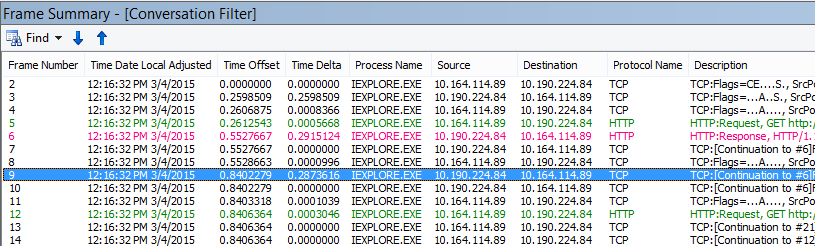

# Plan de résolution des problèmes de performances pour Office 365

Vous devez connaître les étapes à suivre pour identifier et corriger les retards, blocages et performances lentes entre SharePoint Online, OneDrive entreprise, Exchange Online ou Skype pour Business Online et votre ordinateur client ? Avant d’appeler prise en charge, cet article peut vous aider à résoudre les problèmes de performances d’Office 365 et même résoudre certains des problèmes plus courants.
  
Cet article est en fait un plan d’action exemple que vous pouvez utiliser pour capturer des données précieuses concernant votre problème de performances comme c’est le lieu. Certains principaux problèmes sont également inclus dans cet article.
    
Si vous connaissez les performances réseau et que vous souhaitez faire un plan à long terme pour surveiller les performances entre vos ordinateurs clients et d’Office 365, jetez un œil à [Office 365 performances réglage et résolution des problèmes - Admin et professionnels de l’informatique](performance-tuning-using-baselines-and-history.md).
  
## Plan d’action exemple performances Résolution des problèmes

Ce plan d’action contient deux parties ; une phase de préparation et une phase de journalisation. Si vous avez un problème de performances maintenant, et vous devez faire de collecte de données, vous pouvez démarrer immédiatement à l’aide de ce plan.
  
 **Préparer l’ordinateur client**
  
- Recherchez un ordinateur client qui peut reproduire le problème de performances. Cet ordinateur sera utilisé au cours de la résolution des problèmes.
    
- Notez les étapes qui provoquent se produire afin que vous êtes prêt, lorsqu’il est nécessaire pour tester le problème de performances.
    
- Installer les outils de collecte et d’enregistrement des informations :
    
  - Installez [Netmon 3.4](https://www.microsoft.com/en-us/download/details.aspx?id=4865) (ou utilisez un outil de suivi réseau équivalente). 
    
  - Installez l’édition de base libre de [HTTPWatch](https://www.httpwatch.com/download/) (ou utilisez un outil de suivi réseau équivalente). 
    
  - Utiliser un enregistrement de l’écran ou l’enregistreur étapes (PSR.exe) qui est fourni avec Windows Vista et versions ultérieures, afin de conserver un enregistrement des étapes à que suivre lors du test.
    
 **Ouvrez une session le problème de performances**
  
- Fermez tous les navigateurs Internet superflus.
    
- Démarrez l’enregistreur d’étapes, ou un autre enregistreur de l’écran.
    
- Démarrez votre capture Netmon (ou l’outil de suivi réseau).
    
- Désactivez le cache DNS sur l’ordinateur client à partir de la ligne de commande en tapant ipconfig /flushdns.
    
- Démarrer une nouvelle session de navigateur et activer HTTPWatch.
    
- Facultatif : Si vous testez Exchange Online, exécutez l’outil Analyseur de performances de Client Exchange à partir de la console d’administration Office 365.
    
- Reproduisez les étapes exactes qui provoquent le problème de performances.
    
- Arrêtez votre Netmon ou suivi de l’autre outil.
    
- Sur la ligne de commande, exécutez un itinéraire de suivi à votre abonnement Office 365 en tapant la commande suivante et appuyez sur ENTRÉE :
    
    `tracert \< *subscriptionname*  \>.onmicrosoft.com` 
    
- Arrêtez l’enregistreur étapes et enregistrer la vidéo. Veillez à inclure la date et l’heure de la capture et si elle montre les performances bon ou mauvais.
    
- Enregistrer les fichiers de suivi. Là encore, veillez à inclure la date et l’heure de la capture et si elle montre les performances bon ou mauvais.
    
Si vous n’êtes pas familiarisé avec les outils mentionnés dans cet article en cours d’exécution, ne vous inquiétez pas, car nous fournissons ces étapes suivant. Si vous êtes habitué à l’exécution de ce type de capture du réseau, vous pouvez ignorer [la collecte des planifications](performance-tuning-using-baselines-and-history.md#how-to-collect-baselines), qui décrit le filtrage et la lecture des fichiers journaux. 
  
## Vider le Cache DNS tout d’abord

Pourquoi ? À vider le cache DNS au départ, vos tests vierge. En désactivant le cache, vous réinitialisez le contenu de la résolution DNS pour les entrées des plus récentes. N’oubliez pas qu’un vidage ne supprime pas les entrées du fichier HOSTs. Si vous utilisez des entrées du fichier hôte largement, vous devez copier ces entrées dans un fichier dans un autre répertoire et puis vider le fichier hôte.
  
 **Vider le cache de résolution DNS**
  
1. Ouvrez l’invite de commandes (soit **Démarrer** \> **exécuter** \> **cmd** ou la **touche Windows** \> **cmd**).
    
2. Tapez la commande suivante et appuyez sur ENTRÉE :`ipconfig /flushdns`
    
## Netmon

Outil d’analyse réseau de Microsoft ([Netmon](https://www.microsoft.com/download/details.aspx?id=4865)) analyse les paquets, qui est le trafic, qui transmet entre les ordinateurs sur les réseaux. À l’aide de Netmon le trafic avec Office 365 vous pouvez capturer, afficher, de suivi et lire les en-têtes de paquet, identifier les périphériques intermédiaires, vérifiez les paramètres importants de matériel réseau, recherchez la perte de paquets et suivez le flux du trafic entre les ordinateurs de votre entreprise réseau et Office 365. Étant donné que le corps du trafic est chiffré, autrement dit, elle (est transmis sur le port 443 via le protocole SSL/TLS, vous ne pouvez pas lire les fichiers envoyés. Au lieu de cela, vous obtenez un suivi non filtré le chemin d’accès qui l’utilise des paquets qui peut vous aider à localiser le problème.
  
Assurez-vous que vous n’appliquez pas un filtre à ce stade. Au lieu de cela, exécutez les étapes et illustrer le problème avant d’arrêter le suivi et l’enregistrement.
  
Après avoir installé Netmon 3.4, ouvrez l’outil et effectuez les étapes suivantes :
  
 **Effectuer une trace Netmon et reproduire le problème**
  
1. Lancez Netmon 3.4.
    
    Il existe trois volets sur la page de **démarrage** : **Capture récents**, **Sélectionnez les réseaux**et la mise en route avec les Moniteur réseau Microsoft 3.4 **. Avis**. Le panneau de configuration de réseaux sélectionnez vous donne également une liste des réseaux par défaut à partir de laquelle vous pouvez capturer. N’oubliez pas que les cartes réseau sont sélectionnés ici.
    
2. Cliquez sur **Nouvelle Capture** en haut de la page de **démarrage** . Cette opération ajoute un nouvel onglet en regard de l’onglet page **Démarrer** appelé **Capture de 1**.
    
    
  
3. Pour effectuer une capture simple, cliquez sur **Démarrer** dans la barre d’outils. 
    
4. Reproduisez les étapes qui présentent un problème de performances.
    
5. Cliquez sur **Arrêter** \> **fichier** \> **Enregistrer en tant que**. N’oubliez pas de donner la date et l’heure avec le fuseau horaire et pour indiquer si elle montre incorrect ou bonnes performances.
    
## HTTPWatch

[HTTPWatch](https://www.httpwatch.com/download/) est chargée et une édition gratuite. L’édition de base libre couvre tout ce dont vous avez besoin pour ce test. HTTPWatch moniteurs de temps de chargement de page et le trafic réseau directement à partir de la fenêtre du navigateur. HTTPWatch est un plug-in Internet Explorer, qui décrit les performances sous forme graphique. L’analyse peut être enregistrée et affichée dans HTTPWatch Studio. 
  
> [!NOTE]
> Si vous utilisez un autre navigateur, comme Firefox, Google Chrome, ou si vous ne pouvez pas installer HTTPWatch dans Internet Explorer, ouvrez une nouvelle fenêtre de navigateur et appuyez sur la touche F12 de votre clavier. Vous devez voir l’outil de développement contextuel en bas de votre navigateur. Si vous utilisez Opera, appuyez sur CTRL + MAJ + I pour inspecteur Web, puis cliquez sur l’onglet **réseau** et effectuer les tests décrits ci-dessous. Les informations seront légèrement différentes, mais le temps de chargement seront affichera toujours en millisecondes. > HTTPWatch est également très utile pour les problèmes liés à SharePoint Online temps de chargement de page. 
  
 **Exécutez HTTPWatch et reproduire le problème**
  
1. HTTPWatch étant un plug-in de navigateur exposition de l’outil dans le navigateur est légèrement différent pour chaque version d’Internet Explorer. En règle générale, vous trouverez HTTPWatch sous la barre de commandes dans le navigateur Internet Explorer.  Si vous ne voyez pas le plug-in de HTTPWatch dans votre fenêtre de navigateur, vérifie la version de votre navigateur cliquez sur Aide \> sur, ou, dans les versions ultérieures d’Internet Explorer, cliquez sur le symbole d’engrenage et sur Internet Explorer. Pour lancer la barre de **commandes** , avec le bouton droit de la barre de menus dans Internet Explorer, cliquez sur **barre de commandes**. Dans le passé, HTTPWatch a été associé avec les commandes et les barres de l’Explorateur de solutions, ainsi qu’une seule fois vous installez, si vous ne voyez pas directement l’icône (même après le redémarrage) vérifier les **Outils**et vos barres d’outils de l’icône. N’oubliez pas que les barres d’outils peuvent être personnalisés et options peuvent être ajoutées. 
    
  
2. Lancez HTTPWatch dans une fenêtre de navigateur Internet Explorer. Il apparaîtra ancrée au navigateur en bas de cette fenêtre. Cliquez sur **Enregistrer**.
    
3. Reproduisez les étapes exactes requises pour le problème de performances. Cliquez sur le bouton **Arrêter** dans HTTPWatch. 
    
4. **Enregistrer** le HTTPWatch ou **Envoyer par courrier électronique**. N’oubliez pas de nom du fichier de sorte qu’il inclut les informations de date et heure et une indication de si votre contient une démonstration de performances bon ou mauvais.    
    Cette capture d’écran est à partir de la version professionnelle de HTTPWatch. Vous pouvez ouvrir les traces dans la Version de base sur un ordinateur avec une version professionnelle et lire. Informations supplémentaires soient disponibles à partir de la trace par le biais de cette méthode.
    
## Enregistreur d’actions

Enregistreur d’étapes ou PSR.exe, vous permet d’enregistrer les problèmes qu’ils sont produisent. Il s’agit d’un outil très utile et très simple à exécuter.
  
 **Exécutez l’enregistreur d’actions (PSR.exe) pour enregistrer votre travail**
  
1. Utilisez **Démarrer** \> **exécuter** \> tapez **PSR.exe** \> **OK**, ou cliquez sur la **Touche Windows** \> tapez **PSR.exe** \> , puis appuyez sur ENTRÉE. 
    
2. Lorsque la petite fenêtre PSR.exe s’affiche, cliquez sur **Démarrer l’enregistrement** et reproduire les étapes de reproduire le problème de performances. Vous pouvez ajouter des commentaires selon vos besoins, en cliquant sur **Ajouter des commentaires**.
    
3. Cliquez sur **Arrêter un enregistrement** lorsque vous avez terminé les étapes. Si le problème de performances est un rendu de page, attendez que la page à rendre avant d’arrêter l’enregistrement. 
    
4. Cliquez sur **Enregistrer**.
    

  
La date et l’heure sont consignées pour vous. Votre qui aux Netmon suivi et HTTPWatch dans le temps et sélectionnez facilite le dépannage de précision. La date et l’heure de l’enregistrement qui peuvent afficher les une minute transmis entre la connexion et la navigation de l’URL et le rendu partiel du site d’administration, par exemple.
  
## Lire votre traces

Il n’est pas possible d’apprendre tout ce que quelqu'un a besoin de connaître par le biais d’un article sur le réseau et la résolution des problèmes de performances. Obtention de bonnes performances prend, connaissances et une expérience du fonctionnement de votre réseau et effectue généralement. Mais il est possible d’arrondir à une liste des principaux problèmes et montrent comment outils peuvent rendre plus facile d’éliminer les problèmes les plus courants.
  
Si vous souhaitez identifier les compétences de lecture des traces de réseau pour vos sites Office 365, il n’existe aucune enseignant mieux que la création des traces de charges de page régulièrement et d’acquérir de l’expérience de lecture. Par exemple, lorsque vous avez la possibilité, chargez un service Office 365 et suivre le processus. Filtre le suivi pour le trafic DNS, ou rechercher le FrameData pour le nom du service recherché. Analyser le suivi pour avoir une idée des étapes qui se produisent lorsque le service de charge. Cela vous permettra de savoir quels normal chargement de la page doit se présenter comme, et dans le cas de résoudre les problèmes, en particulier autour de performances, comparaison des traces satisfaisant à insuffisant vous peut d’apprendre beaucoup.
  
Netmon utilise Microsoft Intellisense dans le champ de filtre d’affichage. IntelliSense, ou la fin du code intelligent, est pli où vous tapez dans une période et toutes les options disponibles sont affichées dans une zone de liste déroulante. Si, par exemple, vous êtes prêt mise à l’échelle de fenêtre TCP, vous pouvez trouver pratique pour un filtre (tel que `.protocol.tcp.window < 100`) par ce biais.
  

  
Analyses Netmon pouvant avoir beaucoup de trafic. Si vous n’êtes pas familiarisé avec les lire, il est susceptible de que vous sera dépassé l’ouverture de la trace de la première fois. La première chose à faire est de séparer le signal le bruit de fond dans la trace. Vous testée par rapport à Office 365, et qui est le trafic que vous souhaitez afficher. Si vous permettent de parcourir les suivis, vous devrez pas cette liste.
  
Le trafic entre vos clients et d’Office 365 est transmis via le protocole TLS, ce qui signifie que le corps du trafic sera chiffré et non lisible dans une trace Netmon générique. L’analyse des performances ne doit connaître les caractéristiques des informations dans le paquet. Toutefois, il est très intéressés par les en-têtes de paquet et les informations qu’ils contiennent.
  
 **Conseils pour obtenir un bon suivi**
  
- Connaître la valeur de l’adresse IPv4 ou IPv6 de votre ordinateur client. Vous pouvez obtenir cette depuis l’invite de commande en tapant **IPConfig** , puis appuyez sur ENTRÉE. Connaître cette adresse vous permet d’indiquer un coup de œil si le trafic dans la trace implique directement votre ordinateur client. S’il existe un proxy connu, il ping et obtenir son adresse IP. 
    
- Vider le cache de résolution DNS et, si possible, fermez tous les navigateurs à l’exception de celui dans lequel vous exécutez vos tests. Si vous n’êtes pas en mesure d’effectuer cette opération, par exemple, si la prise en charge à l’aide un outil basé sur un navigateur pour voir le bureau de votre ordinateur client, préparez-vous à filtrer votre trace.
    
- Dans une activité de suivi, recherchez le service Office 365 que vous utilisez. Si vous avez lu jamais ou rarement le trafic avant, il s’agit d’une étape utile pour séparer le problème de performances à partir d’autres bruit de réseau. Il existe plusieurs façons de le faire. Directement avant d’effectuer le test, vous pouvez utiliser ping ou PsPing, à l’URL du service spécifique ( `ping outlook.office365.com` et/ou `psping -4 microsoft-my.sharepoint.com:443`, pour obtenir des exemples). Vous trouverez également facilement ce PsPing dans une trace Netmon (par son nom de processus). Qui vous donne un point de départ de recherche.
    
    Si vous utilisez uniquement le suivi Netmon au moment du problème, qui est trop OK. Pour vous orienter, utiliser un filtre comme `ContainsBin(FrameData, ASCII, "office")` ou `ContainsBin(FrameData, ASCII, "outlook")`. Vous pouvez enregistrer votre numéro d’image à partir du fichier de suivi. Vous pouvez également faire défiler le volet Résumé du cadre vers la droite et recherchez la colonne ID de Conversation. Il existe un nombre y est indiqué pour l’ID de conversation spécifiques que vous pouvez également enregistrer et regardez isolément ultérieurement. N’oubliez pas de supprimer ce filtre avant de l’appliquer à n’importe quel autre filtrage.
    
> [!TIP]
> Netmon a un grand nombre de filtres intégrés utiles. Essayer le bouton « Load Filter » en haut du volet de filtre **d’affichage** . 
  

  

  
Familiarisez-vous avec le trafic et apprenez à localiser les informations dont vous avez besoin. Par exemple, comment déterminer les paquets dans la trace de la première référence au service Office 365 que vous utilisez (par exemple, « Outlook »).
    
Prise de Office 365 Outlook en ligne en guise d’exemple, le trafic commence semblable à ceci :
  
- Requête Standard DNS et réponse DNS pour outlook.office365.com avec mise en correspondance QueryIDs. Il est important de noter le décalage de temps pour cette bouclage, ainsi que where dans le monde Office 365 Global DNS envoie la demande de résolution de noms. Dans l’idéal, localement en tant que possible, plutôt que de moitié dans le monde entier. (Il peut être suivi par certaines la connexion en ligne le trafic DNS.)
    
- Un obtenir la demande HTTP dont le statut de signaler déplacé définitivement (301)
    
- Trafic RW notamment RW connecter des demandes et réponses de se connecter. (Il s’agit de Winsock distant d’une connexion pour vous.)
    
- Une conversation TCP SYN et SYN accusé. Un grand nombre des paramètres de cette conversation impact sur les performances.
    
- Puis une série de trafic TLS:TLS qui est où la négociation TLS et les conversations de certificat TLS ont lieu. (N’oubliez pas que les données sont chiffrées via le protocole SSL/TLS).
    
Tous les composants du trafic sont importantes et sont connectés, mais petites portions de la trace contiennent des informations particulièrement importantes en termes de résolution des problèmes de performances, afin que nous nous concentrerons sur ces domaines. En outre, étant donné que nous avons suffisamment performances Office 365 dépannage chez Microsoft pour compiler une liste de problèmes courants des dix, nous nous concentrerons sur ces problèmes et comment utiliser les outils que nous devons leur racine qui suit.
  
Si vous n’avez pas installé les tout prêt, le tableau ci-dessous permet d’utiliser plusieurs outils. Lorsque cela est possible. Liens vers les points d’installation sont fournis. La liste inclut les outils de suivi réseau courantes, telles que [Netmon](https://www.microsoft.com/en-us/download/details.aspx?id=4865) et [Wireshark](https://www.wireshark.org/), mais utilisez n’importe quel outil de traçage que vous êtes familiarisé avec, et dans lequel vous avez l’habitude de filtrage du trafic réseau. Lorsque que vous testez, n’oubliez pas :
  
-  *Fermez votre navigateur et tester avec uniquement un navigateur en cours d’exécution* , cela permet de réduire le trafic global vous capturez. Elle permet un suivi moins occupé. 
    
-  *Vider le cache de résolution DNS sur l’ordinateur client* - vous obtiendrez vierge lorsque vous commencez à effectuer votre capture, pour un suivi de tâche de nettoyage. 
    
## Certains principaux problèmes

Certains problèmes courants que vous pouvez rencontrer et comment les rechercher dans le suivi de votre réseau.

### TCP Windows mise à l’échelle

Trouvé dans le SYN - hérité SYN/accusé de réception. ou matériel d’ancienneté ne peut pas exploiter windows TCP mise à l’échelle.  Sans windows TCP appropriées les paramètres de mise à l’échelle, la mémoire tampon de 16 bits par défaut dans les en-têtes TCP remplit en millisecondes.  Le trafic ne peut pas continuer à envoyer jusqu'à ce que le client reçoit un accusé de réception que les données d’origine a été reçues, provoquer des retards.

#### Outils :

- Netmon
- Wireshark 

#### Ce que vous recherchez :

Recherchez le SYN - SYN/accusé de réception le trafic dans le suivi de votre réseau.  Dans Netmon, utilisez un filtre comme `tcp.flags.syn == 1`. Ce filtre est la même dans Wireshark.  

         
Notez que pour chaque SYN est un numéro de port (SrcPort) qui est mis en correspondance dans le port de destination (DstPort) de l’accusé de réception associée (SYN/accusé de réception). 

Pour afficher la valeur de la montée en charge de Windows qui est utilisée par la connexion au réseau, développez tout d’abord le SYN, puis le connexes SYN/accusé de réception.  

  

### Paramètres de délai d’inactivité TCP

Historiquement, la plupart des réseaux de périmètre sont configurés pour les connexions temporaires, ce qui signifie que des connexions inactives sont généralement terminées. Sessions TCP inactives peuvent être arrêtées par les serveurs proxy et les pare-feu plus de 100 à 300 secondes. Cela pose pour Outlook en ligne, car il crée et utilise les connexions à long terme, s’ils sont inactifs ou non.  

Lorsque les connexions sont interrompues par proxy ou pare-feu, le client n’est pas informé et essayez d’utiliser Outlook en ligne implique un ordinateur client essaie, à plusieurs reprises, récupérez la connexion avant d’en créer un nouveau. Vous pouvez voir se bloque dans le produit, les invites ou baisse des performances de chargement de la page.

#### Outils :

- Netmon
- Wireshark

#### Ce que vous recherchez :

Dans Netmon, examinez le champ décalage de temps pour un aller-retour. Un aller-retour est le temps écoulé entre le client envoie une demande au serveur et de recevoir une réponse au. Vérifier entre le Client et le point de sortie (par ex. Client--\> Proxy), ou le Client à Office 365 (Client--\> Office 365). Vous pouvez voir ce dans de nombreux types de paquets. 

Par exemple, le filtre Netmon peut se présenter comme `.Protocol.IPv4.Address == 10.102.14.112 AND .Protocol.IPv4.Address == 10.201.114.12`, ou Wireshark, `ip.addr == 10.102.14.112 &amp;&amp; ip.addr == 10.201.114.12`.  

> [!TIP]
> Ne pas savoir si l’adresse IP dans votre trace appartient à votre serveur DNS ? Essayez de rechercher dans la ligne de commande. Cliquez sur **Démarrer** \> **exécuter** \> et tapez **cmd**, ou appuyez sur la **Touche Windows** \> et tapez **cmd**. À l’invite, tapez `nslookup <the IP address from the network trace>`. Pour tester, utilisez nslookup par rapport à l’adresse IP de votre propre ordinateur. > Pour une liste des plages d’adresses IP de Microsoft, consultez [Office 365 URL et plages d’adresses IP](https://technet.microsoft.com/en-us/library/hh373144.aspx). 

Si un problème se pose, attendez décale heure long pour s’afficher dans ce cas (Outlook en ligne), en particulier dans les paquets TLS:TLS qui montrent le passage des données d’Application (par exemple, Netmon recherchez paquets de données d’application via `.Protocol.TLS AND Description == "TLS:TLS Rec Layer-1 SSL Application Data"`). Vous devez voir une progression dans le temps en toute transparence entre la session. Si vous voyez les délais lors de l’actualisation de votre calendrier Outlook, cela peut être dû à un niveau élevé de réinitialise envoyé. 

### Durée du voyage latence/Round 

Latence est une mesure qui peut changer beaucoup en fonction de nombreuses variables, ces appareils ancienneté de mise à niveau, ajout d’un grand nombre d’utilisateurs à un réseau et le pourcentage de bande passante totale consommée par d’autres tâches sur une connexion réseau. 

Calculateurs de bande passante pour Office 365 sont disponibles à partir de cette page [de planification du réseau et de réglage des performances pour Office 365](network-planning-and-performance.md) .  

Vous avez besoin pour mesurer la vitesse de votre connexion ou de la bande passante de la connexion de votre fournisseur de services Internet ? Essayez de ce site (ou les sites similaires) : [Site officiel de test de vitesse](https://www.speedtest.net/)et [Pingtest](http://www.pingtest.net/).

#### Outils :

- Ping
- PsPing
- Netmon
- Wireshark

#### Ce que vous recherchez :

Pour effectuer le suivi de la latence dans une trace, vous aurez ayant enregistré l’adresse IP client et l’adresse IP du serveur DNS dans Office 365. Il s’agit en vue de faciliter le filtrage. Si vous vous connectez via un proxy, vous devez adresse IP de votre ordinateur client, l’adresse IP/sortie proxy et l’adresse IP du serveur DNS Office 365, pour faciliter le travail.  

Une requête ping envoyée à outlook.office365.com indiquer le nom de la réception de la demande, le centre de données même si ping *peut* ne pas pouvoir se connecter pour envoyer la marque les paquets ICMP consécutives. Si vous utilisez PsPing (un outil gratuit en téléchargement) et spécifique au port (443) et éventuellement pour utiliser IPv4 (-4) vous obtiendrez un round-trip-temps moyen pour les paquets envoyés. Cela comme cela fonctionne pour les autres URL dans les services Office 365, `psping -4 yourSite.sharepoint.com:443`. En fait, vous pouvez spécifier un nombre de commandes ping pour obtenir un exemple plus complet pour votre moyenne, essayez semblable : `psping -4 -n 20 yourSite-my.sharepoint.com:443`.  

> [!NOTE]
> PsPing n’envoie pas les paquets ICMP. Il envoie une commande ping avec des paquets TCP sur un port spécifique, vous pouvez donc utiliser un que vous savez être ouvert. Dans Office 365, qui utilise SSL/TLS, essayez de joindre le port : 443 pour votre PsPing.

        

Si vous avez chargé la page Office 365 qui s’exécute lente tout en effectuant le suivi du réseau, vous devez filtrer une trace Netmon ou Wireshark pour `DNS`. Il s’agit d’une des adresses IP que nous recherchons.  

Voici la marche à suivre pour filtrer votre Netmon permettant d’obtenir l’adresse IP (et jetez un œil à la latence DNS). Cet exemple utilise outlook.office365.com, mais il peut également utiliser l’URL d’un client de SharePoint Online (hithere.sharepoint.com par exemple).  

1. Ping l’URL `ping outlook.office365.com` et, dans les résultats, enregistrez le nom et l’adresse IP du serveur DNS la requête ping a été envoyée à. 
2. Réseau ouvre la page, de suivi effectué l’action qui vous donne le problème de performances ou, si vous voyez une latence élevée sur la commande ping, lui-même, réseau remonter. 
3. Ouvrir la trace Netmon et filtre pour DNS (ce filtre fonctionne également dans Wireshark, mais est sensible à la casse `-- dns`). Étant donné que vous connaissez le nom du serveur DNS de votre commande ping vous pouvez également filtrer Netmon rapidement en plus semblable à celle-ci : `DNS AND ContainsBin(FrameData, ASCII, "namnorthwest")` , qui ressemble à ceci dans le système dns Wireshark et cadre contient « namnorthwest ». Ouvrez le paquet de réponse et, dans la fenêtre Détails de la trame de Netmon, cliquez sur DNS pour développer pour plus d’informations. Les informations DNS que vous trouverez à l’adresse IP du serveur DNS de que la demande est passée à dans Office 365 : vous devez cette adresse IP à l’étape suivante (l’outil PsPing). Supprimez le filtre, avec le bouton droit sur la réponse DNS dans le résumé du cadre de Netmon \> rechercher les Conversations \> DNS pour voir la requête DNS et réponse à côte. 
4. Dans Netmon, Notez également la colonne temps décalage entre la demande DNS et la réponse. Dans l’étape suivante, facile à installer et utiliser [PsPing](https://technet.microsoft.com/en-us/sysinternals/jj729731.aspx) outil est très pratique, car ICMP est souvent bloquée sur les pare-feu et car PsPing élégante effectue le suivi latence en millisecondes. PsPing termine une connexion TCP vers une adresse et le port (dans notre cas ouvrir le port 443). 
5. Installez PsPing. 
6. Ouvrez une invite de commandes (Démarrer \> exécuter \> tapez cmd ou clé Windows \> tapez cmd) et accédez au répertoire dans le répertoire où vous avez installé PsPing pour exécuter la commande PsPing. Dans mes exemples, vous pouvez voir que j’ai apportées à un dossier « Performance » à la racine de C. Vous pouvez effectuer la même pour un accès rapide. 
7. Tapez la commande afin que vous apportez votre PsPing par rapport à l’adresse IP du serveur Office 365 DNS de votre trace Netmon antérieur, n’oubliez pas d’ajouter le numéro de port.  En d’autres termes, `psping -n 20 132.245.24.82:445`. Cela vous donne un échantillon de 20 ping et la latence moyenne lorsque PsPing s’arrête. 

Si vous allez vers Office 365 via un serveur proxy, les étapes sont légèrement différentes. Vous le feriez pour votre serveur proxy pour obtenir une valeur de la latence moyenne en millisecondes, au proxy/sortant et le premier PsPing, puis exécutez PsPing sur le serveur proxy ou sur un ordinateur disposant d’une connexion Internet directe pour obtenir la valeur manquante (celui à Office 365 et inversement).  

Si vous choisissez d’exécuter PsPing à partir du proxy, vous aurez deux valeurs milliseconde : ordinateur Client pour le serveur proxy ou du point de sortie et serveur proxy vers Office 365. Et vous avez terminé ! Eh bien, quand même enregistrement, les valeurs.  

Si vous exécutez PsPing sur un autre ordinateur client qui a une connexion directe à Internet, autrement dit, sans proxy, vous aurez deux valeurs milliseconde : ordinateur Client pour le serveur proxy ou du point de sortie et ordinateur client pour Office 365. Soustraire dans ce cas, la valeur de l’ordinateur client au point de sortie ou de serveur proxy à partir de la valeur de l’ordinateur client pour Office 365, vous devez les numéros de durée aller-retour à partir de votre ordinateur client du point de sortie ou de serveur proxy, et proxy server ou la sortie points d’Office Ce 365. 

Toutefois, si vous pouvez trouver un ordinateur client à l’emplacement concerné est connecté directement ou contourne le proxy, vous pouvez choisir voir si le problème reproduit il pour commencer et tester à l’aide, par la suite. 

Latence, comme indiqué dans une trace Netmon, ces millisecondes supplémentaires peuvent ajouter, s’il y a assez d’eux dans une session.  

> [!NOTE]
> Votre adresse IP peut être différent de celui présenté ici, par exemple, que votre commande ping peut retourner semblable plus 157.56.0.0/16 ou une plage similaire adresses IP. Pour obtenir la liste des plages utilisées par Office 365, consultez la rubrique [Office 365 URL et plages d’adresses IP](https://technet.microsoft.com/en-us/library/hh373144.aspx). 

Pensez à développer tous les nœuds (il existe un bouton dans la partie supérieure de ce) si vous souhaitez rechercher, par exemple, 132.245.

### Authentification de proxy

Cela s’applique uniquement à vous si vous allez via un serveur proxy. Si ce n’est pas le cas, vous pouvez ignorer ces étapes. Lorsque vous travaillez correctement, l’authentification de proxy doit avoir lieu en millisecondes, toujours. Vous ne doivent pas voir intermittents des performances pendant les périodes de forte utilisation incorrecte (par exemple).  

Si l’authentification Proxy est activé, chaque fois que vous apportez une nouvelle connexion TCP vers Office 365 pour obtenir des informations, vous devez passer par un processus d’authentification en arrière-plan. Ainsi, par exemple, lors du passage du calendrier vers la messagerie dans Outlook en ligne, vous allez authentifier. Et dans SharePoint Online, si une page affiche le média ou des données à partir de plusieurs sites ou des sites, vous allez authentifier pour chaque connexion TCP différente est nécessaire pour restituer les données.  

Dans Outlook Online, vous pouvez rencontrer des temps de chargement lente chaque fois que vous basculez entre le calendrier et votre boîte aux lettres ou de chargement de la page lente dans SharePoint Online. Toutefois, il existe d’autres problèmes non répertoriés ici. 

L’authentification de proxy est un paramètre sur votre serveur proxy de sortie. Si elle est à l’origine d’un problème de performances avec Office 365, vous devez consulter votre équipe de mise en réseau.  

#### Outil : 

- Netmon
- Wireshark 

#### Ce que vous recherchez :

Authentification proxy intervient lorsqu’une nouvelle session TCP doit être utilisée, généralement pour demander des fichiers ou des informations à partir du serveur, ou pour fournir des informations. Par exemple, vous pouvez voir l’authentification de proxy autour des demandes HTTP GET ou HTTP POST. Si vous souhaitez voir les images où vous authentifiez les demandes dans votre trace, ajouter la colonne « Résumé NTLMSSP » Netmon et filtre des `.property.NTLMSSPSummary`. Pour déterminer la durée pendant laquelle l’authentification est en cours, ajoutez la colonne Delta de temps. 

Pour ajouter une colonne à Netmon : 
1. Avec le bouton droit sur une colonne de Description. 
2. Cliquez sur Choisir les colonnes. 
3. Recherchez NTLMSSP résumé et délai dans la liste et cliquez sur Ajouter. 
4. Déplacer les nouvelles colonnes en place avant ou derrière la colonne Description afin que vous pouvez lire côte à côte.
5. Cliquez sur OK. 

Même si vous n’ajoutez pas la colonne, le filtre Netmon fonctionnera. Mais la résolution des problèmes ne sera beaucoup plus facile si vous pouvez voir quel stade d’authentification que vous êtes en. 

Lorsque vous recherchez des instances de l’authentification de Proxy, veillez à étudier toutes les images où il y a l’authentification NTLM, ou un Message s’authentifier est présent. Si nécessaire, l’élément spécifique du trafic et rechercher les Conversations avec le bouton droit \> TCP. À l’esprit les valeurs de délai dans ces Conversations. 

        

Une seconde quatre délai dans l’authentification de proxy, comme indiqué dans Wireshark. La colonne **délai à partir de l’image affichée précédente** a été effectuée par le biais du champ du même nom dans les détails de cadre et en sélectionnant Ajouter en tant que colonne.          

### Performances de DNS

Fonctionnement de résolution de nom meilleures et plus rapidement quand elle a lieu comme près pays du client que possible. 

Si la résolution de nom DNS est en cours étranger, il peut ajouter des secondes à des charges de page. Idéalement, la résolution de noms se produit dans moins de 100 millisecondes. Si non, vous devez effectuer une recherche plus approfondie. 

> [!TIP]
> Ne savez pas comment fonctionne de connectivité des clients dans Office 365 ? Jetez un œil au document de référence de connectivité Client [ici](https://technet.microsoft.com/en-us/library/dn741250.aspx).           

#### Outils : 

- Netmon
- Wireshark
- PsPing

#### Ce que vous recherchez :
Analyse des performances DNS est généralement une autre tâche pour le suivi du réseau. Toutefois, PsPing est également utile de décision, ou l’extraction, une cause possible. 

Le trafic DNS est basé sur TCP et UDP demandes et réponses sont clairement marqués avec un ID qui vous aideront à correspondent à une demande spécifique avec sa réponse spécifique. Vous verrez DNS le trafic lorsque, par exemple, SharePoint Online utilise un nom de réseau ou une URL sur une page web. En règle générale, la plupart de ce trafic, à l’exception lors du transfert de Zones, s’exécute sur UDP. 

Dans Netmon et Wireshark, le filtre de base qui vous permettent d’examiner le trafic DNS est simplement `dns`. Veillez à utiliser des minuscules lorsque vous spécifiez le filtre. N’oubliez pas de vider le cache de résolution DNS avant de commencer à reproduire le problème sur votre ordinateur client. Par exemple, si vous avez un chargement de page SharePoint Online lent pour la page d’accueil, vous devez fermer tous les navigateurs, ouvrir une nouvelle fenêtre de navigateur, démarrer le suivi, vider le cache de résolution DNS et accédez à votre site SharePoint Online. Une fois que la page entière est résolu, vous arrêter et enregistrer le suivi.

Vous souhaitez consulter le temps de décalage ici. Et il peut être utile ajouter la colonne **Délai** à Netmon ce que vous pouvez faire en procédant comme suit : 
1. Avec le bouton droit sur une colonne de Description. 
2. Cliquez sur Choisir les colonnes. 
3. Recherchez le délai dans la liste, cliquez sur Ajouter. 
4. Déplacer la nouvelle colonne en place avant ou derrière la colonne Description afin que vous pouvez lire côte à côte.
5. Cliquez sur OK. 

Si vous trouvez une requête d’intérêt, envisagez l’isolation il en double-cliquant sur cette requête dans le volet de détails cadre, choix de **Rechercher les Conversations** \> **DNS**. Notez que le panneau de configuration réseau Conversations déviations de droite à la conversation spécifique dans le fichier journal du trafic UDP. 

        

Dans Wireshark, vous pouvez passer une colonne pour les enregistrements DNS. Effectuer votre suivi (ou ouvrez un suivi) dans Wireshark et filtrer par `dns`, ou plus lorsque, `dns.time`. Cliquez sur toutes les requêtes DNS et, dans le panneau de configuration affichant les détails, développez la `Domain Name System (response)` plus d’informations. Vous verrez un champ d’heure (par exemple, ` [Time: 0.001111100 seconds] `. Avec le bouton droit à ce stade, sélectionnez **appliquer en tant que colonne**. Vous obtiendrez une colonne de **temps** pour le tri plus rapide de votre trace. Cliquez sur la nouvelle colonne pour trier par ordre décroissant des valeurs pour voir quelles DNS appel a duré le plus longtemps pour résoudre les. 

[Une recherche sur SharePoint Online filtrée dans Wireshark par dns.time (en minuscules), avec l’heure des détails dans une colonne et triée par ordre croissant.](media/1439dcc2-12ff-4ee2-9ef3-1484cf79c384.PNG)

Si vous souhaitez effectuer une enquête plus le temps de résolution DNS, essayez une PsPing sur le port DNS utilisé par le protocole TCP (par exemple, `psping <IP address of DNS server>:53`). Vous voyez toujours un problème de performances ? Si vous procédez ainsi, le problème est plus susceptible d’être un réseau plus large problème à un problème de spécifiques à l’application DNS vous rencontrez pour faire de résolution. Il est également important de répéter, qu’une commande ping sur outlook.office365.com indique où résolution de noms DNS pour Outlook en ligne est en cours (par exemple, outlook-namnorthwest.office365.com).  Si le problème semble DNS spécifique, il peut être nécessaire de contacter votre service informatique d’examiner les configurations DNS et redirecteurs DNS à étudier ce problème. 

### Évolutivité du serveur proxy

Services tels que Outlook Online dans Office 365 accorder clients plusieurs connexions à long terme. Par conséquent, chaque utilisateur peut utiliser davantage de connexions qui requièrent une durée plus longue.  

> [!TIP]
> Vous devrez planifier l’utilisation de la bande passante, car vous êtes sur le point d’ajouter un lot d’utilisateurs à Office 365 ? Essayez de [planifier l’utilisation de la bande passante Internet pour Office 365](https://technet.microsoft.com/en-us/library/hh852542.aspx). Il calculateurs de bande passante y sont disponibles.

#### Outil :
 
Math  

#### Ce que vous recherchez : 

Aucune trace réseau ou un outil de dépannage n’est spécifique à celle-ci. Au lieu de cela, il est basé sur les calculs de bande passante donné limitations et autres variables.  

### Taille de Segment Max TCP

Trouvé dans le SYN - SYN/accusé de réception.  Effectuez cette vérification dans toute trace des performances réseau que vous avez prises pour s’assurer que les paquets TCP sont configurés pour effectuer la quantité maximale de données possibles. 

L’objectif est de voir un MSS de 1460octets pour la transmission de données. Si vous êtes derrière un serveur proxy ou si vous utilisez un NAT, pensez à exécuter ce test du client au proxy/sortie/NAT et de proxy/sortie/NAT vers Office 365 pour les meilleurs résultats ! Il s’agit des sessions TCP différentes.

#### Outil : 

Netmon

#### Ce que vous recherchez :

Taille de Segment Max TCP (MSS) est un autre paramètre de la négociation de trois facteurs dans votre trace réseau, ce qui signifie que vous trouverez les données que vous avez besoin dans le SYN - paquet SYN/accusé de réception. MSS est en fait assez simple de voir. 

Ouvrez toute trace des performances réseau vous avez et trouvez la connexion que vous êtes curieux de savoir ou qui illustre le problème de performances. 

> [!NOTE]
> Si vous examinez un suivi et vous devez trouver le trafic pertinents pour votre conversation, filtrer à l’adresse IP du Client ou l’adresse IP du serveur proxy ou du point de sortie ou les deux. Allez directement, vous devrez ping l’URL que vous testez pour l’adresse IP d’Office 365 dans le filtre et le suivi par celle-ci. 

Vous recherchez à l’occasion de suivi ? Essayez d’utiliser des filtres pour orienter. Dans Netmon, exécutez une recherche basée sur l’URL, tel que `Containsbin(framedata, ascii, "sphybridExample")`, notez le nombre d’images. 

Dans Wireshark utiliser quelque chose comme `frame contains "sphybridExample"`. Si vous constatez que vous avez trouvé le trafic distant Winsock (RW) (il peut apparaître comme un [PSH, accusé de réception] dans Wireshark), n’oubliez pas que RW se connecte est visible peu de temps avant la pertinent SYN - SYN/accusés de réception, comme décrit précédemment. 

À ce stade, vous pouvez enregistrer le nombre d’images, supprimer le filtre, cliquez sur tout le trafic dans la fenêtre de Conversations réseau dans Netmon d’examiner le plus proche SYN. 

En premier lieu, si vous n’avez pas reçu les informations d’adresse IP au moment de la trace, recherche votre URL dans le suivi (fait partie de `sphybridExample-my.sharepoint.com`, par exemple), vous obtiendrez des adresses IP pour filtrer par. 

Recherchez la connexion dans la trace que vous voulez voir. Pour cela, vous pouvez soit le suivi, analyse par filtrage par adresse IP, ou en sélectionnant des ID de Conversation spécifiques à l’aide de la fenêtre de conversation réseau dans Netmon. Une fois que vous avez trouvé le paquet SYN, développez TCP (dans Netmon) ou Transmission Control Protocol (dans Wireshark) dans le volet de détails de la trame. Développez MaxSegementSize et Options TCP. Recherchez le cadre de Syn_ack connexe et développez les Options TCP MaxSegmentSize. La plus petite des deux valeurs sera la taille maximale du Segment. Dans cette illustration, puis-je tirer parti de la colonne intégrée dans Netmon appelée TCP résoudre les problèmes.  

La colonne intégrée se trouve en haut du Panneau de **Détails de la trame** . (Pour revenir à l’affichage normal, cliquez sur colonnes à nouveau, puis choisissez le fuseau horaire.) 

           
Voici une trace filtrée dans Wireshark. Il existe un filtre spécifique à la valeur MSS ( `tcp.options.mss`). Les images de SYN, SYN/accusé de réception, de négociation d’accusé de réception sont liés au bas de la Wireshark équivalent à des détails de trame (donc encadrer 47 accusé de réception, des liens vers les SYN 46/accusé de réception, des liens vers les SYN 43) afin de faciliter ce type de travail. 

         
Si vous souhaitez vérifier l’accusé de réception sélectif (section suivante de cette matrice), ne fermez pas votre trace !

### Accusé de réception sélective

Trouvé dans le SYN - SYN/accusé de réception. doivent être déclarées autorisés dans SYN et SYN/accusé de réception. sélective d’accusé de réception (SACK) permet de retransmission simplifiée de données lorsqu’un paquet ou disparaissent des paquets. Périphériques peuvent désactiver cette fonctionnalité, qui peut entraîner des problèmes de performances. 

Si vous êtes derrière un serveur proxy ou si vous utilisez un NAT, pensez à exécuter ce test du client au proxy/sortie/NAT et de proxy/sortie/NAT vers Office 365 pour les meilleurs résultats ! Il s’agit des sessions TCP différentes.

#### Outil : 

Netmon 

#### Ce que vous recherchez :

Accusé de réception sélectif (SACK) est un autre paramètre de la négociation SYN/Syn_ack. Vous pouvez filtrer votre trace SYN - SYN/accusé de réception de différentes manières. 

Recherchez la connexion dans le suivi qui vous intéresse voir soit en analysant le suivi, le filtrage par adresse IP, ou en cliquant sur un ID de Conversation à l’aide de la fenêtre de conversation réseau dans Netmon. Une fois que vous avez trouvé le paquet SYN, développez TCP dans Netmon ou Transmission Control Protocol dans Wireshark dans la section Détails de la trame. Développez Options TCP et puis SACK. Recherchez l’image Syn_ack connexe et développez les Options TCP et son champ SACK. Assurez-vous que SACK est autorisé dans SYN et SYN/accusé de réception. Voici les valeurs SACK comme indiqué dans Netmon et Wireshark.

                     

### GÉOLOCALISATION DNS 

Où dans le monde Office 365 essaie de résoudre votre DNS appeler effets votre vitesse de connexion. 

Dans Outlook Online, après que la première recherche DNS est terminée, l’emplacement du DNS est utilisé pour se connecter à votre centre de données le plus proche. Vous serez connecté à un serveur d’autorités de certification en ligne Outlook, qui est utilisés pour se connecter au centre de données (dC) où vos données sont stockées par le réseau principal. Il est plus rapide.

Lorsque l’accès à SharePoint Online, un utilisateur en déplacement à l’étranger sont dirigés vers leurs centres de données active--qui est le contrôleur de domaine dont l’emplacement est basé sur leur client SPO de base d’accueil (ainsi, aux États-Unis d’Amérique, un contrôleur de domaine si l’utilisateur si basée sur les États-Unis).     Lync online possède des nœuds actifs dans plus d’un contrôleur de domaine à la fois. Lorsque les requêtes sont envoyées pour Lync online instances, Microsoft DNS déterminera dans le monde la demande de provenance et renvoyer des adresses IP du contrôleur de domaine régional le plus proche où Lync online est actif. 

> [!TIP]
> Besoin en savoir plus sur la façon dont les clients se connectent à Office 365 ? Jetez un œil à l’article de référence de [La connectivité des clients](https://technet.microsoft.com/en-us/library/dn741250.aspx) (et ses graphiques utiles).           
#### Outils :

- Ping
- PsPing

#### Ce que vous recherchez :

Demandes de résolution de noms de serveurs DNS du client pour les serveurs DNS de Microsoft doivent dans la plupart des résultats de cas dans DNS Microsoft retournant l’adresse IP d’un centre de données régional (dC). Que cela signifie pour vous ? Si votre sièges sociaux est à Bangalore, en Inde, mais que vous êtes en déplacement aux États-Unis, lorsque votre navigateur envoie une demande pour Outlook en ligne, les serveurs DNS de Microsoft doivent remettre vous des adresses IP aux centres de données aux États-Unis : un centre de données régional. Si la messagerie est nécessaire à partir d’Outlook, ces données seront se déplacent réseau principal rapide de Microsoft entre les centres de données.

DNS fonctionne plus rapide lors de la résolution de noms s’effectue comme proche de l’emplacement de l’utilisateur que possible. Si vous êtes en Europe, vous souhaitez accéder à un serveur DNS Microsoft en Europe, et gérer un centre de données en Europe (de préférence). Performances d’un client en Europe va DNS et un centre de données en Amérique du Nord sera plus lent.

Exécuter l’outil Ping sur outlook.office365.com pour déterminer où dans le monde votre requête DNS est en cours d’acheminement. Si vous êtes en Europe, vous devez voir une réponse semblable à outlook-emeawest.office365.com. En Amérique, attendez semblable outlook-namnorthwest.office365.com. 

Ouvrez l’invite de commandes sur l’ordinateur client (via Démarrer \> exécuter \> cmd ou la touche Windows \> tapez cmd). Tapez ping outlook.office365.com et appuyez sur ENTRÉE. N’oubliez pas, pour spécifier -4 Si vous souhaitez spécifier à la commande ping via IPv4. Pour obtenir une réponse à partir des paquets ICMP peuvent échouer, mais vous devriez voir le nom du système DNS vers lequel la demande a été routée. Si vous souhaitez afficher les numéros de latence pour cette connexion Essayez PsPing à l’adresse IP du serveur qui est renvoyé par la commande ping.  

           
           
### Dépannage d’Application Office 365

#### Outils : 

- Netmon
- HTTPWatch
- Console F12 dans le navigateur

Nous ne couvrent les outils utilisés dans la résolution des problèmes spécifiques à l’application dans cet article spécifiques du réseau. Vous trouverez des ressources, mais vous *pouvez* utiliser [cette page](https://support.office.com/en-us/article/Network-planning-and-performance-tuning-for-Office-365-e5f1228c-da3c-4654-bf16-d163daee8848).
   
## Voir aussi

[Gestion des points de terminaison Office 365](https://support.office.com/article/99cab9d4-ef59-4207-9f2b-3728eb46bf9a)
  
[Points de terminaison Office 365 FAQ](https://support.office.com/article/d4088321-1c89-4b96-9c99-54c75cae2e6d)
  

