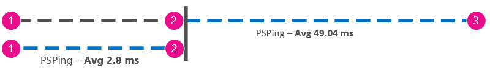

# Réglage des performances Office 365 à l’aide du planning de référence et de l’historique des performances

Il existe quelques méthodes simples pour vérifier les performances de la connexion entre Office 365 et de votre entreprise qui vous permettent d’établir une base approximative de la connectivité. Connaître l’historique des performances de votre client de connexions de l’ordinateur peut vous aider à détecter des problèmes nouveaux tôt, identifier et prévoir des problèmes.
  
Si vous n’êtes pas utilisé pour travailler sur les problèmes de performances, cet article est conçu pour vous aider à prendre en compte les questions courantes, telles que comment savoir si le problème que vous voyez est un problème de performances et non un incident de service Office 365 ? Comment pouvoir planifier pour de bonnes performances, à long terme ? Comment garder un œil sur les performances ? Si votre équipe ou les clients voient baisse des performances lors de l’utilisation d’Office 365, et que vous souhaitez sur une de ces questions, poursuivons.
  
> [!IMPORTANT]
> **D’avoir un problème de performances entre vos clients et d’Office 365 maintenant ?** Suivez les étapes décrites dans le [plan pour Office 365 dépannage des performances](performance-troubleshooting-plan.md). 
    
## Quelque chose que vous devez savoir sur les performances d’Office 365

Office 365 réside à l’intérieur d’un grande capacité Microsoft réseau dédié est régulièrement surveiller non seulement par automation, mais par des personnes réelles. Partie du rôle de gestion du nuage Office 365 est la construction d’optimisation des performances et rationalisation lorsqu’il est possible. Étant donné que les clients du nuage Office 365 se connecter via Internet, il existe un effort continu pour optimiser les performances entre les services Office 365 trop. Améliorations des performances jamais vraiment arrêter dans le nuage, et il y a beaucoup de l’expérience cumulée à la conservation du nuage sain et rapide. Si vous rencontrez un problème de performances de connexion à partir de votre emplacement à Office 365, il est préférable pas commence et attendre, une demande de Support. Au lieu de cela, vous devez commencer analyser le problème de « l’intérieur ». Autrement dit, commencez à l’intérieur du réseau et pratique vers Office 365. Avant d’ouvrir un cas avec prise en charge de Office 365, vous pouvez rassembler des données et effectuer des actions qui seront Explorer et peuvent résoudre votre problème.
  
> [!IMPORTANT]
> N’oubliez pas de planification de la capacité et les limites dans Office 365. Ces informations vous mettront avance lorsque vous tentez de résoudre un problème de performances. Voici un lien vers la [Description de Service de plateforme Office 365](https://technet.microsoft.com/en-us/library/office-365-service-descriptions.aspx). Il s’agit d’un concentrateur central et tous les services offertes par Office 365 ont un lien qui accède à leurs propres Descriptions de Service à partir d’ici. Cela signifie que, si vous souhaitez voir les limites standards de SharePoint Online, par exemple, vous souhaite cliquez sur [Description du Service SharePoint Online](https://technet.microsoft.com/en-us/library/sharepoint-online-service-description.aspx) , recherchez la [section limites de SharePoint Online](https://go.microsoft.com/fwlink/p/?LinkID=856113). 
  
Assurez-vous que vous accédez à la résolution des problèmes avec la présentation que les performances sont une échelle mobile, il n’est pas une valeur idéalisée et il maintenance définitivement (si vous pensez que c’est le cas, puis occasionnelles tâches large bande passante comme facilitant un grand nombre d’utilisateurs, ou effectuer des migrations d’importants volumes de données seront très stressantes--donc envisagez pour les impacts sur les performances puis). Vous pouvez et devez avoir une idée approximative de vos objectifs en termes de performances, mais un grand nombre de jeu de variables dans les performances, par conséquent, performances varie. C’est la nature des performances. 
  
Résolution des problèmes de performances n’est pas sur la satisfaction des objectifs spécifiques et gérer ces numéros indéfiniment, il s’agit sur l’amélioration des activités existantes, étant donné toutes les variables. 
  
## OK, un problème de performances à quoi ressemble ?

Tout d’abord, vous devez vous assurer que vous rencontrez est effectivement un problème de performances et non un incident de service. Un problème de performances diffère d’un incident de service dans Office 365. Voici comment procéder pour leur expliquer les uns des autres.
  
Si le service Office 365 rencontre des problèmes, qui est un incident de service. Vous verrez les icônes rouges ou jaunes sous **intégrité actuelle** dans le centre d’administration d’Office 365, vous pouvez également remarquer la baisse des performances sur les ordinateurs clients se connectant à Office 365. Par exemple, si une icône rouge des rapports intégrité actuelle et **Investigating** en regard d’Exchange, vous pouvez puis aussi recevoir un tas d’appels des utilisateurs se plaignent que les boîtes aux lettres de client qui utilisent Exchange Online sont mal effectue dans votre organisation. Dans ce cas, il est raisonnable de supposer que les performances d’Exchange Online est devenu simplement victimes des problèmes au sein du Service. 
  

  
À ce stade, l’administrateur Office 365, consultez **intégrité actuelle** et **historique et afficher les détails**, fréquemment, à la mise à jour de maintenance nous effectuer sur le système. Le tableau de bord **intégrité actuelle** a été effectuée pour vous mettre à jour sur les modifications et les problèmes dans le service. Les notes et les explications écrites à l’historique d’intégrité, d’administration à l’administrateur, existe-t-il pour vous aider à évaluer votre impact et d’assurer le publiés sur les travaux en cours. 
  

  
Un problème de performances n’est pas un incident de service, bien que les incidents peuvent affecter les performances. Un problème de performances ressemble à ceci :
  
- Un problème de performances se produit quel que soit ce qui signale le centre d’administration Office 365 **intégrité actuelle** pour le service. 
    
-  Un comportement utilisé pour être relativement transparent prend beaucoup de temps ou ne se termine jamais. 
    
- Vous pouvez répliquer le problème trop ou, au minimum, vous savez qu’il se produit si vous procédez ainsi la série d’étapes droite.
    
-  Si le problème est intermittent, il est toujours un modèle, par exemple, vous savez que vous ne disposez les appels des utilisateurs qui ne peuvent pas accéder de manière fiable Office 365 à 10:00:00, et que les appels seront matrice vers le bas autour de midi. 
    
Cela probablement familier ; peut-être trop familière. Une fois que vous connaissez il s’agit d’un problème de performances, devient la question, « Que faire ensuite ? » Le reste de cet article vous aide à déterminer exactement qui.
  
## Comment définir et tester le problème de performances

Problèmes de performances apparaissent souvent au fil du temps, il peut être difficile à définir le problème réel. Vous devez créer un problème bonne et une bonne idée de contexte du problème, vous devez les étapes de tests reproductibles pour gagner de la journée. Dans le cas contraire, aucune erreur de votre choix, par le biais de vous pouvez être perdues. Pourquoi ? Eh bien, voici quelques exemples d’instructions de problèmes qui ne fournissent pas suffisamment d’informations :
  
- Passage de ma boîte de réception à mon calendrier utilisé autre chose que je n’ont pas remarqué, et il est désormais un café-saut. Pourrez vous faire agir comme il est utilisé pour ?
    
- Téléchargement de mes fichiers dans SharePoint Online prend toujours. Pourquoi est-il lent dans le MIDI, mais tout autre moment, il est plus rapide ? Ne peut pas simplement être rapide ?
    
Il existe plusieurs défis grande induites par les instructions ci-dessus. En particulier, il y a beaucoup d’ambiguïtés à traiter. par exemple :
  
- Il est ambiguë comment passer de la boîte de réception et le calendrier utilisé pour agir sur l’ordinateur portable.
    
- Lorsque l’utilisateur indique, » ne peut pas il juste être rapide », ce qui est « rapide » ?
    
- Combien de temps est « illimitée » ? Le fait que plusieurs secondes ou minutes, ou l’utilisateur sont acheminés à déjeuner et il se terminerait les dix minutes après que l’utilisateur s’est ?
    
Cela est sans prendre en compte qu’admin et résolution des problèmes ne peut pas être conscient de nombreuses informations à partir de ces instructions. Par exemple, lorsque le problème démarré se produise ; Que les utilisateurs travaillent depuis leur domicile et que voit commutation lente sur un réseau domestique ; Que l’utilisateur doit exécuter plusieurs autres applications gourmandes en RAM sur le client local, ou l’utilisateur exécute un système d’exploitation plus ancien ou n’a pas exécuté les dernières mises à jour.
  
Lorsque des utilisateurs signalent un problème de performances, il y a beaucoup d’informations à collecter. Collecte de ces informations fait partie d’un processus appelé le problème de portée ou objet d’une recherche. Voici une liste étendue de base que vous pouvez utiliser pour recueillir des informations concernant votre problème de performances. Cette liste n’est pas exhaustive, mais il s’agit d’un point de départ de celle de votre choix : 
  
- À quelle date a-t-il le problème se produit et heure de la nuit et jour ?
    
- Le type de l’ordinateur client utilisaient et comment peut-il se connecter au réseau d’entreprise (VPN, câblé, sans fil) ?
    
- Vous travaillez à distance ou que vous étiez au bureau ?
    
- Essayer les mêmes actions sur un autre ordinateur et voir le même comportement ?
    
- Passez en revue les étapes qui vous offre le problème afin que vous puissiez écrire les actions vers le bas.
    
- Comment en quelques secondes ou minutes sont les performances ?
    
- Dans le monde vous emplacement ?
    
Certaines de ces questions ne sont plus évidents que d’autres. La plupart des tout le monde maîtriser qu'un utilitaire nécessite les étapes exactes à reproduire le problème. Après tout, comment pourrez vous notez quel est le problème et comment peut vous testez si le problème est résolu ? Moins évidentes sont des éléments tels que « que date et heure avez-vous voir le problème ? » et « Où dans le monde est situé ? », les informations qui peuvent être utilisées conjointement. En fonction de lorsque l’utilisateur a fonctionné, quelques heures de différence de temps peuvent signifier maintenance est déjà en cours sur les composants du réseau de votre société. Si, par exemple, votre société possède une implémentation hybride, comme une hybride SharePoint Search, qui permettent d’interroger des index de recherche dans SharePoint Online et un local SharePoint Server 2013 instance, mises à jour peuvent être en cours d’exécution dans la batterie de serveurs locale. Si votre société est dans le nuage, la maintenance du système peut inclure Ajout ou suppression de matériel réseau, déploiement de mises à jour de l’entreprise, ou en modifier DNS ou autres infrastructure principale.
  
Lorsque vous êtes à résoudre un problème de performances, il est un peu comme une scène délits, vous devez être précise et ponctuelle tirer les conclusions à partir de la preuve. Pour ce faire, vous devez obtenir une description du problème bonne en collectant des éléments de preuve. Il doit inclure le contexte de l’ordinateur, le contexte de l’utilisateur, lorsque le problème a commencé et les étapes qui exposés le problème de performances. Cette instruction problème doit être et rester, la page de premier plan dans vos notes. Vous prenez à travers la définition du problème à nouveau une fois que vous travaillez sur la résolution, les étapes pour tester et prouver si le problème sont résolu par les actions. Ceci est important de connaître lorsque, votre travail est terminé.
  
## Vous savez comment performances utilisé pour rechercher lorsqu’elle était bonne ?

Si vous êtes dans d’autres, personne ne sait. Personne n’avait numéros. Cela signifie que personne ne peut répondre à la question simple « sur le nombre de secondes a fait utilisée pour afficher une boîte de réception dans Office 365 ? » ou « combien de temps a fait utilisé à effectuer lors de la direction a rencontré une Lync Online réunion ? », qui est un scénario classique pour de nombreuses sociétés.
  
Qu’est manquant Voici les performances de base.
  
Planifications fournissent un contexte pour vos performances. Fréquemment, vous devez prendre occasionnellement à une ligne de base en fonction des besoins de votre société. Si vous êtes une grande entreprise, votre équipe peut prendre déjà planifiés pour votre environnement local. Par exemple, si vous correctif de tous les serveurs Exchange sur le premier lundi du mois et de tous vos serveurs SharePoint sur le troisième lundi, votre équipe est probablement une liste de tâches et scénarios de son exécution après mise à jour corrective, prouver que les fonctions critiques sont opérationnelles. Par exemple, l’ouverture de la boîte de réception, en cliquant sur Envoyer/recevoir et vous assurer que les dossiers de mettre à jour, ou, dans SharePoint, la page principale du site, entrer dans la page de recherche de contenu d’entreprise et en effectuant une recherche qui retourne des résultats.
  
Si vos applications sont dans Office 365, certaines configurations fondamentales que vous pouvez effectuer de mesurent le temps (en millisecondes) à partir d’un ordinateur client à l’intérieur de votre réseau, à un point de sortie, ou au point où vous conservez votre réseau et accédez à Office 365. Voici certaines des lignes de base utiles que vous pouvez examiner et l’enregistrement :
  
- Identifiez les périphériques entre votre ordinateur client et le point de sortie, par exemple, votre serveur proxy.
    
  - Vous devez connaître vos périphériques afin que vous puissiez contexte (adresses IP, type de périphérique, et cetera) pour des problèmes de performances survenant.
    
  - Les serveurs proxy sont des points de sortie courants, afin de pouvoir vérifier votre navigateur web pour voir quel serveur proxy elle est définie à utiliser, le cas échéant.
    
  - Il existe des outils tiers qui peuvent découvrir et à mapper votre réseau, mais la plus sûre à connaître vos périphériques consiste à demander à un membre de votre équipe de réseau.
    
- Identifier votre fournisseur de services Internet (fournisseur de services Internet), prenez note de leurs informations de contact et demandez combien circuits la bande passante que vous avez.
    
- À l’intérieur de votre société, identifier des ressources pour les périphériques entre votre client et le point de sortie, ou identifier une personne à contacter pour parler problèmes réseau.
    
Voici certaines planifications simples test avec les outils peuvent de calculer pour vous :
  
- Heure de l’ordinateur client à votre point de sortie, en millisecondes
    
- Heure à partir de votre point de sortie vers Office 365 en millisecondes
    
- Emplacement dans le monde du serveur qui associe les URL pour Office 365 lorsque vous naviguez
    
- La vitesse de résolution DNS de votre fournisseur de services Internet en millisecondes, des incohérences dans l’arrivée (gigue réseau), d’un paquet de téléchargement de temps en millisecondes
    
Si vous n’êtes pas familiarisé avec la réalisation de ces étapes, nous allons le voir plus en détail dans cet article. 
  
## Qu’est une ligne de base ?

Vous saurez que l’impact lorsqu’il accède incorrecte, mais si vous ne connaissez pas vos données de l’historique des performances, il n’est pas possible d’avoir un contexte de quel qu’il soit et quand. Afin de sans planification initiale, il vous manque l’indice clé pour résoudre le puzzle : l’image dans la boîte de puzzle. Dans la résolution des problèmes de performances, vous avez besoin d’un point de *comparaison* . Planifications de performance simple ne sont pas difficiles à effectuer. Votre équipe peut être chargé d’effectuer ces selon une planification. Par exemple, supposons que votre connexion se présente comme suit : 
  

  
Cela signifie que vous avez vérifié avec votre équipe réseau et découvert que vous conservez votre société pour Internet via un serveur proxy, et ce proxy gère toutes les demandes de que l’ordinateur client envoie vers le nuage. Dans ce cas, vous devez dessiner une version simplifiée de la connexion qui répertorie tous les périphériques intermédiaires. À présent, insérez les outils que vous pouvez utiliser pour tester les performances entre le client, le point de sortie (où vous conservez votre réseau pour Internet) et Office 365 en nuage.
  

  
Les options sont répertoriées sous **Simple** et **Avancé** en raison de la quantité d’expertise dont vous avez besoin afin de trouver les données de performances. Suivi du réseau peut prendre beaucoup de temps, par rapport à l’exécution des outils de ligne de commande comme PsPing et TraceTCP. Ces deux outils de ligne de commande ont été choisis, car ils n’utilisent pas les paquets ICMP, qui seront bloquées par Office 365, et le fait qu’ils fournissent la durée en millisecondes nécessaire pour laisser l’ordinateur client ou serveur proxy (si vous avez accès) et arrivent à Office 365. Chaque saut individuel d’un ordinateur à un autre se retrouvent avec une valeur d’heure et qui est idéal pour les planifications ! Comme important, ces outils de ligne de commande permettent d’ajouter un numéro de port sur la commande, il est utile, car Office 365 communique via le port 443, qui est le port utilisé par le protocole SSL (Secure Sockets Layer) et Transport Layer Security (SSL et TLS). Toutefois, les autres outils tiers peuvent être meilleures solutions pour votre situation. Microsoft ne prend en charge tous ces outils, donc si, pour une raison quelconque, vous ne pouvez pas obtenir PsPing et TraceTCP fonctionne, passez à une trace de réseau avec un outil tel que Netmon. 
  
Vous pouvez effectuer une planification avant les heures ouvrées à nouveau lors de l’utilisation intensive, puis à nouveau après les heures. Cela signifie que vous pouvez avoir une structure de dossier qui ressemble un peu à ceci à la fin :
  

  
Vous pouvez également sélectionner une convention d’affectation de noms vos fichiers. Voici quelques exemples :
  
- Feb_09_2015_9amPST_PerfBaseline_Netmon_ClientToEgress_Normal
    
- Jan_10_2015_3pmCST_PerfBaseline_PsPing_ClientToO365_bypassProxy_SLOW
    
- Feb_08_2015_2pmEST_PerfBaseline_BADPerf
    
- Feb_08_2015_8-30amEST_PerfBaseline_GoodPerf
    
Il existe beaucoup de différentes manières pour ce faire, mais en utilisant le format ** \<dateTime\>\<ce qui se passe dans le test\> ** est un bon point de départ. Être attentif à cela vous aidera beaucoup lorsque vous essayez de résoudre les problèmes plus tard. Ultérieurement, vous pourrez dire « j’ai deux suivis le 8 février, un a montré bonnes performances et l’autre a montré incorrecte, afin que nous pouvons comparer les ». Ceci est très utile pour résoudre les problèmes. 
  
Vous devez disposer d’une méthode organisée pour conserver vos données historiques de référence. Dans cet exemple, les méthodes simples produit trois sorties de ligne de commande et les résultats ont été recueillis en tant que les captures d’écran, mais vous pouvez être amené à la place les fichiers de capture de réseau. Utilisez la méthode qui vous convient le mieux. Stocker vos données historiques de référence et y faire référence à des points où vous notez les modifications dans le comportement des services en ligne. 
  
## Pourquoi collecter des données de performances au cours d’un projet pilote ?

Il n’existe aucun moment idéal pour commencer à apporter des planifications que pendant un test pilote du service Office 365. Votre entreprise peut avoir des milliers d’utilisateurs, des centaines de milliers, ou elle peuvent avoir cinq, mais même avec un petit nombre d’utilisateurs, vous pouvez effectuer des tests afin de mesurer les fluctuations dans les performances. Dans le cas d’une grande entreprise, un échantillon représentant de plusieurs centaines d’utilisateurs pilote d’Office 365 peut être projeté vers l’extérieur à plusieurs milliers afin de savoir où les problèmes susceptibles d’apparaître avant qu’ils se produisent.
  
Dans le cas d’une petite entreprise, où facilitant signifie que tous les utilisateurs accéder au service en même temps, et il n’existe aucun pilote, conserver des mesures de performances que vous avez des données à afficher à la personne ayant pour résoudre les problèmes d’une opération qui s’exécute mal. Par exemple, si vous constatez que tout à coup, vous pouvez parcourir autour de votre création dans le temps que nécessaire pour télécharger une image de taille moyenne où il permet de se produire très rapidement.
  
## Comment collecter des planifications

Vous devez identifier ces éléments au minimum pour tous les plans de résolution des problèmes :
  
- L’ordinateur client, vous utilisez (le type d’ordinateur ou périphérique, une adresse IP et les actions qui a provoqué le problème)
    
- Où se trouve l’ordinateur client dans le monde (par exemple, si cet utilisateur sur un réseau privé virtuel au réseau, travaillant à distance, ou sur l’intranet d’entreprise)
    
- Le point de sortie l’ordinateur client utilise à partir de votre réseau (le point auquel le trafic quitte votre entreprise pour un fournisseur de services Internet ou sur Internet)
    
 Vous trouverez la mise en page de votre réseau à partir de l’administrateur réseau. Si vous êtes sur un réseau de petite taille, jetez un œil aux périphériques de vous connecter à Internet et appelez votre fournisseur de services Internet si vous avez des questions sur la mise en page. Créer un graphique de la mise en page finale de référence. 
  
Cette section se compose de méthodes et des outils de ligne de commande simples et plusieurs outils options avancées. Nous allons couvrent des méthodes simples d’abord. Mais si vous avez maintenant un problème de performances, vous devez accéder à des méthodes avancées et essayer le plan d’action exemple résolution des problèmes de performances.
  
### Méthodes simples

L’objectif de ces méthodes simples est d’apprendre à effectuer, comprendre et stocker correctement les planifications de performance simple au fil du temps afin que vous informe sur les performances d’Office 365. Voici le diagramme simple pour simple, que vous avez consultées :
  

  
> [!NOTE]
> TraceTCP est inclus dans cette capture car il s’agit d’un outil utile pour l’affichage, en millisecondes, combien de temps une demande nécessaire pour les processus et combien de tronçons de réseau ou connexions à partir d’un ordinateur à l’autre, que la demande est nécessaire pour atteindre une destination. TraceTCP peut également affecter des noms des serveurs utilisés au cours de tronçons, qui peuvent être utiles pour une résolution des problèmes de Microsoft Office 365 prise en charge. > Commandes TraceTCP peuvent être très simples, par exemple : > `tracetcp.exe outlook.office365.com:443`> n’oubliez pas d’inclure le numéro de port dans la commande ! > [TraceTCP](http://simulatedsimian.github.io/tracetcp_download.html) est un téléchargement gratuit, mais s’appuie sur Wincap. Wincap est un outil qui est également utilisé et installé par Netmon. Nous utilisons également Netmon dans la section méthodes avancées. 
  
 Si vous avez plusieurs bureaux, vous devez conserver un ensemble de données à partir d’un client dans chacun de ces emplacements ainsi. Ce test mesures de latence, qui, dans ce cas, est une valeur numérique qui décrit la quantité de temps entre un client envoie une demande vers Office 365 et Office 365 répond à la demande. Les tests de provenant de l’intérieur de votre domaine sur un ordinateur client et de recherche pour mesurer les aller-retour à partir de votre réseau, out via un point de sortie, via Internet à Office 365 et de sauvegarde. 
  
Il existe quelques façons de gérer le point de sortie, dans ce cas, le serveur proxy. Vous pouvez soit suivi de 1 à 2 et puis 2 et 3 et puis ajoutez les numéros en millisecondes pour obtenir un total final et le bord de votre réseau. Ou bien, vous pouvez configurer la connexion pour contourner le serveur proxy pour les adresses d’Office 365. Dans un plus grand réseau avec un pare-feu, proxy inverse ou une combinaison des deux, vous devrez peut-être faire des exceptions sur le serveur proxy qui autorise le trafic à passer pour un grand nombre d’URL. Pour la liste des points de terminaison utilisés par Office 365, voir [Office 365 URL et plages d’adresses IP](https://support.office.com/article/8548a211-3fe7-47cb-abb1-355ea5aa88a2). Si vous disposez d’un proxy d’authentification, commencer par tester les exceptions pour les éléments suivants :
  
- Ports 80 et 443
    
- TCP et HTTPs
    
- Connexions sortantes vers une de ces URL :
    
- \*. microsoftonline.com
    
- \*.microsoftonline-p.com
    
- \*. sharepoint.com
    
- \*. outlook.com
    
- \*. lync.com
    
- osub.Microsoft.com
    
Tous les utilisateurs doivent être autorisés à accéder à ces adresses sans interférences proxy ni l’authentification. Sur un réseau plus petit, vous devez ajouter à votre proxy contournement de liste dans votre navigateur web. 
  
Pour les ajouter à votre liste de contournement proxy dans Internet Explorer, accédez à **Outils** \> **Options Internet** \> **connexions** \> **Paramètres LAN** \> **Avancé**. L’onglet Avancé est également où vous trouverez votre serveur proxy et le port du serveur proxy. Vous devrez peut-être cliquez sur la case à cocher **utiliser un serveur proxy pour votre réseau local**, pour accéder au bouton **Avancé** . Vous souhaiterez pour vous assurer que le **serveur proxy pour les adresses locales** est activée. Une fois que vous cliquez sur **Avancé**, vous verrez une zone de texte où vous pouvez entrer les exceptions. Séparez les URL générique susmentionnées par des points-virgules, par exemple :
  
\*. microsoftonline.com ; \*. sharepoint.com
  
Une fois que vous ignorez votre proxy, vous devez pouvoir utiliser ping ou PsPing directement sur une URL dans Office 365. L’étape suivante sera de test ping **outlook.office365.com**. Ou, si vous utilisez PsPing ou un autre outil qui vous permet de fournir un numéro de port à la commande, PsPing contre **portal.microsoftonline.com:443** pour afficher la durée moyenne des boucles en millisecondes. 
  
Le délai d’aller-retour, ou durée d’aller-retour, est une valeur numérique qui mesure la durée d’envoyer une demande HTTP à un serveur comme outlook.office365.com et obtenir une réponse en retour qui reconnaît que le serveur sait que vous l’avez fait. Vous voyez parfois cette abréviation durée aller-retour. Il doit s’agir d’un laps de temps relativement court.
  
Vous devez utiliser [PSPing](https://technet.microsoft.com/en-us/sysinternals/jj729731.aspx) ou un autre outil qui n’utilise pas de paquets ICMP qui sont bloquées par Office 365 pour effectuer ce test. 
  
 **Comment utiliser PsPing pour obtenir un ensemble aller-retour délai, en millisecondes, directement à partir d’une URL dans Office 365**
  
1. Exécutez une invite de commandes avec élévation de privilèges en procédant comme suit :
    
1. Cliquez sur  **Démarrer**.
    
2. Dans la zone **Rechercher** , tapez cmd, puis appuyez sur CTRL + MAJ + ENTRÉE.
    
3. Si la boîte de dialogue **Contrôle de compte d'utilisateur** apparaît, confirmez que l'action affichée est celle que vous souhaitez, puis cliquez sur **Continue**r.
    
2. Accédez au dossier où l’outil (dans ce cas PsPing) est installé et tester ces URL de 365 Office :
    
  - psping portal.office.com:443
    
  - microsoft psping-my.sharepoint.com:443
    
  - psping outlook.office365.com:443
    
  - psping www.yammer.com:443
    
    
  
Veillez à inclure le numéro de port 443. N’oubliez pas qu’Office 365 fonctionne sur un canal chiffré. Si vous PsPing sans le numéro de port, votre demande échoue. Une fois que vous avez ping votre liste restreinte, recherchez la durée moyenne en millisecondes (ms). C’est ce que vous souhaitez enregistrer !
  

  
Si vous n’êtes pas familiarisé avec contournement de proxy et préférez faire progresser pas à pas, vous devez tout d’abord connaître le nom de votre serveur proxy. Dans Internet Explorer, accédez à **Outils** \> **Options Internet** \> **connexions** \> **Paramètres LAN** \> **Avancé**. L’onglet **Avancé** est l’endroit où est répertorié à votre serveur proxy. Ping au serveur proxy à l’invite de commande en exécutant cette tâche : 
  
 **Ping sur le serveur proxy et obtenir la valeur aller-retour, en millisecondes, pour l’étape 1 et 2**
  
1. Exécutez une invite de commandes avec élévation de privilèges en procédant comme suit :
    
1. Cliquez sur  **Démarrer**.
    
2. Dans la zone **Rechercher** , tapez cmd, puis appuyez sur CTRL + MAJ + ENTRÉE.
    
3. Si la boîte de dialogue **Contrôle de compte d'utilisateur** apparaît, confirmez que l'action affichée est celle que vous souhaitez, puis cliquez sur **Continue**r.
    
2. Tapez ping \<le nom du serveur proxy utilisé par votre navigateur, ou l’adresse IP du serveur proxy\> , puis appuyez sur ENTRÉE. Si vous avez PsPing ou un autre outil, installé, vous pouvez choisir d’utiliser cet outil au lieu de cela. 
    
    Votre commande peut ressembler à un des exemples suivants : 
    
  - ping ourproxy.ourdomain.industry.business.com
    
  - ping 155.55.121.55
    
  - ping ourproxy
    
  - psping ourproxy.ourdomain.industry.business.com:80
    
  - psping 155.55.121.55:80
    
  - psping ourproxy:80
    
3. Lorsque le suivi s’arrête l’envoi des paquets de test, vous obtiendrez une petite synthèse qui répertorie une moyenne, en millisecondes, et qui est la valeur que vous recherchez. Prendre une capture d’écran de l’invite et enregistrez-le à l’aide de votre convention d’affectation de noms. À ce stade peut également contribuer à remplir dans le diagramme avec la valeur.
    
Peut-être que vous avez prises une trace du matin au plus tôt et votre client peut obtenir rapidement le proxy (ou tout serveur sortant quitte à Internet). Dans ce cas, vos numéros de peuvent ressembler à ceci :
  

  
Si l’ordinateur client est un des rares select avec un accès au serveur proxy (ou de sortie), vous pouvez exécuter le segment suivant du test en vous connectant à distance à cet ordinateur, l’invite de commandes en cours d’exécution à PsPing Office 365 URL à partir de là. Si vous n’avez pas accès à l’ordinateur, vous pouvez contacter vos ressources réseau pour une assistance avec le segment suivant et get exacte des numéros de cette façon. Si ce n’est pas possible, prendre un PsPing par rapport à Office 365 URL en question et comparer à l’heure PsPing ou Ping à votre serveur proxy. 
  
Par exemple, si vous avez 51.84 millisecondes à partir du client à l’URL dans Office 365, et vous avez 2,8 millisecondes à partir du client pour le proxy (ou un point de sortie), vous devez 49.04 millisecondes à partir de la sortie vers Office 365. De même, si vous avez un PsPing de 12.25 millisecondes à partir du client pour le serveur proxy lors de la hauteur de la journée et 62.01 millisecondes à partir du client à l’URL dans Office 365, votre valeur moyenne de la sortie de proxy pour les adresses URL dans Office 365 est 49.76 millisecondes.
  

  
En termes de résolution des problèmes, vous pouvez trouver quelque chose d’intéressant uniquement à partir de la conservation de ces configurations de référence. Par exemple, si vous constatez que vous avez généralement des 40 à 59 millisecondes le temps de latence à partir du proxy ou une sortie pointer vers l’URL dans Office 365 et ont un client proxy ou une sortie latence de point de 3 à 7 millisecondes (selon le réseau de la quantité de trafic vous êtes seein g pendant cette période de la journée) puis vous savez certainement quelque chose pose problème si votre client trois derniers sur celles-ci proxy ou la sortie indique une latence de 45 millisecondes.
  
### Méthodes avancées

Si vous souhaitez réellement savoir ce qui se passe avec vos demandes Internet vers Office 365, vous devez vous familiariser avec les suivis réseau. N’importe quels outils vous préférez pour ces traces, HTTPWatch, Netmon, l’Analyseur de Message, Wireshark, Fiddler, outil de tableau de bord du développeur ou n’importe quelle autre fera tant que cet outil peut capturer et filtrer le trafic réseau. Dans cette section, vous allez voir qu’il est utile d’exécuter plusieurs de ces outils pour obtenir une image plus complète du problème. Lorsque que vous testez, certains de ces outils également servent de proxies dans leur propre droit. Utilisé dans le Compagnon de cet article, le [plan pour Office 365 dépannage des performances](performance-troubleshooting-plan.md), citons [Netmon 3.4](https://www.microsoft.com/en-us/download/details.aspx?id=4865), [HTTPWatch](https://www.httpwatch.com/download/)ou [WireShark](https://www.wireshark.org/).
  
Une ligne de base des performances est la partie simple de cette méthode, et parmi les étapes sont les mêmes que lors de la résolution des problèmes de performances. Les méthodes avancées de création de configurations de référence pour les performances, vous devez prendre et stocker les suivis réseau. La plupart des exemples dans cet article utilisent SharePoint Online, mais vous devez développer une liste d’actions communes entre les services Office 365 auquel vous êtes abonné au test et à enregistrer. Voici un exemple de ligne de base :
  
- Liste de base pour SPO - ** étape 1 : ** parcourir la page d’accueil du site Web SPO et effectuer le suivi du réseau. Enregistrez le suivi. 
    
- Liste de base pour SPO - **étape 2 :** recherchez un terme (tel que le nom de la société) par le biais de la recherche d’entreprise et effectuer le suivi du réseau. Enregistrez le suivi. 
    
- Liste de base pour SPO - **étape 3 :** télécharger un fichier volumineux vers une bibliothèque de documents SharePoint Online et de faire le suivi du réseau. Enregistrez le suivi. 
    
- Liste de base pour SPO - **étape 4 :** parcourir la page d’accueil du site Web OneDrive et effectuer le suivi du réseau. Enregistrez le suivi. 
    
Cette liste doit inclure les actions courantes plus importantes que les utilisateurs effectuer par rapport à SharePoint Online. Notez que la dernière étape, de suivi sur le point d’OneDrive entreprise, versions d’une comparaison entre la charge de la page d’accueil SharePoint Online (ce qui est souvent personnalisée par des sociétés) et OneDrive de page d’accueil Business, qui est rarement personnalisé. Il s’agit d’un test de base très lorsqu’il s’agit d’un site SharePoint Online lenteur du chargement. Vous pouvez créer un enregistrement de cette différence dans vos tests.
  
Si vous êtes au milieu d’un problème de performances, la plupart des étapes sont les mêmes que lorsqu’une ligne de base. Suivis réseau deviennent critiques, afin que nous allons gérer *comment* pour prendre les suivis importantes. 
  
Pour faire face à un problème de performances, *maintenant* , vous devez effectuer un suivi au moment où que vous rencontrez le problème de performances. Vous devez avoir les outils appropriés disponibles pour collecter des journaux et vous avez besoin d’un plan d’action, c'est-à-dire, une liste de résolution des actions à entreprendre pour rassembler les informations de meilleures que vous pouvez utiliser. La première chose à faire est d’enregistrer la date et l’heure du test afin que les fichiers peuvent être enregistrés dans un dossier qui reflètent le minutage. Ensuite, limiter aux étapes problème eux-mêmes. Voici les étapes que vous allez utiliser pour le test. N’oubliez pas les principes de base : si le problème est uniquement avec Outlook, veillez à noter que le problème se produit dans Office 365 qu’un seul service. Limitation de l’étendue de ce problème vous aide à vous concentrer sur autre chose que vous pouvez résoudre. 
  
## Voir aussi

[Gestion des points de terminaison Office 365](https://support.office.com/article/99cab9d4-ef59-4207-9f2b-3728eb46bf9a)

