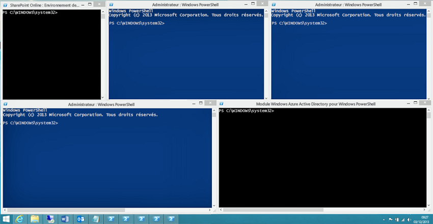

# <a name="connect-to-all-office-365-services-in-a-single-windows-powershell-window"></a><span data-ttu-id="8042d-103">Connexion à tous les services Office 365 à l’aide d’une seule fenêtre Windows PowerShell</span><span class="sxs-lookup"><span data-stu-id="8042d-103">Connect to all Office 365 services in a single Windows PowerShell window</span></span>

 <span data-ttu-id="8042d-104">**Résumé :** Au lieu de gérer différents services Office 365 dans des fenêtres de console PowerShell distinctes, vous pouvez vous connecter à tous les services Office 365 et les gérer à partir de la fenêtre de la console seule.</span><span class="sxs-lookup"><span data-stu-id="8042d-104">**Summary:** Instead of managing different Office 365 services in separate PowerShell console windows, you can connect to all Office 365 services and manage them from single console window.</span></span>
  
<span data-ttu-id="8042d-p101">Lorsque vous utilisez PowerShell pour gérer Office 365, il est possible d’avoir jusqu'à cinq sessions Windows PowerShell différentes en même temps correspondant au centre d’administration Office 365, SharePoint Online, Exchange Online, Skype pour professionnels en ligne et la sécurité &amp;Centre de conformité. Avec cinq méthodes de connexion différentes dans les sessions Windows PowerShell séparées, votre bureau se présenterait comme suit :</span><span class="sxs-lookup"><span data-stu-id="8042d-p101">When you use PowerShell to manage Office 365, it is possible to have up to five different Windows PowerShell sessions open at the same time corresponding to Office 365 admin center, SharePoint Online, Exchange Online, Skype for Business Online, and the Security &amp; Compliance Center. With five different connection methods in separate Windows PowerShell sessions, your desktop could look like this:</span></span>
  

  
<span data-ttu-id="8042d-p102">Ce n’est pas optimal pour la gestion d’Office 365, car vous ne pouvez pas échanger des données entre ces cinq fenêtres Gestion des services-entre. Cette rubrique décrit comment utiliser une seule instance de Windows PowerShell à partir de laquelle vous pouvez gérer la sécurité, Skype pour Business Online, Exchange Online, SharePoint Online et Office 365 &amp; centre de conformité.</span><span class="sxs-lookup"><span data-stu-id="8042d-p102">This is not optimal for managing Office 365 because you can't exchange data among those five windows for cross-service management. This topic describes how to use a single instance of Windows PowerShell from which you can manage Office 365, Skype for Business Online, Exchange Online, SharePoint Online, and the Security &amp; Compliance Center.</span></span>

## <a name="before-you-begin"></a><span data-ttu-id="8042d-110">Avant de commencer</span><span class="sxs-lookup"><span data-stu-id="8042d-110">Before you begin</span></span>
<span data-ttu-id="8042d-111"><a name="BeforeYouBegin"> </a></span><span class="sxs-lookup"><span data-stu-id="8042d-111"></span></span>

<span data-ttu-id="8042d-112">Avant de pouvoir gérer tous d’Office 365 à partir d’une seule instance de Windows PowerShell, prenez en compte les conditions préalables suivantes :</span><span class="sxs-lookup"><span data-stu-id="8042d-112">Before you can manage all of Office 365 from a single instance of Windows PowerShell, consider the following prerequisites:</span></span>
  
- <span data-ttu-id="8042d-p103">L’Office 365 fonctionne ou l’école de compte que vous l’utilisation de ces procédures doit pour être membre d’un rôle d’administrateur Office 365. Pour plus d’informations, consultez [rôles d’administrateur à propos d’Office 365](https://go.microsoft.com/fwlink/p/?LinkId=532367). Présente une condition requise pour Office 365 PowerShell, et pas nécessairement pour tous les autres services Office 365.</span><span class="sxs-lookup"><span data-stu-id="8042d-p103">The Office 365 work or school account that you use for these procedures needs to be a member of an Office 365 admin role. For more information, see [About Office 365 admin roles](https://go.microsoft.com/fwlink/p/?LinkId=532367). This a requirement for Office 365 PowerShell, not necessarily for all other Office 365 services.</span></span>
    
- <span data-ttu-id="8042d-116">Vous pouvez utiliser les versions 64 bits de Windows suivantes :</span><span class="sxs-lookup"><span data-stu-id="8042d-116">You can use the following 64-bit versions of Windows:</span></span>
    
  - <span data-ttu-id="8042d-117">Windows 10</span><span class="sxs-lookup"><span data-stu-id="8042d-117">Windows 10</span></span>
    
  - <span data-ttu-id="8042d-118">Windows 8.1 ou Windows 8</span><span class="sxs-lookup"><span data-stu-id="8042d-118">Windows 8.1 or Windows 8</span></span>
    
  - <span data-ttu-id="8042d-119">Windows Server 2016</span><span class="sxs-lookup"><span data-stu-id="8042d-119">Windows Server 2016</span></span>
    
  - <span data-ttu-id="8042d-120">Windows Server 2012 R2 ou Windows Server 2012</span><span class="sxs-lookup"><span data-stu-id="8042d-120">Windows Server 2012 R2 or Windows Server 2012</span></span>
    
  - <span data-ttu-id="8042d-121">Windows 7 Service Pack 1 (SP1)\*</span><span class="sxs-lookup"><span data-stu-id="8042d-121">Windows 7 Service Pack 1 (SP1)\*</span></span>
    
  - <span data-ttu-id="8042d-122">Windows Server 2008 R2 SP1\*</span><span class="sxs-lookup"><span data-stu-id="8042d-122">Windows Server 2008 R2 SP1\*</span></span>
    
    * <span data-ttu-id="8042d-p104">Vous devez installer le Microsoft.NET Framework 4.5. *x* et ensuite soit le Windows Management Framework 3.0 ou le de Windows Management Framework 4.0. Pour plus d’informations, consultez [installation du.NET Framework](https://go.microsoft.com/fwlink/p/?LinkId=257868) et de [Windows Management Framework 3.0](https://go.microsoft.com/fwlink/p/?LinkId=272757) ou [Windows Management Framework 4.0](https://go.microsoft.com/fwlink/p/?LinkId=391344).</span><span class="sxs-lookup"><span data-stu-id="8042d-p104">You need to install the Microsoft .NET Framework 4.5.*x* and then either the Windows Management Framework 3.0 or the Windows Management Framework 4.0. For more information, see [Installing the .NET Framework](https://go.microsoft.com/fwlink/p/?LinkId=257868) and [Windows Management Framework 3.0](https://go.microsoft.com/fwlink/p/?LinkId=272757) or [Windows Management Framework 4.0](https://go.microsoft.com/fwlink/p/?LinkId=391344).</span></span>
    
    <span data-ttu-id="8042d-125">Vous devez utiliser une version 64 bits de Windows en raison de la configuration requise pour le Skype pour module Business Online et d’un des modules Office 365.</span><span class="sxs-lookup"><span data-stu-id="8042d-125">You need to use a 64-bit version of Windows because of the requirements for the Skype for Business Online module and one of the Office 365 modules.</span></span>
    
- <span data-ttu-id="8042d-126">Vous devez installer les modules requis pour Office 365, SharePoint Online et Skype pour entreprise en ligne :</span><span class="sxs-lookup"><span data-stu-id="8042d-126">You need to install the modules that are required for Office 365, SharePoint Online, and Skype for Business Online:</span></span>
    
   - [<span data-ttu-id="8042d-127">Microsoft Online Service Assistant de connexion pour les professionnels de l’informatique RTW</span><span class="sxs-lookup"><span data-stu-id="8042d-127">Microsoft Online Service Sign-in Assistant for IT Professionals RTW</span></span>](https://go.microsoft.com/fwlink/p/?LinkId=286152)
   - <span data-ttu-id="8042d-128">Windows Azure Active Directory Module pour Windows PowerShell (version 64 bits) avec la commande **MSOnline du Module d’installation** à une invite de commandes avec élévation de privilèges PowerShell.</span><span class="sxs-lookup"><span data-stu-id="8042d-128">Windows Azure Active Directory Module for Windows PowerShell (64-bit version) with the **Install-Module MSOnline** command at an elevated PowerShell command prompt.</span></span>
   - [<span data-ttu-id="8042d-129">Shell de gestion en ligne de SharePoint</span><span class="sxs-lookup"><span data-stu-id="8042d-129">SharePoint Online Management Shell</span></span>](https://go.microsoft.com/fwlink/p/?LinkId=255251)
   - [<span data-ttu-id="8042d-130">Skype pour les entreprises en ligne, Module de Windows PowerShell</span><span class="sxs-lookup"><span data-stu-id="8042d-130">Skype for Business Online, Windows PowerShell Module</span></span>](https://go.microsoft.com/fwlink/p/?LinkId=532439)
    
-  <span data-ttu-id="8042d-p105">Windows PowerShell doit être configuré pour exécuter des scripts signés pour Skype pour Business Online, Exchange Online et de la sécurité &amp; centre de conformité. Pour ce faire, exécutez la commande suivante dans une session Windows PowerShell avec élévation de privilèges (une fenêtre Windows PowerShell que vous ouvrez en sélectionnant **Exécuter en tant qu’administrateur**).</span><span class="sxs-lookup"><span data-stu-id="8042d-p105">Windows PowerShell needs to be configured to run signed scripts for Skype for Business Online, Exchange Online, and the Security &amp; Compliance Center. To do this, run the following command in an elevated Windows PowerShell session (a Windows PowerShell window you open by selecting **Run as administrator**).</span></span>
    
  ```
  Set-ExecutionPolicy RemoteSigned
  ```

## <a name="connection-steps-when-using-a-password"></a><span data-ttu-id="8042d-133">Étapes de connexion lors de l’utilisation d’un mot de passe</span><span class="sxs-lookup"><span data-stu-id="8042d-133">Connection steps when using a password</span></span>
<span data-ttu-id="8042d-134"><a name="ConnStepsPassword"> </a></span><span class="sxs-lookup"><span data-stu-id="8042d-134"></span></span>

<span data-ttu-id="8042d-135">Voici la procédure pour se connecter à tous les services dans une seule fenêtre PowerShell.</span><span class="sxs-lookup"><span data-stu-id="8042d-135">Here are the steps to connect to all the services in a single PowerShell window.</span></span>
  
1. <span data-ttu-id="8042d-136">Ouvrez Windows PowerShell en tant qu’administrateur (utilisez **Exécuter en tant qu’administrateur**).</span><span class="sxs-lookup"><span data-stu-id="8042d-136">Open Windows PowerShell as an administrator (use **Run as administrator**).</span></span>
    
2. <span data-ttu-id="8042d-137">Exécutez cette commande et entrez votre travail d’Office 365 ou école d’informations d’identification du compte.</span><span class="sxs-lookup"><span data-stu-id="8042d-137">Run this command, and enter your Office 365 work or school account credentials.</span></span>
    
  ```
  $credential = Get-Credential
  ```

3. <span data-ttu-id="8042d-138">Exécutez ces commandes pour vous connecter à Office 365.</span><span class="sxs-lookup"><span data-stu-id="8042d-138">Run these commands to connect to Office 365.</span></span>
    
  ```
  Import-Module MsOnline
  Connect-MsolService -Credential $credential
  ```

4. <span data-ttu-id="8042d-p106">Exécutez ces commandes pour se connecter à SharePoint Online. Remplacer _ \<domainhost >_ avec la valeur réelle de votre domaine. Par exemple, pour `litwareinc.onmicrosoft.com`, la _ \<domainhost >_ valeur est `litwareinc`.</span><span class="sxs-lookup"><span data-stu-id="8042d-p106">Run these commands to connect to SharePoint Online. Replace  _\<domainhost>_ with the actual value for your domain. For example, for `litwareinc.onmicrosoft.com`, the  _\<domainhost>_ value is `litwareinc`.</span></span>
    
  ```
  Import-Module Microsoft.Online.SharePoint.PowerShell -DisableNameChecking
  Connect-SPOService -Url https://<domainhost>-admin.sharepoint.com -credential $credential
  ```

5. <span data-ttu-id="8042d-p107">Exécutez ces commandes pour se connecter sur Skype pour Business Online. Un avertissement sur l’augmentation de la `WSMan NetworkDelayms` valeur est attendue de la première fois que vous vous connectez et qui doit être ignoré.</span><span class="sxs-lookup"><span data-stu-id="8042d-p107">Run these commands to connect to Skype for Business Online. A warning about increasing the `WSMan NetworkDelayms` value is expected the first time you connect and should be ignored.</span></span>
    
  ```
  Import-Module SkypeOnlineConnector
  $sfboSession = New-CsOnlineSession -Credential $credential
  Import-PSSession $sfboSession
  ```

6. <span data-ttu-id="8042d-144">Exécutez ces commandes pour se connecter à Exchange Online.</span><span class="sxs-lookup"><span data-stu-id="8042d-144">Run these commands to connect to Exchange Online.</span></span>
    
  ```
  $exchangeSession = New-PSSession -ConfigurationName Microsoft.Exchange -ConnectionUri "https://outlook.office365.com/powershell-liveid/" -Credential $credential -Authentication "Basic" -AllowRedirection
  Import-PSSession $exchangeSession
  ```

7. <span data-ttu-id="8042d-145">Exécutez ces commandes pour vous connecter à la sécurité &amp; centre de conformité.</span><span class="sxs-lookup"><span data-stu-id="8042d-145">Run these commands to connect to the Security &amp; Compliance Center.</span></span>
    
  ```
  $SccSession = New-PSSession -ConfigurationName Microsoft.Exchange -ConnectionUri https://ps.compliance.protection.outlook.com/powershell-liveid/ -Credential $UserCredential -Authentication Basic -AllowRedirection
  Import-PSSession $SccSession
  ```

<span data-ttu-id="8042d-p108">Voici toutes les commandes dans un seul bloc. Spécifiez le nom de votre hôte de domaine et tous les exécuter à un moment donné.</span><span class="sxs-lookup"><span data-stu-id="8042d-p108">Here are all the commands in a single block. Specify the name of your domain host, and then run them all at one time.</span></span>
  
```
$domainHost="<domain host name, such as litware for litwareinc.onmicrosoft.com>"
$credential = Get-Credential
Import-Module MsOnline
Connect-MsolService -Credential $credential
Import-Module Microsoft.Online.SharePoint.PowerShell -DisableNameChecking
Connect-SPOService -Url https://$domainHost-admin.sharepoint.com -credential $credential
Import-Module SkypeOnlineConnector
$sfboSession = New-CsOnlineSession -Credential $credential
Import-PSSession $sfboSession
$exchangeSession = New-PSSession -ConfigurationName Microsoft.Exchange -ConnectionUri "https://outlook.office365.com/powershell-liveid/" -Credential $credential -Authentication "Basic" -AllowRedirection
Import-PSSession $exchangeSession
$SccSession = New-PSSession -ConfigurationName Microsoft.Exchange -ConnectionUri https://ps.compliance.protection.outlook.com/powershell-liveid/ -Credential $UserCredential -Authentication Basic -AllowRedirection
Import-PSSession $SccSession
```
<span data-ttu-id="8042d-148">Lorsque vous êtes prêt à fermer la fenêtre Windows PowerShell, exécutez cette commande pour supprimer les sessions actives à Skype pour Business Online, Exchange Online, SharePoint Online et la sécurité &amp; centre de conformité :</span><span class="sxs-lookup"><span data-stu-id="8042d-148">When you are ready to close down the Windows PowerShell window, run this command to remove the active sessions to Skype for Business Online, Exchange Online, SharePoint Online, and the Security &amp; Compliance Center:</span></span>
  
```
Remove-PSSession $sfboSession ; Remove-PSSession $exchangeSession ; Remove-PSSession $SccSession ; Disconnect-SPOService
```

## <a name="connection-steps-when-using-multi-factor-authentication"></a><span data-ttu-id="8042d-149">Étapes de connexion lorsque vous utilisez une authentification multifactorielle</span><span class="sxs-lookup"><span data-stu-id="8042d-149">Connection steps when using multi-factor authentication</span></span>
<span data-ttu-id="8042d-150"><a name="ConnStepsMFA"> </a></span><span class="sxs-lookup"><span data-stu-id="8042d-150"></span></span>

<span data-ttu-id="8042d-p109">Voici toutes les commandes dans un seul bloc pour se connecter à AD Azure, SharePoint Online et Skype pour la gestion à l’aide de l’authentification à facteurs multiples dans une seule fenêtre. Spécifiez le nom d’utilisateur principaux (UPN) d’un compte d’administrateur global et de votre nom d’hôte de domaine et tous les exécuter à un moment donné.</span><span class="sxs-lookup"><span data-stu-id="8042d-p109">Here are all the commands in a single block to connect to Azure AD, SharePoint Online, and Skype for Buiness using multi-factor authentication in a single window. Specify the user principal name (UPN) name of a global administrator account and your domain host name, and then run them all at one time.</span></span>

````
$acctName="<UPN of a global administrator account>"
$domainHost="<domain host name, such as litware for litwareinc.onmicrosoft.com>"
#Azure Active Directory
#If you are running Office 365 commands that contain "AzureAd" in their name, use this command:
Connect-AzureAD
#If you are running Office 365 commands that contain "Msol" in their name, comment the preceding command and un-comment the following command:
#Connect-MsolService
#SharePoint Online
Connect-SPOService -Url https://$domainHost-admin.sharepoint.com
#Skype for Business Online
$sfboSession = New-CsOnlineSession -UserName $acctName
Import-PSSession $sfboSession
````

<span data-ttu-id="8042d-153">Pour Exchange Online et de la sécurité &amp; centre de conformité, consultez les rubriques suivantes pour vous connecter à l’aide de l’authentification selon plusieurs facteur :</span><span class="sxs-lookup"><span data-stu-id="8042d-153">For Exchange Online and the Security &amp; Compliance Center, see the following topics to connect using multi-factor authentication:</span></span>

- <span data-ttu-id="8042d-154">[Se connecter à Exchange Online PowerShell à l’aide de l’authentification multifactorielle](https://docs.microsoft.com/powershell/exchange/exchange-online/connect-to-exchange-online-powershell/mfa-connect-to-exchange-online-powershell).</span><span class="sxs-lookup"><span data-stu-id="8042d-154">[Connect to Exchange Online PowerShell using multi-factor authentication](https://docs.microsoft.com/powershell/exchange/exchange-online/connect-to-exchange-online-powershell/mfa-connect-to-exchange-online-powershell).</span></span>
- [<span data-ttu-id="8042d-155">Se connecter à Office 365 sécurité & PowerShell de centre de conformité à l’aide de l’authentification multicritères</span><span class="sxs-lookup"><span data-stu-id="8042d-155">Connect to Office 365 Security & Compliance Center PowerShell using multi-factor authentication</span></span>](https://docs.microsoft.com/powershell/exchange/office-365-scc/connect-to-scc-powershell/mfa-connect-to-scc-powershell?view=exchange-ps)
 
<span data-ttu-id="8042d-156">Notez que, dans les deux cas, vous devez vous connecter à l’aide de sessions séparées du PowerShell de Module Exchange en ligne distant.</span><span class="sxs-lookup"><span data-stu-id="8042d-156">Note that in both cases, you must connect using separate sessions of the Exchange Online Remote PowerShell Module.</span></span>


## <a name="new-to-office-365"></a><span data-ttu-id="8042d-157">Vous débutez avec Office 365 ?</span><span class="sxs-lookup"><span data-stu-id="8042d-157">New to Office 365?</span></span>

[!INCLUDE [LinkedIn Learning Info](../common/office/linkedin-learning-info.md)]

## <a name="see-also"></a><span data-ttu-id="8042d-158">Voir aussi</span><span class="sxs-lookup"><span data-stu-id="8042d-158">See also</span></span>

- [<span data-ttu-id="8042d-159">Gérer Office 365 avec Office 365 PowerShell</span><span class="sxs-lookup"><span data-stu-id="8042d-159">Manage Office 365 with Office 365 PowerShell</span></span>](manage-office-365-with-office-365-powershell.md)
- [<span data-ttu-id="8042d-160">Mise en route d'Office 365 Powershell</span><span class="sxs-lookup"><span data-stu-id="8042d-160">Getting started with Office 365 PowerShell</span></span>](getting-started-with-office-365-powershell.md)
- [<span data-ttu-id="8042d-161">Gestion de SharePoint Online avec Office 365 PowerShell</span><span class="sxs-lookup"><span data-stu-id="8042d-161">Manage SharePoint Online with Office 365 PowerShell</span></span>](manage-sharepoint-online-with-office-365-powershell.md)
- [<span data-ttu-id="8042d-162">Gérer les comptes d'utilisateurs et les licences avec Office 365 PowerShell</span><span class="sxs-lookup"><span data-stu-id="8042d-162">Manage user accounts and licenses with Office 365 PowerShell</span></span>](manage-user-accounts-and-licenses-with-office-365-powershell.md)
- [<span data-ttu-id="8042d-163">Utilisez Windows PowerShell pour créer des rapports dans Office 365</span><span class="sxs-lookup"><span data-stu-id="8042d-163">Use Windows PowerShell to create reports in Office 365</span></span>](use-windows-powershell-to-create-reports-in-office-365.md)
