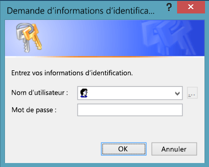
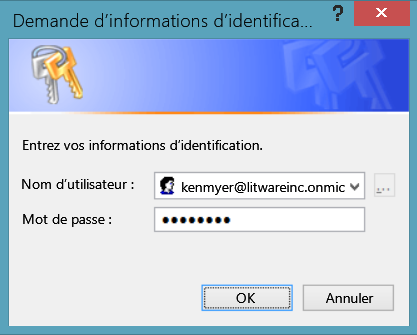
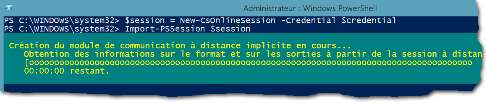
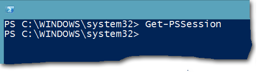

# <a name="connect-to-all-office-365-services-in-a-single-windows-powershell-window"></a>Connexion à tous les services Office 365 à l’aide d’une seule fenêtre Windows PowerShell

 **Résumé :** Au lieu de gérer différents services Office 365 dans des fenêtres de console PowerShell distinctes, vous pouvez vous connecter à tous les services Office 365 et les gérer à partir de la fenêtre de la console seule.
  
Lorsque vous utilisez PowerShell pour gérer Office 365, il est possible d’avoir jusqu'à cinq sessions Windows PowerShell différentes en même temps correspondant au centre d’administration Office 365, SharePoint Online, Exchange Online, Skype pour professionnels en ligne et la sécurité &amp;Centre de conformité. Avec cinq méthodes de connexion différentes dans les sessions Windows PowerShell séparées, votre bureau se présenterait comme suit :
  

  
Ce n’est pas optimal pour la gestion d’Office 365, car vous ne pouvez pas échanger des données entre ces cinq fenêtres Gestion des services-entre. Cette rubrique décrit comment utiliser une seule instance de Windows PowerShell à partir de laquelle vous pouvez gérer la sécurité, Skype pour Business Online, Exchange Online, SharePoint Online et Office 365 &amp; centre de conformité.
  
## <a name="before-you-begin"></a>Avant de commencer
<a name="BeforeYouBegin"> </a>

Avant de pouvoir gérer tous d’Office 365 à partir d’une seule instance de Windows PowerShell, prenez en compte les conditions préalables suivantes :
  
- L’Office 365 fonctionne ou l’école de compte que vous l’utilisation de ces procédures doit pour être membre d’un rôle d’administrateur Office 365. Pour plus d’informations, consultez [rôles d’administrateur à propos d’Office 365](https://go.microsoft.com/fwlink/p/?LinkId=532367). Présente une condition requise pour Office 365 PowerShell, et pas nécessairement pour tous les autres services Office 365.
    
- Vous pouvez utiliser les versions 64 bits de Windows suivantes :
    
  - Windows 10
    
  - Windows 8.1 ou Windows 8
    
  - Windows Server 2016
    
  - Windows Server 2012 R2 ou Windows Server 2012
    
  - Windows 7 Service Pack 1 (SP1)*
    
  - Windows Server 2008 R2 SP1*
    
    * Vous devez installer le Microsoft.NET Framework 4.5. _x_ et ensuite soit le Windows Management Framework 3.0 ou le de Windows Management Framework 4.0. Pour plus d’informations, consultez [installation du.NET Framework](https://go.microsoft.com/fwlink/p/?LinkId=257868) et de [Windows Management Framework 3.0](https://go.microsoft.com/fwlink/p/?LinkId=272757) ou [Windows Management Framework 4.0](https://go.microsoft.com/fwlink/p/?LinkId=391344).
    
    Vous devez utiliser une version 64 bits de Windows en raison de la configuration requise pour le Skype pour module Business Online et d’un des modules Office 365.
    
- Vous devez installer les modules requis pour Office 365, SharePoint Online et Skype pour entreprise en ligne :
    
  - [Microsoft Online Service Assistant de connexion pour les professionnels de l’informatique RTW](https://go.microsoft.com/fwlink/p/?LinkId=286152)
    
  - [Windows Azure Active Directory Module pour Windows PowerShell (version 64 bits)](https://go.microsoft.com/fwlink/p/?linkid=236297)
    
  - [Shell de gestion en ligne de SharePoint](https://go.microsoft.com/fwlink/p/?LinkId=255251)
    
  - [Skype pour les entreprises en ligne, Module de Windows PowerShell](https://go.microsoft.com/fwlink/p/?LinkId=532439)
    
-  Windows PowerShell doit être configuré pour exécuter des scripts signés pour Skype pour Business Online, Exchange Online et de la sécurité &amp; centre de conformité. Pour ce faire, exécutez la commande suivante dans une session Windows PowerShell avec élévation de privilèges (une fenêtre Windows PowerShell que vous ouvrez en sélectionnant **Exécuter en tant qu’administrateur**).
    
  ```
  Set-ExecutionPolicy RemoteSigned
  ```

## <a name="the-short-version-instructions-without-explanations"></a>La version courte (instructions sans explications)
<a name="ShortVersion"> </a>

Cette section présente les étapes de connexion sans explications détaillées. Si vous avez des questions ou que vous souhaitez plus d’informations, vous pouvez lire le reste de la rubrique. Les numéros d’étape utilisés ici sont les mêmes que ceux des sections consacrées à chaque étape dans le reste de la rubrique :
  
1. Ouvrez Windows PowerShell en tant qu’administrateur (utilisez **Exécuter en tant qu’administrateur**).
    
2. Exécutez cette commande et entrez votre travail d’Office 365 ou école d’informations d’identification du compte.
    
  ```
  $credential = Get-Credential
  ```

3. Exécutez ces commandes pour vous connecter à Office 365.
    
  ```
  Import-Module MsOnline
  Connect-MsolService -Credential $credential
  ```

4. Exécutez ces commandes pour se connecter à SharePoint Online. Remplacer _ \<domainhost >_ avec la valeur réelle de votre domaine. Par exemple, pour `litwareinc.onmicrosoft.com`, la _ \<domainhost >_ valeur est `litwareinc`.
    
  ```
  Import-Module Microsoft.Online.SharePoint.PowerShell -DisableNameChecking
  Connect-SPOService -Url https://<domainhost>-admin.sharepoint.com -credential $credential
  ```

5. Exécutez ces commandes pour se connecter sur Skype pour Business Online. Un avertissement sur l’augmentation de la `WSMan NetworkDelayms` valeur est attendue de la première fois que vous vous connectez et qui doit être ignoré.
    
  ```
  Import-Module SkypeOnlineConnector
  $sfboSession = New-CsOnlineSession -Credential $credential
  Import-PSSession $sfboSession
  ```

6. Exécutez ces commandes pour se connecter à Exchange Online.
    
  ```
  $exchangeSession = New-PSSession -ConfigurationName Microsoft.Exchange -ConnectionUri "https://outlook.office365.com/powershell-liveid/" -Credential $credential -Authentication "Basic" -AllowRedirection
  Import-PSSession $exchangeSession -DisableNameChecking
  ```

7. Exécutez ces commandes pour vous connecter à la sécurité &amp; centre de conformité.
    
  ```
  $ccSession = New-PSSession -ConfigurationName Microsoft.Exchange -ConnectionUri https://ps.compliance.protection.outlook.com/powershell-liveid/ -Credential $credential -Authentication Basic -AllowRedirection
  Import-PSSession $ccSession -Prefix cc
  ```
> [!NOTE]
> Le préfixe de texte « cc » est ajouté à *tous les* sécurité &amp; noms d’applet de commande de centre de conformité afin de pouvoir exécuter applets de commande qui existent dans Exchange Online et de la sécurité &amp; centre de conformité dans la même session Windows PowerShell. Par exemple, **Get-RoleGroup** devient **Get-ccRoleGroup** dans la sécurité &amp; centre de conformité.
  
Voici toutes les commandes dans un seul bloc. Spécifiez le nom de votre hôte de domaine et tous les exécuter à un moment donné.
  
```
$domainHost="<domain host name, such as litware for litwareinc.onmicrosoft.com>"
$credential = Get-Credential
Import-Module MsOnline
Connect-MsolService -Credential $credential
Import-Module Microsoft.Online.SharePoint.PowerShell -DisableNameChecking
Connect-SPOService -Url https://$domainHost-admin.sharepoint.com -credential $credential
Import-Module SkypeOnlineConnector
$sfboSession = New-CsOnlineSession -Credential $credential
Import-PSSession $sfboSession
$exchangeSession = New-PSSession -ConfigurationName Microsoft.Exchange -ConnectionUri "https://outlook.office365.com/powershell-liveid/" -Credential $credential -Authentication "Basic" -AllowRedirection
Import-PSSession $exchangeSession -DisableNameChecking
$ccSession = New-PSSession -ConfigurationName Microsoft.Exchange -ConnectionUri https://ps.compliance.protection.outlook.com/powershell-liveid/ -Credential $credential -Authentication Basic -AllowRedirection
Import-PSSession $ccSession -Prefix cc
```

Lorsque vous êtes prêt à fermer la fenêtre Windows PowerShell, exécutez cette commande pour supprimer les sessions actives à Skype pour Business Online, Exchange Online, SharePoint Online et la sécurité &amp; centre de conformité :
  
```
Remove-PSSession $sfboSession ; Remove-PSSession $exchangeSession ; Remove-PSSession $ccSession ; Disconnect-SPOService
```

## <a name="the-long-version-instructions-with-detailed-explanations"></a>La version longue (instructions avec des explications détaillées)
<a name="LongVersion"> </a>

### <a name="step-1-open-windows-powershell-as-an-administrator"></a>Étapes 1 : ouvrez Windows PowerShell en tant qu’administrateur
<a name="Step1"> </a>

Si vous exécutez Windows 10, Windows 8, Windows 8.1, 2016 de serveur Windows, Windows Server 2012 R2 ou Windows Server 2012 R2, procédez comme suit :
  
1. Pour trouver le raccourci de **Windows PowerShell**, utilisez une de ces méthodes :
    
  - Sur l’écran de démarrage, cliquez sur une zone vide et tapez Windows PowerShell.
    
  - Sur le bureau ou l’écran de démarrage, appuyez sur la touche Windows + touche Q. Dans l’icône de recherche, tapez Windows PowerShell.
    
  - Sur le bureau ou l’écran de démarrage, déplacez votre curseur dans le coin supérieur droit, ou faites défiler le bord droit de l’écran pour afficher les icônes de gauche. Cliquez sur l’icône de recherche et entrez de Windows PowerShell.
    
2. Dans les résultats, cliquez sur **Windows PowerShell**, puis sélectionnez **Exécuter en tant qu’administrateur**.
    
3. Si la boîte de dialogue **Contrôle de compte d’utilisateur** s’affiche, sélectionnez **Oui** pour vérifier que vous souhaitez exécuter Windows PowerShell sous les informations d’identification de l’administrateur.
    
Si vous exécutez Windows 7 SP1 (ou Windows Server 2008 R2 SP1), procédez comme suit :
  
1. Dans le menu **Démarrer** , sélectionnez **Tous les programmes** > **Accessoires** > **De Windows PowerShell**. Avec le bouton droit de **Windows PowerShell**, puis sélectionnez **Exécuter en tant qu’administrateur**.
    
2. Si la boîte de dialogue **Contrôle de compte d’utilisateur** s’affiche, sélectionnez **Oui** pour vérifier que vous souhaitez exécuter Windows PowerShell sous les informations d’identification de l’administrateur.
    
Vous devez exécuter Windows PowerShell en tant qu’administrateur. Si vous ne le faites pas, vous allez obtenir un message d’erreur similaire à celui-ci lorsque vous essayez d’importer un des modules requis.
  
```
The specified module 'Microsoft.Online.SharePoint.Online.PowerShell' was not loaded because no valid module file was found in any directory.
```

Pour remédier à la situation, la seule consiste à fermer Windows PowerShell et redémarrez-le en tant qu’administrateur. Voici un moyen rapide et simple pour savoir si vous exécutez Windows PowerShell en tant qu’administrateur : l’invite est `PS C:\Windows\System32>`, et non pas `PS C:\Users\YourUserName>`.

  
### <a name="step-2-create-a-windows-powershell-credentials-object"></a>Étape 2 : créez un objet d’informations d’identification Windows PowerShell.
<a name="Step2"> </a>

L’objet d’informations d’identification offre un moyen crypté pour transmettre votre nom d’utilisateur et le mot de passe pour Windows PowerShell. Pour créer un objet d’informations d’identification, exécutez la commande suivante dans Windows PowerShell.
  
```
$credential = Get-Credential
```

> [!NOTE]
>  `$credential`est une variable qui stocke l’objet d’informations d’identification. Vous n’êtes pas obligé de le nom de la variable `$credential`, mais cela facilite les plus faciles à mémoriser quelle variable contient l’objet d’informations d’identification. (Et c’est important, car nous allons réutiliser cette variable plusieurs fois). Qui rend plus facile de suivre nos exemples, car cet article utilisent toujours `$credential` pour représenter l’objet d’informations d’identification.
  
Windows PowerShell affiche ensuite une boîte de dialogue qui ressemble à ceci.
  

  
Tapez votre travail ou à l’école de nom d’utilisateur de compte dans la zone **nom d’utilisateur** , en utilisant format _username@domainname_ (par exemple, kenmyer@litwareinc.onmicrosoft.com) ; Tapez votre mot de passe dans la zone **mot de passe** ; puis cliquez sur **OK**:
  

  
Notez que, comme c’est souvent le cas, vous ne verrez aucune sorte de confirmation que l’objet d’informations d’identification a été créé. (Windows PowerShell en général vous indique quand les choses problème mais n’indique toujours pas lorsque les choses tournent droite.) Si vous voulez vérifier que l’objet d’informations d’identification a été créée, dans Windows PowerShell, tapez et appuyez sur ENTRÉE.
  
```
$credential
```

Quelque chose de ce type doit ensuite apparaître à l’écran.
  
```
UserName                               Password
--------                               --------
kenmyer@litwareinc.onmicrosoft.com     System.Security.SecureString
```

Une chose à retenir ici est que l’applet de commande [Get-Credential](https://go.microsoft.com/fwlink/p/?LinkId=389618) crée uniquement l’objet d’informations d’identification ; Il ne pas vous authentifier, ou sinon, vérifiez que le nom d’utilisateur et le mot de passe fourni sont corrects. Par exemple, supposons que vous mal tapé le nom d’utilisateur en tant que kenmyer@litwareinc.onmicrosoft.com. Si vous ne le faites que **Get-Credential** crée un objet d’informations d’identification à l’aide de ce nom d’utilisateur et sans vérifier si c’est en fait un nom d’utilisateur valide. Vous ne saurez pas si vous avez créé un objet d’informations d’identification valides réellement jusqu'à ce que vous en fait Utilisez cet objet pour essayer de se connecter aux services Office 365.
  
### <a name="step-3-connect-to-office-365"></a>Étape 3 : connectez-vous à Office 365
<a name="Step3"> </a>

Nous allons commencer en vous connectant à Office 365 lui-même. 
  
La première chose à faire est d’importer le module Office 365 (le Microsoft Azure Active Directory Module pour Windows PowerShell). Pour ce faire, exécutez cette commande dans Windows PowerShell.
  
```
Import-Module MsOnline
```

Si vous souhaitez vérifier que le module a été importé, exécutez la commande suivante.
  
```
Get-Module
```

Dans la liste des modules qui sont retournées par cette commande vous devez voir quelque chose qui ressemble à ceci : `Manifest 1.0 MSOnline {Add-MsolForeignGroupToRole, Add-MsolG...}`.
  
Si vous voyez `MSOnline` dans la liste, cela signifie que tout se déroule conformément au plan.
  
Avec l’objet d’informations d’identification créée (reportez-vous à la section [étape 2 : créer un objet d’informations d’identification Windows PowerShell](connect-to-all-office-365-services-in-a-single-windows-powershell-window.md#Step2)) et avec le `MsOnline` module chargé, nous pouvons maintenant se connecter à Office 365 à l’aide de l’applet de commande [Connect-MsolService](https://go.microsoft.com/fwlink/p/?LinkId=532375) et de la commande suivante.
  
```
Connect-MsolService -Credential $credential
```

Notez que vous devez fournir est l’objet d’informations d’identification ( `$credential`). En fonction de ces informations d’identification, Office 365 se connectera automatiquement vous le domaine approprié. Il est inutile de spécifier votre nom de domaine lors de l’exécution de **MsolService de la connexion**.
  
Pour vérifier que vous avez réellement *sont* connecté à Office 365, exécutez cette commande.
  
```
Get-MsolDomain
```

Vous devriez obtenir en retour un élément semblable au suivant :
  
```
Name                         Status          Authentication
----                         ------          --------------
litwareinc.onmicrosoft.com   Verified        Managed
```

### <a name="step-4-connect-to-sharepoint-online"></a>Étape 4 : connectez-vous à SharePoint Online
<a name="Step4"> </a>

Importer le module SharePoint Online avec la commande suivante :
  
```
Import-Module Microsoft.Online.SharePoint.PowerShell -DisableNameChecking
```

Le commutateur _DisableNameChecking_ supprime cet avertissement.
  
```
WARNING: The names of some imported commands from the module 'Microsoft.Online.SharePoint.PowerShell' include unapproved verbs that might make them less discoverable. To find the commands with unapproved verbs, run the Import-Module command again with the Verbose parameter. For a list of approved verbs, type Get-Verb.
```

Pour vous connecter à SharePoint Online, vous devez fournir deux éléments d’information : vos informations d’identification et de l’URL de votre site d’administration SharePoint Online. La partie des informations d’identification est simple : nous avons déjà qui stockée dans la variable `$credential` (voir [étape 2 : créer un objet d’informations d’identification Windows PowerShell](connect-to-all-office-365-services-in-a-single-windows-powershell-window.md#Step2)). En ce qui concerne l’URL de votre site admin, ce qui est assez facile de déterminer également. Supposons que votre nom de domaine d’Office 365 est `litwareinc.onmicrosoft.com`.
  
Pour déterminer l’URL du site d’administration, procédez comme suit :
  
1. Démarrer en utilisant le préfixe `https://`.
    
2. Ajoutez la partie hôte de domaine de votre nom de domaine. Par exemple, pour `litwareinc.onmicrosoft.com`, le nom d’hôte de domaine est `litwareinc`. Pour `contoso.onmicrosoft.com`, le nom d’hôte de domaine est `contoso`.
    
3. Ajouter un trait d’union (-) suivi par `admin.sharepoint.com`.
    
En d’autres termes :
  
 `https://` + `litwareinc` + `-admin.sharepoint.com` = `https://litwareinc-admin.sharepoint.com`
  
Une fois que vous avez construit l’URL, vous pouvez ensuite utiliser cette URL et votre objet d’informations d’identification pour se connecter à SharePoint Online. Appeler l’applet de commande [Connect-SPOService](https://go.microsoft.com/fwlink/p/?LinkId=532436) , en utilisant une commande semblable à celle-ci.
  
```
Connect-SPOService -Url https://litwareinc-admin.sharepoint.com -credential $credential
```

Pour vérifier que la connexion a été établie, exécutez la commande suivante dans Windows PowerShell.
  
```
Get-SPOSite
```

Vous devez obtenir une liste de tous vos sites SharePoint Online. Voici un exemple :
  
```
Url                                       Owner          Storage Quota
---                                       -----          -------------
http://litwareinc-public.sharepoint.com/                 1000
https://litwareinc.sharepoint.com/                       1000
https://litwareinc.sharepoint.com/search                 1000
```

Vos commandes d’Office 365 (ceux qui sont décrits dans [étape 3 : se connecter à Office 365](connect-to-all-office-365-services-in-a-single-windows-powershell-window.md#Step3)) fonctionnera toujours. (Essayez d’exécuter **Get-MsolUser**et voyez par vous-même). Cela signifie que vous pouvez désormais gérer Office 365 et SharePoint Online à partir de la même instance de Windows PowerShell.
  
### <a name="step-5-connect-to-skype-for-business-online"></a>Étape 5 : connectez-vous à Skype Entreprise Online
<a name="Step5"> </a>

Connexion à Skype pour Business Online (et à Exchange en ligne ou à la sécurité &amp; centre de conformité) est différent de celui de la connexion à Office 365 ou à SharePoint Online. C’est parce que le Skype pour les applets de commande Business Online et Exchange Online n’installé sur votre ordinateur comme l’Office 365 et les applets de commande SharePoint Online. Au lieu de cela, chaque fois que vous vous connectez, les applets de commande appropriés sont copiés temporairement sur votre ordinateur. Lorsque vous vous connectez hors tension, ces applets de commande sont ensuite supprimés à partir de votre ordinateur.
  
Pour vous connecter sur Skype pour professionnels en ligne, vous devez importer le Skype pour module Business Online. Pour ce faire, exécutez la commande suivante.
  
```
Import-Module SkypeOnlineConnector
```

La première fois que vous le faites, il se peut que le message d’avertissement suivant apparaisse. Vous pouvez l’ignorer sans risque.
  
```
WARNING: WSMan NetworkDelayms has been set to 30000 milliseconds. The previous value was 5000 milliseconds.
WARNING: To improve the performance of the Lync Online Connector, it is recommended that the network delay be set to
30000 milliseconds (30 seconds). However, you can use Set-WinRMNetworkDelayMS to change the network delay to any
integer value.
```

Une fois le module importé, exécutez la commande suivante :
  
```
$sfboSession = New-CsOnlineSession -Credential $credential
```

Nous avons créé une session PowerShell distante. Dans ce cas, cela signifie que nous avons connecté à une instance de Windows PowerShell s’exécutant sur un des serveurs Office 365. 
  
Bien que nous avons établi une connexion à Office 365, nous n’avons pas téléchargé les scripts, les applets de commande et les autres éléments nécessaires à la gestion de Skype pour l’activité en ligne. Pour ce faire, nous devons exécuter cette commande.
  
```
Import-PSSession $sfboSession
```

Lorsque vous importez la session Windows PowerShell, vous devriez voir une barre de progression semblable à la suivante, une barre de progression qui génère des rapports sur tous le Skype pour les applets de commande entreprise en ligne en cours d’importation sur votre ordinateur.
  

  
Lorsque la barre de progression disparaît, un résultat semblable à celui ci-dessous apparaît :
  
```
ModuleType Version    Name               ExportedCommands
---------- -------    ----               ----------------
Script     1.0        tmp_swc5mp4v.1ck  {Copy-CsVoicePolicy, Disabl...
```

### <a name="step-6-connect-to-exchange-online"></a>Étape 6 : connectez-vous à Exchange Online
<a name="Step6"> </a>

Exécutez cette commande, qui crée une session à distance de Windows PowerShell avec Exchange Online.
  
```
$exchangeSession = New-PSSession -ConfigurationName Microsoft.Exchange -ConnectionUri "https://outlook.office365.com/powershell-liveid/" -Credential $credential -Authentication "Basic" -AllowRedirection
```

> [!NOTE]
> Pourquoi est-la commande pour se connecter à Exchange Online plus complexe que la commande se connecter sur Skype pour Business en ligne ? Techniquement, il ne l’est pas : les deux commandes font exactement la même chose. Toutefois, le Skype pour une équipe commerciale en ligne créé sa propre cmdlet : **New-CsOnlineSession** , qui masque certains paramètres (tels que _l’authentification_ et _AllowRedirection_) qui sont utilisés lors de la connexion à Exchange Online. Au lieu de vous obliger à taper vous-même les informations, les paramètres _d’authentification_ et de _AllowRedirection_ sont effectivement intégrées dans l’applet de commande **New-CsOnlineSession** . Vous devez taper ces paramètres lors de la connexion à Exchange Online, dans la mesure où Exchange Online utilise l’applet de commande [New-PSSession](https://go.microsoft.com/fwlink/p/?LinkId=389621) standard pour se connecter à Office 365. L’inconvénient est que vous devez taper un peu plus pour faire. L’avantage est que vous n’êtes pas obligé de télécharger et d’installer un module Exchange en ligne.
  
Il vous est maintenant importer cette session à distance, comme nous l’avons fait avec Skype pour entreprise en ligne.
  
```
Import-PSSession $exchangeSession -DisableNameChecking
```

Quelque chose de ce type doit apparaître à l’écran.
  
```
ModuleType Version  Name             ExportedCommands
---------- -------  ----             ----------------
Script     1.0      tmp_nweiqjvl.geu {Add-AvailabilityAddressSpace...
```

Maintenant, essayez d’exécuter la commande suivante.
  
```
Get-AcceptedDomain
```

En retour, vous devez voir des informations concernant vos domaines Office 365 qui sont configurés pour des adresses de messagerie dans Exchange en ligne.
  
```
Name            DomainName          DomainType      Default
----            ----------          ----------      -------
litwareinc.com  litwareinc.com      Authoritative   True
```

### <a name="step-7-connect-to-the-security-amp-compliance-center"></a>Étape 7 : Se connecter à la sécurité &amp; centre de conformité
<a name="Step7"> </a>

La sécurité &amp; centre de conformité est un service de Office 365 vous permettant de gérer les fonctions de conformité à partir d’un seul emplacement. Pour plus d’informations, consultez le [Centre de conformité d’Office 365](http://technet.microsoft.com/library/fde83656-f136-448d-b250-6fa17b503e4e.aspx).
  
Les instructions de connexion pour la sécurité &amp; centre de conformité sont très similaires à celles d’Exchange Online, mais avec une torsion ajoutée, que vous verrez dans un moment.
  
Exécutez cette commande, ce qui crée une session PowerShell à distance avec la sécurité &amp; centre de conformité.
  
```
$ccSession = New-PSSession -ConfigurationName Microsoft.Exchange -ConnectionUri https://ps.compliance.protection.outlook.com/powershell-liveid/ -Credential $credential -Authentication Basic -AllowRedirection
```

À présent, exécutez la commande suivante :
  
```
Import-PSSession $ccSession -Prefix cc
```

À nouveau, cette commande est très similaire à la commande pour Exchange Online. Le commutateur _DisableNameChecking_ n’est pas nécessaire, car il n’y aucun verbe non approuvé dans la sécurité &amp; centre de conformité. Mais qu’en est-il des `-Prefix cc` paramètre et valeur ? C’est la torsion ajoutée que nous vous informé.
  
Exchange Online et la sécurité &amp; centre de conformité partager des applets de commande qui ont exactement le même nom et offrent les mêmes fonctionnalités. **Get-RoleGroup** est un exemple.
  
Que se passe-t-il si vous essayez d’importer les deux sessions contenant des applets de commande avec le même nom ? Ils entrent en collision. Vous obtiendrez un message d’avertissement jaune big indiquant, `WARNING: Proxy creation has been skipped for the following command:` suivie de la liste des applets de commande en conflit qui n’a pas pu être importés. Le résultat final ? Vous pouvez exécuter **Get-RoleGroup** dans Exchange Online car vous connecté il tout d’abord, mais vous ne pouvez pas exécuter **Get-RoleGroup** dans la sécurité &amp; car vous il le dernier connecté et les applets de commande en conflit a refusé d’importer du centre de conformité.
  
Pour résoudre ce problème le plus simple est d’ajouter un préfixe de texte arbitraire à la sécurité importé &amp; applets de commande de centre de conformité. Nous avons fait que l’utilisation du _préfixe de_ paramètre avec la valeur « cc » sur la cmdlet **Import-PSSession** . Que qui nous aider ? Il d’éliminer les conflits par la modification de la sécurité (légèrement) &amp; noms d’applet de commande de centre de conformité pour cette session. Ensemble de la sécurité importée &amp; applets de commande de centre de conformité maintenant commencent avec « cc » dans la partie substantif du nom de l’applet de commande (à droite de la «- »). Par exemple, l’applet de commande **Get-RoleGroup** contentieuse devienne **Get-ccRoleGroup** pour la sécurité &amp; centre de conformité afin qu’il n’entre en conflit avec **Get-RoleGroup** pour Exchange Online.
  
L’inconvénient ?  *Tous les*  Sécurité &amp; noms d’applet de commande de centre de conformité recevoir le préfixe « cc » — même les applets de commande unique qui n’est pas nécessaire. Par exemple, **Get-ComplianceSearch** devient **Get-ccComplianceSearch** , même s’il n’existe pas cette applet de commande dans Exchange en ligne. Il est un peu une douleur, mais pas trop mal lorsque vous considérez les avantages de la gestion de tous les services Office 365 dans une même session Windows PowerShell. N’oubliez pas d’ajouter « cc » pour les noms d’applet de commande pour toutes les procédures de sécurité &amp; centre de conformité.
  
Si tout se passe bien, vous obtenez un résultat de ce type :
  
```
ModuleType Version  Name             ExportedCommands
---------- -------  ----             ----------------
Script     1.0      tmp_xbbx5exr.ehm {Add-ccRoleGroupMember, Get-ccAdminAuditLogConfig, Get-ccA...
```

Maintenant, vous êtes libre de gérer tous les services Office 365 dans une même session Windows PowerShell.
  
### <a name="step-8-gracefully-end-your-powershell-sessions"></a>Étape 8 : arrêtez votre session PowerShell convenablement
<a name="Step8"> </a>

Si vous fermez la fenêtre Windows PowerShell, votre Skype pour entreprise en ligne connexion à distance reste active pour la prochaine environ 15 minutes. Étant donné que Skype pour Business Online limite le nombre de connexions simultanées qu’une personne ou à tout un domaine peut ouvrir, qui pourrait être un problème. Avec Skype pour professionnels en ligne, un administrateur peut avoir, au plus, trois connexions ouvertes en même temps, et un domaine peut posséder un maximum de neuf des connexions ouvertes. Si vous vous connecter sur Skype pour Business Online avant de quittez sans fermer correctement la session, la session reste ouverte pour la prochaine environ 15 minutes. Par conséquent, qui est une connexion moins disponible à vous ou à d’autres administrateurs de votre domaine.
  
Au lieu de cela, fermons les sessions à distance pour Skype pour Business Online, Exchange Online et de la sécurité &amp; normalement du centre de conformité. Avant cela, exécutez la commande suivante.
  
```
Get-PSSession
```

L’applet de commande [Get-PSSession](https://go.microsoft.com/fwlink/p/?LinkId=532437) doit vous indiquer que vous avez ouvert d’au moins trois sessions à distance, un pour Skype pour professionnels en ligne, un pour Exchange Online et un pour la sécurité &amp; centre de conformité (il est possible, vous pourriez avoir plus de trois distants sessions en cours d’exécution, en fonction de si vous avez utilisé cette instance de Windows PowerShell pour se connecter à quelque chose d’autre, outre les services Office 365). Vous devriez voir quelque chose de similaire à ce qui suit.
  
```
Id Name     ComputerName     State   ConfigurationName    Availability
-- ----     ------------     -----   -----------------    ------------
 1 Session1 webdir0a.onl...  Opened  Microsoft.PowerShell    Available
 2 Session2 outlook.offi...  Opened  Microsoft.Exchange      Available
 3 Session3 ps.complianc...  Opened  Microsoft.Exchange      Available
```

Pour fermer ces trois sessions, exécuter ces commandes à la fois. La première commande ferme le Skype pour session Business Online, la deuxième ferme la session Exchange en ligne, et la troisième ferme la sécurité &amp; session de centre de conformité.
  
```
Remove-PSSession $sfboSession
Remove-PSSession $exchangeSession
Remove-PSSession $ccSession
```

Si vous exécutez maintenant l’applet de commande **Get-PSSession** , vous devez voir rien (à moins d’avoir d’autres sessions à distance en hausse et en cours d’exécution).
  

  
> [!NOTE]
> Si vous préférez fermer tous vos sessions à distance en même temps, vous pouvez utiliser cette commande : >`Get-PSSession | Remove-PSSession`
  
Si vous essayez maintenant d’exécuter une applet de commande à partir d’un de ces fermé les sessions (par exemple, **Get-CsMeetingConfiguration** dans Skype pour Business Online), vous obtiendrez un message d’erreur semblable à celui-ci.
  
```
Get-CsMeetingConfiguration : The term 'Get-CsMeetingConfiguration' is not recognized as the name of a cmdlet, function, script file, or operable program. Check the spelling of the name, or if a path was included, verify that the path is correct and try again.
```

Nous obtenons ce message d’erreur parce que les applets de commande pour Skype pour Business Online, Exchange Online et de la sécurité &amp; centre de conformité ont été supprimés lorsque nous avons fermé les sessions à distance.
  
Pour fermer la session SharePoint Online, tapez cette commande.
  
```
Disconnect-SPOService
```

Si vous tentez d’exécuter l’applet de commande **Get-SPOSite** , vous obtiendrez un message d’erreur comme suit.
  
```
get-sposite : No connection available. Use Connect-SPOService before running this CmdLet.
```

Impossible de récupérer les informations de site, car vous êtes connecté n’est plus sur SharePoint Online.
  
Comme pour votre connexion à Office 365, bien qu’il existe une applet de commande **Connect-MsolService** , il n’y a aucune cmdlet **Disconnect-MsolService** correspondant. Par conséquent, pour Office 365, fermez la fenêtre Windows PowerShell. Néanmoins, il est toujours judicieux de ce dernier afin que vous puissiez correctement déconnecter à partir de SharePoint en ligne, Skype pour Business Online, Exchange Online et la sécurité &amp; centre de conformité.
  
## <a name="new-to-office-365"></a>Vous débutez avec Office 365 ?
<a name="LongVersion"> </a>

||
|:-----|
| **nouveau vers Office 365 ?**         Découvrez la vidéo gratuits pour les [professionnels de l’informatique et les administrateurs d’Office 365](https://support.office.com/article/Office-365-admin-and-IT-pro-courses-68cc9b95-0bdc-491e-a81f-ee70b3ec63c5), proposée par formation de LinkedIn. |
   
## <a name="see-also"></a>Voir aussi

#### 

[Gérer Office 365 avec Office 365 PowerShell](manage-office-365-with-office-365-powershell.md)
  
[Mise en route d'Office 365 Powershell](getting-started-with-office-365-powershell.md)
  
[Gestion de SharePoint Online avec Office 365 PowerShell](manage-sharepoint-online-with-office-365-powershell.md)
  
[Gérer les comptes d'utilisateurs et les licences avec Office 365 PowerShell](manage-user-accounts-and-licenses-with-office-365-powershell.md)
  
[Utilisez Windows PowerShell pour créer des rapports dans Office 365](use-windows-powershell-to-create-reports-in-office-365.md)

