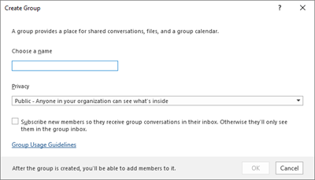
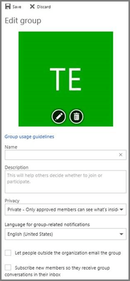

# <a name="manage-office-365-groups-with-powershell"></a><span data-ttu-id="8c092-103">Utiliser PowerShell pour gérer les groupes Office 365</span><span class="sxs-lookup"><span data-stu-id="8c092-103">Manage Office 365 Groups with PowerShell</span></span>

 <span data-ttu-id="8c092-104">*Dernière avril 18 mis à jour, 2018*</span><span class="sxs-lookup"><span data-stu-id="8c092-104">*Last updated 18 April, 2018*</span></span> 
  
<span data-ttu-id="8c092-p101">Cet article fournit des instructions pour effectuer des tâches de gestion courantes pour les groupes dans Microsoft PowerShell. Il indique également les applets de commande PowerShell pour les groupes. Pour obtenir des informations sur la gestion des sites SharePoint, voir [Gérer les sites d’équipe et les sites de communication à l’aide de PowerShell](https://support.office.com/article/52ecc2ab-88c3-486e-b8ff-ef6a968ccd87).</span><span class="sxs-lookup"><span data-stu-id="8c092-p101">This article provides the steps for doing common management tasks for Groups in Microsoft PowerShell. It also lists the PowerShell cmdlets for Groups. For info about managing SharePoint sites, see [Manage team sites and communication sites by using PowerShell](https://support.office.com/article/52ecc2ab-88c3-486e-b8ff-ef6a968ccd87).</span></span>
  
## <a name="common-tasks-for-managing-office-365-groups"></a><span data-ttu-id="8c092-108">Tâches courantes de gestion des groupes d’Office 365</span><span class="sxs-lookup"><span data-stu-id="8c092-108">Common tasks for managing Office 365 Groups</span></span>

- [<span data-ttu-id="8c092-109">Transformer des listes de distribution en groupes Office 365</span><span class="sxs-lookup"><span data-stu-id="8c092-109">Upgrade distribution lists to Office 365 Groups in Outlook</span></span>](https://support.office.com/article/787d7a75-e201-46f3-a242-f698162ff09f)
    
- [<span data-ttu-id="8c092-110">Gérer les personnes autorisées à créer des groupes Office 365</span><span class="sxs-lookup"><span data-stu-id="8c092-110">Manage who can create Office 365 Groups</span></span>](https://support.office.com/article/4c46c8cb-17d0-44b5-9776-005fced8e618)
    
- [<span data-ttu-id="8c092-111">Gérer l'accès invité aux groupes Office 365</span><span class="sxs-lookup"><span data-stu-id="8c092-111">Manage guest access to Office 365 Groups</span></span>](https://support.office.com/article/7c713d74-a144-4eab-92e7-d50df526ff96)
    
- [<span data-ttu-id="8c092-112">Gérer les groupes de façon dynamique dans Azure Active Directory</span><span class="sxs-lookup"><span data-stu-id="8c092-112">Manage groups dynamically in Azure Active Directory</span></span>](https://go.microsoft.com/fwlink/?linkid=847632)
    
- <span data-ttu-id="8c092-113">Ajouter des centaines, voire des milliers d’utilisateurs aux groupes d’Office 365, utilisez la [cmdlet Add-UnifiedGroupLinks](https://go.microsoft.com/fwlink/p/?LinkId=616191).</span><span class="sxs-lookup"><span data-stu-id="8c092-113">Add hundreds or thousands of users to Office 365 groups, use the [Add-UnifiedGroupLinks cmdlet](https://go.microsoft.com/fwlink/p/?LinkId=616191).</span></span>
    
### <a name="link-to-your-office-365-groups-usage-guidelines"></a><span data-ttu-id="8c092-114">Lien vers votre directives d’utilisation de groupes de Office 365</span><span class="sxs-lookup"><span data-stu-id="8c092-114">Link to your Office 365 Groups usage guidelines</span></span>
<span data-ttu-id="8c092-115"><a name="BK_LinkToGuideLines"> </a></span><span class="sxs-lookup"><span data-stu-id="8c092-115"></span></span>

<span data-ttu-id="8c092-p102">Lorsque les utilisateurs de [créer un groupe dans Outlook](https://support.office.com/article/04d0c9cf-6864-423c-a380-4fa858f27102), vous pouvez afficher les un lien vers les instructions d’utilisation de votre organisation. Par exemple, si vous exige un préfixe spécifique ou suffixe à ajouter à un nom de groupe.</span><span class="sxs-lookup"><span data-stu-id="8c092-p102">When users [Create a group in Outlook](https://support.office.com/article/04d0c9cf-6864-423c-a380-4fa858f27102), you can show them a link to your organization's usage guidelines. For example, if you require a specific prefix or suffix to be added to a group name.</span></span>
  
<span data-ttu-id="8c092-p103">Utiliser Azure Active Directory PowerShell pour pointer vos utilisateurs vers les instructions d’utilisation de votre organisation pour les groupes d’Office 365. Extrayez [d’Azure Active Directory des applets de commande pour configurer les paramètres de groupe](https://go.microsoft.com/fwlink/?LinkID=827484) et suivez les étapes décrites dans les **paramètres de création au niveau du répertoire** pour définir le lien hypertexte orientation de l’utilisation. Une fois vous avez exécuté l’applet de commande DAS, l’utilisateur sera voir le lien dans vos spécifications lorsqu’ils créent ou modifier un groupe dans Outlook.</span><span class="sxs-lookup"><span data-stu-id="8c092-p103">Use the Azure Active Directory PowerShell to point your users to your organization's usage guidelines for Office 365 groups. Check out [Azure Active Directory cmdlets for configuring group settings](https://go.microsoft.com/fwlink/?LinkID=827484) and follow the steps in the **Create settings at the directory level** to define the usage guideline hyperlink. Once you run the AAD cmdlet, user's will see the link to your guidelines when they create or edit a group in Outlook.</span></span> 
  

  

  
### <a name="allow-users-to-send-as-the-office-365-group"></a><span data-ttu-id="8c092-123">Autoriser les utilisateurs à envoyer en tant que le groupe d’Office 365</span><span class="sxs-lookup"><span data-stu-id="8c092-123">Allow users to Send as the Office 365 Group</span></span>
<span data-ttu-id="8c092-124"><a name="BK_LinkToGuideLines"> </a></span><span class="sxs-lookup"><span data-stu-id="8c092-124"></span></span>

<span data-ttu-id="8c092-p104">Vous pouvez également procéder ainsi dans le centre d’administration Exchange. Voir [Autoriser les membres à envoyer sous la forme ou envoyer de la part d’un groupe](https://support.office.com/article/0ad41414-0cc6-4b97-90fb-06bec7bcf590).</span><span class="sxs-lookup"><span data-stu-id="8c092-p104">You can also do this in the Exchange Admin Center. See [Allow members to send as or send on behalf of a Group](https://support.office.com/article/0ad41414-0cc6-4b97-90fb-06bec7bcf590).</span></span>
  
<span data-ttu-id="8c092-p105">Si vous souhaitez activer vos groupes d’Office 365 « Envoyer en tant que », utilisez le [Add-RecipientPermission](https://go.microsoft.com/fwlink/p/?LinkId=723960) et les applets de commande [Get-RecipientPermission](https://go.microsoft.com/fwlink/p/?LinkId=733239) cette configuration. Une fois que vous activez ce paramètre, les utilisateurs de groupe de Office 365 peuvent utiliser Outlook ou Outlook sur le site web d’envoyer et de répondre aux messages que le groupe d’Office 365. Les utilisateurs peuvent accéder au groupe de créer un nouveau courrier électronique et de modifier le champ « Envoyer en tant que » à l’adresse de messagerie du groupe.</span><span class="sxs-lookup"><span data-stu-id="8c092-p105">If you want to enable your Office 365 groups to "Send As", use the [Add-RecipientPermission](https://go.microsoft.com/fwlink/p/?LinkId=723960) and the [Get-RecipientPermission](https://go.microsoft.com/fwlink/p/?LinkId=733239) cmdlets to configure this. Once you enable this setting, Office 365 group users can use Outlook or Outlook on the web to send and reply to email as the Office 365 group. Users can go to the group, create a new email, and change the "Send As" field to the group's email address.</span></span> 
  
> [!NOTE]
> <span data-ttu-id="8c092-130">Vous devez ajouter l’adresse de messagerie du groupe dans le champ **Cc** lorsque vous composez le courrier électronique « Envoyer en tant que », afin que le message est envoyé au groupe et s’affiche dans des conversations de groupe.</span><span class="sxs-lookup"><span data-stu-id="8c092-130">You'll need to add the group email address to the **Cc** field when you compose the "send as" email, so that the message is sent to the Group and appears in group conversations.</span></span> 
  
<span data-ttu-id="8c092-131">À ce stade, la seule façon de mettre à jour la stratégie de boîte aux lettres est via [PowerShell](https://technet.microsoft.com/en-us/library/cc482986.aspx).</span><span class="sxs-lookup"><span data-stu-id="8c092-131">At this time, the only way to update the mailbox policy is through [PowerShell](https://technet.microsoft.com/en-us/library/cc482986.aspx).</span></span>
  
- <span data-ttu-id="8c092-132">Utilisez cette commande pour définir l’alias de groupe.</span><span class="sxs-lookup"><span data-stu-id="8c092-132">Use this command to set the group alias.</span></span>
    
  ```
  $groupAlias = "TestSendAs"
  ```

- <span data-ttu-id="8c092-133">Utilisez cette commande pour définir l’alias de l’utilisateur.</span><span class="sxs-lookup"><span data-stu-id="8c092-133">Use this command to set the user alias.</span></span>
    
  ```
  $userAlias = "User"
  ```

- <span data-ttu-id="8c092-134">Cette commande permet de transmettre le groupalias à l’applet de commande Get-Recipient pour obtenir les détails du destinataire.</span><span class="sxs-lookup"><span data-stu-id="8c092-134">Use this command to pass the groupalias to the Get-Recipient cmdlet to get the recipient details.</span></span>
    
  ```
  $groupsRecipientDetails = Get-Recipient -RecipientTypeDetails groupmailbox -Identity $groupAlias
  ```

- <span data-ttu-id="8c092-p106">Le nom du destinataire cible (nom du groupe) doit être transmis à la cmdlet Add-RecipientPermission. Useralias pour lesquels l’autorisation sendas bénéficiera sera attribué au paramètre - du client approuvé.</span><span class="sxs-lookup"><span data-stu-id="8c092-p106">Then the target recipient name (Group name) needs to be passed to the Add-RecipientPermission cmdlet. The useralias for whom the sendas permission will be given will be assigned to the -Trustee parameter.</span></span>
    
  ```
  Add-RecipientPermission -Identity $groupsRecipientDetails.Name -Trustee $userAlias -AccessRights SendAs
  ```

- <span data-ttu-id="8c092-137">Une fois que l’applet de commande est exécutée, les utilisateurs peuvent aller à Outlook ou Outlook sur le web pour envoyer en tant que le groupe, en ajoutant l’adresse de messagerie de groupe pour **le champ** .</span><span class="sxs-lookup"><span data-stu-id="8c092-137">Once the cmdlet is executed, users can go to Outlook or Outlook on the web to send as the group, by adding the group email address to the **From** field.</span></span> 
    
### <a name="create-classifications-for-office-groups-in-your-organization"></a><span data-ttu-id="8c092-138">Créer des classifications pour les groupes d’Office dans votre organisation</span><span class="sxs-lookup"><span data-stu-id="8c092-138">Create classifications for Office groups in your organization</span></span>
<span data-ttu-id="8c092-139"><a name="BKMK_CreateClassification"> </a></span><span class="sxs-lookup"><span data-stu-id="8c092-139"></span></span>

<span data-ttu-id="8c092-p107">Vous pouvez créer des classifications que les utilisateurs de votre organisation peuvent définir lorsqu’ils créent un groupe d’Office 365. Par exemple, vous pouvez permettre aux utilisateurs de définir des « Standard », « Secret » et « Top Secret » sur les groupes qu’ils créent. Classifications de groupe ne sont pas définies par défaut et que vous devez créer dans l’ordre pour vos utilisateurs à définir. Utiliser Windows Azure Active Directory PowerShell pour pointer vos utilisateurs vers les instructions d’utilisation de votre organisation pour les groupes d’Office 365.</span><span class="sxs-lookup"><span data-stu-id="8c092-p107">You can create classifications that the users in your organization can set when they create an Office 365 group. For example, you can allow users to set "Standard", "Secret", and "Top Secret" on groups they create. Group classifications aren't set by default and you need to create it in order for your users to set it. Use Azure Active Directory PowerShell to point your users to your organization's usage guidelines for Office 365 groups.</span></span>
  
<span data-ttu-id="8c092-144">Extrayez des [applets de commande Azure Active Directory pour la configuration des paramètres de groupe](https://go.microsoft.com/fwlink/?LinkID=827484) et suivez les étapes décrites dans les **paramètres de création au niveau du répertoire** pour définir la classification des groupes d’Office 365.</span><span class="sxs-lookup"><span data-stu-id="8c092-144">Check out [Azure Active Directory cmdlets for configuring group settings](https://go.microsoft.com/fwlink/?LinkID=827484) and follow the steps in the **Create settings at the directory level** to define the classification for Office 365 groups.</span></span> 
  
```
$setting["ClassificationList"] = "Low Impact, Medium Impact, High Impact"
```

<span data-ttu-id="8c092-145">Pour associer une description à chaque classification que vous pouvez utiliser l’attribut *ClassificationDescriptions* pour définir les paramètres.</span><span class="sxs-lookup"><span data-stu-id="8c092-145">In order to associate a description to each classification you can use the settings attribute  *ClassificationDescriptions*  to define.</span></span> 
  
```
$setting["ClassificationDescriptions"] ="Classification:Description,Classification:Description", where Classification matches the strings in the ClassificationList.
```

<span data-ttu-id="8c092-146">Par exemple :</span><span class="sxs-lookup"><span data-stu-id="8c092-146">For example:</span></span>
  
```
$setting["ClassificationDescriptions"] = "Low Impact: General communication, Medium Impact: Company internal data , High Impact: Data that has regulatory requirements"
```

<span data-ttu-id="8c092-147">Après avoir exécuté l’applet de commande pour définir votre classification Azure Active Directory ci-dessus, exécutez l’applet de commande [Set-UnifiedGroup](https://go.microsoft.com/fwlink/?LinkID=616189) si vous souhaitez définir la classification pour un groupe spécifique.</span><span class="sxs-lookup"><span data-stu-id="8c092-147">After you run the above Azure Active Directory cmdlet to set your classification, run the [Set-UnifiedGroup](https://go.microsoft.com/fwlink/?LinkID=616189) cmdlet if you want to set the classification for a specific group.</span></span> 
  
```
Set-UnifiedGroup <LowImpactGroup@constoso.com> -Classification <LowImpact> 
```

<span data-ttu-id="8c092-148">Ou créez un nouveau groupe avec une classification.</span><span class="sxs-lookup"><span data-stu-id="8c092-148">Or create a new group with a classification.</span></span>
  
```
New-UnifiedGroup <HighImpactGroup@constoso.com> -Classification <HighImpact> -AccessType <Public> 
```

<span data-ttu-id="8c092-149">Consultez la rubrique [à l’aide de PowerShell avec Exchange Online](https://go.microsoft.com/fwlink/?LinkID=402831) et [se connecter à Exchange Online PowerShell](https://go.microsoft.com/fwlink/?LinkID=722415) pour plus d’informations sur l’utilisation d’Exchange Online PowerShell.</span><span class="sxs-lookup"><span data-stu-id="8c092-149">Check out [Using PowerShell with Exchange Online](https://go.microsoft.com/fwlink/?LinkID=402831) and [Connect to Exchange Online PowerShell](https://go.microsoft.com/fwlink/?LinkID=722415) for more details on using Exchange Online PowerShell.</span></span> 
  
<span data-ttu-id="8c092-150">Une fois ces paramètres sont activés, le propriétaire du groupe sera en mesure de choisir une classification dans la liste déroulante menu dans Outlook sur le Web et d’Outlook et enregistrez-le à partir de la page **Modifier** du groupe.</span><span class="sxs-lookup"><span data-stu-id="8c092-150">Once these settings are enabled, the group owner will be able to choose a classification from the drop down menu in Outlook on the Web and Outlook, and save it from the **Edit** group page.</span></span> 
  

  
### <a name="hide-office-365-groups-from-gal"></a><span data-ttu-id="8c092-152">Masquer les groupes d’Office 365 à partir de la liste d’adresses globale</span><span class="sxs-lookup"><span data-stu-id="8c092-152">Hide Office 365 Groups from GAL</span></span>
<span data-ttu-id="8c092-153"><a name="BKMK_CreateClassification"> </a></span><span class="sxs-lookup"><span data-stu-id="8c092-153"></span></span>

<span data-ttu-id="8c092-p108">Vous pouvez spécifier si un groupe d’Office 365 apparaît dans la liste d’adresses globale (LAG) et d’autres listes au sein de votre organisation. Par exemple, si vous disposez d’un groupe du département juridique que vous ne voulez pas que s’affiche dans la liste d’adresses, vous pouvez arrêter ce groupe d’apparaître dans la liste d’adresses globale. Exécutez l’applet de commande groupe Set-Unified pour masquer le groupe à partir de la liste d’adresses similaire à celle-ci :</span><span class="sxs-lookup"><span data-stu-id="8c092-p108">You can specify whether a Office 365 group appears in the global address list (GAL) and other lists in your organization. For example, if you have a legal department group that you don't want to show up in the address list, you can stop that group from appearing in GAL. Run the Set-Unified Group commandlet to hide the group from address list like this:</span></span>
  
```
  Set-UnifiedGroup -Identity "Legal Department" -HiddenFromAddressListsEnabled $true
```

### <a name="allow-only-internal-users-to-send-message-to-office-365-group"></a><span data-ttu-id="8c092-157">Autoriser uniquement les utilisateurs internes envoyer un message au groupe d’Office 365</span><span class="sxs-lookup"><span data-stu-id="8c092-157">Allow only internal users to send message to Office 365 group</span></span>
<span data-ttu-id="8c092-158"><a name="BKMK_CreateClassification"> </a></span><span class="sxs-lookup"><span data-stu-id="8c092-158"></span></span>

<span data-ttu-id="8c092-p109">Si vous ne voulez pas que les utilisateurs d’autres organisations pour envoyer un message électronique à un groupe d’Office 365, vous pouvez modifier les paramètres pour ce groupe. Elle permet uniquement les utilisateurs internes puissent envoyer un message électronique à votre groupe. Si vous essaient d’envoyer un message à ce groupe utilisateurs externes, ils seront rejetés.</span><span class="sxs-lookup"><span data-stu-id="8c092-p109">If you don't want users from other organization to send email to a Office 365 group, you can change the settings for that group. It will allow only internal users to send an email to your group. If external user try to send message to that group they will be rejected.</span></span>
  
<span data-ttu-id="8c092-162">Exécutez l’applet de commande Set-UnifiedGroup pour mettre à jour ce paramètre, comme suit :</span><span class="sxs-lookup"><span data-stu-id="8c092-162">Run the Set-UnifiedGroup commandlet to update this setting, like this:</span></span>
  
```
Set-UnifiedGroup -Identity "Internal senders only" - RequireSenderAuthenticationEnabled $true
```

### <a name="add-mailtips-to-the-office-365-groups"></a><span data-ttu-id="8c092-163">Ajouter des infos-courrier aux groupes d’Office 365</span><span class="sxs-lookup"><span data-stu-id="8c092-163">Add MailTips to the Office 365 Groups</span></span>
<span data-ttu-id="8c092-164"><a name="BKMK_CreateClassification"> </a></span><span class="sxs-lookup"><span data-stu-id="8c092-164"></span></span>

<span data-ttu-id="8c092-165">Lorsqu’un expéditeur essaie d’envoyer un message électronique à un groupe d’Office 365, une info-courrier peut être affichée pour lui.</span><span class="sxs-lookup"><span data-stu-id="8c092-165">Whenever a sender tries to send an email to an Office 365 group, a MailTip can be shown to him.</span></span>
  
<span data-ttu-id="8c092-166">Exécutez l’applet de commande groupe Set-Unified pour ajouter une info-courrier au groupe :</span><span class="sxs-lookup"><span data-stu-id="8c092-166">Run the Set-Unified Group commandlet to add a mailTip to the group:</span></span>
  
```
Set-UnifiedGroup -Identity "MailTip Group" -MailTip "This group has a MailTip"
```

<span data-ttu-id="8c092-p110">Avec info-courrier, vous pouvez également définir MailTipTranslations, qui spécifie les langues supplémentaires pour l’info-courrier. Supposons que vous disposez de la traduction espagnole, puis exécutez la commande suivante :</span><span class="sxs-lookup"><span data-stu-id="8c092-p110">Along with MailTip, you can also set MailTipTranslations, which specifies additional languages fro the MailTip. Suppose you want to have the Spanish translation, then run the following command:</span></span>
  
```
Set-UnifiedGroup -Identity "MailaTip Group" -MailTip "This group has a MailTip" -MailTipTranslations "@{Add="ES:Esta caja no se supervisa."
```

### <a name="change-display-name-of-the-office-365-group"></a><span data-ttu-id="8c092-169">Modifier le nom complet du groupe d’Office 365</span><span class="sxs-lookup"><span data-stu-id="8c092-169">Change Display name of the Office 365 group</span></span>
<span data-ttu-id="8c092-170"><a name="BKMK_CreateClassification"> </a></span><span class="sxs-lookup"><span data-stu-id="8c092-170"></span></span>

<span data-ttu-id="8c092-p111">Nom d’affichage spécifie le nom du groupe d’Office 365. Vous pouvez voir ce nom dans votre portail d’administration exchange admin center ou o365. Vous pouvez modifier le nom complet du groupe ou attribuer un nom complet à un groupe d’Office 365 existant en exécutant la commande Set-UnifiedGroup :</span><span class="sxs-lookup"><span data-stu-id="8c092-p111">Display name specifies the name of the Office 365 group. You can see this name in your exchange admin center or o365 admin portal. You can edit the display name of the group or assign a display name to an exisiting Office 365 group by running Set-UnifiedGroup command:</span></span>
  
```
Set-UnifiedGroup -Identity "mygroup@contoso.com" -DisplayName "My new group"
```

### <a name="manage-user-photos-in-office-365-groups"></a><span data-ttu-id="8c092-174">Gérer les photos de l’utilisateur dans Office 365 groupes</span><span class="sxs-lookup"><span data-stu-id="8c092-174">Manage user photos in Office 365 Groups</span></span>
<span data-ttu-id="8c092-175"><a name="BKMK_CreateClassification"> </a></span><span class="sxs-lookup"><span data-stu-id="8c092-175"></span></span>

<span data-ttu-id="8c092-176">| |</span><span class="sxs-lookup"><span data-stu-id="8c092-176"></span></span>
|<span data-ttu-id="8c092-177">**Nom de la cmdlet**</span><span class="sxs-lookup"><span data-stu-id="8c092-177">**Cmdlet name**</span></span>|<span data-ttu-id="8c092-178">**Description**</span><span class="sxs-lookup"><span data-stu-id="8c092-178">**Description**</span></span>|
|:-----|:-----|
|[<span data-ttu-id="8c092-179">Get-UserPhoto</span><span class="sxs-lookup"><span data-stu-id="8c092-179">Get-UserPhoto</span></span>](https://go.microsoft.com/fwlink/p/?LinkId=536510) <br/> |<span data-ttu-id="8c092-p112">Permet d’afficher des informations sur la photo de l’utilisateur associée à un compte. Photos de l’utilisateur sont stockées dans Active Directory</span><span class="sxs-lookup"><span data-stu-id="8c092-p112">Used to view information about the user photo associated with an account. User photos are stored in Active Directory</span></span>  <br/> |
|[<span data-ttu-id="8c092-182">Set-UserPhoto</span><span class="sxs-lookup"><span data-stu-id="8c092-182">Set-UserPhoto</span></span>](https://go.microsoft.com/fwlink/p/?LinkId=536511) <br/> |<span data-ttu-id="8c092-p113">Utilisé pour associer une photo de l’utilisateur à un compte. Photos de l’utilisateur sont stockées dans Active Directory</span><span class="sxs-lookup"><span data-stu-id="8c092-p113">Used to associate a user photo with an account. User photos are stored in Active Directory</span></span>  <br/> |
|[<span data-ttu-id="8c092-185">Remove-UserPhoto</span><span class="sxs-lookup"><span data-stu-id="8c092-185">Remove-UserPhoto</span></span>](https://go.microsoft.com/fwlink/p/?LinkId=536512) <br/> |<span data-ttu-id="8c092-186">Supprimer la photo d’un groupe d’Office 365</span><span class="sxs-lookup"><span data-stu-id="8c092-186">Remove the photo for an Office 365 group</span></span>  <br/> |
   
### <a name="change-the-default-setting-of-office-365-groups-for-outlook-to-public-or-private"></a><span data-ttu-id="8c092-187">Modifier le paramètre par défaut d’Office 365 groupes pour Outlook Public ou privé</span><span class="sxs-lookup"><span data-stu-id="8c092-187">Change the default setting of Office 365 Groups for Outlook to Public or Private</span></span>
<span data-ttu-id="8c092-188"><a name="BKMK_CreateClassification"> </a></span><span class="sxs-lookup"><span data-stu-id="8c092-188"></span></span>

<span data-ttu-id="8c092-p114">Office 365 groupes dans Outlook sont créés comme étant privé par défaut. Si votre organisation souhaite Office 365 groupes Outlook être créé en tant que Public par défaut (ou à privée), utilisez cette syntaxe d’applet de commande PowerShell :</span><span class="sxs-lookup"><span data-stu-id="8c092-p114">Office 365 Groups in Outlook are created as Private by default. If your organization wants Office 365 Groups for Outlook to be created as Public by default (or back to Private), use this PowerShell cmdlet syntax:</span></span>
  
 `Set-OrganizationConfig -DefaultGroupAccessType Public`
  
<span data-ttu-id="8c092-191">Pour définir privé :</span><span class="sxs-lookup"><span data-stu-id="8c092-191">To set to Private:</span></span>
  
 `Set-OrganizationConfig -DefaultGroupAccessType Private`
  
<span data-ttu-id="8c092-192">Pour vérifier le paramètre :</span><span class="sxs-lookup"><span data-stu-id="8c092-192">To verify the setting:</span></span> 
  
 `Get-OrganizationConfig | ft DefaultGroupAccessType`
  
<span data-ttu-id="8c092-193">Pour plus d’informations, voir [Set-OrganizationConfig](https://go.microsoft.com/fwlink/?linkid=871816) et [Get-OrganizationConfig](https://go.microsoft.com/fwlink/?linkid=871817).</span><span class="sxs-lookup"><span data-stu-id="8c092-193">To learn more, see [Set-OrganizationConfig](https://go.microsoft.com/fwlink/?linkid=871816) and [Get-OrganizationConfig](https://go.microsoft.com/fwlink/?linkid=871817).</span></span>
  
## <a name="office-365-groups-cmdlets"></a><span data-ttu-id="8c092-194">Applets de commande de groupes Office 365</span><span class="sxs-lookup"><span data-stu-id="8c092-194">Office 365 Groups cmdlets</span></span>

<span data-ttu-id="8c092-p115">Les applets de commande suivantes ont été apportées récemment disponibles aux groupes d’Office 365. Si vous n’êtes pas en mesure d’utiliser ces, votre abonnement Office 365 n'a pas été encore mis à jour avec cette fonctionnalité. Vérifiez votre centre de messages et de la [feuille de route Office 365](http://roadmap.office.com/en-us).</span><span class="sxs-lookup"><span data-stu-id="8c092-p115">The following cmdlets were recently made available to Office 365 Groups. If you aren't able to use these, your Office 365 subscription has not been updated with this functionality yet. Check your Message Center and the [Office 365 Roadmap](http://roadmap.office.com/en-us).</span></span>
  
<span data-ttu-id="8c092-198">| |</span><span class="sxs-lookup"><span data-stu-id="8c092-198"></span></span>
|<span data-ttu-id="8c092-199">**Nom de la cmdlet**</span><span class="sxs-lookup"><span data-stu-id="8c092-199">**Cmdlet name**</span></span>|<span data-ttu-id="8c092-200">**Description**</span><span class="sxs-lookup"><span data-stu-id="8c092-200">**Description**</span></span>|
|:-----|:-----|
|[<span data-ttu-id="8c092-201">Get-UnifiedGroup</span><span class="sxs-lookup"><span data-stu-id="8c092-201">Get-UnifiedGroup</span></span>](https://go.microsoft.com/fwlink/p/?LinkId=616182) <br/> |<span data-ttu-id="8c092-202">Utilisez cette applet de commande pour rechercher des groupes d’existants Office 365 et pour afficher les propriétés de l’objet de groupe</span><span class="sxs-lookup"><span data-stu-id="8c092-202">Use this cmdlet to look up existing Office 365 Groups, and to view properties of the group object</span></span>  <br/> |
|[<span data-ttu-id="8c092-203">Set-UnifiedGroup</span><span class="sxs-lookup"><span data-stu-id="8c092-203">Set-UnifiedGroup</span></span>](https://go.microsoft.com/fwlink/p/?LinkId=616189) <br/> |<span data-ttu-id="8c092-204">Mettre à jour les propriétés d’un groupe de 365 Office spécifique</span><span class="sxs-lookup"><span data-stu-id="8c092-204">Update the properties of a specific Office 365 Group</span></span>  <br/> |
|[<span data-ttu-id="8c092-205">New-UnifiedGroup</span><span class="sxs-lookup"><span data-stu-id="8c092-205">New-UnifiedGroup</span></span>](https://go.microsoft.com/fwlink/p/?LinkId=616183) <br/> |<span data-ttu-id="8c092-p116">Créer un nouveau groupe d’Office 365. Cette applet de commande fournit un ensemble de paramètres minimal, pour le paramètre de valeurs pour les propriétés étendues utilisent Set-UnifiedGroup après la création du nouveau groupe</span><span class="sxs-lookup"><span data-stu-id="8c092-p116">Create a new Office 365 group. This cmdlet provides a minimal set of parameters, for setting values for extended properties use Set-UnifiedGroup after creating the new group</span></span>  <br/> |
|[<span data-ttu-id="8c092-208">Remove-UnifiedGroup</span><span class="sxs-lookup"><span data-stu-id="8c092-208">Remove-UnifiedGroup</span></span>](https://go.microsoft.com/fwlink/p/?LinkId=616186) <br/> |<span data-ttu-id="8c092-209">Supprimer un groupe de 365 Office existant</span><span class="sxs-lookup"><span data-stu-id="8c092-209">Delete an existing Office 365 Group</span></span>  <br/> |
|[<span data-ttu-id="8c092-210">Get-UnifiedGroupLinks</span><span class="sxs-lookup"><span data-stu-id="8c092-210">Get-UnifiedGroupLinks</span></span>](https://go.microsoft.com/fwlink/p/?LinkId=616194) <br/> |<span data-ttu-id="8c092-211">Récupérer des informations d’appartenance et le propriétaire d’un groupe d’Office 365</span><span class="sxs-lookup"><span data-stu-id="8c092-211">Retrieve membership and owner information for an Office 365 Group</span></span>  <br/> |
|[<span data-ttu-id="8c092-212">Add-UnifiedGroupLinks</span><span class="sxs-lookup"><span data-stu-id="8c092-212">Add-UnifiedGroupLinks</span></span>](https://go.microsoft.com/fwlink/p/?LinkId=616191) <br/> |<span data-ttu-id="8c092-213">Ajouter des centaines ou des milliers d’utilisateurs, ou de nouveaux propriétaires, à un groupe de 365 Office existant</span><span class="sxs-lookup"><span data-stu-id="8c092-213">Add hundred or thousands of users, or new owners, to an existing Office 365 Group</span></span>  <br/> |
|[<span data-ttu-id="8c092-214">Remove-UnifiedGroupLinks</span><span class="sxs-lookup"><span data-stu-id="8c092-214">Remove-UnifiedGroupLinks</span></span>](https://go.microsoft.com/fwlink/p/?LinkId=616195) <br/> |<span data-ttu-id="8c092-215">Supprimer les propriétaires et les membres d’un groupe de 365 Office existant</span><span class="sxs-lookup"><span data-stu-id="8c092-215">Remove owners and members from an existing Office 365 Group</span></span>  <br/> |
   
## <a name="for-more-information"></a><span data-ttu-id="8c092-216">Pour plus d’informations</span><span class="sxs-lookup"><span data-stu-id="8c092-216">For more information</span></span>

- [<span data-ttu-id="8c092-217">À l’aide de PowerShell</span><span class="sxs-lookup"><span data-stu-id="8c092-217">Using PowerShell</span></span>](https://technet.microsoft.com/en-us/library/cc482986.aspx)
    
- [<span data-ttu-id="8c092-218">Appliquer (ou supprimer) une stratégie de boîte aux lettres Outlook Web App à une boîte aux lettres</span><span class="sxs-lookup"><span data-stu-id="8c092-218">Apply or remove an Outlook Web App mailbox policy on a mailbox</span></span>](https://technet.microsoft.com/en-us/library/dd876884%28v=exchg.150%29.aspx)
    
- [<span data-ttu-id="8c092-219">Stratégie d’attribution de noms de groupes de Office 365</span><span class="sxs-lookup"><span data-stu-id="8c092-219">Office 365 Groups naming policy</span></span>](https://support.office.com/article/6ceca4d3-cad1-4532-9f0f-d469dfbbb552)
    

