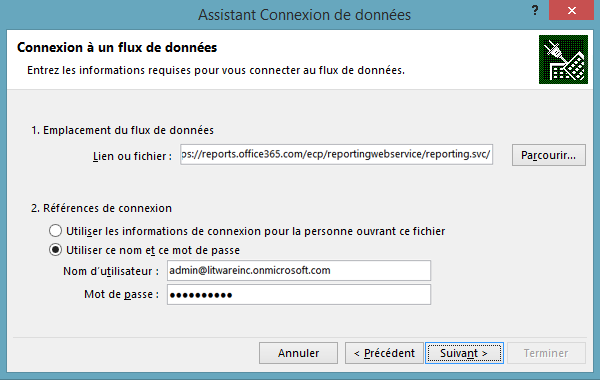
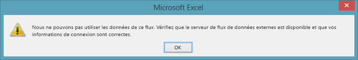
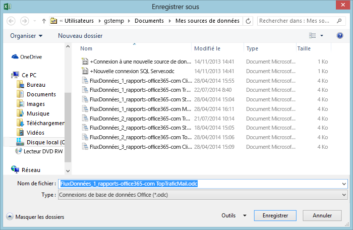
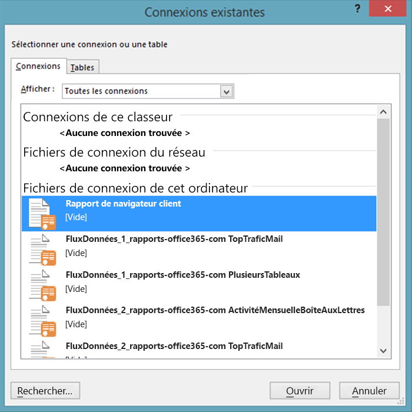
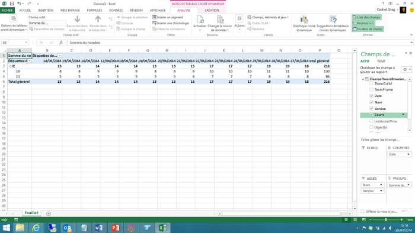

# <a name="using-excel-to-retrieve-office-365-reporting-data"></a>Utilisation d’Excel pour récupérer des données de création de rapports Office 365

 **Résumé :** Utilisez la fonction oData dans Microsoft Excel afin de récupérer des informations de création de rapports détaillées pour votre déploiement de Office 365
  
La création de rapports est un élément essentiel de l'administration système. Le centre d'administration Office 365 inclut plusieurs rapports prédéfinis auxquels vous pouvez accéder à partir de la section **Rapports** dans le volet de navigation de gauche. Il existe des rapports d'utilisation et des rapports de sécurité et de conformité.
  
Les rapports disponibles dépendent de la version d'Office 365 que vous utilisez et des services Office 365 que vous avez activés. Pour plus d'informations, consultez la [page Rapports]((https://technet.microsoft.com/fr-FR/library/office-365-reports.aspx)).
  
Les rapports prédéfinis du centre d'administration constituent une excellente ressource. Ils permettent de vérifier facilement des choses telles que l'utilisation de la boîte aux lettres ou le nombre de minutes que les utilisateurs ont passées devant des conférences en ligne. Cependant, lorsqu'il s'agit d'une analyse détaillée de votre domaine Office 365, les rapports ont leurs limites.
  
Une façon de contourner ces limites est d'utiliser Windows PowerShell ou un autre langage de développement pour accéder au service de création de rapports Office 365 et créer des rapports personnalisés. Ces derniers permettent de dicter quelles données (et combien de données) sont renvoyées par le service de création de rapports Office 365. La rédaction de rapports personnalisés vous permet également de spécifier comment les données doivent être triées et regroupées, et, le cas échéant, comment ces données doit être enregistrées. Par exemple, vous pouvez enregistrer les données au format XML ou dans un format de valeurs séparées par des virgules qui peut facilement être importé dans Excel. 
  
En outre, les scripts/applications personnalisés vous permettent d'accéder aux rapports qui ne sont pas disponibles dans le Centre d'administration Office 365. Par exemple, le Centre d'administration peut indiquer le nombre de boîtes aux lettres périmées, mais il ne peut pas indiquer quelles boîtes aux lettres n'ont pas été consultées au cours des 30 derniers jours. Cependant, c'est une chose qu'un script PowerShell personnalisé peut indiquer. Ainsi, cela représente une très grande flexibilité en échange de l'écriture d'un script Windows PowerShell court et relativement simple.
  
> [!VISUAL BASIC NOTE] Pour plus d'informations, consultez la [page d'accueil](https://msdn.microsoft.com/en-us/library/office/jj984325%28v=office.15%29.aspx) du service de création de rapports Office 365.
  
Pour récupérer ces données, vous devez écrire un code. Cela en vaut la peine si vous faites partie d'une grande organisation qui doit limiter la quantité et le type d'informations renvoyées. Toutefois, si vous faites partie d'une plus petite organisation et que vous n'avez pas besoin de limiter la quantité et le type d'informations renvoyées, vous pouvez envisager d'ouvrir les rapports Office 365 à partir d'Excel.
  
Cependant, il existe quelques limites, la première étant la suivante : vous ne pouvez pas filtrer, trier, sélectionner ni manipuler les données avant qu’elles ne soient renvoyées. À la place, vous récupérez simplement l’ensemble de données par défaut renvoyé par le rapport. Dans certains cas, les données peuvent ne pas suffire. Par exemple, le rapport peut renvoyer des données pour uniquement le mois précédent et non pour l’année entière. À l’inverse, dans d’autres cas, il peut y avoir trop de données : il se peut que vous récupériez des données pour l’année entière même si vous ne souhaitez récupérer que celles du mois précédent.
  
Pour ouvrir un rapport Office 365 directement à partir d'Excel, procédez comme suit :
  
1. Commencez par ouvrir une nouvelle feuille de calcul dans Excel. Sur cette feuille de calcul, cliquez sur **Données**, **Autres sources**, puis **À partir d'un flux de données OData**. La boîte de dialogue **Assistant Connexion de données** apparaît :
    
     
  
2. Sur la page **Connexion à un flux de données**, saisissez **https://reports.office365.com/ecp/reportingwebservice/reporting.svc/** comme emplacement du flux de données. Notez que vous pouvez uniquement entrer l'URL de base comme indiqué. Vous ne pouvez pas ajouter d'instructions de sélection, de filtre ou de format. Si vous entrez tout sauf l'URL de base, vous ne récupérerez aucune donnée et le message d'erreur suivant s'affichera :
    
     
  
3. Après avoir entré l'URL du service de création de rapports, sélectionnez l'option **Utiliser ce nom et ce mot de passe** sous **Références de connexion**. Dans la zone **Nom d'utilisateur**, entrez votre nom de connexion Office 365 (par exemple, admin@litwareinc.onmicrosoft.com). Dans la zone **Mot de passe**, entrez votre mot de passe de connexion Office 365, puis cliquez sur **Suivant**. Excel tentera alors de se connecter au service de création de rapports en utilisant les références fournies.
    
4. Une fois que vous avez été authentifié, la page **Sélectionner des tables** s'affiche. Sélectionnez le rapport que vous souhaitez afficher (par exemple, **MailTrafficTop** ), puis cliquez sur **Suivant**:
    
     
  
    > [!NOTE]
    > Il est possible de sélectionner plusieurs rapports. Dans ce cas, plusieurs graphiques/tableaux sont ajoutés à votre feuille de calcul Excel. Il est même possible de créer un graphique/un tableau unique qui combine les données de plusieurs rapports. Cependant, nous n'aborderons pas ce point dans cet article d'introduction. 
  
5. Après avoir cliqué sur **Suivant**, la page **Enregistrement du fichier de connexion de données et fin** s'affiche :
    
     
  
    Vous ne devez pas entrer d'informations ici. Il vous suffit de cliquer sur **Terminer** pour récupérer vos données. Cependant, il est intéressant de noter que, par défaut, Excel enregistre des informations sur chaque connexion de données que vous effectuez. Ces données sont stockées dans votre dossier **Mes sources de données**:
    
     
  
    C'est pourquoi la boîte de dialogue inclut des zones de texte avec des libellés tels que **Nom convivial** et **Mots clés de recherche**. Ces options vous permettent de personnaliser ces connexions de données. De cette façon, vous ne vous retrouvez pas avec une multitude de sources de données qui ressemblent à celles-ci :
    
  ```
  DataFeed_1_reports-office365-com ClientSoftwareBrowserDetail.odc
DataFeed_1_reports-office365-com MailTrafficTop.odc
DataFeed_1_reports-office365-com Multiple Tables.odc
DataFeed_2_reports-office365-com MailboxActivityWeekly.odc
DataFeed_2_reports-office365-com MailTrafficTop.odc
DataFeed_3_reports-office365-com ClientSoftwareBrowserDetail.odc
  ```

Si vous cochez la case **Enregistrer le mot de passe dans le fichier**, vous pourrez réutiliser ces flux de données. Par exemple, supposons que vous enregistrez une connexion de données comme **rapport de navigateur client**. La prochaine fois que vous souhaiterez obtenir des informations sur les navigateurs web utilisés pour accéder à votre domaine Office 365, vous n’aurez plus à suivre l’assistant de connexion de données. Au lieu de cela, il vous suffira d’ouvrir Excel, de cliquer sur **Données**, puis sur **Connexions existantes**. Sélectionnez la connexion de données souhaitée dans la boîte de dialogue **Connexions existantes**, puis cliquez sur **OK** :
    

  
À ce stade, Excel effectuera la connexion et récupérera les données.
    
Notez que ces fichiers ODC sont des fichiers XML en texte brut. Ce sont eux qui contiennent votre nom d'utilisateur et votre mot de passe Office 365 :
    
\<odc:ConnectionString>Data Source=https://reports.office365.com/ecp/reportingwebservice/reporting.svc/;Namespaces to Include=*;Max Received Message Size=4398046511104;Integrated Security=Basic; **User ID=admin@litwareinc.onmicrosoft.com;Password=MYpassw0rd!**;Persist Security Info=false;Service Document Url=https://reports.office365.com/ecp/reportingwebservice/reporting.svc/\</odc:ConnectionString>
    
Si vous ne souhaitez pas enregistrer votre nom d'utilisateur et votre mot de passe dans un fichier au format texte brut, ne cochez pas la case **Enregistrer le mot de passe dans le fichier**. Si vous faites cela, cependant, n'oubliez pas que vous ne pourrez pas réutiliser ces données de connexion. Cela est dû au fait que, sans le nom d'utilisateur et le mot de passe, Office 365 ne pourra pas authentifier votre tentative de connexion au service.
    
6. Cliquez sur **Terminer** sur la page **Enregistrement du fichier de connexion de données et fin** qui s'affichera avec la boîte de dialogue **Importer des données**:
    
     
  
7. Sélectionnez vos options d'affichage (par exemple, **Rapport de tableau croisé dynamique** ), puis cliquez sur **OK**. Si tout va bien, vos données seront importées et présentées selon l'option d'affichage que vous choisirez :
    
     
  
Vous déciderez ensuite ce que vous souhaitez faire avec ces données. Pour des suggestions, consultez l'article [Créer un tableau de bord Excel Services à l'aide d'un flux de données OData](https://technet.microsoft.com/en-us/library/jj873965%28v=office.15%29.aspx). Bien que cet article n'utilise pas le service de création de rapports Office 365, il fournit quelques conseils pratiques pour effectuer des tâches telles que l'ajout de filtres et de segments à votre nouveau tableau de bord.
  
## <a name="see-also"></a>Voir aussi

#### 

[Gérer Office 365 avec Office 365 PowerShell](manage-office-365-with-office-365-powershell.md)
  
[Mise en route d'Office 365 Powershell](getting-started-with-office-365-powershell.md)
  
[Utilisez Windows PowerShell pour créer des rapports dans Office 365](use-windows-powershell-to-create-reports-in-office-365.md)

