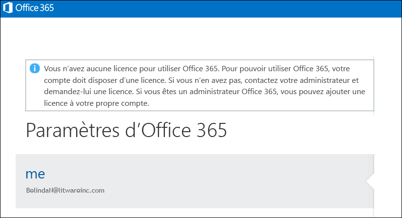

# <a name="view-licensed-and-unlicensed-users-with-office-365-powershell"></a>Afficher les utilisateurs avec ou sans licence avec Office 365 PowerShell

**Résumé :** Explique comment utiliser Office 365 PowerShell pour afficher des comptes d'utilisateurs sous licence ou non.
  
Il se peut que l'intégralité, une partie ou aucune des licences disponibles soit attribuée aux comptes d'utilisateurs de votre organisation Office 365 à partir des plans de gestion des licences disponibles dans votre organisation. Vous pouvez utiliser Office 365 PowerShell pour rechercher rapidement les utilisateurs avec ou sans licence dans votre organisation.
  
## <a name="before-you-begin"></a>Avant de commencer

- Les procédures décrites dans cette rubrique exigent une connexion à Office 365 PowerShell. Pour plus d'informations, reportez-vous à [Se connecter à Office 365 PowerShell](connect-to-office-365-powershell.md).
    
- Si vous utilisez la cmdlet **Get-MsolUser** sans utiliser le paramètre _-All_, seuls les 500 premiers comptes sont renvoyés.
    
## <a name="the-short-version-instructions-without-explanations"></a>La version courte (instructions sans explications)

Cette section présente les procédures sans explication superflue ou alambiquée. Si vous avez des questions ou que vous souhaitez plus d'informations, vous pouvez lire le reste de la rubrique.
  
Pour afficher la liste de tous les comptes d'utilisateurs et leur statut de licence dans votre organisation, exécutez la commande suivante dans Office 365 PowerShell :
  
```
Get-MsolUser -All
```

Pour afficher la liste de tous les comptes d’utilisateurs sans licence dans votre organisation, exécutez la commande suivante :
  
```
Get-MsolUser -All -UnlicensedUsersOnly
```

Pour afficher la liste de tous les comptes d’utilisateurs avec licence dans votre organisation, exécutez la commande suivante :
  
```
Get-MsolUser -All | where {$_.isLicensed -eq $true}
```

## <a name="the-long-version-instructions-with-detailed-explanations"></a>La version longue (instructions avec des explications détaillées)

Comptes d’utilisateurs Office 365 et des licences Office 365 n’avez pas besoin d’avoir une correspondance : il est possible d’avoir des utilisateurs Office 365 ne disposant pas d’une licence Office 365, et il est possible d’avoir des licences Office 365 qui n’ont pas été attribués à un utilisateur. (En fait, un compte d’utilisateur unique peut même disposer de *plusieurs* Office 365 licences.) Lorsque vous créez un nouvel utilisateur Office 365 compte (voir l’article [attribuer des licences pour les comptes d’utilisateurs avec Office 365 PowerShell](assign-licenses-to-user-accounts-with-office-365-powershell.md) pour plus d’informations vous) n’êtes pas obligé de lui attribuer une licence : le nouvel utilisateur dispose d’un compte valid, mais qu’il ne pourra sig n dans vers Office 365. Si quelqu'un essaie de se connecter, ils verront un résultat semblable à ceci :
  

  
De même, un utilisateur peut décider de prendre des congés prolongés, voire une année sabbatique ou un congé de maternité/paternité. Dans ce cas, vous pouvez retirer la licence à l'utilisateur, mais laisser le compte intact (c'est-à-dire laisser toutes les valeurs de propriété, telles que l'adresse et le numéro de téléphone, telles quelles). Ainsi, vous pouvez attribuer sa licence à quelqu'un d'autre (par exemple, un employé qui remplace temporairement la personne en congé). Lorsque l'utilisateur retourne au travail, vous pouvez lui délivrer une nouvelle licence et il sera en mesure de reprendre le travail comme s'il n'était jamais parti.
  
Cela signifie tout simplement que vous pouvez avoir des utilisateurs qui ont un compte mais pas de licence. Ou vice-versa.
  
L'article [Afficher les licences et les services avec Office 365 PowerShell](view-licenses-and-services-with-office-365-powershell.md) explique la façon dont vous pouvez déterminer le nombre de licences Office 365 que votre organisation a achetées, ainsi que le nombre de ces licences qui ont été attribuées à des utilisateurs. Il s'agit d'informations importantes. Toutefois, il est tout aussi important de savoir quels utilisateurs possèdent une licence et lesquels n'en ont pas. Cet article va vous indiquer comment procéder.
  
Comme vous le savez probablement, la cmdlet **Get-MsolUser** renvoie des informations sur tous vos comptes d'utilisateurs Office 365. Vous avez besoin d'informations rapides sur tous vos utilisateurs Office 365 ? Exécutez la commande suivante dans Office 365 PowerShell :
  
```
Get-MsolUser
```

Ainsi, Get-MsolUser renvoie des données semblables à ceci :
  
```
UserPrincipalName           DisplayName                     isLicensed
-----------------           -----------                     ----------
ZrinkaM@litwareinc.com      Zrinka Makovac                  True
BelindaN@litwareinc.com     Belinda Newman                  False
BonnieK@litwareinc.com      Bonnie Kearney                  True
FabriceC@litwareinc.com     Fabrice Canel                   True
AnneW@litwareinc.com        Anne Wallace                    True
AlexD@litwareinc.com        Alex Darrow                     True
```

Comme vous le voyez, l'une des valeurs de propriété renvoyées est celle de la propriété **isLicensed**. Si **isLicensed** a la valeur `False`, cela signifie que l'utilisateur n'a pas de licence pour Office 365. En d'autres termes, vous pouvez simplement faire défiler la liste des utilisateurs et sélectionner ceux pour lesquels la propriété **isLicensed** a la valeur `False`.
  
Dans tous les cas, faire défiler une liste d'utilisateurs en essayant de repérer ceux sans licence fonctionne tant que vous avez un nombre relativement restreint d'utilisateurs. Cependant, si la liste est longue, il sera, au mieux, extrêmement pénible de la faire défiler jusqu'au bout. (Et, selon la façon dont Windows PowerShell a été configuré, tout bonnement impossible. Ceci est dû au fait qu'il existe une limite quant au nombre de lignes de sortie qui peuvent être affichées sur la console Windows PowerShell à un moment donné.)
  
Ainsi, il est de loin préférable de dresser la liste des utilisateurs sans licence en exécutant la commande suivante :
  
```
Get-MsolUser -UnlicensedUsersOnly
```

Cette commande renvoie uniquement les utilisateurs qui n'ont pas de licence pour Office 365. En d'autres termes :
  
```
UserPrincipalName           DisplayName                     isLicensed
-----------------           -----------                     ----------
BelindaN@litwareinc.com     Belinda Newman                  False
```

Comme vous le voyez, nous avons un utilisateur sans licence. Que faire si nous voulions obtenir uniquement la liste des utilisateurs  *avec licence*  ? C'est légèrement plus compliqué, mais à peine :
  
```
Get-MsolUser | Where-Object {$_.isLicensed -eq $true}
```

Cette commande, qui recherche tous les comptes d'utilisateurs où la propriété **isLicensed** a la valeur `True`, renvoie des informations semblables à ceci :
  
```
UserPrincipalName           DisplayName                     isLicensed
-----------------           -----------                     ----------
ZrinkaM@litwareinc.com      Zrinka Makovac                  True
BonnieK@litwareinc.com      Bonnie Kearney                  True
FabriceC@litwareinc.com     Fabrice Canel                   True
AnneW@litwareinc.com        Anne Wallace                    True
AlexD@litwareinc.com        Alex Darrow                     True
```

Comme vous le voyez, les informations ne sont pas renvoyées pour Belinda Newman. Pourquoi ? Vous avez la solution : parce que la propriété **isLicensed** pour le compte de Belinda n'est pas définie sur `True`.
  
## <a name="see-also"></a>Voir aussi

Pour plus d’informations sur les cmdlets utilisées dans ces procédures, consultez les rubriques suivantes :
  
- [Get-MsolUser](https://go.microsoft.com/fwlink/p/?LinkId=691547)
    
- [Where-Object](https://go.microsoft.com/fwlink/p/?LinkId=113423)
    

