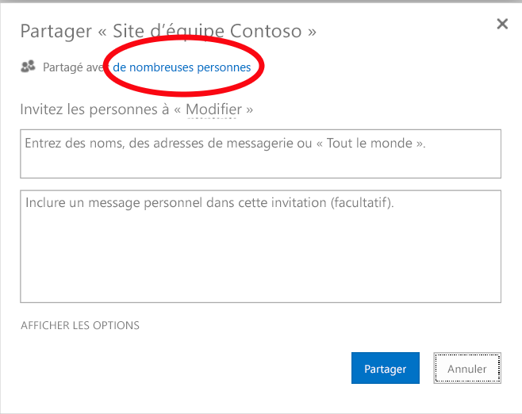
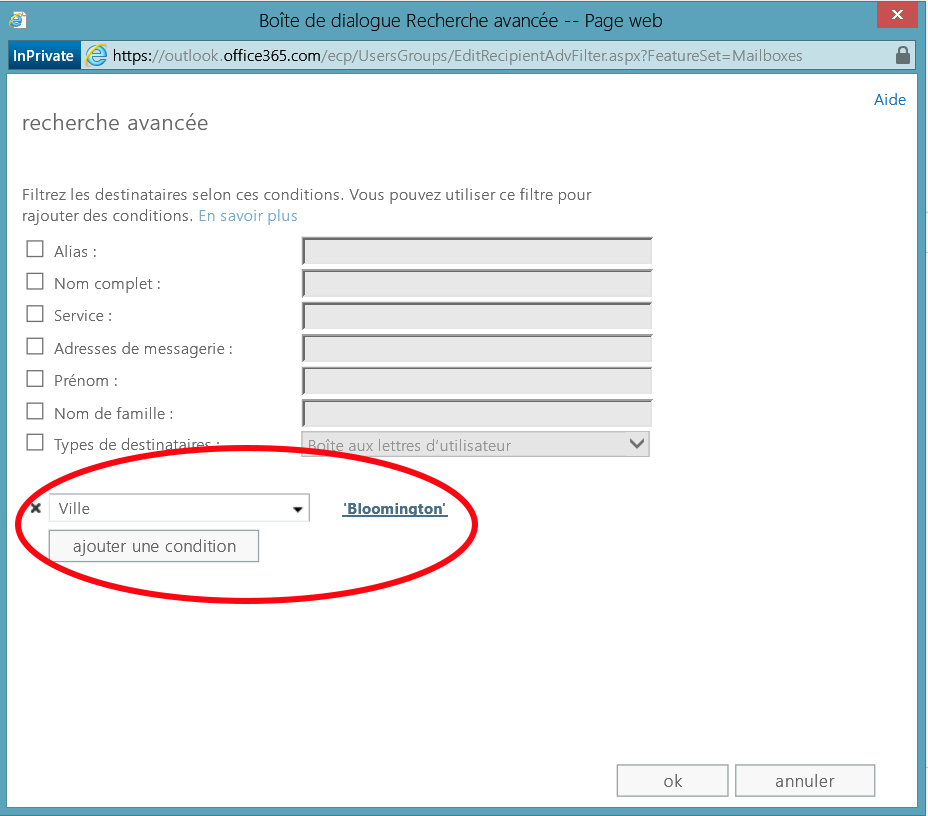
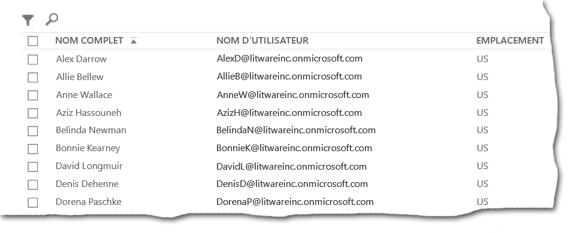
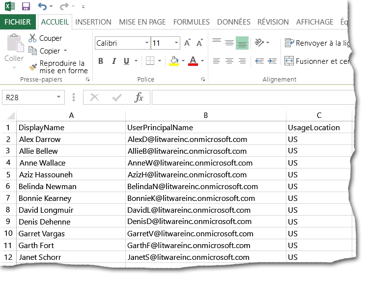

# <a name="why-you-need-to-use-office-365-powershell"></a>Pourquoi utiliser Office 365 PowerShell ?

 **Résumé :** Vous devez être en mesure d'utiliser Office 365 PowerShell pour gérer Office 365, que ce soit pour gagner en efficacité ou par nécessité.
  
Grâce au Centre d'administration Office 365, vous pouvez gérer non seulement vos comptes d'utilisateur et licences utilisateur Office 365, mais également vos produits serveur Office 365 : Exchange, Skype Entreprise Online et SharePoint Online. Toutefois, vous pouvez également gérer ces éléments avec les commandes Office 365 PowerShell, en tirant parti de la vitesse, de l'automatisation et des capacités supplémentaires offertes par un environnement de langage de script et de ligne de commande.
  
Dans cet article, nous allons vous montrer les façons dont vous pouvez utiliser Office 365 PowerShell pour gérer Office 365.
  
- Office 365 PowerShell peut révéler des informations supplémentaires qui ne sont pas visibles avec le Centre d'administration Office 365
    
- Office 365 est doté de fonctionnalités que vous pouvez uniquement configurer à l’aide d’Office 365 PowerShell
    
- Office 365 PowerShell est idéal pour effectuer des opérations en bloc
    
- Office 365 PowerShell est idéal pour filtrer des données
    
- Office 365 PowerShell facilite l’impression ou l’enregistrement des données
    
- Office 365 PowerShell vous permet de gérer tous les produits serveur
    
Avant de commencer, vous devez savoir qu’Office 365 PowerShell est constitué d’un ensemble de modules pour Windows PowerShell, un environnement de ligne de commande pour les services et les plateformes Windows. Cet environnement crée un langage d’interface de commande qui peut être étendu avec des modules supplémentaires et permet d’exécuter des commandes ou des scripts simples ou complexes. Par exemple, après avoir installé les modules Office 365 PowerShell et vous être connecté à votre abonnement Office 365, vous pouvez exécuter la commande suivante afin de répertorier toutes les boîtes aux lettres utilisateur pour Microsoft Exchange Online :
  
```
Get-Mailbox
```

Vous pouvez également exécuter cette commande pour calculer le nombre d'éléments dans toutes les listes de tous les sites pour toutes les applications web dans SharePoint Online :
  
```
Get-SPOSite -Limit All | Get-SPWeb -Limit All | % {$_.Lists} | ? {$_ -is [Microsoft.SharePoint.SPDocumentLibrary]} | % {$total+= $_.ItemCount}; $total
```

Vous pouvez facilement obtenir la liste des boîtes aux lettres à l'aide du Centre d'administration Office 365, mais il n'est pas simple de comptabiliser le nombre d'éléments dans toutes les listes de tous les sites pour toutes les applications web.
  
Notez qu'Office 365 PowerShell est conçu pour augmenter et améliorer votre capacité à gérer Office 365, et non pour remplacer le Centre d'administration Office 365. En tant qu'administrateur Office 365, vous devez être à l'aise avec l'utilisation d'Office 365 PowerShell, car certaines procédures de configuration ne peuvent être effectuées qu'avec des commandes Office 365 PowerShell. Dans ces cas, vous devez savoir comment effectuer les opérations suivantes :
  
- Installation des modules Office 365 PowerShell (effectuée une seule fois pour chaque ordinateur d'administrateur)
    
- Connexion à votre abonnement Office 365 (effectuée une fois pour chaque session PowerShell)
    
- Collecte des informations nécessaires pour exécuter les commandes Office 365 PowerShell obligatoires
    
- Exécution des commandes Office 365 PowerShell
    
Une fois que vous avez acquis ces compétences de base, vous n'êtes plus obligé de répertorier vos utilisateurs de boîte aux lettres avec la commande **Get-Mailbox**, ni de comprendre comment créer une commande comme la précédente pour comptabiliser tous les éléments de toutes les listes de tous les sites pour toutes les applications web. Microsoft et la communauté d'administrateurs Office 365 peuvent vous aider si nécessaire.
  
## <a name="office-365-powershell-can-reveal-additional-information-that-you-cannot-see-with-the-office-365-admin-center"></a>Office 365 PowerShell peut révéler des informations supplémentaires qui ne sont pas visibles avec le Centre d’administration Office 365
<a name="reveal"> </a>

Le Centre d'administration Office 365 affiche beaucoup d'informations utiles, mais cela ne signifie pas pour autant qu'il affiche toutes les informations stockées par Office 365 sur les utilisateurs, les licences, les boîtes aux lettres et les sites. Voici un exemple d' **utilisateurs et de groupes** dans le Centre d'administration Office 365 :
  

  
Dans de nombreux cas, cela permet d'afficher les informations que vous devez connaître. Toutefois, il peut arriver que vous ayez besoin de plus d'informations. Par exemple, la gestion des licences Office 365 (ainsi que les fonctionnalités Office 365 disponibles pour un utilisateur) dépendent en partie de l'emplacement géographique de l'utilisateur. Les stratégies et les fonctionnalités que vous pouvez étendre à un utilisateur qui vit aux États-Unis peuvent ne pas être les mêmes que celles que vous pouvez étendre à un utilisateur qui vit en Inde ou en Belgique. Pour utiliser le Centre d'administration Office 365 pour déterminer l'emplacement géographique d'un utilisateur, procédez comme suit :
  
1. Double-cliquez sur l'élément **Nom d'affichage** de l'utilisateur.
    
2. Dans le volet d'affichage des propriétés utilisateur, cliquez sur **détails**.
    
3. Dans l'affichage des détails, cliquez sur **détails supplémentaires**.
    
4. Faites défiler la liste vers le bas jusqu'à ce que vous voyiez l'en-tête **Pays ou région**:
    
     
  
5. Écrivez le nom d'affichage et l'emplacement de l'utilisateur sur un morceau de papier, ou copiez-le et collez-le dans le Bloc-notes. 
    
Vous devez répéter cette procédure pour chaque utilisateur. Si les utilisateurs sont nombreux, cela peut être une tâche fastidieuse. Avec Office 365 PowerShell, vous pouvez afficher ces informations pour tous les utilisateurs avec la commande suivante :
  
```
Get-MsolUser | Select DisplayName, UsageLocation
```

> [!NOTE]
> Cette commande exige que vous installiez le [module Windows Azure Active Directory](https://technet.microsoft.com/fr-FR/library/jj151815.aspx). 
  
Voici un exemple d’affichage :
  
```
DisplayName                               UsageLocation
-----------                               -------------
Zrinka Makovac                            US
Bonnie Kearney                            GB
Fabrice Canel                             BR
Brian Johnson (TAILSPIN)                  US
Anne Wallace                              US
Alex Darrow                               US
David Longmuir                            BR
```

> [!TIP]
>  L'interprétation de cette commande Office 365 PowerShell est la suivante : obtient tous les utilisateurs dans l'abonnement Office 365 en cours ( **Get-MsolUser** ), mais affiche uniquement le nom et l'emplacement de chaque utilisateur ( **Select DisplayName, UsageLocation** ).
  
Étant donné qu'Office 365 PowerShell prend en charge un langage d'interface de commande, vous pouvez manipuler davantage les informations obtenues à partir de la commande **Get-MSolUser**. Par exemple, peut-être aimeriez-vous trier ces utilisateurs par emplacement, en regroupant tous les utilisateurs brésiliens ensemble, tous les utilisateurs américains ensemble, etc. Voici la commande :
  
```
Get-MsolUser | Select DisplayName, UsageLocation | Sort UsageLocation, DisplayName
```

Voici un exemple d’affichage :
  
```
DisplayName                                 UsageLocation
-----------                                 -------------
David Longmuir                              BR
Fabrice Canel                               BR
Bonnie Kearney                              GB
Alex Darrow                                 US
Anne Wallace                                US
Brian Johnson (TAILSPIN)                    US
Zrinka Makovac                              US
```

> [!TIP]
>  L'interprétation de cette commande Office 365 PowerShell est la suivante : obtient tous les utilisateurs dans l'abonnement Office 365 en cours, mais affiche uniquement le nom et l'emplacement de chaque utilisateur et les trie d'abord par emplacement, puis par nom ( **Sort UsageLocation, DisplayName** ).
  
Vous pouvez également employer un filtrage supplémentaire. Par exemple, si vous voulez uniquement voir les informations relatives aux utilisateurs situés au Brésil, utilisez cette commande :
  
```
Get-MsolUser | Where {$_.UsageLocation -eq "BR"} | Select DisplayName, UsageLocation 
```

Voici un exemple d’affichage :
  
```
DisplayName                                           UsageLocation
-----------                                           -------------
David Longmuir                                        BR
Fabrice Canel                                         BR
```

> [!TIP]
>  L'interprétation de cette commande Office 365 PowerShell est la suivante : obtient tous les utilisateurs dans l'abonnement Office 365 en cours dont l'emplacement est le Brésil ( **Where {$\_.UsageLocation -eq "BR"}** ), puis affiche le nom et l'emplacement de chaque utilisateur.
  
 **Rapide remarque concernant les domaines plus volumineux**
  
Si vous avez un très grand domaine, disons avec des dizaines de milliers d'utilisateurs, l'exécution de certains des exemples que nous vous présentons dans cet article pourrait conduire à une « limitation de bande passante ». Cela signifie que, selon des éléments tels que la puissance de l'ordinateur et la bande passante réseau disponible, vous essayez d'effectuer un trop grand nombre d'actions à la fois. Pour cette raison, les organisations de plus grande taille pourraient vouloir diviser certaines de ces commandes Office 365 PowerShell en deux. Par exemple, cette commande renvoie tous les comptes d'utilisateur et affiche le nom et l'emplacement pour chacun d'entre eux :
  
```
Get-MsolUser | Select DisplayName, UsageLocation
```

Cela fonctionne bien pour les petits domaines. Dans une grande organisation, en revanche, vous devrez peut-être diviser cette commande en deux : une commande pour stocker les informations de compte d'utilisateur dans une variable et une autre commande pour afficher les informations nécessaires. Voici un exemple :
  
```
$x = Get-MsolUser
$x | Select DisplayName, UsageLocation
```


L’interprétation de cet ensemble de commandes Office 365 PowerShell est la suivante :
- Obtient tous les utilisateurs dans l’abonnement Office 365 en cours et stocke les informations dans une variable nommée $x ( **$x = Get-MsolUser** ).
- Affiche le contenu de la variable $x, mais inclut uniquement le nom et l’emplacement de chaque utilisateur ( **$x | Select DisplayName, UsageLocation** ).
  
## <a name="office-365-has-features-that-you-can-only-configure-with-office-365-powershell"></a>Office 365 est doté de fonctionnalités que vous pouvez uniquement configurer à l’aide d’Office 365 PowerShell
<a name="only"> </a>

Le Centre d'administration Office 365 est destiné à fournir un accès aux tâches les plus courantes ou significatives qui s'appliquent à la plupart des utilisateurs. En d'autres termes, le Centre d'administration Office 365 a été conçu pour qu'un administrateur standard puisse utiliser l'outil pour effectuer les tâches de gestion les plus courantes. Par définition, cela signifie que certaines tâches ne peuvent pas être accomplies à l'aide du Centre d'administration Office 365.
  
Par exemple, le Centre d'administration Skype Entreprise Online offre plusieurs options permettant de créer des invitations personnalisées aux réunions :
  

  
Avec ces paramètres, vous pouvez ajouter une touche de personnalisation et de professionnalisme aux invitations aux réunions. Cependant, les paramètres de configuration de réunion ne se résument pas à la simple création d'invitations personnalisées aux réunions. Par défaut, les réunions autorisent :
  
- les utilisateurs anonymes à obtenir une entrée automatique à chaque réunion ;
    
- les participants à enregistrer la réunion ;
    
- tous les utilisateurs de votre organisation à être désignés en tant que présentateurs lorsqu’ils rejoignent la réunion.
    
Ces paramètres ne sont pas disponibles à partir du Centre d'administration Skype Entreprise Online. Toutefois, vous pouvez les contrôler à partir d'Office 365 PowerShell. Voici une commande qui désactive ces trois paramètres :
  
```
Set-CsMeetingConfiguration -AdmitAnonymousUsersByDefault $False -AllowConferenceRecording $False -DesignateAsPresenter "None"
```

> [!NOTE]
> Cette commande exige que vous installiez le [module Windows PowerShell pour Skype Entreprise Online](https://www.microsoft.com/download/details.aspx?id=39366). 
  
> [!TIP]
>  L'interprétation de cette commande Office 365 PowerShell est la suivante : pour les paramètres des nouvelles réunions Skype Entreprise Online ( **Set-CsMeetingConfiguration** ), désactive l'autorisation des utilisateurs anonymes à obtenir une entrée automatique aux réunions ( **-AdmitAnonymousUsersByDefault $False** ), désactive la capacité des participants à enregistrer des réunions ( **-AllowConferenceRecording $False** ) et ne désigne pas tous les utilisateurs de votre organisation en tant que présentateurs ( **-DesignateAsPresenter "None"** ).
  
Si vous changez d’avis et souhaitez restaurer ces paramètres par défaut (tous les activer), exécutez la commande suivante :
  
```
Set-CsMeetingConfiguration -AdmitAnonymousUsersByDefault $True -AllowConferenceRecording $True -DesignateAsPresenter "Company"
```

Il s'agit juste d'un exemple. Il en existe d'autres, raison pour laquelle, en tant qu'administrateur Office 365, vous devez être à l'aise avec l'exécution des commandes Office 365 PowerShell.
  
## <a name="office-365-powershell-is-great-at-carrying-out-bulk-operations"></a>Office 365 PowerShell est idéal pour effectuer des opérations en bloc
<a name="bulk"> </a>

Historiquement, les interfaces visuelles comme le Centre d'administration Office 365 sont plus adaptées lorsque vous avez une seule opération à effectuer. Par exemple, si vous avez besoin de désactiver un compte d'utilisateur, vous pouvez utiliser le Centre d'administration Office 365 pour le localiser rapidement et désélectionner la case à cocher. Cela peut être plus simple que d'exécuter une opération similaire dans Office 365 PowerShell.
  
Toutefois, si vous voulez modifier de nombreux éléments ou certains éléments sélectionnés parmi un ensemble plus vaste, le Centre d'administration Office 365 n'est peut-être pas la solution la plus adaptée. Par exemple, si vous deviez modifier le préfixe de milliers de numéros de téléphone ou que vous aviez besoin de supprimer un utilisateur spécifique, à savoir Ken Myer, de tous vos sites SharePoint Online, comment feriez-vous dans le Centre d'administration Office 365 ?
  
Pour ce dernier exemple, vous disposez de plusieurs centaines de sites SharePoint Online et vous ne savez même pas desquels Ken Meyer est membre. Cela signifie que vous devrez commencer dans le Centre d'administration Office 365, puis effectuer cette procédure pour chaque site :
  
1. Cliquez sur l' **URL** du site.
    
2. Dans la zone **Propriétés de la collection de sites**, cliquez sur le lien **Adresse du site web** pour accéder au site.
    
3. Sur le site, cliquez sur **Partager**.
    
4. Dans la boîte de dialogue **Partager**, cliquez sur le lien qui affiche tous les utilisateurs disposant d'autorisations sur le site :
    
     
  
5. Dans la boîte de dialogue **Partagé avec**, cliquez sur **Avancé**.
    
6. Faites défiler vers le bas la liste des utilisateurs, recherchez et sélectionnez Ken Myer (en supposant qu'il dispose d'autorisations sur le site), puis cliquez sur **Supprimer les autorisations des utilisateurs**.
    
Réaliser la procédure pour plusieurs centaines de sites peut prendre un certain temps.
  
L'alternative consiste à utiliser Office 365 PowerShell et la commande suivante pour supprimer Ken Myer de tous vos sites :
  
```
Get-SPOSite | ForEach {Remove-SPOUser -Site $_.Url -LoginName "kenmyer@litwareinc.com"}
```

> [!NOTE]
> Cette commande exige que vous installiez le [module Windows PowerShell pour Sharepoint Online](https://technet.microsoft.com/library/fp161372.aspx). 
  
> [!TIP]
>  L'interprétation de cette commande Office 365 PowerShell est la suivante : obtient tous les sites SharePoint dans l'abonnement Office 365 en cours ( **Get-SPOSite** ) et, pour chaque site, supprime Ken Meyer dans la liste des utilisateurs qui peuvent y accéder ( **ForEach {Remove-SPOUser -Site $\_.Url -LoginName "kenmyer@litwareinc.com"}** ).
  
Étant donné que nous indiquons à Office 365 de supprimer Ken Meyer de chaque site, y compris de ceux auxquels il n'a pas accès, l'affichage de cette commande indiquera des erreurs pour les sites auxquels il n'a pas accès actuellement. Nous pouvons utiliser une condition supplémentaire sur cette commande pour supprimer Ken Meyer uniquement des sites qui l'ont dans leur liste de connexion, mais les erreurs répertoriées ne nuisent pas aux sites eux-mêmes. L'exécution de cette commande sur des centaines de sites peut prendre quelques minutes, plutôt que des heures par le biais du Centre d'administration Office 365.
  
Voici un autre exemple d’opération en bloc. Utilisez cette commande pour ajouter Bonnie Kearney, une nouvelle administratrice SharePoint, à tous les sites de l’organisation :
  
```
Get-SPOSite | ForEach {Add-SPOUser -Site $_.Url -LoginName "bkearney@litwareinc.com" -Group "Members"}
```

> [!TIP]
>  L'interprétation de cette commande Office 365 PowerShell est la suivante : obtient tous les sites SharePoint dans l'abonnement Office 365 en cours et, pour chaque site, octroie l'accès à Bonnie Kearney en ajoutant son nom de connexion au groupe de membres du site ( **ForEach {Add-SPOUser -Site $\_.Url -LoginName "bkearney@litwareinc.com" -Group "Members"}** ).
  
## <a name="office-365-powershell-is-great-at-filtering-data"></a>Office 365 PowerShell est idéal pour filtrer des données
<a name="filter"> </a>

Le Centre d'administration Office 365 propose plusieurs façons différentes de filtrer vos données afin de localiser rapidement et facilement un sous-ensemble ciblé d'informations. Par exemple, Exchange facilite le filtrage sur pratiquement toutes les propriétés de la boîte aux lettres d'un utilisateur. Par exemple, voici la liste des boîtes aux lettres de tous les utilisateurs qui habitent Bloomington :
  

  
Le Centre d'administration Exchange vous permet également de combiner des critères de filtre. Par exemple, vous pouvez trouver les boîtes aux lettres de toutes les personnes qui habitent à Bloomington et travaillent dans le service Finances. 
  
Toutefois, il existe des limites à ce que vous pouvez faire dans le Centre d'administration Exchange. Par exemple, vous souhaitez peut-être trouver les boîtes aux lettres des personnes qui habitent à Bloomington ou San Diego, ou les boîtes aux lettres de toutes les personnes qui n'habitent pas à Bloomington. 
  
Avec Office 365 PowerShell, vous pouvez obtenir la liste des boîtes aux lettres de toutes les personnes qui habitent dans les villes de Bloomington ou San Diego avec cette commande :
  
```
Get-User | Where {$_.RecipientTypeDetails -eq "UserMailbox" -and ($_.City -eq "San Diego" -or $_.City -eq "Bloomington")} | Select DisplayName, City
```

Voici un exemple d’affichage :
  
```
DisplayName                              City
-----------                              ----
Alex Darrow                              San Diego
Bonnie Kearney                           San Diego
Julian Isla                              Bloomington
Rob Young                                Bloomington
Zrinka Makovac                           San Diego
```

> [!TIP]
>  L'interprétation de cette commande Office 365 PowerShell est la suivante : obtient tous les utilisateurs dans l'abonnement Office 365 en cours qui ont une boîte aux lettres dans les villes de San Diego ou Bloomington ( **Where {$\_.RecipientTypeDetails -eq "UserMailbox" -and ($\_.City -eq "San Diego" -or $\_.City -eq "Bloomington")}** ), puis affiche le nom et la ville de chacun d'entre eux ( **Select DisplayName, City** ).
  
Pour répertorier toutes les boîtes aux lettres des personnes habitant n’importe où sauf à Bloomington, voici la commande :
  
```
Get-User | Where {$_.RecipientTypeDetails -eq "UserMailbox" -and $_.City -ne "Bloomington"} | Select DisplayName, City
```

Voici un exemple d’affichage :
  
```
DisplayName                               City
-----------                               ----
MOD Administrator                         Redmond
Alex Darrow                               San Diego
Allie Bellew                              Bellevue
Anne Wallace                              Louisville
Aziz Hassouneh                            Cairo
Belinda Newman                            Charlotte
Bonnie Kearney                            San Diego
David Longmuir                            Waukesha
Denis Dehenne                             Birmingham
Garret Vargas                             Seattle
Garth Fort                                Tulsa
Janet Schorr                              Bellevue
```

> [!TIP]
>  L'interprétation de cette commande Office 365 PowerShell est la suivante : obtient tous les utilisateurs dans l'abonnement Office 365 en cours qui ont une boîte aux lettres ne se trouvant pas à Bloomington ( **Where {$\_.RecipientTypeDetails -eq "UserMailbox" -and $\_.City -ne "Bloomington"}** ), puis affiche le nom et la ville de chacun d'entre eux.
  
Vous pouvez également utiliser des caractères génériques dans vos filtres Office 365 PowerShell pour faire correspondre une partie du nom. Par exemple, supposons que vous recherchiez un compte d'utilisateur et que vous vous rappeliez uniquement que son nom est Anderson, ou Henderson, ou bien Jorgenson.
  
Vous pouvez identifier cet utilisateur dans le Centre d'administration Office 365 en utilisant l'outil de recherche et en effectuant trois recherches différentes :
  
- Une sur  *Anderson* 
    
- Une sur  *Henderson* 
    
- Une sur  *Jorgenson* 
    
Étant donné que ces trois noms se terminent tous par « son », vous pouvez indiquer à Office 365 PowerShell d'afficher tous les utilisateurs dont le nom se termine par « son ». Voici la commande :
  
```
Get-User -Filter '{LastName -like "*son"}'
```

> [!TIP]
>  L'interprétation de cette commande Office 365 PowerShell est la suivante : Obtient dans l'abonnement Office 365 en cours, mais utilise un filtre qui répertorie uniquement les utilisateurs dont le nom se termine par « son » ( **-Filter '{LastName -like "\*son"}'** ). Le symbole \* signifie n'importe quel jeu de caractères, qui sont des lettres dans le cas du nom d'un utilisateur.
  
## <a name="office-365-powershell-makes-it-easy-to-print-or-save-data"></a>Office 365 PowerShell facilite l’impression ou l’enregistrement des données
<a name="printsave"> </a>

Le Centre d'administration Office 365 vous permet de visualiser des listes de données. Voici un exemple dans lequel le Centre d'administration Skype Entreprise Online affiche la liste des utilisateurs qui ont été activés pour Skype Entreprise Online :
  

  
Pour enregistrer ces informations dans un fichier, vous devez les copier-coller dans un document ou dans Excel. Dans les deux cas, la copie peut nécessiter une mise en forme supplémentaire. En outre, le Centre d'administration Office 365 ne permet pas d'imprimer directement la liste affichée.
  
Heureusement, vous pouvez utiliser Office 365 PowerShell non seulement pour afficher la liste, mais aussi pour l'enregistrer dans un fichier qui peut être facilement importé dans Excel. Voici un exemple de commande permettant d'enregistrer des données utilisateur Skype Entreprise Online dans un fichier au format CSV (valeurs séparées par des virgules), fichier qui peut être facilement importé sous forme de tableau dans une feuille de calcul Excel :
  
```
Get-CsOnlineUser | Select DisplayName, UserPrincipalName, UsageLocation | Export-Csv -Path "C:\Logs\SfBUsers.csv" -NoTypeInformation
```

Voici un exemple d’affichage :
  

  
> [!TIP]
>  L'interprétation de cette commande Office 365 PowerShell est la suivante : obtient tous les utilisateurs Skype Entreprise Online dans l'abonnement Office 365 en cours ( **Get-CsOnlineUser** ), obtient uniquement le nom d'utilisateur, l'UPN et l'emplacement ( **Select DisplayName, UserPrincipalName, UsageLocation** ), puis enregistre ces informations dans un fichier CSV nommé C:\\Logs\\SfBUsers.csv ( **Export-Csv -Path "C:\\Logs\\SfBUsers.csv" -NoTypeInformation** ).
  
Vous pouvez également utiliser des options pour enregistrer cette liste sous forme de fichier XML ou de page HTML. En fait, avec les commandes PowerShell supplémentaires, vous pouvez l’enregistrer directement dans un fichier Excel, avec la mise en forme personnalisée de votre choix. 
  
Vous pouvez également envoyer la sortie d'une commande Office 365 PowerShell qui affiche une liste directement à l'imprimante par défaut dans Windows. Voici un exemple de commande :
  
```
Get-CsOnlineUser | Select DisplayName, UserPrincipalName, UsageLocation | Out-Printer
```

Le document imprimé aura l'apparence suivante :
  

  
> [!TIP]
>  L'interprétation de cette commande Office 365 PowerShell est la suivante : obtient tous les utilisateurs Skype Entreprise Online dans l'abonnement Office 365 en cours, obtient uniquement le nom d'utilisateur, l'UPN et l'emplacement, puis envoie ces informations à l'imprimante Windows par défaut ( **Out-Printer** ).
  
Le document imprimé a la même mise en forme simple que l'affichage dans la fenêtre de commande Office 365 PowerShell, mais une fois que vous avez créé une commande Office 365 PowerShell pour répertorier ce dont vous avez besoin, vous ajoutez simplement **| Out-Printer** à la fin de la commande pour obtenir une sortie papier sur laquelle travailler.
  
## <a name="office-365-powershell-lets-you-manage-across-server-products"></a>Office 365 PowerShell vous permet de gérer tous les produits serveur
<a name="printsave"> </a>

Les différents composants qui constituent Office 365 sont conçus pour fonctionner ensemble. Par exemple, supposons que vous ajoutiez un nouvel utilisateur à Office 365 et que vous spécifiez des informations telles que le service de l'utilisateur et son numéro de téléphone. Ces informations sont ensuite disponibles si vous accédez aux informations de l'utilisateur à l'aide des produits serveur Office 365 : Skype Entreprise Online, Exchange ou SharePoint Online.
  
Toutefois, ceci concerne les informations communes qui couvrent une suite de produits. Les informations propres à un produit (par exemple, des informations sur la boîte aux lettres Exchange d'un utilisateur) ne sont généralement pas disponibles dans la suite. Par exemple, si vous voulez savoir si la boîte aux lettres d'un utilisateur est activée ou non, cette information est disponible uniquement dans le Centre d'administration Exchange. 
  
Supposons que vous souhaitiez établir un rapport qui présente les informations suivantes pour tous les utilisateurs :
  
- Nom complet de l'utilisateur
    
- Si l'utilisateur dispose d'une licence pour Office 365
    
- Si la boîte aux lettres Exchange de l'utilisateur a été activée
    
- Si l'utilisateur est activé pour Skype Entreprise Online
    
Vous ne pouvez pas utiliser actuellement le Centre d'administration Office 365 pour générer facilement ce type de rapport. À la place, vous devrez créer un document distinct dans lequel stocker les informations, comme une feuille de calcul Excel, et obtenir tous les noms d'utilisateur et toutes les informations de licence à partir du Centre d'administration Office 365, obtenir des informations de boîte aux lettres à partir du Centre d'administration Exchange, obtenir des informations sur Skype Entreprise Online à partir du Centre d'administration Skype Entreprise Online, puis assembler et combiner ces informations.
  
L'alternative consiste à utiliser un script Office 365 PowerShell pour compiler ce rapport pour vous.
  
L'exemple de script suivant est plus complexe que les commandes que vous avez vues jusqu'à présent dans cet article. Toutefois, il affiche le potentiel offert par l'utilisation d'Office 365 PowerShell pour créer des vues d'informations qui sont difficiles à réaliser autrement. Voici le script qui peut compiler et afficher la liste nécessaire :
  
```
$x = Get-MsolUser

foreach ($i in $x)
    {
      $y = Get-Mailbox -Identity $i.UserPrincipalName
      $i | Add-Member -MemberType NoteProperty -Name IsMailboxEnabled -Value $y.IsMailboxEnabled

      $y = Get-CsOnlineUser -Identity $i.UserPrincipalName
      $i | Add-Member -MemberType NoteProperty -Name EnabledForSfB -Value $y.Enabled
    }

$x | Select DisplayName, IsLicensed, IsMailboxEnabled, EnabledforSfB
```

Voici un exemple d’affichage :
  
```
DisplayName             IsLicensed   IsMailboxEnabled   EnabledForSfB
-----------             ----------   ----------------   --------------
Zrinka Makovac          True         True               True
Bonnie Kearney          True         True               True
Fabrice Canel           True         True               True
Brian Johnson           False        True               False
Anne Wallace            True         True               True
Alex Darrow             True         True               True
David Longmuir          True         True               True
Katy Jordan             False        True               False
Molly Dempsey           False        True               False
```

L’interprétation de ce script Office 365 PowerShell est la suivante :  
- Obtient tous les utilisateurs dans l’abonnement Office 365 en cours et stocke les informations dans une variable nommée $x ( **$x = Get-MsolUser** ).
- Démarre une boucle qui s’exécute sur tous les utilisateurs dans la variable nommée $x ( **foreach ($i in $x)** ).  
- Définit une variable nommée $y et y stocke des informations sur la boîte aux lettres de l’utilisateur ( **$y = Get-Mailbox -Identity $i.UserPrincipalName** ).
- Ajoute une nouvelle propriété dans les informations utilisateur nommée IsMailBoxEnabled et la définit sur la valeur de la propriété IsMailBoxEnabled de la boîte aux lettres de l’utilisateur ( **$i | Add-Member -MemberType NoteProperty -Name IsMailboxEnabled -Value $y.IsMailboxEnabled** ).
- Définit une variable nommée $y et y stocke les informations Skype Entreprise Online de l’utilisateur ( **$y = Get-CsOnlineUser -Identity $i.UserPrincipalName** ).
- Ajoute une nouvelle propriété dans les informations utilisateur nommée EnabledForSfB et la définit sur la valeur de la propriété Enabled des informations Skype Entreprise Online ( **$i | Add-Member -MemberType NoteProperty -Name EnabledForSfB -Value $y.Enabled** ).
- Affiche la liste des utilisateurs, mais indique uniquement leur nom, s’ils disposent d’une licence, et les deux nouvelles propriétés qui spécifient si leur boîte aux lettres est activée et si elles sont activées pour Skype Entreprise Online ( **$x | Select DisplayName, IsLicensed, IsMailboxEnabled, EnabledforSfB** ).
  
## <a name="see-also"></a>Voir aussi


#### 

[Mise en route d’Office 365 Powershell](getting-started-with-office-365-powershell.md)
  
[Gérer les comptes d'utilisateurs et les licences avec Office 365 PowerShell](manage-user-accounts-and-licenses-with-office-365-powershell.md)
  
[Utilisez Windows PowerShell pour créer des rapports dans Office 365](use-windows-powershell-to-create-reports-in-office-365.md)

