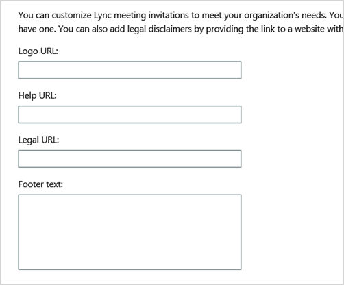

# <a name="why-you-need-to-use-office-365-powershell"></a><span data-ttu-id="b9fae-103">Pourquoi utiliser Office 365 PowerShell ?</span><span class="sxs-lookup"><span data-stu-id="b9fae-103">Why you need to use Office 365 PowerShell</span></span>

 <span data-ttu-id="b9fae-104">**Résumé :** Vous devez être en mesure d'utiliser Office 365 PowerShell pour gérer Office 365, que ce soit pour gagner en efficacité ou par nécessité.</span><span class="sxs-lookup"><span data-stu-id="b9fae-104">**Summary:** Understand why you must use Office 365 PowerShell to manage Office 365, in some cases more efficiently and in other cases by necessity.</span></span>
  
<span data-ttu-id="b9fae-p101">Grâce au Centre d'administration Office 365, vous pouvez gérer non seulement vos comptes d'utilisateur et licences utilisateur Office 365, mais également vos produits serveur Office 365 : Exchange, Skype Entreprise Online et SharePoint Online. Toutefois, vous pouvez également gérer ces éléments avec les commandes Office 365 PowerShell, en tirant parti de la vitesse, de l'automatisation et des capacités supplémentaires offertes par un environnement de langage de script et de ligne de commande.</span><span class="sxs-lookup"><span data-stu-id="b9fae-p101">With the Office 365 admin center, you can not only manage your Office 365 user accounts and licenses, but you can also manage your Office 365 server products: Exchange, Skype for Business Online, and SharePoint Online. However, you can also manage these elements with Office 365 PowerShell commands, taking advantage of a command-line and scripting language environment for speed, automation, and additional capability.</span></span>
  
<span data-ttu-id="b9fae-107">Dans cet article, nous allons vous montrer les façons dont vous pouvez utiliser Office 365 PowerShell pour gérer Office 365.</span><span class="sxs-lookup"><span data-stu-id="b9fae-107">In this article, we'll show you these ways in which you can use Office 365 PowerShell to manage Office 365.</span></span>
  
- <span data-ttu-id="b9fae-108">Office 365 PowerShell peut révéler des informations supplémentaires qui ne sont pas visibles avec le Centre d'administration Office 365</span><span class="sxs-lookup"><span data-stu-id="b9fae-108">Office 365 PowerShell can reveal additional information that you cannot see with the Office 365 admin center</span></span>
    
- <span data-ttu-id="b9fae-109">Office 365 est doté de fonctionnalités que vous pouvez uniquement configurer à l’aide d’Office 365 PowerShell</span><span class="sxs-lookup"><span data-stu-id="b9fae-109">Office 365 has features that you can only configure by using Office 365 PowerShell</span></span>
    
- <span data-ttu-id="b9fae-110">Office 365 PowerShell est idéal pour effectuer des opérations en bloc</span><span class="sxs-lookup"><span data-stu-id="b9fae-110">Office 365 PowerShell is great at performing bulk operations</span></span>
    
- <span data-ttu-id="b9fae-111">Office 365 PowerShell est idéal pour filtrer des données</span><span class="sxs-lookup"><span data-stu-id="b9fae-111">Office 365 PowerShell is great at filtering data</span></span>
    
- <span data-ttu-id="b9fae-112">Office 365 PowerShell facilite l’impression ou l’enregistrement des données</span><span class="sxs-lookup"><span data-stu-id="b9fae-112">Office 365 PowerShell makes it easy to print or save data</span></span>
    
- <span data-ttu-id="b9fae-113">Office 365 PowerShell vous permet de gérer tous les produits serveur</span><span class="sxs-lookup"><span data-stu-id="b9fae-113">Office 365 PowerShell lets you manage across server products</span></span>
    
<span data-ttu-id="b9fae-p102">Avant de commencer, vous devez savoir qu’Office 365 PowerShell est constitué d’un ensemble de modules pour Windows PowerShell, un environnement de ligne de commande pour les services et les plateformes Windows. Cet environnement crée un langage d’interface de commande qui peut être étendu avec des modules supplémentaires et permet d’exécuter des commandes ou des scripts simples ou complexes. Par exemple, après avoir installé les modules Office 365 PowerShell et vous être connecté à votre abonnement Office 365, vous pouvez exécuter la commande suivante afin de répertorier toutes les boîtes aux lettres utilisateur pour Microsoft Exchange Online :</span><span class="sxs-lookup"><span data-stu-id="b9fae-p102">Before you begin, understand that Office 365 PowerShell is a set of modules for Windows PowerShell, a command-line environment for Windows-based services and platforms. This environment creates a command shell language that can be extended with additional modules and provides a way to execute simple or complex commands or scripts. For example, after you install the Office 365 PowerShell modules and connect to your Office 365 subscription, you can run this command to list all of the user mailboxes for Microsoft Exchange Online:</span></span>
  
```
Get-Mailbox
```

<span data-ttu-id="b9fae-117">Vous pouvez facilement obtenir la liste des boîtes aux lettres à l'aide du Centre d'administration Office 365, mais il n'est pas simple de comptabiliser le nombre d'éléments dans toutes les listes de tous les sites pour toutes les applications web.</span><span class="sxs-lookup"><span data-stu-id="b9fae-117">Getting the list of mailboxes can also be easily done using the Office 365 admin center, but counting the number of items in all of the lists for all of the sites for all of your web apps cannot be easily done.</span></span>
  
<span data-ttu-id="b9fae-p103">Notez qu'Office 365 PowerShell est conçu pour augmenter et améliorer votre capacité à gérer Office 365, et non pour remplacer le Centre d'administration Office 365. En tant qu'administrateur Office 365, vous devez être à l'aise avec l'utilisation d'Office 365 PowerShell, car certaines procédures de configuration ne peuvent être effectuées qu'avec des commandes Office 365 PowerShell. Dans ces cas, vous devez savoir comment effectuer les opérations suivantes :</span><span class="sxs-lookup"><span data-stu-id="b9fae-p103">Please note that Office 365 PowerShell is designed to augment and enhance your ability to manage Office 365, not to replace the Office 365 admin center. As an Office 365 administrator, you must become at least comfortable with using Office 365 PowerShell because there are some configuration procedures that can only be done with Office 365 PowerShell commands. In these cases, you will be required to understand how to:</span></span>
  
- <span data-ttu-id="b9fae-121">Installation des modules Office 365 PowerShell (effectuée une seule fois pour chaque ordinateur d'administrateur)</span><span class="sxs-lookup"><span data-stu-id="b9fae-121">Install the Office 365 PowerShell modules (done only once for each administrator computer).</span></span>
    
- <span data-ttu-id="b9fae-122">Connexion à votre abonnement Office 365 (effectuée une fois pour chaque session PowerShell)</span><span class="sxs-lookup"><span data-stu-id="b9fae-122">Connect to your Office 365 subscription (done once for each PowerShell session).</span></span>
    
- <span data-ttu-id="b9fae-123">Collecte des informations nécessaires pour exécuter les commandes Office 365 PowerShell obligatoires</span><span class="sxs-lookup"><span data-stu-id="b9fae-123">Gather the information needed to run the required Office 365 PowerShell commands.</span></span>
    
- <span data-ttu-id="b9fae-124">Exécution des commandes Office 365 PowerShell</span><span class="sxs-lookup"><span data-stu-id="b9fae-124">Run the Office 365 PowerShell commands successfully.</span></span>
    
<span data-ttu-id="b9fae-p104">Une fois que vous avez acquis ces compétences de base, vous n'êtes plus obligé de répertorier vos utilisateurs de boîte aux lettres avec la commande **Get-Mailbox**, ni de comprendre comment créer une commande comme la précédente pour comptabiliser tous les éléments de toutes les listes de tous les sites pour toutes les applications web. Microsoft et la communauté d'administrateurs Office 365 peuvent vous aider si nécessaire.</span><span class="sxs-lookup"><span data-stu-id="b9fae-p104">After learning these basic skills, you are not required to list your mailbox users with **Get-Mailbox** command, nor are you required to understand how to create a new command like the previous one to count all the items in all the lists for all of the sites for all of your web apps. Microsoft and the community of Office 365 administrators can help you with that as needed.</span></span>
  
## <a name="office-365-powershell-can-reveal-additional-information-that-you-cannot-see-with-the-office-365-admin-center"></a><span data-ttu-id="b9fae-127">Office 365 PowerShell peut révéler des informations supplémentaires qui ne sont pas visibles avec le Centre d’administration Office 365</span><span class="sxs-lookup"><span data-stu-id="b9fae-127">Office 365 PowerShell can reveal additional information that you cannot see with the Office 365 admin center</span></span>

<span data-ttu-id="b9fae-p105">Le Centre d'administration Office 365 affiche beaucoup d'informations utiles, mais cela ne signifie pas pour autant qu'il affiche toutes les informations stockées par Office 365 sur les utilisateurs, les licences, les boîtes aux lettres et les sites. Voici un exemple d' **utilisateurs et de groupes** dans le Centre d'administration Office 365 :</span><span class="sxs-lookup"><span data-stu-id="b9fae-p105">The Office 365 admin center displays a lot of useful information, but that doesn't mean that it displays all the possible information that Office 365 stores on users, licenses, mailboxes, and sites. Here is an example for **users and groups** in the Office 365 admin center:</span></span>
  

  
<span data-ttu-id="b9fae-p106">Pour plusieurs objectifs, il affiche les informations que vous devez connaître. Toutefois, il existe plus d’informations, vous devez parfois. Par exemple, Office 365 licensing (et les fonctionnalités disponibles pour un utilisateur d’Office 365) dépendent en partie de la position géographique de l’utilisateur. Les stratégies et les fonctionnalités que vous pouvez étendre à un utilisateur qui réside aux États-Unis ne peuvent pas être la même que les stratégies et les fonctionnalités que vous pouvez étendre à un utilisateur qui se trouve en Inde ou en Belgique. Vous pouvez utiliser le centre d’administration Office 365 pour déterminer l’emplacement géographique d’un utilisateur en suivant ces étapes :</span><span class="sxs-lookup"><span data-stu-id="b9fae-p106">For many purposes, this displays the information you need to know. However, there are times when you need more. For example, Office 365 licensing (and the Office 365 features available to a user) depend in part on that user's geographic location. The policies and features you can extend to a user who lives in the United States might not be the same as the policies and features you can extend to a user who lives in India or in Belgium. You can use the Office 365 admin center to determine a user's geographic location with these steps:</span></span>
  
1. <span data-ttu-id="b9fae-136">Double-cliquez sur l'élément **Nom d'affichage** de l'utilisateur.</span><span class="sxs-lookup"><span data-stu-id="b9fae-136">Double-click the user's **Display Name**.</span></span>
    
2. <span data-ttu-id="b9fae-137">Dans le volet d'affichage des propriétés utilisateur, cliquez sur **détails**.</span><span class="sxs-lookup"><span data-stu-id="b9fae-137">In the user properties display pane, click **details**.</span></span>
    
3. <span data-ttu-id="b9fae-138">Dans l'affichage des détails, cliquez sur **détails supplémentaires**.</span><span class="sxs-lookup"><span data-stu-id="b9fae-138">In the details display, click **additional details**.</span></span>
    
4. <span data-ttu-id="b9fae-139">Faites défiler la liste vers le bas jusqu'à ce que vous voyiez l'en-tête **Pays ou région**:</span><span class="sxs-lookup"><span data-stu-id="b9fae-139">Scroll down until you see the heading **Country or region**:</span></span>
    
     
  
5. <span data-ttu-id="b9fae-141">Écrivez le nom d'affichage et l'emplacement de l'utilisateur sur un morceau de papier, ou copiez-le et collez-le dans le Bloc-notes.</span><span class="sxs-lookup"><span data-stu-id="b9fae-141">Write the user's display name and location on a piece of paper, or copy and paste it into Notepad.</span></span> 
    
<span data-ttu-id="b9fae-p107">Vous devez répéter cette procédure pour chaque utilisateur. Si les utilisateurs sont nombreux, cela peut être une tâche fastidieuse. Avec Office 365 PowerShell, vous pouvez afficher ces informations pour tous les utilisateurs avec la commande suivante :</span><span class="sxs-lookup"><span data-stu-id="b9fae-p107">You must repeat this procedure for each user. For many users, this can be a tedious task. With Office 365 PowerShell, you can display this information for all of your users with the following command:</span></span>
  
```
Get-MsolUser | Select DisplayName, UsageLocation
```

> [!NOTE]
> <span data-ttu-id="b9fae-145">Cette commande exige que vous installiez le [module Windows Azure Active Directory](https://docs.microsoft.com/powershell/module/Azuread/?view=azureadps-2.0).</span><span class="sxs-lookup"><span data-stu-id="b9fae-145">This command requires you to install the [Windows Azure Active Directory module](https://docs.microsoft.com/powershell/module/Azuread/?view=azureadps-2.0).</span></span> 
  
<span data-ttu-id="b9fae-146">Voici un exemple d’affichage :</span><span class="sxs-lookup"><span data-stu-id="b9fae-146">Here is an example of the display:</span></span>
  
```
DisplayName                               UsageLocation
-----------                               -------------
Zrinka Makovac                            US
Bonnie Kearney                            GB
Fabrice Canel                             BR
Brian Johnson (TAILSPIN)                  US
Anne Wallace                              US
Alex Darrow                               US
David Longmuir                            BR
```

> [!TIP]
>  <span data-ttu-id="b9fae-147">L'interprétation de cette commande Office 365 PowerShell est la suivante : obtient tous les utilisateurs dans l'abonnement Office 365 en cours ( **Get-MsolUser** ), mais affiche uniquement le nom et l'emplacement de chaque utilisateur ( **Select DisplayName, UsageLocation** ).</span><span class="sxs-lookup"><span data-stu-id="b9fae-147">The interpretation of this Office 365 PowerShell command is: Get all of the users in the current Office 365 subscription ( **Get-MsolUser** ), but only display the name and location for each user ( **Select DisplayName, UsageLocation** ).</span></span>
  
<span data-ttu-id="b9fae-p108">Étant donné qu'Office 365 PowerShell prend en charge un langage d'interface de commande, vous pouvez manipuler davantage les informations obtenues à partir de la commande **Get-MSolUser**. Par exemple, peut-être aimeriez-vous trier ces utilisateurs par emplacement, en regroupant tous les utilisateurs brésiliens ensemble, tous les utilisateurs américains ensemble, etc. Voici la commande :</span><span class="sxs-lookup"><span data-stu-id="b9fae-p108">Because Office 365 PowerShell supports a command shell language, you can further manipulate the information obtained from the **Get-MSolUser** command. For example, maybe you'd like to sort these users by their location, grouping all the Brazilian users together, all the United States users together, etc. Here is the command:</span></span>
  
```
Get-MsolUser | Select DisplayName, UsageLocation | Sort UsageLocation, DisplayName
```

<span data-ttu-id="b9fae-150">Voici un exemple d’affichage :</span><span class="sxs-lookup"><span data-stu-id="b9fae-150">Here is an example of the display:</span></span>
  
```
DisplayName                                 UsageLocation
-----------                                 -------------
David Longmuir                              BR
Fabrice Canel                               BR
Bonnie Kearney                              GB
Alex Darrow                                 US
Anne Wallace                                US
Brian Johnson (TAILSPIN)                    US
Zrinka Makovac                              US
```

> [!TIP]
>  <span data-ttu-id="b9fae-151">L'interprétation de cette commande Office 365 PowerShell est la suivante : obtient tous les utilisateurs dans l'abonnement Office 365 en cours, mais affiche uniquement le nom et l'emplacement de chaque utilisateur et les trie d'abord par emplacement, puis par nom ( **Sort UsageLocation, DisplayName** ).</span><span class="sxs-lookup"><span data-stu-id="b9fae-151">The interpretation of this Office 365 PowerShell command is: Get all of the users in the current Office 365 subscription, but only display the name and location for each user and sort them first by their location, and then their names ( **Sort UsageLocation, DisplayName** ).</span></span>
  
<span data-ttu-id="b9fae-p109">Vous pouvez également employer un filtrage supplémentaire. Par exemple, si vous voulez uniquement voir les informations relatives aux utilisateurs situés au Brésil, utilisez cette commande :</span><span class="sxs-lookup"><span data-stu-id="b9fae-p109">You can also employ additional filtering. For example, if you only want to see information about users based in Brazil, use this command:</span></span>
  
```
Get-MsolUser | Where {$_.UsageLocation -eq "BR"} | Select DisplayName, UsageLocation 
```

<span data-ttu-id="b9fae-154">Voici un exemple d’affichage :</span><span class="sxs-lookup"><span data-stu-id="b9fae-154">Here is an example of the display:</span></span>
  
```
DisplayName                                           UsageLocation
-----------                                           -------------
David Longmuir                                        BR
Fabrice Canel                                         BR
```

> [!TIP]
>  <span data-ttu-id="b9fae-155">L'interprétation de cette commande Office 365 PowerShell est la suivante : obtient tous les utilisateurs dans l'abonnement Office 365 en cours dont l'emplacement est le Brésil ( **Where {$\_.UsageLocation -eq "BR"}** ), puis affiche le nom et l'emplacement de chaque utilisateur.</span><span class="sxs-lookup"><span data-stu-id="b9fae-155">The interpretation of this Office 365 PowerShell command is: Get all of the users in the current Office 365 subscription whose location is Brazil ( **Where {$\_.UsageLocation -eq "BR"}** ), then display the name and location for each user.</span></span>
  
 <span data-ttu-id="b9fae-156">**Rapide remarque concernant les domaines plus volumineux**</span><span class="sxs-lookup"><span data-stu-id="b9fae-156">**A Quick Note Regarding Larger Domains**</span></span>
  
<span data-ttu-id="b9fae-p110">Si vous avez un très grand domaine, disons avec des dizaines de milliers d'utilisateurs, l'exécution de certains des exemples que nous vous présentons dans cet article pourrait conduire à une « limitation de bande passante ». Cela signifie que, selon des éléments tels que la puissance de l'ordinateur et la bande passante réseau disponible, vous essayez d'effectuer un trop grand nombre d'actions à la fois. Pour cette raison, les organisations de plus grande taille pourraient vouloir diviser certaines de ces commandes Office 365 PowerShell en deux. Par exemple, cette commande renvoie tous les comptes d'utilisateur et affiche le nom et l'emplacement pour chacun d'entre eux :</span><span class="sxs-lookup"><span data-stu-id="b9fae-p110">If you have a very large domain with tens of thousands of users, trying some of the examples we show in this article could lead to "throttling." That means that, based on things like computing power and available network bandwidth, you're trying to do a little too much at one time. Because of that, larger organizations might want to split some of these Office 365 PowerShell commands into two commands. For example, this one command returns all the user accounts and shows the name and location for each:</span></span>
  
```
Get-MsolUser | Select DisplayName, UsageLocation
```

<span data-ttu-id="b9fae-p111">Cela fonctionne bien pour les petits domaines. Dans une grande organisation, en revanche, vous devrez peut-être diviser cette commande en deux : une commande pour stocker les informations de compte d'utilisateur dans une variable et une autre commande pour afficher les informations nécessaires. Voici un exemple :</span><span class="sxs-lookup"><span data-stu-id="b9fae-p111">That works great for smaller domains. In a large organization, however, you might need to split that into two commands: one command to store the user account information in a variable and another command to display the needed information. Here is an example:</span></span>
  
```
$x = Get-MsolUser
$x | Select DisplayName, UsageLocation
```


<span data-ttu-id="b9fae-164">L’interprétation de cet ensemble de commandes Office 365 PowerShell est la suivante :</span><span class="sxs-lookup"><span data-stu-id="b9fae-164">The interpretation of this set of Office 365 PowerShell commands is:</span></span>
- <span data-ttu-id="b9fae-165">Obtient tous les utilisateurs dans l’abonnement Office 365 en cours et stocke les informations dans une variable nommée $x ( **$x = Get-MsolUser** ).</span><span class="sxs-lookup"><span data-stu-id="b9fae-165">Get all of the users in the current Office 365 subscription and store the information in a variable named $x ( **$x = Get-MsolUser** ).</span></span>
- <span data-ttu-id="b9fae-166">Affiche le contenu de la variable $x, mais inclut uniquement le nom et l’emplacement de chaque utilisateur ( **$x | Select DisplayName, UsageLocation** ).</span><span class="sxs-lookup"><span data-stu-id="b9fae-166">Display the contents of the variable $x, but only include the name and location for each user ( **$x | Select DisplayName, UsageLocation** ).</span></span>
  
## <a name="office-365-has-features-that-you-can-only-configure-with-office-365-powershell"></a><span data-ttu-id="b9fae-167">Office 365 est doté de fonctionnalités que vous pouvez uniquement configurer à l’aide d’Office 365 PowerShell</span><span class="sxs-lookup"><span data-stu-id="b9fae-167">Office 365 has features that you can only configure with Office 365 PowerShell</span></span>

<span data-ttu-id="b9fae-p112">Le Centre d'administration Office 365 est destiné à fournir un accès aux tâches les plus courantes ou significatives qui s'appliquent à la plupart des utilisateurs. En d'autres termes, le Centre d'administration Office 365 a été conçu pour qu'un administrateur standard puisse utiliser l'outil pour effectuer les tâches de gestion les plus courantes. Par définition, cela signifie que certaines tâches ne peuvent pas être accomplies à l'aide du Centre d'administration Office 365.</span><span class="sxs-lookup"><span data-stu-id="b9fae-p112">The Office 365 admin center is intended to provide access to the most common or meaningful administrative tasks that apply to most people. In other words, the Office 365 admin center was designed so that the typical administrator could use the tool to carry out the most common management tasks. By this definition, that means that there are some tasks that can't be completed by using the Office 365 admin center.</span></span>
  
<span data-ttu-id="b9fae-171">Par exemple, le Centre d'administration Skype Entreprise Online offre plusieurs options permettant de créer des invitations personnalisées aux réunions :</span><span class="sxs-lookup"><span data-stu-id="b9fae-171">For example, the Skype for Business Online Admin center provides a few options for creating custom meeting invitations:</span></span>
  

  
<span data-ttu-id="b9fae-p113">Avec ces paramètres, vous pouvez ajouter une touche de personnalisation et de professionnalisme aux invitations aux réunions. Cependant, les paramètres de configuration de réunion ne se résument pas à la simple création d'invitations personnalisées aux réunions. Par défaut, les réunions autorisent :</span><span class="sxs-lookup"><span data-stu-id="b9fae-p113">With these settings, you can add a touch of personalization and professionalism to meeting invitations. However, there's more to meeting configuration settings than simply creating custom meeting invitations. For example, by default, meetings allow:</span></span>
  
- <span data-ttu-id="b9fae-176">les utilisateurs anonymes à obtenir une entrée automatique à chaque réunion ;</span><span class="sxs-lookup"><span data-stu-id="b9fae-176">Anonymous users to gain automatic entrance to each meeting.</span></span>
    
- <span data-ttu-id="b9fae-177">les participants à enregistrer la réunion ;</span><span class="sxs-lookup"><span data-stu-id="b9fae-177">Attendees to record the meeting.</span></span>
    
- <span data-ttu-id="b9fae-178">tous les utilisateurs de votre organisation à être désignés en tant que présentateurs lorsqu’ils rejoignent la réunion.</span><span class="sxs-lookup"><span data-stu-id="b9fae-178">All users from your organization to be designated as presenters when they join the meeting.</span></span>
    
<span data-ttu-id="b9fae-p114">Ces paramètres ne sont pas disponibles à partir du Centre d'administration Skype Entreprise Online. Toutefois, vous pouvez les contrôler à partir d'Office 365 PowerShell. Voici une commande qui désactive ces trois paramètres :</span><span class="sxs-lookup"><span data-stu-id="b9fae-p114">These settings are not available from the Skype for Business Online Admin center. However, you can control them from Office 365 PowerShell. Here is a command that disables these three settings:</span></span>
  
```
Set-CsMeetingConfiguration -AdmitAnonymousUsersByDefault $False -AllowConferenceRecording $False -DesignateAsPresenter "None"
```

> [!NOTE]
> <span data-ttu-id="b9fae-182">Cette commande exige que vous installiez le [module Windows PowerShell pour Skype Entreprise Online](https://www.microsoft.com/download/details.aspx?id=39366).</span><span class="sxs-lookup"><span data-stu-id="b9fae-182">This command requires that you install the [Skype for Business Online PowerShell Module ](https://www.microsoft.com/download/details.aspx?id=39366).</span></span> 
  
> [!TIP]
>  <span data-ttu-id="b9fae-183">L'interprétation de cette commande Office 365 PowerShell est la suivante : pour les paramètres des nouvelles réunions Skype Entreprise Online ( **Set-CsMeetingConfiguration** ), désactive l'autorisation des utilisateurs anonymes à obtenir une entrée automatique aux réunions ( **-AdmitAnonymousUsersByDefault $False** ), désactive la capacité des participants à enregistrer des réunions ( **-AllowConferenceRecording $False** ) et ne désigne pas tous les utilisateurs de votre organisation en tant que présentateurs ( **-DesignateAsPresenter "None"** ).</span><span class="sxs-lookup"><span data-stu-id="b9fae-183">The interpretation of this Office 365 PowerShell command is: For the settings for new Skype for Business Online meetings ( **Set-CsMeetingConfiguration** ), disable allowing anonymous users to gain automatic entrance to meetings ( **-AdmitAnonymousUsersByDefault $False** ), disable the ability for attendees to record meetings ( **-AllowConferenceRecording $False** ), and do not designate all users from your organization as presenters ( **-DesignateAsPresenter "None"** ).</span></span>
  
<span data-ttu-id="b9fae-184">Si vous changez d’avis et souhaitez restaurer ces paramètres par défaut (tous les activer), exécutez la commande suivante :</span><span class="sxs-lookup"><span data-stu-id="b9fae-184">If you change your mind and want to restore these default settings (all of them enabled), run this command:</span></span>
  
```
Set-CsMeetingConfiguration -AdmitAnonymousUsersByDefault $True -AllowConferenceRecording $True -DesignateAsPresenter "Company"
```

<span data-ttu-id="b9fae-p115">Il s'agit juste d'un exemple. Il en existe d'autres, raison pour laquelle, en tant qu'administrateur Office 365, vous devez être à l'aise avec l'exécution des commandes Office 365 PowerShell.</span><span class="sxs-lookup"><span data-stu-id="b9fae-p115">This is just one example. There are others, which is why you, as an Office 365 administrator, need to be comfortable with running Office 365 PowerShell commands.</span></span>
  
## <a name="office-365-powershell-is-great-at-carrying-out-bulk-operations"></a><span data-ttu-id="b9fae-187">Office 365 PowerShell est idéal pour effectuer des opérations en bloc</span><span class="sxs-lookup"><span data-stu-id="b9fae-187">Office 365 PowerShell is great at carrying out bulk operations</span></span>

<span data-ttu-id="b9fae-p116">Historiquement, les interfaces visuelles comme le Centre d'administration Office 365 sont plus adaptées lorsque vous avez une seule opération à effectuer. Par exemple, si vous avez besoin de désactiver un compte d'utilisateur, vous pouvez utiliser le Centre d'administration Office 365 pour le localiser rapidement et désélectionner la case à cocher. Cela peut être plus simple que d'exécuter une opération similaire dans Office 365 PowerShell.</span><span class="sxs-lookup"><span data-stu-id="b9fae-p116">Historically, visual interfaces like the Office 365 admin center are most valuable when you have a single operation to perform. For example, if you need to disable one user account, you can use the Office 365 admin center to quickly locate and clear a checkbox. This can be simpler than performing a similar operation in Office 365 PowerShell.</span></span>
  
<span data-ttu-id="b9fae-p117">Toutefois, si vous voulez modifier de nombreux éléments ou certains éléments sélectionnés parmi un ensemble plus vaste, le Centre d'administration Office 365 n'est peut-être pas la solution la plus adaptée. Par exemple, si vous deviez modifier le préfixe de milliers de numéros de téléphone ou que vous aviez besoin de supprimer un utilisateur spécifique, à savoir Ken Myer, de tous vos sites SharePoint Online, comment feriez-vous dans le Centre d'administration Office 365 ?</span><span class="sxs-lookup"><span data-stu-id="b9fae-p117">But if you have to change many things or some selected things within a large set of other things, the Office 365 admin center might not be the best use of your time. For example, if you had to change the prefix on thousands of phone numbers or you needed to remove a specific user, Ken Myer, from all of your SharePoint Online sites, how would you do that in the Office 365 admin center?</span></span>
  
<span data-ttu-id="b9fae-p118">Pour ce dernier exemple, vous disposez de plusieurs centaines de sites SharePoint Online et vous ne savez même pas desquels Ken Meyer est membre. Cela signifie que vous devrez commencer dans le Centre d'administration Office 365, puis effectuer cette procédure pour chaque site :</span><span class="sxs-lookup"><span data-stu-id="b9fae-p118">For the latter example, you have several hundred SharePoint Online sites and you don't know even know which ones of which Ken Meyer is a member. That means you'll have to start at the Office 365 admin center and then perform this procedure for each site:</span></span>
  
1. <span data-ttu-id="b9fae-195">Cliquez sur l' **URL** du site.</span><span class="sxs-lookup"><span data-stu-id="b9fae-195">Click the **URL** of the site.</span></span>
    
2. <span data-ttu-id="b9fae-196">Dans la zone **Propriétés de la collection de sites**, cliquez sur le lien **Adresse du site web** pour accéder au site.</span><span class="sxs-lookup"><span data-stu-id="b9fae-196">In the **site collection properties** box, click the **Web Site Address** link to open the site.</span></span>
    
3. <span data-ttu-id="b9fae-197">Sur le site, cliquez sur **Partager**.</span><span class="sxs-lookup"><span data-stu-id="b9fae-197">On the site, click **Share**.</span></span>
    
4. <span data-ttu-id="b9fae-198">Dans la boîte de dialogue **Partager**, cliquez sur le lien qui affiche tous les utilisateurs disposant d'autorisations sur le site :</span><span class="sxs-lookup"><span data-stu-id="b9fae-198">In the **Share** dialog box click the link that shows you all the users who have permissions to the site:</span></span>
    
     
  
5. <span data-ttu-id="b9fae-200">Dans la boîte de dialogue **Partagé avec**, cliquez sur **Avancé**.</span><span class="sxs-lookup"><span data-stu-id="b9fae-200">In the **Shared With** dialog box, click **Advanced**.</span></span>
    
6. <span data-ttu-id="b9fae-201">Faites défiler vers le bas la liste des utilisateurs, recherchez et sélectionnez Ken Myer (en supposant qu'il dispose d'autorisations sur le site), puis cliquez sur **Supprimer les autorisations des utilisateurs**.</span><span class="sxs-lookup"><span data-stu-id="b9fae-201">Scroll down the list of users, find and select Ken Myer (assuming he has permissions to the site), and then click **Remove User Permissions**.</span></span>
    
<span data-ttu-id="b9fae-202">Réaliser la procédure pour plusieurs centaines de sites peut prendre un certain temps.</span><span class="sxs-lookup"><span data-stu-id="b9fae-202">This can take a long time for several hundred sites.</span></span>
  
<span data-ttu-id="b9fae-203">L'alternative consiste à utiliser Office 365 PowerShell et la commande suivante pour supprimer Ken Myer de tous vos sites :</span><span class="sxs-lookup"><span data-stu-id="b9fae-203">The alternative is to use Office 365 PowerShell and the following command to remove Ken Myer from all of your sites:</span></span>
  
```
Get-SPOSite | ForEach {Remove-SPOUser -Site $_.Url -LoginName "kenmyer@litwareinc.com"}
```

> [!NOTE]
> <span data-ttu-id="b9fae-204">Cette commande exige que vous installiez le [module Windows PowerShell pour Sharepoint Online](https://docs.microsoft.com/powershell/sharepoint/sharepoint-online/connect-sharepoint-online?view=sharepoint-ps).</span><span class="sxs-lookup"><span data-stu-id="b9fae-204">This command requires that you install the [Connect to SharePoint Online PowerShell](https://docs.microsoft.com/powershell/sharepoint/sharepoint-online/connect-sharepoint-online?view=sharepoint-ps).</span></span> 
  
> [!TIP]
>  <span data-ttu-id="b9fae-205">L'interprétation de cette commande Office 365 PowerShell est la suivante : obtient tous les sites SharePoint dans l'abonnement Office 365 en cours ( **Get-SPOSite** ) et, pour chaque site, supprime Ken Meyer dans la liste des utilisateurs qui peuvent y accéder ( **ForEach {Remove-SPOUser -Site $\_.Url -LoginName "kenmyer@litwareinc.com"}** ).</span><span class="sxs-lookup"><span data-stu-id="b9fae-205">The interpretation of this Office 365 PowerShell command is:  Get all of the SharePoint sites in the current Office 365 subscription ( **Get-SPOSite** ) and for each site, remove Ken Meyer from the list of users who can access it ( **ForEach {Remove-SPOUser -Site $\_.Url -LoginName "kenmyer@litwareinc.com"}** ).</span></span>
  
<span data-ttu-id="b9fae-p119">Étant donné que nous indiquons à Office 365 de supprimer Ken Meyer de chaque site, y compris de ceux auxquels il n'a pas accès, l'affichage de cette commande indiquera des erreurs pour les sites auxquels il n'a pas accès actuellement. Nous pouvons utiliser une condition supplémentaire sur cette commande pour supprimer Ken Meyer uniquement des sites qui l'ont dans leur liste de connexion, mais les erreurs répertoriées ne nuisent pas aux sites eux-mêmes. L'exécution de cette commande sur des centaines de sites peut prendre quelques minutes, plutôt que des heures par le biais du Centre d'administration Office 365.</span><span class="sxs-lookup"><span data-stu-id="b9fae-p119">Because we are telling Office 365 to remove Ken Meyer from every site, including those in which he does not have access, the display of this command will show errors for those sites in which he does not currently have access. We can use an additional condition on this command to remove Key Meyer only from the sites that have him in their login list, but the listed errors cause no harm to the sites themselves. This command might take a few minutes to run against hundreds of sites, rather than hours of working through the Office 365 admin center.</span></span>
  
<span data-ttu-id="b9fae-p120">Voici un autre exemple d’opération en bloc. Utilisez cette commande pour ajouter Bonnie Kearney, une nouvelle administratrice SharePoint, à tous les sites de l’organisation :</span><span class="sxs-lookup"><span data-stu-id="b9fae-p120">Here is another bulk operation example. Use this command to add Bonnie Kearney, a new SharePoint administrator, to all of the sites in the organization:</span></span>
  
```
Get-SPOSite | ForEach {Add-SPOUser -Site $_.Url -LoginName "bkearney@litwareinc.com" -Group "Members"}
```

> [!TIP]
>  <span data-ttu-id="b9fae-211">L'interprétation de cette commande Office 365 PowerShell est la suivante : obtient tous les sites SharePoint dans l'abonnement Office 365 en cours et, pour chaque site, octroie l'accès à Bonnie Kearney en ajoutant son nom de connexion au groupe de membres du site ( **ForEach {Add-SPOUser -Site $\_.Url -LoginName "bkearney@litwareinc.com" -Group "Members"}** ).</span><span class="sxs-lookup"><span data-stu-id="b9fae-211">The interpretation of this Office 365 PowerShell command is:  Get all of the SharePoint sites in the current Office 365 subscription and for each site, allow Bonnie Kearney access by adding her login name to the Members group of the site ( **ForEach {Add-SPOUser -Site $\_.Url -LoginName "bkearney@litwareinc.com" -Group "Members"}** ).</span></span>
  
## <a name="office-365-powershell-is-great-at-filtering-data"></a><span data-ttu-id="b9fae-212">Office 365 PowerShell est idéal pour filtrer des données</span><span class="sxs-lookup"><span data-stu-id="b9fae-212">Office 365 PowerShell is great at filtering data</span></span>

<span data-ttu-id="b9fae-p121">Le Centre d'administration Office 365 propose plusieurs façons différentes de filtrer vos données afin de localiser rapidement et facilement un sous-ensemble ciblé d'informations. Par exemple, Exchange facilite le filtrage sur pratiquement toutes les propriétés de la boîte aux lettres d'un utilisateur. Par exemple, voici la liste des boîtes aux lettres de tous les utilisateurs qui habitent Bloomington :</span><span class="sxs-lookup"><span data-stu-id="b9fae-p121">The Office 365 admin center provides several different ways to filter your data to quickly and easily locate a targeted subset of information. For example, Exchange makes it easy to filter on practically any property of a user mailbox. For example, here is the list of mailboxes for all the users who live in the city of Bloomington:</span></span>
  

  
<span data-ttu-id="b9fae-p122">Le Centre d'administration Exchange vous permet également de combiner des critères de filtre. Par exemple, vous pouvez trouver les boîtes aux lettres de toutes les personnes qui habitent à Bloomington et travaillent dans le service Finances.</span><span class="sxs-lookup"><span data-stu-id="b9fae-p122">The Exchange Admin center also lets you combine filter criteria. For example, you can find the mailboxes for all the people who live in Bloomington and who work in the Finance department.</span></span> 
  
<span data-ttu-id="b9fae-p123">Toutefois, il existe des limites à ce que vous pouvez faire dans le Centre d'administration Exchange. Par exemple, vous souhaitez peut-être trouver les boîtes aux lettres des personnes qui habitent à Bloomington ou San Diego, ou les boîtes aux lettres de toutes les personnes qui n'habitent pas à Bloomington.</span><span class="sxs-lookup"><span data-stu-id="b9fae-p123">However, there are limitations to what you can do in the Exchange Admin center. For example, maybe you'd like to find the mailboxes of people who live in Bloomington or San Diego, or the mailboxes for all the people who don't live in Bloomington.</span></span> 
  
<span data-ttu-id="b9fae-221">Avec Office 365 PowerShell, vous pouvez obtenir la liste des boîtes aux lettres de toutes les personnes qui habitent dans les villes de Bloomington ou San Diego avec cette commande :</span><span class="sxs-lookup"><span data-stu-id="b9fae-221">With Office 365 PowerShell, you can get a list of mailboxes for all the people who live in the cities of Bloomington or San Diego with this command:</span></span>
  
```
Get-User | Where {$_.RecipientTypeDetails -eq "UserMailbox" -and ($_.City -eq "San Diego" -or $_.City -eq "Bloomington")} | Select DisplayName, City
```

<span data-ttu-id="b9fae-222">Voici un exemple d’affichage :</span><span class="sxs-lookup"><span data-stu-id="b9fae-222">Here is an example of the display:</span></span>
  
```
DisplayName                              City
-----------                              ----
Alex Darrow                              San Diego
Bonnie Kearney                           San Diego
Julian Isla                              Bloomington
Rob Young                                Bloomington
Zrinka Makovac                           San Diego
```

> [!TIP]
>  <span data-ttu-id="b9fae-223">L'interprétation de cette commande Office 365 PowerShell est la suivante : obtient tous les utilisateurs dans l'abonnement Office 365 en cours qui ont une boîte aux lettres dans les villes de San Diego ou Bloomington ( **Where {$\_.RecipientTypeDetails -eq "UserMailbox" -and ($\_.City -eq "San Diego" -or $\_.City -eq "Bloomington")}** ), puis affiche le nom et la ville de chacun d'entre eux ( **Select DisplayName, City** ).</span><span class="sxs-lookup"><span data-stu-id="b9fae-223">The interpretation of this Office 365 PowerShell command is: Get all of the users in the current Office 365 subscription who have a mailbox in the cities of either San Diego or Bloomington ( **Where {$\_.RecipientTypeDetails -eq "UserMailbox" -and ($\_.City -eq "San Diego" -or $\_.City -eq "Bloomington")}** ), then display the name and city for each ( **Select DisplayName, City** ).</span></span>
  
<span data-ttu-id="b9fae-224">Pour répertorier toutes les boîtes aux lettres des personnes habitant n’importe où sauf à Bloomington, voici la commande :</span><span class="sxs-lookup"><span data-stu-id="b9fae-224">To list all the mailboxes for people who live anywhere except Bloomington, here is the command:</span></span>
  
```
Get-User | Where {$_.RecipientTypeDetails -eq "UserMailbox" -and $_.City -ne "Bloomington"} | Select DisplayName, City
```

<span data-ttu-id="b9fae-225">Voici un exemple d’affichage :</span><span class="sxs-lookup"><span data-stu-id="b9fae-225">Here is an example of the display:</span></span>
  
```
DisplayName                               City
-----------                               ----
MOD Administrator                         Redmond
Alex Darrow                               San Diego
Allie Bellew                              Bellevue
Anne Wallace                              Louisville
Aziz Hassouneh                            Cairo
Belinda Newman                            Charlotte
Bonnie Kearney                            San Diego
David Longmuir                            Waukesha
Denis Dehenne                             Birmingham
Garret Vargas                             Seattle
Garth Fort                                Tulsa
Janet Schorr                              Bellevue
```

> [!TIP]
>  <span data-ttu-id="b9fae-226">L'interprétation de cette commande Office 365 PowerShell est la suivante : obtient tous les utilisateurs dans l'abonnement Office 365 en cours qui ont une boîte aux lettres ne se trouvant pas à Bloomington ( **Where {$\_.RecipientTypeDetails -eq "UserMailbox" -and $\_.City -ne "Bloomington"}** ), puis affiche le nom et la ville de chacun d'entre eux.</span><span class="sxs-lookup"><span data-stu-id="b9fae-226">The interpretation of this Office 365 PowerShell command is: Get all of the users in the current Office 365 subscription who have a mailbox not located in the city of Bloomington ( **Where {$\_.RecipientTypeDetails -eq "UserMailbox" -and $\_.City -ne "Bloomington"}** ), then display the name and city for each.</span></span>
  
<span data-ttu-id="b9fae-p124">Vous pouvez également utiliser des caractères génériques dans vos filtres Office 365 PowerShell pour faire correspondre une partie du nom. Par exemple, supposons que vous recherchiez un compte d'utilisateur et que vous vous rappeliez uniquement que son nom est Anderson, ou Henderson, ou bien Jorgenson.</span><span class="sxs-lookup"><span data-stu-id="b9fae-p124">You can also use wildcard characters in your Office 365 PowerShell filters to match part of a name. For example, suppose you're looking for a user account, and all you can remember is that their last name was Anderson, or maybe Henderson, or maybe it was Jorgenson.</span></span>
  
<span data-ttu-id="b9fae-229">Vous pouvez identifier cet utilisateur dans le Centre d'administration Office 365 en utilisant l'outil de recherche et en effectuant trois recherches différentes :</span><span class="sxs-lookup"><span data-stu-id="b9fae-229">You could track down that user in the Office 365 admin center by using the search tool and carrying out three different searches:</span></span>
  
- <span data-ttu-id="b9fae-230">Une sur  *Anderson*</span><span class="sxs-lookup"><span data-stu-id="b9fae-230">One for  *Anderson*</span></span> 
    
- <span data-ttu-id="b9fae-231">Une sur  *Henderson*</span><span class="sxs-lookup"><span data-stu-id="b9fae-231">One for  *Henderson*</span></span> 
    
- <span data-ttu-id="b9fae-232">Une sur  *Jorgenson*</span><span class="sxs-lookup"><span data-stu-id="b9fae-232">One for  *Jorgenson*</span></span> 
    
<span data-ttu-id="b9fae-p125">Étant donné que ces trois noms se terminent tous par « son », vous pouvez indiquer à Office 365 PowerShell d'afficher tous les utilisateurs dont le nom se termine par « son ». Voici la commande :</span><span class="sxs-lookup"><span data-stu-id="b9fae-p125">Because all three of these names end in "son", you can tell Office 365 PowerShell to display all the users whose name ends in "son". Here is the command:</span></span>
  
```
Get-User -Filter '{LastName -like "*son"}'
```

> [!TIP]
>  <span data-ttu-id="b9fae-p126">L'interprétation de cette commande Office 365 PowerShell est la suivante : Obtient dans l'abonnement Office 365 en cours, mais utilise un filtre qui répertorie uniquement les utilisateurs dont le nom se termine par « son » ( **-Filter '{LastName -like "\*son"}'** ). Le symbole \* signifie n'importe quel jeu de caractères, qui sont des lettres dans le cas du nom d'un utilisateur.</span><span class="sxs-lookup"><span data-stu-id="b9fae-p126">The interpretation of this Office 365 PowerShell command is: Get all of the users in the current Office 365 subscription, but use a filter that only lists the users whose last names end in "son" ( **-Filter '{LastName -like "\*son"}'** ). The \* stands for any set of characters, which are letters in the case of the user's last name.</span></span>
  
## <a name="office-365-powershell-makes-it-easy-to-print-or-save-data"></a><span data-ttu-id="b9fae-237">Office 365 PowerShell facilite l’impression ou l’enregistrement des données</span><span class="sxs-lookup"><span data-stu-id="b9fae-237">Office 365 PowerShell makes it easy to print or save data</span></span>

<span data-ttu-id="b9fae-p127">Le centre d’administration Office 365 vous permet d’afficher des listes de données. Voici un exemple de la Skype pour le centre d’administration en ligne de Business affichage d’une liste d’utilisateurs qui ont été activés pour Skype pour Business Online :</span><span class="sxs-lookup"><span data-stu-id="b9fae-p127">The Office 365 admin center lets you view lists of data. Here is an example of the Skype for Business Online Admin center displaying a list of users who have been enabled for Skype for Business Online:</span></span>
  

  
<span data-ttu-id="b9fae-p128">Pour enregistrer ces informations dans un fichier, vous devez les copier-coller dans un document ou dans Excel. Dans les deux cas, la copie peut nécessiter une mise en forme supplémentaire. En outre, le Centre d'administration Office 365 ne permet pas d'imprimer directement la liste affichée.</span><span class="sxs-lookup"><span data-stu-id="b9fae-p128">To save that information to a file, you must copy and paste it into a document or Excel. In either case, the copy might require additional formatting. Additionally, the Office 365 admin center does not provide a way to directly print the displayed list.</span></span>
  
<span data-ttu-id="b9fae-p129">Heureusement, vous pouvez utiliser Office 365 PowerShell non seulement pour afficher la liste, mais aussi pour l'enregistrer dans un fichier qui peut être facilement importé dans Excel. Voici un exemple de commande permettant d'enregistrer des données utilisateur Skype Entreprise Online dans un fichier au format CSV (valeurs séparées par des virgules), fichier qui peut être facilement importé sous forme de tableau dans une feuille de calcul Excel :</span><span class="sxs-lookup"><span data-stu-id="b9fae-p129">Fortunately, you can use Office 365 PowerShell to not only display the list, but save it to a file that can be easily imported into Excel. Here is an example command to save Skype for Business Online user data to a comma-separated values (CSV) file, a file that can be easily imported as a table in an Excel worksheet:</span></span>
  
```
Get-CsOnlineUser | Select DisplayName, UserPrincipalName, UsageLocation | Export-Csv -Path "C:\Logs\SfBUsers.csv" -NoTypeInformation
```

<span data-ttu-id="b9fae-246">Voici un exemple d’affichage :</span><span class="sxs-lookup"><span data-stu-id="b9fae-246">Here is an example of the display:</span></span>
  

  
> [!TIP]
>  <span data-ttu-id="b9fae-248">L'interprétation de cette commande Office 365 PowerShell est la suivante : obtient tous les utilisateurs Skype Entreprise Online dans l'abonnement Office 365 en cours ( **Get-CsOnlineUser** ), obtient uniquement le nom d'utilisateur, l'UPN et l'emplacement ( **Select DisplayName, UserPrincipalName, UsageLocation** ), puis enregistre ces informations dans un fichier CSV nommé C:\\Logs\\SfBUsers.csv ( **Export-Csv -Path "C:\\Logs\\SfBUsers.csv" -NoTypeInformation** ).</span><span class="sxs-lookup"><span data-stu-id="b9fae-248">The interpretation of this Office 365 PowerShell command is: Get all of the Skype for Business Online users in the current Office 365 subscription ( **Get-CsOnlineUser** ), obtain only the user name, UPN, and location ( **Select DisplayName, UserPrincipalName, UsageLocation** ), and then save that information in CSV file named C:\\Logs\\SfBUsers.csv ( **Export-Csv -Path "C:\\Logs\\SfBUsers.csv" -NoTypeInformation** ).</span></span>
  
<span data-ttu-id="b9fae-p130">Vous pouvez également utiliser des options pour enregistrer cette liste sous forme de fichier XML ou de page HTML. En fait, avec les commandes PowerShell supplémentaires, vous pouvez l’enregistrer directement dans un fichier Excel, avec la mise en forme personnalisée de votre choix.</span><span class="sxs-lookup"><span data-stu-id="b9fae-p130">You can also use options to save this list as an XML file or as an HTML page. In fact, with additional PowerShell commands, you could save it directly as an Excel file, with any custom formatting you desire.</span></span> 
  
<span data-ttu-id="b9fae-p131">Vous pouvez également envoyer la sortie d'une commande Office 365 PowerShell qui affiche une liste directement à l'imprimante par défaut dans Windows. Voici un exemple de commande :</span><span class="sxs-lookup"><span data-stu-id="b9fae-p131">You can also send the output of an Office 365 PowerShell command that displays a list directly to the default printer in Windows. Here is an example command:</span></span>
  
```
Get-CsOnlineUser | Select DisplayName, UserPrincipalName, UsageLocation | Out-Printer
```

<span data-ttu-id="b9fae-253">Le document imprimé aura l'apparence suivante :</span><span class="sxs-lookup"><span data-stu-id="b9fae-253">Here's what your printed document will look like:</span></span>
  

  
> [!TIP]
>  <span data-ttu-id="b9fae-255">L'interprétation de cette commande Office 365 PowerShell est la suivante : obtient tous les utilisateurs Skype Entreprise Online dans l'abonnement Office 365 en cours, obtient uniquement le nom d'utilisateur, l'UPN et l'emplacement, puis envoie ces informations à l'imprimante Windows par défaut ( **Out-Printer** ).</span><span class="sxs-lookup"><span data-stu-id="b9fae-255">The interpretation of this Office 365 PowerShell command is:  Get all of the Skype for Business Online users in the current Office 365 subscription, obtain only the user name, UPN, and location, and then send that information to the default Windows printer ( **Out-Printer** ).</span></span>
  
<span data-ttu-id="b9fae-256">Le document imprimé a la même mise en forme simple que l'affichage dans la fenêtre de commande Office 365 PowerShell, mais une fois que vous avez créé une commande Office 365 PowerShell pour répertorier ce dont vous avez besoin, vous ajoutez simplement **| Out-Printer** à la fin de la commande pour obtenir une sortie papier sur laquelle travailler.</span><span class="sxs-lookup"><span data-stu-id="b9fae-256">The printed document has the same simple formatting as the display within the Office 365 PowerShell command window, but once you have created an Office 365 PowerShell command to list what you need, you just add **| Out-Printer** to the end of the command to get a hard copy to work from.</span></span>
  
## <a name="office-365-powershell-lets-you-manage-across-server-products"></a><span data-ttu-id="b9fae-257">Office 365 PowerShell vous permet de gérer tous les produits serveur</span><span class="sxs-lookup"><span data-stu-id="b9fae-257">Office 365 PowerShell lets you manage across server products</span></span>

<span data-ttu-id="b9fae-p132">Les différents composants qui constituent Office 365 sont conçus pour fonctionner ensemble. Par exemple, supposons que vous ajoutiez un nouvel utilisateur à Office 365 et que vous spécifiez des informations telles que le service de l'utilisateur et son numéro de téléphone. Ces informations sont ensuite disponibles si vous accédez aux informations de l'utilisateur à l'aide des produits serveur Office 365 : Skype Entreprise Online, Exchange ou SharePoint Online.</span><span class="sxs-lookup"><span data-stu-id="b9fae-p132">The different components that make up Office 365 are designed to work together. For example, suppose you add a new user to Office 365 and, when you do, you specify such information as the user's department and phone number. That information will then be available if you access the user's information using any of the Office 365 server products: Skype for Business Online, Exchange, or SharePoint Online.</span></span>
  
<span data-ttu-id="b9fae-p133">Toutefois, ceci concerne les informations communes qui couvrent une suite de produits. Les informations propres à un produit (par exemple, des informations sur la boîte aux lettres Exchange d'un utilisateur) ne sont généralement pas disponibles dans la suite. Par exemple, si vous voulez savoir si la boîte aux lettres d'un utilisateur est activée ou non, cette information est disponible uniquement dans le Centre d'administration Exchange.</span><span class="sxs-lookup"><span data-stu-id="b9fae-p133">But that's for common information that spans the suite of products. Product-specific information-for example, information about a user's Exchange mailbox-is typically not available across the suite. For example, if you want to know if a user's mailbox is enabled or not, that information is available only in the Exchange Admin center.</span></span> 
  
<span data-ttu-id="b9fae-264">Supposons que vous souhaitiez établir un rapport qui présente les informations suivantes pour tous les utilisateurs :</span><span class="sxs-lookup"><span data-stu-id="b9fae-264">Suppose you'd like to make a report that shows the following information for all your users:</span></span>
  
- <span data-ttu-id="b9fae-265">Nom complet de l'utilisateur</span><span class="sxs-lookup"><span data-stu-id="b9fae-265">The user's display name</span></span>
    
- <span data-ttu-id="b9fae-266">Si l'utilisateur dispose d'une licence pour Office 365</span><span class="sxs-lookup"><span data-stu-id="b9fae-266">Whether the user is licensed for Office 365</span></span>
    
- <span data-ttu-id="b9fae-267">Si la boîte aux lettres Exchange de l'utilisateur a été activée</span><span class="sxs-lookup"><span data-stu-id="b9fae-267">Whether the user's Exchange mailbox has been enabled</span></span>
    
- <span data-ttu-id="b9fae-268">Si l'utilisateur est activé pour Skype Entreprise Online</span><span class="sxs-lookup"><span data-stu-id="b9fae-268">Whether the user is enabled for Skype for Business Online</span></span>
    
<span data-ttu-id="b9fae-p134">Vous ne pouvez pas utiliser actuellement le Centre d'administration Office 365 pour générer facilement ce type de rapport. À la place, vous devrez créer un document distinct dans lequel stocker les informations, comme une feuille de calcul Excel, et obtenir tous les noms d'utilisateur et toutes les informations de licence à partir du Centre d'administration Office 365, obtenir des informations de boîte aux lettres à partir du Centre d'administration Exchange, obtenir des informations sur Skype Entreprise Online à partir du Centre d'administration Skype Entreprise Online, puis assembler et combiner ces informations.</span><span class="sxs-lookup"><span data-stu-id="b9fae-p134">You currently cannot use the Office 365 admin center to easily produce such a report. Instead, you'll have to create a separate document to store the information, like an Excel worksheet, and get all the user names and licensing information from the Office 365 admin center, get mailbox information from the Exchange Admin center, get Skype for Business Online information from the Skype for Business Online Admin center, and then collate and combine that information.</span></span>
  
<span data-ttu-id="b9fae-271">L'alternative consiste à utiliser un script Office 365 PowerShell pour compiler ce rapport pour vous.</span><span class="sxs-lookup"><span data-stu-id="b9fae-271">The alternative is to use an Office 365 PowerShell script to compile that report for you.</span></span>
  
<span data-ttu-id="b9fae-p135">L'exemple de script suivant est plus complexe que les commandes que vous avez vues jusqu'à présent dans cet article. Toutefois, il affiche le potentiel offert par l'utilisation d'Office 365 PowerShell pour créer des vues d'informations qui sont difficiles à réaliser autrement. Voici le script qui peut compiler et afficher la liste nécessaire :</span><span class="sxs-lookup"><span data-stu-id="b9fae-p135">The following example script is more complicated than the commands you have seen so far in this article. But, it shows the potential of using Office 365 PowerShell to create views of information that are very difficult to do otherwise. Here is the script that can compile and display the needed list:</span></span>
  
```
$x = Get-MsolUser

foreach ($i in $x)
    {
      $y = Get-Mailbox -Identity $i.UserPrincipalName
      $i | Add-Member -MemberType NoteProperty -Name IsMailboxEnabled -Value $y.IsMailboxEnabled

      $y = Get-CsOnlineUser -Identity $i.UserPrincipalName
      $i | Add-Member -MemberType NoteProperty -Name EnabledForSfB -Value $y.Enabled
    }

$x | Select DisplayName, IsLicensed, IsMailboxEnabled, EnabledforSfB
```

<span data-ttu-id="b9fae-275">Voici un exemple d’affichage :</span><span class="sxs-lookup"><span data-stu-id="b9fae-275">Here is an example of the display:</span></span>
  
```
DisplayName             IsLicensed   IsMailboxEnabled   EnabledForSfB
-----------             ----------   ----------------   --------------
Zrinka Makovac          True         True               True
Bonnie Kearney          True         True               True
Fabrice Canel           True         True               True
Brian Johnson           False        True               False
Anne Wallace            True         True               True
Alex Darrow             True         True               True
David Longmuir          True         True               True
Katy Jordan             False        True               False
Molly Dempsey           False        True               False
```

<span data-ttu-id="b9fae-276">L’interprétation de ce script Office 365 PowerShell est la suivante :</span><span class="sxs-lookup"><span data-stu-id="b9fae-276">The interpretation of this Office 365 PowerShell script is:</span></span>  
- <span data-ttu-id="b9fae-277">Obtient tous les utilisateurs dans l’abonnement Office 365 en cours et stocke les informations dans une variable nommée $x ( **$x = Get-MsolUser** ).</span><span class="sxs-lookup"><span data-stu-id="b9fae-277">Get all of the users in the current Office 365 subscription and store the information in a variable named $x ( **$x = Get-MsolUser** ).</span></span>
- <span data-ttu-id="b9fae-278">Démarre une boucle qui s’exécute sur tous les utilisateurs dans la variable nommée $x ( **foreach ($i in $x)** ).</span><span class="sxs-lookup"><span data-stu-id="b9fae-278">Start a loop that runs over all the users in the variable named $x ( **foreach ($i in $x)** ).</span></span>  
- <span data-ttu-id="b9fae-279">Définit une variable nommée $y et y stocke des informations sur la boîte aux lettres de l’utilisateur ( **$y = Get-Mailbox -Identity $i.UserPrincipalName** ).</span><span class="sxs-lookup"><span data-stu-id="b9fae-279">Define a variable named $y and store the user's mailbox information in it ( **$y = Get-Mailbox -Identity $i.UserPrincipalName** ).</span></span>
- <span data-ttu-id="b9fae-280">Ajoute une nouvelle propriété dans les informations utilisateur nommée IsMailBoxEnabled et la définit sur la valeur de la propriété IsMailBoxEnabled de la boîte aux lettres de l’utilisateur ( **$i | Add-Member -MemberType NoteProperty -Name IsMailboxEnabled -Value $y.IsMailboxEnabled** ).</span><span class="sxs-lookup"><span data-stu-id="b9fae-280">Add a new property to the user information named IsMailBoxEnabled and set it to the value of the IsMailBoxEnabled property of the user's mailbox ( **$i | Add-Member -MemberType NoteProperty -Name IsMailboxEnabled -Value $y.IsMailboxEnabled** ).</span></span>
- <span data-ttu-id="b9fae-281">Définit une variable nommée $y et y stocke les informations Skype Entreprise Online de l’utilisateur ( **$y = Get-CsOnlineUser -Identity $i.UserPrincipalName** ).</span><span class="sxs-lookup"><span data-stu-id="b9fae-281">Define a variable named $y and store the user's Skype for Business Online information in it ( **$y = Get-CsOnlineUser -Identity $i.UserPrincipalName** ).</span></span>
- <span data-ttu-id="b9fae-282">Ajoute une nouvelle propriété dans les informations utilisateur nommée EnabledForSfB et la définit sur la valeur de la propriété Enabled des informations Skype Entreprise Online ( **$i | Add-Member -MemberType NoteProperty -Name EnabledForSfB -Value $y.Enabled** ).</span><span class="sxs-lookup"><span data-stu-id="b9fae-282">Add a new property to the user information named EnabledForSfB and set it to the value of the Enabled property of the user's Skype for Business Online information ( **$i | Add-Member -MemberType NoteProperty -Name EnabledForSfB -Value $y.Enabled** ).</span></span>
- <span data-ttu-id="b9fae-283">Affiche la liste des utilisateurs, mais indique uniquement leur nom, s’ils disposent d’une licence, et les deux nouvelles propriétés qui spécifient si leur boîte aux lettres est activée et si elles sont activées pour Skype Entreprise Online ( **$x | Select DisplayName, IsLicensed, IsMailboxEnabled, EnabledforSfB** ).</span><span class="sxs-lookup"><span data-stu-id="b9fae-283">Display the list of users, but include only their name, whether they are licensed, and the two new properties that indicate whether their mailbox is enabled and whether they are enabled for Skype for Business Online ( **$x | Select DisplayName, IsLicensed, IsMailboxEnabled, EnabledforSfB** ).</span></span>
  
## <a name="see-also"></a><span data-ttu-id="b9fae-284">Voir aussi</span><span class="sxs-lookup"><span data-stu-id="b9fae-284">See also</span></span>

[<span data-ttu-id="b9fae-285">Mise en route d’Office 365 Powershell</span><span class="sxs-lookup"><span data-stu-id="b9fae-285">Getting started with Office 365 PowerShell</span></span>](getting-started-with-office-365-powershell.md)
  
[<span data-ttu-id="b9fae-286">Gérer les comptes d'utilisateurs et les licences avec Office 365 PowerShell</span><span class="sxs-lookup"><span data-stu-id="b9fae-286">Manage user accounts and licenses with Office 365 PowerShell</span></span>](manage-user-accounts-and-licenses-with-office-365-powershell.md)
  
[<span data-ttu-id="b9fae-287">Utilisez Windows PowerShell pour créer des rapports dans Office 365</span><span class="sxs-lookup"><span data-stu-id="b9fae-287">Use Windows PowerShell to create reports in Office 365</span></span>](use-windows-powershell-to-create-reports-in-office-365.md)

