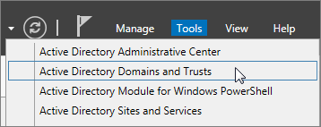
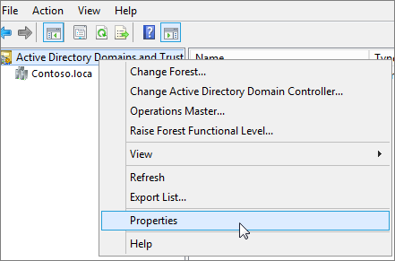

# <a name="prepare-a-non-routable-domain-for-directory-synchronization"></a><span data-ttu-id="640cd-103">Préparer un domaine non routable pour la synchronisation d’annuaires</span><span class="sxs-lookup"><span data-stu-id="640cd-103">Prepare a non-routable domain for directory synchronization</span></span>
<span data-ttu-id="640cd-p101">Lorsque vous synchronisez votre annuaire local avec Office 365, vous devez disposer d’un domaine vérifié dans Azure Active Directory. Uniquement l’utilisateur Principal noms (UPN) qui sont associées dans le domaine local sont synchronisées. Toutefois, n’importe quel nom UPN qui contient un domaine non routable, par exemple .local (par exemple, billa@contoso.local), sera synchronisé avec un. onmicrosoft.com domaine (par exemple billa@contoso.onmicrosoft.com).</span><span class="sxs-lookup"><span data-stu-id="640cd-p101">When you synchronize your on-premises directory with Office 365 you have to have a verified domain in Azure Active Directory. Only the User Principal Names (UPN) that are associated with the on-premises domain are synchronized. However, any UPN that contains an non-routable domain, for example .local (like billa@contoso.local), will be synchronized to an .onmicrosoft.com domain (like billa@contoso.onmicrosoft.com).</span></span> 

<span data-ttu-id="640cd-107">Si vous utilisez actuellement un domaine .local pour vos comptes d’utilisateurs dans Active Directory, il est recommandé que vous les modifiez pour utiliser un domaine vérifié (comme billa@contoso.com) afin de synchroniser correctement avec votre domaine à Office 365.</span><span class="sxs-lookup"><span data-stu-id="640cd-107">If you currently use a .local domain for your user accounts in Active Directory it's recommended that you change them to use a verified domain (like billa@contoso.com) in order to properly sync with your Office 365 domain.</span></span>
  
## <a name="what-if-i-only-have-a-local-on-premises-domain"></a><span data-ttu-id="640cd-108">Que se passe-t-il si j’ai uniquement un domaine local de .local ?</span><span class="sxs-lookup"><span data-stu-id="640cd-108">What if I only have a .local on-premises domain?</span></span>

<span data-ttu-id="640cd-p102">L’outil plus récente que vous pouvez utiliser pour la synchronisation Active Directory pour Azure Active Directory nommé Azure AD se connecter. Pour plus d’informations, voir [intégration des identités avec Azure Active Directory local](https://docs.microsoft.com/azure/architecture/reference-architectures/identity/azure-ad).</span><span class="sxs-lookup"><span data-stu-id="640cd-p102">The most recent tool you can use for synchronizing your Active Directory to Azure Active Directory is named Azure AD Connect. For more information, see [Integrating your on-premises identities with Azure Active Directory](https://docs.microsoft.com/azure/architecture/reference-architectures/identity/azure-ad).</span></span>
  
<span data-ttu-id="640cd-p103">Azure AD Connect synchronise UPN et le mot de passe des utilisateurs afin que les utilisateurs peuvent se connecter avec les mêmes informations d’identification qu’ils utilisent sur site. Toutefois, Azure AD Connect synchronise uniquement aux utilisateurs de domaines qui ont été vérifiées par Office 365. Cela signifie que le domaine est également vérifié par Azure Active Directory étant donné que les identités Office 365 sont gérées par Azure Active Directory. En d’autres termes, le domaine doit être un domaine Internet valid (par exemple, .com, .org, .net, .us, etc.). Si votre environnement Active Directory interne utilise uniquement un domaine non routable (par exemple, .local), celui-ci ne peut pas éventuellement correspondre au domaine vérifié que vous avez sur Office 365. Vous pouvez résoudre ce problème en modifiant votre domaine principal dans votre environnement local sur Active Directory, ou en ajoutant un ou plusieurs suffixes UPN.</span><span class="sxs-lookup"><span data-stu-id="640cd-p103">Azure AD Connect synchronizes your users' UPN and password so that users can sign in with the same credentials they use on-premises. However, Azure AD Connect only synchronizes users to domains that are verified by Office 365. This means that the domain also is verified by Azure Active Directory because Office 365 identities are managed by Azure Active Directory. In other words, the domain has to be a valid Internet domain (for example, .com, .org, .net, .us, etc.). If your internal Active Directory only uses a non-routable domain (for example, .local), this can't possibly match the verified domain you have on Office 365. You can fix this issue by either changing your primary domain in your on premises Active Directory, or by adding one or more UPN suffixes.</span></span>
  
### <a name="change-your-primary-domain"></a><span data-ttu-id="640cd-117">**Modifier votre domaine principal**</span><span class="sxs-lookup"><span data-stu-id="640cd-117">**Change your primary domain**</span></span>

<span data-ttu-id="640cd-p104">Modifier votre domaine principal à un domaine que vous avez vérifié dans Office 365, par exemple, contoso.com. Tous les utilisateurs dont le domaine contoso.local sont alors mis à jour pour contoso.com. Pour plus d’informations, voir [Domaine renommer fonctionnement](https://go.microsoft.com/fwlink/p/?LinkId=624174). Il s’agit d’un processus très complexe, cependant, et une solution plus simple consiste à [Ajouter un UPN suffixes et mettre à jour vos utilisateurs leur](prepare-a-non-routable-domain-for-directory-synchronization.md#bk_register), comme indiqué dans la section suivante.</span><span class="sxs-lookup"><span data-stu-id="640cd-p104">Change your primary domain to a domain you have verified in Office 365, for example, contoso.com. Every user that has the domain contoso.local is then updated to contoso.com. For instructions, see [How Domain Rename Works](https://go.microsoft.com/fwlink/p/?LinkId=624174). This is a very involved process, however, and an easier solution is to [Add UPN suffixes and update your users to them](prepare-a-non-routable-domain-for-directory-synchronization.md#bk_register), as shown in the following section.</span></span>
  
### <a name="add-upn-suffixes-and-update-your-users-to-them"></a><span data-ttu-id="640cd-122">**Ajouter des suffixes UPN et mettre à jour vos utilisateurs leur**</span><span class="sxs-lookup"><span data-stu-id="640cd-122">**Add UPN suffixes and update your users to them**</span></span>

<span data-ttu-id="640cd-p105">Vous pouvez résoudre le problème .local en enregistrant le nouveau suffixe UPN ou des suffixes dans Active Directory pour correspondre au domaine (ou domaines) que vous avez vérifié à Office 365. Une fois que vous enregistrez le nouveau suffixe, l’utilisateur UPN pour remplacer le .local avec le nouveau nom de domaine, par exemple, pour qu’un compte d’utilisateur ressemble billa@contoso.com mettre à jour.</span><span class="sxs-lookup"><span data-stu-id="640cd-p105">You can solve the .local problem by registering new UPN suffix or suffixes in Active Directory to match the domain (or domains) you verified in Office 365. After you register the new suffix, you update the user UPNs to replace the .local with the new domain name for example so that a user account looks like billa@contoso.com.</span></span>
  
<span data-ttu-id="640cd-125">Une fois que vous avez mis à jour l’UPN pour utiliser le domaine vérifié, vous êtes prêt à synchroniser Active Directory local avec Office 365.</span><span class="sxs-lookup"><span data-stu-id="640cd-125">After you have updated the UPNs to use the verified domain,you are ready to synchronize your on-premises Active Directory with Office 365.</span></span>
  
 <span data-ttu-id="640cd-126">**Étape 1 : Ajouter le nouveau suffixe UPN**</span><span class="sxs-lookup"><span data-stu-id="640cd-126">**Step 1: Add the new UPN suffix**</span></span>
  
1. <span data-ttu-id="640cd-127">Choisir les **Outils** sur le serveur qui exécute les Services de domaine Active Directory (AD DS) sur, dans le Gestionnaire de serveur \> **Directory domaines et approbations Active**.</span><span class="sxs-lookup"><span data-stu-id="640cd-127">On the server that Active Directory Domain Services (AD DS) runs on, in the Server Manager choose **Tools** \> **Active Directory Domains and Trusts**.</span></span>
    
    <span data-ttu-id="640cd-128">**Ou, si vous n’avez pas Windows Server 2012**</span><span class="sxs-lookup"><span data-stu-id="640cd-128">**Or, if you don't have Windows Server 2012**</span></span>
    
    <span data-ttu-id="640cd-129">Appuyez sur **touche Windows + R** pour ouvrir la boîte de dialogue **exécuter** , puis tapez Domain.msc, puis cliquez sur **OK**.</span><span class="sxs-lookup"><span data-stu-id="640cd-129">Press **Windows key + R** to open the **Run** dialog, and then type in Domain.msc, and then choose **OK**.</span></span>
    
    
  
2. <span data-ttu-id="640cd-131">Dans la fenêtre **Active Directory domaines et approbations** , avec le bouton droit de **domaines Active Directory et les approbations**, puis choisissez **Propriétés**.</span><span class="sxs-lookup"><span data-stu-id="640cd-131">On the **Active Directory Domains and Trusts** window, right-click **Active Directory Domains and Trusts**, and then choose **Properties**.</span></span>
    
    
  
3. <span data-ttu-id="640cd-133">Sous l’onglet **Suffixes UPN** , dans la zone **Alternative des Suffixes UPN** , tapez votre nouveau suffixe UPN ou des suffixes, puis choisissez **Ajouter** \> **Appliquer**.</span><span class="sxs-lookup"><span data-stu-id="640cd-133">On the **UPN Suffixes** tab, in the **Alternative UPN Suffixes** box, type your new UPN suffix or suffixes, and then choose **Add** \> **Apply**.</span></span>
    
    
  
    <span data-ttu-id="640cd-135">Cliquez sur **OK** lorsque vous avez terminé d’ajouter des suffixes.</span><span class="sxs-lookup"><span data-stu-id="640cd-135">Choose **OK** when you're done adding suffixes.</span></span> 
    
 <span data-ttu-id="640cd-136">**Étape 2 : Modifier le suffixe UPN pour les utilisateurs existants**</span><span class="sxs-lookup"><span data-stu-id="640cd-136">**Step 2: Change the UPN suffix for existing users**</span></span>
  
1. <span data-ttu-id="640cd-137">Choisir les **Outils** sur le serveur qui exécute les Services de domaine Active Directory (AD DS) sur, dans le Gestionnaire de serveur \> **répertoire Active Directory utilisateurs et ordinateurs Active**.</span><span class="sxs-lookup"><span data-stu-id="640cd-137">On the server that Active Directory Domain Services (AD DS) runs on, in the Server Manager choose **Tools** \> **Active Directory Active Directory Users and Computers**.</span></span>
    
    <span data-ttu-id="640cd-138">**Ou, si vous n’avez pas Windows Server 2012**</span><span class="sxs-lookup"><span data-stu-id="640cd-138">**Or, if you don't have Windows Server 2012**</span></span>
    
    <span data-ttu-id="640cd-139">Appuyez sur **touche Windows + R** pour ouvrir la boîte de dialogue **exécuter** , puis tapez dsa.msc, puis cliquez sur **OK**</span><span class="sxs-lookup"><span data-stu-id="640cd-139">Press **Windows key + R** to open the **Run** dialog, and then type in Dsa.msc, and then click **OK**</span></span>
    
2. <span data-ttu-id="640cd-140">Sélectionnez un utilisateur, avec le bouton droit, puis cliquez sur **Propriétés**.</span><span class="sxs-lookup"><span data-stu-id="640cd-140">Select a user, right-click, and then choose **Properties**.</span></span>
    
3. <span data-ttu-id="640cd-141">Sous l’onglet **compte** , dans la liste déroulante du suffixe UPN, choisissez Nouveau suffixe UPN, puis cliquez sur **OK**.</span><span class="sxs-lookup"><span data-stu-id="640cd-141">On the **Account** tab, in the UPN suffix drop-down list, choose the new UPN suffix, and then choose **OK**.</span></span>
    
    
  
4. <span data-ttu-id="640cd-143">Effectuez ces étapes pour chaque utilisateur.</span><span class="sxs-lookup"><span data-stu-id="640cd-143">Complete these steps for every user.</span></span>
    
    <span data-ttu-id="640cd-144">Vous pouvez également mettre à jour l’UPN suffixes [vous pouvez également utiliser Windows PowerShell pour modifier le suffixe UPN pour tous les utilisateurs](prepare-a-non-routable-domain-for-directory-synchronization.md#BK_Posh).</span><span class="sxs-lookup"><span data-stu-id="640cd-144">Alternately you can bulk update the UPN suffixes [You can also use Windows PowerShell to change the UPN suffix for all users](prepare-a-non-routable-domain-for-directory-synchronization.md#BK_Posh).</span></span>
    
### <a name="you-can-also-use-windows-powershell-to-change-the-upn-suffix-for-all-users"></a><span data-ttu-id="640cd-145">**Vous pouvez également utiliser Windows PowerShell pour modifier le suffixe UPN pour tous les utilisateurs**</span><span class="sxs-lookup"><span data-stu-id="640cd-145">**You can also use Windows PowerShell to change the UPN suffix for all users**</span></span>

<span data-ttu-id="640cd-p106">Si vous avez un grand nombre d’utilisateurs à mettre à jour, il est plus facile d’utiliser Windows PowerShell. L’exemple suivant utilise les applets de commande [Get-ADUser](https://go.microsoft.com/fwlink/p/?LinkId=624312) et [Set-ADUser](https://go.microsoft.com/fwlink/p/?LinkId=624313) pour modifier tous les suffixes contoso.local pour contoso.com.</span><span class="sxs-lookup"><span data-stu-id="640cd-p106">If you have a lot of users to update, it is easier to use Windows PowerShell. The following example uses the cmdlets [Get-ADUser](https://go.microsoft.com/fwlink/p/?LinkId=624312) and [Set-ADUser](https://go.microsoft.com/fwlink/p/?LinkId=624313) to change all contoso.local suffixes to contoso.com.</span></span> 

<span data-ttu-id="640cd-148">Exécutez les commandes Windows PowerShell suivantes pour mettre à jour tous les suffixes contoso.local contoso.com :</span><span class="sxs-lookup"><span data-stu-id="640cd-148">Run the following Windows PowerShell commands to update all contoso.local suffixes to contoso.com:</span></span>
    
  ```
  $LocalUsers = Get-ADUser -Filter {UserPrincipalName -like '*contoso.local'} -Properties userPrincipalName -ResultSetSize $null
  ```

  ```
  $LocalUsers | foreach {$newUpn = $_.UserPrincipalName.Replace("contoso.local","contoso.com"); $_ | Set-ADUser -UserPrincipalName $newUpn}
  ```
<span data-ttu-id="640cd-149">Voir [module Active Directory Windows PowerShell](https://go.microsoft.com/fwlink/p/?LinkId=624314) pour en savoir plus sur l’utilisation de Windows PowerShell dans Active Directory.</span><span class="sxs-lookup"><span data-stu-id="640cd-149">See [Active Directory Windows PowerShell module](https://go.microsoft.com/fwlink/p/?LinkId=624314) to learn more about using Windows PowerShell in Active Directory.</span></span> 

