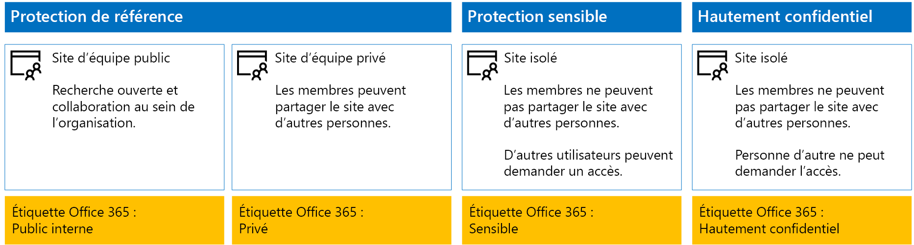
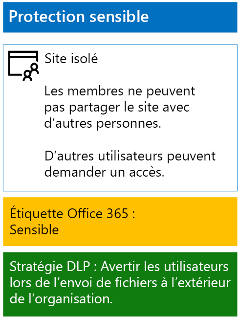
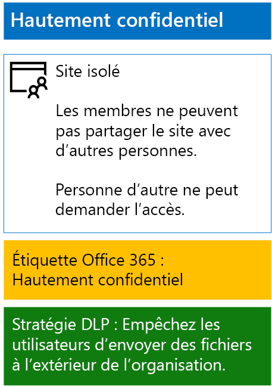

# <a name="protect-sharepoint-online-files-with-office-365-labels-and-dlp"></a><span data-ttu-id="54784-103">Protéger les fichiers SharePoint Online avec les étiquettes d’Office 365 et DLP</span><span class="sxs-lookup"><span data-stu-id="54784-103">Protect SharePoint Online files with Office 365 labels and DLP</span></span>

 <span data-ttu-id="54784-104">**Résumé :** Appliquer à Office 365 stratégies de prevention (DLP) de perte de données et les étiquettes pour les sites d’équipe SharePoint Online avec différents niveaux de protection des informations.</span><span class="sxs-lookup"><span data-stu-id="54784-104">**Summary:** Apply Office 365 labels and data loss prevention (DLP) policies for SharePoint Online team sites with various levels of information protection.</span></span>
  
<span data-ttu-id="54784-p101">Utilisez les étapes de cet article pour concevoir et déployer des stratégies DLP planifié, sensibles et hautement confidentielles SharePoint Online sites d’équipe et des étiquettes d’Office 365. Pour plus d’informations sur ces trois niveaux de protection, voir les [fichiers et les sites SharePoint Online de la sécuriser](secure-sharepoint-online-sites-and-files.md).</span><span class="sxs-lookup"><span data-stu-id="54784-p101">Use the steps in this article to design and deploy Office 365 labels and DLP policies for baseline, sensitive, and highly confidential SharePoint Online team sites. For more information about these three tiers of protection, see [Secure SharePoint Online sites and files](secure-sharepoint-online-sites-and-files.md).</span></span>
  
## <a name="office-365-labels-for-your-sharepoint-online-sites"></a><span data-ttu-id="54784-107">Étiquettes Office 365 destinées aux sites SharePoint Online</span><span class="sxs-lookup"><span data-stu-id="54784-107">Office 365 labels for your SharePoint Online sites</span></span>

<span data-ttu-id="54784-108">Il existe trois phases pour créer et attribuer des étiquettes Office 365 à des sites d’équipe SharePoint Online.</span><span class="sxs-lookup"><span data-stu-id="54784-108">There are three phases to creating and then assigning Office 365 labels to SharePoint Online team sites.</span></span>
  
### <a name="phase-1-determine-the-office-365-label-names"></a><span data-ttu-id="54784-109">Phase 1 : choix d’un nom pour vos étiquettes Office 365</span><span class="sxs-lookup"><span data-stu-id="54784-109">Phase 1: Determine the Office 365 label names</span></span>

<span data-ttu-id="54784-p102">Au cours de cette phase, vous devez attribuer un nom à vos étiquettes Office 365, qui correspondent aux quatre niveaux de protection des informations appliqués aux sites d’équipe SharePoint Online. Le tableau suivant répertorie les noms recommandés pour chaque niveau.</span><span class="sxs-lookup"><span data-stu-id="54784-p102">In this phase, you determine the names of your Office 365 labels for the four levels of information protection applied to SharePoint Online team sites. The following table lists the recommended names for each level.</span></span>
  
|<span data-ttu-id="54784-112">**SharePoint Online niveau de protection de site d’équipe**</span><span class="sxs-lookup"><span data-stu-id="54784-112">**SharePoint Online team site protection level**</span></span>|<span data-ttu-id="54784-113">**Nom de l’étiquette**</span><span class="sxs-lookup"><span data-stu-id="54784-113">**Label name**</span></span>|
|:-----|:-----|
|<span data-ttu-id="54784-114">Référence-Public</span><span class="sxs-lookup"><span data-stu-id="54784-114">Baseline-Public</span></span>  <br/> |<span data-ttu-id="54784-115">Public interne</span><span class="sxs-lookup"><span data-stu-id="54784-115">Internal public</span></span>  <br/> |
|<span data-ttu-id="54784-116">Référence-Privé</span><span class="sxs-lookup"><span data-stu-id="54784-116">Baseline-Private</span></span>  <br/> |<span data-ttu-id="54784-117">Privé</span><span class="sxs-lookup"><span data-stu-id="54784-117">Private</span></span>  <br/> |
|<span data-ttu-id="54784-118">Sensible</span><span class="sxs-lookup"><span data-stu-id="54784-118">Sensitive</span></span>  <br/> |<span data-ttu-id="54784-119">Sensible</span><span class="sxs-lookup"><span data-stu-id="54784-119">Sensitive</span></span>  <br/> |
|<span data-ttu-id="54784-120">Hautement confidentiel</span><span class="sxs-lookup"><span data-stu-id="54784-120">Highly Confidential</span></span>  <br/> |<span data-ttu-id="54784-121">Hautement confidentiel</span><span class="sxs-lookup"><span data-stu-id="54784-121">Highly Confidential</span></span>  <br/> |
   
### <a name="phase-2-create-the-office-365-labels"></a><span data-ttu-id="54784-122">Phase 2 : création des étiquettes Office 365</span><span class="sxs-lookup"><span data-stu-id="54784-122">Phase 2: Create the Office 365 labels</span></span>

<span data-ttu-id="54784-123">Au cours de cette phase, vous créez et publiez vos étiquettes correspondant aux différents niveaux de protection des informations.</span><span class="sxs-lookup"><span data-stu-id="54784-123">In this phase, you create and then publish your determined labels for the different levels of information protection.</span></span>
  
<span data-ttu-id="54784-124">Pour créer les étiquettes, vous pouvez utiliser le Centre d’administration Office 365 ou Microsoft PowerShell.</span><span class="sxs-lookup"><span data-stu-id="54784-124">To create the labels, you can use the Office 365 Admin center or Microsoft PowerShell.</span></span>
  
### <a name="create-office-365-labels-with-the-office-365-admin-center"></a><span data-ttu-id="54784-125">Créer des étiquettes Office 365 avec le Centre d’administration Office 365</span><span class="sxs-lookup"><span data-stu-id="54784-125">Create Office 365 labels with the Office 365 Admin center</span></span>

1. <span data-ttu-id="54784-p103">Connectez-vous au portail Office 365 avec un compte qui possède le rôle d’administrateur de sécurité ou l’administrateur de la société. Pour de l’aide, consultez la rubrique [pour vous connecter à Office 365](https://support.office.com/Article/Where-to-sign-in-to-Office-365-e9eb7d51-5430-4929-91ab-6157c5a050b4).</span><span class="sxs-lookup"><span data-stu-id="54784-p103">Sign in to the Office 365 portal with an account that has the Security Administrator or Company Administrator role. For help, see [Where to sign in to Office 365](https://support.office.com/Article/Where-to-sign-in-to-Office-365-e9eb7d51-5430-4929-91ab-6157c5a050b4).</span></span>
    
2. <span data-ttu-id="54784-128">À partir de l’onglet **Accueil de Microsoft Office** , cliquez sur la mosaïque de **l’Admin** .</span><span class="sxs-lookup"><span data-stu-id="54784-128">From the **Microsoft Office Home** tab, click the **Admin** tile.</span></span>
    
3. <span data-ttu-id="54784-129">Dans l’onglet nouveau **Centre d’administration d’Office** de votre navigateur, cliquez sur **Centre d’administration > sécurité &amp; la conformité**.</span><span class="sxs-lookup"><span data-stu-id="54784-129">From the new **Office Admin center** tab of your browser, click **Admin centers > Security &amp; Compliance**.</span></span>
    
4. <span data-ttu-id="54784-130">À partir du nouveau **maison - sécurité &amp; la conformité** onglet de votre navigateur, cliquez sur **les Classifications > étiquettes**.</span><span class="sxs-lookup"><span data-stu-id="54784-130">From the new **Home - Security &amp; Compliance** tab of your browser, click **Classifications > Labels**.</span></span>
    
5. <span data-ttu-id="54784-131">À partir de le **Accueil > étiquettes** volet, cliquez sur **créer une étiquette**.</span><span class="sxs-lookup"><span data-stu-id="54784-131">From the **Home > Labels** pane, click **Create a label**.</span></span>
    
6. <span data-ttu-id="54784-132">Dans le volet **nom de votre étiquette** , tapez le nom de l’étiquette, puis cliquez sur **suivant**.</span><span class="sxs-lookup"><span data-stu-id="54784-132">On the **Name your label** pane, type the name of the label, and then click **Next**.</span></span>
    
7. <span data-ttu-id="54784-133">Dans le volet **paramètres d’étiquette** , cliquez sur **suivant**.</span><span class="sxs-lookup"><span data-stu-id="54784-133">On the **Label settings** pane, click **Next**.</span></span>
    
8. <span data-ttu-id="54784-134">Dans le volet de **passer en revue vos paramètres** , cliquez sur **créer cette étiquette**, puis cliquez sur **Fermer**.</span><span class="sxs-lookup"><span data-stu-id="54784-134">On the **Review your settings** pane, click **Create this label**, and then click **Close**.</span></span>
    
9. <span data-ttu-id="54784-135">Répétez les étapes 5 à 8 pour les autres étiquettes.</span><span class="sxs-lookup"><span data-stu-id="54784-135">Repeat steps 5-8 for your additional labels.</span></span>
    
### <a name="create-office-365-labels-with-powershell"></a><span data-ttu-id="54784-136">Créer des étiquettes Office 365 avec PowerShell</span><span class="sxs-lookup"><span data-stu-id="54784-136">Create Office 365 labels with PowerShell</span></span>

1. <span data-ttu-id="54784-137">[Se connecter à la sécurité pour Microsoft Office 365 &amp; centre de conformité à l’aide du PowerShell distant](http://go.microsoft.com/fwlink/?LinkID=799771&amp;clcid=0x409) et spécifiez les informations d’identification d’un compte qui possède le rôle d’administrateur de sécurité ou l’administrateur de la société.</span><span class="sxs-lookup"><span data-stu-id="54784-137">[Connect to the Office 365 Security &amp; Compliance Center using remote PowerShell](http://go.microsoft.com/fwlink/?LinkID=799771&amp;clcid=0x409) and specify the credentials of an account that has the Security Administrator or Company Administrator role.</span></span>
    
2. <span data-ttu-id="54784-138">Complétez la liste des noms d’étiquettes, puis exécutez ces commandes à l’invite de commandes PowerShell :</span><span class="sxs-lookup"><span data-stu-id="54784-138">Fill out the list of label names, and then run these commands at the PowerShell command prompt:</span></span>
    
  ```
  $labelNames=@(<list of label names, each enclosed in quotes and separated by commas>)
ForEach ($element in $labelNames){ New-ComplianceTag -Name $element }
  ```

<span data-ttu-id="54784-139">Ensuite, suivez ces étapes pour publier les nouvelles étiquettes Office 365.</span><span class="sxs-lookup"><span data-stu-id="54784-139">Next, use these steps to publish the new Office 365 labels.</span></span>
  
1. <span data-ttu-id="54784-140">À partir de le **Accueil > étiquettes** volet de la sécurité &amp; centre de conformité, cliquez sur **publier les étiquettes**.</span><span class="sxs-lookup"><span data-stu-id="54784-140">From the **Home > Labels** pane the Security &amp; Compliance Center, click **Publish labels**.</span></span>
    
2. <span data-ttu-id="54784-141">Dans le volet **Choisir les étiquettes à publier** , cliquez sur **Choisir les étiquettes à publier**.</span><span class="sxs-lookup"><span data-stu-id="54784-141">On the **Choose labels to publish** pane, click **Choose labels to publish**.</span></span>
    
3. <span data-ttu-id="54784-142">Dans le volet **Choisir étiquettes** , cliquez sur **Ajouter** et sélectionner toutes les étiquettes de quatre.</span><span class="sxs-lookup"><span data-stu-id="54784-142">On the **Choose labels** pane, click **Add** and select all four labels.</span></span>
    
4. <span data-ttu-id="54784-143">Cliquez sur **terminé**.</span><span class="sxs-lookup"><span data-stu-id="54784-143">Click **Done**.</span></span>
    
5. <span data-ttu-id="54784-144">Dans le volet **Choisir les étiquettes à publier** , cliquez sur **suivant**.</span><span class="sxs-lookup"><span data-stu-id="54784-144">On the **Choose labels to publish** pane, click **Next**.</span></span>
    
6. <span data-ttu-id="54784-145">Dans le volet **Choisir des emplacements** , cliquez sur **suivant**.</span><span class="sxs-lookup"><span data-stu-id="54784-145">On the **Choose locations** pane, click **Next**.</span></span>
    
7. <span data-ttu-id="54784-146">Dans le volet **nom de votre stratégie** , tapez un nom pour votre ensemble d’étiquettes dans la zone **nom**, puis cliquez sur **suivant**.</span><span class="sxs-lookup"><span data-stu-id="54784-146">On the **Name your policy** pane, type a name for your set of labels in **Name**, and then click **Next**.</span></span>
    
8. <span data-ttu-id="54784-147">Dans le volet de **passer en revue vos paramètres** , cliquez sur **publier les étiquettes**, puis cliquez sur **Fermer**.</span><span class="sxs-lookup"><span data-stu-id="54784-147">On the **Review your settings** pane, click **Publish labels**, and then click **Close**.</span></span>
    
### <a name="phase-3-apply-the-office-365-labels-to-your-sharepoint-online-sites"></a><span data-ttu-id="54784-148">Phase 3 : application des étiquettes Office 365 à vos sites SharePoint Online</span><span class="sxs-lookup"><span data-stu-id="54784-148">Phase 3: Apply the Office 365 labels to your SharePoint Online sites</span></span>

<span data-ttu-id="54784-149">Suivez ces étapes pour appliquer les étiquettes Office 365 aux dossiers de documents de vos sites d’équipe SharePoint Online.</span><span class="sxs-lookup"><span data-stu-id="54784-149">Use these steps to apply the Office 365 labels to the documents folders of your SharePoint Online team sites.</span></span>
  
1. <span data-ttu-id="54784-150">À partir de l’onglet **Accueil de Microsoft Office** de votre navigateur, cliquez sur la mosaïque de **SharePoint** .</span><span class="sxs-lookup"><span data-stu-id="54784-150">From the **Microsoft Office Home** tab of your browser, click the **SharePoint** tile.</span></span>
    
2. <span data-ttu-id="54784-151">Dans l’onglet nouveau **SharePoint** dans votre navigateur, cliquez sur un site nécessitant une étiquette affectée d’Office 365.</span><span class="sxs-lookup"><span data-stu-id="54784-151">On the new **SharePoint** tab in your browser, click a site that needs an Office 365 label assigned.</span></span>
    
3. <span data-ttu-id="54784-152">Dans le nouvel onglet de site SharePoint de votre navigateur, cliquez sur **Documents**.</span><span class="sxs-lookup"><span data-stu-id="54784-152">In the new SharePoint site tab of your browser, click **Documents**.</span></span>
    
4. <span data-ttu-id="54784-153">Cliquez sur l’icône de paramètres, puis cliquez sur **paramètres de la bibliothèque**.</span><span class="sxs-lookup"><span data-stu-id="54784-153">Click the settings icon, and then click **Library settings**.</span></span>
    
5. <span data-ttu-id="54784-154">Sous **autorisations et gestion**, cliquez sur **étiquette d’appliquer aux éléments de cette bibliothèque**.</span><span class="sxs-lookup"><span data-stu-id="54784-154">Under **Permissions and Management**, click **Apply label to items in this library**.</span></span>
    
6. <span data-ttu-id="54784-155">Dans **Les paramètres à appliquer une étiquette**, sélectionnez l’étiquette appropriée, puis cliquez sur **Enregistrer**.</span><span class="sxs-lookup"><span data-stu-id="54784-155">In **Settings-Apply Label**, select the appropriate label, and then click **Save**.</span></span>
    
7. <span data-ttu-id="54784-156">Fermez l’onglet du site SharePoint Online.</span><span class="sxs-lookup"><span data-stu-id="54784-156">Close the tab for the SharePoint Online site.</span></span>
    
8. <span data-ttu-id="54784-157">Répétez les étapes 3 à 8 pour attribuer des étiquettes Office 365 à vos autres sites SharePoint Online.</span><span class="sxs-lookup"><span data-stu-id="54784-157">Repeat steps 3-8 to assign Office 365 labels to your additional SharePoint Online sites.</span></span>
    
<span data-ttu-id="54784-158">Voici la configuration finale.</span><span class="sxs-lookup"><span data-stu-id="54784-158">Here is your resulting configuration.</span></span>
  

  
## <a name="dlp-policies-for-your-sharepoint-online-sites"></a><span data-ttu-id="54784-160">Stratégies DLP destinées à vos sites SharePoint Online</span><span class="sxs-lookup"><span data-stu-id="54784-160">DLP policies for your SharePoint Online sites</span></span>

<span data-ttu-id="54784-161">Suivez ces étapes pour configurer une stratégie DLP qui avertit les utilisateurs lorsqu’ils partagent un document sur un site d’équipe sensibles SharePoint Online à l’extérieur de l’organisation.</span><span class="sxs-lookup"><span data-stu-id="54784-161">Use these steps to configure a DLP policy that notifies users when they share a document on a SharePoint Online sensitive team site outside the organization.</span></span>
  
1. <span data-ttu-id="54784-162">À partir de l’onglet **Accueil de Microsoft Office** dans votre navigateur, cliquez sur le **sécurité &amp; la conformité** en mosaïque.</span><span class="sxs-lookup"><span data-stu-id="54784-162">From the **Microsoft Office Home** tab in your browser, click the **Security &amp; Compliance** tile.</span></span>
    
2. <span data-ttu-id="54784-163">Sur la nouvelle **sécurité &amp; la conformité** dans votre navigateur, cliquez sur **prévention des fuites de données > stratégie de**.</span><span class="sxs-lookup"><span data-stu-id="54784-163">On the new **Security &amp; Compliance** tab in your browser, click **Data loss prevention > Policy**.</span></span>
    
3. <span data-ttu-id="54784-164">Dans le volet de la **prévention des fuites de données** , cliquez sur **+ créer une stratégie**.</span><span class="sxs-lookup"><span data-stu-id="54784-164">In the **Data loss prevention** pane, click **+ Create a policy**.</span></span>
    
4. <span data-ttu-id="54784-165">Dans la **Démarrer avec un modèle ou créer une stratégie personnalisée** volet, cliquez sur **personnalisée**, puis cliquez sur **suivant**.</span><span class="sxs-lookup"><span data-stu-id="54784-165">In the **Start with a template or create a custom policy** pane, click **Custom**, and then click **Next**.</span></span>
    
5. <span data-ttu-id="54784-166">Dans le volet **nom de votre stratégie** , tapez le nom de la stratégie DLP sensible dans la zone **nom**, puis cliquez sur **suivant**.</span><span class="sxs-lookup"><span data-stu-id="54784-166">In the **Name your policy** pane, type the name for the sensitive level DLP policy in **Name**, and then click **Next**.</span></span>
    
6. <span data-ttu-id="54784-167">Dans le volet **Choisir des emplacements** , cliquez sur **me laisser choisir des emplacements spécifiques**, puis cliquez sur **suivant**.</span><span class="sxs-lookup"><span data-stu-id="54784-167">In the **Choose locations** pane, click **Let me choose specific locations**, and then click **Next**.</span></span>
    
7. <span data-ttu-id="54784-168">Dans la liste des emplacements, désactivez les emplacements **des comptes de OneDrive** et de la **messagerie Exchange** , puis cliquez sur **suivant**.</span><span class="sxs-lookup"><span data-stu-id="54784-168">In the list of locations, disable the **Exchange email** and **OneDrive accounts** locations, and then click **Next**.</span></span>
    
8. <span data-ttu-id="54784-169">Dans le volet **Personnaliser les types d’informations sensibles que vous souhaitez protéger** , cliquez sur **Modifier**.</span><span class="sxs-lookup"><span data-stu-id="54784-169">In the **Customize the types of sensitive info you want to protect** pane, click **Edit**.</span></span>
    
9. <span data-ttu-id="54784-170">Dans le volet **Choisir les types de contenu à protéger** , cliquez sur **Ajouter** dans la zone de liste déroulante, puis cliquez sur **étiquettes**.</span><span class="sxs-lookup"><span data-stu-id="54784-170">In the **Choose the types of content to protect** pane, click **Add** in the drop-down box, and then click **Labels**.</span></span>
    
10. <span data-ttu-id="54784-171">Dans le volet **d’étiquettes** , cliquez sur **+ Ajouter**, sélectionnez l’étiquette **sensibles** , cliquez sur **Ajouter**, puis cliquez sur **terminé**.</span><span class="sxs-lookup"><span data-stu-id="54784-171">In the **Labels** pane, click **+ Add**, select the **Sensitive** label, click **Add**, and then click **Done**.</span></span>
    
11. <span data-ttu-id="54784-172">Dans le volet **Choisir les types de contenu à protéger** , cliquez sur **Enregistrer**.</span><span class="sxs-lookup"><span data-stu-id="54784-172">In the **Choose the types of content to protect** pane, click **Save**.</span></span>
    
12. <span data-ttu-id="54784-173">Dans le volet **Personnaliser les types d’informations sensibles que vous souhaitez protéger** , cliquez sur **suivant**.</span><span class="sxs-lookup"><span data-stu-id="54784-173">In the **Customize the types of sensitive info you want to protect** pane, click **Next**.</span></span>
    
13. <span data-ttu-id="54784-174">Dans la **ce que vous voulez faire si nous détectons des informations sensibles ?** volet, cliquez sur **Personnaliser l’info-bulle et la messagerie électronique**.</span><span class="sxs-lookup"><span data-stu-id="54784-174">In the **What do you want to do if we detect sensitive info?** pane, click **Customize the tip and email**.</span></span>
    
14. <span data-ttu-id="54784-175">Dans le volet de **conseils de stratégie de personnaliser et de notifications par courrier électronique** , cliquez sur **Personnaliser le texte d’info-bulle de stratégie**.</span><span class="sxs-lookup"><span data-stu-id="54784-175">In the **Customize policy tips and email notifications** pane, click **Customize the policy tip text**.</span></span>
    
15. <span data-ttu-id="54784-176">Dans la zone de texte, tapez ou collez le texte suivant :</span><span class="sxs-lookup"><span data-stu-id="54784-176">In the text box, type or paste in the following:</span></span>
    
  - <span data-ttu-id="54784-p104">Pour partager un fichier avec un utilisateur extérieur à l’organisation, téléchargez-le et ouvrez-le. Cliquez sur Fichier > Protéger le document > Chiffrer avec mot de passe, puis indiquez un mot de passe fort. Envoyez le mot de passe par e-mail ou un autre moyen de communication.</span><span class="sxs-lookup"><span data-stu-id="54784-p104">To share with a user outside the organization, download the file and then open it. Click File, then Protect Document, and then Encrypt with Password, and then specify a strong password. Send the password in a separate email or other means of communication.</span></span>
    
    <span data-ttu-id="54784-180">Vous pouvez également saisir ou coller votre propre conseil de stratégie pour expliquer aux utilisateurs comment partager un fichier en dehors de votre organisation.</span><span class="sxs-lookup"><span data-stu-id="54784-180">Alternately, type or paste in your own policy tip that instructs users on how to share a file outside your organization.</span></span>
    
16. <span data-ttu-id="54784-181">Cliquez sur **OK**.</span><span class="sxs-lookup"><span data-stu-id="54784-181">Click **OK**.</span></span>
    
17. <span data-ttu-id="54784-182">Dans la **ce que vous voulez faire si nous détectons des informations sensibles ?** volet, désactivez la case à cocher **bloquer le partage, des personnes et de restreindre l’accès au contenu partagé** , puis cliquez sur **suivant**.</span><span class="sxs-lookup"><span data-stu-id="54784-182">In the **What do you want to do if we detect sensitive info?** pane, clear the **Block people from sharing, and restrict access to shared content** check box, and then click **Next**.</span></span>
    
18. <span data-ttu-id="54784-183">Dans le **vous souhaitez activer les opérations de test ou de stratégie en premier ?** volet, cliquez sur **Oui, activer tout de suite**, puis cliquez sur **suivant**.</span><span class="sxs-lookup"><span data-stu-id="54784-183">In the **Do you want to turn on the policy or test things out first?** pane, click **Yes, turn it on right away**, and then click **Next**.</span></span>
    
19. <span data-ttu-id="54784-184">Dans le volet de **passer en revue vos paramètres** , cliquez sur **créer**, puis cliquez sur **Fermer**.</span><span class="sxs-lookup"><span data-stu-id="54784-184">In the **Review your settings** pane, click **Create**, and then click **Close**.</span></span>
    
<span data-ttu-id="54784-185">Voici la configuration finale de vos sites d’équipe SharePoint Online sensibles.</span><span class="sxs-lookup"><span data-stu-id="54784-185">Here is your resulting configuration for sensitive SharePoint Online team sites.</span></span>
  

  
<span data-ttu-id="54784-187">Ensuite, suivez ces étapes pour configurer une stratégie DLP qui empêche les utilisateurs de partager un document sur un site SharePoint Online hautement confidentiel externe à l’organisation.</span><span class="sxs-lookup"><span data-stu-id="54784-187">Next, use these steps to configure a DLP policy that blocks users when they share a document on a SharePoint Online highly confidential team site outside the organization.</span></span>
  
1. <span data-ttu-id="54784-188">À partir de l’onglet **Accueil de Microsoft Office** dans votre navigateur, cliquez sur le **sécurité &amp; la conformité** en mosaïque.</span><span class="sxs-lookup"><span data-stu-id="54784-188">From the **Microsoft Office Home** tab in your browser, click the **Security &amp; Compliance** tile.</span></span>
    
2. <span data-ttu-id="54784-189">Sur la nouvelle **sécurité &amp; la conformité** dans votre navigateur, cliquez sur **prévention des fuites de données > stratégie de**.</span><span class="sxs-lookup"><span data-stu-id="54784-189">On the new **Security &amp; Compliance** tab in your browser, click **Data loss prevention > Policy**.</span></span>
    
3. <span data-ttu-id="54784-190">Dans le volet de la **prévention des fuites de données** , cliquez sur **+ créer une stratégie**.</span><span class="sxs-lookup"><span data-stu-id="54784-190">In the **Data loss prevention** pane, click **+ Create a policy**.</span></span>
    
4. <span data-ttu-id="54784-191">Dans la **Démarrer avec un modèle ou créer une stratégie personnalisée** volet, cliquez sur **personnalisée**, puis cliquez sur **suivant**.</span><span class="sxs-lookup"><span data-stu-id="54784-191">In the **Start with a template or create a custom policy** pane, click **Custom**, and then click **Next**.</span></span>
    
5. <span data-ttu-id="54784-192">Dans le volet **nom de votre stratégie** , tapez le nom de la stratégie DLP de niveau très sensible dans la zone **nom**, puis cliquez sur **suivant**.</span><span class="sxs-lookup"><span data-stu-id="54784-192">In the **Name your policy** pane, type the name for the highly sensitive level DLP policy in **Name**, and then click **Next**.</span></span>
    
6. <span data-ttu-id="54784-193">Dans le volet **Choisir des emplacements** , cliquez sur **me laisser choisir des emplacements spécifiques**, puis cliquez sur **suivant**.</span><span class="sxs-lookup"><span data-stu-id="54784-193">In the **Choose locations** pane, click **Let me choose specific locations**, and then click **Next**.</span></span>
    
7. <span data-ttu-id="54784-194">Dans la liste des emplacements, désactivez les emplacements **des comptes de OneDrive** et de la **messagerie Exchange** , puis cliquez sur **suivant**.</span><span class="sxs-lookup"><span data-stu-id="54784-194">In the list of locations, disable the **Exchange email** and **OneDrive accounts** locations, and then click **Next**.</span></span>
    
8. <span data-ttu-id="54784-195">Dans le volet **Personnaliser les types d’informations sensibles que vous souhaitez protéger** , cliquez sur **Modifier**.</span><span class="sxs-lookup"><span data-stu-id="54784-195">In the **Customize the types of sensitive info you want to protect** pane, click **Edit**.</span></span>
    
9. <span data-ttu-id="54784-196">Dans le volet **Choisir les types de contenu à protéger** , cliquez sur **Ajouter** dans la zone de liste déroulante, puis cliquez sur **étiquettes**.</span><span class="sxs-lookup"><span data-stu-id="54784-196">In the **Choose the types of content to protect** pane, click **Add** in the drop-down box, and then click **Labels**.</span></span>
    
10. <span data-ttu-id="54784-197">Dans le volet **d’étiquettes** , cliquez sur **+ Ajouter**, sélectionnez l’étiquette **Hautement confidentielles** , cliquez sur **Ajouter**, puis cliquez sur **terminé**.</span><span class="sxs-lookup"><span data-stu-id="54784-197">In the **Labels** pane, click **+ Add**, select the **Highly Confidential** label, click **Add**, and then click **Done**.</span></span>
    
11. <span data-ttu-id="54784-198">Dans le volet **Choisir les types de contenu à protéger** , cliquez sur **Enregistrer**.</span><span class="sxs-lookup"><span data-stu-id="54784-198">In the **Choose the types of content to protect** pane, click **Save**.</span></span>
    
12. <span data-ttu-id="54784-199">Dans le volet **Personnaliser les types d’informations sensibles que vous souhaitez protéger** , cliquez sur **suivant**.</span><span class="sxs-lookup"><span data-stu-id="54784-199">In the **Customize the types of sensitive info you want to protect** pane, click **Next**.</span></span>
    
13. <span data-ttu-id="54784-200">Dans la **ce que vous voulez faire si nous détectons des informations sensibles ?** volet, cliquez sur **Personnaliser l’info-bulle et la messagerie électronique**.</span><span class="sxs-lookup"><span data-stu-id="54784-200">In the **What do you want to do if we detect sensitive info?** pane, click **Customize the tip and email**.</span></span>
    
14. <span data-ttu-id="54784-201">Dans le volet de **conseils de stratégie de personnaliser et de notifications par courrier électronique** , cliquez sur **Personnaliser le texte d’info-bulle de stratégie**.</span><span class="sxs-lookup"><span data-stu-id="54784-201">In the **Customize policy tips and email notifications** pane, click **Customize the policy tip text**.</span></span>
    
15. <span data-ttu-id="54784-202">Dans la zone de texte, tapez ou collez le texte suivant :</span><span class="sxs-lookup"><span data-stu-id="54784-202">In the text box, type or paste in the following:</span></span>
    
  - <span data-ttu-id="54784-p105">Pour partager un fichier avec un utilisateur extérieur à l’organisation, téléchargez-le et ouvrez-le. Cliquez sur Fichier > Protéger le document > Chiffrer avec mot de passe, puis indiquez un mot de passe fort. Envoyez le mot de passe par e-mail ou un autre moyen de communication.</span><span class="sxs-lookup"><span data-stu-id="54784-p105">To share with a user outside the organization, download the file and then open it. Click File, then Protect Document, and then Encrypt with Password, and then specify a strong password. Send the password in a separate email or other means of communication.</span></span>
    
    <span data-ttu-id="54784-206">Vous pouvez également saisir ou coller votre propre conseil de stratégie pour expliquer aux utilisateurs comment partager un fichier en dehors de votre organisation.</span><span class="sxs-lookup"><span data-stu-id="54784-206">Alternately, type or paste in your own policy tip that instructs users on how to share a file outside your organization.</span></span>
    
16. <span data-ttu-id="54784-207">Cliquez sur **OK**.</span><span class="sxs-lookup"><span data-stu-id="54784-207">Click **OK**.</span></span>
    
17. <span data-ttu-id="54784-208">Dans la **ce que vous voulez faire si nous détectons des informations sensibles ?** volet, sélectionnez **Exiger une justification à remplacer**, puis cliquez sur **suivant**.</span><span class="sxs-lookup"><span data-stu-id="54784-208">In the **What do you want to do if we detect sensitive info?** pane, select **Require a business justification to override**, and then click **Next**.</span></span>
    
18. <span data-ttu-id="54784-209">Dans le **vous souhaitez activer les opérations de test ou de stratégie en premier ?** volet, cliquez sur **Oui, activer tout de suite**, puis cliquez sur **suivant**.</span><span class="sxs-lookup"><span data-stu-id="54784-209">In the **Do you want to turn on the policy or test things out first?** pane, click **Yes, turn it on right away**, and then click **Next**.</span></span>
    
19. <span data-ttu-id="54784-210">Dans le volet de **passer en revue vos paramètres** , cliquez sur **créer**, puis cliquez sur **Fermer**.</span><span class="sxs-lookup"><span data-stu-id="54784-210">In the **Review your settings** pane, click **Create**, and then click **Close**.</span></span>
    
<span data-ttu-id="54784-211">Voici la configuration finale de vos sites d’équipe SharePoint Online hautement confidentiels.</span><span class="sxs-lookup"><span data-stu-id="54784-211">Here is your resulting configuration for high confidentiality SharePoint Online team sites.</span></span>
  

  
## <a name="next-step"></a><span data-ttu-id="54784-213">Étape suivante</span><span class="sxs-lookup"><span data-stu-id="54784-213">Next step</span></span>

[<span data-ttu-id="54784-214">Protéger les fichiers SharePoint Online avec Azure la Protection des informations</span><span class="sxs-lookup"><span data-stu-id="54784-214">Protect SharePoint Online files with Azure Information Protection</span></span>](protect-sharepoint-online-files-with-azure-information-protection.md)
    
## <a name="see-also"></a><span data-ttu-id="54784-215">See Also</span><span class="sxs-lookup"><span data-stu-id="54784-215">See Also</span></span>

[<span data-ttu-id="54784-216">Sécurisation des fichiers et sites SharePoint Online</span><span class="sxs-lookup"><span data-stu-id="54784-216">Secure SharePoint Online sites and files</span></span>](secure-sharepoint-online-sites-and-files.md)
  
[<span data-ttu-id="54784-217">Sites SharePoint en ligne sécurisés dans un environnement de développement/test</span><span class="sxs-lookup"><span data-stu-id="54784-217">Secure SharePoint Online sites in a dev/test environment</span></span>](secure-sharepoint-online-sites-in-a-dev-test-environment.md)
  
[<span data-ttu-id="54784-218">Conseils de sécurité Microsoft pour les campagnes électorales, les organisations à but non lucratif et d'autres organisations flexibles</span><span class="sxs-lookup"><span data-stu-id="54784-218">Microsoft Security Guidance for Political Campaigns, Nonprofits, and Other Agile Organizations</span></span>](microsoft-security-guidance-for-political-campaigns-nonprofits-and-other-agile-o.md)
  
[<span data-ttu-id="54784-219">Adoption du cloud et solutions hybrides</span><span class="sxs-lookup"><span data-stu-id="54784-219">Cloud adoption and hybrid solutions</span></span>](cloud-adoption-and-hybrid-solutions.md)


