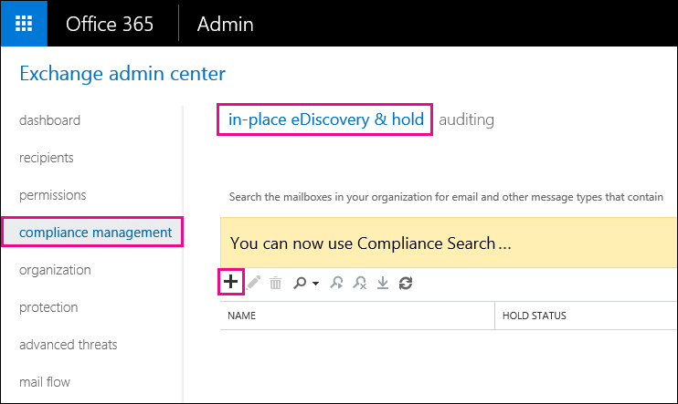
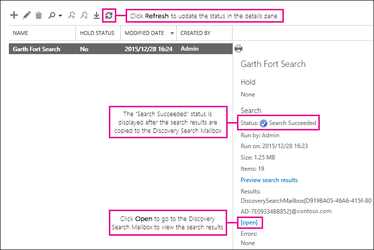

# Récupérer des éléments supprimés dans une boîte aux lettres utilisateur - Aide aux administrateursRecover deleted items in a user mailbox - Admin Help

**Cet article est destiné aux administrateurs. Essayez-vous de récupérer des éléments supprimés dans votre propre boîte aux lettres ?****This article is for administrators. Are you trying to recover deleted items in your own mailbox?** Effectuez l’une des actions suivantes : Try one of the following:
- [Récupérer des éléments supprimés dans Outlook pour WindowsRecover deleted items in Outlook for Windows](https://support.office.com/article/49e81f3c-c8f4-4426-a0b9-c0fd751d48ce)
- [Récupérer des éléments ou des messages supprimés dans Outlook Web AppRecover deleted items or email in Outlook Web App](https://support.office.com/article/c3d8fc15-eeef-4f1c-81df-e27964b7edd4)
- [Restaurer des messages électroniques supprimés dans Outlook sur le WebRestore deleted email messages in Outlook on the web](https://support.office.com/article/a8ca78ac-4721-4066-95dd-571842e9fb11)
- [Outlook.comOutlook.com](https://go.microsoft.com/fwlink/p/?LinkID=623435)
   
Un utilisateur a-t-il supprimé définitivement des éléments de sa boîte aux lettres Outlook ?Did a user permanently delete items from their Outlook mailbox? L’utilisateur le souhaite à nouveau, mais ne peut pas les récupérer.The user wants them back but can't recover them. Vous pouvez récupérer les éléments purgés s’ils n’ont pas été définitivement supprimés de la boîte aux lettres de l’utilisateur.You may be able recover the purged items if they haven't been permanently removed from the user's mailbox. Pour ce faire, utilisez l’outil de découverte électronique inaltérable dans Exchange Online pour rechercher des courriers électroniques supprimés et d’autres éléments, tels que des contacts, des rendez-vous de calendrier et des tâches, dans la boîte aux lettres d’un utilisateur.You do this by using the In-Place eDiscovery tool in Exchange Online to search for deleted email and other items—and such as contacts, calendar appointments, and tasks—in a user's mailbox. Si vous trouvez les éléments supprimés, vous pouvez les exporter vers un fichier PST (également appelé fichier de données Outlook), que l’utilisateur peut ensuite utiliser pour restaurer les éléments dans leur boîte aux lettres.If you find the deleted items, you can export them to a PST file (also called an Outlook Data File), which the user can then use to restore the items back to their mailbox.
  
Voici la procédure à suivre pour restaurer des éléments supprimés dans la boîte aux lettres d’un utilisateur.Here are the steps for recovering deleted items in a user's mailbox. Quelle est la durée de cette opération ?How long will this take? La première fois peut prendre 20 à 30 minutes pour effectuer toutes les étapes, en fonction du nombre d’éléments que vous essayez de récupérer.The first time might take 20 or 30 minutes to complete all the steps, depending on how many items you're trying to recover.
  
> [!NOTE]
> Vous devez être un **administrateur Exchange** ou un **administrateur général** dans Office 365 ou être membre du groupe de rôles gestion de l’organisation dans Exchange Online pour effectuer les étapes décrites dans cet article.You have to be an **Exchange administrator** or **Global administrator** in Office 365 or be a member of the Organization Management role group in Exchange Online to perform the steps in this article. Pour obtenir plus d’informations, consultez l’article [À propos des rôles d’administrateur Office 365](https://support.office.com/article/da585eea-f576-4f55-a1e0-87090b6aaa9d).For more information, see [About Office 365 admin roles](https://support.office.com/article/da585eea-f576-4f55-a1e0-87090b6aaa9d). 
  
## Étape 1 : assignez des autorisations eDiscoveryStep 1: Assign yourself eDiscovery permissions

La première étape consiste à vous attribuer les autorisations nécessaires dans Exchange Online afin de pouvoir utiliser l’outil de découverte électronique inaltérable pour rechercher la boîte aux lettres d’un utilisateur.The first step is to assign yourself the necessary permissions in Exchange Online so you can use the In-Place eDiscovery tool to search a user's mailbox. Vous ne devez effectuer cette opération qu’une seule fois.You only have to do this once. Si vous devez rechercher une autre boîte aux lettres à l’avenir, vous pouvez ignorer cette étape.If you have to search another mailbox in the future, you can skip this step.
  
1. [Where to sign in to Office 365 for business](https://support.office.com/article/e9eb7d51-5430-4929-91ab-6157c5a050b4) à l'aide de votre compte scolaire ou professionnel.[Where to sign in to Office 365 for business](https://support.office.com/article/e9eb7d51-5430-4929-91ab-6157c5a050b4) with your work or school account. 
    
2. Sélectionnez l’icône  d’applications dans Office 365 dans la partie supérieure gauche, puis cliquez sur **administrateur**.Select the app launcher icon  in the upper-left and click **Admin**.
    
3. Dans le volet de navigation de gauche du centre d’administration de Microsoft 365, développez **centres d’administration**, puis cliquez sur **Exchange**.In the left navigation in the Microsoft 365 admin center, expand **Admin centers**, and then click **Exchange**.
    
    
  
4. Dans le centre d’administration Exchange, cliquez sur **autorisations**, puis cliquez sur **rôles d’administrateur**.In the Exchange admin center, click **Permissions**, and then click **Admin roles**.
    
5. Dans l’affichage liste, sélectionnez **gestion**de la découverte, puis \*\*\*\*l’icône modifier.In the list view, select **Discovery Management**, and then click **Edit**.
    
    
  
6. Dans **groupe de rôles**, **sous membres**, cliquez sur **Ajouter**ajouter.In **Role Group**, under **Members**, click **Add**.
    
7. Dans **Sélectionner les membres**, sélectionnez-vous dans la liste des noms, cliquez sur **Ajouter**, puis cliquez sur **OK**.In **Select Members**, select yourself from the list of names, click **Add**, and then click **OK**.
    
    > [!NOTE]
    > Vous pouvez également ajouter un groupe dont vous êtes membre, tel que gestion de l’organisation ou TenantAdmins.You can also add a group that you are a member of, such as Organization Management or TenantAdmins. Si vous ajoutez un groupe, les autres membres du groupe se verront attribuer les autorisations nécessaires pour exécuter l’outil de découverte électronique inaltérable.If you add a group, other members of the group will be assigned the necessary permissions to run the In-Place eDiscovery tool. 
  
8. Dans **groupe de rôles**, cliquez sur **Enregistrer**.In **Role Group**, click **Save**.
    
9. Déconnectez-vous d’Office 365.Sign out of Office 365.
    
    Vous devez vous déconnecter avant de commencer l’étape suivante afin que les nouvelles autorisations prennent effet.You have to sign out before you start the next step so the new permissions will take effect.
    
> [!CAUTION]
> Les membres du groupe de rôles Gestion de la découverte peuvent accéder au contenu des messages sensibles.Members of the Discovery Management role group can access sensitive message content. Il s’agit notamment de rechercher dans toutes les boîtes aux lettres de votre organisation, d’afficher un aperçu des résultats de la recherche (et d’autres éléments de boîte aux lettres), de copier les résultats dans une boîte aux lettres de découverte et d’exporter les résultats de la recherche dans un fichier PST.This includes searching all mailboxes in your organization, previewing the search results (and other mailbox items), copying the results to a discovery mailbox, and exporting the search results to a PST file. 
  
[Revenir au débutReturn to top](recover-deleted-items-in-a-mailbox.md)
  
## Étape 2 : recherche des éléments supprimés dans la boîte aux lettres de l’utilisateurStep 2: Search the user's mailbox for deleted items

Lorsque vous exécutez une recherche de découverte électronique inaltérable, le dossier éléments récupérables de la boîte aux lettres que vous recherchez est automatiquement inclus dans la recherche.When you run an In-Place eDiscovery search, the Recoverable Items folder in the mailbox that you search is automatically included in the search. Le dossier éléments récupérables est l’emplacement de stockage des éléments supprimés jusqu’à ce qu’ils soient purgés (supprimés définitivement) de la boîte aux lettres.The Recoverable Items folder is where permanently deleted items are stored until they're purged (permanently removed) from the mailbox. Par conséquent, si un élément n’a pas été purgé, vous devriez pouvoir le trouver à l’aide de l’outil de découverte électronique inaltérable.So, if an item hasn't been purged, you should be able to find it by using the In-Place eDiscovery tool.
  
1. [Where to sign in to Office 365 for business](https://support.office.com/article/e9eb7d51-5430-4929-91ab-6157c5a050b4) à l'aide de votre compte scolaire ou professionnel.[Where to sign in to Office 365 for business](https://support.office.com/article/e9eb7d51-5430-4929-91ab-6157c5a050b4) with your work or school account. 
    
2. Sélectionnez l’icône  d’applications dans Office 365 dans la partie supérieure gauche, puis cliquez sur **administrateur**.Select the app launcher icon  in the upper-left and click **Admin**.
    
3. Dans le volet de navigation de gauche du centre d’administration de Microsoft 365, développez **administrateur**, puis cliquez sur **Exchange**.In the left navigation in the Microsoft 365 admin center, expand **Admin**, and then click **Exchange**.
    
4. Dans le centre d’administration Exchange, cliquez sur **gestion de la conformité**, cliquez sur **blocage &amp; de la découverte électronique**inaltérable, puis cliquez sur **nouvelle**ajouter.In the Exchange admin center, click **Compliance management**, click **In-Place eDiscovery &amp; Hold**, and then click **New**.
    
    
  
5. Sur la page **nom et description** , tapez un nom pour la recherche (par exemple, le nom de l’utilisateur pour lequel vous récupérez du courrier électronique), une description facultative, puis cliquez sur **suivant**.On the **Name and description** page, type a name for the search (such as the name of the user you're recovering email for), an optional description, and then click **Next**.
    
6. Dans la page **boîtes aux lettres** , cliquez sur **spécifier les boîtes aux lettres à rechercher**, puis cliquez](media/8ee52980-254b-440b-99a2-18d068de62d3.gif)sur **Ajouter**.
    
    
  
7. Recherchez et sélectionnez le nom de l’utilisateur pour lequel vous récupérez le courrier électronique supprimé, cliquez sur **Ajouter**, puis sur **OK**.Find and select the name of the user that you're recovering the deleted email for, click **Add**, and then click **OK**.
    
8. Cliquez sur **Suivant**.Click **Next**.
    
    La page **requête de recherche** s’affiche.The **Search query** page is displayed. C’est ici que vous définissez les critères de recherche qui vous aideront à trouver les éléments manquants dans la boîte aux lettres de l’utilisateur.This is where you define the search criteria that will help you find the missing items in user's mailbox. 
    
9. Dans la page **Requête de recherche**, complétez les champs suivants :On the **Search query** page, complete the following fields: 
    
  - **Inclure tout le contenu** Sélectionnez cette option pour inclure tout le contenu de la boîte aux lettres de l’utilisateur dans les résultats de la recherche.**Include all content** Select this option to include all content in the user's mailbox in the search results. Si vous sélectionnez cette option, vous ne pouvez pas spécifier de critères de recherche supplémentaires.If you select this option, you can't specify additional search criteria. 
    
  - **Filtre basé sur des critères** Sélectionnez cette option pour spécifier les critères de recherche, y compris les mots clés, les dates de début et de fin, les adresses des expéditeurs et des destinataires, ainsi que les types de messages.**Filter based on criteria** Select this option to specify the search criteria, including keywords, start and end dates, sender and recipient addresses, and message types. 
    
    
  
|**Field****Field**|**Utilisez-le pour...****Use this to...**|
|:-----|:-----|
|             |Spécifiez les mots clés, la plage de dates, les destinataires et les types de messages.Specify keywords, date range, recipients, and message types.    |
|             |Recherchez des messages contenant des mots clés ou des expressions, et utilisez des opérateurs logiques comme **and** ou **or**.Search for messages with keywords or phrases, and use logical operators such as **AND** or **OR**.    |
|             |Rechercher les messages envoyés ou reçus dans une plage de dates.Search for messages sent or received within a date range.    |
|             |Rechercher les messages reçus ou envoyés à des personnes spécifiques.Search for messages received from or sent to specific people.    |
|             |Recherchez tous les types de messages ou sélectionnez ceux qui sont spécifiques.Search for all message types or select specific ones.    |
   
   > [!TIP]
   >  Voici quelques conseils sur la façon de créer une requête de recherche pour rechercher les éléments manquants.Here are a few tips about how to build a search query to find missing items. Essayez d’obtenir toutes les informations de l’utilisateur pour vous aider à créer une requête de recherche, afin de trouver ce que vous recherchez.Try to get as much information from the user to help you create a search query so you can find what you're looking for. Si vous ne savez pas comment trouver un message manquant, envisagez d’utiliser l’option **inclure tout le contenu** .If you are not sure how to find a missing message, consider using the **Include all content** option. Les résultats de la recherche incluent tous les éléments du dossier éléments récupérables de l’utilisateur, y compris le dossier masqué (appelé le dossier purges) qui contiennent des éléments qui ont été purgés par l’utilisateur.The search results will include all items in the user's Recoverable Items folder, including the hidden folder (called the Purges folder) that contain items that have been purged by the user. Ensuite, vous pouvez passer à l’étape 3, copier les résultats dans une boîte aux lettres de découverte et examiner le message dans le dossier masqué.Then you can go to Step 3, copy the results to a discovery mailbox, and look at the message in the hidden folder. Si vous avez peu de certitude lorsque le message manquant a été envoyé ou reçu par l’utilisateur à l’origine, utilisez les options **spécifier la date de début** et spécifier la date de **fin** pour fournir une plage de dates.If you know approximately when the missing message was originally sent or received by the user, use the **Specify start date** and **Specify end date** options to provide a date range. Cette opération renverra tous les messages envoyés ou reçus par l’utilisateur au sein de cette plage de dates.This will return all messages sent or received by the user within that date range. La spécification d’une plage de dates est une excellente façon de limiter les résultats de la recherche.Specifying a date range is a really good way to narrow the search results. Si vous êtes responsable de la personne qui a envoyé le courrier manquant, utilisez la zone **de** pour spécifier cet expéditeur.If you know who sent the missing email, use the **From** box to specify this sender. Si vous souhaitez limiter les résultats de la recherche à différents types d’éléments de boîte aux lettres, cliquez sur **Sélectionner des types de messages**, cliquez sur **Sélectionner les types de messages à rechercher**, puis choisissez un type de message spécifique à rechercher.If you want to narrow the search results to different types of mailbox items, click **Select message types**, click **Select the message types to search**, and then choose a specific message type to search for. Par exemple, vous pouvez rechercher uniquement des éléments de calendrier ou des contacts.For example, you can search only for calendar items or contacts. Voici une capture d’écran des différents types de messages que vous pouvez rechercher ; par défaut, la recherche porte sur tous les types de messages.Here's a screenshot of the different message types you can search for; the default is to search for all message types. 
  
   Cliquez sur **suivant** lorsque vous avez terminé la page **requête de recherche** .Click **Next** when you've completed the **Search query** page. 
    
10. Sur la page **paramètres de la conservation inaltérable** , cliquez sur **Terminer** pour démarrer la recherche.On the **In-Place Hold settings** page, click **Finish** to start the search. Pour récupérer le courrier supprimé, il n’y a aucune raison de placer la boîte aux lettres en conservation de l’utilisateur.To recover deleted email, there's no reason to place the user's mailbox on hold. 
    
    Une fois que vous avez démarré la recherche, Exchange affiche une estimation de la taille totale et du nombre d’éléments qui seront renvoyés par la recherche en fonction des critères que vous avez spécifiés.After you start the search, Exchange will display an estimate of the total size and number of items that will be returned by the search based on the criteria you specified.
    
11. Sélectionnez la recherche que vous venez de créer et cliquez](media/165fb3ad-38a8-4dd9-9e76-296aefd96334.png) sur **Actualiser** to update the information displayed in the details pane. Le statut de l' **estimation réussie** indique que la recherche est terminée.The status of **Estimate Succeeded** indicates that the search has finished. Exchange affiche également une estimation du nombre total d’éléments (et leur taille) trouvés par la recherche en fonction des critères de recherche que vous avez spécifiés à l’étape 9.Exchange also displays an estimate of the total number of items (and their size) found by the search based on the search criteria you specified in step 9. 
    
12. Dans le volet d’informations, cliquez sur **aperçu des résultats** de la recherche pour afficher les éléments qui ont été trouvés.In the details pane, click **Preview search results** to view the items that were found. Cela peut vous aider à identifier les éléments que vous recherchez.This might help you identify the item(s) that you're looking for. Si vous trouvez les éléments que vous tentez de récupérer, passez à l’étape 4 pour exporter les résultats de la recherche dans un fichier PST.If you find the item(s) you're trying to recover, go to step 4 to export the search results to a PST file. 
    
    
  
13. Si vous ne trouvez pas ce que vous recherchez, vous pouvez modifier vos critères de recherche en sélectionnant la recherche, \*\*\*\*modifier icône modifier, puis en cliquant sur **requête de recherche**.If you don't find what you're looking for, you can revise your search criteria by selecting the search, clicking **Edit**, and then clicking **Search query**. Modifiez les critères de recherche, puis réexécutez la recherche.Change the search criteria and then rerun the search.
    
[Revenir au débutReturn to top](recover-deleted-items-in-a-mailbox.md)
  
## Module Étape 3 : copier les résultats de la recherche dans une boîte aux lettres de découverte(Optional) Step 3: Copy the search results to a discovery mailbox

Si vous ne parvenez pas à trouver d’éléments en prévisualisant les résultats de la recherche ou si vous souhaitez voir quels éléments se trouvent dans le dossier éléments récupérables de l’utilisateur, vous pouvez copier les résultats de la recherche dans une boîte aux lettres spéciale (appelée boîte aux lettres de découverte), puis ouvrir cette boîte aux lettres dans Outlook sur le Web t o Affichez les éléments réels.If you can't find an items by previewing the search results or if you want to see which items are in the user's Recoverable Items folder, then you can copy the search results to a special mailbox (called a discovery mailbox) and then open that mailbox in Outlook on the web to view the actual items. La meilleure raison de copier les résultats de la recherche est de vous permettre d’afficher les éléments dans le dossier éléments récupérables de l’utilisateur.The best reason to copy the search results is so you can view the items in the user's Recoverable Items folder. Plus vraisemblablement, l’élément que vous tentez de récupérer se trouve dans le sous-dossier purges.More than likely, the item you're trying to recover is located in the Purges subfolder. 
  
1. Dans le centre d’administration Exchange, accédez à **gestion** \> de la conformité de la \*\*découverte électronique &amp; \*\*inaltérable.In the Exchange admin center, go to **Compliance management** \> **In-Place eDiscovery &amp; Hold**.
    
2. Dans la liste des recherches, sélectionnez la recherche que vous avez créée à l’étape 2.In the list of searches, select the search that you created in Step 2.
    
3. Cliquez **sur**de recherche, puis sur **copier les résultats** de la recherche dans la liste déroulante.Click **Search**, and then click **Copy search results** from the drop-down list. 
    
    
  
4. Sur la page **copier les résultats de recherche** , cliquez sur **Parcourir**.On the **Copy Search Results** page, click **Browse**.
    
    
  
5. Sous **nom d’affichage**, cliquez sur **boîte aux lettres de découverte**, puis cliquez sur **OK**.Under **Display Name**, click **Discovery Search Mailbox**, and then click **OK**.
    
    
  
    > [!NOTE]
    > La boîte aux lettres de découverte est une boîte aux lettres de découverte par défaut qui est créée automatiquement dans votre organisation Office 365.The Discovery Search Mailbox is a default discovery mailbox that is automatically created in your Office 365 organization. 
  
6. De retour dans la page **copier les résultats de recherche** , cliquez sur **copier** pour lancer le processus de copie des résultats de la recherche dans la boîte aux lettres de découverte.Back on the **Copy Search Results** page, click **Copy** to start the process to copy the search results to the Discovery Search Mailbox. 
    
    
  
7. Cliquez sur **Actualiser** pour mettre à jour les informations sur l’état de copie affiché dans le volet d’informations.Click **Refresh** to update the information about the copying status that is displayed in the details pane. 
    
8. Une fois la copie terminée, cliquez sur **ouvrir** pour ouvrir la boîte aux lettres de découverte pour afficher les résultats de la recherche.When the copying is complete, click **Open** to open the Discovery Search Mailbox to view the search results. 
    
    
  
    Les résultats de la recherche copiés dans la boîte aux lettres de découverte sont placés dans un dossier portant le même nom que la recherche de découverte électronique inaltérable.The search results copied to the Discovery Search Mailbox are placed in a folder that has the same name as the In-Place eDiscovery search. Vous pouvez cliquer sur un dossier pour afficher les éléments contenus dans ce dossier.You can click a folder to display the items in that folder.
    
    
  
    Lorsque vous exécutez une recherche, le dossier éléments récupérables de l’utilisateur est également recherché.When you run a search, the user's Recoverable Items folder is also searched. Cela signifie que si les éléments du dossier éléments récupérables répondent aux critères de recherche, ils sont inclus dans les résultats de la recherche.That means if items in the Recoverable Items folder meet the search criteria, they are included in the search results. Les éléments du dossier suppressions sont des éléments que l’utilisateur a supprimés définitivement (en supprimant un élément du dossier éléments supprimés ou en le sélectionnant et en appuyant sur **MAJ + SUPPR**.Items in the Deletions folder are items that the user permanently deleted (by deleting an item from the Deleted Items folder or by selecting it and pressing **Shift+Delete**. Un utilisateur peut utiliser l’outil de récupération des éléments supprimés dans Outlook ou Outlook sur le Web pour récupérer des éléments dans le dossier de suppressions.A user can use the Recover Deleted Items tool in Outlook or Outlook on the web to recover items in the Deletions folder. Les éléments du dossier purges sont les éléments que l’utilisateur a purgés à l’aide de l’outil récupérer les éléments supprimés ou les éléments qu’ils ont été supprimés automatiquement par une stratégie appliquée à la boîte aux lettres.Items in the Purges folder are items that the user purged by using the Recover Deleted Items tool or items they were automatically purged by a policy applied to the mailbox. Dans les deux cas, seul un administrateur peut récupérer des éléments dans le dossier purges.In either case, only an admin can recover items in the Purges folder. 
    
    > [!TIP]
    > Si un utilisateur ne parvient pas à trouver un élément supprimé à l’aide de l’outil éléments récupérables, mais qu’il est toujours récupérable (ce qui signifie qu’il n’a pas été supprimé définitivement de la boîte aux lettres), il est plus que probable qu’il se trouve dans le dossier purges.If a user can't find a deleted item using the Recoverable Items tool, but that item is still recoverable (meaning that it hasn't been permanently removed from the mailbox), it's more than likely located in the Purges folder. Veillez donc à consulter le dossier purges de l’élément supprimé que vous tentez de récupérer pour un utilisateur.So, be sure to look in the Purges folder for the deleted item you're trying to recover for a user. 
  
[Revenir au débutReturn to top](recover-deleted-items-in-a-mailbox.md)
  
## Étape 4 : exporter les résultats de la recherche dans un fichier PSTStep 4: Export the search results to a PST file

Une fois que vous avez trouvé l’élément que vous tentez de récupérer pour un utilisateur, l’étape suivante consiste à exporter les résultats de la recherche que vous avez exécutée à l’étape 2 vers un fichier PST.After you find the item you're trying to recover for a user, the next step is to export the results from the search you ran in Step 2 to a PST file. L’utilisateur utilisera ce fichier PST à l’étape suivante pour restaurer l’élément supprimé dans sa boîte aux lettres.The user will use this PST file in the next step to restore the deleted item to their mailbox.
  
1. Dans le centre d’administration Exchange, accédez à **gestion** \> de la conformité de la \*\*découverte électronique &amp; \*\*inaltérable.In the Exchange admin center, go to **Compliance management** \> **In-Place eDiscovery &amp; Hold**.
    
2. Dans la liste des recherches, sélectionnez la recherche que vous avez créée à l’étape 2.In the list of searches, select the search that you created in Step 2.
    
3. Cliquez sur **Exporter vers un fichier PST**.Click **Export to a PST file**.
    
    
  
4. Si vous êtes invité à installer l’outil d’exportation de découverte électronique, cliquez sur **exécuter**.If you're prompted to install the eDiscovery Export Tool, click **Run**.
    
5. Dans l’outil d’exportation PST eDiscovery, cliquez sur **Parcourir** pour spécifier l’emplacement où vous souhaitez télécharger le fichier PST.In the eDiscovery PST Export Tool, click **Browse** to specify the location where you want to download the PST file. 
    
    
  
    Vous pouvez ignorer les options pour activer la déduplication et inclure les éléments impossibles à rechercher.You can ignore the options to enable deduplication and include unsearchable items.
    
6. Cliquez sur **Démarrer** pour télécharger le fichier PST sur votre ordinateur.Click **Start** to download the PST file to your computer. 
    
    L' **outil d’exportation PST eDiscovery** affiche des informations sur l’état du processus d’exportation.The **eDiscovery PST Export Tool** displays status information about the export process. Une fois l’exportation terminée, vous pouvez accéder au fichier à l’emplacement où il a été téléchargé.When the export is complete, you can access the file in the location where it was downloaded. 
    
[Revenir au débutReturn to top](recover-deleted-items-in-a-mailbox.md)
  
## Étape 5 : restaurer les éléments récupérés dans la boîte aux lettres de l’utilisateurStep 5: Restore the recovered items to the user's mailbox

La dernière étape consiste à utiliser le fichier PST qui a été exporté à l’étape 4 pour restaurer les éléments récupérés dans la boîte aux lettres de l’utilisateur.The final step is to use the PST file that was exported in step 4 to restore the recovered items to the user's mailbox. Une fois que vous avez envoyé le fichier PST à l’utilisateur, le reste de cette étape est effectué par l’utilisateur pour ouvrir le fichier PST, puis déplacer les éléments récupérés vers un autre dossier de leur boîte aux lettres.After you send the PST file to the user, the remainder of this step is performed by the user to open the PST file and then move the recovered items to another folder in their mailbox. Pour obtenir des instructions pas à pas, vous pouvez également envoyer à l’utilisateur un lien vers cette rubrique : [ouvrir et fermer des fichiers de données Outlook (. pst)](https://support.office.com/article/381b776d-7511-45a0-953a-0935c79d24f2).For step-by-step instructions, you can also send the user a link to this topic: [Open and close Outlook Data Files (.pst)](https://support.office.com/article/381b776d-7511-45a0-953a-0935c79d24f2). Sinon, vous pouvez envoyer à l’utilisateur un lien vers la [boîte de réception des éléments supprimés vers une boîte aux lettres à l’aide d’une section de fichier PST](recover-deleted-items-in-a-mailbox.md#restoredeleteditems) ci-dessous et lui demander d’effectuer ces étapes.Or you can send the user a link to the [Restore deleted items to a mailbox using a PST file](recover-deleted-items-in-a-mailbox.md#restoredeleteditems) section below and ask them to perform these steps. 
  
 **Envoyer le fichier PST à l’utilisateur****Send the PST file to the user**
  
La dernière étape à effectuer consiste à envoyer le fichier PST exporté à l’étape 4 vers l’utilisateur.The final step that you need to perform is sending the PST file that was exported in step 4 to the user. Il existe plusieurs façons d’effectuer cette opération :There are a few ways to do this:
  
- Joignez le fichier PST à un message électronique.Attach the PST file to an email message. Si Outlook est configuré pour bloquer les fichiers PST, vous devrez le compresser, puis le joindre au message.If Outlook is configured to block PST files, then you will have to zip the file and then attach it to the message. Voici comment procéder :Here's how:
    
1. Dans l’Explorateur Windows ou l’Explorateur de fichiers, accédez au fichier PST.In Windows Explorer or File Explorer, browse to the PST file.
    
2. Cliquez avec le bouton droit sur le fichier, puis sélectionnez **Envoyer vers** \> le **dossier compressé (zippé)**.Right-click the file, and then select **Send to** \> **Compressed (zipped) folder**. Windows crée un fichier zip et lui attribue un nom identique à celui du fichier PST.Windows creates a new zip file and gives it an identical name as the PST file.
    
3. Joignez le fichier PST compressé à un message électronique et envoyez-le à l’utilisateur, qui peut ensuite décompresser le fichier en cliquant simplement dessus.Attach the compressed PST file to an email message and send it to the user, who can then decompress the file just by clicking it.
    
- Copiez le fichier PST dans un dossier partagé auquel l’utilisateur peut accéder et pour le récupérer.Copy the PST file to a shared folder that the user can access and retrieve it.
    
Les étapes de la section suivante sont effectuées par l’utilisateur pour restaurer les éléments supprimés dans leur boîte aux lettres.The steps in the next section are performed by the user to restore the deleted items to their mailbox.
  
 
**Restaurer des éléments supprimés dans une boîte aux lettres à l’aide d’un fichier PST****Restore deleted items to a mailbox using a PST file**
  
Vous devez utiliser l’application de bureau Outlook pour restaurer un élément supprimé à l’aide d’un fichier PST.You have to use the Outlook desktop app to restore a deleted item by using a PST file. Vous ne pouvez pas utiliser Outlook Web App ou Outlook sur le Web pour ouvrir un fichier PST.You can't use Outlook Web App or Outlook on the web to open a PST file.
  
1. Dans Outlook 2013 ou Outlook 2016, cliquez sur l’onglet **fichier** .In Outlook 2013 or Outlook 2016, click the **File** tab. 
    
2. Cliquez **sur &amp; ouvrir l’exportation**, puis sur **ouvrir le fichier de données Outlook**.Click **Open &amp; Export**, and then click **Open Outlook Data File**.
    
3. Naviguez jusqu’à l’emplacement où vous avez enregistré le fichier PST que votre administrateur a envoyé.Browse to the location where you saved the PST file that your administrator sent.
    
4. Sélectionnez le fichier PST, puis cliquez sur **ouvrir**.Select the PST and then click **Open**.
    
    Le fichier PST apparaît dans la barre de navigation de gauche dans Outlook.The PST file appears in the left-nav bar in Outlook.
    
    
  
5. Cliquez sur les flèches pour développer le fichier PST et les dossiers sous celui-ci pour localiser l’élément que vous souhaitez récupérer.Click the arrows to expand the PST file and the folders under it to locate the item you want to recover.
    
    
  
    > [!TIP]
    > Recherchez dans le dossier purges l’élément que vous souhaitez récupérer.Look in the Purges folder for the item you want to recover. Il s’agit d’un dossier masqué dans lequel les éléments purgés sont déplacés vers.This is a hidden folder that purged items are moved to. Il est probable que l’élément récupéré par votre administrateur se trouve dans ce dossier.It's likely the item that your administrator recovered is in this folder. 
  
6. Cliquez avec le bouton droit sur l’élément à récupérer, puis cliquez sur **déplacer** \> un **autre dossier**.Right-click the item you want to recover and then click **Move** \> **Other Folder**.
    
    
  
7. Pour déplacer l’élément dans votre boîte de réception, cliquez sur **boîte de réception**, puis cliquez sur **OK**.To move the item to your inbox, click **Inbox**, and then click **OK**.
    
    **Conseil :** Pour récupérer d’autres types d’éléments, effectuez l’une des opérations suivantes :**Tip:** To recover other types of items, do one of the following: 
    
  - Pour récupérer un élément de calendrier, cliquez dessus avec le bouton droit, puis cliquez sur **déplacer** \> **autre** \> **calendrier**de dossier.To recover a calendar item, right-click it, and then click **Move** \> **Other Folder** \> **Calendar**.
    
  - Pour récupérer un contact, cliquez dessus avec le bouton droit, puis cliquez sur **déplacer** \> **les autres** \> **contacts**de dossier.To recover a contact, right-click it, and then click **Move** \> **Other Folder** \> **Contacts**.
    
  - Pour récupérer une tâche, cliquez dessus avec le bouton droit, puis cliquez sur **déplacer** \> **les autres** \> **tâches**de dossier.To recover a task, right-click it, and then click **Move** \> **Other Folder** \> **Tasks**.
    

  
   > [!NOTE]
   > Les éléments de calendrier, les contacts et les tâches se trouvent directement dans le dossier purges, et non dans un sous-dossier calendrier, contacts ou tâches.Calendar items, contacts, and tasks are located directly in the Purges folder, and not in a Calendar, Contacts, or Tasks subfolder. Toutefois, vous pouvez trier par **type** pour regrouper des types d’éléments similaires.However, you can sort by **Type** to group similar types of items. 
    
8. Lorsque vous avez terminé de restaurer les éléments supprimés, cliquez avec le bouton droit sur le fichier PST dans la barre de navigation de gauche, puis sélectionnez **Fermer "nom du fichier PST"**.When you're finished recovering deleted items, right-click the PST file in the left-nav bar and select **Close "name of PST file"**.
    
[Return to topReturn to top](recover-deleted-items-in-a-mailbox.md)
  
## Plus d’informationsMore information

- Un utilisateur peut récupérer un élément supprimé définitivement si la période de rétention des éléments supprimés de l’élément n’a pas expiré.It might be possible for a user to recover a permanently deleted item if the deleted item retention period for the item hasn't expired. En tant qu’administrateur, vous avez peut-être spécifié la durée de disponibilité des éléments dans le dossier éléments récupérables pour la récupération.As an admin you may have specified how long items in the Recoverable Items folder are available for recovery. Par exemple, il peut y avoir une stratégie qui supprime tout ce qui se trouve dans le dossier éléments supprimés d’un utilisateur pendant 30 jours, et une autre stratégie qui permet aux utilisateurs de récupérer des éléments dans le dossier éléments récupérables pendant 14 jours maximum.For example, there might be a policy that deletes anything that's been in a user's Deleted Items folder for 30 days, and another policy that lets users recover items in the Recoverable Items folder for up to another 14 days. Toutefois, après ces 14 jours, vous pouvez toujours pouvoir récupérer un élément dans la boîte aux lettres d’un utilisateur à l’aide des procédures décrites dans cette rubrique.However, after this 14 days, you may still be able to recover an item in a user's mailbox by using the procedures in this topic.
    
- Les utilisateurs peuvent récupérer un élément supprimé s'il n'a pas été supprimé définitivement et si la période de rétention de l'élément supprimé de cet élément n'a pas expiré.Users can recover a deleted item if it hasn't been purged and if the deleted item retention period for that item hasn't expired. Pour aider les utilisateurs à récupérer les éléments supprimés dans leur boîte aux lettres, pointez-les vers l’une des rubriques suivantes :To help users recover deleted items in their mailbox, point them to one of the following topics:
    
  - [Récupérer des éléments supprimés dans Outlook pour WindowsRecover deleted items in Outlook for Windows](https://support.office.com/article/49e81f3c-c8f4-4426-a0b9-c0fd751d48ce)
    
  - [Récupérer des éléments supprimés dans Outlook 2010Recover deleted items in Outlook 2010](https://support.office.com/article/cd9dfe12-8e8c-4a21-bbbf-4bd103a3f1fe)
    
  - [Récupérer des éléments ou des messages supprimés dans Outlook Web AppRecover deleted items or email in Outlook Web App](https://support.office.com/article/c3d8fc15-eeef-4f1c-81df-e27964b7edd4)
    
  - [Restaurer des messages électroniques supprimés dans Outlook sur le WebRestore deleted email messages in Outlook on the web](https://support.office.com/article/a8ca78ac-4721-4066-95dd-571842e9fb11)
    
  - [Récupérer un contact supprimé dans OutlookRecover a deleted contact in Outlook](https://support.office.com/article/51c83288-6888-4dcd-8c99-4932daabf643)
    
  - [Restaurer les messages électroniques supprimés dans Outlook.comRestore deleted email messages in Outlook.com](https://go.microsoft.com/fwlink/p/?LinkID=623435)
    
[Revenir au débutReturn to top](recover-deleted-items-in-a-mailbox.md)
  

