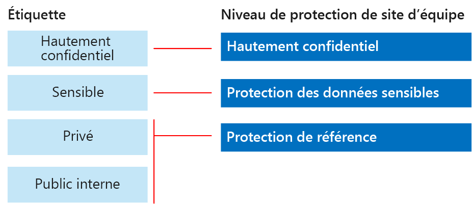

# Sécurisation des fichiers et sites SharePoint Online

 **Résumé :** Configuration des recommandations pour la protection de fichiers dans SharePoint Online et Office 365.
  
Cet article fournit des recommandations pour la configuration des sites d’équipe SharePoint Online et protection de fichier qui équilibre entre la sécurité en toute simplicité de collaboration. Cet article définit quatre différentes configurations, en commençant par un site public au sein de votre organisation avec les stratégies de partage plus ouverts. Chaque configuration supplémentaire représente une étape significative des protection, mais la capacité à accéder et collaborer sur des ressources est réduite à l’ensemble pertinent d’utilisateurs. Utilisez ces recommandations comme point de départ et ajuster les configurations afin de répondre aux besoins de votre organisation. 
  
Les configurations de cet article sont en accord avec les recommandations de Microsoft pour les trois niveaux de protection des données, des identités et des appareils :
  
- Protection de référence
    
- Protection des données sensibles
    
- Protection hautement confidentielle
    
Pour plus d’informations sur ces niveaux et sur les fonctionnalités recommandées pour chaque niveau, consultez les ressources suivantes.  
  
- [Identité et Protection des périphériques pour Office 365](microsoft-cloud-it-architecture-resources.md#BKMK_O365IDP)
    
- [Solutions de Protection des fichiers dans Office 365](microsoft-cloud-it-architecture-resources.md#BKMK_O365fileprotect)
    
## Vue d’ensemble des fonctionnalités

Les recommandations concernant les sites d’équipe SharePoint Online mobilisent un grand nombre de fonctionnalités Office 365. Pour les sites hautement confidentiels, le service Azure Information Protection est recommandé. Ce service est inclus dans EMS (Enterprise Mobility + Security).  
  
L’illustration suivante montre les configurations recommandées pour quatre sites d’équipe SharePoint Online.
  

  
Comme illustré :
  
- La protection de référence inclut deux options pour les sites d’équipe SharePoint Online : un site public et un site privé. Les sites publics peuvent être recherchés et sont accessibles à toute personne de l’organisation. Les sites privés peuvent uniquement être recherchés par les membres du site et seuls ces derniers peuvent y accéder. Ces deux configurations de site permettent le partage en dehors du groupe.  
    
- Les sites pour la protection des données sensibles et hautement confidentielles sont des sites privés avec un accès limité aux seuls membres de groupes spécifiques.
    
- 	Les étiquettes Office 365 permettent de classer les données avec le niveau de protection voulu. Chacun des sites d’équipe SharePoint Online est configuré de façon à attribuer automatiquement une étiquette par défaut, propre au site, aux fichiers figurant dans les bibliothèques de documents. Correspondant aux quatre configurations de site, les étiquettes de cet exemple sont Public interne, Privé, Sensible et Hautement confidentiel. Les utilisateurs peuvent modifier les étiquettes, mais cette configuration garantit que tous les fichiers reçoivent une étiquette par défaut.
    
- Les stratégies de protection contre la perte de données sont configurées pour les étiquettes Office 365 Sensible et Hautement confidentiel afin de prévenir les utilisateurs quand ils essaient d’envoyer ces types de fichiers à l’extérieur de l’organisation, ou de les en empêcher.
    
- Pour les sites configurés avec la protection hautement confidentielle, le service Azure Information Protection chiffre et accorde des autorisations pour des fichiers.
    
## Paramètres à l’échelle du client pour SharePoint Online et OneDrive Entreprise

SharePoint Online et OneDrive Entreprise incluent des paramètres à l’échelle du client qui concernent tous les sites et les utilisateurs. Certains de ces paramètres peuvent également être ajustés au niveau du site pour que ce dernier soit plus restrictif (mais pas moins). Cette section décrit les paramètres à l’échelle du client qui concernent la sécurité et la collaboration.  
  
### Partage

Pour cette solution, nous recommandons les paramètres à l’échelle du client suivants :
  
- Conservez la stratégie de partage par défaut qui autorise le partage avec tous les types de compte, y compris le partage anonyme.
    
- Configurez les liens anonymes de sorte à ce qu’ils expirent, si vous le souhaitez.
    
- Modifiez le type de liaison par défaut pour le partage sur Interne. Cela contribue à la prévention des fuites accidentelles de données à l’extérieur de votre organisation.
    
Bien qu’il puisse sembler contre-intuitif d’autoriser le partage externe, cette approche offre davantage de contrôle sur le partage de fichiers par rapport à l’envoi de fichiers par courrier électronique. SharePoint Online et Outlook fonctionnent ensemble pour sécuriser la collaboration sur les fichiers.  
  
- Par défaut, Outlook partage un lien vers un fichier au lieu d’envoyer le fichier dans un courrier électronique.  
    
- SharePoint Online et OneDrive Entreprise facilitent le partage de liens vers des fichiers avec des collaborateurs qui se trouvent à l’intérieur et à l’extérieur de votre organisation
    
Vous avez également des contrôles pour vous aider à gérer le partage externe. Par exemple, vous pouvez :
  
- désactiver un lien invité anonyme ;
    
- révoquer l’accès utilisateur à un site ;
    
- voir qui a accès à un document ou à un site spécifique ;
    
- configurer les liens de partage anonymes de sorte à ce qu’ils expirent (paramètre client) ;
    
- limiter les utilisateurs qui peuvent partager du contenu en dehors de votre organisation (paramètre client).
    
### Utilisation du partage externe avec la protection contre la perte de données

Si vous n’autorisez pas le partage externe, les utilisateurs avec une entreprise avez besoin trouveront méthodes et autres outils. Microsoft vous recommande de que vous associer un partage externe avec les stratégies DLP pour protéger les fichiers sensibles et hautement confidentielles.
  
### Paramètres d’accès aux appareils

Paramètres d’accès de périphérique pour SharePoint Online et OneDrive pour l’entreprise vous permettent de déterminer si l’accès est limité au navigateur uniquement (les fichiers ne peuvent pas être téléchargés) ou si l’accès est bloqué. Ces paramètres sont actuellement dans la première version et s’appliquent à l’échelle du locataire. Bientôt disponible est la possibilité de configurer des stratégies d’accès de périphérique au niveau du site. Pour cette solution, nous vous recommandons de ne pas à l’aide des paramètres d’accès de périphérique qui s’appliquent à l’échelle du locataire.
  
Pour utiliser les paramètres d’accès de périphérique alors que ces dernières sont dans la première version : [Configurez le Standard ou les premières Options de mise à jour dans Office 365](https://support.office.com/article/Set-up-the-Standard-or-First-Release-options-in-Office-365-3B3ADFA4-1777-4FF0-B606-FB8732101F47).
  
### OneDrive Entreprise

Consultez ces paramètres pour décider si vous souhaitez modifier les paramètres par défaut pour les sites OneDrive Entreprise. Actuellement, le partage et les paramètres d’accès aux appareils sont dupliqués à partir du centre d’administration SharePoint Online et s’appliquent aux deux environnements.
  
## Configuration d’un site d’équipe SharePoint

Le tableau suivant récapitule la configuration pour chacun des sites d’équipe décrits plus haut dans cet article. Utilisez ces configurations comme recommandations de point de départ et ajustez les configurations et les types de site pour répondre aux besoins de votre organisation. Les organisations n’ont pas toutes besoin de tous les types de site. Seules quelques organisations requièrent la protection hautement confidentielle.
  
||||||
|:-----|:-----|:-----|:-----|:-----|
||**Protection de base #1**   |**Protection de base #2**   |**Protection sensible**   |**Hautement confidentielles**   |
|Description    |Recherche ouverte et collaboration au sein de l’organisation.    |Site privé et groupe avec partage autorisé en dehors du groupe.    |Site isolé, dans lequel les niveaux d’accès sont définis par l’appartenance à des groupes spécifiques. Le partage est uniquement autorisé aux membres du site. La protection contre la perte de données prévient les utilisateurs en cas de tentative d’envoi de fichiers à l’extérieur de l’organisation.    |Site isolé + cryptage de fichier et d’autorisations avec Azure la Protection des informations. DLP empêche les utilisateurs d’envoyer des fichiers à l’extérieur de l’organisation.    |
|Site d’équipe public ou privé    |Public    |Privé    |Privé    |Privé    |
|Qui a accès ?    |Tous les membres de l’organisation, y compris les utilisateurs B2B et les utilisateurs invités.    |Les membres du site uniquement. D’autres utilisateurs peuvent demander l’accès.    |Les membres du site uniquement. D’autres utilisateurs peuvent demander l’accès.    |Uniquement les membres. Personne d’autre ne peut demander l’accès.    |
|Contrôles de partage au niveau du site    |Partage autorisé avec tout le monde. Paramètres par défaut.    |Partage autorisé avec tout le monde. Paramètres par défaut.    |Les membres ne peuvent pas partager l’accès au site.    Les non-membres peuvent demander l’accès au site, mais ces demandes doivent être résolues par un administrateur de site.    |Les membres ne peuvent pas partager l’accès au site.    Les non-membres ne peuvent pas demander l’accès au site ou au contenu.    |
|Contrôles d’accès aux appareils au niveau du site    |Aucun contrôle supplémentaire.    |Aucun contrôle supplémentaire.    |Les contrôles au niveau du site seront bientôt disponibles et empêcheront les utilisateurs de télécharger des fichiers sur des appareils non conformes ou non liés à un domaine. Cela permet un accès par navigateur uniquement à partir de tous les autres appareils.    |Les contrôles au niveau du site, qui bloquent le téléchargement de fichiers sur des appareils non conformes ou non joints à un domaine, seront bientôt disponibles.    |
|Étiquettes Office 365    |Public interne    |Privé    |Sensible    |Hautement confidentiel    |
|Stratégies de protection contre la perte de données    |||Prévenez les utilisateurs en cas d’envoi de fichiers étiquetés comme sensibles à l’extérieur de l’organisation.    Pour bloquer le partage externe de types de données sensibles, telles que les numéros de carte de crédit ou d’autres données personnelles, vous pouvez configurer des stratégies de protection contre la perte de données supplémentaires pour ces types de données (y compris les types de données personnalisés que vous configurez).    |Empêchent les utilisateurs d’envoyer des fichiers portant l’étiquette Hautement confidentiel en dehors de l’organisation. Autorisent les utilisateurs à passer outre ce paramètre en fournissant une justification, notamment en indiquant la personne avec laquelle ils partagent le fichier.    |
|Azure Information Protection    ||||Utilisez Azure Information Protection pour chiffrer automatiquement les fichiers et leur accorder des autorisations. Cette protection se déplace avec les fichiers au cas où ils sortent de l’organisation.     Office 365 ne peut pas lire les fichiers cryptés avec la Protection des informations Azure. En outre, les stratégies DLP ne peuvent fonctionner avec les métadonnées (y compris les étiquettes) mais pas le contenu de ces fichiers (par exemple les numéros de carte de crédit dans les fichiers).    |
   
Pour savoir comment déployer les quatre types différents de sites d’équipe SharePoint Online dans cette solution, consultez [les sites déployer SharePoint Online à trois niveaux de protection](deploy-sharepoint-online-sites-for-three-tiers-of-protection.md). Pour les étapes créer un environnement de développement/test, consultez [les sites SharePoint Online de la sécuriser dans un environnement de développement/test](secure-sharepoint-online-sites-in-a-dev-test-environment.md). 
  
## Étiquettes et classification Office 365

L’utilisation des étiquettes Office 365 est recommandée pour les environnements comportant des données sensibles. Après avoir configuré et publié des étiquettes Office 365 :
  
- Vous pouvez appliquer une étiquette par défaut à une bibliothèque de documents dans un site d’équipe SharePoint Online, afin que tous les documents figurant dans cette bibliothèque obtiennent l’étiquette par défaut.  
    
- Vous pouvez appliquer des étiquettes au contenu automatiquement s’il répond à des conditions spécifiques.
    
- Vous pouvez appliquer des stratégies DLP qui sont basées sur les étiquettes d’Office 365.
    
- Les personnes de votre organisation peuvent appliquer une étiquette manuellement au contenu dans Outlook sur le web, Outlook 2010 et les versions ultérieur, OneDrive pour les groupes d’entreprises, SharePoint Online et Office 365. Les utilisateurs souvent connaissent mieux le type de contenu, ils collaborent avec, leur permettant de classer et de la stratégie DLP approprié appliqué.
    

  
Comme illustré, cette solution comprend la création des étiquettes suivantes :
  
- Hautement confidentiel
    
- Sensible
    
- Privé
    
- Public interne
    
Ces étiquettes sont mises en correspondance avec les sites recommandés dans les illustrations et graphiques figurant plus haut dans cet article. Cette solution recommande de configurer des stratégies DLP pour empêcher la fuite de fichiers portant l’étiquette Sensible et Hautement confidentiel.
  
Pour savoir comment configurer des étiquettes d’Office 365 et de stratégies DLP dans cette solution, consultez [les fichiers protéger SharePoint Online avec les étiquettes d’Office 365 et DLP](protect-sharepoint-online-files-with-office-365-labels-and-dlp.md).
  
## Azure Information Protection

Protection des informations Azure permet d’appliquer des étiquettes et des protections qui suivent les fichiers, où ils veulent. Pour cette solution, nous vous recommandons de qu'utiliser une stratégie de Protection des informations Azure étendue et une étiquette sous l’étiquette hautement confidentielles pour crypter et accorder des autorisations à des fichiers qui doivent être protégés par le niveau de sécurité le plus élevé. 
  
N’oubliez pas que, lorsque le cryptage Azure la Protection des informations est appliqué à des fichiers stockés dans Office 365, le service ne peut pas traiter le contenu de ces fichiers. Co-création, eDiscovery, recherche, Delve et autres fonctionnalités de collaboration ne fonctionnent pas. Stratégies DLP ne peuvent fonctionner qu’avec les métadonnées (y compris les étiquettes de Office 365), mais pas le contenu de ces fichiers (par exemple les numéros de carte de crédit dans les fichiers).
  

  
Comme illustré :
  
- Vous configurez les stratégies de Protection des informations Azure et étiquettes dans le portail Microsoft Azure. Configuration d’une étiquette secondaire d’une stratégie de Protection des informations Azure étendue est recommandé.
    
- Protection des informations Azure les étiquettes afficher sous la forme d’une barre de **protection des informations** dans les applications Office.
    
### Ajout d’autorisations pour les utilisateurs externes

Il existe deux méthodes que vous pouvez accorder aux utilisateurs externes l’accès aux fichiers protégés par la Protection des informations Azure. Dans ces deux cas, les utilisateurs externes doivent avoir un compte Azure. Si les utilisateurs externes ne sont pas membres d’une organisation qui utilise AD Azure, ils peuvent obtenir un compte Azure individuel à l’aide de cette page d’inscription : [https://aka.ms/aip-signup](https://aka.ms/aip-signup).
  
- Ajouter des utilisateurs externes à un groupe Azure AD qui est utilisé pour configurer la protection d’une étiquette
    
     Vous devez d’abord ajouter le compte en tant qu’un utilisateur B2B dans votre répertoire. Il peut prendre quelques heures pour [l’appartenance au groupe de mise en cache par Azure Rights Management](https://docs.microsoft.com/information-protection/plan-design/prepare#group-membership-caching-by-azure-rights-management). Avec cette méthode, les autorisations sont accordées à tous les fichiers existants protégés par l’étiquette (même les fichiers protégés avant l’ajout d’un utilisateur pour le groupe d’annonces Azure).
    
- Ajouter des utilisateurs externes directement à la protection d’étiquette
    
     Vous pouvez ajouter tous les utilisateurs d’une organisation (par exemple, Fabrikam.com), un groupe Azure AD (par exemple, un groupe financier au sein d’une organisation) ou un utilisateur individuel. Par exemple, vous pouvez ajouter une équipe externe de régulateurs à la protection d’une étiquette. Avec cette méthode, les autorisations sont accordées uniquement aux fichiers protégés avec l’étiquette une fois que l’entité externe est ajoutée à la protection.
    
### Déploiement et utilisation d’Azure Information Protection

Pour les étapes de configuration de la Protection des informations Azure dans cette solution, consultez [fichiers protéger SharePoint Online avec Azure la Protection des informations](protect-sharepoint-online-files-with-azure-information-protection.md).
  
## See Also

[Conseils de sécurité Microsoft pour les campagnes électorales, les organisations à but non lucratif et d'autres organisations flexibles](microsoft-security-guidance-for-political-campaigns-nonprofits-and-other-agile-o.md)
  
[Solutions de sécurité](security-solutions.md)
  
[Adoption du cloud et solutions hybrides](cloud-adoption-and-hybrid-solutions.md)
  
[Sites SharePoint en ligne sécurisés dans un environnement de développement/test](secure-sharepoint-online-sites-in-a-dev-test-environment.md)

