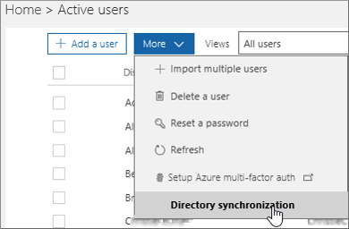

# Configurer la synchronisation d’annuaires pour Office 365Set up directory synchronization for Office 365

Office 365 utilise le service de gestion des identités des utilisateurs en nuage Azure Active Directory pour gérer les utilisateurs.Office 365 uses the cloud-based user identity management service Azure Active Directory to manage users. Vous pouvez également intégrer Active Directory sur site à Azure AD en synchronisant votre environnement local avec Office 365.You can also integrate your on-premises Active Directory with Azure AD by synchronizing your on-premises environment with Office 365. Une fois que vous avez configuré la synchronisation, vous pouvez décider que l'authentification de l'utilisateur doit avoir lieu dans Azure AD ou dans votre annuaire local.Once you set up synchronization you can decide to have their user authentication take place within Azure AD or within your on-premises directory.
  
## Synchronisation d'annuaires Office 365Office 365 directory synchronization

Vous pouvez utiliser l'identité synchronisée ou une identité fédérée entre votre organisation locale et Office 365.You can either use synchronized identity or federated identity between your on-premises organization and Office 365. Avec l'identité synchronisée, vous gérez vos utilisateurs sur site et ils sont authentifiés par Azure AD lorsqu'ils utilisent le même mot de passe dans le Cloud en tant que local.With synchronized identity, you manage your users on-premises, and they are authenticated by Azure AD when they use the same password in the cloud as on-premises. Il s'agit du scénario de synchronisation d'annuaire le plus courant.This is the most common directory synchronization scenario. L'authentification directe ou l'identité fédérée, vous permet de gérer vos utilisateurs en local et de les authentifier par votre annuaire local.Pass-through authentication or Federated identity, allows you to manage your users on-premises and they are authenticated by your on-premises directory. L'identité fédérée nécessite une configuration supplémentaire et permet à vos utilisateurs de se connecter uniquement une fois.Federated identity requires additional configuration and enables your users to only sign in once. Pour plus d'informations, consultez la rubrique [understandIng Office 365 Identity and Azure Active Directory](about-office-365-identity.md).For details, read [Understanding Office 365 Identity and Azure Active Directory](about-office-365-identity.md).
  
## Vous souhaitez effectuer une mise à niveau à partir de la synchronisation Windows Azure Active Directory (dirSync) vers Azure Active Directory Connect?Want to upgrade from Windows Azure Active Directory sync (DirSync) to Azure Active Directory Connect?

Si vous utilisez actuellement dirSync et que vous souhaitez effectuer la mise à niveau, consultez [Azure.com](https://azure.com) pour [obtenir les instructions de mise à niveau](https://go.microsoft.com/fwlink/p/?LinkId=733240).If you are currently using DirSync and want to upgrade, head over to [azure.com](https://azure.com) for [upgrade instructions](https://go.microsoft.com/fwlink/p/?LinkId=733240).
  
## Conditions préalables pour Azure AD ConnectPrerequisites for Azure AD Connect

Vous bénéficiez d'un abonnement gratuit à Azure AD avec votre abonnement Office 365.You get a free subscription to Azure AD with your Office 365 subscription. Lorsque vous configurez la synchronisation d'annuaires, vous devez installer Azure Active Directory Connect sur l'un de vos serveurs locaux.When you set up directory synchronization, you will install Azure Active Directory Connect on one of your on-premises servers.
  
Pour Office 365, vous devez:For Office 365 you will need to:
  
- Vérifiez votre domaine local (la procédure vous guidera à travers cela).Verify your on-premises domain (the procedure will guide you through this).
- Vous pouvez [attribuer des rôles d'administrateur dans office 365 pour](https://support.office.com/article/EAC4D046-1AFD-4F1A-85FC-8219C79E1504) les autorisations d'entreprise pour votre client Office 365 et Active Directory local.Have [Assign admin roles in Office 365 for business](https://support.office.com/article/EAC4D046-1AFD-4F1A-85FC-8219C79E1504) permissions for your Office 365 tenant and on-premises Active Directory.

Pour votre serveur local sur lequel vous installez Azure AD Connect, vous aurez besoin des logiciels suivants:For your on-premises server on which you install Azure AD Connect you will need the following software:
  
|**SYSTÈME d'exploitation du serveur****Server OS**|**Autres logiciels****Other software**|
|:-----|:-----|
|**Windows Server 2012 R2****Windows Server 2012 R2** | -PowerShell est installé par défaut, aucune action n'est requise.- PowerShell is installed by default, no action is required.    -Les versions net 4.5.1 et versions ultérieures sont proposées via Windows Update.- Net 4.5.1 and later releases are offered through Windows Update. Assurez-vous que vous avez installé les dernières mises à jour de Windows Server dans le panneau de configuration.Make sure you have installed the latest updates to Windows Server in the Control Panel. |
|**Windows server 2008 R2 avec Service Pack 1 (SP1)** ou **Windows Server 2012****Windows Server 2008 R2 with Service Pack 1 (SP1)** or **Windows Server 2012** | -La dernière version de PowerShell est disponible dans Windows Management Framework 4,0.- The latest version of PowerShell is available in Windows Management Framework 4.0. Recherchez-le sur le [Centre de téléchargement Microsoft](https://go.microsoft.com/fwlink/p/?LinkId=717996).Search for it on [Microsoft Download Center](https://go.microsoft.com/fwlink/p/?LinkId=717996).    -.Net 4.5.1 et versions ultérieures sont disponibles sur le [Centre de téléchargement Microsoft](https://go.microsoft.com/fwlink/p/?LinkId=717996).- .Net 4.5.1 and later releases are available on [Microsoft Download Center](https://go.microsoft.com/fwlink/p/?LinkId=717996). |
|**Windows Server 2008****Windows Server 2008** | -La dernière version prise en charge de PowerShell est disponible dans Windows Management Framework 3,0, disponible sur le [Centre de téléchargement Microsoft](https://go.microsoft.com/fwlink/p/?LinkId=717996).- The latest supported version of PowerShell is available in Windows Management Framework 3.0, available on [Microsoft Download Center](https://go.microsoft.com/fwlink/p/?LinkId=717996).    -.Net 4.5.1 et versions ultérieures sont disponibles sur le [Centre de téléchargement Microsoft](https://go.microsoft.com/fwlink/p/?LinkId=717996).- .Net 4.5.1 and later releases are available on [Microsoft Download Center](https://go.microsoft.com/fwlink/p/?LinkId=717996). |

> [!NOTE]
> Si vous utilisez Azure Active Directory dirSync, le nombre maximal de membres du groupe de distribution que vous pouvez synchroniser à partir de votre Active Directory local vers Azure Active Directory est de 15 000.If you're using Azure Active Directory DirSync, the maximum number of distribution group members that you can synchronize from your on-premises Active Directory to Azure Active Directory is 15,000. Pour Azure AD Connect, ce numéro est 50 000.For Azure AD Connect, that number is 50,000.
  
Pour consulter plus soigneusement le matériel, les logiciels, les exigences de compte et d'autorisation, les exigences de certificat SSL et les limites d'objet pour Azure AD Connect, lisez [Prerequisites pour Azure Active Directory Connect](https://docs.microsoft.com/azure/active-directory/hybrid/how-to-connect-install-prerequisites).To more carefully review hardware, software, account and permissions requirements, SSL certificate requirements, and object limits for Azure AD Connect, read [Prerequisites for Azure Active Directory Connect](https://docs.microsoft.com/azure/active-directory/hybrid/how-to-connect-install-prerequisites).
  
Vous pouvez également consulter l' [historique des versions](https://docs.microsoft.com/azure/active-directory/hybrid/reference-connect-version-history) de Azure ad Connect pour voir ce qui est inclus et résolu dans chaque version.You can also review the Azure AD Connect [version release history](https://docs.microsoft.com/azure/active-directory/hybrid/reference-connect-version-history) to see what is included and fixed in each release.

## Pour configurer la synchronisation d'annuairesTo set up directory synchronization

1. connectez-vous au [centre d'administration Microsoft 365](https://admin.microsoft.com) et \*\*\*\* \> choisissez utilisateurs **actifs** dans le volet de navigation de gauche.Sign in to the [Microsoft 365 admin center](https://admin.microsoft.com) and choose **Users** \> **Active Users** on the left navigation.
2. Dans le centre d'administration, sur la page **utilisateurs actifs** , **Sélectionnez plus** \> de **synchronisation**d'annuaires.In the admin center, on the **Active users** page, choose **More** \> **Directory synchronization**.

    
  
3. Sur la page **préparation d'Active Directory** , sélectionnez le lien **Télécharger l'outil Microsoft Azure Active Directory Connect** pour commencer.On the **Active Directory preparation** page, select the **Download Microsoft Azure Active Directory Connect tool** link to get started. Pour plus d'informations sur le processus d'installation d'Azure Active Directory Connect, reportez-vous à la feuille de [route Azure ad Connect et Azure ad Connect Health installation](https://docs.microsoft.com/azure/active-directory/hybrid/how-to-connect-install-roadmap).For more information about the Azure Active Directory Connect installation process, see [Azure AD Connect and Azure AD Connect Health installation roadmap](https://docs.microsoft.com/azure/active-directory/hybrid/how-to-connect-install-roadmap).

## Attribuer des licences à des utilisateurs synchronisésAssign licenses to synchronized users

Une fois que vous avez synchronisé vos utilisateurs vers Office 365, ils sont créés, mais vous devez leur attribuer des licences afin qu'ils puissent utiliser les fonctionnalités d'Office 365, telles que le courrier électronique.After you have synchronized your users to Office 365, they are created but you need to assign licenses to them so they can use Office 365 features, such as mail. Pour obtenir des instructions, consultez la rubrique [attribuer des licences aux utilisateurs dans Office 365 pour les entreprises](https://support.office.com/article/997596b5-4173-4627-b915-36abac6786dc).For instructions, see [Assign licenses to users in Office 365 for business](https://support.office.com/article/997596b5-4173-4627-b915-36abac6786dc).

## Terminer la configuration des domainesFinish setting up domains

Suivez les étapes de la procédure [créer des enregistrements DNS pour Office 365 lorsque vous gérez vos enregistrements DNS](https://support.office.com/article/b0f3fdca-8a80-4e8e-9ef3-61e8a2a9ab23) pour terminer la configuration de vos domaines.Follow the steps in [Create DNS records for Office 365 when you manage your DNS records](https://support.office.com/article/b0f3fdca-8a80-4e8e-9ef3-61e8a2a9ab23) to finish setting up your domains.