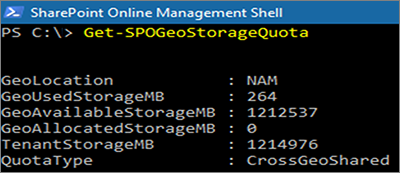

# Quotas de stockage SharePoint dans des environnements multigéographiques

Par défaut, tous les emplacements géographiques d’un environnement multigéographique partagent le quota de stockage disponible du locataire.

Avec le paramètre de quota de stockage de zone géographique SharePoint, vous pouvez gérer le quota de stockage de chaque emplacement géographique. Lorsque vous allouez un quota de stockage à un emplacement géographique, ce quota devient le volume maximal de stockage disponible pour cet emplacement géographique, et est déduit du quota de stockage disponible du locataire. Le quota de stockage disponible restant du client est ensuite partagé entre les emplacements géographiques configurés auxquels aucun quota de stockage spécifique n’a pas été alloué.

L’administrateur SharePoint Online peut allouer le quota de stockage SharePoint de tout emplacement géographique en se connectant à l’emplacement central. Les administrateurs géographiques des emplacements satellites peuvent consulter le quota de stockage mais ne peuvent pas l’allouer.

## Configurer un quota de stockage pour un emplacement géographique

Utilisez le [Module Microsoft Office SharePoint Online](https://www.microsoft.com/en-us/download/details.aspx?id=35588 ) pour vous connecter à l’emplacement central afin d’allouer le quota de stockage d’un emplacement géographique. 

Pour allouer un quota de stockage à un emplacement, exécutez la cmdlet suivante :

`Set-SPOGeoStorageQuota -GeoLocation <geolocationcode> -StorageQuotaMB <value>`

Pour afficher le quota de stockage de l’emplacement géographique actuel, exécutez la cmdlet suivante :

`Get-SPOGeoStorageQuota`

Pour afficher le quota de stockage de tous les emplacements géographiques, exécutez la cmdlet suivante :

`Get-SPOGeoStorageQuota -AllLocations`

Pour supprimer le quota de stockage alloué à un emplacement géographique, définissez `StorageQuota value = 0` :

`Set-SPOGeoStorageQuota -GeoLocation <geolocationcode> -StorageQuotaMB 0`
