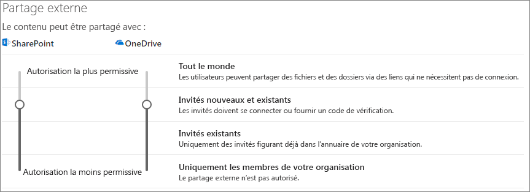
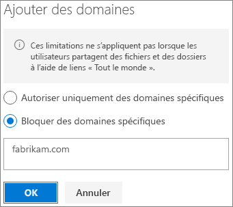

# Limiter l’exposition accidentelle aux fichiers lors du partage avec des invités

Lorsque vous partagez des fichiers et des dossiers avec des invités, plusieurs options permettent de réduire les risques de partager accidentellement des informations confidentielles. Vous pouvez choisir l’une des options de cet article pour répondre au mieux aux besoins de votre organisation.

## Utiliser les pratiques recommandées pour les liens Tout le monde

Si des membres de votre organisation doivent effectuer un partage anonyme, mais que vous êtes préoccupé par le fait que des invités non authentifiés modifient du contenu, lisez les [meilleures pratiques relatives au partage anonyme](best-practices-anonymous-sharing.md) pour obtenir des instructions sur l’utilisation du partage anonyme dans votre organisation.

## Désactiver les liens Tout le monde

Nous vous recommandons de laisser les liens *Tout le monde* activés pour le contenu approprié parce qu’il s’agit de la manière la plus simple de partager des documents et de réduire le risque que des utilisateurs recherchent d’autres solutions en dehors du contrôle de votre service informatique. Les liens *Tout le monde* peuvent être transférés à d’autres personnes mais l’accès aux fichiers est disponible uniquement pour les personnes qui dispose du lien.

Si vous voulez toujours que les invités s’authentifient lors de l’accès au contenu dans SharePoint, les groupes ou Teams, vous pouvez désactiver le partage *Tout le monde*. Cela empêche les utilisateurs de partager du contenu de manière anonyme.

Si vous désactivez les liens *Tout le monde*, les utilisateurs peuvent tout de même partager facilement du contenu avec des invités à l’aide de liens *Personnes spécifiques*. Dans ce cas, tous les invités devront s’authentifier avant de pouvoir accéder au contenu partagé.

Selon vos besoins, vous pouvez désactiver les liens *Tout le monde* vers des sites spécifiques ou pour l’ensemble de votre organisation.

Pour désactiver les liens *Tout le monde* de votre organisation
1. Dans le centre d’administration SharePoint, dans le volet de gauche, cliquez sur **Partage**.
2. Définissez les paramètres de partage externe de SharePoint sur **Invités nouveaux et existants**. 
   
3. Cliquez sur **Enregistrer**.

Pour désactiver les liens *Tout le monde* d’un site
1. Dans le centre d’administration SharePoint, dans le volet de navigation de gauche, développez **Sites** et cliquez sur **Sites actifs**.
2. Sélectionnez le site de l’équipe que vous venez de créer.
3. Dans le ruban, cliquez sur **Partage**. 
4. Assurez-vous que le partage est paramétré sur **Invités nouveaux et existants**. 
   
5. Si vous avez effectué des modifications, cliquez sur **Enregistrer**.

## Filtrage de domaines

Vous pouvez utiliser des listes d’autorisation ou de refus de domaine pour identifier les domaines dont vos utilisateurs peuvent accepter des invités.

Avec une liste d’autorisation, vous pouvez spécifier une liste de domaines dont les utilisateurs de votre organisation peuvent accepter des invités. Les invitations à d’autres domaines sont bloquées. Si votre organisation collabore uniquement avec des invités à partir d’une liste de domaines spécifiques, vous pouvez utiliser cette fonctionnalité pour empêcher le partage avec d’autres domaines.

Avec une liste de refus, vous pouvez spécifier une liste de domaines à partir desquels les utilisateurs de votre organisation ne peuvent pas accepter d’invités. Les invitations aux domaines répertoriés sont bloquées. Cela peut s’avérer utile si vous avez des concurrents, par exemple, que vous souhaitez empêcher de devenir invités au sein de votre organisation.

Les listes d’autorisation et de refus n’affectent que le partage avec des invités authentifiés. Les utilisateurs peuvent toujours partager du contenu avec des invités de domaines interdits en utilisant les liens *Tout le monde* si vous ne les avez pas désactivés. Pour des résultats optimaux avec les listes d’autorisation et de refus de domaine, prévoyez de désactiver les liens *Tout le monde*, comme décrit ci-dessus.

Pour configurer une liste d’autorisation ou de refus de domaine pour le partage d’invités
1. Dans le centre d’administration SharePoint, dans le volet de gauche, cliquez sur **Partage**.
2. Sous **Paramètres avancés pour le partage externe**, cochez la case **Limiter le partage externe par domaine**.
3. Cliquez sur **Ajouter des domaines**.
4. Choisissez si vous voulez bloquer des domaines, indiquez les domaines, puis cliquez sur **OK**. 
   
5. Cliquez sur **Enregistrer**.

Si vous voulez limiter le partage par domaine à un niveau plus élevé que SharePoint et OneDrive, vous pouvez [autoriser ou bloquer les invitations à des utilisateurs B2B d’organisations spécifiques](https://docs.microsoft.com/azure/active-directory/b2b/allow-deny-list) dans Azure Active Directory. (Vous devez configurer [l’intégration de SharePoint et OneDrive avec Azure AD B2B (préversion)](https://docs.microsoft.com/sharepoint/sharepoint-azureb2b-integration-preview) pour que ces paramètres affectent SharePoint et OneDrive.)

## Limiter le partage des fichiers, dossiers et sites par des invités à des groupes de sécurité spécifiés

Vous pouvez limiter le partage des fichiers, des dossiers et des sites par des invités aux membres d’un groupe de sécurité spécifique. Cette fonction est utile si vous voulez activer le partage par des invités, mais avec un flux de travail d’approbation ou un processus de demande.

Pour limiter le partage par des invités aux membres d’un groupe de sécurité
1. Dans le centre d’administration SharePoint, dans le volet de gauche, cliquez sur **Partage**.
2. Sous **Autres paramètres**. Suivez le lien **Limiter le partage externe avec des groupes de sécurité spécifiques**.
3. Sous **Utilisateurs autorisés à partager du contenu en dehors de votre organisation**, cochez l’une des cases ou les deux : a. **Autoriser uniquement les membres des groupes de sécurité sélectionnés à partager du contenu avec des utilisateurs externes authentifiés** pour spécifier un groupe de sécurité pouvant partager du contenu avec des utilisateurs authentifiés b. **Autoriser uniquement les membres des groupes de sécurité sélectionnés à partager du contenu avec des utilisateurs externes authentifiés ou disposant de liens anonymes** pour spécifier un groupe de sécurité pouvant partager du contenu avec des utilisateurs authentifiés et via les liens Tout le monde
4. Cliquez sur **OK**.

Notez que cela affecte les fichiers, dossiers et sites, mais pas les groupes Office 365 ou Teams. Lorsque les membres acceptent des invités dans un groupe Office 365 privé ou une équipe privée dans Microsoft Teams, l’invitation est envoyée au groupe ou au propriétaire de l’équipe pour approbation.

## Voir aussi

[Créer un environnement de partage sécurisé avec des invités](create-a-secure-guest-sharing-environment.md)

[Meilleures pratiques relatives au partage de fichiers et de dossiers avec des utilisateurs anonymes](best-practices-anonymous-sharing.md)