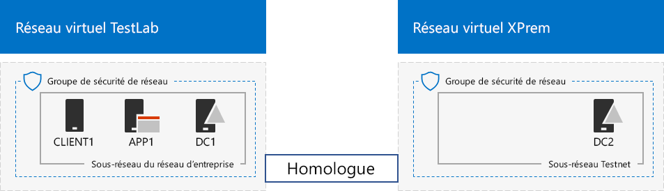
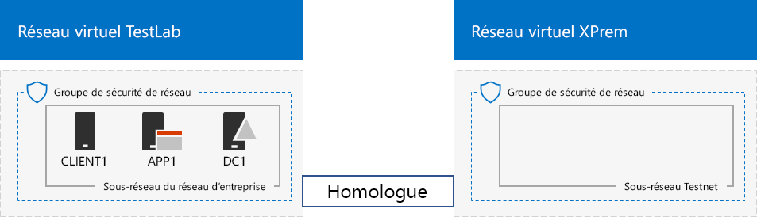

# <a name="simulated-cross-premises-virtual-network-in-azure"></a><span data-ttu-id="bd513-103">Réseau virtuel intersites simulé dans Azure</span><span class="sxs-lookup"><span data-stu-id="bd513-103">Simulated cross-premises virtual network in Azure</span></span>

 <span data-ttu-id="bd513-104">**Résumé :** Créez un réseau virtuel intersites simulé dans Microsoft Azure en tant qu’environnement de développement/test.</span><span class="sxs-lookup"><span data-stu-id="bd513-104">**Summary:** Create a simulated cross-premises virtual network in Microsoft Azure as a dev/test environment.</span></span>
  
<span data-ttu-id="bd513-p101">Cet article vous guide tout au long de la création d’un environnement de cloud hybride simulé avec Microsoft Azure, à l’aide de deux réseaux virtuels Azure. Voici la configuration obtenue.</span><span class="sxs-lookup"><span data-stu-id="bd513-p101">This article steps you through creating a simulated hybrid cloud environment with Microsoft Azure using two Azure virtual networks. Here is the resulting configuration.</span></span> 
  

  
<span data-ttu-id="bd513-108">Cette configuration simule un environnement de production cloud hybride Azure IaaS et comprend les éléments suivants :</span><span class="sxs-lookup"><span data-stu-id="bd513-108">This simulates an Azure IaaS hybrid cloud production environment and consists of:</span></span>
  
- <span data-ttu-id="bd513-109">Un réseau local simulé et simplifié hébergé dans un réseau virtuel Azure (réseau virtuel TestLab).</span><span class="sxs-lookup"><span data-stu-id="bd513-109">A simulated and simplified on-premises network hosted in an Azure virtual network (the TestLab virtual network).</span></span>
    
- <span data-ttu-id="bd513-110">Un réseau virtuel intersites simulé hébergé dans Azure (XPrem).</span><span class="sxs-lookup"><span data-stu-id="bd513-110">A simulated cross-premises virtual network hosted in Azure (XPrem).</span></span>
    
- <span data-ttu-id="bd513-111">Une relation d’homologation VNet entre les deux réseaux virtuels.</span><span class="sxs-lookup"><span data-stu-id="bd513-111">A VNet peering relationship between the two virtual networks.</span></span>
    
- <span data-ttu-id="bd513-112">Un contrôleur de domaine secondaire dans le réseau virtuel XPrem.</span><span class="sxs-lookup"><span data-stu-id="bd513-112">A secondary domain controller in the XPrem virtual network.</span></span>
    
<span data-ttu-id="bd513-113">Ces éléments offrent une base commune à partir de laquelle vous pouvez :</span><span class="sxs-lookup"><span data-stu-id="bd513-113">This provides a basis and common starting point from which you can:</span></span> 
  
- <span data-ttu-id="bd513-114">Développer et tester des applications dans un environnement cloud hybride Azure IaaS simulé.</span><span class="sxs-lookup"><span data-stu-id="bd513-114">Develop and test applications in a simulated Azure IaaS hybrid cloud environment.</span></span>
    
- <span data-ttu-id="bd513-115">Créer des configurations de test d’ordinateurs, certains au sein du réseau virtuel TestLab et d’autres au sein du réseau virtuel XPrem, afin de simuler les charges de travail informatiques dans un environnement cloud hybride.</span><span class="sxs-lookup"><span data-stu-id="bd513-115">Create test configurations of computers, some within the TestLab virtual network and some within the XPrem virtual network, to simulate hybrid cloud-based IT workloads.</span></span>
    
<span data-ttu-id="bd513-116">Les trois phases principales pour configurer cet environnement de développement/test sont les suivantes :</span><span class="sxs-lookup"><span data-stu-id="bd513-116">There are three major phases to setting up this dev/test environment:</span></span>
  
1. <span data-ttu-id="bd513-117">Configurer le réseau virtuel TestLab.</span><span class="sxs-lookup"><span data-stu-id="bd513-117">Configure the TestLab virtual network.</span></span>
    
2. <span data-ttu-id="bd513-118">Créer le réseau virtuel intersites.</span><span class="sxs-lookup"><span data-stu-id="bd513-118">Create the cross-premises virtual network.</span></span>
    
3. <span data-ttu-id="bd513-119">Configurer DC2</span><span class="sxs-lookup"><span data-stu-id="bd513-119">Configure DC2.</span></span>
    
> [!NOTE]
> <span data-ttu-id="bd513-120">Cette configuration nécessite un abonnement payant à Azure.</span><span class="sxs-lookup"><span data-stu-id="bd513-120">This configuration requires a paid Azure subscription.</span></span> 
  

  
> [!TIP]
> <span data-ttu-id="bd513-122">Cliquez sur[ici](http://aka.ms/catlgstack) pour afficher le plan de tous les articles dans le guide de Laboratoire Test Office 365.</span><span class="sxs-lookup"><span data-stu-id="bd513-122">Click [here](http://aka.ms/catlgstack) for a visual map to all the articles in the Office 365 Test Lab Guide stack.</span></span>
  
## <a name="phase-1-configure-the-testlab-virtual-network"></a><span data-ttu-id="bd513-123">Phase 1 : Configurer le réseau virtuel TestLab</span><span class="sxs-lookup"><span data-stu-id="bd513-123">Phase 1: Configure the TestLab virtual network</span></span>

<span data-ttu-id="bd513-124">Suivez les instructions de l’article [Environnement de développement/test de configuration de base](base-configuration-dev-test-environment.md) pour configurer les ordinateurs DC1, APP1 et CLIENT1 du réseau virtuel Azure nommé TestLab.</span><span class="sxs-lookup"><span data-stu-id="bd513-124">Use the instructions in [Base Configuration dev/test environment](base-configuration-dev-test-environment.md) to configure the DC1, APP1, and CLIENT1 computers in the Azure virtual network named TestLab.</span></span>
  
<span data-ttu-id="bd513-125">Il s’agit de votre configuration actuelle.</span><span class="sxs-lookup"><span data-stu-id="bd513-125">This is your current configuration.</span></span> 
  

  
## <a name="phase-2-create-the-xprem-virtual-network"></a><span data-ttu-id="bd513-127">Phase 2 : Créer le réseau virtuel XPrem</span><span class="sxs-lookup"><span data-stu-id="bd513-127">Phase 2: Create the XPrem virtual network</span></span>

<span data-ttu-id="bd513-128">Dans cette phase, vous devez créer et configurer le nouveau réseau virtuel XPrem et le connecter au réseau virtuel TestLab avec l’homologation VNet.</span><span class="sxs-lookup"><span data-stu-id="bd513-128">In this phase, you create and configure the new XPrem virtual network and then connect it to the TestLab virtual network with VNet peering.</span></span>
  
<span data-ttu-id="bd513-129">Tout d’abord, démarrez une invite PowerShell Azure sur votre ordinateur local.</span><span class="sxs-lookup"><span data-stu-id="bd513-129">First, start an Azure PowerShell prompt on your local computer.</span></span>
  
> [!NOTE]
> <span data-ttu-id="bd513-p102">Les ensembles de commandes suivants utilisent la dernière version d'Azure PowerShell. Reportez-vous à la rubrique relative à la [prise en main des cmdlets Azure PowerShell](https://docs.microsoft.com/fr-FR/powershell/azureps-cmdlets-docs/).</span><span class="sxs-lookup"><span data-stu-id="bd513-p102">The following command sets use the latest version of Azure PowerShell. See [Get started with Azure PowerShell cmdlets](https://docs.microsoft.com/en-us/powershell/azureps-cmdlets-docs/).</span></span> 
  
<span data-ttu-id="bd513-132">Connectez-vous à votre compte Azure avec cette commande.</span><span class="sxs-lookup"><span data-stu-id="bd513-132">Sign in to your Azure account with this command.</span></span>
  
```
Connect-AzAccount
```

<!--
> [!TIP]
> Click [here](https://gallery.technet.microsoft.com/PowerShell-commands-for-7844edd0) to get a text file that has all of the PowerShell commands in this article.
-->
  
<span data-ttu-id="bd513-133">Obtenez le nom de votre abonnement à l’aide de la commande suivante.</span><span class="sxs-lookup"><span data-stu-id="bd513-133">Get your subscription name using this command.</span></span>
  
```
Get-AzSubscription | Sort Name | Select Name
```

<span data-ttu-id="bd513-p103">Définissez votre abonnement Azure. Remplacez tout le texte entre guillemets, y compris les caractères \< et >, avec les noms corrects.</span><span class="sxs-lookup"><span data-stu-id="bd513-p103">Set your Azure subscription. Replace everything within the quotes, including the \< and > characters, with the correct names.</span></span>
  
```
$subscrName="<subscription name>"
Select-AzSubscription -SubscriptionName $subscrName
```

<span data-ttu-id="bd513-136">Créez ensuite le réseau virtuel XPrem et protégez-le avec un groupe de sécurité réseau, à l’aide des commandes suivantes.</span><span class="sxs-lookup"><span data-stu-id="bd513-136">Next, create the XPrem virtual network and protect it with a network security group with these commands.</span></span>
  
```
$rgName="<name of the resource group that you used for your TestLab virtual network>"
$locName=(Get-AzResourceGroup -Name $rgName).Location
$Testnet=New-AzVirtualNetworkSubnetConfig -Name "Testnet" -AddressPrefix 192.168.0.0/24
New-AzVirtualNetwork -Name "XPrem" -ResourceGroupName $rgName -Location $locName -AddressPrefix 192.168.0.0/16 -Subnet $Testnet -DNSServer 10.0.0.4
$rule1=New-AzNetworkSecurityRuleConfig -Name "RDPTraffic" -Description "Allow RDP to all VMs on the subnet" -Access Allow -Protocol Tcp -Direction Inbound -Priority 100 -SourceAddressPrefix Internet -SourcePortRange * -DestinationAddressPrefix * -DestinationPortRange 3389
New-AzNetworkSecurityGroup -Name "Testnet" -ResourceGroupName $rgName -Location $locName -SecurityRules $rule1
$vnet=Get-AzVirtualNetwork -ResourceGroupName $rgName -Name XPrem
$nsg=Get-AzNetworkSecurityGroup -Name "Testnet" -ResourceGroupName $rgName
Set-AzVirtualNetworkSubnetConfig -VirtualNetwork $vnet -Name "Testnet" -AddressPrefix 192.168.0.0/24 -NetworkSecurityGroup $nsg
$vnet | Set-AzVirtualNetwork
```

<span data-ttu-id="bd513-137">Vous devez ensuite créer la relation d’homologation VNet entre les réseaux virtuels TestLab et XPrem, à l’aide des commandes suivantes.</span><span class="sxs-lookup"><span data-stu-id="bd513-137">Next, you create the VNet peering relationship between the TestLab and XPrem VNets with these commands.</span></span>
  
```
$rgName="<name of the resource group that you used for your TestLab virtual network>"
$vnet1=Get-AzVirtualNetwork -ResourceGroupName $rgName -Name TestLab
$vnet2=Get-AzVirtualNetwork -ResourceGroupName $rgName -Name XPrem
Add-AzVirtualNetworkPeering -Name TestLab2XPrem -VirtualNetwork $vnet1 -RemoteVirtualNetworkId $vnet2.Id
Add-AzVirtualNetworkPeering -Name XPrem2TestLab -VirtualNetwork $vnet2 -RemoteVirtualNetworkId $vnet1.Id
```

<span data-ttu-id="bd513-138">Il s’agit de votre configuration actuelle.</span><span class="sxs-lookup"><span data-stu-id="bd513-138">This is your current configuration.</span></span> 
  

  
## <a name="phase-3-configure-dc2"></a><span data-ttu-id="bd513-140">Phase 3 : Configurer DC2</span><span class="sxs-lookup"><span data-stu-id="bd513-140">Phase 3: Configure DC2</span></span>

<span data-ttu-id="bd513-141">Dans cette phase, vous devez créer la machine virtuelle DC2 dans le réseau virtuel XPrem, puis la configurer comme un contrôleur de domaine répliqué.</span><span class="sxs-lookup"><span data-stu-id="bd513-141">In this phase, you create the DC2 virtual machine in the XPrem virtual network and then configure it as a replica domain controller.</span></span>
  
<span data-ttu-id="bd513-p104">Tout d’abord, créez une machine virtuelle pour DC2. Exécutez ces commandes dans l’invite de commande Azure PowerShell sur votre ordinateur local.</span><span class="sxs-lookup"><span data-stu-id="bd513-p104">First, create a virtual machine for DC2. Run these commands at the Azure PowerShell command prompt on your local computer.</span></span>
  
```
$rgName="<your resource group name>"
$locName=(Get-AzResourceGroup -Name $rgName).Location
$vnet=Get-AzVirtualNetwork -Name XPrem -ResourceGroupName $rgName
$pip=New-AzPublicIpAddress -Name DC2-PIP -ResourceGroupName $rgName -Location $locName -AllocationMethod Dynamic
$nic=New-AzNetworkInterface -Name DC2-NIC -ResourceGroupName $rgName -Location $locName -SubnetId $vnet.Subnets[0].Id -PublicIpAddressId $pip.Id -PrivateIpAddress 192.168.0.4
$vm=New-AzVMConfig -VMName DC2 -VMSize Standard_A1
$cred=Get-Credential -Message "Type the name and password of the local administrator account for DC2."
$vm=Set-AzVMOperatingSystem -VM $vm -Windows -ComputerName DC2 -Credential $cred -ProvisionVMAgent -EnableAutoUpdate
$vm=Set-AzVMSourceImage -VM $vm -PublisherName MicrosoftWindowsServer -Offer WindowsServer -Skus 2016-Datacenter -Version "latest"
$vm=Add-AzVMNetworkInterface -VM $vm -Id $nic.Id
$vm=Set-AzVMOSDisk -VM $vm -Name "DC2-OS" -DiskSizeInGB 128 -CreateOption FromImage -StorageAccountType "Standard_LRS"
$diskConfig=New-AzDiskConfig -AccountType "Standard_LRS" -Location $locName -CreateOption Empty -DiskSizeGB 20
$dataDisk1=New-AzDisk -DiskName "DC2-DataDisk1" -Disk $diskConfig -ResourceGroupName $rgName
$vm=Add-AzVMDataDisk -VM $vm -Name "DC2-DataDisk1" -CreateOption Attach -ManagedDiskId $dataDisk1.Id -Lun 1
New-AzVM -ResourceGroupName $rgName -Location $locName -VM $vm
```

<span data-ttu-id="bd513-144">Ensuite, connectez-vous à la nouvelle machine virtuelle DC2 à partir du [portail Azure](https://portal.azure.com) à l’aide du nom de compte et du mot de passe de l’administrateur local.</span><span class="sxs-lookup"><span data-stu-id="bd513-144">Next, connect to the new DC2 virtual machine from the [Azure portal](https://portal.azure.com) using its local administrator account name and password.</span></span>
  
<span data-ttu-id="bd513-p105">Ensuite, configurez une règle de pare-feu Windows pour autoriser le trafic afin d’effectuer des tests de connectivité de base. Exécutez ces commandes à l’invite de commande Windows PowerShell de niveau administrateur sur DC2.</span><span class="sxs-lookup"><span data-stu-id="bd513-p105">Next, configure a Windows Firewall rule to allow traffic for basic connectivity testing. From an administrator-level Windows PowerShell command prompt on DC2, run these commands.</span></span> 
  
```
Set-NetFirewallRule -DisplayName "File and Printer Sharing (Echo Request - ICMPv4-In)" -enabled True
ping dc1.corp.contoso.com
```

<span data-ttu-id="bd513-p106">La commande ping doit aboutir à quatre réponses réussies à partir de l’adresse IP 10.0.0.4. Il s’agit d’un test du trafic sur la relation d’homologation VNet.</span><span class="sxs-lookup"><span data-stu-id="bd513-p106">The ping command should result in four successful replies from IP address 10.0.0.4. This is a test of traffic across the VNet peering relationship.</span></span> 
  
<span data-ttu-id="bd513-149">Ensuite, ajoutez le disque de données supplémentaire en tant que nouveau volume avec la lettre de lecteur F: avec cette commande de l’invite de commande Windows PowerShell sur DC2.</span><span class="sxs-lookup"><span data-stu-id="bd513-149">Next, add the extra data disk as a new volume with the drive letter F: with this command from the Windows PowerShell command prompt on DC2.</span></span>
  
```
Get-Disk | Where PartitionStyle -eq "RAW" | Initialize-Disk -PartitionStyle MBR -PassThru | New-Partition -AssignDriveLetter -UseMaximumSize | Format-Volume -FileSystem NTFS -NewFileSystemLabel "WSAD Data"
```

<span data-ttu-id="bd513-p107">Configurez ensuite DC2 en tant que contrôleur de domaine répliqué pour le domaine corp.contoso.com. Exécutez les commandes suivantes à partir de l’invite de commande Windows PowerShell sur DC2.</span><span class="sxs-lookup"><span data-stu-id="bd513-p107">Next, configure DC2 as a replica domain controller for the corp.contoso.com domain. Run these commands from the Windows PowerShell command prompt on DC2.</span></span>
  
```
Install-WindowsFeature AD-Domain-Services -IncludeManagementTools
Install-ADDSDomainController -Credential (Get-Credential CORP\User1) -DomainName "corp.contoso.com" -InstallDns:$true -DatabasePath "F:\NTDS" -LogPath "F:\Logs" -SysvolPath "F:\SYSVOL"
```

<span data-ttu-id="bd513-152">Notez que vous devez fournir à la fois le mot de passe CORP\\User1 et le mot de passe du mode restauration des services d’annuaire, puis redémarrer DC2.</span><span class="sxs-lookup"><span data-stu-id="bd513-152">Note that you are prompted to supply both the CORP\\User1 password and a Directory Services Restore Mode (DSRM) password, and to restart DC2.</span></span> 
  
<span data-ttu-id="bd513-p108">Maintenant que le réseau virtuel XPrem possède son propre serveur DNS (DC2), vous devez configurer le réseau virtuel XPrem pour utiliser ce serveur DNS. Exécutez ces commandes à partir de l’invite de commande Azure PowerShell sur votre ordinateur local.</span><span class="sxs-lookup"><span data-stu-id="bd513-p108">Now that the XPrem virtual network has its own DNS server (DC2), you must configure the XPrem virtual network to use this DNS server. Run these commands from the Azure PowerShell command prompt on your local computer.</span></span>
  
```
$vnet=Get-AzVirtualNetwork -ResourceGroupName $rgName -name "XPrem"
$vnet.DhcpOptions.DnsServers="192.168.0.4" 
Set-AzVirtualNetwork -VirtualNetwork $vnet
Restart-AzVM -ResourceGroupName $rgName -Name "DC2"
```

<span data-ttu-id="bd513-p109">À partir du portail Azure sur votre ordinateur local, connectez-vous à DC1 avec les informations d’identification CORP\\User1. Pour configurer le domaine CORP afin que les ordinateurs et les utilisateurs utilisent leur contrôleur de domaine local pour l’authentification, exécutez les commandes suivantes à partir d’une invite de commande Windows PowerShell de niveau administrateur sur DC1.</span><span class="sxs-lookup"><span data-stu-id="bd513-p109">From the Azure portal on your local computer, connect to DC1 with the CORP\\User1 credentials. To configure the CORP domain so that computers and users use their local domain controller for authentication, run these commands from an administrator-level Windows PowerShell command prompt on DC1.</span></span>
  
```
New-ADReplicationSite -Name "TestLab" 
New-ADReplicationSite -Name "XPrem"
New-ADReplicationSubnet -Name "10.0.0.0/8" -Site "TestLab"
New-ADReplicationSubnet -Name "192.168.0.0/16" -Site "XPrem"
```

<span data-ttu-id="bd513-157">Il s’agit de votre configuration actuelle.</span><span class="sxs-lookup"><span data-stu-id="bd513-157">This is your current configuration.</span></span> 
  

  
<span data-ttu-id="bd513-159">Votre environnement cloud hybride Azure simulé est prêt pour le test.</span><span class="sxs-lookup"><span data-stu-id="bd513-159">Your simulated Azure hybrid cloud environment is now ready for testing.</span></span>
  
## <a name="next-step"></a><span data-ttu-id="bd513-160">Étape suivante</span><span class="sxs-lookup"><span data-stu-id="bd513-160">Next step</span></span>

<span data-ttu-id="bd513-161">Utilisez cet environnement de développement/test pour simuler une [batterie de serveurs SharePoint Server 2016 intranet hébergée dans Azure](https://technet.microsoft.com/library/mt806351%28v=office.16%29.aspx).</span><span class="sxs-lookup"><span data-stu-id="bd513-161">Use this dev/test environment to simulate a [SharePoint Server 2016 intranet farm hosted in Azure](https://technet.microsoft.com/library/mt806351%28v=office.16%29.aspx).</span></span>
  
## <a name="see-also"></a><span data-ttu-id="bd513-162">Voir aussi</span><span class="sxs-lookup"><span data-stu-id="bd513-162">See Also</span></span>

[<span data-ttu-id="bd513-163">Environnement de développement/test de configuration de base</span><span class="sxs-lookup"><span data-stu-id="bd513-163">Base Configuration dev/test environment</span></span>](base-configuration-dev-test-environment.md)
  
[<span data-ttu-id="bd513-164">Environnement de développement/test Office 365</span><span class="sxs-lookup"><span data-stu-id="bd513-164">Office 365 dev/test environment</span></span>](office-365-dev-test-environment.md)
  
[<span data-ttu-id="bd513-165">DirSync pour votre environnement de développement/test Office 365</span><span class="sxs-lookup"><span data-stu-id="bd513-165">DirSync for your Office 365 dev/test environment</span></span>](dirsync-for-your-office-365-dev-test-environment.md)
  
[<span data-ttu-id="bd513-166">Sécurité des applications cloud pour votre environnement de développement/test Office 365</span><span class="sxs-lookup"><span data-stu-id="bd513-166">Cloud App Security for your Office 365 dev/test environment</span></span>](cloud-app-security-for-your-office-365-dev-test-environment.md)
  
[<span data-ttu-id="bd513-167">Protection avancée contre les menaces pour votre environnement de développement/test Office 365</span><span class="sxs-lookup"><span data-stu-id="bd513-167">Advanced Threat Protection for your Office 365 dev/test environment</span></span>](advanced-threat-protection-for-your-office-365-dev-test-environment.md)
  
[<span data-ttu-id="bd513-168">Adoption du cloud et solutions hybrides</span><span class="sxs-lookup"><span data-stu-id="bd513-168">Cloud adoption and hybrid solutions</span></span>](cloud-adoption-and-hybrid-solutions.md)


