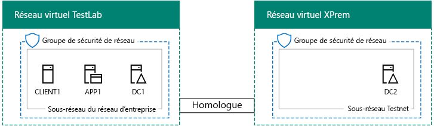
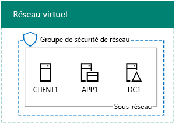
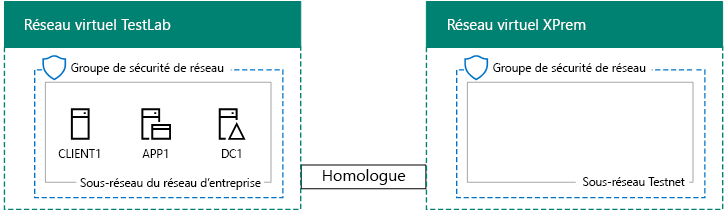

# <a name="simulated-cross-premises-virtual-network-in-azure"></a>Réseau virtuel intersites simulé dans Azure.

 **Résumé :** Créer un réseau virtuel simulé coexistence dans Azure de Microsoft comme environnement de développement/test.
  
Cet article vous guide tout au long de la création d’un environnement de cloud hybride simulé avec Microsoft Azure, à l’aide de deux réseaux virtuels Azure. Voici la configuration obtenue.   
  

  
Cette configuration simule un environnement de production cloud hybride Azure IaaS et comprend les éléments suivants :
  
- 	Un réseau local simulé et simplifié hébergé dans un réseau virtuel Azure (réseau virtuel TestLab).
    
- 	Un réseau virtuel intersites simulé hébergé dans Azure (XPrem).
    
- 	Une relation d’homologation VNet entre les deux réseaux virtuels.
    
- 	Un contrôleur de domaine secondaire dans le réseau virtuel XPrem.
    
Ces éléments offrent une base commune à partir de laquelle vous pouvez :  
  
- 	Développer et tester des applications dans un environnement cloud hybride Azure IaaS simulé.
    
- 	Créer des configurations de test d’ordinateurs, certains au sein du réseau virtuel TestLab et d’autres au sein du réseau virtuel XPrem, afin de simuler les charges de travail informatiques dans un environnement cloud hybride.
    
Les trois phases principales pour configurer cet environnement de développement/test sont les suivantes :
  
1. 	Configurer le réseau virtuel TestLab.
    
2. Créer le réseau virtuel intersites.
    
3. Configurer DC2
    
> [!NOTE]
> Cette configuration nécessite un abonnement payant à Azure. 
  

  
> [!TIP]
> Cliquez [ici](http://aka.ms/catlgstack) pour une carte visuelle de tous les articles dans la pile d’un Guide de laboratoire de Test Microsoft Cloud.
  
## <a name="phase-1-configure-the-testlab-virtual-network"></a>Phase 1 : Configurer le réseau virtuel TestLab

Suivez les instructions dans [l’environnement de développement/test de Configuration de Base](base-configuration-dev-test-environment.md) pour configurer les ordinateurs DC1, APP1 et CLIENT1 dans le réseau virtuel Azure nommé labo de test.
  
Il s’agit de votre configuration actuelle. 
  

  
## <a name="phase-2-create-the-xprem-virtual-network"></a>Phase 2 : Créer le réseau virtuel XPrem

Dans cette phase, vous devez créer et configurer le nouveau réseau virtuel XPrem et le connecter au réseau virtuel TestLab avec l’homologation VNet.
  
Tout d’abord, démarrez une invite PowerShell Azure sur votre ordinateur local.
  
> [!NOTE]
> La commande suivante définit utiliser la dernière version de PowerShell d’Azure. Reportez-vous à la section [mise en route avec les applets de commande PowerShell d’Azure](https://docs.microsoft.com/en-us/powershell/azureps-cmdlets-docs/). 
  
Connectez-vous à votre compte Azure avec la commande suivante.
  
```
Login-AzureRMAccount
```

> [!TIP]
> Cliquez [ici](https://gallery.technet.microsoft.com/PowerShell-commands-for-7844edd0) pour obtenir un fichier texte qui contient toutes les commandes de PowerShell dans cet article.
  
Obtenez le nom de votre abonnement à l’aide de la commande suivante.
  
```
Get-AzureRMSubscription | Sort Name | Select Name
```

Définissez votre abonnement Azure. Remplacez tout entre guillemets, y compris la \< et > caractères, avec le nom correct.
  
```
$subscrName="<subscription name>"
Get-AzureRmSubscription -SubscriptionName $subscrName | Select-AzureRmSubscription
```

Créez ensuite le réseau virtuel XPrem et protégez-le avec un groupe de sécurité réseau, à l’aide des commandes suivantes.
  
```
$rgName="<name of the resource group that you used for your TestLab virtual network>"
$locName=(Get-AzureRmResourceGroup -Name $rgName).Location
$Testnet=New-AzureRMVirtualNetworkSubnetConfig -Name "Testnet" -AddressPrefix 192.168.0.0/24
New-AzureRMVirtualNetwork -Name "XPrem" -ResourceGroupName $rgName -Location $locName -AddressPrefix 192.168.0.0/16 -Subnet $Testnet -DNSServer 10.0.0.4
$rule1=New-AzureRMNetworkSecurityRuleConfig -Name "RDPTraffic" -Description "Allow RDP to all VMs on the subnet" -Access Allow -Protocol Tcp -Direction Inbound -Priority 100 -SourceAddressPrefix Internet -SourcePortRange * -DestinationAddressPrefix * -DestinationPortRange 3389
New-AzureRMNetworkSecurityGroup -Name "Testnet" -ResourceGroupName $rgName -Location $locName -SecurityRules $rule1
$vnet=Get-AzureRMVirtualNetwork -ResourceGroupName $rgName -Name XPrem
$nsg=Get-AzureRMNetworkSecurityGroup -Name "Testnet" -ResourceGroupName $rgName
Set-AzureRMVirtualNetworkSubnetConfig -VirtualNetwork $vnet -Name "Testnet" -AddressPrefix 192.168.0.0/24 -NetworkSecurityGroup $nsg
```

Vous devez ensuite créer la relation d’homologation VNet entre les réseaux virtuels TestLab et XPrem, à l’aide des commandes suivantes.
  
```
$rgName="<name of the resource group that you used for your TestLab virtual network>"
$vnet1=Get-AzureRmVirtualNetwork -ResourceGroupName $rgName -Name TestLab
$vnet2=Get-AzureRmVirtualNetwork -ResourceGroupName $rgName -Name XPrem
Add-AzureRmVirtualNetworkPeering -Name TestLab2XPrem -VirtualNetwork $vnet1 -RemoteVirtualNetworkId $vnet2.Id
Add-AzureRmVirtualNetworkPeering -Name XPrem2TestLab -VirtualNetwork $vnet2 -RemoteVirtualNetworkId $vnet1.Id
```

Il s’agit de votre configuration actuelle. 
  

  
## <a name="phase-3-configure-dc2"></a>Phase 3 : Configurer DC2

Dans cette phase, vous devez créer la machine virtuelle DC2 dans le réseau virtuel XPrem, puis la configurer comme un contrôleur de domaine répliqué.
  
Tout d’abord, créez une machine virtuelle pour DC2. Exécutez ces commandes dans l’invite de commande Azure PowerShell sur votre ordinateur local.
  
```
$rgName="<your resource group name>"
$locName=(Get-AzureRmResourceGroup -Name $rgName).Location
$vnet=Get-AzureRMVirtualNetwork -Name XPrem -ResourceGroupName $rgName
$pip=New-AzureRMPublicIpAddress -Name DC2-PIP -ResourceGroupName $rgName -Location $locName -AllocationMethod Dynamic
$nic=New-AzureRMNetworkInterface -Name DC2-NIC -ResourceGroupName $rgName -Location $locName -SubnetId $vnet.Subnets[0].Id -PublicIpAddressId $pip.Id -PrivateIpAddress 192.168.0.4
$vm=New-AzureRMVMConfig -VMName DC2 -VMSize Standard_A1
$cred=Get-Credential -Message "Type the name and password of the local administrator account for DC2."
$vm=Set-AzureRMVMOperatingSystem -VM $vm -Windows -ComputerName DC2 -Credential $cred -ProvisionVMAgent -EnableAutoUpdate
$vm=Set-AzureRMVMSourceImage -VM $vm -PublisherName MicrosoftWindowsServer -Offer WindowsServer -Skus 2016-Datacenter -Version "latest"
$vm=Add-AzureRMVMNetworkInterface -VM $vm -Id $nic.Id
$vm=Set-AzureRmVMOSDisk -VM $vm -Name "DC2-OS" -DiskSizeInGB 128 -CreateOption FromImage -StorageAccountType "StandardLRS"
$diskConfig=New-AzureRmDiskConfig -AccountType "StandardLRS" -Location $locName -CreateOption Empty -DiskSizeGB 20
$dataDisk1=New-AzureRmDisk -DiskName "DC2-DataDisk1" -Disk $diskConfig -ResourceGroupName $rgName
$vm=Add-AzureRmVMDataDisk -VM $vm -Name "DC2-DataDisk1" -CreateOption Attach -ManagedDiskId $dataDisk1.Id -Lun 1
New-AzureRMVM -ResourceGroupName $rgName -Location $locName -VM $vm
```

Ensuite, vous connecter à la nouvelle machine virtuelle DC2 à partir du [portail Azure](https://portal.azure.com) à l’aide de son nom de compte d’administrateur local et d’un mot de passe.
  
Ensuite, configurez une règle de pare-feu Windows pour autoriser le trafic afin d’effectuer des tests de connectivité de base. Exécutez ces commandes à l’invite de commande Windows PowerShell de niveau administrateur sur DC2.  
  
```
Set-NetFirewallRule -DisplayName "File and Printer Sharing (Echo Request - ICMPv4-In)" -enabled True
ping dc1.corp.contoso.com
```

La commande ping doit aboutir à quatre réponses réussies à partir de l’adresse IP 10.0.0.4. Il s’agit d’un test du trafic sur la relation d’homologation VNet.  
  
Ensuite, ajoutez le disque de données supplémentaires sous la forme d’un nouveau volume avec la lettre de lecteur F: avec cette commande à partir de l’invite de commande Windows PowerShell sur DC2.
  
```
Get-Disk | Where PartitionStyle -eq "RAW" | Initialize-Disk -PartitionStyle MBR -PassThru | New-Partition -AssignDriveLetter -UseMaximumSize | Format-Volume -FileSystem NTFS -NewFileSystemLabel "WSAD Data"
```

Configurez ensuite DC2 en tant que contrôleur de domaine répliqué pour le domaine corp.contoso.com. Exécutez les commandes suivantes à partir de l’invite de commande Windows PowerShell sur DC2.
  
```
Install-WindowsFeature AD-Domain-Services -IncludeManagementTools
Install-ADDSDomainController -Credential (Get-Credential CORP\\User1) -DomainName "corp.contoso.com" -InstallDns:$true -DatabasePath "F:\\NTDS" -LogPath "F:\\Logs" -SysvolPath "F:\\SYSVOL"
```

Notez que vous êtes invité à fournir à la fois le CORP\\utilisateur1 mot de passe et d’un mot de passe en Mode de restauration des Services annuaire (DSRM) et redémarrez DC2. 
  
Maintenant que le réseau virtuel XPrem possède son propre serveur DNS (DC2), vous devez configurer le réseau virtuel XPrem pour utiliser ce serveur DNS. Exécutez ces commandes à partir de l’invite de commande Azure PowerShell sur votre ordinateur local.
  
```
$vnet=Get-AzureRmVirtualNetwork -ResourceGroupName $rgName -name "XPrem"
$vnet.DhcpOptions.DnsServers="192.168.0.4" 
Set-AzureRmVirtualNetwork -VirtualNetwork $vnet
Restart-AzureRmVM -ResourceGroupName $rgName -Name "DC2"
```

À partir du portail Azure sur votre ordinateur local, connectez à DC1 avec le CORP\\informations d’identification d’utilisateur1. Pour configurer le domaine CORP afin que les utilisateurs et les ordinateurs utilisent leur contrôleur de domaine local pour l’authentification, exécuter ces commandes à partir d’une invite de commande de Windows PowerShell de niveau administrateur sur DC1.
  
```
New-ADReplicationSite -Name "TestLab" 
New-ADReplicationSite -Name "XPrem"
New-ADReplicationSubnet -Name "10.0.0.0/8" -Site "TestLab"
New-ADReplicationSubnet -Name "192.168.0.0/16" -Site "XPrem"
```

Il s’agit de votre configuration actuelle. 
  

  
Votre environnement cloud hybride Azure simulé est prêt pour le test.
  
## <a name="next-step"></a>Étape suivante

Utiliser cet environnement de développement/test afin de simuler une [batterie de serveurs intranet SharePoint Server 2016 hébergé dans Azure](https://technet.microsoft.com/library/mt806351%28v=office.16%29.aspx).
  
## <a name="see-also"></a>Voir aussi

[Environnement de développement/test de configuration de base](base-configuration-dev-test-environment.md)
  
[Environnement de développement/test Office 365](office-365-dev-test-environment.md)
  
[DirSync pour votre environnement de développement/test Office 365](dirsync-for-your-office-365-dev-test-environment.md)
  
[Application du nuage sécurité pour votre environnement de développement/test d’Office 365](cloud-app-security-for-your-office-365-dev-test-environment.md)
  
[Avancées de protection contre les menaces pour votre environnement de développement/test d’Office 365](advanced-threat-protection-for-your-office-365-dev-test-environment.md)
  
[Adoption du cloud et solutions hybrides](cloud-adoption-and-hybrid-solutions.md)


