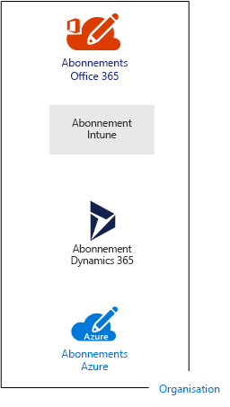
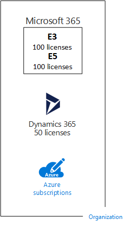
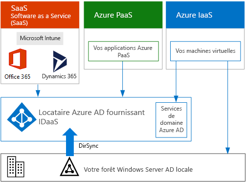

# Abonnements, licences, comptes et clients des offres de cloud de MicrosoftSubscriptions, licenses, accounts, and tenants for Microsoft's cloud offerings

 **Résumé :** Comprenez les relations des organisations, des abonnements, des licences, des comptes d’utilisateur et des clients au sein des offres de cloud de Microsoft.**Summary:** Understand the relationships of organizations, subscriptions, licenses, user accounts, and tenants across Microsoft's cloud offerings.
  
Microsoft fournit une hiérarchie d’organisations, d’abonnements, de licences et de comptes d’utilisateur pour une utilisation cohérente des identités et de la facturation au sein de ses offres de cloud :Microsoft provides a hierarchy of organizations, subscriptions, licenses, and user accounts for consistent use of identities and billing across its cloud offerings:
  
- Microsoft Office 365Microsoft Office 365
- Microsoft AzureMicrosoft Azure
- Microsoft Intune et Enterprise Mobility + Security (EMS)Microsoft Intune and Enterprise Mobility + Security (EMS)
- Microsoft Dynamics 365Microsoft Dynamics 365

[Microsoft 365](https://docs.microsoft.com/microsoft-365/) combine Office 365, EMS, et Windows 10 Entreprise en un seul abonnement et ensemble de services intégrés.[Microsoft 365](https://docs.microsoft.com/microsoft-365/) combines Office 365, EMS, and Windows 10 Enterprise into a single subscription and set of integrated services.

## Éléments de la hiérarchieElements of the hierarchy

Voici les éléments de la hiérarchie :Here are the elements of the hierarchy:
  
### OrganisationOrganization

An organization represents a business entity that is using Microsoft cloud offerings, typically identified by one or more public Domain Name System (DNS) domain names, such as contoso.com.An organization represents a business entity that is using Microsoft cloud offerings, typically identified by one or more public Domain Name System (DNS) domain names, such as contoso.com. The organization is a container for subscriptions.The organization is a container for subscriptions.
  
### AbonnementsSubscriptions

Un abonnement est un accord conclu avec Microsoft sur l’utilisation d’une ou de plusieurs plateformes ou services de cloud Microsoft, dont les frais applicables sont calculés sur la base de frais de licence par utilisateur ou selon la consommation des ressources de cloud.A subscription is an agreement with Microsoft to use one or more Microsoft cloud platforms or services, for which charges accrue based on either a per-user license fee or on cloud-based resource consumption. 

- Les offres de cloud Microsoft Software as a Service (SaaS) (Office 365, Intune/EMS et Dynamics 365) facturent des frais de licence par utilisateur.Microsoft's Software as a Service (SaaS)-based cloud offerings (Office 365, Intune/EMS, and Dynamics 365) charge per-user license fees. 
- Les offres de cloud Microsoft Platform as a Service (PaaS) et Infrastructure as a Service (IaaS) (Azure) facturent des frais en fonction de la consommation des ressources de cloud.Microsoft's Platform as a Service (PaaS) and Infrastructure as a Service (IaaS) cloud offerings (Azure) charge based on cloud resource consumption.
 
You can also use a trial subscription, but the subscription expires after a specific amount of time or consumption charges.You can also use a trial subscription, but the subscription expires after a specific amount of time or consumption charges. You can convert a trial subscription to a paid subscription.You can convert a trial subscription to a paid subscription.
  
Les organisations peuvent avoir plusieurs abonnements pour les offres de cloud Microsoft, comme illustré dans la Figure 1.Organizations can have multiple subscriptions for Microsoft's cloud offerings. La Figure 1 présente une organisation unique avec plusieurs abonnements Office 365, un abonnement Intune, un abonnement Dynamics 365 et plusieurs abonnements Azure.Figure 1 shows a single organization that has multiple Office 365 subscriptions, an Intune subscription, a Dynamics 365 subscription, and multiple Azure subscriptions.

**Figure 1 : Exemple de plusieurs abonnements pour une organisation****Figure 1: Example of multiple subscriptions for an organization**

  
### LicencesLicenses

Pour les offres de cloud SaaS de Microsoft, une licence permet à un compte d’utilisateur spécifique d’utiliser les services de l’offre de cloud.For Microsoft's SaaS cloud offerings, a license allows a specific user account to use the services of the cloud offering. Vous payez un coût mensuel fixe dans le cadre de votre abonnement.You are charged a fixed monthly fee as part of your subscription. Les administrateurs attribuent des licences à des comptes d’utilisateur individuels dans l’abonnement.Administrators assign licenses to individual user accounts in the subscription. Par exemple, dans la Figure 2, la société Contoso a un abonnement à Office 365 Entreprise E5 avec 100 licences, ce qui permet à un maximum de 100 comptes d’utilisateur individuels d’utiliser les services et fonctionnalités d’Entreprise E5 Office 365.For the example in Figure 2, the Contoso Corporation has an Office 365 Enterprise E5 subscription with 100 licenses, which allows to up to 100 individual user accounts to use Office 365 Enterprise E5 features and services.
  
**Figure 2 : Licences liées aux abonnements SaaS d’une organisation****Figure 2: Licenses within the SaaS-based subscriptions for an organization**

  
Pour les services de cloud PaaS Azure, les licences logicielles sont intégrées dans la tarification du service.  For Azure PaaS-based cloud services, software licenses are built into the service pricing.
  
For Azure IaaS-based virtual machines, additional licenses to use the software or application installed on a virtual machine image might be required.For Azure IaaS-based virtual machines, additional licenses to use the software or application installed on a virtual machine image might be required. Some virtual machine images have licensed versions of software installed and the cost is included in the per-minute rate for the server.Some virtual machine images have licensed versions of software installed and the cost is included in the per-minute rate for the server. Examples are the virtual machine images for SQL Server 2014 and SQL Server 2016.Examples are the virtual machine images for SQL Server 2014 and SQL Server 2016. 
  
Some virtual machine images have trial versions of applications installed and need additional software application licenses for use beyond the trial period.Some virtual machine images have trial versions of applications installed and need additional software application licenses for use beyond the trial period. For example, the SharePoint Server 2016 Trial virtual machine image includes a trial version of SharePoint Server 2016 pre-installed.For example, the SharePoint Server 2016 Trial virtual machine image includes a trial version of SharePoint Server 2016 pre-installed. To continue using SharePoint Server 2016 after the trial expiration date, you must purchase a SharePoint Server 2016 license and client licenses from Microsoft.To continue using SharePoint Server 2016 after the trial expiration date, you must purchase a SharePoint Server 2016 license and client licenses from Microsoft. These charges are separate from the Azure subscription and the per-minute rate to run the virtual machine still applies.These charges are separate from the Azure subscription and the per-minute rate to run the virtual machine still applies.
  
### Comptes d’utilisateurUser accounts

Les comptes d’utilisateur pour toutes les offres de cloud de Microsoft sont stockés dans un client Azure Active Directory (Azure AD) qui contient des comptes et groupes d’utilisateurs.User accounts for all of Microsoft's cloud offerings are stored in an Azure Active Directory (Azure AD) tenant, which contains user accounts and groups. Un client Azure AD peut être synchronisé avec vos comptes Active Directory Domain Services (AD DS) existants à l’aide d’Azure AD Connect, un service de serveur Windows.An Azure AD tenant can be synchronized with your existing Active Directory Domain Services (AD DS) accounts using Azure AD Connect, a Windows server-based service. C’est ce que l’on appelle la synchronisation d’annuaires.This is known as directory synchronization.
  
La Figure 3 illustre un exemple de plusieurs abonnements d’une organisation à l’aide d’un client Azure Active Directory commun qui contient les comptes de l’organisation.Figure 3 shows an example of multiple subscriptions of an organization using a common Azure AD tenant that contains the organization's accounts.
  
**Figure 3 : Plusieurs abonnements d’une organisation qui utilisent le même client Azure AD****Figure 3: Multiple subscriptions of an organization that use the same Azure AD tenant**

  
### ClientsTenants

For SaaS cloud offerings, the tenant is the regional location that houses the servers providing cloud services.For SaaS cloud offerings, the tenant is the regional location that houses the servers providing cloud services. For example, the Contoso Corporation chose the European region to host its Office 365, EMS, and Dynamics 365 tenants for the 15,000 workers in their Paris headquarters.For example, the Contoso Corporation chose the European region to host its Office 365, EMS, and Dynamics 365 tenants for the 15,000 workers in their Paris headquarters.
  
Azure PaaS services and virtual machine-based workloads hosted in Azure IaaS can have tenancy in any Azure datacenter across the world.Azure PaaS services and virtual machine-based workloads hosted in Azure IaaS can have tenancy in any Azure datacenter across the world. You specify the Azure datacenter, known as the location, when you create the Azure PaaS app or service or element of an IaaS workload.You specify the Azure datacenter, known as the location, when you create the Azure PaaS app or service or element of an IaaS workload.
  
An Azure AD tenant is a specific instance of Azure AD containing accounts and groups.An Azure AD tenant is a specific instance of Azure AD containing accounts and groups. Paid or trial subscriptions of Office 365, Dynamics 365, or Intune/EMS include a free Azure AD tenant.Paid or trial subscriptions of Office 365, Dynamics 365, or Intune/EMS include a free Azure AD tenant. This Azure AD tenant does not include other Azure services and is not the same as an Azure trial or paid subscription.This Azure AD tenant does not include other Azure services and is not the same as an Azure trial or paid subscription.
  
### Résumé de la hiérarchieSummary of the hierarchy

Voici un récapitulatif rapide :Here is a quick recap:
  
- Une organisation peut avoir plusieurs abonnementsAn organization can have multiple subscriptions
    
  - Un abonnement peut avoir plusieurs licencesA subscription can have multiple licenses
    
  - Des licences peuvent être affectées à des comptes d’utilisateur individuelsLicenses can be assigned to individual user accounts
    
  - Les comptes d’utilisateur sont stockés dans un client Azure ADUser accounts are stored in an Azure AD tenant
    
Voici un exemple de relation des organisations, des abonnements, des licences et des comptes d’utilisateur :Here is an example of the relationship of organizations, subscriptions, licenses, and user accounts:
  
- Une organisation identifiée par son nom de domaine public.An organization identified by its public domain name.
    
  - Un abonnement Office 365 Entreprise E3 avec licences utilisateur.An Office 365 Enterprise E3 subscription with user licenses.
    
    Un abonnement Office 365 Entreprise E5 avec licences utilisateur.An Office 365 Enterprise E5 subscription with user licenses.
    
    Un abonnement EMS avec licences utilisateur.An EMS subscription with user licenses.
    
    Un abonnement Dynamics 365 avec licences utilisateur.A Dynamics 365 subscription with user licenses.
    
    Abonnements Azure multiplesMultiple Azure subscriptions.
    
  - Les comptes d’utilisateurs de l’organisation dans un client Azure AD commun.The organization's user accounts in a common Azure AD tenant.
    
Plusieurs abonnements à des offres de cloud Microsoft peuvent utiliser le même client Azure AD, qui agit comme un fournisseur d’identité commun.Multiple Microsoft cloud offering subscriptions can use the same Azure AD tenant that acts as a common identity provider. Un client Azure AD central qui contient les comptes synchronisés de votre AD DS local fournit une identité IDaaS dans le cloud pour votre organisation.A central Azure AD tenant that contains the synchronized accounts of your on-premises AD DS provides cloud-based Identity as a Service (IDaaS) for your organization. 
  
**Figure 4 : Comptes en local synchronisés et IDaaS pour une organisation****Figure 4: Synchronized on-premises accounts and IDaaS for an organization**

  
La Figure 4 montre l’utilisation d’un client Azure AD commun par les offres cloud SaaS de Microsoft, les applications PaaS Azure et les machines virtuelles dans IaaS Azure qui utilisent Azure Active Directory Domain Services.Figure 4 shows how a common Azure AD tenant is used by Microsoft's SaaS cloud offerings, Azure PaaS apps, and virtual machines in Azure IaaS that use Azure AD Domain Services. Azure AD Connect synchronise la forêt AD DS locale avec le client Azure AD.Azure AD Connect synchronizes the on-premises AD DS forest with the Azure AD tenant.
  
## Combiner les abonnements de plusieurs offres de cloud MicrosoftCombining subscriptions for multiple Microsoft cloud offerings

Le tableau suivant décrit la manière dont vous pouvez combiner plusieurs offres de cloud Microsoft en disposant déjà d’un abonnement pour un type d’offre de cloud (étiquettes actives vers le bas de la première colonne) et en ajoutant un abonnement pour une offre de cloud différente (à travers les colonnes).The following table describes how you can combine multiple Microsoft cloud offerings based on already having a subscription for one type of cloud offering (the labels going down the first column) and adding a subscription for a different cloud offering (going across the columns).
  
||**Office 365****Office 365**|**Azure****Azure**|**Intune/EMS****Intune/EMS**|**Dynamics 365****Dynamics 365**|
|:-----|:-----|:-----|:-----|:-----|
|**Office 365****Office 365**   |N/ANA    |Vous ajoutez un abonnement Azure à votre organisation à partir du portail Azure.You add an Azure subscription to your organization from the Azure portal.    |Vous ajoutez un abonnement Intune/EMS à votre organisation à partir du Centre d’administration Microsoft 365.You add an Intune/EMS subscription to your organization from the Microsoft 365 admin center.    |Vous ajoutez un abonnement Dynamics 365 à votre organisation à partir du Centre d’administration Microsoft 365.You add a Dynamics 365 subscription to your organization from the Microsoft 365 admin center.    |
|**Azure****Azure**   |Vous ajoutez un abonnement Office 365 à votre organisation.You add an Office 365 subscription to your organization.    |N/ANA    |Vous ajoutez un abonnement Intune/EMS à votre organisation.You add an Intune/EMS subscription to your organization.    |Vous ajoutez un abonnement Dynamics 365 à votre organisation.You add a Dynamics 365 subscription to your organization.    |
|**Intune/EMS****Intune/EMS**   |Vous ajoutez un abonnement Office 365 à votre organisation.You add an Office 365 subscription to your organization.    |Vous ajoutez un abonnement Azure à votre organisation à partir du portail Azure.You add an Azure subscription to your organization from the Azure portal.    |N/ANA    |Vous ajoutez un abonnement Dynamics 365 à votre organisation.You add a Dynamics 365 subscription to your organization.    |
|**Dynamics 365****Dynamics 365**   |Vous ajoutez un abonnement Office 365 à votre organisation.You add an Office 365 subscription to your organization.    |Vous ajoutez un abonnement Azure à votre organisation à partir du portail Azure.You add an Azure subscription to your organization from the Azure portal.    |Vous ajoutez un abonnement Intune/EMS à votre organisation.You add an Intune/EMS subscription to your organization.    |N/ANA    |
   
Une solution simple pour ajouter des abonnements à votre organisation pour les services SaaS Microsoft consiste à utiliser le centre d’administration :An easy way to add subscriptions to your organization for Microsoft SaaS-based services is through the admin center:
  
1. Connectez-vous au Centre d’administration Microsoft 365 ([https://admin.microsoft.com](https://admin.microsoft.com)) avec votre compte d’administrateur général.Sign in to the Microsoft 365 admin center ([https://admin.microsoft.com](https://admin.microsoft.com)) with your global administrator account.
    
2. À partir du volet de navigation gauche de la page d’accueil du **centre d’administration**, cliquez sur **Facturation**, puis **Acheter des services**.From the left navigation of the **Admin center** home page, click **Billing**, and then **Purchase services**.
    
3. Dans la page **Acheter des services**, achetez vos nouveaux abonnements.On the **Purchase services** page, purchase your new subscriptions.
    
Le centre d’administration affecte l’organisation et le client Azure AD de votre abonnement à Office 365 aux nouveaux abonnements pour les offres cloud SaaS.The admin center assigns the organization and Azure AD tenant of your Office 365 subscription to the new subscriptions for SaaS-based cloud offerings.
  
Pour ajouter un abonnement Azure disposant de la même organisation et du même client Azure Active Directory que votre abonnement Office 365, procédez comme suit :To add an Azure subscription with the same organization and Azure AD tenant as your Office 365 subscription:
  
1. Connectez-vous au portail Azure ([https://portal.azure.com](https://portal.azure.com)) avec votre compte Administrateur général Office 365.Sign in to the Azure portal ([https://portal.azure.com](https://portal.azure.com)) with your Office 365 global administrator account.
    
2. Dans le volet de navigation gauche, cliquez sur **Abonnements**, puis sur **Ajouter**.In the left navigation, click **Subscriptions**, and then click **Add**.
    
3. Dans la page **Ajouter un abonnement**, sélectionnez une offre et complétez l’accord et les informations de paiement.On the **Add subscription** page, select an offer and complete the payment information and agreement.
    
Si vous avez obtenu séparément des abonnements Azure et Office 365, et que vous souhaitez accéder au client Office 365 Azure AD à partir de votre abonnement Azure, reportez-vous aux instructions décrites de l’article [Ajouter un abonnement Azure à votre locataire Azure Active Directory](https://docs.microsoft.com/azure/active-directory/fundamentals/active-directory-how-subscriptions-associated-directory).If you purchased Azure and Office 365 subscriptions separately and want to access the Office 365 Azure AD tenant from your Azure subscription, see the instructions in [Add an existing Azure subscription to your Azure Active Directory tenant](https://docs.microsoft.com/azure/active-directory/fundamentals/active-directory-how-subscriptions-associated-directory).
 
## Voir aussiSee also

[Ressources relatives à l’architecture informatique Microsoft CloudMicrosoft Cloud IT architecture resources](microsoft-cloud-it-architecture-resources.md)
  
[Modèles architecturaux pour SharePoint, Exchange, Skype Entreprise et LyncArchitectural models for SharePoint, Exchange, Skype for Business, and Lync](architectural-models-for-sharepoint-exchange-skype-for-business-and-lync.md)
  
[Solutions hybridesHybrid solutions](hybrid-solutions.md)

## Étape suivanteNext step

[Évaluation de la connectivité réseau Office 365Assessing Office 365 network connectivity](assessing-network-connectivity.md)
  
