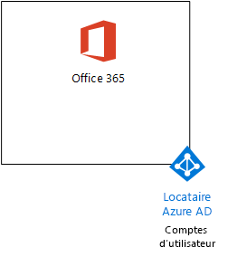
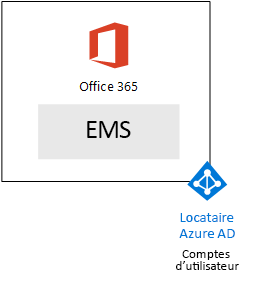
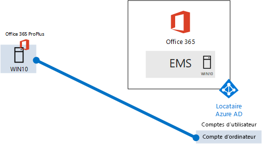

# <a name="the-microsoft-365-enterprise-devtest-environment"></a><span data-ttu-id="9359b-103">Environnement de développement/test Microsoft 365 Entreprise</span><span class="sxs-lookup"><span data-stu-id="9359b-103">The Microsoft 365 Enterprise dev/test environment</span></span>

 <span data-ttu-id="9359b-104">**Résumé :** Utilisez ce Guide de laboratoire de Test pour créer un environnement de développement/test incluant Office 365 E5, mobilité d’entreprise + E5 de sécurité (EMS) et un ordinateur exécutant Windows 10 Enterprise.</span><span class="sxs-lookup"><span data-stu-id="9359b-104">**Summary:** Use this Test Lab Guide to create a dev/test environment that includes Office 365 E5, Enterprise Mobility + Security (EMS) E5, and a computer running Windows 10 Enterprise.</span></span>
  
<span data-ttu-id="9359b-105">Cet article vous fournit des instructions pas à pas pour créer un environnement simplifié pour tester les fonctionnalités [d’Entreprise de Microsoft 365](https://www.microsoft.com/microsoft-365/enterprise).</span><span class="sxs-lookup"><span data-stu-id="9359b-105">This article provides you with step-by-step instructions to create a simplified environment to test the features and functionality of [Microsoft 365 Enterprise](https://www.microsoft.com/microsoft-365/enterprise).</span></span>
  
## <a name="phase-1-create-your-office-365-e5-subscription"></a><span data-ttu-id="9359b-106">Phase 1 : Création de votre abonnement Office 365 E5</span><span class="sxs-lookup"><span data-stu-id="9359b-106">Phase 1: Create your Office 365 E5 subscription</span></span>

<span data-ttu-id="9359b-107">Suivez les étapes de la Phase 2 et 3 de Phase de [l’environnement de développement/test Office 365](office-365-dev-test-environment.md) pour créer un environnement de développement/test lightweight Office 365, comme illustré dans la Figure 1.</span><span class="sxs-lookup"><span data-stu-id="9359b-107">Follow the steps in Phase 2 and Phase 3 of [Office 365 dev/test environment](office-365-dev-test-environment.md) to create a lightweight Office 365 dev/test environment, as shown in Figure 1.</span></span>
  
<span data-ttu-id="9359b-108">**Figure 1 : Votre abonnement Office 365 E5 avec ses comptes d’utilisateurs et les clients de Azure Active Directory (AD)**</span><span class="sxs-lookup"><span data-stu-id="9359b-108">**Figure 1: Your Office 365 E5 subscription with its Azure Active Directory (AD) tenant and user accounts**</span></span>


  
## <a name="phase-2-add-ems"></a><span data-ttu-id="9359b-110">Phase 2 : Ajout d’EMS</span><span class="sxs-lookup"><span data-stu-id="9359b-110">Phase 2: Add EMS</span></span>

<span data-ttu-id="9359b-111">Dans cette phase, vous vous inscrivez pour l’abonnement à la version d’évaluation d’EMS E5 et l’ajoutez à la même organisation que votre abonnement à la version d’évaluation d’Office 365 E5.</span><span class="sxs-lookup"><span data-stu-id="9359b-111">In this phase, you sign up for the EMS E5 trial subscription and add it to the same organization as your Office 365 E5 trial subscription.</span></span>
  
<span data-ttu-id="9359b-112">Tout d’abord, ajouter l’abonnement d’évaluation EMS E5 et affecter une licence EMS à votre compte d’administrateur global.</span><span class="sxs-lookup"><span data-stu-id="9359b-112">First, add the EMS E5 trial subscription and assign an EMS license to your global administrator account.</span></span>
  
1. <span data-ttu-id="9359b-p101">Avec une instance privée d’un navigateur Internet, connectez-vous au portail Office 365 avec vos informations d’identification du compte administrateur global. Pour de l’aide, consultez la rubrique [pour vous connecter à Office 365](https://support.office.com/Article/Where-to-sign-in-to-Office-365-e9eb7d51-5430-4929-91ab-6157c5a050b4).</span><span class="sxs-lookup"><span data-stu-id="9359b-p101">With a private instance of an Internet browser, sign in to the Office 365 portal with your global administrator account credentials. For help, see [Where to sign in to Office 365](https://support.office.com/Article/Where-to-sign-in-to-Office-365-e9eb7d51-5430-4929-91ab-6157c5a050b4).</span></span>
    
2. <span data-ttu-id="9359b-115">Cliquez sur la mosaïque de **l’Admin** .</span><span class="sxs-lookup"><span data-stu-id="9359b-115">Click the **Admin** tile.</span></span>
    
3. <span data-ttu-id="9359b-116">Dans l’onglet **Centre d’administration d’Office** dans votre navigateur, dans la navigation de gauche, cliquez sur **de facturation > acheter les services**.</span><span class="sxs-lookup"><span data-stu-id="9359b-116">On the **Office Admin center** tab in your browser, in the left navigation, click **Billing > Purchase services**.</span></span>
    
4. <span data-ttu-id="9359b-p102">Dans la page **services d’achat** , trouver la **mobilité d’entreprise + E5 de la sécurité** . Placez le pointeur de la souris sur elle et cliquez sur **Démarrer la version d’évaluation gratuite**.</span><span class="sxs-lookup"><span data-stu-id="9359b-p102">On the **Purchase services** page, find the **Enterprise Mobility + Security E5** item. Hover your mouse pointer over it and click **Start free trial**.</span></span>
    
5. <span data-ttu-id="9359b-119">Dans la page **Confirmer votre commande** , cliquez sur **Essayer maintenant**.</span><span class="sxs-lookup"><span data-stu-id="9359b-119">On the **Confirm your order** page, click **Try now**.</span></span>
    
6. <span data-ttu-id="9359b-120">Dans la page **reçu de commande** , cliquez sur **Continuer**.</span><span class="sxs-lookup"><span data-stu-id="9359b-120">On the **Order receipt** page, click **Continue**.</span></span>
    
7. <span data-ttu-id="9359b-121">Dans l’onglet **Centre d’administration d’Office 365** dans votre navigateur, dans la navigation de gauche, cliquez sur **les utilisateurs > utilisateurs actifs**.</span><span class="sxs-lookup"><span data-stu-id="9359b-121">On the **Office 365 Admin center** tab in your browser, in the left navigation, click **Users > Active users**.</span></span>
    
8. <span data-ttu-id="9359b-122">Cliquez sur votre compte d’administrateur global, puis cliquez sur **Modifier** pour les **licences de produit**.</span><span class="sxs-lookup"><span data-stu-id="9359b-122">Click your global administrator account, and then click **Edit** for **Product licenses**.</span></span>
    
9. <span data-ttu-id="9359b-123">Dans le volet des **licences** , activer la licence du produit de **mobilité d’entreprise + sécurité E5** **on**et cliquez sur **Enregistrer,** puis cliquez deux fois sur **Fermer** .</span><span class="sxs-lookup"><span data-stu-id="9359b-123">On the **Product licenses** pane, turn the product license for **Enterprise Mobility + Security E5** to **On**, click **Save,** and then click **Close** twice.</span></span>
    
> [!NOTE]
> <span data-ttu-id="9359b-p103">L’abonnement à la version d’évaluation d’Enterprise Mobility + Security E5 est de 90 jours. Pour un environnement de développement/test permanent, créez un nouvel abonnement payant avec un nombre réduit de licences.</span><span class="sxs-lookup"><span data-stu-id="9359b-p103">The Enterprise Mobility + Security E5 trial subscription is 90 days. For a permanent dev/test environment, create a new paid subscription with a small number of licenses.</span></span> 
  
 <span data-ttu-id="9359b-126">***Si vous avez terminé la Phase 3 de*** [Environnement de développement/test d’office 365](office-365-dev-test-environment.md) , répétez les étapes 8 et 9 de la procédure précédente pour l’ensemble de vos autres comptes (utilisateur 2, utilisateur 3, utilisateur 4 et 5 de l’utilisateur).</span><span class="sxs-lookup"><span data-stu-id="9359b-126">***If you completed Phase 3 of*** [Office 365 dev/test environment](office-365-dev-test-environment.md) , repeat steps 8 and 9 of the previous procedure for all of your other accounts (User 2, User 3, User 4, and User 5).</span></span>
  
<span data-ttu-id="9359b-127">Votre environnement de développement/test comporte maintenant :</span><span class="sxs-lookup"><span data-stu-id="9359b-127">Your dev/test environment now has:</span></span>
  
- <span data-ttu-id="9359b-128">Des abonnements d’évaluation Office 365 E5 Entreprise et EMS qui partagent la même organisation et le même client Azure AD avec votre liste des comptes d’utilisateur.</span><span class="sxs-lookup"><span data-stu-id="9359b-128">Office 365 E5 Enterprise and EMS trial subscriptions sharing the same organization and the same Azure AD tenant with your list of user accounts.</span></span>
    
- <span data-ttu-id="9359b-129">Tous vos comptes d’utilisateur appropriés (uniquement l’administrateur global ou tous les cinq comptes d’utilisateur) sont activés pour utiliser Office 365 E5 et EMS E5.</span><span class="sxs-lookup"><span data-stu-id="9359b-129">All your appropriate user accounts (either just the global administrator or all five user accounts) are enabled to use Office 365 E5 and EMS E5.</span></span>
    
<span data-ttu-id="9359b-130">La figure 2 montre la configuration obtenue, qui ajoute EMS.</span><span class="sxs-lookup"><span data-stu-id="9359b-130">Figure 2 shows your resulting configuration, which adds EMS.</span></span>
  
<span data-ttu-id="9359b-131">**Figure 2 : Ajout de l’abonnement d’évaluation EMS**</span><span class="sxs-lookup"><span data-stu-id="9359b-131">**Figure 2: Adding the EMS trial subscription**</span></span>


  
## <a name="phase-3-create-a-windows-10-enterprise-computer"></a><span data-ttu-id="9359b-133">Phase 3 : Création d’un ordinateur Windows 10 Entreprise</span><span class="sxs-lookup"><span data-stu-id="9359b-133">Phase 3: Create a Windows 10 Enterprise computer</span></span>

<span data-ttu-id="9359b-134">Au cours de cette phase, vous allez créer un ordinateur autonome exécutant Windows 10 Entreprise.</span><span class="sxs-lookup"><span data-stu-id="9359b-134">In this phase, you create a standalone computer running Windows 10 Enterprise.</span></span>
  
### <a name="physical-computer"></a><span data-ttu-id="9359b-135">Ordinateur physique</span><span class="sxs-lookup"><span data-stu-id="9359b-135">Physical computer</span></span>

<span data-ttu-id="9359b-p104">Obtenir un ordinateur personnel et installer Windows 10 Enterprise. Vous pouvez télécharger le Windows 10 Enterprise d’évaluation [ici](https://www.microsoft.com/evalcenter/evaluate-windows-10-enterprise).</span><span class="sxs-lookup"><span data-stu-id="9359b-p104">Obtain a personal computer and install Windows 10 Enterprise on it. You can download the Windows 10 Enterprise trial [here](https://www.microsoft.com/evalcenter/evaluate-windows-10-enterprise).</span></span>
  
### <a name="virtual-machine"></a><span data-ttu-id="9359b-138">Machine virtuelle</span><span class="sxs-lookup"><span data-stu-id="9359b-138">Virtual machine</span></span>

<span data-ttu-id="9359b-p105">Créer un ordinateur virtuel à l’aide de l’hyperviseur de votre choix et installer Windows 10 Enterprise. Vous pouvez télécharger le Windows 10 Enterprise d’évaluation [ici](https://www.microsoft.com/evalcenter/evaluate-windows-10-enterprise).</span><span class="sxs-lookup"><span data-stu-id="9359b-p105">Create a virtual machine using the hypervisor of your choice and install Windows 10 Enterprise on it. You can download the Windows 10 Enterprise trial [here](https://www.microsoft.com/evalcenter/evaluate-windows-10-enterprise).</span></span>
  
### <a name="virtual-machine-in-azure"></a><span data-ttu-id="9359b-141">Machine virtuelle dans Azure</span><span class="sxs-lookup"><span data-stu-id="9359b-141">Virtual machine in Azure</span></span>

<span data-ttu-id="9359b-p106">Pour créer un ordinateur virtuel de Windows 10 de Microsoft Azure, ***vous devez posséder un abonnement basé sur Visual Studio***, qui a accès à l’image 10 de Windows. Autres types d’abonnements Azure, tels que des abonnements d’essai et payés, n’ont pas d’accès à cette image.</span><span class="sxs-lookup"><span data-stu-id="9359b-p106">To create a Windows 10 virtual machine in Microsoft Azure, ***you must have a Visual Studio-based subscription***, which has access to the image for Windows 10 Enterprise. Other types of Azure subscriptions, such as trial and paid subscriptions, do not have access to this image.</span></span>
  
> [!NOTE]
> <span data-ttu-id="9359b-p107">La commande suivante définit utiliser la version la plus récente de PowerShell d’Azure te. Reportez-vous à la section [mise en route avec les applets de commande PowerShell d’Azure](https://docs.microsoft.com/powershell/azureps-cmdlets-docs/). Ces jeux de génération commande un ordinateur virtuel de Windows 10 Enterprise nommé WIN10 et l’ensemble de l’infrastructure requise, y compris un réseau virtuel, un compte de stockage et un groupe de ressources. Si vous êtes déjà familiarisé avec les services d’infrastructure Azure, veuillez s’adapter ces instructions en fonction de votre infrastructure actuellement déployé.</span><span class="sxs-lookup"><span data-stu-id="9359b-p107">The following command sets use te latest version of Azure PowerShell. See [Get started with Azure PowerShell cmdlets](https://docs.microsoft.com/powershell/azureps-cmdlets-docs/). These command sets build a Windows 10 Enterprise virtual machine named WIN10 and all of its required infrastructure, including a resource group, a storage account, and a virtual network. If you are already familiar with Azure infrastructure services, please adapt these instructions to suit your currently deployed infrastructure.</span></span> 
  
<span data-ttu-id="9359b-148">Tout d’abord, lancez une invite Microsoft PowerShell.</span><span class="sxs-lookup"><span data-stu-id="9359b-148">First, start a Microsoft PowerShell prompt.</span></span>
  
<span data-ttu-id="9359b-149">Connectez-vous à votre compte Azure avec la commande suivante.</span><span class="sxs-lookup"><span data-stu-id="9359b-149">Sign in to your Azure account with the following command.</span></span>
  
```
Login-AzureRMAccount
```

<span data-ttu-id="9359b-150">Obtenez le nom de votre abonnement à l’aide de la commande suivante.</span><span class="sxs-lookup"><span data-stu-id="9359b-150">Get your subscription name using the following command.</span></span>
  
```
Get-AzureRMSubscription | Sort Name | Select Name
```

<span data-ttu-id="9359b-p108">Définissez votre abonnement Azure. Remplacez tout entre guillemets, y compris la \< et > caractères, avec le nom correct.</span><span class="sxs-lookup"><span data-stu-id="9359b-p108">Set your Azure subscription. Replace everything within the quotes, including the \< and > characters, with the correct name.</span></span>
  
```
$subscr="<subscription name>"
Get-AzureRmSubscription -SubscriptionName $subscr | Select-AzureRmSubscription
```

<span data-ttu-id="9359b-p109">Ensuite, créez un nouveau groupe de ressources. Pour déterminer un nom de groupe de ressources unique, utilisez cette commande pour répertorier vos groupes de ressources existants.</span><span class="sxs-lookup"><span data-stu-id="9359b-p109">Next, create a new resource group. To determine a unique resource group name, use this command to list your existing resource groups.</span></span>
  
```
Get-AzureRMResourceGroup | Sort ResourceGroupName | Select ResourceGroupName
```

<span data-ttu-id="9359b-p110">Créez votre nouveau groupe de ressources avec ces commandes. Remplacez tout entre guillemets, y compris la \< et > caractères, avec le nom correct.</span><span class="sxs-lookup"><span data-stu-id="9359b-p110">Create your new resource group with these commands. Replace everything within the quotes, including the \< and > characters, with the correct names.</span></span>
  
```
$rgName="<resource group name>"
$locName="<location name, such as West US>"
New-AzureRMResourceGroup -Name $rgName -Location $locName
```

<span data-ttu-id="9359b-p111">Machines virtuelles basées sur le Gestionnaire de ressources nécessite un compte de stockage basé sur le Gestionnaire de ressources. Vous devez choisir un nom unique pour votre compte de stockage *qui contient uniquement des minuscules et chiffres* . Vous pouvez utiliser cette commande pour répertorier les comptes de stockage existants.</span><span class="sxs-lookup"><span data-stu-id="9359b-p111">Resource Manager-based virtual machines require a Resource Manager-based storage account. You must pick a globally unique name for your storage account  *that contains only lowercase letters and numbers*  . You can use this command to list the existing storage accounts.</span></span>
  
```
Get-AzureRMStorageAccount | Sort StorageAccountName | Select StorageAccountName
```

<span data-ttu-id="9359b-160">Utilisez cette commande pour vérifier si un nom proposé pour un compte de stockage est unique.</span><span class="sxs-lookup"><span data-stu-id="9359b-160">Use this command to test whether a proposed storage account name is unique.</span></span>
  
```
Get-AzureRmStorageAccountNameAvailability "<proposed name>"
```

<span data-ttu-id="9359b-161">Créez un compte de stockage pour votre nouvel environnement de test avec ces commandes.</span><span class="sxs-lookup"><span data-stu-id="9359b-161">Create a new storage account for your new test environment with these commands.</span></span>
  
```
$rgName="<your new resource group name>"
$saName="<storage account name>"
$locName=(Get-AzureRmResourceGroup -Name $rgName).Location
New-AzureRMStorageAccount -Name $saName -ResourceGroupName $rgName -Type Standard_LRS -Location $locName
```

<span data-ttu-id="9359b-p112">Ensuite, créez une ressource virtuelle et la machine virtuelle WIN10 avec ces commandes. Lorsque vous y êtes invité, indiquez le nom et le mot de passe du compte d’administrateur local pour WIN10, et enregistrez ces informations dans un emplacement sécurisé.</span><span class="sxs-lookup"><span data-stu-id="9359b-p112">Next, you create a new virtual network and the WIN10 virtual machine with these commands. When prompted, provide the name and password of the local administrator account for WIN10 and store these in a secure location.</span></span>
  
```
$corpnetSubnet=New-AzureRMVirtualNetworkSubnetConfig -Name Corpnet -AddressPrefix 10.0.0.0/24
New-AzureRMVirtualNetwork -Name "M365Ent-TestLab" -ResourceGroupName $rgName -Location $locName -AddressPrefix 10.0.0.0/8 -Subnet $corpnetSubnet
$rule1=New-AzureRMNetworkSecurityRuleConfig -Name "RDPTraffic" -Description "Allow RDP to all VMs on the subnet" -Access Allow -Protocol Tcp -Direction Inbound -Priority 100 -SourceAddressPrefix Internet -SourcePortRange * -DestinationAddressPrefix * -DestinationPortRange 3389
New-AzureRMNetworkSecurityGroup -Name Corpnet -ResourceGroupName $rgName -Location $locName -SecurityRules $rule1
$vnet=Get-AzureRMVirtualNetwork -ResourceGroupName $rgName -Name "M365Ent-TestLab"
$nsg=Get-AzureRMNetworkSecurityGroup -Name Corpnet -ResourceGroupName $rgName
Set-AzureRMVirtualNetworkSubnetConfig -VirtualNetwork $vnet -Name Corpnet -AddressPrefix "10.0.0.0/24" -NetworkSecurityGroup $nsg
$pip=New-AzureRMPublicIpAddress -Name WIN10-PIP -ResourceGroupName $rgName -Location $locName -AllocationMethod Dynamic
$nic=New-AzureRMNetworkInterface -Name WIN10-NIC -ResourceGroupName $rgName -Location $locName -SubnetId $vnet.Subnets[0].Id -PublicIpAddressId $pip.Id
$vm=New-AzureRMVMConfig -VMName WIN10 -VMSize Standard_D1_V2
$storageAcc=Get-AzureRMStorageAccount -ResourceGroupName $rgName -Name $saName
$cred=Get-Credential -Message "Type the name and password of the local administrator account for WIN10."
$vm=Set-AzureRMVMOperatingSystem -VM $vm -Windows -ComputerName WIN10 -Credential $cred -ProvisionVMAgent -EnableAutoUpdate
$vm=Set-AzureRMVMSourceImage -VM $vm -PublisherName MicrosoftVisualStudio -Offer Windows -Skus Windows-10-N-x64 -Version "latest"
$vm=Add-AzureRMVMNetworkInterface -VM $vm -Id $nic.Id
$osDiskUri=$storageAcc.PrimaryEndpoints.Blob.ToString() + "vhds/WIN10-TestLab-OSDisk.vhd"
$vm=Set-AzureRMVMOSDisk -VM $vm -Name WIN10-TestLab-OSDisk -VhdUri $osDiskUri -CreateOption fromImage
New-AzureRMVM -ResourceGroupName $rgName -Location $locName -VM $vm
```

## <a name="phase-4-join-your-windows-10-computer-to-azure-ad"></a><span data-ttu-id="9359b-164">Phase 4 : Association de votre ordinateur Windows 10 à Azure AD</span><span class="sxs-lookup"><span data-stu-id="9359b-164">Phase 4: Join your Windows 10 computer to Azure AD</span></span>

<span data-ttu-id="9359b-165">Lorsque la machine physique ou virtuelle est créée, configurée avec Windows 10 Entreprise et en cours d’exécution, connectez-vous avec un compte d’administrateur local.</span><span class="sxs-lookup"><span data-stu-id="9359b-165">After the physical or virtual machine is created, configured with Windows 10 Enterprise, and is running, sign in with a local administrator account.</span></span>
  
> [!NOTE]
> <span data-ttu-id="9359b-p113">Pour un ordinateur virtuel dans Azure, se connecter à l’aide de [ces instructions](https://docs.microsoft.com/azure/virtual-machines/windows/connect-logon). Connectez-vous avec les informations d’identification du compte administrateur local.</span><span class="sxs-lookup"><span data-stu-id="9359b-p113">For a virtual machine in Azure, connect to it using [these instructions](https://docs.microsoft.com/azure/virtual-machines/windows/connect-logon). Sign in with the credentials of the local administrator account.</span></span> 
  
<span data-ttu-id="9359b-168">Ensuite, associez l’ordinateur WIN10 au client Azure AD de vos abonnements Office 365 et EMS.</span><span class="sxs-lookup"><span data-stu-id="9359b-168">Next, join the WIN10 computer to the Azure AD tenant of your Office 365 and EMS subscriptions.</span></span>
  
1. <span data-ttu-id="9359b-169">Sur le bureau de l’ordinateur WIN10, cliquez sur **Démarrer > Paramètres > comptes > travail d’accès ou à l’école > Connect**.</span><span class="sxs-lookup"><span data-stu-id="9359b-169">At the desktop of the WIN10 computer, click **Start > Settings > Accounts > Access work or school > Connect**.</span></span>
    
2. <span data-ttu-id="9359b-170">Dans la boîte de dialogue **configurer un compte de travail ou à l’école** , cliquez sur **joindre ce périphérique pour Azure Active Directory**.</span><span class="sxs-lookup"><span data-stu-id="9359b-170">In the **Set up a work or school account** dialog box, click **Join this device to Azure Active Directory**.</span></span>
    
3. <span data-ttu-id="9359b-171">Dans **travail ou le compte de l’école**, tapez le nom du compte administrateur global de votre abonnement à Office 365, puis cliquez sur **suivant**.</span><span class="sxs-lookup"><span data-stu-id="9359b-171">In **Work or school account**, type the global administrator account name of your Office 365 subscription, and then click **Next**.</span></span>
    
4. <span data-ttu-id="9359b-172">Dans l' **entrée de mot de passe**, tapez le mot de passe pour votre compte d’administrateur global, puis cliquez sur **se connecter**.</span><span class="sxs-lookup"><span data-stu-id="9359b-172">In **Enter password**, type the password for your global administrator account, and then click **Sign in**.</span></span>
    
5. <span data-ttu-id="9359b-173">Lorsque vous êtes invité à vous assurer que c’est votre organisation, cliquez sur **joindre**, puis cliquez sur **terminé**.</span><span class="sxs-lookup"><span data-stu-id="9359b-173">When prompted to make sure this is your organization, click **Join**, and then click **Done**.</span></span>
    
6. <span data-ttu-id="9359b-174">Fermez la fenêtre Paramètres.</span><span class="sxs-lookup"><span data-stu-id="9359b-174">Close the settings window.</span></span>
    
<span data-ttu-id="9359b-175">Ensuite, installez Office 2016 sur l’ordinateur WIN10.</span><span class="sxs-lookup"><span data-stu-id="9359b-175">Next, install Office 2016 on the WIN10 computer</span></span>
  
1. <span data-ttu-id="9359b-p114">Ouvrez le navigateur de Microsoft Edge et vous connecter au portail Office 365 avec vos informations d’identification du compte administrateur global. Pour de l’aide, consultez la rubrique [pour vous connecter à Office 365](https://support.office.com/Article/Where-to-sign-in-to-Office-365-e9eb7d51-5430-4929-91ab-6157c5a050b4).</span><span class="sxs-lookup"><span data-stu-id="9359b-p114">Open the Microsoft Edge browser and sign in to the Office 365 portal with your global administrator account credentials. For help, see [Where to sign in to Office 365](https://support.office.com/Article/Where-to-sign-in-to-Office-365-e9eb7d51-5430-4929-91ab-6157c5a050b4).</span></span>
    
2. <span data-ttu-id="9359b-178">Sous l’onglet **Accueil de Microsoft Office** , cliquez sur **installer un 2016 Office**.</span><span class="sxs-lookup"><span data-stu-id="9359b-178">On the **Microsoft Office Home** tab, click **Install Office 2016**.</span></span>
    
3. <span data-ttu-id="9359b-179">Lorsque vous y êtes invité par la procédure à suivre, cliquez sur **exécuter**, puis cliquez sur **Oui** pour le **Contrôle de compte d’utilisateur**.</span><span class="sxs-lookup"><span data-stu-id="9359b-179">When prompted with what to do, click **Run**, and then click **Yes** for **User Account Control**.</span></span>
    
4. <span data-ttu-id="9359b-p115">Attendez que Office terminer l’installation. Lorsque vous consultez **vous tous !**, cliquez deux fois sur **Fermer** .</span><span class="sxs-lookup"><span data-stu-id="9359b-p115">Wait for Office to complete its installation. When you see **You're all set!**, click **Close** twice.</span></span>
    
<span data-ttu-id="9359b-182">La figure 3 illustre l’environnement obtenu, avec l’ordinateur WIN10 associé au client Azure AD de vos abonnements Office 365 et EMS.</span><span class="sxs-lookup"><span data-stu-id="9359b-182">Figure 3 shows your resulting environment, which includes the WIN10 computer that has joined the Azure AD tenant of your Office 365 and EMS subscriptions.</span></span>
  
<span data-ttu-id="9359b-183">**Figure 3 : Ajouter le compte d’ordinateur WIN10 au locataire Azure AD**</span><span class="sxs-lookup"><span data-stu-id="9359b-183">**Figure 3: Adding the WIN10 computer account to the Azure AD tenant**</span></span>


  
<span data-ttu-id="9359b-185">Vous êtes maintenant prêt à essayer des fonctionnalités [d’Entreprise de Microsoft 365](https://www.microsoft.com/microsoft-365/enterprise).</span><span class="sxs-lookup"><span data-stu-id="9359b-185">You are now ready to experiment with additional features of [Microsoft 365 Enterprise](https://www.microsoft.com/microsoft-365/enterprise).</span></span>
  
## <a name="next-steps"></a><span data-ttu-id="9359b-186">Étapes suivantes</span><span class="sxs-lookup"><span data-stu-id="9359b-186">Next steps</span></span>

<span data-ttu-id="9359b-187">Ces articles supplémentaires vous feront découvrir les fonctionnalités de Microsoft 365 Entreprise :</span><span class="sxs-lookup"><span data-stu-id="9359b-187">Use these additional articles to explore features of Microsoft 365 Enterprise:</span></span>
  
- [<span data-ttu-id="9359b-188">Ajouter des stratégies d’application mobile management (MAM)</span><span class="sxs-lookup"><span data-stu-id="9359b-188">Add mobile application management (MAM) policies</span></span>](https://technet.microsoft.com/library/mt764059.aspx)
    
- [<span data-ttu-id="9359b-189">Inscrire les périphériques iOS ou Android</span><span class="sxs-lookup"><span data-stu-id="9359b-189">Enroll iOS and Android devices</span></span>](https://technet.microsoft.com/library/mt743077.aspx)
    
- [<span data-ttu-id="9359b-190">Configurer et tester la gestion avancée de la sécurité</span><span class="sxs-lookup"><span data-stu-id="9359b-190">Configure and test Advanced Security Management</span></span>](https://technet.microsoft.com/library/mt757250.aspx)
    
- [<span data-ttu-id="9359b-191">Configurer et tester la protection avancée contre les menaces</span><span class="sxs-lookup"><span data-stu-id="9359b-191">Configure and test Advanced Threat Protection</span></span>](https://technet.microsoft.com/library/mt490479.aspx)
    
## <a name="see-also"></a><span data-ttu-id="9359b-192">Voir aussi</span><span class="sxs-lookup"><span data-stu-id="9359b-192">See Also</span></span>

[<span data-ttu-id="9359b-193">L’environnement de développement/test d’un nuage de Microsoft</span><span class="sxs-lookup"><span data-stu-id="9359b-193">The One Microsoft Cloud dev/test environment</span></span>](the-one-microsoft-cloud-dev-test-environment.md)

[<span data-ttu-id="9359b-194">Documentation Microsoft 365 Enterprise</span><span class="sxs-lookup"><span data-stu-id="9359b-194">Microsoft 365 Enterprise documentation</span></span>](https://docs.microsoft.com/microsoft-365-enterprise/)


