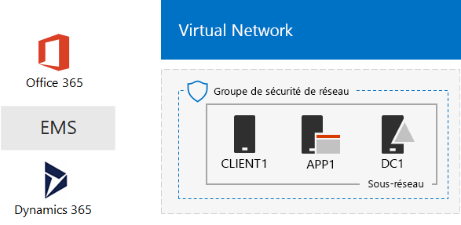
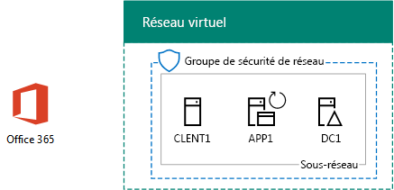
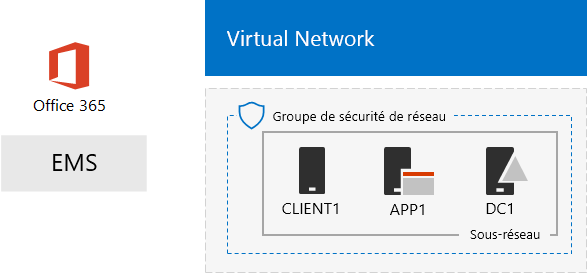

# Environnement de développement/test Microsoft Cloud uniqueThe One Microsoft Cloud dev/test environment

 **Résumé :** Utilisez ce Guide de laboratoire de Test pour créer un environnement de développement/test qui inclut toutes les offres en nuage de Microsoft.**Summary:** Use this Test Lab Guide to create a dev/test environment that includes all of Microsoft's cloud offerings.
  
Les instructions fournies dans cet article vous permettent de créer un intranet simulé dans les services d’infrastructure de Microsoft Azure, puis d’ajouter des abonnements Microsoft Office 365, Microsoft Enterprise Mobility + Security (EMS) et Microsoft Dynamics 365. Vous obtenez ainsi une organisation plus simple qui utilise toutes les offres cloud de Microsoft en même temps dans un environnement de développement/test unique. With the instructions in this article, you create a simulated intranet in Microsoft Azure infrastructure services and then add Microsoft Office 365, Microsoft Enterprise Mobility + Security (EMS), and Microsoft Dynamics 365 subscriptions. The result is a simplified organization that uses all Microsoft's cloud offerings at the same time in a single dev/test environment. 
  

  
Vous pouvez utiliser la configuration obtenue pour :You can use the resulting configuration to:
  
- Bénéficier d’une intégration de toutes les offres cloud de Microsoft, telles que l’infrastructure d’identité commune fournies par Azure Active Directory (AD).Experience the integration across Microsoft's cloud offerings, such as the common identity infrastructure provided by Azure Active Directory (AD).
    
- Évaluer des scénarios complets comprenant plusieurs offres Microsoft Cloud.Evaluate end-to-end scenarios that include multiple Microsoft Cloud offerings.
    
- Créer une démonstration, une preuve de concept ou une configuration de développement/test qui utilise plusieurs offres Microsoft Cloud.Create a demo, proof-of-concept, or dev/test configuration that uses multiple Microsoft Cloud offerings.
    
- Développer vos compétences sur Microsoft Cloud à des fins de développement professionnel.Build your Microsoft Cloud skills for professional development.
    
## Phase 1 : Créer un intranet simulé et y ajouter Office 365Phase 1: Create a simulated intranet and add Office 365

Suivez les instructions de [synchronisation d’annuaire pour votre environnement de développement/test d’Office 365](dirsync-for-your-office-365-dev-test-environment.md).Follow the instructions in [DirSync for your Office 365 dev/test environment](dirsync-for-your-office-365-dev-test-environment.md).
  
La figure 1 illustre votre configuration qui en résulte, ce qui inclut Office 365 et un intranet simulé en cours d’exécution dans les services d’infrastructure Azure et la synchronisation d’annuaire à partir d’une forêt de Windows Server Active Directory (AD) sur site.Figure 1 shows your resulting configuration, which includes Office 365 and a simulated intranet running in Azure infrastructure services and directory synchronization from an on-premises Windows Server Active Directory (AD) forest.
  
**Figure 1 : L’intranet simulé dans Azure avec Office 365****Figure 1: The simulated intranet in Azure with Office 365**

  
> [!NOTE]
> La version d’essai Azure est de 30 jours. L’abonnement d’évaluation de Office 365 entreprise E5 est de 30 jours, ce qui peut être facilement étendus pour un autre 30 jours. Pour un environnement de développement/test permanent, créer un nouveau payé l’abonnement Azure et un nouvel abonnement Office 365 entreprise E5 payé avec un petit nombre de licences.The Azure trial is 30 days. The Office 365 Enterprise E5 Trial subscription is 30 days, which can be easily extended for another 30 days. For a permanent dev/test environment, create a new paid Azure subscription and a new paid Office 365 Enterprise E5 subscription with a small number of licenses. 
  
## Phase 2 : Ajouter EMSPhase 2: Add EMS

Dans cette phase, vous vous inscrivez pour l’abonnement d’évaluation EMS et l’ajoutez à la même organisation que votre abonnement d’évaluation Office 365.In this phase, you sign up for the EMS trial subscription and add it to the same organization as your Office 365 trial subscription.
  
1. Avec un navigateur soit sur votre ordinateur de bureau ou à partir de CLIENT1, ouvrez une session sur le portail Office 365 à [https://portal.office.com](https://portal.office.com) avec les informations d’identification de votre compte d’administrateur global.With a browser on either your desktop computer or from CLIENT1, sign in to the Office 365 portal at [https://portal.office.com](https://portal.office.com) with the credentials of your global administrator account.
    
2. Cliquez sur la mosaïque de **l’Admin** .Click the **Admin** tile.
    
3. Dans l’onglet **Centre d’administration d’Office** dans votre navigateur, dans la navigation de gauche, cliquez sur **de facturation > acheter les services**.On the **Office Admin center** tab in your browser, in the left navigation, click **Billing > Purchase services**.
    
4. Dans la page **services d’achat** , trouver la **mobilité d’entreprise + E5 de la sécurité** . Placez le pointeur de la souris sur elle et cliquez sur **Démarrer la version d’évaluation gratuite**.On the **Purchase services** page, find the **Enterprise Mobility + Security E5** item. Hover your mouse pointer over it and click **Start free trial**.
    
5. Dans la page **Confirmer votre commande** , cliquez sur **Essayer maintenant**.On the **Confirm your order** page, click **Try now**.
    
6. Dans la page **reçu de commande** , cliquez sur **Continuer**.On the **Order receipt** page, click **Continue**.
    
> [!NOTE]
> L’abonnement à la version d’évaluation d’Enterprise Mobility + Security E5 est de 90 jours. Pour un environnement de développement/test permanent, créez un nouvel abonnement payant avec un nombre réduit de licences.The Enterprise Mobility + Security E5 trial subscription is 90 days. For a permanent dev/test environment, create a new paid subscription with a small number of licenses. 
  
Ensuite, activez la licence Enterprise Mobility + Security E5 pour tous les comptes d’utilisateur.Next, enable the Enterprise Mobility + Security E5 license for all user accounts.
  
1. Dans l’onglet **Centre d’administration d’Office 365** dans votre navigateur, dans la navigation de gauche, cliquez sur **les utilisateurs > utilisateurs actifs**.On the **Office 365 Admin center** tab in your browser, in the left navigation, click **Users > Active users**.
    
2. Cliquez sur votre compte d’administrateur global, puis cliquez sur **Modifier** pour les **licences de produit**.Click your global administrator account, and then click **Edit** for **Product licenses**.
    
3. Dans le volet des **licences** , activer la licence du produit de **mobilité d’entreprise + sécurité E5** **on**et cliquez sur **Enregistrer,** puis cliquez deux fois sur **Fermer** .On the **Product licenses** pane, turn the product license for **Enterprise Mobility + Security E5** to **On**, click **Save,** and then click **Close** twice.
    
4. Pour tous vos autres comptes (Utilisateur 1, Utilisateur 2, Utilisateur 3, Utilisateur 4 et Utilisateur 5), suivez les étapes 2 et 3.For all of your other accounts (User1, User 2, User 3, User 4, and User 5), do steps 2 and 3.
    
Votre environnement de développement/test comporte maintenant :Your dev/test environment now has:
  
- Un intranet simulé exécuté dans les services d’infrastructure Azure.A simulated intranet running in Azure infrastructure services.
    
- Des abonnements d’évaluation Office 365 E5 Entreprise et EMS qui partagent la même organisation et le même client Azure AD avec votre liste des comptes d’utilisateur.Office 365 E5 Enterprise and EMS trial subscriptions sharing the same organization and the same Azure AD tenant with your list of user accounts.
    
- Tous vos comptes d’utilisateur activés pour utiliser Office 365 Entreprise E5 et EMS.All of your user accounts enabled to use Office 365 E5 Enterprise and EMS.
    
La figure 2 montre la configuration obtenue, qui ajoute EMS.Figure 2 shows your resulting configuration, which adds EMS.
  
**Figure 2 : L’intranet simulé dans Azure avec Office 365 et EMS****Figure 2: The simulated intranet in Azure with Office 365 and EMS**

  
## Phase 3 : Ajoutez Dynamics 365Phase 3: Add Dynamics 365

Dans cette phase, vous allez souscrire à l’abonnement d’évaluation Dynamics 365 et l’ajouter à la même organisation que vos abonnements d’évaluation Office 365 et EMS.In this phase, you sign up for the Dynamics 365 trial subscription and add it to the same organization as your Office 365 and EMS trial subscriptions.
  
1. À l’aide d’un navigateur soit sur votre ordinateur de bureau ou à partir de CLIENT1, connectez-vous au portail Office 365 à [https://portal.office.com](https://portal.office.com) avec les informations d’identification de votre compte d’administrateur global.Using a browser on either your desktop computer or from CLIENT1, sign in to the Office 365 portal at [https://portal.office.com](https://portal.office.com) with the credentials of your global administrator account.
    
2. Cliquez sur la mosaïque de **l’Admin** .Click the **Admin** tile.
    
3. Dans l’onglet **Centre admin** , dans la navigation de gauche, cliquez sur **de facturation > acheter les services**.On the **Office admin center** tab, in the left navigation, click **Billing > Purchase services**.
    
4. Dans la page **services d’achat** , trouver l’élément de **Dynamics 365 Plan 1 Enterprise Edition** . Placez le pointeur de la souris sur elle et cliquez sur **Démarrer la version d’évaluation gratuite**.On the **Purchase services** page, find the **Dynamics 365 Plan 1 Enterprise Edition** item. Hover your mouse pointer over it and click **Start free trial**.
    
5. Dans la page **Confirmer votre commande** , cliquez sur **Essayer maintenant**.On the **Confirm your order** page, click **Try now**.
    
6. Dans la page **reçu de commande** , cliquez sur **Continuer**.On the **Order receipt** page, click **Continue**.
    
> [!NOTE]
> L’abonnement d’évaluation Dynamics 365 Plan 1 Enterprise Edition est valide pendant 30 jours. Vous pouvez facilement étendre l’abonnement d’évaluation pour une période supplémentaire de 30 jours. Pour un environnement de développement/test permanent, créez un nouvel abonnement payant avec un nombre réduit de licences.The Dynamics 365 Plan 1 Enterprise Edition trial subscription is 30 days. You can easily extend the trail subscription for another 30 days. For a permanent dev/test environment, create a new paid subscription with a small number of licenses. 
  
Procédez comme suit pour affecter des licences Dynamics 365 aux comptes de l’administrateur général, ainsi qu’aux comptes Utilisateur 2 et Utilisateur 3 afin de leur attribuer le rôle d’administrateur système.Use these steps to assign Dynamics 365 licenses to the global administrator, User 2, and User 3 accounts and make them system administrators.
  
1. Dans l’onglet **Centre admin** , cliquez sur **les utilisateurs > utilisateurs actifs**.On the **Office admin center** tab, click **Users > Active users**.
    
2. Dans la liste d’utilisateurs actifs, cliquez sur votre compte d’administrateur global, puis cliquez sur **Modifier** pour les **licences de produit**.In the list of active users, click your global administrator account, and then click **Edit** for **Product licenses**.
    
3. Dans le volet **des licences de produit** , activation de la licence du produit pour **Dynamics 365 Plan 1 Enterprise Edition** **sur**et cliquez sur **Enregistrer,** puis cliquez deux fois sur **Fermer** .On the **Product licenses** pane, turn the product license for **Dynamics 365 Plan 1 Enterprise Edition** to **On**, click **Save,** and then click **Close** twice.
    
4. Suivez les étapes 2 et 3 pour les comptes Utilisateur 2 et Utilisateur 3.Perform steps 2 and 3 for the User 2 and User 3 accounts.
    
5. Fermez l’onglet **Centre admin** .Close the **Office admin center** tab.
    
Lors de cette phase, vous allez configurer les comptes Utilisateur 2 et Utilisateur 3 en tant qu’administrateurs système de Dynamics 365.Use these steps to configure the User 2 and User 3 accounts as Dynamics 365 system administrators.
  
1. Dans l’onglet **Centre d’administration d’Office** dans votre navigateur, dans la navigation de gauche, cliquez sur **Centre d’administration**, puis cliquez sur **Dynamics 365**.On the **Office Admin center** tab in your browser, in the left navigation, click **Admin centers**, and then click **Dynamics 365**.
    
    Vous devrez peut-être attendre la fin de l’approvisionnement de Dynamics 365 avant de le voir apparaître dans le menu.You may need to wait for Dynamics 365 to finish provisioning before Dynamics 365 appears in the menu.
    
2. Sous l’onglet Dynamics 365, cliquez sur **tous**, puis cliquez sur **le programme d’installation terminé.**On the Dynamics 365 tab, click **All of these**, and then click **Complete Setup.**
    
    Attendez la fin de l’installation.Wait for setup to complete.
    
    Lorsque l’installation est terminée, il affiche un tableau de bord d’activité de vente basés sur des données qui fait partie de l’abonnement de la piste. Prenez quelques instants pour afficher la **Bienvenue dans votre version d’évaluation** de vidéo. Fermez la fenêtre de la vidéo lorsque vous avez terminé.When setup completes, it displays a Sales Activity Dashboard based on sample data that is part of the trail subscription. Take a few moments to view the **Welcome to your trial** video. Close the video window when complete.
    
3. Dans la barre d’outils en haut, cliquez sur la flèche en regard de **ventes**, cliquez sur **paramètres**, puis cliquez sur **sécurité**.On the toolbar at the top, click the down arrow next to **Sales**, click **Settings**, and then click **Security**.
    
4. Dans la page **sécurité** , cliquez sur **utilisateurs**.On the **Security** page, click **Users**.
    
5. Dans la liste des utilisateurs, cliquez sur **utilisateur 2**.In the list of users, click **User 2**.
    
6. Dans la barre d’outils, cliquez sur **Gérer les rôles**.In the tool bar, click **Manage Roles**.
    
7. **Gérer les rôles**, cliquez sur **Administrateur système**, puis cliquez sur **OK**.In **Manage Roles**, click **System Administrator**, and then click **OK**.
    
8. Dans la barre d’outils en haut, cliquez sur **sécurité**.In the tool bar at the top click **Security**.
    
9. Répétez les étapes 5 à 8 pour le compte Utilisateur 3.Repeat steps 5-8 for the User 3 account.
    
10. Fermer la **utilisateur : l’util_3** onglet.Close the **User: User3** tab.
    
> [!NOTE]
> Le rôle d’administrateur système Dynamics 365 a été automatiquement attribué à votre compte d’administrateur général Office 365.Your Office 365 global administrator account was automatically assigned the Dynamics 365 system administrator role. 
  
Votre environnement de développement/test comporte maintenant :Your dev/test environment now has:
  
- Un intranet simulé exécuté dans les services d’infrastructure Azure.A simulated intranet running in Azure infrastructure services.
    
- Des abonnements à la version d’évaluation d’Office 365 E5 Enterprise, d’EMS et de Dynamics 365 qui partagent la même organisation et le même client Azure AD avec votre liste des comptes d’utilisateur.Office 365 E5 Enterprise, EMS, and Dynamics 365 trial subscriptions sharing the same organization and the same Azure AD tenant with your list of user accounts.
    
- Tous vos comptes d’utilisateur activés pour utiliser Office 365 Entreprise E5 et EMS.All of your user accounts enabled to use Office 365 E5 Enterprise and EMS.
    
- Vos comptes d’administrateur général d’entreprise, Utilisateur 2 et Utilisateur 3 peuvent utiliser Dynamics 365, et sont également administrateurs système de Dynamics 365.Your global enterprise administrator, User 2, and User 3 accounts are enabled to use Dynamics 365 and are Dynamics 365 system administrators.
    
La figure 3 présente la configuration finale.Figure 3 shows your resulting configuration.
  
**Figure 3 : L’intranet simulé dans Azure avec Office 365, EMS et Dynamics 365****Figure 3: The simulated intranet in Azure with Office 365, EMS, and Dynamics 365**

  
## Étapes suivantesNext steps

Vous pouvez maintenant tester différentes configurations avec votre environnement de développement/test Microsoft Cloud. Voici quelques suggestions pour vous guider :You can now experiment with your One Microsoft Cloud dev/test environment. Here are some ideas for guided experiences:
  
- [Configurer des stratégies de management (MAM) d’une application mobile dans EMS pour les applications d’Office 365Configure mobile application management (MAM) policies in EMS for Office 365 applications](https://technet.microsoft.com/library/mt764059.aspx)
    
- [Montrer Exchange Online dans Office 365 une intégration avec les contacts de Dynamics 365Demonstrate Exchange Online in Office 365 integration with Dynamics 365 contacts](https://technet.microsoft.com/library/mt798313.aspx)
    
- [Créer un réseau simulé coexistence dans les services d’infrastructure Azure pour l’hébergement des charges de travail basé sur serveurCreate a simulated cross-premises network in Azure infrastructure services for hosting server-based workloads](https://technet.microsoft.com/library/mt745150.aspx)
    
## Voir aussiSee Also

[Guides de laboratoire de test d’adoption cloudCloud adoption Test Lab Guides (TLGs)](cloud-adoption-test-lab-guides-tlgs.md)
  
[Ressources relatives à l'architecture informatique du cloud MicrosoftMicrosoft Cloud IT architecture resources](microsoft-cloud-it-architecture-resources.md)
  
[Solutions hybridesHybrid solutions](hybrid-solutions.md)
  
[Solutions de sécuritéSecurity solutions](security-solutions.md)

