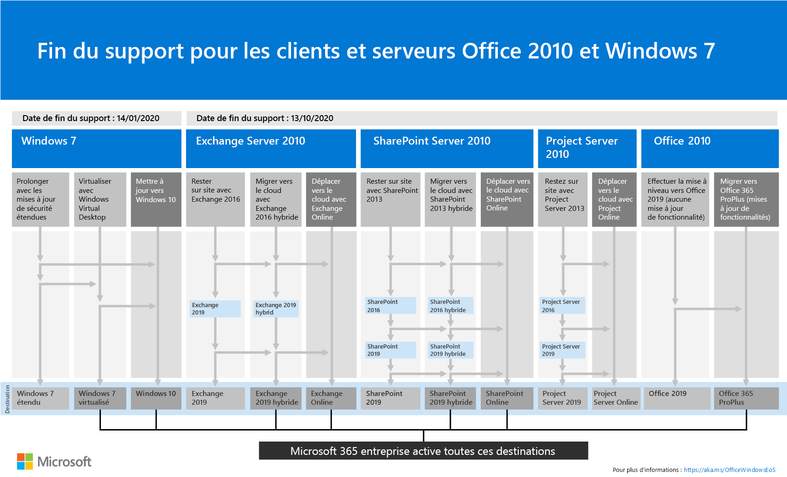

# Ressources pour vous aider à effectuer une mise à niveau à partir de serveurs et clients Office 2010Resources to help you upgrade from Office 2010 servers and clients

*Cet article s’applique à la fois à Office 365 entreprise et à Microsoft 365 entreprise.**This article applies to both Office 365 Enterprise and Microsoft 365 Enterprise.*

Office 2010, Exchange Server 2010, SharePoint 2010 et Project Server 2010 atteindront leur fin d’assistance le **13 octobre 2020**.Office 2010, Exchange Server 2010, SharePoint 2010, and Project Server 2010 will reach their end of support on **October 13, 2020**. 

Pendant que vous planifiez votre mise à niveau, il est très utile de passer à Office 365 ou Microsoft 365.While you're planning your upgrade, this is a great time to consider moving to Office 365 or Microsoft 365. 

- Office 365 propose des services en nuage pour les produits serveur Office 2010, tels qu’Exchange Server et SharePoint Server et des services tels que teams et OneDrive entreprise.Office 365 has cloud-based services for Office 2010 server products such as Exchange Server and SharePoint Server and services such as Teams and OneDrive for Business. 

- Office 365 ProPlus, inclus dans Office 365 E3 et E5 et Microsoft 365 Enterprise, est l’ensemble des applications clientes Office que vous installez sur votre appareil local.Office 365 ProPlus, included with Office 365 E3 and E5 and Microsoft 365 Enterprise, is the set of Office client apps that you install on your local device. Elles sont mises à jour avec de nouvelles fonctionnalités de productivité et de sécurité en continu à partir du Cloud Microsoft.They are updated with new productivity and security features on an ongoing basis from the Microsoft cloud.

Pour obtenir un résumé visuel des options de mise à niveau, de migration et de déplacement sur le Cloud pour les clients et les serveurs Office 2010 et Windows 7, consultez la [fin de l’affiche de la prise en charge](./media/upgrade-from-office-2010-servers-and-products/Office2010Windows7EndOfSupport.pdf).For a visual summary of the upgrade, migrate, and move-to-the-cloud options for Office 2010 clients and servers and Windows 7, see the [end of support poster](./media/upgrade-from-office-2010-servers-and-products/Office2010Windows7EndOfSupport.pdf).

Cette affiche de page unique constitue un moyen rapide de comprendre les différents chemins que vous pouvez suivre pour empêcher les produits client et serveur Office 2010 et Windows 7 d’atteindre la fin du support, avec les chemins d’accès et la prise en charge des options préférés dans Microsoft 365 entreprise en surbrillance.This one-page poster is a quick way to understand the various paths you can take to prevent Office 2010 client and server products and Windows 7 from reaching end of support, with preferred paths and option support in Microsoft 365 Enterprise highlighted.

Vous pouvez également [Télécharger](https://github.com/MicrosoftDocs/microsoft-365-docs/raw/public/microsoft-365/enterprise/media/migration-microsoft-365-enterprise-workload/Office2010Windows7EndOfSupport.pdf) cette affiche et l’imprimer au format Letter, Legal ou tabloïd (11 x 17).You can also [download](https://github.com/MicrosoftDocs/microsoft-365-docs/raw/public/microsoft-365/enterprise/media/migration-microsoft-365-enterprise-workload/Office2010Windows7EndOfSupport.pdf) this poster and print it in letter, legal, or tabloid (11 x 17) formats.
      
## Planification de la mise à niveau vers le client et le serveur Office 2010Office 2010 client and server upgrade planning
  
|**Pour ce produit****For this product**|**Après cette date de prise en charge****With this end of support date**|**Voir cette ressource****See this resource**|
|:-----|:-----|:-----|
|Office 2010 (y compris Word 2010, Excel 2010, PowerPoint 2010 et Outlook 2010)Office 2010 (including Word 2010, Excel 2010, PowerPoint 2010, and Outlook 2010)    | 13 octobre 2020October 13, 2020 |[Feuille de route de prise en charge d’Office 2010Office 2010 end of support roadmap](https://docs.microsoft.com/DeployOffice/office-2010-end-support-roadmap)   |
|Exchange Server 2010Exchange Server 2010    | 13 octobre 2020October 13, 2020  |[Feuille de route de fin de prise en charge d’Exchange 2010Exchange 2010 end of support roadmap](exchange-2010-end-of-support.md)   |
|SharePoint 2010 ou SharePoint Server 2010SharePoint 2010 or SharePoint Server 2010    | 13 octobre 2020October 13, 2020 |[Mise à niveau à partir de SharePoint 2010Upgrading from SharePoint 2010](upgrade-from-sharepoint-2010.md)   |
|Project Server 2010Project Server 2010   | 13 octobre 2020October 13, 2020 | [Feuille de route de prise en charge de Project Server 2010Project Server 2010 end of support roadmap](project-server-2010-end-of-support.md)   |
|Lync Server 2010Lync Server 2010   | 13 avril 2021April 13, 2021 | [Planifier une mise à niveau vers Skype entreprise ServerPlan to upgrade to Skype for Business Server](https://docs.microsoft.com/skypeforbusiness/plan-your-deployment/upgrade)   |
    
## Je suis un utilisateur à domicile.I'm a home user. What do I do?What do I do?

Si vous utilisez les produits et applications Office 2010 à la maison, reportez-vous à [ces informations](plan-upgrade-previous-versions-office.md#im-a-home-user-what-do-i-do).If you're using Office 2010 products and applications at home, see [this information](plan-upgrade-previous-versions-office.md#im-a-home-user-what-do-i-do).

## Sujets associésRelated topics

[Groupe de retraite Office (Communauté Microsoft Tech)Office Retirement Group (Microsoft Tech Community)](https://go.microsoft.com/fwlink/?linkid=842065)
  
[Vidéo : qu’est-ce que Office 365 ?Video: What is Office 365?](https://support.office.com/article/847caf12-2589-452c-8aca-1c009797678b.aspx)
  
[Politique de cycle de vie MicrosoftMicrosoft Lifecycle Policy](https://go.microsoft.com/fwlink/?linkid=865200)

[Planification de la mise à niveau à partir de serveurs et clients Office 2007 ou Office 2010Plan your upgrade from Office 2007 or Office 2010 servers and clients](plan-upgrade-previous-versions-office.md)

