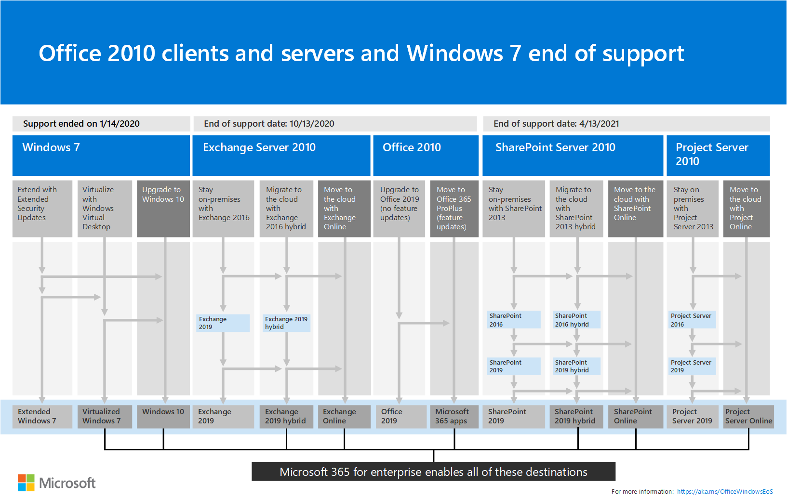

# Ressources facilitant la mise à jour de vos clients et serveurs Office 2010Resources to help you upgrade from Office 2010 servers and clients

*Cet article s’applique à la fois à Microsoft 365 entreprise et à Office 365 entreprise.**This article applies to both Microsoft 365 Enterprise and Office 365 Enterprise.*

Office 2010 et Exchange 2010 atteindront leur fin d’assistance le **13 octobre 2020**.Office 2010 and Exchange 2010 will reach their end of support on **October 13, 2020**. 

SharePoint 2010 et Project Server 2010 atteindront leur fin d’assistance le **13 avril 2021**.SharePoint 2010 and Project Server 2010 will reach their end of support on **April 13, 2021**.

Pendant que vous planifiez votre mise à niveau, il est très utile de passer à Microsoft 365.While you're planning your upgrade, this is a great time to consider moving to Microsoft 365. 

- Microsoft 365 propose des services en nuage pour les produits serveur Office 2010, tels qu’Exchange Server et SharePoint Server et des services tels que teams et OneDrive entreprise.Microsoft 365 has cloud-based services for Office 2010 server products such as Exchange Server and SharePoint Server and services such as Teams and OneDrive for Business. 

- Les applications Microsoft 365 pour entreprise (précédemment nommé Office 365 ProPlus), incluses dans Microsoft 365 E3 et E5, sont les applications clientes Office que vous installez sur votre appareil local.Microsoft 365 Apps for enterprise (previously named Office 365 ProPlus), included with Microsoft 365 E3 and E5, is the set of Office client apps that you install on your local device. Ils sont mis à jour de façon régulière avec de nouvelles fonctionnalités de productivité et de sécurité issues du cloud Microsoft.They are updated with new productivity and security features on an ongoing basis from the Microsoft cloud.

Pour consulter une synthèse visuelle des options de mise à jour, de migration et de déplacement vers le Cloud pour les produits serveur et client Office 2010 et Windows 7, voir l’[affiche de fin de prise en charge](./media/upgrade-from-office-2010-servers-and-products/Office2010Windows7EndOfSupport.pdf).For a visual summary of the upgrade, migrate, and move-to-the-cloud options for Office 2010 clients and servers and Windows 7, see the [end of support poster](./media/upgrade-from-office-2010-servers-and-products/Office2010Windows7EndOfSupport.pdf).

Cette affiche d’une page est un moyen rapide pour connaître les différents chemins que vous pouvez prendre pour empêcher les produits client et serveur Office 2010 et Windows 7 d’arriver à la fin de la prise en charge, avec les chemins d’accès et la prise en charge des options préférés dans Microsoft 365 Entreprise mis en surbrillance.This one-page poster is a quick way to understand the various paths you can take to prevent Office 2010 client and server products and Windows 7 from reaching end of support, with preferred paths and option support in Microsoft 365 Enterprise highlighted.

Vous pouvez également [télécharger](https://github.com/MicrosoftDocs/microsoft-365-docs/raw/public/microsoft-365/media/migration-microsoft-365-enterprise-workload/Office2010Windows7EndOfSupport.pdf) cette affiche et l’imprimer au format lettre, légal ou tabloïd (11 x 17).You can also [download](https://github.com/MicrosoftDocs/microsoft-365-docs/raw/public/microsoft-365/media/migration-microsoft-365-enterprise-workload/Office2010Windows7EndOfSupport.pdf) this poster and print it in letter, legal, or tabloid (11 x 17) formats.
      
## Planning de mise à jour d'Office 2010 client et serveurOffice 2010 client and server upgrade planning
  
|**Pour ce produit****For this product**|**À la date de fin de la prise en charge****With this end of support date**|**Voir cette ressource****See this resource**|
|:-----|:-----|:-----|
|Office 2010 (y compris Word 2010, Excel 2010, PowerPoint 2010 et Outlook 2010)Office 2010 (including Word 2010, Excel 2010, PowerPoint 2010, and Outlook 2010)    | 13 octobre 2020October 13, 2020 |[Feuille de route pour la fin de la prise en charge d’Office 2010Office 2010 end of support roadmap](https://docs.microsoft.com/DeployOffice/office-2010-end-support-roadmap)   |
|Exchange Server 2010Exchange Server 2010    | 13 octobre 2020October 13, 2020  |[Feuille de route pour la fin de la prise en charge d'Exchange 2010Exchange 2010 end of support roadmap](exchange-2010-end-of-support.md)   |
|SharePoint Server 2010 ou SharePoint Serverˆ2010SharePoint 2010 or SharePoint Server 2010    | 13 avril 2021April 13, 2021 |[Mise à jour à jour de SharePoint 2010Upgrading from SharePoint 2010](upgrade-from-sharepoint-2010.md)   |
|Project Server 2010Project Server 2010   | 13 avril 2021April 13, 2021 | [Feuille de route pour la fin de la prise en charge de Project Server 2010Project Server 2010 end of support roadmap](project-server-2010-end-of-support.md)   |
|Lync Server 2010Lync Server 2010   | 13 avril 2021April 13, 2021 | [Planifiez la mise à jour vers Skype Entreprise ServerPlan to upgrade to Skype for Business Server](https://docs.microsoft.com/skypeforbusiness/plan-your-deployment/upgrade)   |
    
## Je suis un particulier.I'm a home user. Que dois-je faire ?What do I do?

Si vous utilisez les produits et applications Office 2010 à domicile, voir [ces informations](plan-upgrade-previous-versions-office.md#im-a-home-user-what-do-i-do).If you're using Office 2010 products and applications at home, see [this information](plan-upgrade-previous-versions-office.md#im-a-home-user-what-do-i-do).

## Sujets associésRelated topics

[Vidéo : qu’est-ce que Microsoft 365 ?Video: What is Microsoft 365?](https://support.office.com/article/847caf12-2589-452c-8aca-1c009797678b.aspx)
  
[Politique de cycle de vie MicrosoftMicrosoft Lifecycle Policy](https://go.microsoft.com/fwlink/?linkid=865200)

[Planifiez votre mise à jour des serveurs et clients Office 2007 et Office 2010Plan your upgrade from Office 2007 or Office 2010 servers and clients](plan-upgrade-previous-versions-office.md)

