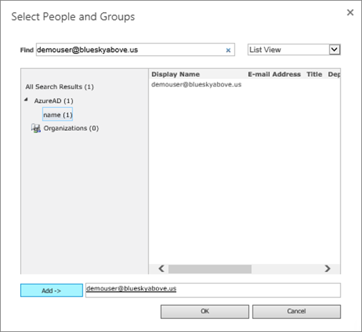
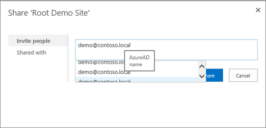

# <a name="using-azure-ad-for-sharepoint-server-authentication"></a>À l’aide d’Azure AD pour l’authentification de serveur SharePoint

 **Résumé :** Apprenez à authentifier les utilisateurs de SharePoint Server 2016 avec Azure Active Directory.
  
> [!NOTE]
> Cet article est basé sur le travail de Kirk Evans, responsable de programme Microsoft Principal. 

<blockquote>
<p>Cet article fait référence à des exemples de code pour interagir avec Azure Active Directory Graph. Vous pouvez télécharger les exemples de code [ici](https://github.com/kaevans/spsaml11/tree/master/scripts).</p>
</blockquote>

SharePoint Server 2016 offre la possibilité pour authentifier les utilisateurs à l’aide de l’authentification basée sur les revendications, ce qui vous permet de gérer vos utilisateurs en authentifiant les avec différents fournisseurs d’identité que vous faites confiance mais une autre personne gère. Par exemple, au lieu de gérer l’authentification des utilisateurs par le biais de Services de domaine Active Directory (AD DS), vous pouvez activer les utilisateurs s’authentifient à l’aide d’Azure Active Directory (AD Azure). Cela permet l’authentification des utilisateurs en nuage uniquement avec le suffixe onmicrosoft.com dans leur nom d’utilisateur, les utilisateurs synchronisé avec un répertoire local, invités utilisateurs invités à partir d’autres répertoires. Il vous permet également de tirer parti des fonctionnalités d’Azure AD telles que l’authentification multifacteur et les fonctionnalités de création de rapports avancées.

> [!IMPORTANT]
> La solution décrite dans cet article peut également être utilisée avec SharePoint Server 2013 ; Toutefois, n’oubliez pas que SharePoint Server 2013 est proche de la fin du support standard. Pour plus d’informations, voir [Politique de Microsoft](https://support.microsoft.com/en-us/lifecycle/search?alpha=SharePoint%20Server%202013) et de [Mise à jour de produit la stratégie de traitement pour SharePoint 2013](https://technet.microsoft.com/library/684173bb-e90a-4eb7-b268-b8d7458bc802(v=office.16).aspx).

Cet article explique comment vous pouvez utiliser Azure AD pour authentifier les utilisateurs au lieu de votre site AD DS. Dans cette configuration, Azure AD devient un fournisseur d’identité approuvé pour SharePoint Server 2016. Cette configuration ajoute une méthode d’authentification utilisateur distinct de l’authentification de domaine Active Directory utilisée par l’installation de SharePoint Server 2016 proprement dit. Pour bénéficier de cet article, vous devez maîtriser WS-Federation. Pour plus d’informations, voir [Présentation de WS-Federation](https://go.microsoft.com/fwlink/p/?linkid=188052).


Auparavant, cette configuration aurait nécessité un service de fédération comme Azure Access Control Service (ACS) dans le nuage ou d’un environnement qui héberge Active Directory Federation Services (ADFS) transformer les jetons SAML 2.0 SAML 1.1. Cette transformation n’est plus nécessaire que les jetons SAML 1.1 émettrices permet d’Azure AD maintenant. Le diagramme ci-dessus illustre le fonctionnement de l’authentification des utilisateurs SharePoint 2016 dans cette configuration, montrant qu’il n’est plus une condition requise pour un rôle d’intermédiaire effectuer cette transformation.

> [!NOTE]
> Cette configuration fonctionne si la batterie de serveurs SharePoint est hébergé dans les machines virtuelles Azure ou sur site. Il ne nécessite pas l’ouverture des ports de pare-feu supplémentaires à part garantir que les utilisateurs peut accéder Azure Active Directory à partir de leur navigateur.

Pour plus d’informations sur l’accessibilité dans SharePoint 2016, voir [Recommandations en matière d’accessibilité dans SharePoint Server 2016](https://go.microsoft.com/fwlink/p/?LinkId=393123).

## <a name="configuration-overview"></a>Vue d’ensemble de la configuration

Suivez ces étapes générales pour configurer votre environnement à utiliser Azure AD comme un fournisseur d’identité SharePoint Server 2016.

1. Créer un nouveau répertoire Azure AD ou utiliser un répertoire existant.
2. Assurez-vous que la zone de l’application web que vous souhaitez sécuriser avec Azure AD est configurée pour utiliser SSL.
3. Créez une nouvelle application d’entreprise dans Azure AD.
4. Configurer un nouveau fournisseur d’identité approuvé dans SharePoint Server 2016.
5. Définir les autorisations pour l’application web.
6. Ajouter une stratégie d’émission de jeton SAML 1.1 dans Azure AD.
7. Vérifiez le nouveau fournisseur.

Les sections suivantes décrivent comment effectuer ces tâches.

## <a name="step-1-create-a-new-azure-ad-directory-or-use-your-existing-directory"></a>Étape 1 : Créer un nouveau répertoire Azure AD ou utiliser un répertoire existant

Dans le portail Azure ([https://portal.azure.com](https://portal.azure.com)), créez un nouveau répertoire. Fournir le nom de l’organisation, le nom de domaine initial et le pays ou la région.

 

 Si vous avez déjà un répertoire tels que celui utilisé pour Microsoft Office 365 ou votre abonnement Microsoft Azure, vous pouvez utiliser ce répertoire à la place. Vous devez disposer des autorisations pour enregistrer les applications dans le répertoire.

## <a name="step-2-ensure-the-zone-for-the-web-application-that-you-want-to-secure-with-azure-ad-is-configured-to-use-ssl"></a>Étape 2 : Vérifiez la zone pour l’application web que vous souhaitez sécuriser avec Azure AD est configurée pour utiliser SSL

Cet article a été écrit à l’aide de l’architecture de référence dans la zone [exécuter une batterie de serveurs SharePoint Server 2016 dans Azure à haute disponibilité](https://docs.microsoft.com/en-us/azure/architecture/reference-architectures/sharepoint). Scripts accompagne l’article utilisés pour déployer la solution décrite dans [cet article](https://docs.microsoft.com/en-us/azure/architecture/reference-architectures/sharepoint) créent un site qui n’utilise pas SSL.  

L’utilisation de SAML nécessite l’application soit configuré pour utiliser SSL. Si votre application web SharePoint n’est pas configurée pour utiliser SSL, procédez comme suit pour créer un certificat auto-signé pour configurer l’application web pour SSL. Cette configuration est destinée uniquement à un environnement de laboratoire et n’est pas destinée à production. Environnements de production doivent utiliser un certificat signé.

1. Accédez à **L’Administration centrale** > **Gestion des applications** > **Gérer les Applications Web**et choisissez l’application web qui doit être étendu pour utiliser SSL. Sélectionnez l’application web, cliquez sur le bouton **étendre le ruban** . Étendre l’application web pour utiliser la même URL mais SSL avec le port 443.</br></br>
2. Dans le Gestionnaire des services Internet (IIS), double-cliquez sur **Certificats de serveur**.
3. Dans le volet **Actions** , cliquez sur **Créer un certificat auto-signé**. Tapez un nom convivial pour le certificat dans la spécifier un nom convivial pour la boîte de certificat, puis cliquez sur **OK**.
4. À partir de la boîte de dialogue **Modifier la liaison de Site** , vérifiez le nom d’hôte est le même que le nom convivial, comme illustré dans l’image suivante.</br></br>

Chacun des serveurs web frontaux de la batterie de serveurs SharePoint nécessite la configuration du certificat pour la liaison de site dans IIS.


## <a name="step-3-create-a-new-enterprise-application-in-azure-ad"></a>Étape 3 : Créer une nouvelle application d’entreprise dans Azure AD

1. Dans le portail Azure ([https://portal.azure.com](https://portal.azure.com)), ouvrez votre annuaire Azure AD. Cliquez sur **Applications d’entreprise**, puis cliquez sur **nouvelle application**. Choisissez **application Non-galerie**. Fournir un nom tel que *L’intégration de SharePoint SAML* et cliquez sur **Ajouter**.</br></br>
2. Cliquez sur le lien authentification unique dans le volet de navigation pour configurer l’application. Modifier la liste déroulante **Mode d’authentification unique** **basée sur SAML Sign-on** pour afficher les propriétés de configuration SAML pour l’application. Configurer les propriétés suivantes :</br>
    - Identificateur :`urn:sharepoint:portal.contoso.local`
    - URL de réponse :`https://portal.contoso.local/_trust/default.aspx`
    - Authentification de l’URL :`https://portal.contoso.local/_trust/default.aspx`
    - Identificateur de l’utilisateur :`user.userprincipalname`</br>
    - Remarque : N’oubliez pas de modifier les URL en remplaçant *portal.contoso.local* par l’URL du site SharePoint que vous souhaitez protéger.</br>
3. Définir une table (similaire au tableau 1 ci-dessous) qui contient les lignes suivantes :</br> 
    - Domaine
    - Chemin d’accès complet au fichier de certificat de signature de SAML
    - SAML Single Sign-On service URL (en remplaçant */saml2* par */wsfed*)
    - ID d’objet application. </br>
Copiez la valeur de *l’identificateur* dans la propriété *Realm* dans une table (voir tableau 1 ci-dessous.)
4. Enregistrez vos modifications.
5. Cliquez sur le lien **configurer (nom de l’application)** pour accéder à la page Configurer la session.</br></br> 
    -  Cliquez sur le lien **SAML certificat de signature - brutes** pour télécharger le certificat de signature SAML en tant que fichier avec l’extension .cer. Copiez et collez le chemin d’accès complet au fichier téléchargé dans votre table.
    - Copiez et collez le lien SAML Sign-On Service URL unique dans votre fichier, en remplaçant la partie */saml2* de l’URL par */wsfed*.</br>
6.  Naviguez vers le volet des **Propriétés** de l’application. Copiez et collez la valeur de l’ID de l’objet dans la table que vous avez configuré à l’étape 3.</br></br>
7. En utilisant les valeurs que vous avez capturé, assurez-vous que la table que vous avez configuré à l’étape 3 ressemble au tableau 1 ci-dessous.


| Tableau 1 : Valeurs capturées  |  |
|---------|---------|
|Domaine | `urn:sharepoint:portal.contoso.local` |
|Chemin d’accès complet au fichier de certificat de signature de SAML | `C:/temp/SharePoint SAML Integration.cer`  |
|URL du service d’authentification unique SAML (remplacez /saml2 par /wsfed) | `https://login.microsoftonline.com/b1726649-b616-460d-8d20-defab80d476c/wsfed` |
|ID de l’objet application | `a812f48b-d1e4-4c8e-93be-e4808c8ca3ac` |

> [!IMPORTANT]
> Remplacez la valeur */saml2* dans l’URL */wsfed*. Le point de terminaison */saml2* traite les jetons SAML 2.0. Le point de terminaison */wsfed* permet de jetons SAML 1.1 de traitement et est requis pour la fédération SharePoint 2016 SAML.

## <a name="step-4-configure-a-new-trusted-identity-provider-in-sharepoint-server-2016"></a>Étape 4 : Configurer un nouveau fournisseur d’identité approuvé dans SharePoint Server 2016

Se connecter au serveur SharePoint Server 2016 et ouvrez 2016 SharePoint Management Shell. Renseignez les valeurs de $realm, $wsfedurl et $filepath dans le tableau 1 et exécutez les commandes suivantes pour configurer un nouveau fournisseur d’identité approuvé.

> [!TIP]
> Si vous êtes novice à l’aide de PowerShell ou pour en savoir plus sur le fonctionne de PowerShell, voir [SharePoint PowerShell](https://docs.microsoft.com/en-us/powershell/sharepoint/overview?view=sharepoint-ps). 

```
$realm = "<Realm from Table 1>"
$wsfedurl="<SAML single sign-on service URL from Table 1>"
$filepath="<Full path to SAML signing certificate file from Table 1>"
$cert = New-Object System.Security.Cryptography.X509Certificates.X509Certificate2($filepath)
New-SPTrustedRootAuthority -Name "AzureAD" -Certificate $cert
$map = New-SPClaimTypeMapping -IncomingClaimType "http://schemas.xmlsoap.org/ws/2005/05/identity/claims/name" -IncomingClaimTypeDisplayName "name" -LocalClaimType "http://schemas.xmlsoap.org/ws/2005/05/identity/claims/upn"
$map2 = New-SPClaimTypeMapping -IncomingClaimType "http://schemas.xmlsoap.org/ws/2005/05/identity/claims/givenname" -IncomingClaimTypeDisplayName "GivenName" -SameAsIncoming
$map3 = New-SPClaimTypeMapping -IncomingClaimType "http://schemas.xmlsoap.org/ws/2005/05/identity/claims/surname" -IncomingClaimTypeDisplayName "SurName" -SameAsIncoming
$ap = New-SPTrustedIdentityTokenIssuer -Name "AzureAD" -Description "SharePoint secured by Azure AD" -realm $realm -ImportTrustCertificate $cert -ClaimsMappings $map,$map2,$map3 -SignInUrl $wsfedurl -IdentifierClaim "http://schemas.xmlsoap.org/ws/2005/05/identity/claims/name"
```

Ensuite, procédez comme suit pour activer le fournisseur d’identité approuvé pour votre application :
1. Dans l’Administration centrale, accédez à **Gérer les applications Web** et sélectionnez l’application web que vous souhaitez sécuriser avec Azure AD. 
2. Dans le ruban, cliquez sur **Fournisseurs d’authentification** , choisissez la zone que vous souhaitez utiliser.
3. Sélectionnez **fournisseur d’identité approuvé** , sélectionnez le fournisseur d’identité que vous venez d’enregistrer nommé *AzureAD*.  
4. Le paramètre URL de la page de connexion, sélectionnez la **page de connexion personnalisée** et fournir la valeur « /_trust/ ». 
5. Cliquez sur **OK**.


## <a name="step-5-set-the-permissions"></a>Étape 5 : Définir les autorisations

Les utilisateurs qui accèdent à SharePoint et connectez-vous à Azure AD doivent avoir accès à l’application. 

1. Dans le portail Azure, ouvrez le répertoire Azure AD. Cliquez sur **Applications d’entreprise**, puis cliquez sur **toutes les applications**. Cliquez sur l’application que vous avez créée précédemment (SharePoint SAML intégration).
2. Cliquez sur **utilisateurs et groupes**. 
3. Cliquez sur **Ajouter un utilisateur** pour ajouter un utilisateur ou un groupe disposant des autorisations pour vous connecter à SharePoint à l’aide d’Azure AD.
4. Sélectionnez l’utilisateur ou du groupe, puis cliquez sur **affecter**.
 
L’utilisateur a reçu l’autorisation dans Azure AD, mais également doit posséder l’autorisation dans SharePoint. Utilisez les étapes suivantes pour définir les autorisations pour accéder à l’application web.

1. Dans l'Administration centrale, cliquez sur **Gestion des applications**.
2. Dans la section **Applications web** de la page **Gestion des applications**, cliquez sur **Gérer les applications web**.
3. Cliquez sur l'application web appropriée, puis sur **Stratégie de l'utilisateur**.
4. Dans la stratégie d’Application Web, cliquez sur **Ajouter des utilisateurs**.</br></br>
5. Dans la boîte de dialogue **Ajouter des utilisateurs**, cliquez sur la zone appropriée dans **Zones**, puis sur **Suivant**.
6. Dans la boîte de dialogue **stratégie d’Application Web** , dans la section **Choisir les utilisateurs** , cliquez sur l’icône **Parcourir** .
7. Dans la zone de texte **Rechercher** , tapez le nom de connexion pour un utilisateur dans le répertoire et cliquez sur **Rechercher**. </br>Exemple : *demouser@blueskyabove.onmicrosoft.com*.
8. Sous le titre AzureAD dans la liste affichée, sélectionnez la propriété name et cliquez sur **Ajouter** , puis cliquez sur **OK** pour fermer la boîte de dialogue.
9. Dans autorisations, cliquez sur **Contrôle total**.</br></br>
10. Cliquez sur **Terminer**, puis sur **OK**.

## <a name="step-6-add-a-saml-11-token-issuance-policy-in-azure-ad"></a>Étape 6 : Ajouter une stratégie d’émission de jeton SAML 1.1 dans Azure AD

Lorsque l’application Azure AD est créée dans le portail, elle utilise par défaut SAML 2.0. SharePoint Server 2016 requiert que le format de jeton SAML 1.1. Le script suivant supprime la stratégie de SAML 2.0 par défaut et ajouter une nouvelle stratégie aux jetons SAML 1.1 de problème. Ce code nécessite le téléchargement de l' accompagnement [exemples illustrant l’interaction avec Azure Active Directory Graph](https://github.com/kaevans/spsaml11/tree/master/scripts). 


```
Import-Module <file path of Initialize.ps1> 
$objectid = "<Application Object ID from Table 1>"
$saml2policyid = Get-PoliciesAssignedToServicePrincipal -servicePrincipalId $objectid | ?{$_.displayName -EQ "TokenIssuancePolicy"} | select objectId
Remove-PolicyFromServicePrincipal -policyId $saml2policyid -servicePrincipalId $objectid
$policy = Add-TokenIssuancePolicy -DisplayName SPSAML11 -SigningAlgorithm "http://www.w3.org/2001/04/xmldsig-more#rsa-sha256" -TokenResponseSigningPolicy TokenOnly -SamlTokenVersion "1.1"
Set-PolicyToServicePrincipal -policyId $policy.objectId -servicePrincipalId $objectid
```
> Notez qu’il est important d’exécuter le `Import-Module` command, comme illustré dans cet exemple. Charger un module dépendant qui contient les commandes. Vous devrez peut-être ouvrir une invite de commandes avec élévation de privilèges pour exécuter ces commandes.

Ces exemples de commandes PowerShell sont des exemples illustrant comment exécuter des requêtes sur l’API du graphique. Pour plus d’informations sur les stratégies d’émission jeton avec Azure AD, voir la [référence des API de graphique pour les opérations de stratégie](https://msdn.microsoft.com/en-us/library/azure/ad/graph/api/policy-operations#create-a-policy).

## <a name="step-7-verify-the-new-provider"></a>Étape 7 : Vérifier le nouveau fournisseur

Ouvrez un navigateur à l’URL de l’application web que vous avez configuré lors des étapes précédentes. Vous êtes redirigé pour vous connecter à Azure AD.


Vous êtes invité si vous voulez rester connecté.


Enfin, vous pouvez accéder au site connecté en tant qu’un utilisateur de votre client Azure Active Directory.


## <a name="managing-certificates"></a>Gestion des certificats
Il est important de comprendre que le certificat de signature qui a été configuré pour le fournisseur d’identité approuvé à l’étape 4 ci-dessus a une date d’expiration et doit être renouvelé. Consultez l’article [Gérer les certificats pour fédéré de l’authentification unique dans Azure Active Directory](https://docs.microsoft.com/en-us/azure/active-directory/active-directory-sso-certs) pour plus d’informations sur le renouvellement de certificat. Une fois le certificat a été renouvelé dans Azure AD, téléchargez dans un fichier local et utilisez le script suivant pour configurer le fournisseur d’identité approuvé avec le certificat de signature renouvelé. 

```
$filepath="<Full path to renewed SAML signing certificate file>"
$cert= New-Object System.Security.Cryptography.X509Certificates.X509Certificate2($filePath)
New-SPTrustedRootAuthority -Name "AzureAD" -Certificate $cert
Get-SPTrustedIdentityTokenIssuer "AzureAD" | Set-SPTrustedIdentityTokenIssuer -ImportTrustCertificate $cert
```
## <a name="configuring-one-trusted-identity-provider-for-multiple-web-applications"></a>Configuration d’un fournisseur d’identité approuvé pour plusieurs applications web
La configuration fonctionne pour une application web unique, mais il nécessite une configuration supplémentaire si vous envisagez d’utiliser le même fournisseur d’identité approuvé pour plusieurs applications web. Par exemple, supposons que nous avions étendu à une application web pour utiliser l’URL `https://portal.contoso.local` et voulez authentifier les utilisateurs à `https://sales.contoso.local` également. Pour ce faire, nous devons mettre à jour le fournisseur d’identité pour honorer le paramètre WReply et mettre à jour l’inscription de l’application dans Azure AD pour ajouter une URL de la réponse.

1. Dans le portail Azure, ouvrez le répertoire Azure AD. Cliquez sur **les enregistrements d’application**, puis cliquez sur **Afficher toutes les applications**. Cliquez sur l’application que vous avez créée précédemment (SharePoint SAML intégration).
2. Cliquez sur **paramètres**.
3. Dans le serveur lame paramètres, cliquez sur **URL de réponse**. 
4. Ajoutez l’URL de l’application web supplémentaires (tels que `https://sales.contoso.local`) et cliquez sur **Enregistrer**. 
5. Sur le serveur SharePoint, ouvrez **SharePoint 2016 Management Shell** et exécutez les commandes suivantes, en utilisant le nom de l’émetteur de jeton d’identité approuvé que vous avez utilisé précédemment.

```
$t = Get-SPTrustedIdentityTokenIssuer "AzureAD"
$t.UseWReplyParameter=$true
$t.Update()
```
6. Dans l’Administration centrale, accédez à l’application web et activer le fournisseur d’identité approuvé existant. N’oubliez pas de configurer également l’URL de la page de connexion comme une page de connexion personnalisée `/_trust/`.
7. Dans l’Administration centrale, cliquez sur l’application web, choisissez **Une stratégie utilisateur**. Ajouter un utilisateur disposant des autorisations appropriées, comme indiqué précédemment dans cet article.

## <a name="fixing-people-picker"></a>Fixation de sélecteur de personnes
Les utilisateurs peuvent se connecter maintenant en 2016 SharePoint à l’aide des identités d’Azure Active Directory, mais il y a encore des opportunités pour améliorer l’expérience utilisateur. Par exemple, recherchez un utilisateur présente plusieurs résultats de la recherche dans le sélecteur de personnes. Il existe un résultat de recherche pour chacun des types de 3 revendication qui ont été créés dans le mappage de revendications. Pour sélectionner un utilisateur à l’aide du sélecteur de personnes, vous devez taper son nom d’utilisateur exactement et choisissez le **nom** de revendication résultat.



Il n’existe pas de validation sur les valeurs que vous recherchez, qui peut entraîner des fautes d’orthographe ou la revendication de choix par inadvertance erroné de revendication pour affecter telles que le **nom** des utilisateurs. Cela peut empêcher les utilisateurs d’accéder à des ressources avec succès.

Pour vous aider à ce scénario, il existe une open source solution appelée [AzureCP](https://yvand.github.io/AzureCP/) qui fournit un fournisseur de revendications personnalisées pour SharePoint 2016. Elle utilise le graphique d’Azure AD pour résoudre les utilisateurs entrer et effectuent validation. Pour plus [d’AzureCP](https://yvand.github.io/AzureCP/). 

## <a name="additional-resources"></a>Ressources supplémentaires

[Présentation de WS-Federation](https://go.microsoft.com/fwlink/p/?linkid=188052)
  
[Adoption du cloud et solutions hybrides](cloud-adoption-and-hybrid-solutions.md)
  
## <a name="join-the-discussion"></a>Participer à la discussion

|**Contactez-nous**|**Description**|
|:-----|:-----|
|**De quelles solutions avez-vous besoin ?** <br/> |Nous sommes en train de créer du contenu pour les solutions qui s'étendent sur plusieurs produits et services Microsoft. Donnez-nous votre avis sur nos solutions entre serveurs ou demandez des solutions spécifiques en envoyant un courrier électronique à [MODAcontent@microsoft.com](mailto:cloudadopt@microsoft.com?Subject=[Cloud%20Adoption%20Content%20Feedback]:%20).<br/> |
|**Participer à la discussion sur les solutions** <br/> |Si vous êtes passionné par les solutions basées sur le cloud, rejoignez le conseil consultatif de l’adoption cloud (CAAB) pour interagir avec une communauté vaste et dynamique de développeurs de contenu Microsoft, de professionnels du secteur et de clients venant du monde entier. Pour participer, ajoutez-vous en tant que membre de l’espace [CAAB (Conseil consultatif de l’adoption cloud)](https://aka.ms/caab) de la communauté Microsoft Tech et envoyez-nous un message électronique à l’adresse [CAAB@microsoft.com](mailto:caab@microsoft.com?Subject=I%20just%20joined%20the%20Cloud%20Adoption%20Advisory%20Board!). Tout le monde peut lire le contenu lié à la communauté sur le [blog CAAB](https://blogs.technet.com/b/solutions_advisory_board/). Toutefois, les membres CAAB reçoivent des invitations à des webinaires privés qui décrivent les nouvelles solutions et ressources relatives à l’adoption cloud.<br/> |
|**Obtenir l'image que vous voyez ici** <br/> |Si vous voulez obtenir une copie modifiable de l’image que vous voyez dans cet article, nous serons ravis de vous l’envoyer. Envoyez-nous votre demande par courrier électronique, en incluant l’URL et le titre de l’illustration, à [cloudadopt@microsoft.com](mailto:cloudadopt@microsoft.com?subject=[Art%20Request]:%20).<br/> |
   

