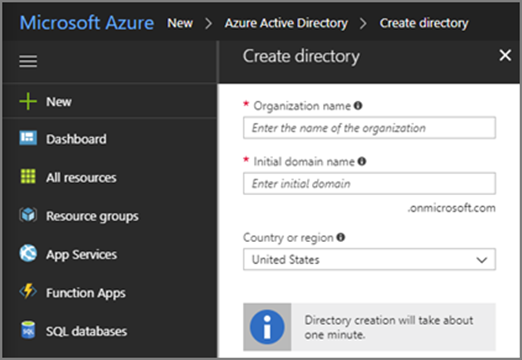
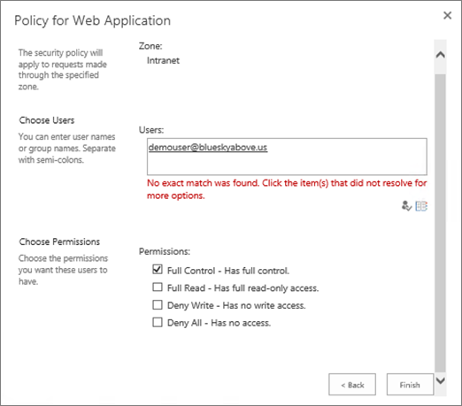

# <a name="using-azure-ad-for-sharepoint-server-authentication"></a>Utiliser Azure AD pour l’authentification SharePoint Server

 **Résumé:** Découvrez comment authentifier vos utilisateurs SharePoint Server 2016 avec Azure Active Directory. 

<blockquote>
<p>Cet article fait référence à des exemples de code pour l’interaction avec Azure Active Directory Graph. Vous pouvez télécharger les exemples de code [ici](https://github.com/kaevans/spsaml11/tree/master/scripts).</p>
</blockquote>

SharePoint Server 2016 offre la possibilité d’authentifier les utilisateurs à l’aide de l’authentification basée sur les revendications, ce qui facilite la gestion de vos utilisateurs en les authentifiant avec différents fournisseurs d’identité que vous approuvez, mais qu’un autre utilisateur gère. Par exemple, au lieu de gérer l’authentification des utilisateurs par le biais des services de domaine Active Directory (AD DS), vous pouvez permettre aux utilisateurs de s’authentifier à l’aide d’Azure Active Directory (Azure AD). Cela permet l’authentification pour les utilisateurs en nuage uniquement avec le suffixe onmicrosoft.com dans leur nom d’utilisateur, les utilisateurs synchronisés avec un annuaire local et les utilisateurs invités à partir d’autres annuaires. Il vous permet également de tirer parti des fonctionnalités Azure AD, telles que l’authentification multifacteur et les fonctionnalités de création de rapports avancées.

> [!IMPORTANT]
> La solution décrite dans cet article peut également être utilisée avec SharePoint Server 2013; Toutefois, gardez à l’esprit que SharePoint Server 2013 approche de la fin du support standard. Pour plus d’informations, voir [stratégie de cycle de vie Microsoft](https://support.microsoft.com/en-us/lifecycle/search?alpha=SharePoint%20Server%202013) et [stratégie de maintenance de produit mise à jour pour SharePoint 2013](https://technet.microsoft.com/library/684173bb-e90a-4eb7-b268-b8d7458bc802(v=office.16).aspx).

Cet article explique comment vous pouvez utiliser Azure AD au lieu de votre service AD DS local pour authentifier vos utilisateurs. Dans cette configuration, Azure AD devient un fournisseur d’identité approuvé pour SharePoint Server 2016. Cette configuration ajoute une méthode d’authentification utilisateur distincte de l’authentification AD DS utilisée par l’installation de SharePoint Server 2016. Pour pouvoir tirer parti de cet article, vous devez connaître WS-Federation. Pour plus d'informations, voir l'article de [présentation de WS-Federation](https://go.microsoft.com/fwlink/p/?linkid=188052). Pour obtenir des informations détaillées sur l’intégration de SharePoint en local avec Azure Active Directory, consultez le [didacticiel dédié](https://docs.microsoft.com/azure/active-directory/saas-apps/sharepoint-on-premises-tutorial).


Auparavant, cette configuration nécessitait un service de Fédération tel que le service de contrôle d’accès Azure (ACS) dans le Cloud ou un environnement qui héberge les services ADFS (Active Directory Federation Services) pour transformer les jetons de SAML 2,0 en SAML 1,1. Cette transformation n’est plus requise car Azure AD permet désormais l’émission de jetons SAML 1,1. Le diagramme ci-dessus illustre le fonctionnement de l’authentification pour les utilisateurs de SharePoint 2016 dans cette configuration, ce qui démontre qu’il n’est plus nécessaire pour un intermédiaire d’effectuer cette transformation.

> [!NOTE]
> Cette configuration fonctionne si la batterie de serveurs SharePoint est hébergée sur des machines virtuelles Azure ou sur site. Il n’est pas nécessaire d’ouvrir des ports de pare-feu supplémentaires autres que le fait de s’assurer que les utilisateurs peuvent accéder à Azure Active Directory depuis leur navigateur.

Pour plus d’informations sur l’accessibilité de SharePoint 2016, consultez la rubrique [Accessibility Guidelines in SharePoint Server 2016](https://go.microsoft.com/fwlink/p/?LinkId=393123).

## <a name="configuration-overview"></a>Vue d’ensemble de la configuration

Suivez les étapes générales suivantes pour configurer votre environnement afin d’utiliser Azure AD en tant que fournisseur d’identité SharePoint Server 2016.

1. Créez un répertoire Azure AD ou utilisez votre répertoire existant.
2. Assurez-vous que la zone de l’application Web que vous souhaitez sécuriser avec Azure AD est configurée pour utiliser le protocole SSL.
3. Créez une application d’entreprise dans Azure AD.
4. Configurez un nouveau fournisseur d’identité approuvé dans SharePoint Server 2016.
5. Définissez les autorisations pour l’application Web.
6. Ajoutez une stratégie d’émission de jetons SAML 1,1 dans Azure AD.
7. Vérifiez le nouveau fournisseur.

Les sections suivantes décrivent comment effectuer ces tâches.

## <a name="step-1-create-a-new-azure-ad-directory-or-use-your-existing-directory"></a>Étape 1: créer un répertoire Azure AD ou utiliser votre répertoire existant

Dans le portail Azure ([https://portal.azure.com](https://portal.azure.com)), créez un répertoire. Indiquez le nom de l’organisation, le nom du domaine initial et le pays ou la région.

 

 Si vous disposez déjà d’un répertoire tel que celui utilisé pour Microsoft Office 365 ou votre abonnement Microsoft Azure, vous pouvez utiliser ce répertoire à la place. Vous devez disposer des autorisations nécessaires pour inscrire les applications dans l’annuaire.

## <a name="step-2-ensure-the-zone-for-the-web-application-that-you-want-to-secure-with-azure-ad-is-configured-to-use-ssl"></a>Étape 2: Assurez-vous que la zone de l’application Web que vous souhaitez sécuriser avec Azure AD est configurée pour utiliser le protocole SSL

Cet article a été écrit à l’aide de l’architecture de référence dans [exécuter une batterie de serveurs SharePoint Server 2016 à haute disponibilité dans Azure](https://docs.microsoft.com/en-us/azure/architecture/reference-architectures/sharepoint). Les scripts d’accompagnement de l’article utilisés pour déployer la solution décrite dans [cet article](https://docs.microsoft.com/en-us/azure/architecture/reference-architectures/sharepoint) créent un site qui n’utilise pas le protocole SSL.  

L’utilisation de SAML nécessite que l’application soit configurée pour utiliser le protocole SSL. Si votre application Web SharePoint n’est pas configurée pour utiliser le protocole SSL, procédez comme suit pour créer un certificat auto-signé afin de configurer l’application Web pour SSL. Cette configuration est uniquement destinée à un environnement de laboratoire et n’est pas destinée à la production. Les environnements de production doivent utiliser un certificat signé.

1. Accédez à**gestion** > des applications de l' **administration** > centrale et**Gérez les applications Web**, puis choisissez l’application Web qui doit être étendue pour utiliser SSL. Sélectionnez l’application Web et cliquez sur le bouton **étendre le ruban** . Étendez l’application Web pour utiliser la même URL, mais utilisez SSL avec le port 443.<br/><br/>
2. Dans le Gestionnaire des services Internet (IIS), double-cliquez sur **Certificats de serveur**.
3. Dans le volet **Actions**, cliquez sur **Créer un certificat auto-signé**. Saisissez un nom convivial pour le certificat dans la case Indiquer un nom convivial pour le certificat, puis cliquez sur **OK**.
4. Dans la boîte de dialogue **modifier la liaison de sites** , vérifiez que le nom d’hôte est le même que le nom convivial, comme illustré dans l’image suivante.<br/><br/>

Chacun des serveurs Web frontaux de la batterie de serveurs SharePoint requiert la configuration du certificat pour la liaison de sites dans IIS.


## <a name="step-3-create-a-new-enterprise-application-in-azure-ad"></a>Étape 3: créer une nouvelle application d’entreprise dans Azure AD

1. Dans le portail Azure ([https://portal.azure.com](https://portal.azure.com)), ouvrez votre répertoire Azure ad. Cliquez sur **applications d’entreprise**, puis sur **nouvelle application**. Choisissez **application non-Galerie**. Fournissez un nom tel que *intégration SAML SharePoint* , puis cliquez sur **Ajouter**.<br/><br/>
2. Cliquez sur le lien authentification unique dans le volet de navigation pour configurer l’application. Remplacez la liste déroulante **en mode d’authentification unique** par l' **authentification basée sur SAML** pour afficher les propriétés de configuration SAML de l’application. Configurez avec les propriétés suivantes:<br/>
    - Identificateur`urn:sharepoint:portal.contoso.local`
    - URL de réponse:`https://portal.contoso.local/_trust/default.aspx`
    - URL de connexion:`https://portal.contoso.local/_trust/default.aspx`
    - Identificateur de l’utilisateur:`user.userprincipalname`<br/>
    - Remarque: n’oubliez pas de modifier les URL en remplaçant *Portal. contoso. local* par l’URL du site SharePoint que vous souhaitez sécuriser.<br/>
3. Configurez un tableau (semblable au tableau 1 ci-dessous) qui inclut les lignes suivantes:<br/> 
    - Realm
    - Chemin d’accès complet au fichier de certificat de signature SAML
    - URL du service d’authentification unique SAML (en remplaçant */Saml2* par */WSFED*)
    - ID d’objet d’application. <br/>
Copiez la valeur de l' *identificateur* dans la propriété *Realm* dans un tableau (voir le tableau 1 ci-dessous.)
4. Enregistrez vos modifications.
5. Cliquez sur le lien **configurer (nom de l’application)** pour accéder à la page de configuration de l’authentification.<br/><br/> 
    -  Cliquez sur le lien **certificat de signature SAML-RAW** pour télécharger le certificat de signature SAML sous la forme d’un fichier avec l’extension. cer. Copiez et collez le chemin d’accès complet au fichier téléchargé dans votre table.
    - Copiez et collez le lien de l’URL du service d’authentification unique SAML dans votre, en remplaçant la partie */Saml2* de l’URL par */WSFED*.<br/>
6.  Accédez au volet des **Propriétés** de l’application. Copiez et collez la valeur de l’ID d’objet dans le tableau que vous avez configuré à l’étape 3.<br/><br/>
7. À l’aide des valeurs que vous avez capturées, vérifiez que le tableau que vous avez configuré à l’étape 3 ressemble au tableau 1 ci-dessous.


| Tableau 1: valeurs capturées  |  |
|---------|---------|
|Realm | `urn:sharepoint:portal.contoso.local` |
|Chemin d’accès complet au fichier de certificat de signature SAML | `C:/temp/SharePoint SAML Integration.cer`  |
|URL du service d’authentification unique SAML (remplacez/Saml2 par/WSFED) | `https://login.microsoftonline.com/b1726649-b616-460d-8d20-defab80d476c/wsfed` |
|ID d’objet d’application | `a812f48b-d1e4-4c8e-93be-e4808c8ca3ac` |

> [!IMPORTANT]
> Remplacez la valeur */Saml2* dans l’URL par */WSFED*. Le point de terminaison */Saml2* traitera les jetons SAML 2,0. Le point de terminaison */WSFED* permet le traitement des jetons SAML 1,1 et est requis pour la fédération SAML 2016 de SharePoint.

## <a name="step-4-configure-a-new-trusted-identity-provider-in-sharepoint-server-2016"></a>Étape 4: configurer un nouveau fournisseur d’identité approuvé dans SharePoint Server 2016

Connectez-vous au serveur SharePoint Server 2016 et ouvrez SharePoint 2016 Management Shell. Renseignez les valeurs des $realm, $wsfedurl et $filepath du tableau 1 et exécutez les commandes suivantes pour configurer un nouveau fournisseur d’identité approuvé.

> [!TIP]
> Si vous débutez avec PowerShell ou si vous souhaitez en savoir plus sur le fonctionnement de PowerShell, consultez la rubrique [SharePoint PowerShell](https://docs.microsoft.com/en-us/powershell/sharepoint/overview?view=sharepoint-ps). 

```
$realm = "<Realm from Table 1>"
$wsfedurl="<SAML single sign-on service URL from Table 1>"
$filepath="<Full path to SAML signing certificate file from Table 1>"
$cert = New-Object System.Security.Cryptography.X509Certificates.X509Certificate2($filepath)
New-SPTrustedRootAuthority -Name "AzureAD" -Certificate $cert
$map = New-SPClaimTypeMapping -IncomingClaimType "http://schemas.xmlsoap.org/ws/2005/05/identity/claims/name" -IncomingClaimTypeDisplayName "name" -LocalClaimType "http://schemas.xmlsoap.org/ws/2005/05/identity/claims/upn"
$map2 = New-SPClaimTypeMapping -IncomingClaimType "http://schemas.xmlsoap.org/ws/2005/05/identity/claims/givenname" -IncomingClaimTypeDisplayName "GivenName" -SameAsIncoming
$map3 = New-SPClaimTypeMapping -IncomingClaimType "http://schemas.xmlsoap.org/ws/2005/05/identity/claims/surname" -IncomingClaimTypeDisplayName "SurName" -SameAsIncoming
$ap = New-SPTrustedIdentityTokenIssuer -Name "AzureAD" -Description "SharePoint secured by Azure AD" -realm $realm -ImportTrustCertificate $cert -ClaimsMappings $map,$map2,$map3 -SignInUrl $wsfedurl -IdentifierClaim "http://schemas.xmlsoap.org/ws/2005/05/identity/claims/name"
```

Ensuite, procédez comme suit pour activer le fournisseur d’identité approuvé pour votre application:
1. Dans l’administration centrale, accédez à **gérer l’application Web** et sélectionnez l’application Web que vous souhaitez sécuriser avec Azure ad. 
2. Dans le ruban, cliquez sur **fournisseurs d’authentification** et sélectionnez la zone que vous souhaitez utiliser.
3. Sélectionnez **fournisseur d’identité approuvé** et sélectionnez le fournisseur que vous venez d’enregistrer nommé *AzureAD*.  
4. Dans le paramètre URL de la page de connexion, sélectionnez **page de connexion personnalisée** et indiquez la valeur «/_trust/». 
5. Cliquez sur **OK**.


> [!IMPORTANT]
> Il est important de suivre toutes les étapes, y compris la définition de la page de connexion personnalisée sur «/_trust/» comme illustré. La configuration ne fonctionnera pas correctement sauf si toutes les étapes sont suivies.

## <a name="step-5-set-the-permissions"></a>Étape 5: définir les autorisations

Les utilisateurs qui se connectent à Azure AD et Access SharePoint doivent disposer d’un accès à l’application. 

1. Dans le portail Azure, ouvrez le répertoire Azure AD. Cliquez sur **applications d’entreprise**, puis sur **toutes les applications**. Cliquez sur l’application que vous avez créée précédemment (intégration SAML SharePoint).
2. Cliquez sur **utilisateurs et groupes**. 
3. Cliquez sur **Ajouter un utilisateur** pour ajouter un utilisateur ou un groupe qui dispose des autorisations nécessaires pour se connecter à SharePoint à l’aide d’Azure ad.
4. Sélectionnez l’utilisateur ou le groupe, puis cliquez sur **attribuer**.
 
L’autorisation a été accordée à l’utilisateur dans Azure AD, mais il faut également lui accorder une autorisation dans SharePoint. Procédez comme suit pour définir les autorisations pour accéder à l’application web.

1. Dans l'Administration centrale, cliquez sur **Gestion des applications**.
2. Dans la section **Applications web** de la page **Gestion des applications**, cliquez sur **Gérer les applications web**.
3. Cliquez sur l'application web appropriée, puis sur **Stratégie de l'utilisateur**.
4. Dans stratégie de l’application Web, cliquez sur **Ajouter des utilisateurs**.<br/><br/>
5. Dans la boîte de dialogue **Ajouter des utilisateurs**, cliquez sur la zone appropriée dans **Zones**, puis sur **Suivant**.
6. Dans la boîte de dialogue **stratégie de l’application Web** , dans la section **choisir les utilisateurs** , cliquez sur l’icône **Parcourir** .
7. Dans la zone de texte **Rechercher** , tapez le nom de connexion d’un utilisateur dans votre répertoire, puis cliquez sur **Rechercher**. <br/>Exemple: *demouser@blueskyabove.onmicrosoft.com*.
8. Sous l’en-tête AzureAD dans l’affichage de liste, sélectionnez la propriété Name, puis cliquez sur **Ajouter** , puis cliquez sur **OK** pour fermer la boîte de dialogue.
9. Dans autorisations, cliquez sur **contrôle total**.<br/><br/>
10. Cliquez sur **Terminer**, puis sur **OK**.

## <a name="step-6-add-a-saml-11-token-issuance-policy-in-azure-ad"></a>Étape 6: ajouter une stratégie d’émission de jetons SAML 1,1 dans Azure AD

Lorsque l’application Azure AD est créée sur le portail, elle utilise par défaut SAML 2,0. SharePoint Server 2016 nécessite le format de jeton SAML 1,1. Le script suivant supprime la stratégie SAML 2,0 par défaut et ajoute une nouvelle stratégie pour émettre des jetons SAML 1,1. 

> Ce code nécessite le téléchargement des [exemples associés illustrant l’interaction avec Azure Active Directory Graph](https://github.com/kaevans/spsaml11/tree/master/scripts). Si vous téléchargez les scripts sous forme de fichier ZIP à partir de GitHub vers un bureau Windows, veillez `MSGraphTokenLifetimePolicy.psm1` à débloquer le fichier `Initialize.ps1` de module de script et le fichier de script (cliquez avec le bouton droit sur Propriétés, choisissez débloquer, puis cliquez sur OK). 


Une fois l’exemple de script téléchargé, créez un script PowerShell à l’aide du code suivant, en remplaçant l’espace réservé par le chemin `Initialize.ps1` d’accès au fichier téléchargé sur votre ordinateur local. Remplacez l’espace réservé de l’ID d’application par l’ID d’objet d’application que vous avez entré dans le tableau 1. Une fois le script PowerShell créé, exécutez-le. 

```
function AssignSaml11PolicyToAppPrincipal
{
    Param(
        [Parameter(Mandatory=$true)]
        [string]$pathToInitializeScriptFile, 
        [Parameter(Mandatory=$true)]
        [string]$appObjectid
    )

    $folder = Split-Path $pathToInitializeScriptFile
    Push-Location $folder

    #Loads the dependent ADAL module used to acquire tokens
    Import-Module $pathToInitializeScriptFile 

    #Gets the existing token issuance policy
    $existingTokenIssuancePolicy = Get-PoliciesAssignedToServicePrincipal -servicePrincipalId $appObjectid | ?{$_.type -EQ "TokenIssuancePolicy"} 
    Write-Host "The following TokenIssuancePolicy policies are assigned to the service principal." -ForegroundColor Green
    Write-Host $existingTokenIssuancePolicy -ForegroundColor White
    $policyId = $existingTokenIssuancePolicy.objectId

    #Removes existing token issuance policy
    Write-Host "Only a single policy can be assigned to the service principal. Removing the existing policy with ID $policyId" -ForegroundColor Green
    Remove-PolicyFromServicePrincipal -policyId $policyId -servicePrincipalId $appObjectid

    #Creates a new token issuance policy and assigns to the service principal
    Write-Host "Adding the new SAML 1.1 TokenIssuancePolicy" -ForegroundColor Green
    $policy = Add-TokenIssuancePolicy -DisplayName SPSAML11 -SigningAlgorithm "http://www.w3.org/2001/04/xmldsig-more#rsa-sha256" -TokenResponseSigningPolicy TokenOnly -SamlTokenVersion "1.1"
    Write-Host "Assigning the new SAML 1.1 TokenIssuancePolicy $policy.objectId to the service principal $appObjectid" -ForegroundColor Green
    Set-PolicyToServicePrincipal -policyId $policy.objectId -servicePrincipalId $appObjectid
    Pop-Location
}

#Only edit the following two variables
$pathToInitializeScriptFile = "<file path of Initialize.ps1>"
$appObjectid = "<Application Object ID from Table 1>"

AssignSaml11PolicyToAppPrincipal $pathToInitializeScriptFile $appObjectid
```
> [!IMPORTANT]
> Les scripts PowerShell ne sont pas signés et vous pouvez être invité à définir la stratégie d’exécution. Pour plus d’informations sur les stratégies d’exécution, consultez la rubrique [à propos des stratégies d’exécution](http://go.microsoft.com/fwlink/?LinkID=135170). En outre, vous devrez peut-être ouvrir une invite de commandes avec élévation de privilèges pour exécuter correctement les commandes contenues dans les exemples de scripts.

Ces exemples de commandes PowerShell sont des exemples d’exécution de requêtes sur l’API Graph. Pour plus d’informations sur les stratégies d’émission de jetons avec Azure AD, voir la [référence de l’API Graph pour les opérations sur la stratégie](https://msdn.microsoft.com/en-us/library/azure/ad/graph/api/policy-operations#create-a-policy).

## <a name="step-7-verify-the-new-provider"></a>Étape 7: vérifier le nouveau fournisseur

Ouvrez un navigateur vers l’URL de l’application Web que vous avez configurée dans les étapes précédentes. Vous êtes redirigé pour vous connecter à Azure AD.


Le système vous demande si vous souhaitez rester connecté.


Enfin, vous pouvez accéder au site connecté en tant qu’utilisateur à partir de votre client Azure Active Directory.


## <a name="managing-certificates"></a>Gestion des certificats
Il est important de comprendre que le certificat de signature qui a été configuré pour le fournisseur d’identité approuvé à l’étape 4 ci-dessus a une date d’expiration et doit être renouvelé. Consultez l’article [Manage Certificates for Federated Single Sign-on in Azure Active Directory](https://docs.microsoft.com/en-us/azure/active-directory/active-directory-sso-certs) pour plus d’informations sur le renouvellement de certificat. Une fois que le certificat a été renouvelé dans Azure AD, téléchargez-le vers un fichier local et utilisez le script suivant pour configurer le fournisseur d’identité approuvé avec le certificat de signature renouvelé. 

```
$filepath="<Full path to renewed SAML signing certificate file>"
$cert= New-Object System.Security.Cryptography.X509Certificates.X509Certificate2($filePath)
New-SPTrustedRootAuthority -Name "AzureAD" -Certificate $cert
Get-SPTrustedIdentityTokenIssuer "AzureAD" | Set-SPTrustedIdentityTokenIssuer -ImportTrustCertificate $cert
```
## <a name="configuring-one-trusted-identity-provider-for-multiple-web-applications"></a>Configuration d’un fournisseur d’identité approuvé pour plusieurs applications Web
La configuration fonctionne pour une seule application Web, mais nécessite une configuration supplémentaire si vous envisagez d’utiliser le même fournisseur d’identité approuvé pour plusieurs applications Web. Par exemple, supposons que nous avions étendu une application Web pour utiliser `https://portal.contoso.local` l’URL et que vous souhaitiez maintenant `https://sales.contoso.local` authentifier les utilisateurs également. Pour ce faire, nous devons mettre à jour le fournisseur d’identité pour honorer le paramètre WReply et mettre à jour l’inscription de l’application dans Azure AD pour ajouter une URL de réponse.

1. Dans le portail Azure, ouvrez le répertoire Azure AD. Cliquez sur **inscriptions**des applications, puis sur **afficher toutes les applications**. Cliquez sur l’application que vous avez créée précédemment (intégration SAML SharePoint).
2. Cliquez sur **paramètres**.
3. Dans le panneau Paramètres, cliquez sur **URL de réponse**. 
4. Ajoutez l’URL de l’application Web supplémentaire en `/_trust/default.aspx` ajoutant à l’URL (par exemple `https://sales.contoso.local/_trust/default.aspx`), puis cliquez sur **Enregistrer**. 
5. Sur le serveur SharePoint, ouvrez **sharepoint 2016 Management Shell** et exécutez les commandes suivantes, en utilisant le nom de l’émetteur de jeton d’identité approuvé que vous avez utilisé précédemment.

```
$t = Get-SPTrustedIdentityTokenIssuer "AzureAD"
$t.UseWReplyParameter=$true
$t.Update()
```
6. Dans l’administration centrale, accédez à l’application Web et activez le fournisseur d’identité approuvé existant. N’oubliez pas de configurer également l’URL de la page de connexion en tant que `/_trust/`page de connexion personnalisée.
7. Dans l’administration centrale, cliquez sur l’application Web, puis choisissez **stratégie utilisateur**. Ajoutez un utilisateur avec les autorisations appropriées comme indiqué précédemment dans cet article.

## <a name="fixing-people-picker"></a>Correction du sélecteur de personnes
Les utilisateurs peuvent désormais se connecter à SharePoint 2016 à l’aide d’identités à partir d’Azure AD, mais il existe toujours des occasions d’améliorer l’expérience utilisateur. Par exemple, la recherche d’un utilisateur présente plusieurs résultats de recherche dans le sélecteur de personnes. Il existe un résultat de recherche pour chacun des trois types de revendication créés dans le mappage de revendications. Pour choisir un utilisateur à l’aide du sélecteur de personnes, vous devez taper son nom d’utilisateur exactement et choisir le résultat de la revendication de **nom** .


Il n’existe aucune validation sur les valeurs que vous recherchez, qui peuvent entraîner des fautes d’orthographe ou des utilisateurs choisissant accidentellement un type de revendication incorrect **** pour affecter la revendication Surname. Cela peut empêcher les utilisateurs d’accéder aux ressources.

Pour faciliter ce scénario, il existe une solution open source appelée [AzureCP](https://yvand.github.io/AzureCP/) qui fournit un fournisseur de revendications personnalisées pour SharePoint 2016. Il utilisera Azure AD Graph pour résoudre ce que les utilisateurs entrent et effectuent la validation. Pour plus d’informations, consultez la rubrique [AzureCP](https://yvand.github.io/AzureCP/). 

## <a name="additional-resources"></a>Ressources supplémentaires

[Présentation de WS-Federation](https://go.microsoft.com/fwlink/p/?linkid=188052)
  
[Adoption du cloud et solutions hybrides](cloud-adoption-and-hybrid-solutions.md)
  
## <a name="join-the-discussion"></a>Participer à la discussion

|**Contactez-nous**|**Description**|
|:-----|:-----|
|**De quelles solutions avez-vous besoin ?** <br/> |Nous sommes en train de créer du contenu pour les solutions qui s'étendent sur plusieurs produits et services Microsoft. Donnez-nous votre avis sur nos solutions entre serveurs ou demandez des solutions spécifiques en envoyant un courrier électronique à [MODAcontent@microsoft.com](mailto:cloudadopt@microsoft.com?Subject=[Cloud%20Adoption%20Content%20Feedback]:%20).<br/> |
|**Participer à la discussion sur les solutions** <br/> |Si vous êtes passionné par les solutions basées sur le cloud, rejoignez le conseil consultatif de l’adoption cloud (CAAB) pour interagir avec une communauté vaste et dynamique de développeurs de contenu Microsoft, de professionnels du secteur et de clients venant du monde entier. Pour participer, ajoutez-vous en tant que membre de l’espace [CAAB (Conseil consultatif de l’adoption cloud)](https://aka.ms/caab) de la communauté Microsoft Tech et envoyez-nous un message électronique à l’adresse [CAAB@microsoft.com](mailto:caab@microsoft.com?Subject=I%20just%20joined%20the%20Cloud%20Adoption%20Advisory%20Board!). Tout le monde peut lire le contenu lié à la communauté sur le [blog CAAB](https://blogs.technet.com/b/solutions_advisory_board/). Toutefois, les membres CAAB reçoivent des invitations à des webinaires privés qui décrivent les nouvelles solutions et ressources relatives à l’adoption cloud.<br/> |
|**Obtenir l'image que vous voyez ici** <br/> |Si vous voulez obtenir une copie modifiable de l’image que vous voyez dans cet article, nous serons ravis de vous l’envoyer. Envoyez-nous votre demande par courrier électronique, en incluant l’URL et le titre de l’illustration, à [cloudadopt@microsoft.com](mailto:cloudadopt@microsoft.com?subject=[Art%20Request]:%20).<br/> |
   

