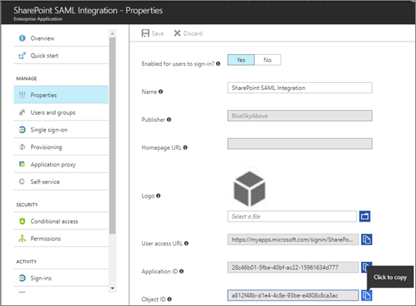

# <a name="using-azure-ad-for-sharepoint-server-authentication"></a><span data-ttu-id="df22c-103">Utiliser Azure AD pour l’authentification SharePoint Server</span><span class="sxs-lookup"><span data-stu-id="df22c-103">Using Azure AD for SharePoint Server Authentication</span></span>

 <span data-ttu-id="df22c-104">**Résumé:** Découvrez comment authentifier vos utilisateurs SharePoint Server 2016 avec Azure Active Directory.</span><span class="sxs-lookup"><span data-stu-id="df22c-104">**Summary:** Learn how to authenticate your SharePoint Server 2016 users with Azure Active Directory.</span></span> 

<blockquote>
<p><span data-ttu-id="df22c-105">Cet article fait référence à des exemples de code pour l’interaction avec Azure Active Directory Graph.</span><span class="sxs-lookup"><span data-stu-id="df22c-105">This article refers to code samples for interacting with Azure Active Directory Graph.</span></span> <span data-ttu-id="df22c-106">Vous pouvez télécharger les exemples de code [ici](https://github.com/kaevans/spsaml11/tree/master/scripts).</span><span class="sxs-lookup"><span data-stu-id="df22c-106">You can download the code samples [here](https://github.com/kaevans/spsaml11/tree/master/scripts).</span></span></p>
</blockquote>

<span data-ttu-id="df22c-107">SharePoint Server 2016 offre la possibilité d’authentifier les utilisateurs à l’aide de l’authentification basée sur les revendications, ce qui facilite la gestion de vos utilisateurs en les authentifiant avec différents fournisseurs d’identité que vous approuvez, mais qu’un autre utilisateur gère.</span><span class="sxs-lookup"><span data-stu-id="df22c-107">SharePoint Server 2016 provides the ability to authenticate users using claims-based authentication, making it easy to manage your users by authenticating them with different identity providers that you trust but someone else manages.</span></span> <span data-ttu-id="df22c-108">Par exemple, au lieu de gérer l’authentification des utilisateurs par le biais des services de domaine Active Directory (AD DS), vous pouvez permettre aux utilisateurs de s’authentifier à l’aide d’Azure Active Directory (Azure AD).</span><span class="sxs-lookup"><span data-stu-id="df22c-108">For example, instead of managing user authentication through Active Directory Domain Services (AD DS), you could enable users to authenticate using Azure Active Directory (Azure AD).</span></span> <span data-ttu-id="df22c-109">Cela permet l’authentification pour les utilisateurs en nuage uniquement avec le suffixe onmicrosoft.com dans leur nom d’utilisateur, les utilisateurs synchronisés avec un annuaire local et les utilisateurs invités à partir d’autres annuaires.</span><span class="sxs-lookup"><span data-stu-id="df22c-109">This enables authentication for cloud-only users with the onmicrosoft.com suffix in their username, users synchronized with an on-premises directory, and invited guest users from other directories.</span></span> <span data-ttu-id="df22c-110">Il vous permet également de tirer parti des fonctionnalités Azure AD, telles que l’authentification multifacteur et les fonctionnalités de création de rapports avancées.</span><span class="sxs-lookup"><span data-stu-id="df22c-110">It also enables you to take advantage of Azure AD features such as multi-factor authentication and advanced reporting capabilities.</span></span>

> [!IMPORTANT]
> <span data-ttu-id="df22c-111">La solution décrite dans cet article peut également être utilisée avec SharePoint Server 2013; Toutefois, gardez à l’esprit que SharePoint Server 2013 approche de la fin du support standard.</span><span class="sxs-lookup"><span data-stu-id="df22c-111">The solution described in this article can also be used with SharePoint Server 2013; however, keep in mind that SharePoint Server 2013 is nearing the end of mainstream support.</span></span> <span data-ttu-id="df22c-112">Pour plus d’informations, voir [stratégie de cycle de vie Microsoft](https://support.microsoft.com/en-us/lifecycle/search?alpha=SharePoint%20Server%202013) et [stratégie de maintenance de produit mise à jour pour SharePoint 2013](https://technet.microsoft.com/library/684173bb-e90a-4eb7-b268-b8d7458bc802(v=office.16).aspx).</span><span class="sxs-lookup"><span data-stu-id="df22c-112">For more information, see [Microsoft Lifecycle Policy](https://support.microsoft.com/en-us/lifecycle/search?alpha=SharePoint%20Server%202013) and [Updated Product Servicing Policy for SharePoint 2013](https://technet.microsoft.com/library/684173bb-e90a-4eb7-b268-b8d7458bc802(v=office.16).aspx).</span></span>

<span data-ttu-id="df22c-113">Cet article explique comment vous pouvez utiliser Azure AD au lieu de votre service AD DS local pour authentifier vos utilisateurs.</span><span class="sxs-lookup"><span data-stu-id="df22c-113">This article explains how you can use Azure AD instead of your on-premises AD DS to authenticate your users.</span></span> <span data-ttu-id="df22c-114">Dans cette configuration, Azure AD devient un fournisseur d’identité approuvé pour SharePoint Server 2016.</span><span class="sxs-lookup"><span data-stu-id="df22c-114">In this configuration, Azure AD becomes a trusted identity provider for SharePoint Server 2016.</span></span> <span data-ttu-id="df22c-115">Cette configuration ajoute une méthode d’authentification utilisateur distincte de l’authentification AD DS utilisée par l’installation de SharePoint Server 2016.</span><span class="sxs-lookup"><span data-stu-id="df22c-115">This configuration adds a user authentication method that is separate from the AD DS authentication used by the SharePoint Server 2016 installation itself.</span></span> <span data-ttu-id="df22c-116">Pour pouvoir tirer parti de cet article, vous devez connaître WS-Federation.</span><span class="sxs-lookup"><span data-stu-id="df22c-116">To benefit from this article, you should be familiar with WS-Federation.</span></span> <span data-ttu-id="df22c-117">Pour plus d'informations, voir l'article de [présentation de WS-Federation](https://go.microsoft.com/fwlink/p/?linkid=188052).</span><span class="sxs-lookup"><span data-stu-id="df22c-117">For more information, see [Understanding WS-Federation](https://go.microsoft.com/fwlink/p/?linkid=188052).</span></span> <span data-ttu-id="df22c-118">Pour obtenir des informations détaillées sur l’intégration de SharePoint en local avec Azure Active Directory, consultez le [didacticiel dédié](https://docs.microsoft.com/azure/active-directory/saas-apps/sharepoint-on-premises-tutorial).</span><span class="sxs-lookup"><span data-stu-id="df22c-118">For detailed information about integration of SharePoint on-premises with Azure Active Directory, see the [dedicated tutorial](https://docs.microsoft.com/azure/active-directory/saas-apps/sharepoint-on-premises-tutorial).</span></span>


<span data-ttu-id="df22c-120">Auparavant, cette configuration nécessitait un service de Fédération tel que le service de contrôle d’accès Azure (ACS) dans le Cloud ou un environnement qui héberge les services ADFS (Active Directory Federation Services) pour transformer les jetons de SAML 2,0 en SAML 1,1.</span><span class="sxs-lookup"><span data-stu-id="df22c-120">Previously, this configuration would have required a federation service such as Azure Access Control Service (ACS) in the cloud or an environment that hosts Active Directory Federation Services (AD FS) to transform tokens from SAML 2.0 to SAML 1.1.</span></span> <span data-ttu-id="df22c-121">Cette transformation n’est plus requise car Azure AD permet désormais l’émission de jetons SAML 1,1.</span><span class="sxs-lookup"><span data-stu-id="df22c-121">This transformation is no longer required as Azure AD now enables issuing SAML 1.1 tokens.</span></span> <span data-ttu-id="df22c-122">Le diagramme ci-dessus illustre le fonctionnement de l’authentification pour les utilisateurs de SharePoint 2016 dans cette configuration, ce qui démontre qu’il n’est plus nécessaire pour un intermédiaire d’effectuer cette transformation.</span><span class="sxs-lookup"><span data-stu-id="df22c-122">The diagram above shows how authentication works for SharePoint 2016 users in this configuration, demonstrating that there is no longer a requirement for an intermediary to perform this transformation.</span></span>

> [!NOTE]
> <span data-ttu-id="df22c-123">Cette configuration fonctionne si la batterie de serveurs SharePoint est hébergée sur des machines virtuelles Azure ou sur site.</span><span class="sxs-lookup"><span data-stu-id="df22c-123">This configuration works whether the SharePoint farm is hosted in Azure virtual machines or on-premises.</span></span> <span data-ttu-id="df22c-124">Il n’est pas nécessaire d’ouvrir des ports de pare-feu supplémentaires autres que le fait de s’assurer que les utilisateurs peuvent accéder à Azure Active Directory depuis leur navigateur.</span><span class="sxs-lookup"><span data-stu-id="df22c-124">It does not require opening additional firewall ports other than ensuring users can access Azure Active Directory from their browser.</span></span>

<span data-ttu-id="df22c-125">Pour plus d’informations sur l’accessibilité de SharePoint 2016, consultez la rubrique [Accessibility Guidelines in SharePoint Server 2016](https://go.microsoft.com/fwlink/p/?LinkId=393123).</span><span class="sxs-lookup"><span data-stu-id="df22c-125">For information about SharePoint 2016 accessibility, see [Accessibility Guidelines in SharePoint Server 2016](https://go.microsoft.com/fwlink/p/?LinkId=393123).</span></span>

## <a name="configuration-overview"></a><span data-ttu-id="df22c-126">Vue d’ensemble de la configuration</span><span class="sxs-lookup"><span data-stu-id="df22c-126">Configuration overview</span></span>

<span data-ttu-id="df22c-127">Suivez les étapes générales suivantes pour configurer votre environnement afin d’utiliser Azure AD en tant que fournisseur d’identité SharePoint Server 2016.</span><span class="sxs-lookup"><span data-stu-id="df22c-127">Follow these general steps to set up your environment to use Azure AD as a SharePoint Server 2016 identity provider.</span></span>

1. <span data-ttu-id="df22c-128">Créez un répertoire Azure AD ou utilisez votre répertoire existant.</span><span class="sxs-lookup"><span data-stu-id="df22c-128">Create a new Azure AD directory or use your existing directory.</span></span>
2. <span data-ttu-id="df22c-129">Assurez-vous que la zone de l’application Web que vous souhaitez sécuriser avec Azure AD est configurée pour utiliser le protocole SSL.</span><span class="sxs-lookup"><span data-stu-id="df22c-129">Ensure the zone for the web application that you want to secure with Azure AD is configured to use SSL.</span></span>
3. <span data-ttu-id="df22c-130">Créez une application d’entreprise dans Azure AD.</span><span class="sxs-lookup"><span data-stu-id="df22c-130">Create a new enterprise application in Azure AD.</span></span>
4. <span data-ttu-id="df22c-131">Configurez un nouveau fournisseur d’identité approuvé dans SharePoint Server 2016.</span><span class="sxs-lookup"><span data-stu-id="df22c-131">Configure a new trusted identity provider in SharePoint Server 2016.</span></span>
5. <span data-ttu-id="df22c-132">Définissez les autorisations pour l’application Web.</span><span class="sxs-lookup"><span data-stu-id="df22c-132">Set the permissions for the web application.</span></span>
6. <span data-ttu-id="df22c-133">Ajoutez une stratégie d’émission de jetons SAML 1,1 dans Azure AD.</span><span class="sxs-lookup"><span data-stu-id="df22c-133">Add a SAML 1.1 token issuance policy in Azure AD.</span></span>
7. <span data-ttu-id="df22c-134">Vérifiez le nouveau fournisseur.</span><span class="sxs-lookup"><span data-stu-id="df22c-134">Verify the new provider.</span></span>

<span data-ttu-id="df22c-135">Les sections suivantes décrivent comment effectuer ces tâches.</span><span class="sxs-lookup"><span data-stu-id="df22c-135">The following sections describe how to perform these tasks.</span></span>

## <a name="step-1-create-a-new-azure-ad-directory-or-use-your-existing-directory"></a><span data-ttu-id="df22c-136">Étape 1: créer un répertoire Azure AD ou utiliser votre répertoire existant</span><span class="sxs-lookup"><span data-stu-id="df22c-136">Step 1: Create a new Azure AD directory or use your existing directory</span></span>

<span data-ttu-id="df22c-137">Dans le portail Azure ([https://portal.azure.com](https://portal.azure.com)), créez un répertoire.</span><span class="sxs-lookup"><span data-stu-id="df22c-137">In the Azure Portal ([https://portal.azure.com](https://portal.azure.com)), create a new directory.</span></span> <span data-ttu-id="df22c-138">Indiquez le nom de l’organisation, le nom du domaine initial et le pays ou la région.</span><span class="sxs-lookup"><span data-stu-id="df22c-138">Provide the organization name, initial domain name, and the country or region.</span></span>

 

 <span data-ttu-id="df22c-140">Si vous disposez déjà d’un répertoire tel que celui utilisé pour Microsoft Office 365 ou votre abonnement Microsoft Azure, vous pouvez utiliser ce répertoire à la place.</span><span class="sxs-lookup"><span data-stu-id="df22c-140">If you already have a directory such as the one used for Microsoft Office 365 or your Microsoft Azure subscription, you can use that directory instead.</span></span> <span data-ttu-id="df22c-141">Vous devez disposer des autorisations nécessaires pour inscrire les applications dans l’annuaire.</span><span class="sxs-lookup"><span data-stu-id="df22c-141">You must have permissions to register applications in the directory.</span></span>

## <a name="step-2-ensure-the-zone-for-the-web-application-that-you-want-to-secure-with-azure-ad-is-configured-to-use-ssl"></a><span data-ttu-id="df22c-142">Étape 2: Assurez-vous que la zone de l’application Web que vous souhaitez sécuriser avec Azure AD est configurée pour utiliser le protocole SSL</span><span class="sxs-lookup"><span data-stu-id="df22c-142">Step 2: Ensure the zone for the web application that you want to secure with Azure AD is configured to use SSL</span></span>

<span data-ttu-id="df22c-143">Cet article a été écrit à l’aide de l’architecture de référence dans [exécuter une batterie de serveurs SharePoint Server 2016 à haute disponibilité dans Azure](https://docs.microsoft.com/en-us/azure/architecture/reference-architectures/sharepoint).</span><span class="sxs-lookup"><span data-stu-id="df22c-143">This article was written using the reference architecture in [Run a high availability SharePoint Server 2016 farm in Azure](https://docs.microsoft.com/en-us/azure/architecture/reference-architectures/sharepoint).</span></span> <span data-ttu-id="df22c-144">Les scripts d’accompagnement de l’article utilisés pour déployer la solution décrite dans [cet article](https://docs.microsoft.com/en-us/azure/architecture/reference-architectures/sharepoint) créent un site qui n’utilise pas le protocole SSL.</span><span class="sxs-lookup"><span data-stu-id="df22c-144">The article’s accompanying scripts used to deploy the solution described in [this article](https://docs.microsoft.com/en-us/azure/architecture/reference-architectures/sharepoint) create a site that does not use SSL.</span></span>  

<span data-ttu-id="df22c-145">L’utilisation de SAML nécessite que l’application soit configurée pour utiliser le protocole SSL.</span><span class="sxs-lookup"><span data-stu-id="df22c-145">Using SAML requires the application be configured to use SSL.</span></span> <span data-ttu-id="df22c-146">Si votre application Web SharePoint n’est pas configurée pour utiliser le protocole SSL, procédez comme suit pour créer un certificat auto-signé afin de configurer l’application Web pour SSL.</span><span class="sxs-lookup"><span data-stu-id="df22c-146">If your SharePoint web application is not configured to use SSL, use the following steps to create a new self-signed certificate to configure the web application for SSL.</span></span> <span data-ttu-id="df22c-147">Cette configuration est uniquement destinée à un environnement de laboratoire et n’est pas destinée à la production.</span><span class="sxs-lookup"><span data-stu-id="df22c-147">This configuration is only meant for a lab environment and is not intended for production.</span></span> <span data-ttu-id="df22c-148">Les environnements de production doivent utiliser un certificat signé.</span><span class="sxs-lookup"><span data-stu-id="df22c-148">Production environments should use a signed certificate.</span></span>

1. <span data-ttu-id="df22c-149">Accédez à**gestion** > des applications de l' **administration** > centrale et**Gérez les applications Web**, puis choisissez l’application Web qui doit être étendue pour utiliser SSL.</span><span class="sxs-lookup"><span data-stu-id="df22c-149">Go to **Central Administration** > **Application Management** > **Manage Web Applications**, and choose the web application that needs to be extended to use SSL.</span></span> <span data-ttu-id="df22c-150">Sélectionnez l’application Web et cliquez sur le bouton **étendre le ruban** .</span><span class="sxs-lookup"><span data-stu-id="df22c-150">Select the web application and click the **Extend ribbon** button.</span></span> <span data-ttu-id="df22c-151">Étendez l’application Web pour utiliser la même URL, mais utilisez SSL avec le port 443.</span><span class="sxs-lookup"><span data-stu-id="df22c-151">Extend the web application to use the same URL but use SSL with port 443.</span></span><br/><span data-ttu-id="df22c-152"></span><span class="sxs-lookup"><span data-stu-id="df22c-152"></span></span><br/>
2. <span data-ttu-id="df22c-153">Dans le Gestionnaire des services Internet (IIS), double-cliquez sur **Certificats de serveur**.</span><span class="sxs-lookup"><span data-stu-id="df22c-153">In IIS Manager, double-click **Server Certificates**.</span></span>
3. <span data-ttu-id="df22c-154">Dans le volet **Actions**, cliquez sur **Créer un certificat auto-signé**.</span><span class="sxs-lookup"><span data-stu-id="df22c-154">In the **Actions** pane, click **Create Self-Signed Certificate**.</span></span> <span data-ttu-id="df22c-155">Saisissez un nom convivial pour le certificat dans la case Indiquer un nom convivial pour le certificat, puis cliquez sur **OK**.</span><span class="sxs-lookup"><span data-stu-id="df22c-155">Type a friendly name for the certificate in the Specify a friendly name for the certificate box, and then click **OK**.</span></span>
4. <span data-ttu-id="df22c-156">Dans la boîte de dialogue **modifier la liaison de sites** , vérifiez que le nom d’hôte est le même que le nom convivial, comme illustré dans l’image suivante.</span><span class="sxs-lookup"><span data-stu-id="df22c-156">From the **Edit Site Binding** dialog box, ensure the host name is the same as the friendly name, as illustrated in the following image.</span></span><br/><span data-ttu-id="df22c-157"></span><span class="sxs-lookup"><span data-stu-id="df22c-157"></span></span><br/>

<span data-ttu-id="df22c-158">Chacun des serveurs Web frontaux de la batterie de serveurs SharePoint requiert la configuration du certificat pour la liaison de sites dans IIS.</span><span class="sxs-lookup"><span data-stu-id="df22c-158">Each of the web front end servers in the SharePoint farm will require configuring the certificate for the site binding in IIS.</span></span>


## <a name="step-3-create-a-new-enterprise-application-in-azure-ad"></a><span data-ttu-id="df22c-159">Étape 3: créer une nouvelle application d’entreprise dans Azure AD</span><span class="sxs-lookup"><span data-stu-id="df22c-159">Step 3: Create a new enterprise application in Azure AD</span></span>

1. <span data-ttu-id="df22c-160">Dans le portail Azure ([https://portal.azure.com](https://portal.azure.com)), ouvrez votre répertoire Azure ad.</span><span class="sxs-lookup"><span data-stu-id="df22c-160">In the Azure Portal ([https://portal.azure.com](https://portal.azure.com)), open your Azure AD directory.</span></span> <span data-ttu-id="df22c-161">Cliquez sur **applications d’entreprise**, puis sur **nouvelle application**.</span><span class="sxs-lookup"><span data-stu-id="df22c-161">Click **Enterprise Applications**, then click **New application**.</span></span> <span data-ttu-id="df22c-162">Choisissez **application non-Galerie**.</span><span class="sxs-lookup"><span data-stu-id="df22c-162">Choose **Non-gallery application**.</span></span> <span data-ttu-id="df22c-163">Fournissez un nom tel que *intégration SAML SharePoint* , puis cliquez sur **Ajouter**.</span><span class="sxs-lookup"><span data-stu-id="df22c-163">Provide a name such as *SharePoint SAML Integration* and click **Add**.</span></span><br/><span data-ttu-id="df22c-164"></span><span class="sxs-lookup"><span data-stu-id="df22c-164"></span></span><br/>
2. <span data-ttu-id="df22c-165">Cliquez sur le lien authentification unique dans le volet de navigation pour configurer l’application.</span><span class="sxs-lookup"><span data-stu-id="df22c-165">Click the Single sign-on link in the navigation pane to configure the application.</span></span> <span data-ttu-id="df22c-166">Remplacez la liste déroulante **en mode d’authentification unique** par l' **authentification basée sur SAML** pour afficher les propriétés de configuration SAML de l’application.</span><span class="sxs-lookup"><span data-stu-id="df22c-166">Change the **Single Sign-on Mode** dropdown to **SAML-based Sign-on** to reveal the SAML configuration properties for the application.</span></span> <span data-ttu-id="df22c-167">Configurez avec les propriétés suivantes:</span><span class="sxs-lookup"><span data-stu-id="df22c-167">Configure with the following properties:</span></span><br/>
    - <span data-ttu-id="df22c-168">Identificateur`urn:sharepoint:portal.contoso.local`</span><span class="sxs-lookup"><span data-stu-id="df22c-168">Identifier: `urn:sharepoint:portal.contoso.local`</span></span>
    - <span data-ttu-id="df22c-169">URL de réponse:`https://portal.contoso.local/_trust/default.aspx`</span><span class="sxs-lookup"><span data-stu-id="df22c-169">Reply URL: `https://portal.contoso.local/_trust/default.aspx`</span></span>
    - <span data-ttu-id="df22c-170">URL de connexion:`https://portal.contoso.local/_trust/default.aspx`</span><span class="sxs-lookup"><span data-stu-id="df22c-170">Sign-on URL: `https://portal.contoso.local/_trust/default.aspx`</span></span>
    - <span data-ttu-id="df22c-171">Identificateur de l’utilisateur:`user.userprincipalname`</span><span class="sxs-lookup"><span data-stu-id="df22c-171">User Identifier: `user.userprincipalname`</span></span><br/>
    - <span data-ttu-id="df22c-172">Remarque: n’oubliez pas de modifier les URL en remplaçant *Portal. contoso. local* par l’URL du site SharePoint que vous souhaitez sécuriser.</span><span class="sxs-lookup"><span data-stu-id="df22c-172">Note: Remember to change the URLs by replacing *portal.contoso.local* with the URL of the SharePoint site you want to secure.</span></span><br/>
3. <span data-ttu-id="df22c-173">Configurez un tableau (semblable au tableau 1 ci-dessous) qui inclut les lignes suivantes:</span><span class="sxs-lookup"><span data-stu-id="df22c-173">Set up a table (similar to Table 1 below) that includes the following rows:</span></span><br/> 
    - <span data-ttu-id="df22c-174">Realm</span><span class="sxs-lookup"><span data-stu-id="df22c-174">Realm</span></span>
    - <span data-ttu-id="df22c-175">Chemin d’accès complet au fichier de certificat de signature SAML</span><span class="sxs-lookup"><span data-stu-id="df22c-175">Full path to SAML signing certificate file</span></span>
    - <span data-ttu-id="df22c-176">URL du service d’authentification unique SAML (en remplaçant */Saml2* par */WSFED*)</span><span class="sxs-lookup"><span data-stu-id="df22c-176">SAML Single Sign-On service URL (replacing */saml2* with */wsfed*)</span></span>
    - <span data-ttu-id="df22c-177">ID d’objet d’application.</span><span class="sxs-lookup"><span data-stu-id="df22c-177">Application Object ID.</span></span> <br/>
<span data-ttu-id="df22c-178">Copiez la valeur de l' *identificateur* dans la propriété *Realm* dans un tableau (voir le tableau 1 ci-dessous.)</span><span class="sxs-lookup"><span data-stu-id="df22c-178">Copy the *Identifier* value into the *Realm* property into a table  (See Table 1 below.)</span></span>
4. <span data-ttu-id="df22c-179">Enregistrez vos modifications.</span><span class="sxs-lookup"><span data-stu-id="df22c-179">Save your changes.</span></span>
5. <span data-ttu-id="df22c-180">Cliquez sur le lien **configurer (nom de l’application)** pour accéder à la page de configuration de l’authentification.</span><span class="sxs-lookup"><span data-stu-id="df22c-180">Click the **Configure (app name)** link to access the Configure sign-on page.</span></span><br/><span data-ttu-id="df22c-181"></span><span class="sxs-lookup"><span data-stu-id="df22c-181"></span></span><br/> 
    -  <span data-ttu-id="df22c-182">Cliquez sur le lien **certificat de signature SAML-RAW** pour télécharger le certificat de signature SAML sous la forme d’un fichier avec l’extension. cer.</span><span class="sxs-lookup"><span data-stu-id="df22c-182">Click the **SAML Signing Certificate - Raw** link to download the SAML Signing Certificate as a file with the .cer extension.</span></span> <span data-ttu-id="df22c-183">Copiez et collez le chemin d’accès complet au fichier téléchargé dans votre table.</span><span class="sxs-lookup"><span data-stu-id="df22c-183">Copy and paste the full path to the downloaded file into your table.</span></span>
    - <span data-ttu-id="df22c-184">Copiez et collez le lien de l’URL du service d’authentification unique SAML dans votre, en remplaçant la partie */Saml2* de l’URL par */WSFED*.</span><span class="sxs-lookup"><span data-stu-id="df22c-184">Copy and paste the SAML Single Sign-On Service URL link into your, replacing the */saml2* portion of the URL with */wsfed*.</span></span><br/>
6.  <span data-ttu-id="df22c-185">Accédez au volet des **Propriétés** de l’application.</span><span class="sxs-lookup"><span data-stu-id="df22c-185">Navigate to the **Properties** pane for the application.</span></span> <span data-ttu-id="df22c-186">Copiez et collez la valeur de l’ID d’objet dans le tableau que vous avez configuré à l’étape 3.</span><span class="sxs-lookup"><span data-stu-id="df22c-186">Copy and paste the Object ID value into the table you set up in Step 3.</span></span><br/><span data-ttu-id="df22c-187"></span><span class="sxs-lookup"><span data-stu-id="df22c-187"></span></span><br/>
7. <span data-ttu-id="df22c-188">À l’aide des valeurs que vous avez capturées, vérifiez que le tableau que vous avez configuré à l’étape 3 ressemble au tableau 1 ci-dessous.</span><span class="sxs-lookup"><span data-stu-id="df22c-188">Using the values you captured, make sure the table you set up in Step 3 resembles Table 1 below.</span></span>


| <span data-ttu-id="df22c-189">Tableau 1: valeurs capturées</span><span class="sxs-lookup"><span data-stu-id="df22c-189">Table 1: Values captured</span></span>  |  |
|---------|---------|
|<span data-ttu-id="df22c-190">Realm</span><span class="sxs-lookup"><span data-stu-id="df22c-190">Realm</span></span> | `urn:sharepoint:portal.contoso.local` |
|<span data-ttu-id="df22c-191">Chemin d’accès complet au fichier de certificat de signature SAML</span><span class="sxs-lookup"><span data-stu-id="df22c-191">Full path to SAML signing certificate file</span></span> | `C:/temp/SharePoint SAML Integration.cer`  |
|<span data-ttu-id="df22c-192">URL du service d’authentification unique SAML (remplacez/Saml2 par/WSFED)</span><span class="sxs-lookup"><span data-stu-id="df22c-192">SAML single sign-on service URL (replace /saml2 with /wsfed)</span></span> | `https://login.microsoftonline.com/b1726649-b616-460d-8d20-defab80d476c/wsfed` |
|<span data-ttu-id="df22c-193">ID d’objet d’application</span><span class="sxs-lookup"><span data-stu-id="df22c-193">Application Object ID</span></span> | `a812f48b-d1e4-4c8e-93be-e4808c8ca3ac` |

> [!IMPORTANT]
> <span data-ttu-id="df22c-194">Remplacez la valeur */Saml2* dans l’URL par */WSFED*.</span><span class="sxs-lookup"><span data-stu-id="df22c-194">Replace the */saml2* value in the URL with */wsfed*.</span></span> <span data-ttu-id="df22c-195">Le point de terminaison */Saml2* traitera les jetons SAML 2,0.</span><span class="sxs-lookup"><span data-stu-id="df22c-195">The */saml2* endpoint will process SAML 2.0 tokens.</span></span> <span data-ttu-id="df22c-196">Le point de terminaison */WSFED* permet le traitement des jetons SAML 1,1 et est requis pour la fédération SAML 2016 de SharePoint.</span><span class="sxs-lookup"><span data-stu-id="df22c-196">The */wsfed* endpoint enables processing SAML 1.1 tokens and is required for SharePoint 2016 SAML federation.</span></span>

## <a name="step-4-configure-a-new-trusted-identity-provider-in-sharepoint-server-2016"></a><span data-ttu-id="df22c-197">Étape 4: configurer un nouveau fournisseur d’identité approuvé dans SharePoint Server 2016</span><span class="sxs-lookup"><span data-stu-id="df22c-197">Step 4: Configure a new trusted identity provider in SharePoint Server 2016</span></span>

<span data-ttu-id="df22c-198">Connectez-vous au serveur SharePoint Server 2016 et ouvrez SharePoint 2016 Management Shell.</span><span class="sxs-lookup"><span data-stu-id="df22c-198">Sign into the SharePoint Server 2016 server and open the SharePoint 2016 Management Shell.</span></span> <span data-ttu-id="df22c-199">Renseignez les valeurs des $realm, $wsfedurl et $filepath du tableau 1 et exécutez les commandes suivantes pour configurer un nouveau fournisseur d’identité approuvé.</span><span class="sxs-lookup"><span data-stu-id="df22c-199">Fill in the values of $realm, $wsfedurl, and $filepath from Table 1 and run the following commands to configure a new trusted identity provider.</span></span>

> [!TIP]
> <span data-ttu-id="df22c-200">Si vous débutez avec PowerShell ou si vous souhaitez en savoir plus sur le fonctionnement de PowerShell, consultez la rubrique [SharePoint PowerShell](https://docs.microsoft.com/en-us/powershell/sharepoint/overview?view=sharepoint-ps).</span><span class="sxs-lookup"><span data-stu-id="df22c-200">If you're new to using PowerShell or want to learn more about how PowerShell works, see [SharePoint PowerShell](https://docs.microsoft.com/en-us/powershell/sharepoint/overview?view=sharepoint-ps).</span></span> 

```
$realm = "<Realm from Table 1>"
$wsfedurl="<SAML single sign-on service URL from Table 1>"
$filepath="<Full path to SAML signing certificate file from Table 1>"
$cert = New-Object System.Security.Cryptography.X509Certificates.X509Certificate2($filepath)
New-SPTrustedRootAuthority -Name "AzureAD" -Certificate $cert
$map = New-SPClaimTypeMapping -IncomingClaimType "http://schemas.xmlsoap.org/ws/2005/05/identity/claims/name" -IncomingClaimTypeDisplayName "name" -LocalClaimType "http://schemas.xmlsoap.org/ws/2005/05/identity/claims/upn"
$map2 = New-SPClaimTypeMapping -IncomingClaimType "http://schemas.xmlsoap.org/ws/2005/05/identity/claims/givenname" -IncomingClaimTypeDisplayName "GivenName" -SameAsIncoming
$map3 = New-SPClaimTypeMapping -IncomingClaimType "http://schemas.xmlsoap.org/ws/2005/05/identity/claims/surname" -IncomingClaimTypeDisplayName "SurName" -SameAsIncoming
$ap = New-SPTrustedIdentityTokenIssuer -Name "AzureAD" -Description "SharePoint secured by Azure AD" -realm $realm -ImportTrustCertificate $cert -ClaimsMappings $map,$map2,$map3 -SignInUrl $wsfedurl -IdentifierClaim "http://schemas.xmlsoap.org/ws/2005/05/identity/claims/name"
```

<span data-ttu-id="df22c-201">Ensuite, procédez comme suit pour activer le fournisseur d’identité approuvé pour votre application:</span><span class="sxs-lookup"><span data-stu-id="df22c-201">Next, follow these steps to enable the trusted identity provider for your application:</span></span>
1. <span data-ttu-id="df22c-202">Dans l’administration centrale, accédez à **gérer l’application Web** et sélectionnez l’application Web que vous souhaitez sécuriser avec Azure ad.</span><span class="sxs-lookup"><span data-stu-id="df22c-202">In Central Administration, navigate to **Manage Web Application** and select the web application that you wish to secure with Azure AD.</span></span> 
2. <span data-ttu-id="df22c-203">Dans le ruban, cliquez sur **fournisseurs d’authentification** et sélectionnez la zone que vous souhaitez utiliser.</span><span class="sxs-lookup"><span data-stu-id="df22c-203">In the ribbon, click **Authentication Providers** and choose the zone that you wish to use.</span></span>
3. <span data-ttu-id="df22c-204">Sélectionnez **fournisseur d’identité approuvé** et sélectionnez le fournisseur que vous venez d’enregistrer nommé *AzureAD*.</span><span class="sxs-lookup"><span data-stu-id="df22c-204">Select **Trusted Identity provider** and select the identify provider you just registered named *AzureAD*.</span></span>  
4. <span data-ttu-id="df22c-205">Dans le paramètre URL de la page de connexion, sélectionnez **page de connexion personnalisée** et indiquez la valeur «/_trust/».</span><span class="sxs-lookup"><span data-stu-id="df22c-205">On the sign-in page URL setting, select **Custom sign in page** and provide the value "/_trust/".</span></span> 
5. <span data-ttu-id="df22c-206">Cliquez sur **OK**.</span><span class="sxs-lookup"><span data-stu-id="df22c-206">Click **OK**.</span></span>


> [!IMPORTANT]
> <span data-ttu-id="df22c-208">Il est important de suivre toutes les étapes, y compris la définition de la page de connexion personnalisée sur «/_trust/» comme illustré.</span><span class="sxs-lookup"><span data-stu-id="df22c-208">It is important to follow all steps, including setting the custom sign in page to "/_trust/" as shown.</span></span> <span data-ttu-id="df22c-209">La configuration ne fonctionnera pas correctement sauf si toutes les étapes sont suivies.</span><span class="sxs-lookup"><span data-stu-id="df22c-209">The configuration will not work correctly unless all steps are followed.</span></span>

## <a name="step-5-set-the-permissions"></a><span data-ttu-id="df22c-210">Étape 5: définir les autorisations</span><span class="sxs-lookup"><span data-stu-id="df22c-210">Step 5: Set the permissions</span></span>

<span data-ttu-id="df22c-211">Les utilisateurs qui se connectent à Azure AD et Access SharePoint doivent disposer d’un accès à l’application.</span><span class="sxs-lookup"><span data-stu-id="df22c-211">The users who will log into Azure AD and access SharePoint must be granted access to the application.</span></span> 

1. <span data-ttu-id="df22c-212">Dans le portail Azure, ouvrez le répertoire Azure AD.</span><span class="sxs-lookup"><span data-stu-id="df22c-212">In the Azure Portal, open the Azure AD directory.</span></span> <span data-ttu-id="df22c-213">Cliquez sur **applications d’entreprise**, puis sur **toutes les applications**.</span><span class="sxs-lookup"><span data-stu-id="df22c-213">Click **Enterprise Applications**, then click **All applications**.</span></span> <span data-ttu-id="df22c-214">Cliquez sur l’application que vous avez créée précédemment (intégration SAML SharePoint).</span><span class="sxs-lookup"><span data-stu-id="df22c-214">Click the application that you created previously (SharePoint SAML Integration).</span></span>
2. <span data-ttu-id="df22c-215">Cliquez sur **utilisateurs et groupes**.</span><span class="sxs-lookup"><span data-stu-id="df22c-215">Click **Users and Groups**.</span></span> 
3. <span data-ttu-id="df22c-216">Cliquez sur **Ajouter un utilisateur** pour ajouter un utilisateur ou un groupe qui dispose des autorisations nécessaires pour se connecter à SharePoint à l’aide d’Azure ad.</span><span class="sxs-lookup"><span data-stu-id="df22c-216">Click **Add user** to add a user or group who will have permissions to log into SharePoint using Azure AD.</span></span>
4. <span data-ttu-id="df22c-217">Sélectionnez l’utilisateur ou le groupe, puis cliquez sur **attribuer**.</span><span class="sxs-lookup"><span data-stu-id="df22c-217">Select the user or group then click **Assign**.</span></span>
 
<span data-ttu-id="df22c-218">L’autorisation a été accordée à l’utilisateur dans Azure AD, mais il faut également lui accorder une autorisation dans SharePoint.</span><span class="sxs-lookup"><span data-stu-id="df22c-218">The user has been granted permission in Azure AD, but also must be granted permission in SharePoint.</span></span> <span data-ttu-id="df22c-219">Procédez comme suit pour définir les autorisations pour accéder à l’application web.</span><span class="sxs-lookup"><span data-stu-id="df22c-219">Use the following steps to set the permissions to access the web application.</span></span>

1. <span data-ttu-id="df22c-220">Dans l'Administration centrale, cliquez sur **Gestion des applications**.</span><span class="sxs-lookup"><span data-stu-id="df22c-220">In Central Administration, click **Application Management**.</span></span>
2. <span data-ttu-id="df22c-221">Dans la section **Applications web** de la page **Gestion des applications**, cliquez sur **Gérer les applications web**.</span><span class="sxs-lookup"><span data-stu-id="df22c-221">On the **Application Management** page, in the **Web Applications** section, click **Manage web applications**.</span></span>
3. <span data-ttu-id="df22c-222">Cliquez sur l'application web appropriée, puis sur **Stratégie de l'utilisateur**.</span><span class="sxs-lookup"><span data-stu-id="df22c-222">Click the appropriate web application, and then click **User Policy**.</span></span>
4. <span data-ttu-id="df22c-223">Dans stratégie de l’application Web, cliquez sur **Ajouter des utilisateurs**.</span><span class="sxs-lookup"><span data-stu-id="df22c-223">In Policy for Web Application, click **Add Users**.</span></span><br/><span data-ttu-id="df22c-224"></span><span class="sxs-lookup"><span data-stu-id="df22c-224"></span></span><br/>
5. <span data-ttu-id="df22c-225">Dans la boîte de dialogue **Ajouter des utilisateurs**, cliquez sur la zone appropriée dans **Zones**, puis sur **Suivant**.</span><span class="sxs-lookup"><span data-stu-id="df22c-225">In the **Add Users** dialog box, click the appropriate zone in **Zones**, and then click **Next**.</span></span>
6. <span data-ttu-id="df22c-226">Dans la boîte de dialogue **stratégie de l’application Web** , dans la section **choisir les utilisateurs** , cliquez sur l’icône **Parcourir** .</span><span class="sxs-lookup"><span data-stu-id="df22c-226">In the **Policy for Web Application** dialog box, in the **Choose Users** section, click the **Browse** icon.</span></span>
7. <span data-ttu-id="df22c-227">Dans la zone de texte **Rechercher** , tapez le nom de connexion d’un utilisateur dans votre répertoire, puis cliquez sur **Rechercher**.</span><span class="sxs-lookup"><span data-stu-id="df22c-227">In the **Find** textbox, type the sign-in name for a user in your directory and click **Search**.</span></span> <br/><span data-ttu-id="df22c-228">Exemple: *demouser@blueskyabove.onmicrosoft.com*.</span><span class="sxs-lookup"><span data-stu-id="df22c-228">Example: *demouser@blueskyabove.onmicrosoft.com*.</span></span>
8. <span data-ttu-id="df22c-229">Sous l’en-tête AzureAD dans l’affichage de liste, sélectionnez la propriété Name, puis cliquez sur **Ajouter** , puis cliquez sur **OK** pour fermer la boîte de dialogue.</span><span class="sxs-lookup"><span data-stu-id="df22c-229">Under the AzureAD heading in the list view, select the name property and click **Add** then click **OK** to close the dialog.</span></span>
9. <span data-ttu-id="df22c-230">Dans autorisations, cliquez sur **contrôle total**.</span><span class="sxs-lookup"><span data-stu-id="df22c-230">In Permissions, click **Full Control**.</span></span><br/><span data-ttu-id="df22c-231"></span><span class="sxs-lookup"><span data-stu-id="df22c-231"></span></span><br/>
10. <span data-ttu-id="df22c-232">Cliquez sur **Terminer**, puis sur **OK**.</span><span class="sxs-lookup"><span data-stu-id="df22c-232">Click **Finish**, and then click **OK**.</span></span>

## <a name="step-6-add-a-saml-11-token-issuance-policy-in-azure-ad"></a><span data-ttu-id="df22c-233">Étape 6: ajouter une stratégie d’émission de jetons SAML 1,1 dans Azure AD</span><span class="sxs-lookup"><span data-stu-id="df22c-233">Step 6: Add a SAML 1.1 token issuance policy in Azure AD</span></span>

<span data-ttu-id="df22c-234">Lorsque l’application Azure AD est créée sur le portail, elle utilise par défaut SAML 2,0.</span><span class="sxs-lookup"><span data-stu-id="df22c-234">When the Azure AD application is created in the portal, it defaults to using SAML 2.0.</span></span> <span data-ttu-id="df22c-235">SharePoint Server 2016 nécessite le format de jeton SAML 1,1.</span><span class="sxs-lookup"><span data-stu-id="df22c-235">SharePoint Server 2016 requires the SAML 1.1 token format.</span></span> <span data-ttu-id="df22c-236">Le script suivant supprime la stratégie SAML 2,0 par défaut et ajoute une nouvelle stratégie pour émettre des jetons SAML 1,1.</span><span class="sxs-lookup"><span data-stu-id="df22c-236">The following script will remove the default SAML 2.0 policy and add a new policy to issue SAML 1.1 tokens.</span></span> 

> <span data-ttu-id="df22c-237">Ce code nécessite le téléchargement des [exemples associés illustrant l’interaction avec Azure Active Directory Graph](https://github.com/kaevans/spsaml11/tree/master/scripts).</span><span class="sxs-lookup"><span data-stu-id="df22c-237">This code requires downloading the accompanying [samples demonstrating interacting with Azure Active Directory Graph](https://github.com/kaevans/spsaml11/tree/master/scripts).</span></span> <span data-ttu-id="df22c-238">Si vous téléchargez les scripts sous forme de fichier ZIP à partir de GitHub vers un bureau Windows, veillez `MSGraphTokenLifetimePolicy.psm1` à débloquer le fichier `Initialize.ps1` de module de script et le fichier de script (cliquez avec le bouton droit sur Propriétés, choisissez débloquer, puis cliquez sur OK).</span><span class="sxs-lookup"><span data-stu-id="df22c-238">If you download the scripts as a ZIP file from GitHub to a Windows desktop, make sure to unblock the `MSGraphTokenLifetimePolicy.psm1` script module file and the `Initialize.ps1` script file (right-click Properties, choose Unblock, click OK).</span></span> 
<span data-ttu-id="df22c-239"></span><span class="sxs-lookup"><span data-stu-id="df22c-239"></span></span>

<span data-ttu-id="df22c-240">Une fois l’exemple de script téléchargé, créez un script PowerShell à l’aide du code suivant, en remplaçant l’espace réservé par le chemin `Initialize.ps1` d’accès au fichier téléchargé sur votre ordinateur local.</span><span class="sxs-lookup"><span data-stu-id="df22c-240">Once the sample script is downloaded, create a new PowerShell script using the following code, replacing the placeholder with the file path of the downloaded `Initialize.ps1` on your local machine.</span></span> <span data-ttu-id="df22c-241">Remplacez l’espace réservé de l’ID d’application par l’ID d’objet d’application que vous avez entré dans le tableau 1.</span><span class="sxs-lookup"><span data-stu-id="df22c-241">Replace the application object ID placeholder with the application object ID that you entered in Table 1.</span></span> <span data-ttu-id="df22c-242">Une fois le script PowerShell créé, exécutez-le.</span><span class="sxs-lookup"><span data-stu-id="df22c-242">Once created, execute the PowerShell script.</span></span> 

```
function AssignSaml11PolicyToAppPrincipal
{
    Param(
        [Parameter(Mandatory=$true)]
        [string]$pathToInitializeScriptFile, 
        [Parameter(Mandatory=$true)]
        [string]$appObjectid
    )

    $folder = Split-Path $pathToInitializeScriptFile
    Push-Location $folder

    #Loads the dependent ADAL module used to acquire tokens
    Import-Module $pathToInitializeScriptFile 

    #Gets the existing token issuance policy
    $existingTokenIssuancePolicy = Get-PoliciesAssignedToServicePrincipal -servicePrincipalId $appObjectid | ?{$_.type -EQ "TokenIssuancePolicy"} 
    Write-Host "The following TokenIssuancePolicy policies are assigned to the service principal." -ForegroundColor Green
    Write-Host $existingTokenIssuancePolicy -ForegroundColor White
    $policyId = $existingTokenIssuancePolicy.objectId

    #Removes existing token issuance policy
    Write-Host "Only a single policy can be assigned to the service principal. Removing the existing policy with ID $policyId" -ForegroundColor Green
    Remove-PolicyFromServicePrincipal -policyId $policyId -servicePrincipalId $appObjectid

    #Creates a new token issuance policy and assigns to the service principal
    Write-Host "Adding the new SAML 1.1 TokenIssuancePolicy" -ForegroundColor Green
    $policy = Add-TokenIssuancePolicy -DisplayName SPSAML11 -SigningAlgorithm "http://www.w3.org/2001/04/xmldsig-more#rsa-sha256" -TokenResponseSigningPolicy TokenOnly -SamlTokenVersion "1.1"
    Write-Host "Assigning the new SAML 1.1 TokenIssuancePolicy $policy.objectId to the service principal $appObjectid" -ForegroundColor Green
    Set-PolicyToServicePrincipal -policyId $policy.objectId -servicePrincipalId $appObjectid
    Pop-Location
}

#Only edit the following two variables
$pathToInitializeScriptFile = "<file path of Initialize.ps1>"
$appObjectid = "<Application Object ID from Table 1>"

AssignSaml11PolicyToAppPrincipal $pathToInitializeScriptFile $appObjectid
```
> [!IMPORTANT]
> <span data-ttu-id="df22c-243">Les scripts PowerShell ne sont pas signés et vous pouvez être invité à définir la stratégie d’exécution.</span><span class="sxs-lookup"><span data-stu-id="df22c-243">The PowerShell scripts are not signed and you may be prompted to set the execution policy.</span></span> <span data-ttu-id="df22c-244">Pour plus d’informations sur les stratégies d’exécution, consultez la rubrique [à propos des stratégies d’exécution](http://go.microsoft.com/fwlink/?LinkID=135170).</span><span class="sxs-lookup"><span data-stu-id="df22c-244">For more information on execution policies, see [About Execution Policies](http://go.microsoft.com/fwlink/?LinkID=135170).</span></span> <span data-ttu-id="df22c-245">En outre, vous devrez peut-être ouvrir une invite de commandes avec élévation de privilèges pour exécuter correctement les commandes contenues dans les exemples de scripts.</span><span class="sxs-lookup"><span data-stu-id="df22c-245">Additionally, you may need to open an elevated command prompt to successfully execute the commands contained in the sample scripts.</span></span>

<span data-ttu-id="df22c-246">Ces exemples de commandes PowerShell sont des exemples d’exécution de requêtes sur l’API Graph.</span><span class="sxs-lookup"><span data-stu-id="df22c-246">These sample PowerShell commands are examples of how to execute queries against the Graph API.</span></span> <span data-ttu-id="df22c-247">Pour plus d’informations sur les stratégies d’émission de jetons avec Azure AD, voir la [référence de l’API Graph pour les opérations sur la stratégie](https://msdn.microsoft.com/en-us/library/azure/ad/graph/api/policy-operations#create-a-policy).</span><span class="sxs-lookup"><span data-stu-id="df22c-247">For more details on Token Issuance Policies with Azure AD, see the [Graph API reference for operations on policy](https://msdn.microsoft.com/en-us/library/azure/ad/graph/api/policy-operations#create-a-policy).</span></span>

## <a name="step-7-verify-the-new-provider"></a><span data-ttu-id="df22c-248">Étape 7: vérifier le nouveau fournisseur</span><span class="sxs-lookup"><span data-stu-id="df22c-248">Step 7: Verify the new provider</span></span>

<span data-ttu-id="df22c-249">Ouvrez un navigateur vers l’URL de l’application Web que vous avez configurée dans les étapes précédentes.</span><span class="sxs-lookup"><span data-stu-id="df22c-249">Open a browser to the URL of the web application that you configured in the previous steps.</span></span> <span data-ttu-id="df22c-250">Vous êtes redirigé pour vous connecter à Azure AD.</span><span class="sxs-lookup"><span data-stu-id="df22c-250">You are redirected to sign into Azure AD.</span></span>


<span data-ttu-id="df22c-252">Le système vous demande si vous souhaitez rester connecté.</span><span class="sxs-lookup"><span data-stu-id="df22c-252">You are asked if you want to stay signed in.</span></span>


<span data-ttu-id="df22c-254">Enfin, vous pouvez accéder au site connecté en tant qu’utilisateur à partir de votre client Azure Active Directory.</span><span class="sxs-lookup"><span data-stu-id="df22c-254">Finally, you can access the site logged in as a user from your Azure Active Directory tenant.</span></span>


## <a name="managing-certificates"></a><span data-ttu-id="df22c-256">Gestion des certificats</span><span class="sxs-lookup"><span data-stu-id="df22c-256">Managing certificates</span></span>
<span data-ttu-id="df22c-257">Il est important de comprendre que le certificat de signature qui a été configuré pour le fournisseur d’identité approuvé à l’étape 4 ci-dessus a une date d’expiration et doit être renouvelé.</span><span class="sxs-lookup"><span data-stu-id="df22c-257">It is important to understand that the signing certificate that was configured for the trusted identity provider in step 4 above has an expiration date and must be renewed.</span></span> <span data-ttu-id="df22c-258">Consultez l’article [Manage Certificates for Federated Single Sign-on in Azure Active Directory](https://docs.microsoft.com/en-us/azure/active-directory/active-directory-sso-certs) pour plus d’informations sur le renouvellement de certificat.</span><span class="sxs-lookup"><span data-stu-id="df22c-258">See the article [Manage certificates for federated single sign-on in Azure Active Directory](https://docs.microsoft.com/en-us/azure/active-directory/active-directory-sso-certs) for information on certificate renewal.</span></span> <span data-ttu-id="df22c-259">Une fois que le certificat a été renouvelé dans Azure AD, téléchargez-le vers un fichier local et utilisez le script suivant pour configurer le fournisseur d’identité approuvé avec le certificat de signature renouvelé.</span><span class="sxs-lookup"><span data-stu-id="df22c-259">Once the certificate has been renewed in Azure AD, download to a local file and use the following script to configure the trusted identity provider with the renewed signing certificate.</span></span> 

```
$filepath="<Full path to renewed SAML signing certificate file>"
$cert= New-Object System.Security.Cryptography.X509Certificates.X509Certificate2($filePath)
New-SPTrustedRootAuthority -Name "AzureAD" -Certificate $cert
Get-SPTrustedIdentityTokenIssuer "AzureAD" | Set-SPTrustedIdentityTokenIssuer -ImportTrustCertificate $cert
```
## <a name="configuring-one-trusted-identity-provider-for-multiple-web-applications"></a><span data-ttu-id="df22c-260">Configuration d’un fournisseur d’identité approuvé pour plusieurs applications Web</span><span class="sxs-lookup"><span data-stu-id="df22c-260">Configuring one trusted identity provider for multiple web applications</span></span>
<span data-ttu-id="df22c-261">La configuration fonctionne pour une seule application Web, mais nécessite une configuration supplémentaire si vous envisagez d’utiliser le même fournisseur d’identité approuvé pour plusieurs applications Web.</span><span class="sxs-lookup"><span data-stu-id="df22c-261">The configuration works for a single web application, but needs additional configuration if you intend to use the same trusted identity provider for multiple web applications.</span></span> <span data-ttu-id="df22c-262">Par exemple, supposons que nous avions étendu une application Web pour utiliser `https://portal.contoso.local` l’URL et que vous souhaitiez maintenant `https://sales.contoso.local` authentifier les utilisateurs également.</span><span class="sxs-lookup"><span data-stu-id="df22c-262">For example, assume we had extended a web application to use the URL `https://portal.contoso.local` and now want to authenticate the users to `https://sales.contoso.local` as well.</span></span> <span data-ttu-id="df22c-263">Pour ce faire, nous devons mettre à jour le fournisseur d’identité pour honorer le paramètre WReply et mettre à jour l’inscription de l’application dans Azure AD pour ajouter une URL de réponse.</span><span class="sxs-lookup"><span data-stu-id="df22c-263">To do this, we need to update the identity provider to honor the WReply parameter and update the application registration in Azure AD to add a reply URL.</span></span>

1. <span data-ttu-id="df22c-264">Dans le portail Azure, ouvrez le répertoire Azure AD.</span><span class="sxs-lookup"><span data-stu-id="df22c-264">In the Azure Portal, open the Azure AD directory.</span></span> <span data-ttu-id="df22c-265">Cliquez sur **inscriptions**des applications, puis sur **afficher toutes les applications**.</span><span class="sxs-lookup"><span data-stu-id="df22c-265">Click **App registrations**, then click **View all applications**.</span></span> <span data-ttu-id="df22c-266">Cliquez sur l’application que vous avez créée précédemment (intégration SAML SharePoint).</span><span class="sxs-lookup"><span data-stu-id="df22c-266">Click the application that you created previously (SharePoint SAML Integration).</span></span>
2. <span data-ttu-id="df22c-267">Cliquez sur **paramètres**.</span><span class="sxs-lookup"><span data-stu-id="df22c-267">Click **Settings**.</span></span>
3. <span data-ttu-id="df22c-268">Dans le panneau Paramètres, cliquez sur **URL de réponse**.</span><span class="sxs-lookup"><span data-stu-id="df22c-268">In the settings blade, click **Reply URLs**.</span></span> 
4. <span data-ttu-id="df22c-269">Ajoutez l’URL de l’application Web supplémentaire en `/_trust/default.aspx` ajoutant à l’URL (par exemple `https://sales.contoso.local/_trust/default.aspx`), puis cliquez sur **Enregistrer**.</span><span class="sxs-lookup"><span data-stu-id="df22c-269">Add the URL for the additional web application with `/_trust/default.aspx` appended to the URL (such as `https://sales.contoso.local/_trust/default.aspx`) and click **Save**.</span></span> 
5. <span data-ttu-id="df22c-270">Sur le serveur SharePoint, ouvrez **sharepoint 2016 Management Shell** et exécutez les commandes suivantes, en utilisant le nom de l’émetteur de jeton d’identité approuvé que vous avez utilisé précédemment.</span><span class="sxs-lookup"><span data-stu-id="df22c-270">On the SharePoint server, open the **SharePoint 2016 Management Shell** and execute the following commands, using the name of the trusted identity token issuer that you used previously.</span></span>

```
$t = Get-SPTrustedIdentityTokenIssuer "AzureAD"
$t.UseWReplyParameter=$true
$t.Update()
```
6. <span data-ttu-id="df22c-271">Dans l’administration centrale, accédez à l’application Web et activez le fournisseur d’identité approuvé existant.</span><span class="sxs-lookup"><span data-stu-id="df22c-271">In Central Administration, go to the web application and enable the existing trusted identity provider.</span></span> <span data-ttu-id="df22c-272">N’oubliez pas de configurer également l’URL de la page de connexion en tant que `/_trust/`page de connexion personnalisée.</span><span class="sxs-lookup"><span data-stu-id="df22c-272">Remember to also configure the sign-in page URL as a custom sign in page `/_trust/`.</span></span>
7. <span data-ttu-id="df22c-273">Dans l’administration centrale, cliquez sur l’application Web, puis choisissez **stratégie utilisateur**.</span><span class="sxs-lookup"><span data-stu-id="df22c-273">In Central Administration, click the web application and choose **User Policy**.</span></span> <span data-ttu-id="df22c-274">Ajoutez un utilisateur avec les autorisations appropriées comme indiqué précédemment dans cet article.</span><span class="sxs-lookup"><span data-stu-id="df22c-274">Add a user with the appropriate permissions as demonstrated previously in this article.</span></span>

## <a name="fixing-people-picker"></a><span data-ttu-id="df22c-275">Correction du sélecteur de personnes</span><span class="sxs-lookup"><span data-stu-id="df22c-275">Fixing People Picker</span></span>
<span data-ttu-id="df22c-276">Les utilisateurs peuvent désormais se connecter à SharePoint 2016 à l’aide d’identités à partir d’Azure AD, mais il existe toujours des occasions d’améliorer l’expérience utilisateur.</span><span class="sxs-lookup"><span data-stu-id="df22c-276">Users can now log into SharePoint 2016 using identities from Azure AD, but there are still opportunities for improvement to the user experience.</span></span> <span data-ttu-id="df22c-277">Par exemple, la recherche d’un utilisateur présente plusieurs résultats de recherche dans le sélecteur de personnes.</span><span class="sxs-lookup"><span data-stu-id="df22c-277">For instance, searching for a user presents multiple search results in the people picker.</span></span> <span data-ttu-id="df22c-278">Il existe un résultat de recherche pour chacun des trois types de revendication créés dans le mappage de revendications.</span><span class="sxs-lookup"><span data-stu-id="df22c-278">There is a search result for each of the 3 claim types that were created in the claim mapping.</span></span> <span data-ttu-id="df22c-279">Pour choisir un utilisateur à l’aide du sélecteur de personnes, vous devez taper son nom d’utilisateur exactement et choisir le résultat de la revendication de **nom** .</span><span class="sxs-lookup"><span data-stu-id="df22c-279">To choose a user using the people picker, you must type their user name exactly and choose the **name** claim result.</span></span>


<span data-ttu-id="df22c-281">Il n’existe aucune validation sur les valeurs que vous recherchez, qui peuvent entraîner des fautes d’orthographe ou des utilisateurs choisissant accidentellement un type de revendication incorrect \*\*\*\* pour affecter la revendication Surname.</span><span class="sxs-lookup"><span data-stu-id="df22c-281">There is no validation on the values you search for, which can lead to misspellings or users accidentally choosing the wrong claim type to assign such as the **SurName** claim.</span></span> <span data-ttu-id="df22c-282">Cela peut empêcher les utilisateurs d’accéder aux ressources.</span><span class="sxs-lookup"><span data-stu-id="df22c-282">This can prevent users from successfully accessing resources.</span></span>

<span data-ttu-id="df22c-283">Pour faciliter ce scénario, il existe une solution open source appelée [AzureCP](https://yvand.github.io/AzureCP/) qui fournit un fournisseur de revendications personnalisées pour SharePoint 2016.</span><span class="sxs-lookup"><span data-stu-id="df22c-283">To assist with this scenario, there is an open-source solution called [AzureCP](https://yvand.github.io/AzureCP/) that provides a custom claims provider for SharePoint 2016.</span></span> <span data-ttu-id="df22c-284">Il utilisera Azure AD Graph pour résoudre ce que les utilisateurs entrent et effectuent la validation.</span><span class="sxs-lookup"><span data-stu-id="df22c-284">It will use the Azure AD Graph to resolve what users enter and perform validation.</span></span> <span data-ttu-id="df22c-285">Pour plus d’informations, consultez la rubrique [AzureCP](https://yvand.github.io/AzureCP/).</span><span class="sxs-lookup"><span data-stu-id="df22c-285">Learn more at [AzureCP](https://yvand.github.io/AzureCP/).</span></span> 

## <a name="additional-resources"></a><span data-ttu-id="df22c-286">Ressources supplémentaires</span><span class="sxs-lookup"><span data-stu-id="df22c-286">Additional resources</span></span>

[<span data-ttu-id="df22c-287">Présentation de WS-Federation</span><span class="sxs-lookup"><span data-stu-id="df22c-287">Understanding WS-Federation</span></span>](https://go.microsoft.com/fwlink/p/?linkid=188052)
  
[<span data-ttu-id="df22c-288">Adoption du cloud et solutions hybrides</span><span class="sxs-lookup"><span data-stu-id="df22c-288">Cloud adoption and hybrid solutions</span></span>](cloud-adoption-and-hybrid-solutions.md)
  
## <a name="join-the-discussion"></a><span data-ttu-id="df22c-289">Participer à la discussion</span><span class="sxs-lookup"><span data-stu-id="df22c-289">Join the discussion</span></span>

|<span data-ttu-id="df22c-290">**Contactez-nous**</span><span class="sxs-lookup"><span data-stu-id="df22c-290">**Contact us**</span></span>|<span data-ttu-id="df22c-291">**Description**</span><span class="sxs-lookup"><span data-stu-id="df22c-291">**Description**</span></span>|
|:-----|:-----|
|<span data-ttu-id="df22c-292">**De quelles solutions avez-vous besoin ?**</span><span class="sxs-lookup"><span data-stu-id="df22c-292">**What cloud adoption content do you need?**</span></span> <br/> |<span data-ttu-id="df22c-p136">Nous sommes en train de créer du contenu pour les solutions qui s'étendent sur plusieurs produits et services Microsoft. Donnez-nous votre avis sur nos solutions entre serveurs ou demandez des solutions spécifiques en envoyant un courrier électronique à [MODAcontent@microsoft.com](mailto:cloudadopt@microsoft.com?Subject=[Cloud%20Adoption%20Content%20Feedback]:%20).</span><span class="sxs-lookup"><span data-stu-id="df22c-p136">We are creating content for cloud adoption that spans multiple Microsoft cloud platforms and services. Let us know what you think about our cloud adoption content, or ask for specific content by sending email to [cloudadopt@microsoft.com](mailto:cloudadopt@microsoft.com?Subject=[Cloud%20Adoption%20Content%20Feedback]:%20).  </span></span><br/> |
|<span data-ttu-id="df22c-295">**Participer à la discussion sur les solutions**</span><span class="sxs-lookup"><span data-stu-id="df22c-295">**Join the cloud adoption discussion**</span></span> <br/> |<span data-ttu-id="df22c-p137">Si vous êtes passionné par les solutions basées sur le cloud, rejoignez le conseil consultatif de l’adoption cloud (CAAB) pour interagir avec une communauté vaste et dynamique de développeurs de contenu Microsoft, de professionnels du secteur et de clients venant du monde entier. Pour participer, ajoutez-vous en tant que membre de l’espace [CAAB (Conseil consultatif de l’adoption cloud)](https://aka.ms/caab) de la communauté Microsoft Tech et envoyez-nous un message électronique à l’adresse [CAAB@microsoft.com](mailto:caab@microsoft.com?Subject=I%20just%20joined%20the%20Cloud%20Adoption%20Advisory%20Board!). Tout le monde peut lire le contenu lié à la communauté sur le [blog CAAB](https://blogs.technet.com/b/solutions_advisory_board/). Toutefois, les membres CAAB reçoivent des invitations à des webinaires privés qui décrivent les nouvelles solutions et ressources relatives à l’adoption cloud.</span><span class="sxs-lookup"><span data-stu-id="df22c-p137">If you are passionate about cloud-based solutions, consider joining the Cloud Adoption Advisory Board (CAAB) to connect with a larger, vibrant community of Microsoft content developers, industry professionals, and customers from around the globe. To join, add yourself as a member of the [CAAB (Cloud Adoption Advisory Board) space](https://aka.ms/caab) of the Microsoft Tech Community and send us a quick email at [CAAB@microsoft.com](mailto:caab@microsoft.com?Subject=I%20just%20joined%20the%20Cloud%20Adoption%20Advisory%20Board!). Anyone can read community-related content on the [CAAB blog](https://blogs.technet.com/b/solutions_advisory_board/). However, CAAB members get invitations to private webinars that describe new cloud adoption resources and solutions.  </span></span><br/> |
|<span data-ttu-id="df22c-300">**Obtenir l'image que vous voyez ici**</span><span class="sxs-lookup"><span data-stu-id="df22c-300">**Get the art you see here**</span></span> <br/> |<span data-ttu-id="df22c-p138">Si vous voulez obtenir une copie modifiable de l’image que vous voyez dans cet article, nous serons ravis de vous l’envoyer. Envoyez-nous votre demande par courrier électronique, en incluant l’URL et le titre de l’illustration, à [cloudadopt@microsoft.com](mailto:cloudadopt@microsoft.com?subject=[Art%20Request]:%20).</span><span class="sxs-lookup"><span data-stu-id="df22c-p138">If you want an editable copy of the art you see in this article, we'll be glad to send it to you. Email your request, including the URL and title of the art, to [cloudadopt@microsoft.com](mailto:cloudadopt@microsoft.com?subject=[Art%20Request]:%20).  </span></span><br/> |
   

