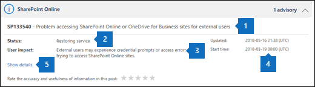
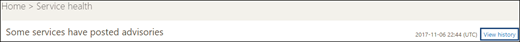

# Comment vérifier l’intégrité du service Office 365

Vous pouvez afficher l’intégrité d’Office 365, Yammer, Microsoft Dynamics CRM et services de cloud computing Microsoft Intune sur Office 365 ** d’intégrité du Service ** page dans le centre d’administration. Si vous rencontrez des problèmes avec un service en nuage, vous pouvez vérifier l’intégrité du service pour déterminer s’il s’agit d’un problème connu avec une résolution en cours avant d’appeler le support ou consacrez à la résolution des problèmes de temps. 
  
### Comment vérifier l’intégrité du service

1. Accédez à [https://portal.office.com/adminportal/home](https://portal.office.com/adminportal/home#/homepage) et la connexion avec un compte d’administrateur. 
    
    > [!NOTE]
    > Personnes qui sont affectées à l’administrateur global ou le rôle d’administrateur de service peuvent afficher l’intégrité du service. Pour permettre à Exchange, SharePoint et Skype pour les administrateurs d’entreprise afficher l’intégrité du service, ils doivent également être affectés le rôle d’administrateur de Service. 
  
2. Pour ouvrir l’intégrité du service, dans le centre d’administration, accédez à **la santé** \> **intégrité du Service**, ou cliquez sur le fonctionnement du Service de la carte du tableau de bord d’accueil. La carte de tableau de bord indique s’il existe un problème de service active et les liens vers la page de l’intégrité du service détaillées.
    
    
  
3. L’état d’intégrité de chaque service cloud s’affiche sous forme de tableau avec une icône pour indiquer les états possibles.
    
> [!TIP]
> Vous pouvez également utiliser l' [application d’administration d’Office 365](https://go.microsoft.com/fwlink/p/?linkid=627216) sur votre appareil mobile pour afficher l’intégrité du Service, qui est idéal pour garder le contact avec les notifications push. 
  
### Afficher les détails de l’intégrité du service validées

Dans l’affichage par défaut, tous les services et leur état d’intégrité actuel sont affichés. Pour filtrer l’affichage aux services actuellement rencontre un incident, sélectionnez **Incidents** dans la barre ombrée située à gauche. **Conseils** de sélection affiche uniquement les services qui possèdent un avis publié. À partir de l’affichage de **tous les services** , en cliquant sur l’état du service affiché ouvrira une vue récapitulative de l’avis ou un incident. 
  

  
L’avis ou le résumé de l’incident fournit les informations suivantes : 
  

  
1. Un problème identificateur et résumé instruction du problème.
    
2. L’état actuel. Voir les définitions d’état dans cet article pour obtenir une explication de chaque état potentiel.
    
3. Une description de la manière dont ce problème peut affecter les utilisateurs.
    
4. L’heure à laquelle le problème a été démarré et la dernière fois que le message de l’intégrité du service a été mis à jour. Pendant toute la durée d’un problème nous envoyer des messages fréquents pour vous informer de la progression que nous faisons dans l’application d’une solution.
    
5. Sélectionnez le lien **Afficher les détails** pour afficher plus d’informations sur le problème, y compris l’historique de tous les messages publiés pendant que nous travailler sur une solution. 
    
### Détails d’intégrité du service de traduction

Étant donné que des explications service d’intégrité sont validées en temps réel, ils ne sont pas traduits automatiquement à votre langue et les détails d’un événement de service sont en anglais uniquement. Pour traduire l’explication, procédez comme suit :
  
1. Accédez au [traducteur](https://www.bing.com/translator/).
    
2. Dans la page **intégrité du Service** , sélectionnez un avis ou un incident. Sous **Afficher les détails**, copiez le texte sur le problème.
    
3. Dans Translator, collez le texte, puis choisissez **traduire**.
    
### Définitions

La plupart des services de synchronisation s’affiche comme intègre sans informations complémentaires. Lorsqu’un service rencontre un problème, le problème est identifié comme un avis ou un incident et indique l’état actuel.
  
> [!TIP]
> Planifié la gestion des événements ne sont pas affichés dans le fonctionnement du service. Vous pouvez suivre les événements de maintenance prévues par les mises à jour avec le **Centre de messages**. Filtre pour les messages sont considérés comme Plan changement permettant de savoir quand la modification sur le point d’arriver, comment préparer et son effet. Pour plus d’informations, consultez la rubrique [Centre de messages dans Office 365](https://support.office.com/article/38fb3333-bfcc-4340-a37b-deda509c2093) . 
  
### Incidents et conseils

|||
|:-----|:-----|
||Si un service a un avis indiqué, nous avons pris connaissance d’un problème qui affecte certains utilisateurs, mais le service est toujours disponible. Dans un avis, il est souvent une solution de contournement à ce problème, le problème peut être intermittent ou impact étendue et l’utilisateur est limité.    |
||Si un service a un incident actif indiqué, il s’agit d’un problème critique et le service ou une fonction principale du service n’est pas disponible. Par exemple, utilisateurs Impossible d’envoyer et recevoir du courrier électronique ou Impossible de connexion. Incidents ont un impact notable aux utilisateurs. Lorsqu’il existe un incident en cours, nous fournissons des mises à jour concernant l’enquête, des efforts d’atténuation et de confirmation de la solution dans le tableau de bord de l’intégrité de Service.    |
   
### Définitions d’état

| |
|**État**|**Définition**|
|:-----|:-----|
|Étude    |Nous vous un problème potentiel et rassemblez plus d’informations sur ce qui se passe l’étendue de l’impact.    |
|Dégradation du service    |Nous avons vérifié qu’il existe un problème qui peut-être affecter l’utilisation d’un service ou la fonctionnalité. Vous pouvez voir ce statut si un service ne fonctionne plus lentement que d’habitude, il existe des interruptions intermittentes, ou si une fonctionnalité ne fonctionne pas, par exemple.    |
|Interruption de service    |Vous verrez ce statut si nous déterminons qu’un problème affecte la possibilité pour les utilisateurs d’accéder au service. Dans ce cas, le problème est important et peut être reproduit de façon cohérente.    |
|Restauration d’un service    |La cause du problème a été identifiée, nous savons quelle action corrective effectuer et en mettant le service à un état sain.    |
|Récupération d’étendue    |Cet état indique que les actions correctives sont en cours pour restaurer le service pour la plupart des utilisateurs mais prendront un certain temps pour atteindre tous les systèmes concernés. Vous pouvez également voir ce statut si nous avons apporté de correction pour réduire l’impact pendant que nous attendons pour appliquer un correctif permanent temporaire.    |
|Enquête suspendue    |Si notre analyse détaillée d’un problème potentiel se traduit par une demande pour plus d’informations à partir de clients pour nous permettre d’approfondir, vous voyez ce statut. Si vous devez agir, nous allons vous permettent de savoir quelles données ou des journaux, nous avons besoin.    |
|Service restauré    |Nous avons confirmé que les actions correctives a résolu le problème sous-jacent et le service a été restaurée à un état sain. Pour déterminer la cause du problème, afficher les détails du problème.    |
   
## Historique

Intégrité du service vous permet de consulter l’état d’intégrité actuel et afficher l’historique des incidents et conseils de service au cours des 30 derniers jours. Pour afficher la derniers d’intégrité de tous les services, sélectionnez **Afficher l’historique** sur la page **intégrité du Service** . 
  

  
Une liste de tous les messages de l’intégrité du service validées dans la période sélectionnée est affichée, comme indiqué ci-dessous :
  

  
Vous pouvez afficher l’historique des résultats pour les 7 derniers jours ou cours des 30 derniers jours. Sélectionnez une ligne pour afficher plus d’informations sur ce problème.
  
Pour plus d’informations sur notre engagement à temps de fonctionnement, voir [operations Transparent d’Office 365](https://go.microsoft.com/fwlink/?linkid=848695).
  
## Laisser des commentaires

Notre objectif est de vous assurer que les informations vous concernant un problème en cours soient utile, précise et en temps voulu. Pour nous indiquer comment nous faisons, sélectionnez un nombre d’étoiles. Une fois que vous donnez une note de 1 à 5 étoiles, vous pouvez donner des commentaires sur tous les détails. Nous allons utiliser vos commentaires afin d’affiner notre système de l’intégrité du service.
  

  
## Voir aussi

[Rapports sur les activités dans le centre d’administration d’Office 365](https://support.office.com/article/0d6dfb17-8582-4172-a9a9-aed798150263)

