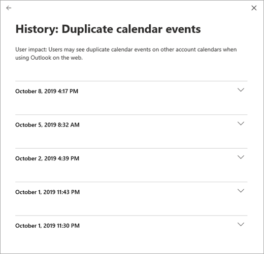

# Vérifier l'état du service Office 365How to check Office 365 service health

Vous pouvez afficher l’intégrité de vos services Microsoft, y compris Office sur le Web, Yammer, Microsoft Dynamics CRM et les services Cloud Microsoft Intune, sur la page d' **intégrité du service** Office 365 dans le centre d' [administration](https://go.microsoft.com/fwlink/p/?linkid=2024339).You can view the health of your Microsoft services, including Office on the web, Yammer, Microsoft Dynamics CRM, and Microsoft Intune cloud services, on the Office 365 **Service health** page in the [admin center](https://go.microsoft.com/fwlink/p/?linkid=2024339). If you are experiencing problems with a cloud service, you can check the service health to determine whether this is a known issue with a resolution in progress before you call support or spend time troubleshooting.If you are experiencing problems with a cloud service, you can check the service health to determine whether this is a known issue with a resolution in progress before you call support or spend time troubleshooting.

Si vous ne parvenez pas à vous connecter au service portail de service, vous pouvez utiliser la [page État du service](https://status.office365.com) pour vérifier les problèmes connus qui vous empêchent de vous connecter à votre client.If you are unable to sign in to the service portal, you can use the [service status page](https://status.office365.com) to check for known issues preventing you from logging into your tenant.
  
### Vérifier l'état du serviceHow to check service health

1. Accédez au centre d’administration à [https://admin.microsoft.com](https://go.microsoft.com/fwlink/p/?linkid=2024339)l’adresse, puis connectez-vous avec un compte d’administrateur.Go to the admin center at [https://admin.microsoft.com](https://go.microsoft.com/fwlink/p/?linkid=2024339), and sign in with an admin account.

    > [!NOTE]
    > Les personnes dotées d'un rôle d'administrateur général ou d'administrateur de service peuvent afficher l'état du service.People who are assigned the global admin or service administrator role can view service health. Pour afficher l'état du service, les administrateurs Exchange, SharePoint et Skype Entreprise doivent aussi disposer d'un rôle d'administrateur portant sur ce service.To allow Exchange, SharePoint, and Skype for Business admins to view service health, they must also be assigned the Service admin role. Pour plus d’informations sur les rôles qui peuvent afficher l’état des services, consultez la rubrique [à propos des rôles d’administrateur](https://docs.microsoft.com/office365/admin/add-users/about-admin-roles?view=o365-worldwide#roles-available-in-the-microsoft-365-admin-center).For more information about roles that can view service health, see [About admin roles](https://docs.microsoft.com/office365/admin/add-users/about-admin-roles?view=o365-worldwide#roles-available-in-the-microsoft-365-admin-center).
  
2. Si vous n’utilisez pas le nouveau centre d’administration, sur la page d’accueil, sélectionnez le bouton **essayer le nouveau centre d’administration** dans le coin supérieur droit.If you are not using the new admin center, on the Home page, select the **Try the new admin center** toggle in the upper-right corner.

3. Pour afficher l’état du service, dans le centre d’administration, accédez à intégrité du**service**d' **intégrité** > ou sélectionnez la carte d' **intégrité des services** dans le tableau de **bord d’accueil**.To view service health, in the admin center, go to **Health** > **Service health**, or select the **Service health** card on the **Home dashboard**. La carte de tableau de bord indique s’il existe un problème de service actif et des liens vers la page d’état détaillé du **service** .The dashboard card indicates whether there is an active service issue and links to the detailed **Service health** page.
  
4. Sur la page **État du service** , l’état d’intégrité de chaque service Cloud est indiqué dans un tableau.On the **Service health** page, the health state of each cloud service is shown in a table format.

   

L’onglet **tous les services** (affichage par défaut) affiche tous les services et leur état d’intégrité actuel.The **All services** tab (the default view) shows all services and their current health state. Une icône et la colonne d' **État** indiquent l’état de chaque service.An icon and the **Status** column indicate the state of each service. Pour filtrer votre vue sur les services rencontrant actuellement un incident, sélectionnez l’onglet **incidents** en haut de la page.To filter your view to services currently experiencing an incident, select the **Incidents** tab at the top of the page. La sélection de l’onglet **conseils** affiche uniquement les services pour lesquels un avis a déjà été publié.Selecting the **Advisories** tab will show only services that currently have an advisory posted. L’onglet **historique** affiche l’historique des incidents et des avis qui ont été résolus.The **History** tab shows the history of incidents and advisories that have been resolved.

Si vous rencontrez un problème qui n’apparaît pas dans la liste, sélectionnez **signaler un problème**, complétez le formulaire abrégé pour nous signaler le problème, puis sélectionnez **Envoyer**.If you're experiencing an issue that doesn't appear on the list, select **Report an issue**, complete the short form to tell us about the problem, and then select **Submit**.

> [!TIP]
> Vous pouvez également utiliser l'[application Office 365 Admin](https://go.microsoft.com/fwlink/p/?linkid=627216) sur votre appareil mobile pour afficher l'état du service, ce qui constitue un excellent moyen de vous tenir informé des notifications Push.You can also use the [Office 365 Admin app](https://go.microsoft.com/fwlink/p/?linkid=627216) on your mobile device to view Service health, which is a great way to stay current with push notifications. 
  
### Afficher les détails relatifs à l'état du service publiéView details of posted service health

Dans l’affichage **tous les services** , le choix de l’état du service ouvre une vue récapitulative des avis ou des incidents.On the **All services** view, selecting the service status will open a summary view of advisories or incidents.
  

Le récapitulatif de l'avis ou de l'incident fournit les informations suivantes :The advisory or incident summary provides the following information:

- **Title** -Résumé du problème.**Title** - A summary of the problem.
- **Service** : nom du service affecté.**Service** - The name of the affected service.
- **ID** : identificateur numérique du problème.**ID** - A numeric identifier for the problem.
- **Status** : impact de ce problème sur le service.**Status** - How this problem affects the service.
- **Heure de début** : heure de début du problème.**Start time** - The time when the issue started.
- **Dernière mise à jour** : date de la dernière mise à jour du message d’État du service.**Last updated** - The last time that the service health message was updated. Nous postons des messages fréquents pour vous informer de la progression de l’application d’une solution.We post frequent messages to let you know the progress that we're making in applying a solution.

Sélectionnez le titre du problème pour afficher la page des détails du problème, qui présente des informations supplémentaires sur le problème, notamment l' [historique](#history) de tous les messages publiés pendant que nous travaillons sur une solution.Select the issue title to see the issue detail page, which shows more information about the issue, including the [history](#history) of all messages posted while we work on a solution.

### Traduire les détails d'état du serviceTranslate service health details

Les explications relatives à l'état du service étant publiées en temps réel, elles ne sont pas traduites automatiquement dans votre langue, et les détails d'un événement de service sont uniquement disponibles en anglais. Pour traduire ces explications, procédez comme suit :Because service health explanations are posted in real-time, they are not automatically translated to your language and the details of a service event are in English only. To translate the explanation, follow these steps:
  
1. Accédez à [Translator](https://www.bing.com/translator/).Go to [Translator](https://www.bing.com/translator/).

2. Sur la page **État du Service**, sélectionnez un avis ou un incident. Sous **Afficher les détails**, copiez le texte relatif au problème.On the **Service health** page, select an incident or advisory. Under **Show details**, copy the text about the issue.

3. Dans Translator, collez le texte, puis sélectionnez **Traduire**.In Translator, paste the text and choose **Translate**.

### DéfinitionsDefinitions

La plupart du temps, les services s’affichent comme intègres sans autre information.Most of the time, services will appear as healthy with no further information. Lorsqu'un service présente un problème, ce problème est identifié sous forme d'avis ou d'incident et son état actuel s'affiche.When a service is having a problem, the issue is identified as either an advisory or an incident and shows a current status.
  
> [!TIP]
> Les événements de maintenance planifiée ne s'affichent pas dans l'état du service. Le **Centre de messages** vous permet de suivre les événements de maintenance planifiée. Filtrez les messages par Planification des modifications pour connaître le moment où une modification interviendra, son effet et comment vous y préparer. Pour plus d'informations, voir [Centre de messages dans Office 365](https://support.office.com/article/38fb3333-bfcc-4340-a37b-deda509c2093).Planned maintenance events aren't shown in service health. You can track planned maintenance events by staying up to date with the **Message center**. Filter to messages categorized as Plan for change to find out when the change is going to happen, its effect, and how to prepare for it. See [Message center in Office 365](https://support.office.com/article/38fb3333-bfcc-4340-a37b-deda509c2093) for more details.
  
### Incidents et avisIncidents and advisories

|||
|:-----|:-----|
||Un service accompagné d'un avis indique que nous sommes conscients du problème qui affecte certains utilisateurs, mais que ce service est toujours disponible. Un avis propose souvent une solution de contournement du problème, qui peut intermittent ou limité en termes d'impact sur les utilisateurs.If a service has an advisory shown, we are aware of a problem that is affecting some users, but the service is still available. In an advisory, there is often a workaround to the problem and the problem may be intermittent or is limited in scope and user impact.    |
||Si un service présente un incident actif, cela signifie qu'il s'agit d'un problème critique et que le service ou une de ses fonctions principales n'est pas disponible. Par exemple, les utilisateurs peuvent ne pas être en mesure d'envoyer et de recevoir des e-mails ni de se connecter. Les incidents ont un impact significatif sur les utilisateurs. En cas d'incident, nous publions des mises à jour relatives à son examen, aux efforts déployés pour y remédier, et sa résolution apparaît dans le tableau de bord d'état du service.If a service has an active incident shown, it's a critical issue and the service or a major function of the service is unavailable. For example, users may be unable to send and receive email or unable to sign-in. Incidents will have noticeable impact to users. When there is an incident in progress, we will provide updates regarding the investigation, mitigation efforts, and confirmation of resolution in the Service health dashboard.    |

### Définitions des étatsStatus definitions

|**État****Status**|**Définition****Definition**|
|:-----|:-----|
|**Examen en cours****Investigating** | Nous sommes conscients d'un problème potentiel et recueillons des informations sur ce problème et son impact.We're aware of a potential issue and are gathering more information about what's going on and the scope of impact. |
|**Dégradation du service****Service degradation** | Nous avons identifié un problème susceptible d'affecter l'utilisation d'un service ou d'une fonctionnalité. Cet état peut s'afficher si un service s'avère plus lent qu'habituellement, s'il présente des interruptions intermittentes ou si une fonctionnalité est défaillante, par exemple.We've confirmed that there is an issue that may affect use of a service or feature. You might see this status if a service is performing more slowly than usual, there are intermittent interruptions, or if a feature isn't working, for example. |
|**Interruption du service****Service interruption** | Cet état s'affiche si nous identifions un problème qui affecte la capacité des utilisateurs à accéder au service. Dans ce cas, le problème est significatif et peut se répéter.You'll see this status if we determine that an issue affects the ability for users to access the service. In this case, the issue is significant and can be reproduced consistently. |
|**Service en cours de restauration****Restoring service** | La cause du problème a été identifiée, nous connaissons l'action corrective à appliquer et le service est en cours de restauration.The cause of the issue has been identified, we know what corrective action to take, and are in the process of bringing the service back to a healthy state. |
|**Récupération étendue****Extended recovery** | Cet état indique qu'une action corrective est en cours afin de restaurer le service pour la plupart des utilisateurs, mais qu'il faudra un certain temps pour qu'elle s'applique à tous les systèmes concernés. Cet état peut également s'afficher si nous proposons un correctif temporaire visant à réduire l'impact du problème en attendant un correctif définitif.This status indicates that corrective action is in progress to restore service to most users but will take some time to reach all the affected systems. You might also see this status if we've made a temporary fix to reduce impact while we wait to apply a permanent fix. |
|**Examen suspendu****Investigation suspended** | Cet état s'affiche si l'examen détaillé d'un problème potentiel implique plus d'informations de la part des clients afin de nous permettre de mieux l'étudier. Dans ce cas, nous vous indiquerons les données ou journaux dont nous avons besoin.If our detailed investigation of a potential issue results in a request for additional information from customers to allow us to investigate further, you'll see this status. If we need you to act, we'll let you know what data or logs we need. |
|**Service restauré****Service restored** | L'action corrective a permis de résoudre le problème sous-jacent et le service a été restauré. Pour en savoir plus, consultez les détails relatifs au problème.We've confirmed that corrective action has resolved the underlying problem and the service has been restored to a healthy state. To find out what went wrong, view the issue details. |
|**Publication du rapport post-incident****Post-incident report published** | Nous avons publié un rapport de l’incident post pour un problème spécifique qui inclut les informations de la cause première et les étapes suivantes pour éviter que le problème ne se reproduise.We’ve published a Post Incident Report for a specific issue that includes root cause information and next steps to ensure a similar issue doesn’t reoccur. |

### HistoriqueHistory

L’état des services vous permet de consulter l’état actuel de l’intégrité et d’afficher l’historique des avis de service et des incidents qui ont affecté votre client au cours des 30 derniers jours.Service health lets you look at current health status and view the history of any service advisories and incidents that have affected your tenant in the past 30 days. Pour afficher l’intégrité passée de tous les services, sélectionnez **afficher l’historique** sur la page Détails du problème.To view the past health of all services, select **View history** on the issue detail page.
  

  
La liste de tous les messages d'état des services publiés au cours de la période sélectionnée s'affiche comme suit :A list of all service health messages posted in the selected timeframe is displayed, as shown below:
  

  
Développez une ligne pour afficher plus d’informations sur le problème.Expand any row to view more details about the issue.
  
Pour plus d’informations sur notre engagement en matière de disponibilité, consultez la rubrique [opérations transparentes d’Office 365](https://go.microsoft.com/fwlink/?linkid=848695).For more information about our commitment to uptime, see [Transparent operations from Office 365](https://go.microsoft.com/fwlink/?linkid=848695).
  
## Laisser un commentaireLeave feedback

Nous mettons tout en œuvre pour que les informations que nous vous fournissons soient opportunes, précises et utiles. Pour évaluer nos interventions, sélectionnez un nombre d'étoiles. Après nous avoir attribué une note de 1 à 5 étoiles, vous pouvez envoyer des commentaires sur des détails spécifiques. Nous utiliserons vos commentaires pour affiner notre système d'état des services.Our goal is to make sure that the information we provide to you about an ongoing issue is timely, accurate, and useful. To tell us how we're doing, select a star rating. After you give us a score from 1 to 5 stars, you can give feedback on any specific details. We'll use your feedback to fine-tune our service health system.
  
## Voir aussiSee also

[Rapports d’activité dans le centre d’administration Microsoft 365Activity Reports in the Microsoft 365 admin center](https://support.office.com/article/0d6dfb17-8582-4172-a9a9-aed798150263)